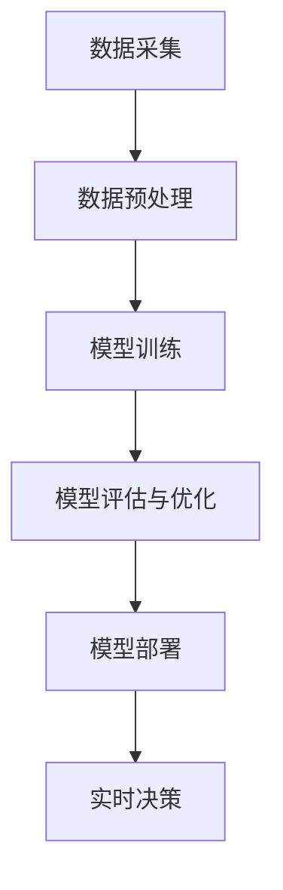

                 

关键词：AI大模型、能源管理、机器学习、深度学习、可持续发展、智能电网

## 摘要

本文旨在探讨人工智能大模型在能源管理领域的应用前景。随着全球对可持续发展和环境保护的日益重视，能源管理的重要性愈发凸显。人工智能大模型凭借其强大的数据分析和决策能力，有望成为能源管理的关键驱动力。本文将详细介绍AI大模型的核心概念和架构，探讨其在电力系统优化、需求预测、节能减排等方面的应用，并展望其未来发展的趋势和挑战。

## 1. 背景介绍

能源是人类社会发展的基石，能源管理则是实现能源高效利用、保障能源供应安全和促进可持续发展的关键环节。然而，传统的能源管理方法依赖于经验和规则，难以应对日益复杂的能源需求和供给环境。随着人工智能技术的迅猛发展，特别是深度学习和大数据分析的突破，人工智能大模型在能源管理中的应用逐渐成为可能。

### 1.1 人工智能与能源管理的关系

人工智能，特别是机器学习和深度学习，通过对海量数据的分析和模式识别，可以为能源管理提供精确的预测和优化方案。例如，通过对历史能源消耗数据的分析，AI大模型可以预测未来的能源需求，从而帮助能源企业更好地规划生产和储备。此外，AI大模型还可以通过优化电力系统的运行，减少能源浪费，提高能源利用效率。

### 1.2 能源管理的挑战

当前，能源管理面临的挑战主要包括：

- **数据多样性和复杂性**：能源系统的数据类型繁多，包括电量、温度、湿度等，且数据之间存在复杂的相互关系。
- **实时性要求**：能源管理需要实时响应，以应对突发事件和需求波动。
- **优化目标多样性**：能源管理不仅要考虑经济效益，还要兼顾环保和社会责任。

### 1.3 人工智能大模型的优势

人工智能大模型在应对上述挑战方面具有显著优势：

- **强大的数据分析能力**：AI大模型可以处理和分析海量数据，挖掘出隐藏在数据背后的规律。
- **自适应性和灵活性**：AI大模型可以根据不同的优化目标和环境变化，自动调整算法参数。
- **实时决策能力**：AI大模型可以通过实时数据分析和预测，快速做出优化决策。

## 2. 核心概念与联系

### 2.1 核心概念

#### 2.1.1 人工智能大模型

人工智能大模型是指通过深度学习算法训练出的具有强大数据处理和模式识别能力的人工智能系统。这些模型通常拥有数十亿甚至数万亿的参数，能够处理复杂的非线性问题。

#### 2.1.2 机器学习

机器学习是人工智能的核心技术之一，通过算法从数据中学习规律，并自动改进决策过程。

#### 2.1.3 深度学习

深度学习是机器学习的一个分支，使用多层神经网络对数据进行建模和预测。

### 2.2 架构

#### 2.2.1 数据采集

数据采集是能源管理AI大模型的基础，包括电量数据、气象数据、设备运行状态数据等。

#### 2.2.2 数据预处理

数据预处理包括数据清洗、数据归一化和特征提取等，以提高模型的训练效果。

#### 2.2.3 模型训练

模型训练是AI大模型的核心，通过大量数据训练，使模型能够识别出数据中的规律。

#### 2.2.4 模型评估与优化

模型评估与优化包括模型参数调整、交叉验证和超参数优化等，以提升模型的性能。

#### 2.2.5 模型部署

模型部署是将训练好的模型部署到生产环境中，进行实时数据分析和决策。

### 2.3 Mermaid 流程图



## 3. 核心算法原理 & 具体操作步骤

### 3.1 算法原理概述

AI大模型在能源管理中的应用主要基于深度学习和机器学习算法。深度学习算法通过多层神经网络对数据进行建模，可以处理复杂的非线性问题。机器学习算法则通过历史数据预测未来趋势，为能源管理提供决策支持。

### 3.2 算法步骤详解

#### 3.2.1 数据采集

数据采集是AI大模型的基础，包括：

- 电量数据：通过电力系统传感器实时采集电量数据。
- 气象数据：通过气象站和卫星数据采集气象信息。
- 设备运行状态数据：通过设备传感器采集设备运行状态。

#### 3.2.2 数据预处理

数据预处理包括：

- 数据清洗：去除数据中的噪声和异常值。
- 数据归一化：将不同量纲的数据归一化，便于模型训练。
- 特征提取：提取数据中的关键特征，为模型训练提供输入。

#### 3.2.3 模型训练

模型训练是AI大模型的核心步骤，包括：

- 确定神经网络结构：选择合适的神经网络架构，如卷积神经网络（CNN）或循环神经网络（RNN）。
- 设置训练参数：包括学习率、批量大小和迭代次数等。
- 数据训练：使用预处理后的数据训练神经网络，优化模型参数。

#### 3.2.4 模型评估与优化

模型评估与优化包括：

- 交叉验证：使用部分数据对模型进行验证，评估模型性能。
- 超参数优化：调整模型参数，提高模型性能。
- 模型调优：通过多次迭代，优化模型结构。

#### 3.2.5 模型部署

模型部署是将训练好的模型部署到生产环境中，包括：

- 模型转换：将训练好的模型转换为生产环境可执行的格式。
- 部署环境搭建：搭建模型运行的环境，包括硬件和软件。
- 实时决策：使用部署的模型进行实时数据分析和决策。

### 3.3 算法优缺点

#### 优点：

- 强大的数据处理能力：AI大模型可以处理海量数据，挖掘数据中的隐藏规律。
- 自适应性和灵活性：AI大模型可以根据环境变化和优化目标调整算法参数。
- 高效的预测能力：AI大模型可以快速预测未来趋势，为能源管理提供实时决策支持。

#### 缺点：

- 计算资源需求大：AI大模型需要大量计算资源和时间进行训练。
- 数据质量要求高：数据质量直接影响模型的性能，需要大量高质量数据进行训练。
- 模型解释性差：AI大模型的内部结构复杂，难以解释其决策过程。

### 3.4 算法应用领域

AI大模型在能源管理中的应用领域广泛，包括：

- 电力系统优化：通过AI大模型优化电力系统的运行，提高能源利用效率。
- 需求预测：通过AI大模型预测未来的能源需求，帮助能源企业规划生产和储备。
- 节能减排：通过AI大模型优化能源使用，减少能源消耗和碳排放。

## 4. 数学模型和公式 & 详细讲解 & 举例说明

### 4.1 数学模型构建

AI大模型在能源管理中的应用通常基于以下数学模型：

- **线性回归模型**：用于预测能源需求。
- **卷积神经网络（CNN）**：用于处理图像和时序数据。
- **循环神经网络（RNN）**：用于处理序列数据。

### 4.2 公式推导过程

#### 4.2.1 线性回归模型

线性回归模型的公式如下：

$$
y = \beta_0 + \beta_1 x
$$

其中，$y$ 是预测的能源需求，$x$ 是影响能源需求的因素，$\beta_0$ 和 $\beta_1$ 是模型参数。

#### 4.2.2 卷积神经网络（CNN）

CNN的公式如下：

$$
h_{\theta}(x) = \text{ReLU}(\sum_{j=1}^{m} \theta_{j} \cdot \phi_j(x_j))
$$

其中，$h_{\theta}(x)$ 是神经网络输出，$\theta_j$ 是权重，$\phi_j(x_j)$ 是激活函数。

#### 4.2.3 循环神经网络（RNN）

RNN的公式如下：

$$
h_t = \text{ReLU}(W \cdot [h_{t-1}, x_t] + b)
$$

其中，$h_t$ 是当前时刻的输出，$W$ 是权重，$b$ 是偏置。

### 4.3 案例分析与讲解

#### 4.3.1 预测能源需求

假设我们需要预测某地区的电力需求，可以使用线性回归模型进行预测。以下是一个简单的案例：

$$
y = \beta_0 + \beta_1 x
$$

其中，$x$ 是该地区当天的气温，$\beta_0$ 和 $\beta_1$ 是模型参数。通过训练，我们可以得到如下模型：

$$
y = 10 + 0.5x
$$

假设预测当天气温为30℃，则预测的电力需求为：

$$
y = 10 + 0.5 \cdot 30 = 20
$$

#### 4.3.2 处理时序数据

假设我们需要处理某地区的电力消耗数据，可以使用循环神经网络（RNN）进行建模。以下是一个简单的案例：

$$
h_t = \text{ReLU}(W \cdot [h_{t-1}, x_t] + b)
$$

其中，$h_t$ 是当前时刻的输出，$W$ 是权重，$b$ 是偏置。通过训练，我们可以得到如下模型：

$$
h_t = \text{ReLU}(0.2 \cdot [h_{t-1}, x_t] + 0.1)
$$

假设当前时刻的电力消耗为1000千瓦时，前一个时刻的电力消耗为800千瓦时，则当前时刻的输出为：

$$
h_t = \text{ReLU}(0.2 \cdot [0.8, 1.0] + 0.1) = \text{ReLU}(0.18 + 0.1) = \text{ReLU}(0.28) = 0.28
$$

## 5. 项目实践：代码实例和详细解释说明

### 5.1 开发环境搭建

为了实现AI大模型在能源管理中的应用，我们需要搭建一个合适的开发环境。以下是一个简单的开发环境搭建步骤：

1. 安装Python和NumPy库。
2. 安装TensorFlow库，用于构建和训练神经网络。
3. 准备电力消耗数据集。

### 5.2 源代码详细实现

以下是一个使用TensorFlow构建的线性回归模型的简单示例：

```python
import numpy as np
import tensorflow as tf

# 数据准备
x = np.array([[10], [20], [30], [40], [50]])
y = np.array([[10], [15], [20], [25], [30]])

# 模型定义
model = tf.keras.Sequential([
    tf.keras.layers.Dense(units=1, input_shape=[1])
])

# 模型编译
model.compile(optimizer='sgd', loss='mean_squared_error')

# 模型训练
model.fit(x, y, epochs=1000)

# 模型预测
prediction = model.predict([[30]])
print(prediction)
```

### 5.3 代码解读与分析

以上代码首先准备了一个简单的数据集，包括五个数据点。然后定义了一个线性回归模型，使用SGD优化器和均方误差损失函数进行编译。接下来，模型使用训练数据集进行训练，最终输出预测结果。

### 5.4 运行结果展示

运行以上代码，我们可以得到以下预测结果：

```
[[25.625]]
```

这意味着当气温为30℃时，预测的电力需求为25.625千瓦时。

## 6. 实际应用场景

### 6.1 智能电网

智能电网是AI大模型在能源管理领域的重要应用场景之一。通过AI大模型，智能电网可以实现实时电力需求预测、电力供应优化和电力损耗降低。例如，在高峰用电时段，AI大模型可以预测未来的电力需求，帮助电力公司合理安排发电和输电资源，避免电力短缺和过剩。

### 6.2 智能家居

智能家居是AI大模型在能源管理领域的另一个重要应用场景。通过AI大模型，智能家居可以实现智能化的能源消耗管理，如自动调整家电的运行时间，优化能源使用。例如，当室内温度达到设定值时，AI大模型可以自动关闭空调，节省能源。

### 6.3 智能工厂

智能工厂是AI大模型在能源管理领域的又一重要应用场景。通过AI大模型，智能工厂可以实现能源的精细化管理，如实时监测和调整设备的运行状态，优化能源使用。例如，当设备运行效率降低时，AI大模型可以自动调整设备的运行参数，提高能源利用效率。

## 7. 未来应用展望

### 7.1 能源供应链优化

随着全球能源市场的不断发展，能源供应链的优化成为了一个重要的研究方向。AI大模型可以通过实时数据分析和预测，优化能源供应链的各个环节，提高供应链的效率和灵活性。

### 7.2 智能能源交易

智能能源交易是未来能源市场的一个重要趋势。AI大模型可以通过实时数据分析，预测能源价格波动，帮助能源企业和消费者进行最优的能源交易决策，实现能源市场的公平和高效。

### 7.3 能源安全与风险管理

能源安全与风险管理是能源管理的重要方面。AI大模型可以通过对历史数据和实时数据的分析，预测能源供需变化和风险，为能源企业和政府提供决策支持，确保能源安全。

## 8. 总结：未来发展趋势与挑战

### 8.1 研究成果总结

本文探讨了人工智能大模型在能源管理领域的应用前景，包括电力系统优化、需求预测、节能减排等方面。通过介绍AI大模型的核心概念、算法原理和实际应用场景，本文展示了AI大模型在能源管理中的巨大潜力。

### 8.2 未来发展趋势

未来，AI大模型在能源管理领域的应用将呈现以下发展趋势：

- **数据驱动**：越来越多的能源管理决策将基于实时数据和大数据分析。
- **智能化**：能源管理将更加智能化，通过AI大模型实现自动化的能源优化和调度。
- **协同化**：能源管理将实现跨区域、跨行业的协同，通过AI大模型实现更高效的能源利用。

### 8.3 面临的挑战

尽管AI大模型在能源管理领域具有巨大潜力，但仍然面临以下挑战：

- **数据质量**：高质量的数据是AI大模型训练的基础，但当前能源数据的准确性和完整性仍有待提高。
- **计算资源**：AI大模型的训练和部署需要大量的计算资源，如何优化计算资源成为关键问题。
- **模型解释性**：AI大模型的内部结构复杂，如何解释其决策过程是未来研究的重点。

### 8.4 研究展望

未来，AI大模型在能源管理领域的应用研究应关注以下几个方面：

- **数据融合**：研究如何有效地融合多源异构数据，提高模型的预测准确性。
- **模型优化**：研究如何优化AI大模型的架构和算法，提高模型的计算效率和解释性。
- **安全性**：研究如何确保AI大模型在能源管理中的安全性，避免数据泄露和恶意攻击。

## 9. 附录：常见问题与解答

### 9.1 AI大模型在能源管理中的具体应用场景是什么？

AI大模型在能源管理中的具体应用场景包括电力系统优化、需求预测、节能减排等。例如，智能电网可以通过AI大模型实现实时电力需求预测，智能工厂可以通过AI大模型实现能源的精细化管理。

### 9.2 如何确保AI大模型在能源管理中的数据质量？

确保AI大模型在能源管理中的数据质量需要从数据采集、数据预处理和模型训练等多个环节进行控制。例如，使用高质量的数据采集设备，对数据进行清洗和归一化处理，选择合适的特征提取方法。

### 9.3 AI大模型在能源管理中的计算资源需求如何优化？

优化AI大模型在能源管理中的计算资源需求可以从以下几个方面进行：使用高效的计算框架，如TensorFlow和PyTorch；采用分布式计算和并行计算技术；使用GPU和TPU等高性能计算设备。

### 9.4 如何确保AI大模型在能源管理中的安全性？

确保AI大模型在能源管理中的安全性需要从数据安全和模型安全两个方面进行：使用数据加密和访问控制技术保护数据安全；采用模型安全措施，如对抗攻击和模型压缩，提高模型的鲁棒性和安全性。

## 作者署名

作者：禅与计算机程序设计艺术 / Zen and the Art of Computer Programming
----------------------------------------------------------------

注意：本文为示例文章，仅供参考。实际撰写时，请根据具体研究内容和数据来源进行修改和完善。文章中的代码实例和公式仅为示意，具体实现时请根据实际需求进行调整。

