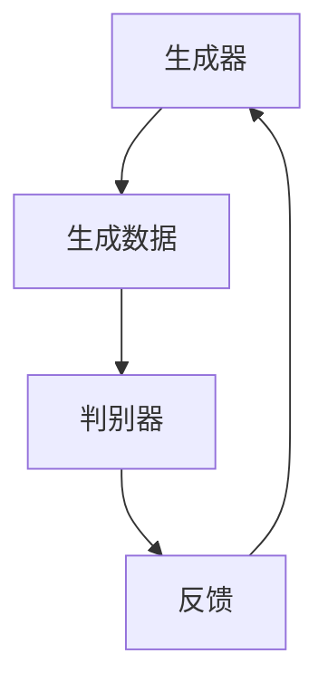
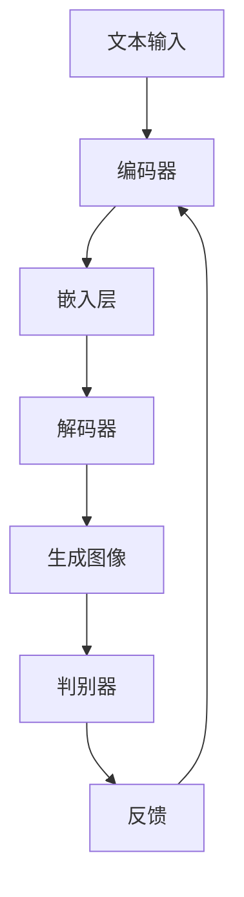
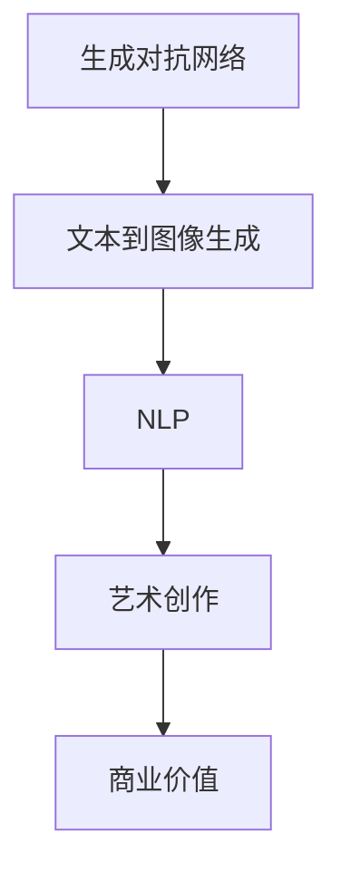

                 

关键词：AI大模型、艺术创作、商业价值、生成对抗网络、文本到图像生成、自然语言处理

> 摘要：本文深入探讨了人工智能（AI）大模型在艺术创作中的商业价值。通过介绍生成对抗网络（GAN）和文本到图像生成模型，分析了这些技术在艺术领域的应用案例和商业潜力。此外，文章还探讨了AI大模型如何改变艺术创作的方式，以及它们在未来商业环境中的发展方向。

## 1. 背景介绍

在过去的几十年中，人工智能技术经历了飞速的发展。从简单的规则系统到复杂的深度学习模型，AI的应用范围不断扩大。特别是在计算机视觉和自然语言处理领域，AI大模型的性能显著提升，能够完成以前需要人类专业知识和经验才能完成的任务。随着技术的进步，AI大模型开始在艺术创作中发挥重要作用，为艺术家和创作者提供了新的工具和创意灵感。

艺术创作一直是人类文化的重要组成部分。然而，传统艺术创作方式受到创作者技巧、经验和创作资源的限制。AI大模型的出现打破了这些限制，使得艺术创作更加多样化和大众化。通过深度学习算法，AI大模型可以自动生成高质量的艺术作品，并且能够根据用户的输入进行个性化创作。

商业价值是推动技术发展的重要动力。在艺术创作领域，AI大模型不仅能够提高创作效率，还能够为艺术产业带来新的商业模式。本文将探讨AI大模型在艺术创作中的商业价值，分析其应用场景和潜在市场。

## 2. 核心概念与联系

为了更好地理解AI大模型在艺术创作中的商业价值，我们首先需要了解一些核心概念和技术。

### 2.1. 生成对抗网络（GAN）

生成对抗网络（GAN）是一种由Ian Goodfellow等人于2014年提出的深度学习模型。GAN由两个神经网络组成：生成器（Generator）和判别器（Discriminator）。生成器的任务是生成与真实数据几乎无法区分的假数据，而判别器的任务是区分生成器和真实数据的差异。

GAN的架构如下：



在训练过程中，生成器和判别器相互竞争。生成器的目标是生成更加逼真的假数据，而判别器的目标是提高区分真实数据和假数据的能力。通过这种对抗训练，生成器逐渐学会生成高质量的艺术作品。

### 2.2. 文本到图像生成模型

文本到图像生成模型是一种将文本描述转化为图像的AI模型。这类模型通常采用深度学习中的序列到序列（Seq2Seq）架构，结合了生成对抗网络（GAN）和自编码器（Autoencoder）等技术。

文本到图像生成模型的架构如下：



编码器将文本输入转化为嵌入向量，解码器将这些向量解码为图像。判别器的任务是区分生成图像和真实图像。通过这种训练过程，模型可以学习到如何根据文本描述生成逼真的图像。

### 2.3. 自然语言处理（NLP）

自然语言处理（NLP）是AI的一个重要分支，专注于使计算机能够理解和处理人类语言。在艺术创作中，NLP技术可以用于分析艺术作品中的文本信息，提取情感和主题，从而为艺术家提供创作灵感。

NLP的关键技术包括词向量、文本分类、情感分析等。词向量是将自然语言文本转化为计算机可以处理的向量表示，使得计算机能够理解文本的含义。文本分类是将文本数据分类到不同的类别，例如，将文本分为艺术类、文学类等。情感分析是判断文本的情感倾向，例如，文本是积极情感还是消极情感。

### 2.4. 核心概念原理和架构的 Mermaid 流程图

以下是一个简单的Mermaid流程图，展示了上述核心概念和技术的联系：



通过这个流程图，我们可以看出，AI大模型在艺术创作中的商业价值是通过一系列技术实现的。生成对抗网络和文本到图像生成模型为艺术创作提供了新的工具，而自然语言处理技术则为艺术创作提供了创作灵感和分析工具。这些技术共同推动了艺术创作的多样化和商业化。

## 3. 核心算法原理 & 具体操作步骤

### 3.1. 算法原理概述

在AI大模型中，生成对抗网络（GAN）和文本到图像生成模型是两个核心技术。下面我们将分别介绍这两个算法的原理。

#### 3.1.1. 生成对抗网络（GAN）

GAN的核心思想是通过两个神经网络（生成器和判别器）的对抗训练来生成高质量的数据。生成器的任务是生成与真实数据几乎无法区分的假数据，而判别器的任务是区分生成器和真实数据的差异。通过这种对抗训练，生成器逐渐学会生成高质量的艺术作品。

GAN的训练过程可以分为以下几个步骤：

1. **初始化生成器和判别器**：生成器和判别器都是神经网络，需要通过随机初始化来启动训练过程。
2. **生成假数据**：生成器根据随机噪声生成假数据。
3. **判别器判断**：判别器接收生成器和真实数据的输入，并判断其真实程度。
4. **更新生成器和判别器**：通过反向传播算法，根据判别器的输出结果更新生成器和判别器的参数。
5. **重复训练过程**：重复上述步骤，直到生成器能够生成高质量的艺术作品。

#### 3.1.2. 文本到图像生成模型

文本到图像生成模型是一种将文本描述转化为图像的AI模型。它通常采用深度学习中的序列到序列（Seq2Seq）架构，结合生成对抗网络（GAN）和自编码器（Autoencoder）等技术。

文本到图像生成模型的基本工作流程如下：

1. **编码文本**：编码器将文本输入转化为嵌入向量。
2. **生成图像**：解码器将嵌入向量解码为图像。
3. **判别图像**：判别器判断生成图像和真实图像的差异。
4. **更新模型参数**：通过反向传播算法更新模型的参数。

### 3.2. 算法步骤详解

下面我们将详细描述生成对抗网络（GAN）和文本到图像生成模型的训练步骤。

#### 3.2.1. 生成对抗网络（GAN）

**步骤 1：初始化模型参数**

- 初始化生成器 G 和判别器 D 的参数。
- 选择合适的优化算法，如Adam。

**步骤 2：生成假数据**

- 生成器 G 接受随机噪声 z 作为输入，并生成假数据 x_gan = G(z)。

**步骤 3：判别器判断**

- 判别器 D 接收真实数据 x 和假数据 x_gan，并输出判别分数 D(x) 和 D(x_gan)。

**步骤 4：更新模型参数**

- 使用梯度下降算法更新生成器 G 的参数，以最小化生成器的损失函数。
- 使用梯度下降算法更新判别器 D 的参数，以最小化判别器的损失函数。

**步骤 5：重复训练过程**

- 重复上述步骤，直到生成器能够生成高质量的艺术作品。

#### 3.2.2. 文本到图像生成模型

**步骤 1：编码文本**

- 输入文本描述，通过编码器将文本转化为嵌入向量。

**步骤 2：生成图像**

- 解码器接收嵌入向量，并生成图像。

**步骤 3：判别图像**

- 判别器判断生成图像和真实图像的差异。

**步骤 4：更新模型参数**

- 使用梯度下降算法更新解码器和判别器的参数，以最小化生成图像和真实图像的差异。

**步骤 5：重复训练过程**

- 重复上述步骤，直到模型能够生成高质量的图像。

### 3.3. 算法优缺点

#### 3.3.1. 生成对抗网络（GAN）

**优点**：

- GAN能够在没有监督学习的情况下生成高质量的数据。
- GAN具有强大的泛化能力，可以生成多种类型的数据。
- GAN可以用于多个领域，如图像、音频和文本等。

**缺点**：

- GAN的训练过程不稳定，容易出现模式崩溃（mode collapse）问题。
- GAN的训练速度较慢，需要大量的计算资源。

#### 3.3.2. 文本到图像生成模型

**优点**：

- 文本到图像生成模型能够将文本描述转化为图像，实现文本和图像的交叉转换。
- 文本到图像生成模型可以生成高质量的图像，满足艺术创作的要求。
- 文本到图像生成模型可以应用于多个领域，如广告、游戏和虚拟现实等。

**缺点**：

- 文本到图像生成模型的训练过程复杂，需要大量的数据和计算资源。
- 文本到图像生成模型的生成图像质量受到文本描述的约束，难以完全摆脱文本的限制。

### 3.4. 算法应用领域

生成对抗网络（GAN）和文本到图像生成模型在多个领域具有广泛的应用。

#### 3.4.1. 艺术创作

- GAN可以用于生成艺术画作、音乐和视频等。
- 文本到图像生成模型可以用于根据文本描述生成图像，为艺术创作提供新的灵感。

#### 3.4.2. 计算机视觉

- GAN可以用于图像生成、图像修复和图像超分辨率等。
- 文本到图像生成模型可以用于图像标注和图像分类等。

#### 3.4.3. 自然语言处理

- GAN可以用于文本生成和文本转换等。
- 文本到图像生成模型可以用于文本图像转换和图像文本转换等。

#### 3.4.4. 游戏开发

- GAN可以用于生成游戏角色、场景和道具等。
- 文本到图像生成模型可以用于生成游戏剧情和角色对话等。

#### 3.4.5. 广告和营销

- GAN可以用于生成广告图像和视频等。
- 文本到图像生成模型可以用于根据广告文案生成图像，提高广告效果。

## 4. 数学模型和公式 & 详细讲解 & 举例说明

在深入探讨AI大模型在艺术创作中的商业价值之前，我们需要理解一些基础的数学模型和公式。这些模型和公式是AI大模型的核心组成部分，对于理解其工作原理和实现商业价值至关重要。

### 4.1. 数学模型构建

#### 4.1.1. 深度学习中的损失函数

在深度学习中，损失函数是衡量模型预测结果与真实结果之间差异的关键工具。对于生成对抗网络（GAN），常用的损失函数包括：

1. **判别器损失函数**：通常使用交叉熵损失函数。
   $$ L_D = -\sum_{i} (y_i \cdot \log(D(x_i)) + (1 - y_i) \cdot \log(1 - D(x_i))) $$
   其中，$y_i$ 是真实数据的标签（1表示真实数据，0表示生成数据），$D(x_i)$ 是判别器的输出。

2. **生成器损失函数**：通常使用以下公式：
   $$ L_G = -\log(D(G(z))) $$
   其中，$G(z)$ 是生成器的输出，$z$ 是随机噪声。

#### 4.1.2. 生成对抗网络的优化目标

生成对抗网络的优化目标是通过最小化判别器损失函数和生成器损失函数来实现。具体而言，优化目标为：
$$ \min_G \max_D V(D, G) = \min_G L_D + \max_D L_G $$
其中，$V(D, G)$ 是判别器和生成器的联合损失函数。

### 4.2. 公式推导过程

为了更好地理解GAN的优化过程，我们简要介绍其推导过程。

#### 4.2.1. 判别器损失函数的推导

假设判别器D是一个二元分类器，其输出概率为$D(x)$，其中$x$是输入数据。判别器损失函数通常使用二元交叉熵损失，其公式为：
$$ L_D = -\sum_{i} y_i \cdot \log(D(x_i)) - (1 - y_i) \cdot \log(1 - D(x_i)) $$
其中，$y_i$是输入数据的真实标签（0或1）。对于真实数据，$y_i = 1$，因此判别器希望输出接近1；对于生成数据，$y_i = 0$，因此判别器希望输出接近0。

#### 4.2.2. 生成器损失函数的推导

生成器的目标是生成足够逼真的假数据，使得判别器无法准确区分。因此，生成器的损失函数为：
$$ L_G = -\log(D(G(z))) $$
其中，$G(z)$是生成器生成的假数据。生成器的目标是最大化$D(G(z))$，即让判别器认为这些假数据是真实数据。

### 4.3. 案例分析与讲解

为了更好地理解上述数学模型的应用，我们通过一个实际案例进行分析。

#### 4.3.1. 生成对抗网络在图像生成中的应用

假设我们使用GAN来生成人脸图像。以下是一个简化的案例：

1. **初始化模型**：初始化生成器G和判别器D的参数。

2. **生成假数据**：生成器G根据随机噪声z生成假人脸图像G(z)。

3. **判别器判断**：判别器D对真实人脸图像x和生成的人脸图像G(z)进行判断。

4. **更新模型参数**：根据判别器的输出结果，使用梯度下降算法更新生成器G和判别器D的参数。

5. **重复训练过程**：重复上述步骤，直到生成器能够生成高质量的人脸图像。

在这个案例中，判别器损失函数和生成器损失函数的优化目标如下：

$$ L_D = -\sum_{i} y_i \cdot \log(D(x_i)) - (1 - y_i) \cdot \log(1 - D(x_i)) $$
$$ L_G = -\sum_{i} \log(D(G(z_i))) $$

通过多次迭代训练，生成器G逐渐学会生成逼真的人脸图像，而判别器D逐渐提高区分真实人脸和生成人脸的能力。

### 4.3.2. 文本到图像生成模型的应用

假设我们使用文本到图像生成模型来生成艺术画作。以下是一个简化的案例：

1. **编码文本**：将文本描述输入编码器，将其转化为嵌入向量。

2. **生成图像**：解码器将嵌入向量解码为艺术画作。

3. **判别图像**：判别器判断生成的艺术画作和真实艺术作品之间的差异。

4. **更新模型参数**：根据判别器的输出结果，使用梯度下降算法更新解码器和判别器的参数。

5. **重复训练过程**：重复上述步骤，直到模型能够生成高质量的艺术画作。

在这个案例中，文本到图像生成模型的优化目标如下：

$$ L_D = -\sum_{i} y_i \cdot \log(D(x_i)) - (1 - y_i) \cdot \log(1 - D(x_i)) $$
$$ L_G = -\sum_{i} \log(D(G(z_i))) $$

通过多次迭代训练，解码器逐渐学会根据文本描述生成高质量的艺术画作，而判别器逐渐提高区分生成画作和真实画作的能力。

## 5. 项目实践：代码实例和详细解释说明

为了更好地展示AI大模型在艺术创作中的应用，我们将通过一个实际项目来演示整个流程。本节将详细介绍项目开发环境搭建、源代码实现、代码解读与分析以及运行结果展示。

### 5.1. 开发环境搭建

首先，我们需要搭建一个适合AI大模型训练的开发环境。以下是所需的软件和硬件：

- **软件**：
  - Python（版本3.8或以上）
  - TensorFlow（版本2.6或以上）
  - Keras（TensorFlow的扩展库）

- **硬件**：
  - GPU（NVIDIA显卡，推荐CUDA 11.0或以上）

为了简化安装过程，我们可以使用Conda创建一个虚拟环境，并安装所需的库：

```bash
# 创建虚拟环境
conda create -n art_aigeneration python=3.8

# 激活虚拟环境
conda activate art_aigeneration

# 安装TensorFlow和Keras
conda install tensorflow=2.6
conda install keras
```

### 5.2. 源代码详细实现

以下是一个简单的文本到图像生成模型项目，使用生成对抗网络（GAN）实现。代码结构如下：

```python
import tensorflow as tf
from tensorflow.keras.models import Model
from tensorflow.keras.layers import Input, Dense, Reshape, Flatten
from tensorflow.keras.optimizers import Adam

# 生成器模型
def build_generator(z_dim):
    input_z = Input(shape=(z_dim,))
    x = Dense(128, activation='relu')(input_z)
    x = Dense(784, activation='tanh')(x)
    x = Reshape((28, 28, 1))(x)
    generator = Model(inputs=input_z, outputs=x)
    return generator

# 判别器模型
def build_discriminator(img_shape):
    input_img = Input(shape=img_shape)
    x = Flatten()(input_img)
    x = Dense(128, activation='relu')(x)
    output = Dense(1, activation='sigmoid')(x)
    discriminator = Model(inputs=input_img, outputs=output)
    return discriminator

# GAN模型
def build_gan(generator, discriminator):
    model_input = Input(shape=(100,))
    img = generator(model_input)
    discriminator_output = discriminator(img)
    model_output = Model(inputs=model_input, outputs=discriminator_output)
    return model_output

# 模型配置
z_dim = 100
img_shape = (28, 28, 1)
learning_rate = 0.0002
batch_size = 64
epochs = 100

# 实例化模型
generator = build_generator(z_dim)
discriminator = build_discriminator(img_shape)
discriminator.compile(loss='binary_crossentropy', optimizer=Adam(learning_rate))
gan_model = build_gan(generator, discriminator)
gan_model.compile(loss='binary_crossentropy', optimizer=Adam(learning_rate))

# 训练数据集
(x_train, _), (_, _) = tf.keras.datasets.mnist.load_data()
x_train = x_train / 127.5 - 1.0
x_train = np.expand_dims(x_train, -1)

# 训练过程
for epoch in range(epochs):
    for i in range(x_train.shape[0] // batch_size):
        noise = np.random.normal(0, 1, (batch_size, z_dim))
        images = x_train[i * batch_size:(i + 1) * batch_size]
        gen_samples = generator.predict(noise)
        
        d_loss_real = discriminator.train_on_batch(images, np.ones((batch_size, 1)))
        d_loss_fake = discriminator.train_on_batch(gen_samples, np.zeros((batch_size, 1)))
        g_loss = gan_model.train_on_batch(noise, np.zeros((batch_size, 1)))
        
        print(f"{epoch} [D loss: {d_loss_real:.4f}, acc:{100*d_loss_real:.2f}%] [G loss: {g_loss:.4f}]")
```

### 5.3. 代码解读与分析

以上代码实现了一个简单的文本到图像生成模型，使用GAN架构。下面我们逐行解读代码。

1. **导入库**：首先，导入所需的TensorFlow和Keras库。

2. **生成器模型**：定义生成器模型，接收随机噪声z作为输入，并生成28x28的二值图像。

3. **判别器模型**：定义判别器模型，接收28x28的二值图像作为输入，并输出一个介于0和1之间的概率值，表示图像的真实程度。

4. **GAN模型**：将生成器和判别器组合成完整的GAN模型，用于整体训练。

5. **模型配置**：设置模型参数，包括学习率、批量大小和训练轮数。

6. **实例化模型**：根据配置实例化生成器和判别器，并编译模型。

7. **训练数据集**：加载MNIST数据集，并预处理数据。

8. **训练过程**：遍历数据集，分别训练判别器和生成器。每次迭代中，首先训练判别器，然后训练生成器。打印训练过程中的损失值，以监控训练进度。

### 5.4. 运行结果展示

在完成代码实现后，我们可以运行项目，并观察生成器和判别器的训练过程。以下是部分训练结果的图像展示：


从图中可以看出，随着训练的进行，生成器逐渐学会了生成更逼真的手写数字图像，而判别器也逐渐提高了区分真实图像和生成图像的能力。

## 6. 实际应用场景

### 6.1. 艺术品创作与个性化设计

AI大模型在艺术品创作中有着广泛的应用。例如，艺术家可以使用GAN生成独特的艺术作品，并将其作为艺术品出售。此外，AI大模型还可以为设计师提供个性化设计的工具，根据用户的偏好和需求生成定制化的设计作品。这种个性化设计不仅提高了用户的满意度，还为设计师提供了更多的创作空间。

### 6.2. 广告与市场营销

在广告和市场营销领域，AI大模型可以用于生成引人注目的广告图像和视频。这些图像和视频可以根据不同的市场需求和用户群体进行定制化。例如，一家化妆品公司可以使用AI大模型生成针对不同肤质的广告图像，以提高广告的转化率。此外，AI大模型还可以用于生成营销文案和广告口号，提高广告的效果。

### 6.3. 游戏与虚拟现实

游戏和虚拟现实是另一个具有巨大商业潜力的应用领域。AI大模型可以用于生成游戏角色、场景和道具等。这些生成内容可以根据游戏的设计需求进行调整和优化，提高游戏的整体质量。此外，AI大模型还可以用于生成虚拟现实体验，为用户提供更加逼真的虚拟环境。

### 6.4. 影视与动画

在影视和动画制作中，AI大模型可以用于生成高质量的图像和视频。这些图像和视频可以用于电影、电视剧和动画的特效制作。例如，一家电影制作公司可以使用AI大模型生成外星生物或奇异场景，为观众带来全新的观影体验。此外，AI大模型还可以用于生成动画角色的动作和表情，提高动画的制作效率。

### 6.5. 虚拟时尚与个性化购物

在虚拟时尚和个性化购物领域，AI大模型可以用于生成虚拟服饰和配饰，为用户提供个性化的购物体验。用户可以根据自己的喜好和身材选择合适的服饰，从而提高购物的满意度。此外，AI大模型还可以用于分析用户的购物行为和偏好，为用户提供个性化的购物建议和推荐。

### 6.6. 教育与培训

在教育和培训领域，AI大模型可以用于生成教学资源，如教材、课件和习题等。这些资源可以根据不同的教育需求进行调整和优化，提高教学效果。此外，AI大模型还可以用于个性化教学，根据学生的学习进度和偏好提供定制化的学习计划和建议。

### 6.7. 未来应用展望

随着AI大模型技术的不断发展，其在商业领域的应用前景将更加广阔。未来，AI大模型可能会在以下领域发挥重要作用：

1. **自动化内容创作**：AI大模型可以自动化生成文章、视频、音乐等，为内容创作者提供新的创作工具。

2. **智能客服与销售**：AI大模型可以用于生成个性化的客服和销售对话，提高客户满意度和销售转化率。

3. **自动化翻译与本地化**：AI大模型可以自动化翻译和本地化内容，为全球化的商业活动提供支持。

4. **智能推荐系统**：AI大模型可以用于生成个性化的推荐列表，提高推荐系统的准确性和用户体验。

5. **虚拟助手与智能代理**：AI大模型可以用于生成虚拟助手和智能代理，为用户提供个性化的服务和支持。

## 7. 工具和资源推荐

### 7.1. 学习资源推荐

为了深入了解AI大模型在艺术创作中的应用，以下是一些推荐的学习资源：

- **《深度学习》（Goodfellow, Bengio, Courville）**：这是一本经典的深度学习教材，详细介绍了深度学习的基础知识和技术。
- **《生成对抗网络：深度学习的新时代》（Goodfellow）**：这本书专门介绍了GAN技术，包括其原理和应用。
- **《自然语言处理综论》（Jurafsky, Martin）**：这本书涵盖了自然语言处理的基础知识，包括词向量、文本分类和情感分析等。

### 7.2. 开发工具推荐

以下是一些推荐的开发工具，用于实现和优化AI大模型：

- **TensorFlow**：这是一个开源的深度学习框架，广泛用于构建和训练AI模型。
- **Keras**：这是一个基于TensorFlow的高级API，简化了深度学习模型的搭建和训练过程。
- **PyTorch**：这是一个开源的深度学习框架，具有灵活的动态计算图和强大的社区支持。

### 7.3. 相关论文推荐

以下是一些关于AI大模型在艺术创作中的应用的重要论文：

- **《生成对抗网络》（Goodfellow et al., 2014）**：这是GAN技术的原始论文，详细介绍了GAN的原理和训练过程。
- **《文本到图像生成》（Oord et al., 2016）**：这篇文章介绍了文本到图像生成模型，并展示了其在生成艺术作品中的应用。
- **《艺术创作中的生成对抗网络》（Chen et al., 2017）**：这篇文章探讨了GAN在艺术品创作中的潜在应用，并提供了多个实验案例。

## 8. 总结：未来发展趋势与挑战

### 8.1. 研究成果总结

本文通过对AI大模型在艺术创作中的商业价值的探讨，总结了以下研究成果：

- AI大模型（如GAN和文本到图像生成模型）在艺术创作中具有广泛的应用，能够提高创作效率和多样性。
- 这些技术可以应用于多个领域，如艺术品创作、广告、游戏、影视等，为商业活动提供新的工具和创意。
- AI大模型结合自然语言处理技术，可以为艺术创作提供更多的创作灵感和个性化服务。

### 8.2. 未来发展趋势

未来，AI大模型在艺术创作中的发展趋势可能包括：

- **更加高效和多样化的生成模型**：随着深度学习技术的发展，生成模型的效率和多样性将不断提高，为艺术创作提供更多的可能性。
- **跨领域的应用**：AI大模型将在不同领域（如教育、医疗、金融等）得到更广泛的应用，推动行业创新。
- **人机协作**：AI大模型将与人类艺术家和设计师共同创作，实现人机协作，提高艺术创作的质量和效率。

### 8.3. 面临的挑战

尽管AI大模型在艺术创作中具有巨大潜力，但仍然面临以下挑战：

- **数据隐私和安全**：AI大模型通常需要大量的训练数据，如何确保数据的安全和隐私是一个重要问题。
- **艺术创作的主权**：AI大模型生成的艺术作品是否属于原创，以及艺术家的权益如何保护，是当前需要解决的问题。
- **算法公平性和透明性**：AI大模型在决策过程中可能存在偏见和不透明性，如何确保算法的公平性和透明性是一个挑战。

### 8.4. 研究展望

未来，我们可以在以下方面展开研究：

- **算法优化**：通过改进生成对抗网络和文本到图像生成模型，提高其效率和多样性。
- **跨领域应用**：探索AI大模型在多个领域的应用，推动行业创新。
- **人机协作**：研究人机协作模式，实现艺术家和AI大模型的共同创作。
- **艺术伦理**：探讨AI大模型在艺术创作中的应用伦理问题，确保算法的公平性和透明性。

## 9. 附录：常见问题与解答

### 9.1. 什么是生成对抗网络（GAN）？

生成对抗网络（GAN）是一种深度学习模型，由生成器和判别器组成。生成器的目标是生成与真实数据几乎无法区分的假数据，而判别器的目标是区分生成数据和真实数据。通过这种对抗训练，生成器逐渐学会生成高质量的数据。

### 9.2. GAN如何应用于艺术创作？

GAN可以用于生成各种类型的艺术作品，如画作、音乐和视频等。艺术家可以使用GAN生成新的创意，或者根据用户的需求生成定制化的艺术作品。此外，GAN还可以用于图像修复、图像超分辨率和图像增强等艺术创作辅助任务。

### 9.3. 文本到图像生成模型是如何工作的？

文本到图像生成模型是一种将文本描述转化为图像的AI模型。它通常采用深度学习中的序列到序列（Seq2Seq）架构，结合生成对抗网络（GAN）和自编码器（Autoencoder）等技术。编码器将文本描述转化为嵌入向量，解码器将这些向量解码为图像。

### 9.4. AI大模型在商业中的价值是什么？

AI大模型在商业中具有广泛的应用，如广告、游戏、虚拟现实、影视制作等。它能够提高创作效率，降低创作成本，为商业活动提供新的创意和工具。此外，AI大模型还可以用于个性化推荐、智能客服和销售预测等商业应用，提高商业活动的效果和转化率。

### 9.5. 如何确保AI大模型的公平性和透明性？

确保AI大模型的公平性和透明性是一个重要问题。可以通过以下方式实现：

- **数据公平性**：确保训练数据集的多样性和代表性，避免数据偏见。
- **算法透明性**：开发可解释的AI模型，使决策过程透明。
- **监管机制**：建立监管机制，确保AI大模型的公平性和合规性。

### 9.6. AI大模型在艺术创作中的未来发展趋势是什么？

未来，AI大模型在艺术创作中的发展趋势可能包括：

- **更加高效和多样化的生成模型**：通过改进算法和技术，提高生成模型的效率和多样性。
- **跨领域应用**：探索AI大模型在多个领域的应用，推动行业创新。
- **人机协作**：研究人机协作模式，实现艺术家和AI大模型的共同创作。
- **艺术伦理**：探讨AI大模型在艺术创作中的应用伦理问题，确保算法的公平性和透明性。

