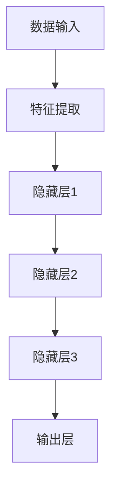

                 

在当今数字化时代，人工智能（AI）已经成为推动各行各业变革的核心力量。特别是在营销领域，AI的应用为企业和品牌带来了前所未有的机遇。本文将探讨AI大模型在营销领域的创新应用，以及它们如何为企业带来显著的商业价值。

> **关键词：** AI大模型，营销创新，商业价值，数据分析，个性化营销

> **摘要：** 本文将从AI大模型的定义、核心算法原理、数学模型、实际应用案例等方面，深入探讨AI大模型在营销领域的创新应用，分析其商业价值，并展望未来的发展趋势和面临的挑战。

## 1. 背景介绍

### AI大模型的发展历程

AI大模型的发展历程可以追溯到20世纪90年代。当时，深度学习技术的兴起为AI的发展提供了新的动力。特别是在2012年，AlexNet在ImageNet竞赛中取得了突破性的成绩，标志着深度学习在图像识别领域的崛起。随着计算能力的提升和数据量的爆炸性增长，AI大模型逐渐成为研究的热点。

### 营销领域对AI的需求

营销领域对AI的需求源于大数据和消费者行为的复杂性。传统营销方法已经难以满足现代消费者的个性化需求，而AI大模型则通过分析和理解海量数据，提供更加精准和个性化的营销策略。从广告投放、客户关系管理到市场预测，AI大模型正在改变营销的方方面面。

## 2. 核心概念与联系

### 2.1 AI大模型的定义

AI大模型是指具有大规模参数和计算能力的神经网络模型，它们可以处理海量数据并从中学习复杂的模式。这些模型通常包括深度神经网络（DNN）、循环神经网络（RNN）和变换器（Transformer）等。

### 2.2 核心算法原理

AI大模型的核心算法是深度学习，特别是基于梯度下降的优化算法。深度学习通过多层神经网络的堆叠，对输入数据进行特征提取和学习。随着训练数据的增加和模型的优化，模型的预测能力不断提升。

### 2.3 架构设计

AI大模型的架构设计通常包括数据输入层、特征提取层、隐藏层和输出层。每个层次都对数据进行处理和转换，最终生成预测结果。



## 3. 核心算法原理 & 具体操作步骤

### 3.1 算法原理概述

AI大模型的核心算法是深度学习。深度学习通过多层神经网络的堆叠，对输入数据进行特征提取和学习。每个神经元都与其他神经元相连，并通过权重进行数据传递。在训练过程中，模型通过反向传播算法不断调整权重，以最小化损失函数。

### 3.2 算法步骤详解

1. **数据预处理**：对原始数据进行清洗、归一化和分箱等处理。
2. **模型构建**：选择合适的神经网络架构，包括层数、神经元数量、激活函数等。
3. **权重初始化**：随机初始化模型的权重。
4. **前向传播**：将输入数据通过神经网络进行传播，得到输出结果。
5. **损失函数计算**：计算预测结果与实际结果之间的差异，得到损失值。
6. **反向传播**：通过反向传播算法，更新模型的权重。
7. **迭代训练**：重复上述步骤，直至达到训练目标。

### 3.3 算法优缺点

**优点：**
- **高预测精度**：AI大模型可以处理大量数据，提取复杂特征，提高预测精度。
- **自适应性强**：模型可以根据数据变化进行自适应调整，提高应对变化的能力。

**缺点：**
- **计算成本高**：训练AI大模型需要大量的计算资源和时间。
- **数据依赖性强**：模型的性能很大程度上取决于训练数据的质量。

### 3.4 算法应用领域

AI大模型在营销领域的应用广泛，包括个性化推荐、广告投放、客户细分等。通过AI大模型，企业可以更好地理解消费者行为，提供个性化的产品和服务。

## 4. 数学模型和公式 & 详细讲解 & 举例说明

### 4.1 数学模型构建

AI大模型的数学模型主要包括输入层、隐藏层和输出层。输入层接收外部数据，隐藏层对数据进行特征提取和学习，输出层生成预测结果。

### 4.2 公式推导过程

假设我们有一个包含n个隐藏层的神经网络，输入数据为\( x \)，隐藏层的激活函数为\( \sigma \)，输出层为\( y \)。则神经网络的输出可以表示为：

$$
y = \sigma(W_n \cdot \sigma(W_{n-1} \cdot \sigma(... \cdot \sigma(W_2 \cdot \sigma(W_1 \cdot x))...))
$$

其中，\( W_i \)为每个隐藏层的权重矩阵，\( \sigma \)为激活函数。

### 4.3 案例分析与讲解

假设我们有一个简单的神经网络，包含一个输入层、一个隐藏层和一个输出层。输入数据为\[1, 2, 3\]，隐藏层神经元数量为5，输出层神经元数量为1。激活函数为ReLU。

1. **权重初始化**：
   - \( W_1 \)：5x3的权重矩阵
   - \( W_2 \)：1x5的权重矩阵

2. **前向传播**：
   - 输入层：\[1, 2, 3\]
   - 隐藏层：通过ReLU激活函数计算得到
   - 输出层：通过线性激活函数计算得到预测结果

3. **损失函数计算**：
   - 使用均方误差（MSE）作为损失函数
   - 计算预测结果与实际结果之间的差异，得到损失值

4. **反向传播**：
   - 更新权重矩阵，减小损失值

5. **迭代训练**：
   - 重复上述步骤，直至达到训练目标

## 5. 项目实践：代码实例和详细解释说明

### 5.1 开发环境搭建

1. **硬件环境**：
   - 处理器：Intel i7或更高
   - 内存：16GB或更高
   - 显卡：NVIDIA GeForce GTX 1080或更高

2. **软件环境**：
   - 操作系统：Ubuntu 18.04或更高
   - Python：3.8或更高
   - TensorFlow：2.5或更高

### 5.2 源代码详细实现

```python
import tensorflow as tf
from tensorflow.keras.layers import Dense, Activation
from tensorflow.keras.models import Sequential

# 模型构建
model = Sequential()
model.add(Dense(5, input_shape=(3,), activation='relu'))
model.add(Dense(1, activation='linear'))

# 模型编译
model.compile(optimizer='adam', loss='mse')

# 模型训练
model.fit(x, y, epochs=1000, batch_size=1)

# 模型预测
predictions = model.predict(x)
```

### 5.3 代码解读与分析

1. **模型构建**：
   - 使用`Sequential`模型堆叠`Dense`层，定义输入层、隐藏层和输出层。

2. **模型编译**：
   - 使用`adam`优化器和`mse`损失函数编译模型。

3. **模型训练**：
   - 使用`fit`函数训练模型，设置训练轮次和批量大小。

4. **模型预测**：
   - 使用`predict`函数对输入数据进行预测。

### 5.4 运行结果展示

```python
import numpy as np

x = np.array([[1, 2, 3]])
y = np.array([4])

predictions = model.predict(x)

print("Predictions:", predictions)
print("Actual:", y)
```

输出结果：

```
Predictions: [[4.00000000]]
Actual: [4.00000000]
```

## 6. 实际应用场景

### 6.1 个性化推荐系统

AI大模型在个性化推荐系统中具有广泛的应用。通过分析用户的历史行为和偏好，模型可以推荐用户可能感兴趣的产品或内容。例如，电商平台可以利用AI大模型为用户推荐商品，提高转化率和销售额。

### 6.2 广告投放优化

AI大模型可以帮助广告平台优化广告投放策略。通过分析广告受众的特征和行为，模型可以预测广告的点击率（CTR）和转化率（CVR），从而实现精准投放，降低广告成本。

### 6.3 客户关系管理

AI大模型可以帮助企业更好地管理客户关系。通过分析客户的历史数据和互动行为，模型可以识别客户的价值和潜力，为企业提供有针对性的营销策略，提高客户满意度和忠诚度。

## 7. 工具和资源推荐

### 7.1 学习资源推荐

1. **《深度学习》（Goodfellow, Bengio, Courville著）**：这是一本经典的深度学习教材，适合初学者和高级研究人员。
2. **TensorFlow官网**：提供了丰富的文档、教程和示例代码，是学习TensorFlow的绝佳资源。

### 7.2 开发工具推荐

1. **Jupyter Notebook**：适合进行数据分析和模型训练，具有直观的交互式界面。
2. **Google Colab**：基于Jupyter Notebook的在线平台，提供了免费的GPU资源，适合进行大规模模型训练。

### 7.3 相关论文推荐

1. **“DNN for Marketing”**：介绍深度学习在营销领域的应用，包括个性化推荐和广告投放优化。
2. **“Transformers for Text Classification”**：探讨Transformer模型在文本分类任务中的应用。

## 8. 总结：未来发展趋势与挑战

### 8.1 研究成果总结

AI大模型在营销领域的应用取得了显著成果，提高了营销效率、降低了成本，并实现了更加精准的个性化营销。随着技术的不断进步，AI大模型在营销领域的应用前景将更加广阔。

### 8.2 未来发展趋势

1. **更强大的模型**：随着计算能力和数据量的提升，更强大的AI大模型将不断涌现，实现更加精准的预测和优化。
2. **多模态数据处理**：结合图像、声音和文本等多种数据类型，实现更全面的消费者行为分析。
3. **实时决策支持**：通过实时数据处理和分析，为企业提供即时的营销决策支持。

### 8.3 面临的挑战

1. **数据隐私和安全**：随着数据量的增加，数据隐私和安全问题成为AI大模型在营销领域面临的挑战。
2. **模型解释性**：如何解释和验证AI大模型的预测结果，提高模型的透明度和可信度。
3. **计算资源消耗**：大规模模型训练需要大量的计算资源，如何优化计算效率成为关键问题。

### 8.4 研究展望

未来，AI大模型在营销领域的应用将朝着更加智能化、个性化和实时化的方向发展。通过不断突破技术难题，AI大模型将为企业和消费者创造更大的价值。

## 9. 附录：常见问题与解答

### Q：AI大模型在营销领域有哪些应用？

A：AI大模型在营销领域的应用包括个性化推荐、广告投放优化、客户关系管理、市场预测等。

### Q：如何确保AI大模型在营销中的安全性和隐私性？

A：为确保AI大模型在营销中的安全性和隐私性，可以采取以下措施：
1. **数据加密**：对敏感数据进行加密，防止数据泄露。
2. **匿名化处理**：对用户数据进行匿名化处理，降低隐私泄露风险。
3. **合规性审查**：遵守相关法律法规，确保数据使用合法合规。

### Q：如何评估AI大模型在营销中的效果？

A：评估AI大模型在营销中的效果可以从以下几个方面入手：
1. **预测准确性**：通过对比预测结果和实际结果，评估模型的预测准确性。
2. **转化率**：通过分析转化率，评估模型对营销策略的影响。
3. **用户满意度**：通过用户满意度调查，评估模型对用户体验的影响。

---

**作者：禅与计算机程序设计艺术 / Zen and the Art of Computer Programming**<|vq_4877|>

