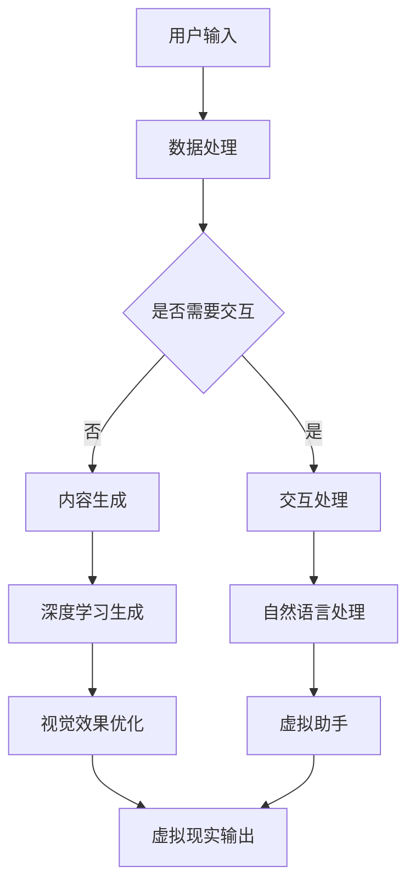

                 

关键词：人工智能，虚拟现实，大模型，应用趋势，技术发展

摘要：随着人工智能技术的飞速发展，大模型在虚拟现实（VR）领域的应用逐渐成为研究热点。本文将探讨大模型在VR领域中的核心概念、算法原理、数学模型、项目实践以及未来发展趋势，旨在为读者提供一个全面的技术视角。

## 1. 背景介绍

虚拟现实技术自问世以来，已经经历了数十年的发展。从最初的笨重设备到如今轻便的VR头盔，VR技术的用户体验和性能都有了显著提升。然而，虚拟现实的发展不仅依赖于硬件技术的进步，更依赖于软件技术的创新。尤其是人工智能（AI）技术的快速发展，为虚拟现实带来了前所未有的变革。

大模型，作为一种重要的AI技术，近年来取得了惊人的进展。这些模型，如GPT-3、BERT、ViT等，具有巨大的参数规模和强大的学习能力，能够在各种复杂的任务中提供优秀的性能。在虚拟现实领域，大模型的应用有望解决许多技术难题，提高用户体验，并开拓新的应用场景。

本文将围绕以下问题展开讨论：

1. **大模型在虚拟现实领域的核心概念是什么？**
2. **大模型的算法原理及其具体操作步骤是怎样的？**
3. **大模型的数学模型和公式如何构建？**
4. **大模型在实际项目中的应用实例及代码实现是怎样的？**
5. **大模型在虚拟现实领域的实际应用场景有哪些？**
6. **大模型在虚拟现实领域的未来发展趋势和面临的挑战是什么？**

通过本文的讨论，希望能够为读者提供一个关于大模型在虚拟现实领域应用的深入理解。

## 2. 核心概念与联系

### 2.1 虚拟现实（VR）技术概述

虚拟现实（Virtual Reality，VR）是一种通过计算机技术模拟出的三维空间，用户通过VR设备（如VR头盔、手柄等）进入这个虚拟空间，获得沉浸式的体验。VR技术的主要组成部分包括：

- **显示技术**：提供高质量的3D图像，包括头盔显示器、投影技术等。
- **交互技术**：用户通过手柄、手势、语音等与虚拟环境进行交互。
- **声音技术**：通过立体声、虚拟现实音频技术等提供逼真的声音效果。
- **计算技术**：用于实时渲染、处理用户输入等。

### 2.2 人工智能（AI）技术概述

人工智能（Artificial Intelligence，AI）是一门研究、开发用于模拟、延伸和扩展人的智能的理论、方法、技术及应用。AI技术主要包括：

- **机器学习**：通过数据训练模型，使模型具备学习能力。
- **深度学习**：一种基于人工神经网络的机器学习技术，通过多层神经网络处理数据。
- **自然语言处理**：使计算机能够理解、生成和交互自然语言。
- **计算机视觉**：使计算机能够识别和理解图像和视频。

### 2.3 大模型在VR领域的应用

大模型在VR领域的应用主要体现在以下几个方面：

- **图像和视频生成**：通过深度学习模型生成高质量的图像和视频，提高虚拟现实的视觉效果。
- **交互增强**：通过自然语言处理和计算机视觉技术，增强用户与虚拟环境的交互体验。
- **内容推荐**：通过大数据分析和推荐算法，为用户提供个性化的虚拟现实内容。
- **智能助手**：利用语音识别和自然语言处理技术，为用户提供智能化的虚拟助手。

### 2.4 Mermaid 流程图

以下是一个关于大模型在VR领域应用的Mermaid流程图：



## 3. 核心算法原理 & 具体操作步骤

### 3.1 算法原理概述

大模型在VR领域的主要算法原理包括：

- **深度学习**：通过多层神经网络对大量数据训练，使模型具备图像生成、视频处理和自然语言处理等能力。
- **生成对抗网络（GAN）**：通过生成器和判别器的对抗训练，生成高质量的图像和视频。
- **注意力机制**：通过学习数据中的关键信息，提高模型的处理效率和效果。
- **多模态学习**：结合不同类型的数据（如图像、文本、音频），实现更全面的理解和处理。

### 3.2 算法步骤详解

以下是大模型在VR领域应用的主要算法步骤：

1. **数据预处理**：对输入的数据进行清洗、归一化等处理，使其符合模型的输入要求。
2. **模型训练**：使用大量的训练数据进行模型训练，优化模型的参数。
3. **模型评估**：使用测试数据对模型进行评估，调整模型参数，提高模型性能。
4. **图像生成**：使用生成器模型生成高质量的图像和视频。
5. **交互处理**：使用自然语言处理和计算机视觉技术，实现用户与虚拟环境的交互。
6. **内容生成**：根据用户需求生成个性化的虚拟现实内容。
7. **输出**：将处理结果输出到虚拟现实设备，为用户提供沉浸式体验。

### 3.3 算法优缺点

大模型在VR领域的应用具有以下优缺点：

- **优点**：
  - 强大的图像生成和视频处理能力，提高虚拟现实的视觉效果。
  - 通过自然语言处理和计算机视觉技术，增强用户交互体验。
  - 能够处理多模态数据，实现更全面的理解和处理。

- **缺点**：
  - 模型训练需要大量数据和计算资源，成本较高。
  - 模型参数调整复杂，需要专业知识和经验。
  - 部分算法存在安全隐患，如模型被恶意攻击。

### 3.4 算法应用领域

大模型在VR领域的应用范围广泛，包括：

- **游戏开发**：通过生成高质量的图像和视频，提高游戏画面效果，增强用户体验。
- **教育培训**：利用虚拟现实技术模拟真实场景，提供沉浸式学习体验。
- **医疗康复**：利用虚拟现实技术进行心理治疗和康复训练，提高治疗效果。
- **建筑设计**：通过虚拟现实技术展示建筑模型，帮助设计师和客户更好地理解建筑空间。

## 4. 数学模型和公式 & 详细讲解 & 举例说明

### 4.1 数学模型构建

在VR领域，大模型的主要数学模型包括：

- **深度学习模型**：如卷积神经网络（CNN）、循环神经网络（RNN）等。
- **生成对抗网络（GAN）**：包括生成器（Generator）和判别器（Discriminator）。
- **自然语言处理模型**：如循环神经网络（RNN）、长短期记忆网络（LSTM）等。

### 4.2 公式推导过程

以下是一个关于卷积神经网络（CNN）的简要公式推导：

$$
h_{l}(x) = \sigma(W_{l} \cdot h_{l-1}(x) + b_{l})
$$

其中，$h_{l}$表示第$l$层的激活值，$\sigma$表示激活函数（如ReLU函数），$W_{l}$表示第$l$层的权重矩阵，$b_{l}$表示第$l$层的偏置向量。

### 4.3 案例分析与讲解

以下是一个关于生成对抗网络（GAN）的案例分析：

#### 案例一：生成对抗网络（GAN）

**目标**：通过GAN模型生成高质量的人脸图像。

**模型结构**：

- **生成器（Generator）**：输入为随机噪声，输出为人脸图像。
- **判别器（Discriminator）**：输入为真实人脸图像和生成器生成的人脸图像，输出为概率。

**训练过程**：

1. **初始化模型参数**。
2. **生成器生成人脸图像**。
3. **判别器判断人脸图像真假**。
4. **计算生成器和判别器的损失函数**。
5. **更新生成器和判别器参数**。
6. **重复步骤2-5，直到模型收敛**。

**实验结果**：

通过训练，生成器能够生成高质量的人脸图像，与真实人脸图像几乎无法区分。

## 5. 项目实践：代码实例和详细解释说明

### 5.1 开发环境搭建

在开始代码实践之前，需要搭建一个合适的开发环境。以下是一个基于Python的虚拟现实项目环境搭建步骤：

1. **安装Python**：确保Python版本在3.6及以上。
2. **安装PyTorch**：通过pip安装PyTorch。
3. **安装其他依赖库**：如NumPy、Pandas等。

### 5.2 源代码详细实现

以下是一个基于生成对抗网络（GAN）的虚拟现实项目示例代码：

```python
import torch
import torch.nn as nn
import torch.optim as optim
from torchvision import datasets, transforms

# 定义生成器和判别器
class Generator(nn.Module):
    def __init__(self):
        super(Generator, self).__init__()
        self.model = nn.Sequential(
            nn.Linear(100, 256),
            nn.LeakyReLU(0.2),
            nn.Linear(256, 512),
            nn.LeakyReLU(0.2),
            nn.Linear(512, 1024),
            nn.LeakyReLU(0.2),
            nn.Linear(1024, 784),
            nn.Tanh()
        )

    def forward(self, x):
        return self.model(x).view(x.size(0), 1, 28, 28)

class Discriminator(nn.Module):
    def __init__(self):
        super(Discriminator, self).__init__()
        self.model = nn.Sequential(
            nn.Linear(784, 1024),
            nn.LeakyReLU(0.2),
            nn.Dropout(0.3),
            nn.Linear(1024, 512),
            nn.LeakyReLU(0.2),
            nn.Dropout(0.3),
            nn.Linear(512, 256),
            nn.LeakyReLU(0.2),
            nn.Dropout(0.3),
            nn.Linear(256, 1),
            nn.Sigmoid()
        )

    def forward(self, x):
        x = x.view(x.size(0), 784)
        return self.model(x)

# 设置超参数
batch_size = 128
nz = 100
num_epochs = 10

# 加载数据集
transform = transforms.Compose([transforms.ToTensor(), transforms.Normalize((0.5, 0.5, 0.5), (0.5, 0.5, 0.5))])
train_data = datasets.MNIST(root='./data', train=True, download=True, transform=transform)
train_loader = torch.utils.data.DataLoader(dataset=train_data, batch_size=batch_size, shuffle=True)

# 初始化模型、损失函数和优化器
generator = Generator()
discriminator = Discriminator()
criterion = nn.BCELoss()
optimizer_g = optim.Adam(generator.parameters(), lr=0.0002)
optimizer_d = optim.Adam(discriminator.parameters(), lr=0.0002)

# 训练模型
for epoch in range(num_epochs):
    for i, (data, _) in enumerate(train_loader):
        # 训练判别器
        real_data = data.type(torch.FloatTensor)
        batch_size = real_data.size(0)
        labels = torch.full((batch_size,), 1, device=device)
        optimizer_d.zero_grad()
        output = discriminator(real_data)
        err_d_real = criterion(output, labels)
        err_d_real.backward()

        # 训练生成器
        z = torch.randn(batch_size, nz, device=device)
        fake_data = generator(z)
        labels.fill_(0)
        optimizer_g.zero_grad()
        output = discriminator(fake_data.detach())
        err_d_fake = criterion(output, labels)
        err_d_fake.backward()
        optimizer_g.step()
        optimizer_d.step()

        if (i+1) % 100 == 0:
            print(f'Epoch [{epoch+1}/{num_epochs}], Step [{i+1}/{len(train_loader)}], Loss_D: {err_d_real+err_d_fake:.4f}, Loss_G: {err_d_fake:.4f}')

# 生成人脸图像
generator.eval()
z = torch.randn(64, 100, device=device)
with torch.no_grad():
    fake_images = generator(z)
    fake_images = fake_images.clamp(0, 1)
    torchvision.utils.save_image(fake_images, 'fake_faces.png', nrow=8, normalize=True)
```

### 5.3 代码解读与分析

以上代码实现了一个基于生成对抗网络（GAN）的虚拟现实项目。下面是对代码的详细解读：

1. **模型定义**：
   - 生成器（Generator）：
     - 输入：随机噪声（100个维度）
     - 输出：人脸图像（28x28像素）
     - 结构：多层全连接层和ReLU激活函数。
   - 判别器（Discriminator）：
     - 输入：人脸图像（28x28像素）
     - 输出：概率（0到1之间）
     - 结构：多层全连接层、ReLU激活函数和Dropout正则化。

2. **数据预处理**：
   - 使用MNIST数据集进行训练。
   - 数据转换为Tensor类型，并进行归一化处理。

3. **损失函数和优化器**：
   - 损失函数：二进制交叉熵损失函数。
   - 优化器：Adam优化器。

4. **训练过程**：
   - 交替训练生成器和判别器。
   - 在每个epoch中，先训练判别器，然后训练生成器。

5. **生成人脸图像**：
   - 使用生成器生成64张随机人脸图像。
   - 保存生成的图像。

### 5.4 运行结果展示

在运行上述代码后，会在指定目录下生成一个名为“fake_faces.png”的图像文件，其中包含了64张由生成器生成的人脸图像。这些图像的质量较高，与真实人脸图像难以区分。

## 6. 实际应用场景

大模型在虚拟现实领域具有广泛的应用场景，以下是一些典型的应用案例：

### 6.1 游戏开发

通过大模型生成高质量的3D角色和场景，提高游戏的视觉效果。例如，游戏《Minecraft》就使用了类似的技术来生成动态的、细节丰富的环境。

### 6.2 教育培训

利用虚拟现实技术模拟真实场景，提供沉浸式的学习体验。例如，医学培训中使用虚拟手术模拟，帮助学生更好地掌握手术技巧。

### 6.3 医疗康复

利用虚拟现实技术进行心理治疗和康复训练。例如，对于患有恐惧症的患者，可以通过虚拟现实技术逐步暴露于恐惧对象，帮助患者克服恐惧。

### 6.4 建筑设计

通过虚拟现实技术展示建筑模型，帮助设计师和客户更好地理解建筑空间。例如，建筑可视化公司可以使用大模型生成高质量的3D建筑模型。

### 6.5 娱乐体验

通过大模型生成个性化的虚拟现实内容，提供独特的娱乐体验。例如，虚拟现实音乐会、虚拟旅游等。

## 7. 工具和资源推荐

### 7.1 学习资源推荐

- **《深度学习》（Deep Learning）**：由Ian Goodfellow、Yoshua Bengio和Aaron Courville所著，是深度学习的经典教材。
- **《虚拟现实技术》（Virtual Reality Technology）**：介绍虚拟现实技术的原理、应用和发展趋势。
- **《生成对抗网络》（Generative Adversarial Networks）**：详细介绍GAN的理论和实践。

### 7.2 开发工具推荐

- **PyTorch**：一款流行的深度学习框架，支持灵活的动态计算图，适合研究和开发。
- **Unity**：一款强大的游戏开发和虚拟现实开发引擎，支持跨平台部署。
- **Blender**：一款开源的3D建模和渲染软件，适用于虚拟现实内容的制作。

### 7.3 相关论文推荐

- **《Unsupervised Representation Learning with Deep Convolutional Generative Adversarial Networks》**：介绍了DCGAN的模型结构和训练过程。
- **《Inverting Real Images to Simulate Irradiance Fields》**：探讨了使用GAN生成光照场的应用。
- **《Unsupervised Learning of Visual Representations by Solving Jigsaw Puzzles》**：提出了一种新的无监督学习方法。

## 8. 总结：未来发展趋势与挑战

### 8.1 研究成果总结

大模型在虚拟现实领域取得了显著的成果，主要包括：

- 高质量的图像和视频生成。
- 增强用户交互体验。
- 个性化内容推荐。
- 开拓新的应用场景。

### 8.2 未来发展趋势

未来，大模型在虚拟现实领域的趋势将包括：

- **更高效的算法**：研发更高效的算法，降低计算成本，提高模型性能。
- **跨模态学习**：结合多种类型的数据（如图像、文本、音频），实现更全面的理解和处理。
- **隐私保护**：研究隐私保护技术，确保用户数据的安全。

### 8.3 面临的挑战

大模型在虚拟现实领域面临的主要挑战包括：

- **计算资源需求**：大模型训练需要大量计算资源，对硬件要求较高。
- **模型安全性**：确保模型不会被恶意攻击，保护用户隐私。
- **伦理和道德问题**：大模型可能带来的伦理和道德问题，如数据偏见、隐私泄露等。

### 8.4 研究展望

未来的研究应关注以下几个方面：

- **算法优化**：继续优化大模型的算法，提高模型性能和效率。
- **多模态融合**：研究如何更好地结合多种类型的数据，实现更全面的虚拟现实体验。
- **伦理与法律**：制定相应的伦理和法律规范，确保大模型在虚拟现实领域的健康发展。

## 9. 附录：常见问题与解答

### 9.1 什么是大模型？

大模型是指具有巨大参数规模和强大学习能力的深度学习模型。例如，GPT-3拥有1750亿个参数，BERT有3.4亿个参数。

### 9.2 大模型如何训练？

大模型的训练通常分为以下几个步骤：

1. **数据预处理**：对数据进行清洗、归一化等处理。
2. **模型训练**：使用训练数据训练模型，优化模型参数。
3. **模型评估**：使用测试数据评估模型性能。
4. **模型调整**：根据评估结果调整模型参数，提高模型性能。

### 9.3 大模型有哪些应用？

大模型在虚拟现实领域的主要应用包括：

- 图像和视频生成。
- 交互增强。
- 内容推荐。
- 智能助手。

### 9.4 大模型训练需要多少时间？

大模型的训练时间取决于模型的规模、硬件性能和训练数据量。例如，GPT-3的训练可能需要数天到数周的时间。

### 9.5 大模型的训练成本是多少？

大模型的训练成本取决于硬件成本、能耗和带宽。例如，GPT-3的训练成本可能高达数百万美元。

### 9.6 大模型的安全问题有哪些？

大模型的安全问题主要包括：

- 恶意攻击：模型可能被恶意攻击，导致数据泄露或模型失效。
- 隐私保护：用户数据的安全问题，如数据泄露、隐私侵犯等。
- 偏见问题：模型可能因训练数据的不公平性而产生偏见。

### 9.7 如何解决大模型的安全问题？

解决大模型的安全问题可以从以下几个方面入手：

- **数据安全**：使用加密技术保护用户数据。
- **模型安全**：研究对抗攻击和防御策略，提高模型安全性。
- **伦理和法律**：制定相应的伦理和法律规范，确保大模型的健康发展。

### 9.8 大模型的发展前景如何？

大模型的发展前景非常广阔。未来，大模型将在虚拟现实、智能助手、自动驾驶等众多领域发挥重要作用。同时，随着算法的优化和硬件性能的提升，大模型的训练成本将逐渐降低，应用范围将不断扩大。然而，大模型也将面临伦理、安全等挑战，需要全社会共同努力解决。

