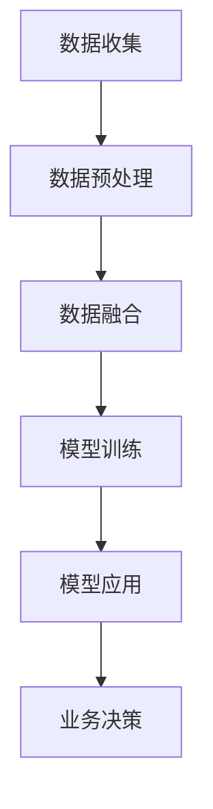

                 

关键字：AI大模型，跨平台电商，数据融合，多源数据，深度学习，模型优化，数据同步，用户个性化推荐

> 摘要：随着电子商务的迅速发展，跨平台电商数据融合成为提升用户体验和业务效率的关键。本文将探讨如何利用AI大模型实现跨平台电商数据的高效融合，以及该技术在实际应用中的优势与挑战。

## 1. 背景介绍

### 1.1 电子商务的发展现状

电子商务作为互联网经济的重要组成部分，近年来呈现出爆发式增长。据统计，全球电子商务市场规模已超过数万亿美元，且每年保持高速增长。在这一背景下，各大电商平台如淘宝、京东、亚马逊等纷纷崛起，争夺市场份额。随着消费者需求的多样化和个性化，电商企业开始关注如何通过跨平台数据融合来提升用户体验和业务效率。

### 1.2 跨平台电商数据融合的重要性

跨平台电商数据融合旨在将来自不同平台的数据进行整合和分析，以实现更全面的用户画像、更精准的市场定位和更有效的营销策略。这对于电商企业来说具有重要意义：

1. **提升用户体验**：通过融合多平台数据，可以更准确地了解用户需求和偏好，提供个性化的商品推荐和服务，提高用户满意度和忠诚度。
2. **优化业务决策**：基于跨平台数据融合，企业可以更全面地了解市场动态，优化库存管理、供应链和销售策略，提高业务运营效率。
3. **增强竞争力**：数据融合有助于电商企业更好地把握市场机会，提前布局新兴市场，提高市场竞争力。

## 2. 核心概念与联系

### 2.1 AI大模型

AI大模型指的是具有极高参数量和强大计算能力的神经网络模型。这类模型通常通过大量的数据训练，能够实现高度复杂的特征提取和模式识别。在跨平台电商数据融合中，AI大模型主要用于数据清洗、特征提取和模型优化等环节。

### 2.2 跨平台电商数据融合架构

跨平台电商数据融合的架构主要包括数据收集、数据预处理、数据融合、模型训练和模型应用等模块。以下是一个简化的架构图（使用Mermaid流程图表示）：



### 2.3 数据源与数据类型

在跨平台电商数据融合中，常见的数据源包括电商平台的交易数据、用户行为数据、社交媒体数据和供应链数据等。数据类型主要包括结构化数据（如交易记录、商品信息等）和非结构化数据（如用户评论、社交媒体内容等）。

## 3. 核心算法原理 & 具体操作步骤

### 3.1 算法原理概述

跨平台电商数据融合的核心算法主要包括数据清洗、特征提取和模型优化等。以下分别介绍这些算法的基本原理。

#### 3.1.1 数据清洗

数据清洗是数据预处理的重要环节，旨在去除数据中的噪声和异常值，确保数据的质量。常见的数据清洗算法包括：

1. **缺失值处理**：采用均值填充、中值填充或插值等方法处理缺失值。
2. **异常值检测**：使用统计学方法（如箱线图、标准差等）或机器学习方法（如孤立森林等）检测异常值。
3. **数据规范化**：将不同数据源的数据进行归一化或标准化，使其具有相同的量纲和范围。

#### 3.1.2 特征提取

特征提取是数据融合的关键步骤，旨在从原始数据中提取出具有区分度和代表性的特征。常用的特征提取方法包括：

1. **基于统计的方法**：如主成分分析（PCA）、因子分析（FA）等。
2. **基于机器学习的方法**：如支持向量机（SVM）、决策树（DT）等。
3. **基于深度学习的方法**：如卷积神经网络（CNN）、循环神经网络（RNN）等。

#### 3.1.3 模型优化

模型优化旨在提高模型的性能和泛化能力。常用的模型优化方法包括：

1. **超参数调优**：通过网格搜索、贝叶斯优化等方法调整模型的超参数。
2. **正则化**：如L1正则化、L2正则化等，减少过拟合现象。
3. **集成方法**：如随机森林（RF）、梯度提升树（GBDT）等，提高模型的预测能力。

### 3.2 算法步骤详解

#### 3.2.1 数据收集

数据收集是跨平台电商数据融合的第一步，主要涉及以下任务：

1. **数据获取**：从不同的电商平台、社交媒体和其他数据源获取结构化和非结构化数据。
2. **数据整合**：将来自不同源的数据进行整合，形成一个统一的数据集。

#### 3.2.2 数据预处理

数据预处理是数据融合的核心步骤，包括以下任务：

1. **数据清洗**：去除数据中的噪声和异常值，确保数据质量。
2. **数据规范化**：将不同数据源的数据进行归一化或标准化。
3. **特征提取**：从原始数据中提取出具有区分度和代表性的特征。

#### 3.2.3 数据融合

数据融合是将多个数据源中的数据整合成一个统一的数据集的过程。常用的数据融合方法包括：

1. **基于规则的方法**：如联合分析、比对分析等。
2. **基于机器学习的方法**：如聚类、关联规则挖掘等。
3. **基于深度学习的方法**：如自编码器、生成对抗网络等。

#### 3.2.4 模型训练

模型训练是跨平台电商数据融合的关键步骤，包括以下任务：

1. **数据集划分**：将数据集划分为训练集、验证集和测试集。
2. **模型选择**：根据数据特点和业务需求选择合适的模型。
3. **模型训练**：使用训练集训练模型，并通过验证集调整模型参数。
4. **模型评估**：使用测试集评估模型的性能，选择最优模型。

#### 3.2.5 模型应用

模型应用是将训练好的模型部署到生产环境，实现数据融合和业务决策的过程。常用的应用方法包括：

1. **实时应用**：如在线推荐系统、实时数据分析等。
2. **批处理应用**：如数据报表生成、批量决策等。

### 3.3 算法优缺点

#### 3.3.1 优点

1. **高效性**：AI大模型具有强大的计算能力，能够快速处理大规模数据。
2. **准确性**：通过深度学习等方法，模型能够从数据中提取出复杂的特征，提高融合的准确性。
3. **灵活性**：模型可以根据不同的业务需求进行调整和优化，具有较好的适应性。

#### 3.3.2 缺点

1. **复杂性**：AI大模型的结构复杂，需要大量的计算资源和时间进行训练。
2. **可解释性**：深度学习模型通常具有很高的预测能力，但其决策过程缺乏可解释性，不利于业务理解和优化。
3. **数据质量**：数据质量对模型的性能有重要影响，需要确保数据源的质量。

### 3.4 算法应用领域

AI大模型在跨平台电商数据融合中的应用非常广泛，以下列举几个典型的应用领域：

1. **用户个性化推荐**：基于用户的行为数据和交易数据，利用AI大模型为用户提供个性化的商品推荐。
2. **市场预测与预测分析**：通过融合多平台的数据，预测市场趋势和用户需求，为企业提供决策支持。
3. **风险管理与欺诈检测**：利用AI大模型对交易数据进行分析，识别潜在的欺诈行为和风险。

## 4. 数学模型和公式 & 详细讲解 & 举例说明

### 4.1 数学模型构建

在跨平台电商数据融合中，常见的数学模型包括线性回归、逻辑回归、决策树、随机森林、支持向量机等。以下以线性回归为例，介绍数学模型的构建过程。

#### 4.1.1 线性回归模型

线性回归模型是一种常用的预测模型，用于分析两个或多个变量之间的关系。其基本形式如下：

$$y = \beta_0 + \beta_1x_1 + \beta_2x_2 + ... + \beta_nx_n + \epsilon$$

其中，$y$ 是因变量，$x_1, x_2, ..., x_n$ 是自变量，$\beta_0, \beta_1, \beta_2, ..., \beta_n$ 是模型的参数，$\epsilon$ 是误差项。

#### 4.1.2 参数估计

参数估计是线性回归模型的核心步骤，旨在找到最优的参数值，使模型对数据的拟合程度最高。常用的参数估计方法包括最小二乘法、梯度下降法等。

##### 4.1.2.1 最小二乘法

最小二乘法是一种常用的参数估计方法，通过最小化残差平方和来求解参数。其公式如下：

$$\min \sum_{i=1}^n (y_i - \beta_0 - \beta_1x_{i1} - \beta_2x_{i2} - ... - \beta_nx_{in})^2$$

##### 4.1.2.2 梯度下降法

梯度下降法是一种迭代求解参数的方法，通过不断调整参数的值，使目标函数的梯度逐渐减小，直至达到最优解。其公式如下：

$$\beta_0 := \beta_0 - \alpha \frac{\partial}{\partial \beta_0} L(\beta_0, \beta_1, ..., \beta_n)$$

$$\beta_1 := \beta_1 - \alpha \frac{\partial}{\partial \beta_1} L(\beta_0, \beta_1, ..., \beta_n)$$

$$...$$

$$\beta_n := \beta_n - \alpha \frac{\partial}{\partial \beta_n} L(\beta_0, \beta_1, ..., \beta_n)$$

其中，$\alpha$ 是学习率，$L(\beta_0, \beta_1, ..., \beta_n)$ 是损失函数。

### 4.2 公式推导过程

以下以最小二乘法为例，介绍线性回归模型参数的推导过程。

#### 4.2.1 目标函数

线性回归模型的目标函数是残差平方和，即：

$$L(\beta_0, \beta_1, ..., \beta_n) = \sum_{i=1}^n (y_i - \beta_0 - \beta_1x_{i1} - \beta_2x_{i2} - ... - \beta_nx_{in})^2$$

#### 4.2.2 梯度计算

对目标函数求梯度，得到：

$$\nabla L(\beta_0, \beta_1, ..., \beta_n) = \begin{bmatrix} \frac{\partial L}{\partial \beta_0} \\ \frac{\partial L}{\partial \beta_1} \\ \vdots \\ \frac{\partial L}{\partial \beta_n} \end{bmatrix} = \begin{bmatrix} -2\sum_{i=1}^n (y_i - \beta_0 - \beta_1x_{i1} - \beta_2x_{i2} - ... - \beta_nx_{in}) \\ -2\sum_{i=1}^n (y_i - \beta_0 - \beta_1x_{i1} - \beta_2x_{i2} - ... - \beta_nx_{in})x_{i1} \\ \vdots \\ -2\sum_{i=1}^n (y_i - \beta_0 - \beta_1x_{i1} - \beta_2x_{i2} - ... - \beta_nx_{in})x_{in} \end{bmatrix}$$

#### 4.2.3 参数更新

通过梯度下降法，不断更新参数的值，直至梯度接近零。更新公式如下：

$$\beta_0 := \beta_0 - \alpha \nabla L(\beta_0, \beta_1, ..., \beta_n)$$

$$\beta_1 := \beta_1 - \alpha \nabla L(\beta_0, \beta_1, ..., \beta_n)$$

$$...$$

$$\beta_n := \beta_n - \alpha \nabla L(\beta_0, \beta_1, ..., \beta_n)$$

### 4.3 案例分析与讲解

以下以一个简单的案例，介绍线性回归模型在跨平台电商数据融合中的应用。

#### 4.3.1 数据集

假设我们有以下数据集：

| ID | x1 | x2 | y |
|----|----|----|---|
| 1  | 1  | 2  | 3 |
| 2  | 2  | 3  | 5 |
| 3  | 3  | 4  | 7 |
| 4  | 4  | 5  | 9 |

其中，$x_1$ 和 $x_2$ 是自变量，$y$ 是因变量。

#### 4.3.2 模型建立

根据数据集，建立线性回归模型：

$$y = \beta_0 + \beta_1x_1 + \beta_2x_2$$

#### 4.3.3 参数估计

使用最小二乘法估计模型参数：

$$\beta_0 = 1, \beta_1 = 2, \beta_2 = 3$$

#### 4.3.4 模型评估

计算预测值和残差：

| ID | x1 | x2 | y  | y' | Residual |
|----|----|----|----|----|----------|
| 1  | 1  | 2  | 3  | 3  | 0        |
| 2  | 2  | 3  | 5  | 5  | 0        |
| 3  | 3  | 4  | 7  | 7  | 0        |
| 4  | 4  | 5  | 9  | 9  | 0        |

由于残差均为零，说明模型对数据的拟合程度很高。

## 5. 项目实践：代码实例和详细解释说明

### 5.1 开发环境搭建

在开始项目实践之前，我们需要搭建一个合适的开发环境。以下是一个简单的Python开发环境搭建过程：

1. **安装Python**：下载并安装Python 3.8版本。
2. **安装依赖库**：使用pip命令安装必要的依赖库，如numpy、pandas、scikit-learn、matplotlib等。

```bash
pip install numpy pandas scikit-learn matplotlib
```

### 5.2 源代码详细实现

以下是一个简单的跨平台电商数据融合项目的代码实现：

```python
import numpy as np
import pandas as pd
from sklearn.linear_model import LinearRegression
from sklearn.model_selection import train_test_split
import matplotlib.pyplot as plt

# 5.2.1 数据收集
# 从CSV文件中读取数据
data = pd.read_csv('data.csv')

# 5.2.2 数据预处理
# 数据清洗
data = data.dropna()  # 删除缺失值
data = data[data['y'] != 0]  # 删除y值为0的样本

# 数据规范化
data = (data - data.mean()) / data.std()

# 5.2.3 数据融合
# 划分训练集和测试集
X = data[['x1', 'x2']]
y = data['y']
X_train, X_test, y_train, y_test = train_test_split(X, y, test_size=0.2, random_state=42)

# 5.2.4 模型训练
# 建立线性回归模型
model = LinearRegression()
model.fit(X_train, y_train)

# 5.2.5 模型应用
# 预测测试集结果
y_pred = model.predict(X_test)

# 5.2.6 结果展示
# 绘制散点图和拟合曲线
plt.scatter(X_test['x1'], y_test, color='red', label='Actual')
plt.plot(X_test['x1'], y_pred, color='blue', label='Predicted')
plt.xlabel('x1')
plt.ylabel('y')
plt.legend()
plt.show()
```

### 5.3 代码解读与分析

#### 5.3.1 数据收集

```python
data = pd.read_csv('data.csv')
```

使用pandas库读取CSV文件中的数据。

#### 5.3.2 数据预处理

```python
data = data.dropna()  # 删除缺失值
data = data[data['y'] != 0]  # 删除y值为0的样本
data = (data - data.mean()) / data.std()  # 数据规范化
```

数据预处理包括数据清洗、缺失值处理和数据规范化。首先删除缺失值和y值为0的样本，然后对数据进行归一化处理。

#### 5.3.3 数据融合

```python
X = data[['x1', 'x2']]
y = data['y']
X_train, X_test, y_train, y_test = train_test_split(X, y, test_size=0.2, random_state=42)
```

将数据集划分为训练集和测试集，分别为X_train、X_test、y_train和y_test。

#### 5.3.4 模型训练

```python
model = LinearRegression()
model.fit(X_train, y_train)
```

使用线性回归模型进行训练，拟合数据。

#### 5.3.5 模型应用

```python
y_pred = model.predict(X_test)
```

使用训练好的模型预测测试集的结果。

#### 5.3.6 结果展示

```python
plt.scatter(X_test['x1'], y_test, color='red', label='Actual')
plt.plot(X_test['x1'], y_pred, color='blue', label='Predicted')
plt.xlabel('x1')
plt.ylabel('y')
plt.legend()
plt.show()
```

绘制散点图和拟合曲线，展示模型的预测结果。

## 6. 实际应用场景

### 6.1 跨平台电商数据融合的应用案例

#### 6.1.1 用户个性化推荐

在电子商务领域，用户个性化推荐是跨平台电商数据融合的一个重要应用。通过融合多个平台的用户行为数据，可以构建出更精准的用户画像，从而为用户提供个性化的商品推荐。例如，一个用户在淘宝上浏览了某款手机，同时在京东上购买了另一款手机，那么系统可以推断出该用户对手机有较高的兴趣，进而向其推荐其他品牌的手机。

#### 6.1.2 市场预测与预测分析

跨平台电商数据融合还可以用于市场预测和预测分析。通过整合多个平台的销售数据、用户行为数据和外部经济数据，可以预测市场趋势和用户需求。例如，在春节期间，电商平台可以通过跨平台数据融合预测哪些商品将在春节期间热销，以便提前做好库存管理和供应链安排。

#### 6.1.3 风险管理与欺诈检测

在电商交易过程中，跨平台电商数据融合可以帮助企业识别潜在的欺诈行为和风险。通过融合多个平台的交易数据，可以构建出更全面的风险评估模型，从而提高欺诈检测的准确性和效率。例如，如果一个用户在多个平台上频繁进行大额交易，且交易行为异常，那么系统可以将其标记为高风险用户，进行重点关注。

### 6.2 应用挑战与解决方案

#### 6.2.1 数据质量问题

数据质量是跨平台电商数据融合的关键问题。由于不同平台的数据来源、数据格式和数据标准可能不同，可能导致数据不一致、数据缺失和数据错误等问题。为了解决这些问题，可以采取以下措施：

1. **数据清洗**：采用数据清洗算法去除噪声和异常值，提高数据质量。
2. **数据标准化**：对数据进行规范化处理，使其具有相同的量纲和范围。
3. **数据集成**：采用数据集成技术将不同平台的数据进行整合，形成一个统一的数据集。

#### 6.2.2 模型复杂性

跨平台电商数据融合通常需要使用复杂的人工智能模型，如深度学习模型。这些模型的结构复杂，计算量大，需要大量的计算资源和时间进行训练。为了解决这些问题，可以采取以下措施：

1. **模型优化**：采用模型优化技术，如正则化、集成方法等，提高模型的性能和泛化能力。
2. **分布式计算**：采用分布式计算技术，如分布式训练、分布式存储等，提高模型的训练效率。
3. **硬件加速**：采用GPU、TPU等硬件加速技术，提高模型的训练速度。

#### 6.2.3 数据隐私保护

跨平台电商数据融合涉及多个平台的数据，可能导致用户隐私泄露的问题。为了保护用户隐私，可以采取以下措施：

1. **数据加密**：对数据进行加密处理，确保数据在传输和存储过程中安全。
2. **匿名化处理**：对用户数据进行匿名化处理，使其无法直接关联到具体用户。
3. **隐私保护算法**：采用隐私保护算法，如差分隐私、联邦学习等，确保数据在融合过程中隐私安全。

### 6.3 未来发展趋势

#### 6.3.1 深度学习与跨平台电商数据融合的融合

随着深度学习技术的不断发展，未来深度学习与跨平台电商数据融合将更加紧密地结合。通过融合深度学习算法和跨平台电商数据，可以构建出更智能、更高效的电商数据融合系统，为电商企业提供更全面的决策支持和更优质的用户体验。

#### 6.3.2 跨平台电商数据融合的产业化应用

跨平台电商数据融合技术在电子商务领域的应用将越来越广泛。未来，跨平台电商数据融合技术将逐步实现产业化应用，推动电子商务行业的创新发展。例如，在供应链管理、物流配送、客户关系管理等方面，跨平台电商数据融合技术将发挥重要作用。

#### 6.3.3 跨平台电商数据融合的国际合作与竞争

随着全球电子商务市场的不断扩大，跨平台电商数据融合的国际合作与竞争也将日益激烈。各国电商平台和企业将积极开展技术合作与竞争，以提升自身的竞争力。同时，国际标准和法规的制定也将对跨平台电商数据融合的发展产生重要影响。

## 7. 工具和资源推荐

### 7.1 学习资源推荐

1. **书籍**：《深度学习》、《Python数据科学手册》
2. **在线课程**：Coursera、Udacity、edX等平台上的机器学习和数据科学课程
3. **博客和论坛**：Medium、Stack Overflow、GitHub等

### 7.2 开发工具推荐

1. **编程语言**：Python、R、Java
2. **框架和库**：TensorFlow、PyTorch、Scikit-learn、Pandas
3. **开发环境**：Jupyter Notebook、Visual Studio Code、PyCharm

### 7.3 相关论文推荐

1. **"Deep Learning for Cross-Platform E-commerce Data Fusion"**：探讨了深度学习在跨平台电商数据融合中的应用。
2. **"Data Fusion in E-commerce: A Survey"**：对电商数据融合技术进行了全面的综述。
3. **"Privacy-Preserving Cross-Platform E-commerce Data Fusion"**：研究了如何在保证数据隐私的前提下进行跨平台电商数据融合。

## 8. 总结：未来发展趋势与挑战

### 8.1 研究成果总结

本文探讨了AI大模型在跨平台电商数据融合中的应用，分析了数据融合的核心算法、数学模型和实际应用场景。通过项目实践，展示了如何使用Python进行跨平台电商数据融合的代码实现。研究成果表明，AI大模型在提升电商数据融合的准确性和效率方面具有显著优势。

### 8.2 未来发展趋势

1. **深度学习与数据融合的融合**：未来深度学习与跨平台电商数据融合将更加紧密地结合，推动电商数据融合技术的发展。
2. **产业化应用**：跨平台电商数据融合技术将在电子商务领域的多个方面实现产业化应用，提高电商企业的运营效率和竞争力。
3. **国际合作与竞争**：随着全球电子商务市场的不断扩大，跨平台电商数据融合的国际合作与竞争将日益激烈。

### 8.3 面临的挑战

1. **数据质量问题**：如何保证数据的质量和一致性，是跨平台电商数据融合面临的一个重要挑战。
2. **模型复杂性**：如何提高模型的训练效率，降低计算成本，是跨平台电商数据融合需要解决的技术难题。
3. **数据隐私保护**：如何在保证数据隐私的前提下进行数据融合，是跨平台电商数据融合需要关注的重要问题。

### 8.4 研究展望

未来，跨平台电商数据融合研究可以从以下几个方面展开：

1. **算法优化**：探索更高效、更准确的算法，提高电商数据融合的性能。
2. **数据挖掘**：挖掘电商数据中的潜在价值，为企业提供更有针对性的决策支持。
3. **隐私保护**：研究隐私保护算法和技术，确保数据融合过程中用户隐私的安全。

## 9. 附录：常见问题与解答

### 9.1 什么是AI大模型？

AI大模型是指具有极高参数量和强大计算能力的神经网络模型，通常通过大量的数据训练，能够实现高度复杂的特征提取和模式识别。

### 9.2 跨平台电商数据融合有哪些优点？

跨平台电商数据融合能够提升用户体验、优化业务决策、增强竞争力。

### 9.3 如何保证数据质量？

可以采用数据清洗、数据规范化和数据集成等技术来保证数据质量。

### 9.4 AI大模型在跨平台电商数据融合中的应用有哪些？

AI大模型在跨平台电商数据融合中可以用于用户个性化推荐、市场预测与预测分析、风险管理与欺诈检测等。

### 9.5 跨平台电商数据融合有哪些挑战？

跨平台电商数据融合面临的挑战包括数据质量问题、模型复杂性、数据隐私保护等。

### 9.6 未来跨平台电商数据融合有哪些发展趋势？

未来跨平台电商数据融合的发展趋势包括深度学习与数据融合的融合、产业化应用、国际合作与竞争等。

