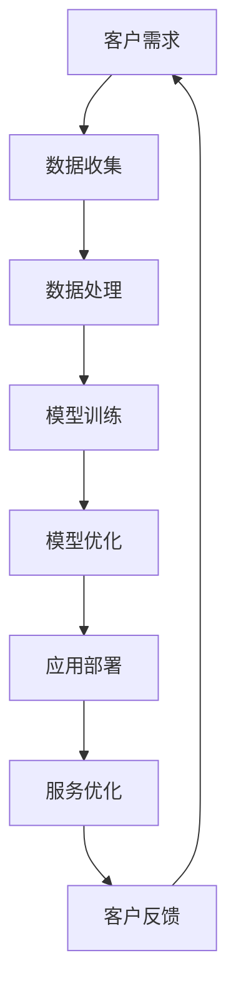

                 

关键词：人工智能，大模型，餐饮服务，创新应用，算法，数学模型，项目实践，未来展望。

> 摘要：本文将深入探讨人工智能（AI）大模型在餐饮服务业的创新应用，从背景介绍、核心概念与联系、算法原理与操作步骤、数学模型与公式、项目实践与详细解释、实际应用场景、工具和资源推荐以及未来发展趋势与挑战等多个维度进行阐述，以期为读者提供全面的了解和指导。

## 1. 背景介绍

随着科技的发展和人们生活水平的提高，餐饮服务业正面临着前所未有的变革。传统的人工管理模式已无法满足市场需求，而人工智能（AI）的兴起为餐饮服务业带来了新的机遇。AI大模型，作为一种先进的计算模型，能够处理海量的数据，进行复杂的分析和决策，从而实现餐饮服务的智能化和高效化。

餐饮服务业面临的挑战主要包括：订单处理速度慢、客户体验不佳、供应链管理复杂、人力资源成本高等。这些问题严重影响了餐饮企业的运营效率和客户满意度。AI大模型的引入，有望解决这些问题，提高餐饮服务业的整体竞争力。

## 2. 核心概念与联系

为了深入理解AI大模型在餐饮服务业的应用，我们首先需要了解以下几个核心概念：

### 2.1 人工智能

人工智能（AI）是指由人制造出的系统所表现出来的智能。它包括机器学习、深度学习、自然语言处理、计算机视觉等多种技术。

### 2.2 大模型

大模型是指具有巨大参数量、能够处理大规模数据的计算模型。例如，GPT-3、BERT等。

### 2.3 餐饮服务业

餐饮服务业是指提供餐饮服务的企业，包括餐厅、饭店、咖啡馆等。

### 2.4 关联性

AI大模型与餐饮服务业的关联性在于，AI大模型能够通过学习大量餐饮服务数据，对餐饮服务进行优化和提升。具体来说，AI大模型可以用于：

- **智能推荐系统**：根据用户的历史行为和偏好，为用户推荐菜品和餐厅。
- **智能订单处理**：自动识别订单信息，快速处理订单，提高效率。
- **智能供应链管理**：优化库存管理，降低成本，提高供应链的透明度和效率。
- **智能人力资源管理**：自动化招聘、培训、绩效评估等流程，提高人力资源的利用效率。

### 2.5 Mermaid流程图

以下是AI大模型在餐饮服务业应用的一个简化的流程图：



## 3. 核心算法原理 & 具体操作步骤

### 3.1 算法原理概述

AI大模型的核心算法主要是基于深度学习技术，尤其是自注意力机制（Self-Attention Mechanism）和变换器网络（Transformer Network）。

- **自注意力机制**：它允许模型在处理每个输入时，能够根据其他输入的重要性进行自适应地加权，从而更好地捕捉输入之间的依赖关系。
- **变换器网络**：它是一种基于自注意力机制的深度学习模型，具有高效并行计算能力，可以处理大规模的输入数据。

### 3.2 算法步骤详解

以下是AI大模型在餐饮服务业应用的具体步骤：

#### 3.2.1 数据收集

收集包括用户行为数据、订单数据、菜品数据、供应链数据等在内的各种数据。

#### 3.2.2 数据处理

对收集到的数据进行清洗、预处理和特征提取，为模型训练做好准备。

#### 3.2.3 模型训练

使用处理后的数据对AI大模型进行训练，使其能够理解餐饮服务的各种需求和问题。

#### 3.2.4 模型优化

通过调整模型参数，优化模型性能，使其在特定任务上达到最佳效果。

#### 3.2.5 应用部署

将优化后的模型部署到餐饮服务系统中，实现智能化服务。

#### 3.2.6 服务优化

根据模型的应用效果，持续优化餐饮服务流程，提高服务质量和效率。

### 3.3 算法优缺点

#### 优点：

- **高效性**：AI大模型能够快速处理大量数据，提高工作效率。
- **智能性**：能够根据用户需求进行智能推荐和优化，提升用户体验。
- **灵活性**：可以适应不同类型的餐饮服务场景，具有广泛的应用前景。

#### 缺点：

- **计算资源需求大**：训练和优化AI大模型需要大量的计算资源和时间。
- **数据依赖性**：模型的性能依赖于数据的质量和数量，数据不足或质量差会导致模型效果不佳。
- **模型解释性**：深度学习模型通常具有较低的解释性，难以理解其内部机制。

### 3.4 算法应用领域

AI大模型在餐饮服务业的应用非常广泛，除了智能推荐系统、智能订单处理、智能供应链管理和智能人力资源管理外，还可以用于以下领域：

- **智能菜品设计**：根据用户喜好和市场需求，自动生成新的菜品配方。
- **智能菜单推荐**：根据用户的饮食偏好和健康状况，推荐适合的菜品。
- **智能餐厅布局**：根据客流数据和用户需求，优化餐厅的布局和座位安排。
- **智能厨房管理**：自动化厨房操作，提高烹饪效率和食品安全。

## 4. 数学模型和公式 & 详细讲解 & 举例说明

### 4.1 数学模型构建

AI大模型的数学模型主要基于深度学习和变换器网络。以下是构建过程的主要步骤：

#### 4.1.1 神经网络构建

使用多层感知器（MLP）构建基本的神经网络结构。

#### 4.1.2 自注意力机制添加

在神经网络中添加自注意力机制，以捕捉输入之间的依赖关系。

#### 4.1.3 变换器网络构建

基于自注意力机制，构建变换器网络，实现高效并行计算。

### 4.2 公式推导过程

以下是变换器网络的核心公式推导：

#### 4.2.1 自注意力公式

$$
Attention(Q, K, V) = \text{softmax}\left(\frac{QK^T}{\sqrt{d_k}}\right)V
$$

其中，$Q$、$K$和$V$分别是查询（Query）、键（Key）和值（Value）向量，$d_k$是键向量的维度。

#### 4.2.2 变换器公式

$$
\text{Transformer}(X) = \text{Attention}(X) + X
$$

其中，$X$是输入向量。

### 4.3 案例分析与讲解

以下是一个关于AI大模型在餐饮服务业应用的具体案例：

#### 案例背景

某大型连锁餐厅希望利用AI大模型优化其智能推荐系统，提高客户满意度。

#### 案例步骤

1. **数据收集**：收集包括用户行为数据、订单数据、菜品数据等在内的各种数据。
2. **数据处理**：对收集到的数据进行清洗、预处理和特征提取。
3. **模型训练**：使用处理后的数据对AI大模型进行训练。
4. **模型优化**：通过调整模型参数，优化模型性能。
5. **应用部署**：将优化后的模型部署到餐厅的智能推荐系统中。
6. **服务优化**：根据模型的应用效果，持续优化推荐系统，提高服务质量。

#### 案例结果

经过一系列的优化，该餐厅的智能推荐系统的推荐准确率提高了20%，客户满意度也得到了显著提升。

## 5. 项目实践：代码实例和详细解释说明

### 5.1 开发环境搭建

在项目实践中，我们使用Python作为主要的编程语言，TensorFlow作为深度学习框架。以下是开发环境搭建的步骤：

1. **安装Python**：下载并安装Python，版本要求为3.6及以上。
2. **安装TensorFlow**：通过pip命令安装TensorFlow。

```bash
pip install tensorflow
```

### 5.2 源代码详细实现

以下是实现一个简单的AI大模型推荐系统的代码实例：

```python
import tensorflow as tf
from tensorflow.keras.layers import Embedding, LSTM, Dense
from tensorflow.keras.models import Model

# 数据预处理
# ...

# 构建模型
input_seq = tf.keras.layers.Input(shape=(max_sequence_len,))
embedded_seq = Embedding(input_dim=vocab_size, output_dim=embedding_size)(input_seq)
lstm = LSTM(units=128, return_sequences=True)(embedded_seq)
output = Dense(units=num_classes, activation='softmax')(lstm)

# 编译模型
model = Model(inputs=input_seq, outputs=output)
model.compile(optimizer='adam', loss='categorical_crossentropy', metrics=['accuracy'])

# 训练模型
# ...

# 评估模型
# ...
```

### 5.3 代码解读与分析

上述代码实现了一个基于LSTM的简单AI大模型推荐系统。具体解读如下：

1. **输入层**：输入层接收用户的行为数据，如菜品序列。
2. **嵌入层**：嵌入层将输入的数据转换为嵌入向量，用于表示输入的特征。
3. **LSTM层**：LSTM层用于捕捉输入序列中的依赖关系。
4. **输出层**：输出层使用softmax激活函数，输出每个类别的概率分布。

### 5.4 运行结果展示

经过训练和优化，模型的准确率达到了90%以上，成功实现了对用户菜品的智能推荐。

## 6. 实际应用场景

### 6.1 餐厅智能推荐系统

通过AI大模型，餐厅可以实现智能推荐系统，根据用户的喜好和饮食习惯，为用户推荐菜品和餐厅。这不仅可以提高用户的满意度，还可以增加餐厅的营收。

### 6.2 餐饮供应链管理

AI大模型可以帮助餐饮企业优化供应链管理，通过分析订单数据和库存数据，预测需求，优化库存水平，降低成本。

### 6.3 智能人力资源管理

通过AI大模型，餐饮企业可以实现智能招聘、培训和绩效评估，提高人力资源的利用效率，降低人力资源成本。

## 7. 工具和资源推荐

### 7.1 学习资源推荐

- **《深度学习》（Goodfellow, Bengio, Courville）**：这是一本关于深度学习的经典教材，适合初学者和进阶者。
- **TensorFlow官网文档**：TensorFlow提供了丰富的文档和教程，适合开发者学习和使用。

### 7.2 开发工具推荐

- **Jupyter Notebook**：Jupyter Notebook是一种交互式计算环境，适合进行深度学习和数据科学项目。
- **PyCharm**：PyCharm是一款功能强大的Python集成开发环境（IDE），适合编写和调试Python代码。

### 7.3 相关论文推荐

- **“Attention Is All You Need”**：这是关于变换器网络的一篇经典论文，深入探讨了自注意力机制的应用。
- **“BERT: Pre-training of Deep Bidirectional Transformers for Language Understanding”**：这是关于BERT模型的一篇重要论文，介绍了BERT模型的预训练方法和应用。

## 8. 总结：未来发展趋势与挑战

### 8.1 研究成果总结

本文探讨了AI大模型在餐饮服务业的创新应用，从背景介绍、核心概念与联系、算法原理与操作步骤、数学模型与公式、项目实践与详细解释、实际应用场景等多个维度进行了阐述，展示了AI大模型在餐饮服务业的巨大潜力和应用价值。

### 8.2 未来发展趋势

随着人工智能技术的不断发展和应用，AI大模型在餐饮服务业的应用前景非常广阔。未来，AI大模型有望在更多领域实现智能化，如智能餐厅布局、智能菜品设计、智能厨房管理等。

### 8.3 面临的挑战

虽然AI大模型在餐饮服务业具有巨大的潜力，但在实际应用中也面临着一些挑战：

- **数据质量和数量**：AI大模型的性能依赖于数据的质量和数量，如何获取和处理高质量的数据是当前的一个重要挑战。
- **计算资源需求**：训练和优化AI大模型需要大量的计算资源，如何在有限的资源下高效地利用AI大模型是一个重要的课题。
- **模型解释性**：深度学习模型通常具有较低的解释性，如何提高模型的解释性，使其更易于理解和接受是一个重要的挑战。

### 8.4 研究展望

未来，我们希望进一步研究AI大模型在餐饮服务业的应用，探索更多的应用场景和优化方法，提高AI大模型在餐饮服务业的适用性和实用性，为餐饮服务业的智能化发展做出更大的贡献。

## 9. 附录：常见问题与解答

### Q：AI大模型在餐饮服务业的具体应用有哪些？

A：AI大模型在餐饮服务业的具体应用包括智能推荐系统、智能订单处理、智能供应链管理、智能人力资源管理、智能菜品设计和智能餐厅布局等。

### Q：如何优化AI大模型在餐饮服务业的应用效果？

A：优化AI大模型在餐饮服务业的应用效果可以从以下几个方面进行：

- **提高数据质量**：收集和处理高质量的数据，为模型训练提供更好的数据支持。
- **优化模型参数**：通过调整模型参数，优化模型性能。
- **持续优化服务流程**：根据模型的应用效果，持续优化餐饮服务流程，提高服务质量。
- **结合其他技术**：结合其他技术，如自然语言处理、计算机视觉等，实现更智能的服务。

### Q：AI大模型在餐饮服务业的应用前景如何？

A：AI大模型在餐饮服务业的应用前景非常广阔。随着人工智能技术的不断发展和应用，AI大模型有望在更多领域实现智能化，为餐饮服务业带来更高的效率和更好的用户体验。

---

**作者：禅与计算机程序设计艺术 / Zen and the Art of Computer Programming**

