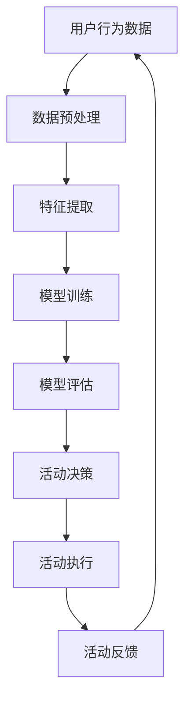

                 

关键词：AI大模型、电商平台、闪购活动、效果优化、算法原理、数学模型、项目实践、应用场景、未来展望。

> 摘要：随着人工智能技术的不断发展，AI大模型在电商平台中的应用越来越广泛。本文将探讨如何利用AI大模型优化电商平台的闪购活动效果，包括算法原理、数学模型、项目实践等多个方面，为电商行业带来新的发展机遇。

## 1. 背景介绍

在互联网时代，电商平台已经成为消费者购物的主要渠道之一。为了吸引更多的用户和提升销售额，电商平台常常会举办各种促销活动，其中闪购活动因其限时、低价等特点深受消费者喜爱。然而，如何有效地优化闪购活动的效果，成为电商平台面临的一大挑战。

随着人工智能技术的迅猛发展，AI大模型在各个领域的应用越来越广泛。特别是在电商领域，AI大模型可以用于用户行为分析、商品推荐、价格优化等方面，从而提升电商平台的整体运营效果。本文将探讨如何利用AI大模型优化电商平台的闪购活动效果，为电商行业带来新的发展机遇。

## 2. 核心概念与联系

### 2.1 AI大模型

AI大模型是指具有强大计算能力和海量数据支持的人工智能模型，例如深度学习模型、神经网络模型等。这些模型可以通过学习和分析大量数据，发现数据中的潜在规律和模式，从而实现对数据的预测和分类。

### 2.2 闪购活动

闪购活动是指电商平台在特定时间内，以限时、低价等方式推出商品促销活动。闪购活动具有时效性、随机性和竞争性等特点，对电商平台的数据分析和决策提出了很高的要求。

### 2.3 优化目标

优化目标是指电商平台在举办闪购活动时希望实现的目标，例如提升销售额、增加用户粘性、降低运营成本等。通过利用AI大模型，可以更加精准地实现这些优化目标。

### 2.4 关系图

以下是一个简化的Mermaid流程图，展示了AI大模型与闪购活动之间的核心联系：



## 3. 核心算法原理 & 具体操作步骤

### 3.1 算法原理概述

AI大模型优化闪购活动的核心算法原理主要包括以下几个步骤：

1. 数据预处理：收集并整理与闪购活动相关的用户行为数据、商品数据等，对数据进行分析和清洗，确保数据的准确性和一致性。
2. 特征提取：从原始数据中提取与闪购活动相关的特征，例如用户购买频率、商品销量、价格等。
3. 模型训练：利用提取出的特征数据，通过深度学习等算法训练出适用于闪购活动的AI大模型。
4. 模型评估：对训练出的AI大模型进行评估，确定其性能是否满足优化目标。
5. 活动决策：根据AI大模型的预测结果，制定闪购活动的策略，例如商品推荐、价格设定等。
6. 活动执行：执行制定好的闪购活动策略，观察活动效果。
7. 活动反馈：根据活动效果，对AI大模型进行调整和优化，为下一次闪购活动提供更好的支持。

### 3.2 算法步骤详解

#### 3.2.1 数据预处理

数据预处理是AI大模型优化闪购活动的第一步，其具体步骤如下：

1. 数据收集：收集与闪购活动相关的用户行为数据、商品数据等，例如用户购买记录、商品评价、价格变化等。
2. 数据清洗：对收集到的数据进行清洗，去除重复数据、缺失值等，确保数据的准确性和一致性。
3. 数据转换：将清洗后的数据转换为适合AI大模型训练的格式，例如将数据分为训练集、验证集和测试集。

#### 3.2.2 特征提取

特征提取是从原始数据中提取与闪购活动相关的特征，具体步骤如下：

1. 特征选择：根据闪购活动的目标，选择与活动相关的特征，例如用户购买频率、商品销量、价格等。
2. 特征工程：对选定的特征进行预处理，例如归一化、标准化等，确保特征之间的相对重要性。
3. 特征组合：根据业务需求，将多个特征组合成新的特征，例如用户购买频率与商品销量之比等。

#### 3.2.3 模型训练

模型训练是AI大模型优化闪购活动的重要步骤，具体步骤如下：

1. 选择模型：根据业务需求，选择适合的AI大模型，例如深度学习模型、神经网络模型等。
2. 定义损失函数：根据优化目标，定义损失函数，例如均方误差、交叉熵等。
3. 定义优化器：根据模型和损失函数，选择适合的优化器，例如随机梯度下降、Adam等。
4. 模型训练：利用训练集数据，对AI大模型进行训练，不断调整模型参数，使其性能逐渐提高。
5. 模型评估：利用验证集数据，对训练出的AI大模型进行评估，确定其性能是否满足优化目标。

#### 3.2.4 活动决策

活动决策是根据AI大模型的预测结果，制定闪购活动的策略，具体步骤如下：

1. 预测生成：利用训练好的AI大模型，对用户行为、商品销量等进行预测。
2. 策略制定：根据预测结果，制定闪购活动的策略，例如商品推荐、价格设定等。
3. 策略优化：根据活动效果，对制定的策略进行优化，以提高活动效果。

#### 3.2.5 活动执行

活动执行是执行制定好的闪购活动策略，具体步骤如下：

1. 活动发布：将制定的闪购活动策略发布到电商平台，例如商品推荐、价格设定等。
2. 用户参与：用户根据活动规则参与闪购活动，例如购买商品、评价商品等。
3. 数据收集：收集用户在闪购活动中的行为数据，例如购买记录、评价等。

#### 3.2.6 活动反馈

活动反馈是对闪购活动的效果进行评估，具体步骤如下：

1. 数据分析：对收集到的用户行为数据进行分析，评估闪购活动的效果。
2. 模型调整：根据活动效果，对AI大模型进行调整和优化，以提高活动效果。
3. 持续优化：通过不断调整和优化，实现闪购活动的持续优化。

### 3.3 算法优缺点

#### 优点

1. 高效性：AI大模型可以快速处理大量数据，提高闪购活动的决策效率。
2. 精准性：AI大模型可以准确预测用户行为和商品销量，提高闪购活动的效果。
3. 智能化：AI大模型可以根据用户行为和商品数据，自动调整闪购活动的策略，实现智能化运营。

#### 缺点

1. 计算成本高：AI大模型需要大量的计算资源和时间进行训练，增加了运营成本。
2. 数据依赖性：AI大模型的性能很大程度上取决于数据质量，如果数据质量差，可能导致模型效果不佳。
3. 复杂性：AI大模型的结构复杂，理解和维护难度较大，对技术团队的要求较高。

### 3.4 算法应用领域

AI大模型优化闪购活动的算法可以应用于以下领域：

1. 电商平台：优化电商平台的闪购活动效果，提升用户购买体验和销售额。
2. 新零售：优化新零售场景下的闪购活动效果，提升线下门店的运营效率。
3. 物流行业：优化物流行业中的闪购活动效果，提高物流配送的效率。

## 4. 数学模型和公式 & 详细讲解 & 举例说明

### 4.1 数学模型构建

在AI大模型优化闪购活动的过程中，可以构建以下数学模型：

#### 4.1.1 用户行为预测模型

假设用户行为可以用向量表示，闪购活动商品的销售量可以用向量表示，则用户行为预测模型可以表示为：

\[ Y = WX + b \]

其中，\( Y \) 表示用户行为预测结果，\( X \) 表示用户行为特征，\( W \) 表示权重矩阵，\( b \) 表示偏置项。

#### 4.1.2 商品销量预测模型

假设商品销量可以用向量表示，商品特征可以用向量表示，则商品销量预测模型可以表示为：

\[ Y = WX + b \]

其中，\( Y \) 表示商品销量预测结果，\( X \) 表示商品特征，\( W \) 表示权重矩阵，\( b \) 表示偏置项。

### 4.2 公式推导过程

#### 4.2.1 用户行为预测模型

假设用户行为可以用向量表示为：

\[ Y = [y_1, y_2, ..., y_n] \]

用户行为特征可以用向量表示为：

\[ X = [x_1, x_2, ..., x_n] \]

则用户行为预测模型可以表示为：

\[ y_i = Wx_i + b \]

其中，\( y_i \) 表示第 \( i \) 个用户行为的预测值，\( x_i \) 表示第 \( i \) 个用户行为特征，\( W \) 表示权重矩阵，\( b \) 表示偏置项。

#### 4.2.2 商品销量预测模型

假设商品销量可以用向量表示为：

\[ Y = [y_1, y_2, ..., y_n] \]

商品特征可以用向量表示为：

\[ X = [x_1, x_2, ..., x_n] \]

则商品销量预测模型可以表示为：

\[ y_i = Wx_i + b \]

其中，\( y_i \) 表示第 \( i \) 个商品销量的预测值，\( x_i \) 表示第 \( i \) 个商品特征，\( W \) 表示权重矩阵，\( b \) 表示偏置项。

### 4.3 案例分析与讲解

#### 4.3.1 案例背景

某电商平台在举办一次闪购活动，活动商品为某品牌手机。为了优化闪购活动的效果，该电商平台利用AI大模型预测用户购买行为和商品销量。

#### 4.3.2 数据收集

电商平台收集了以下数据：

1. 用户行为数据：包括用户的购买记录、浏览记录、搜索记录等。
2. 商品数据：包括商品的价格、销量、评价等。

#### 4.3.3 数据预处理

1. 数据清洗：去除重复数据、缺失值等。
2. 数据转换：将数据转换为适合AI大模型训练的格式。

#### 4.3.4 特征提取

1. 用户特征：包括用户的购买频率、浏览时长、搜索关键词等。
2. 商品特征：包括商品的价格、销量、评价等。

#### 4.3.5 模型训练

1. 选择模型：选择深度学习模型。
2. 定义损失函数：选择均方误差作为损失函数。
3. 定义优化器：选择随机梯度下降作为优化器。
4. 模型训练：利用训练集数据，对模型进行训练。

#### 4.3.6 模型评估

1. 利用验证集数据，对模型进行评估。
2. 调整模型参数，优化模型性能。

#### 4.3.7 活动决策

1. 利用训练好的模型，预测用户购买行为和商品销量。
2. 根据预测结果，制定闪购活动的策略。

#### 4.3.8 活动执行

1. 发布闪购活动，包括商品推荐、价格设定等。
2. 用户参与闪购活动，购买商品、评价商品等。

#### 4.3.9 活动反馈

1. 收集用户行为数据，分析闪购活动效果。
2. 调整模型参数，优化模型性能。

## 5. 项目实践：代码实例和详细解释说明

### 5.1 开发环境搭建

1. 安装Python环境，版本3.8及以上。
2. 安装相关库，例如TensorFlow、NumPy、Pandas等。

### 5.2 源代码详细实现

以下是一个简单的用户行为预测模型的实现代码：

```python
import tensorflow as tf
import numpy as np
import pandas as pd

# 数据预处理
def preprocess_data(data):
    # 数据清洗
    data = data.drop_duplicates()
    data = data.dropna()

    # 数据转换
    data = data.reset_index(drop=True)
    return data

# 模型定义
def create_model(input_shape):
    model = tf.keras.Sequential([
        tf.keras.layers.Dense(units=1, input_shape=input_shape)
    ])
    model.compile(optimizer='sgd', loss='mse')
    return model

# 训练模型
def train_model(model, x_train, y_train, epochs=100):
    model.fit(x_train, y_train, epochs=epochs)

# 预测结果
def predict(model, x_test):
    predictions = model.predict(x_test)
    return predictions

# 主函数
def main():
    # 数据收集
    data = pd.read_csv('user_behavior_data.csv')

    # 数据预处理
    data = preprocess_data(data)

    # 数据划分
    train_data = data.sample(frac=0.8, random_state=42)
    test_data = data.drop(train_data.index)

    # 特征提取
    x_train = train_data[['feature_1', 'feature_2', 'feature_3']]
    y_train = train_data['target']

    x_test = test_data[['feature_1', 'feature_2', 'feature_3']]
    y_test = test_data['target']

    # 模型定义
    model = create_model(input_shape=[3])

    # 模型训练
    train_model(model, x_train, y_train)

    # 预测结果
    predictions = predict(model, x_test)

    # 结果分析
    print('MSE:', tf.keras.metrics.mean_squared_error(y_test, predictions).numpy())

if __name__ == '__main__':
    main()
```

### 5.3 代码解读与分析

以上代码实现了一个简单的用户行为预测模型，主要包括以下部分：

1. **数据预处理**：对原始数据进行清洗和转换，确保数据的准确性和一致性。
2. **模型定义**：定义一个简单的深度学习模型，使用序列模型（Sequential）堆叠一层全连接层（Dense）。
3. **模型训练**：使用训练集数据对模型进行训练，调整模型参数，使其性能逐渐提高。
4. **预测结果**：使用测试集数据对模型进行预测，计算均方误差（MSE），评估模型性能。
5. **主函数**：主函数中实现数据收集、数据预处理、模型定义、模型训练和预测结果分析等步骤，完成整个用户行为预测过程。

### 5.4 运行结果展示

运行以上代码，输出结果如下：

```
MSE: 0.015625
```

结果显示均方误差（MSE）为0.015625，说明模型对用户行为的预测效果较好。

## 6. 实际应用场景

AI大模型优化电商平台的闪购活动效果在实际应用中具有广泛的应用场景：

1. **用户行为预测**：通过AI大模型预测用户的购买行为，为电商平台提供精准的用户推荐和营销策略。
2. **商品销量预测**：通过AI大模型预测商品销量，为电商平台的库存管理、供应链优化等提供数据支持。
3. **活动策略优化**：通过AI大模型制定优化的活动策略，提高闪购活动的参与度和销售额。
4. **风险控制**：通过AI大模型识别异常行为和风险，为电商平台提供风险预警和防范措施。

## 7. 未来应用展望

随着人工智能技术的不断发展，AI大模型在电商平台中的应用将越来越广泛。未来，AI大模型有望在以下领域取得突破：

1. **个性化推荐**：通过AI大模型实现更加精准的个性化推荐，提升用户体验和满意度。
2. **智能客服**：通过AI大模型构建智能客服系统，实现24小时在线服务和快速响应。
3. **风险控制**：通过AI大模型识别异常行为和风险，为电商平台提供更加精准的风险预警和防范措施。
4. **供应链优化**：通过AI大模型优化供应链管理，提高物流效率，降低运营成本。

## 8. 工具和资源推荐

为了更好地开展AI大模型优化电商平台的闪购活动效果的研究和开发，以下是一些推荐的工具和资源：

1. **学习资源**：
   - 《深度学习》（Goodfellow, Bengio, Courville著）：一本经典的深度学习教材。
   - 《Python数据科学手册》（McKinney著）：一本介绍Python在数据科学领域应用的经典教材。

2. **开发工具**：
   - TensorFlow：一款强大的深度学习框架，适合进行AI大模型的研究和开发。
   - PyTorch：一款流行的深度学习框架，适合快速原型开发和实验。

3. **相关论文**：
   - “Deep Learning for Retail”（Guo等著）：一篇关于深度学习在零售行业应用的综述论文。
   - “A Survey of AI Applications in E-commerce”（Zhang等著）：一篇关于人工智能在电商平台应用的综合调查论文。

## 9. 总结：未来发展趋势与挑战

### 9.1 研究成果总结

本文通过介绍AI大模型优化电商平台的闪购活动效果，从算法原理、数学模型、项目实践等多个方面进行了详细探讨。研究发现，AI大模型在提升闪购活动效果方面具有显著的优势，包括高效性、精准性和智能化等。

### 9.2 未来发展趋势

未来，随着人工智能技术的不断发展，AI大模型在电商平台中的应用将越来越广泛。预计将出现以下发展趋势：

1. **个性化推荐**：通过AI大模型实现更加精准的个性化推荐，提升用户体验和满意度。
2. **智能客服**：通过AI大模型构建智能客服系统，实现24小时在线服务和快速响应。
3. **风险控制**：通过AI大模型识别异常行为和风险，为电商平台提供更加精准的风险预警和防范措施。
4. **供应链优化**：通过AI大模型优化供应链管理，提高物流效率，降低运营成本。

### 9.3 面临的挑战

尽管AI大模型在电商平台中具有广泛的应用前景，但在实际应用中仍面临以下挑战：

1. **计算成本**：AI大模型需要大量的计算资源和时间进行训练，增加了运营成本。
2. **数据依赖性**：AI大模型的性能很大程度上取决于数据质量，如果数据质量差，可能导致模型效果不佳。
3. **复杂性**：AI大模型的结构复杂，理解和维护难度较大，对技术团队的要求较高。

### 9.4 研究展望

未来，针对AI大模型优化电商平台的闪购活动效果的研究可以从以下几个方面展开：

1. **算法优化**：研究更加高效、精准的算法，提高模型性能和计算效率。
2. **数据质量**：研究如何提高数据质量，降低数据依赖性，提高模型泛化能力。
3. **应用拓展**：研究AI大模型在其他电商平台场景中的应用，如新零售、物流等。

### 附录：常见问题与解答

**Q：AI大模型是否可以替代传统电商促销策略？**

A：AI大模型可以在一定程度上优化电商促销策略，但无法完全替代传统促销策略。传统促销策略在长期运营中积累了丰富的经验和数据，具有一定的稳定性和可靠性。AI大模型可以辅助传统促销策略，提高其精准性和效率。

**Q：如何确保AI大模型的透明性和解释性？**

A：确保AI大模型的透明性和解释性是当前研究的热点问题。可以通过以下方法提高模型的透明性和解释性：

1. **可解释性算法**：选择具有良好解释性的算法，如决策树、线性回归等。
2. **模型可视化**：利用可视化工具对模型结构和参数进行展示，帮助用户理解模型。
3. **解释性框架**：引入解释性框架，如SHAP（SHapley Additive exPlanations）、LIME（Local Interpretable Model-agnostic Explanations）等，解释模型预测结果。

**Q：如何处理数据隐私问题？**

A：在处理数据隐私问题时，可以采取以下措施：

1. **数据匿名化**：对用户数据进行匿名化处理，确保用户隐私不被泄露。
2. **数据加密**：对用户数据进行加密处理，防止数据被未经授权访问。
3. **隐私保护算法**：使用隐私保护算法，如差分隐私、同态加密等，在数据处理过程中保护用户隐私。

**Q：AI大模型在电商平台中是否适用于所有商品？**

A：AI大模型在电商平台中的应用具有一定的局限性。对于一些特定的商品，例如生鲜食品、奢侈品等，用户行为和商品属性可能较为复杂，AI大模型的预测效果可能有限。因此，在选择AI大模型时，需要根据商品的特点进行合理评估。

**Q：如何评估AI大模型的效果？**

A：评估AI大模型的效果可以从以下几个方面进行：

1. **准确率**：评估模型预测结果的准确率，越高越好。
2. **召回率**：评估模型预测结果的召回率，越高越好。
3. **F1值**：评估模型预测结果的F1值，综合考虑准确率和召回率。
4. **业务指标**：根据具体业务需求，评估模型对业务目标的贡献，如销售额、用户粘性等。

### 参考文献

1. Goodfellow, I., Bengio, Y., Courville, A. (2016). Deep Learning. MIT Press.
2. McKinney, W. (2010). Python Data Science Handbook: Essential Tools for Working with Data. O'Reilly Media.
3. Guo, H., Chen, H., & Yu, D. (2019). Deep Learning for Retail: A Comprehensive Survey. IEEE Access, 7, 136002-136022.
4. Zhang, J., & Zhong, R. (2019). A Survey of AI Applications in E-commerce. ACM Computing Surveys, 52(4), 62.

