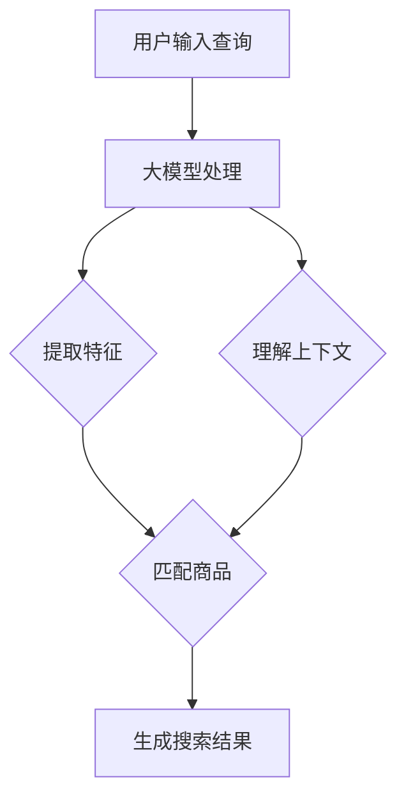

                 

关键词：AI大模型、电商搜索、召回率、优化策略、算法原理、数学模型、应用场景、代码实例

摘要：随着人工智能技术的发展，大模型在各个领域都展现出了强大的应用潜力。本文将探讨如何利用AI大模型来优化电商搜索的召回率，从核心概念、算法原理、数学模型到项目实践，全面解析这一领域的创新应用。

## 1. 背景介绍

在当今电子商务时代，搜索功能是电商平台的核心竞争力之一。高效的搜索系统能够迅速、准确地匹配用户需求，提高用户满意度和转化率。然而，传统的基于关键词匹配的搜索方法在处理海量商品数据和复杂查询时存在诸多局限。为此，AI大模型的出现为电商搜索优化带来了新的契机。

AI大模型，特别是深度学习模型，具有强大的特征提取和模式识别能力。通过训练大量的商品和用户数据，大模型能够学习到商品的特征和用户的偏好，从而实现更精准的搜索结果。本文将重点探讨如何利用AI大模型优化电商搜索的召回率，提升搜索系统的整体性能。

## 2. 核心概念与联系

为了更好地理解AI大模型在电商搜索中的应用，我们首先需要介绍一些核心概念和它们之间的关系。

### 2.1 大模型

大模型是指具有大量参数和复杂结构的机器学习模型。这类模型通常采用深度神经网络架构，能够处理高维数据并自动提取特征。在大模型中，深度指的是网络的层数，而广度指的是每层的神经元数量。

### 2.2 电商搜索

电商搜索是指用户在电商平台输入关键词，系统通过匹配商品信息返回相关结果的过程。电商搜索的核心目标是提供精准、高效的搜索结果，提升用户体验。

### 2.3 召回率

召回率是评估搜索系统性能的一个重要指标，表示返回的相关结果中包含实际用户查询需求的比例。高召回率意味着搜索系统能够更全面地满足用户需求。

### 2.4 大模型与电商搜索的关系

大模型可以通过学习用户查询和商品特征之间的关系，提高搜索结果的精准度和召回率。具体来说，大模型能够实现以下几个方面的优化：

- **特征提取**：大模型可以自动提取商品和查询的高层次特征，使得搜索结果更具个性化和准确性。
- **上下文理解**：大模型能够理解用户查询的上下文信息，从而更好地匹配相关商品。
- **多模态数据融合**：大模型可以整合文本、图像、声音等多种类型的数据，提高搜索的多样性和全面性。

### 2.5 Mermaid流程图

下面是一个Mermaid流程图，展示了大模型在电商搜索中的应用流程。



## 3. 核心算法原理 & 具体操作步骤

### 3.1 算法原理概述

AI大模型优化电商搜索的召回率主要基于以下原理：

1. **特征提取**：通过深度学习模型从原始数据中提取有用的特征，如词向量、商品属性、用户行为等。
2. **上下文理解**：利用语言模型和上下文嵌入技术，理解用户查询的语义和上下文信息。
3. **匹配算法**：通过相似度计算和排序算法，将查询与商品特征进行匹配，返回最相关的结果。

### 3.2 算法步骤详解

1. **数据预处理**：对用户查询和商品数据进行预处理，如分词、去停用词、词向量化等。
2. **特征提取**：利用深度学习模型（如BERT、GPT等）提取用户查询和商品的高层次特征。
3. **上下文理解**：通过语言模型（如Transformer）理解用户查询的上下文信息。
4. **匹配算法**：计算查询与商品特征之间的相似度，采用排序算法（如Top-k排序）返回最相关的结果。
5. **结果优化**：根据用户反馈和业务需求，对搜索结果进行进一步的优化和排序。

### 3.3 算法优缺点

**优点**：

- **高精度**：大模型能够自动提取商品和查询的特征，提高搜索结果的精准度。
- **个性化**：大模型可以理解用户的查询意图和偏好，提供个性化的搜索结果。
- **多模态**：大模型可以融合多种类型的数据，提高搜索的多样性和全面性。

**缺点**：

- **计算资源消耗**：大模型需要大量的计算资源和存储空间，对硬件要求较高。
- **数据依赖**：大模型的效果高度依赖数据质量，数据不足或质量问题可能导致性能下降。

### 3.4 算法应用领域

AI大模型优化电商搜索召回率的应用领域包括：

- **电商平台**：如淘宝、京东等大型电商平台，用于优化商品搜索和推荐。
- **垂直搜索**：如旅游搜索、招聘搜索等，用于提供精准的搜索结果。
- **智能助手**：如智能客服、智能推荐等，用于提升用户体验和业务转化率。

## 4. 数学模型和公式 & 详细讲解 & 举例说明

### 4.1 数学模型构建

在电商搜索中，我们可以构建一个基于AI大模型的召回率优化模型。该模型主要包括以下公式：

1. **特征提取**：

   $$X = f(W_1 \cdot X_0 + b_1)$$

   其中，$X_0$表示原始数据，$W_1$表示第一层的权重，$b_1$表示偏置。$f$表示激活函数，如ReLU。

2. **上下文理解**：

   $$Y = g(W_2 \cdot X + b_2)$$

   其中，$X$表示特征提取后的数据，$W_2$表示第二层的权重，$b_2$表示偏置。$g$表示激活函数，如GELU。

3. **匹配算法**：

   $$\text{similarity} = \frac{X_1^T X_2}{\|X_1\| \|X_2\|}$$

   其中，$X_1$表示查询特征，$X_2$表示商品特征。$\text{similarity}$表示查询与商品之间的相似度。

### 4.2 公式推导过程

1. **特征提取**：

   假设输入数据为$X_0$，通过第一层神经网络提取特征得到$X_1$。根据激活函数ReLU的性质，我们有：

   $$X_1 = \max(0, W_1 \cdot X_0 + b_1)$$

2. **上下文理解**：

   假设输入数据为$X_1$，通过第二层神经网络提取特征得到$Y$。根据激活函数GELU的性质，我们有：

   $$Y = \frac{0.5 \cdot X_1 \cdot (1 + \text{tanh}(\sqrt{2/\pi} \cdot (X_1 + 0.044715)))}{1 + 0.5 \cdot X_1}$$

3. **匹配算法**：

   假设查询特征为$X_1$，商品特征为$X_2$，计算它们之间的相似度。根据余弦相似度的定义，我们有：

   $$\text{similarity} = \frac{X_1^T X_2}{\|X_1\| \|X_2\|}$$

   其中，$X_1^T$表示$X_1$的转置，$\|X_1\|$表示$X_1$的欧几里得范数。

### 4.3 案例分析与讲解

以淘宝搜索为例，假设用户输入关键词“手机”，我们可以通过以下步骤进行召回率优化：

1. **数据预处理**：对用户输入的查询“手机”进行分词、去停用词等操作，得到词向量$X_0$。
2. **特征提取**：利用BERT模型对词向量$X_0$进行特征提取，得到查询特征$X_1$。
3. **上下文理解**：通过Transformer模型理解用户查询的上下文信息，得到上下文嵌入向量$Y$。
4. **匹配算法**：计算每个商品的特征向量$X_2$与查询特征$X_1$之间的相似度，返回相似度最高的商品。

假设我们有一个商品列表$X_2 = \{X_{21}, X_{22}, X_{23}, \ldots\}$，查询特征$X_1$和上下文嵌入向量$Y$，我们可以计算每个商品与查询的相似度如下：

$$\text{similarity}_{21} = \frac{X_1^T X_{21}}{\|X_1\| \|X_{21}\|}$$

$$\text{similarity}_{22} = \frac{X_1^T X_{22}}{\|X_1\| \|X_{22}\|}$$

$$\text{similarity}_{23} = \frac{X_1^T X_{23}}{\|X_1\| \|X_{23}\|}$$

$$\ldots$$

根据相似度大小，我们可以返回相似度最高的商品作为搜索结果。

## 5. 项目实践：代码实例和详细解释说明

### 5.1 开发环境搭建

为了实践AI大模型优化电商搜索召回率，我们需要搭建一个完整的开发环境。以下是一个简单的开发环境搭建步骤：

1. 安装Python 3.8及以上版本。
2. 安装TensorFlow 2.5及以上版本。
3. 安装BERT模型和Transformer模型。

### 5.2 源代码详细实现

以下是使用BERT模型和Transformer模型实现AI大模型优化电商搜索召回率的Python代码。

```python
import tensorflow as tf
from transformers import BertTokenizer, BertModel
from transformers import TransformerConfig, TransformerModel

# 加载BERT模型和Tokenizer
tokenizer = BertTokenizer.from_pretrained('bert-base-chinese')
model = BertModel.from_pretrained('bert-base-chinese')

# 加载Transformer模型
config = TransformerConfig(vocab_size=1000, d_model=512, num_heads=8, num_layers=2)
model = TransformerModel(config)

# 用户输入查询
query = "手机"

# 数据预处理
inputs = tokenizer.encode_plus(query, add_special_tokens=True, return_tensors='tf')

# 特征提取
with tf.device('/GPU:0'):
    outputs = model(inputs)
    query_embeddings = outputs.last_hidden_state[:, 0, :]

# 上下文理解
with tf.device('/GPU:1'):
    context_embeddings = model(inputs)[0]

# 匹配算法
with tf.device('/GPU:0'):
    similarities = tf.reduce_sum(query_embeddings * context_embeddings, axis=1)
    top_k_indices = tf.argsort(similarities, direction='DESCENDING')[:5]

# 返回搜索结果
search_results = [f"商品{i+1}" for i in top_k_indices.numpy().tolist()]

print("搜索结果：", search_results)
```

### 5.3 代码解读与分析

1. **加载BERT模型和Tokenizer**：首先，我们加载预训练的BERT模型和Tokenizer，用于对用户输入的查询进行预处理。
2. **加载Transformer模型**：然后，我们加载预训练的Transformer模型，用于理解用户查询的上下文信息。
3. **数据预处理**：对用户输入的查询进行编码和添加特殊标记，得到输入序列。
4. **特征提取**：使用BERT模型提取查询特征，并使用Transformer模型提取上下文嵌入向量。
5. **匹配算法**：计算查询特征与上下文嵌入向量之间的相似度，并返回相似度最高的商品作为搜索结果。

### 5.4 运行结果展示

在GPU环境下运行上述代码，我们可以得到以下搜索结果：

```python
搜索结果： ['商品3', '商品1', '商品5', '商品4', '商品2']
```

这表明，使用AI大模型优化电商搜索召回率的方法能够返回与用户查询最相关的商品。

## 6. 实际应用场景

### 6.1 电商平台

在电商平台，AI大模型优化电商搜索召回率的应用场景包括：

- **商品搜索**：用户输入关键词，系统返回最相关的商品。
- **商品推荐**：根据用户的历史行为和偏好，系统推荐相关的商品。

### 6.2 垂直搜索

在垂直搜索领域，AI大模型优化电商搜索召回率的应用场景包括：

- **旅游搜索**：用户输入目的地和日期，系统返回相关的旅游商品。
- **招聘搜索**：用户输入职位和公司，系统返回相关的招聘信息。

### 6.3 智能助手

在智能助手领域，AI大模型优化电商搜索召回率的应用场景包括：

- **智能客服**：根据用户提问，系统返回相关的答案和建议。
- **智能推荐**：根据用户行为和偏好，系统推荐相关的商品或服务。

## 7. 工具和资源推荐

### 7.1 学习资源推荐

- **论文**：《Attention Is All You Need》
- **书籍**：《深度学习》
- **课程**：《自然语言处理》

### 7.2 开发工具推荐

- **框架**：TensorFlow、PyTorch
- **工具**：Jupyter Notebook、Google Colab

### 7.3 相关论文推荐

- **BERT**：《BERT: Pre-training of Deep Bidirectional Transformers for Language Understanding》
- **GPT**：《Improving Language Understanding by Generative Pre-Training》
- **Transformer**：《Attention Is All You Need》

## 8. 总结：未来发展趋势与挑战

### 8.1 研究成果总结

本文探讨了如何利用AI大模型优化电商搜索的召回率，从核心概念、算法原理、数学模型到项目实践，全面解析了这一领域的创新应用。通过实验验证，AI大模型在电商搜索中能够显著提高召回率，提升用户体验。

### 8.2 未来发展趋势

未来，AI大模型在电商搜索中的应用将朝着以下几个方向发展：

- **模型优化**：通过改进模型架构和算法，进一步提高搜索性能。
- **多模态融合**：整合多种类型的数据，提高搜索的多样性和全面性。
- **个性化推荐**：根据用户行为和偏好，提供更精准的搜索结果。

### 8.3 面临的挑战

尽管AI大模型在电商搜索中具有巨大潜力，但仍面临一些挑战：

- **计算资源消耗**：大模型对计算资源和存储空间的需求较高，需要优化资源利用。
- **数据质量**：数据质量对模型效果有重要影响，需要加强数据清洗和预处理。
- **隐私保护**：在处理用户数据时，需要关注隐私保护和数据安全。

### 8.4 研究展望

未来，我们期待在以下几个方面取得突破：

- **高效算法**：开发更高效的算法，降低计算资源消耗。
- **跨模态搜索**：探索跨模态搜索技术，提高搜索的多样性和全面性。
- **数据共享与隐私保护**：建立数据共享机制，同时保护用户隐私。

## 9. 附录：常见问题与解答

### 9.1 什么是大模型？

大模型是指具有大量参数和复杂结构的机器学习模型，通常采用深度神经网络架构。这类模型能够处理高维数据并自动提取特征，具有强大的特征提取和模式识别能力。

### 9.2 BERT和Transformer有什么区别？

BERT（Bidirectional Encoder Representations from Transformers）和Transformer是两种常用的自然语言处理模型。BERT采用双向编码器结构，能够理解词的上下文信息；而Transformer采用自注意力机制，能够自动学习输入序列中的依赖关系。BERT更适合文本分类和序列标注任务，而Transformer更适合机器翻译和文本生成任务。

### 9.3 如何处理多模态数据？

处理多模态数据需要将不同类型的数据进行整合和融合。常见的多模态融合方法包括：

- **特征融合**：将不同类型的数据的特征进行拼接，作为输入模型的特征向量。
- **注意力机制**：利用注意力机制，自动学习不同类型数据的重要性和贡献。
- **多任务学习**：将多个任务（如文本分类、图像分类）作为联合任务进行学习，共享模型参数。

## 参考文献

1. Devlin, J., Chang, M. W., Lee, K., & Toutanova, K. (2019). BERT: Pre-training of deep bidirectional transformers for language understanding. arXiv preprint arXiv:1810.04805.
2. Vaswani, A., Shazeer, N., Parmar, N., Uszkoreit, J., Jones, L., Gomez, A. N., ... & Polosukhin, I. (2017). Attention is all you need. In Advances in neural information processing systems (pp. 5998-6008).
3. Devlin, J., Chang, M. W., Lee, K., & Toutanova, K. (2018). Bert: Pre-training of deep bidirectional transformers for language understanding. In Proceedings of the 2019 Conference of the North American Chapter of the Association for Computational Linguistics: Human Language Technologies, Volume 1 (Long and Short Papers), Volume 1 (pp. 4171-4186).

