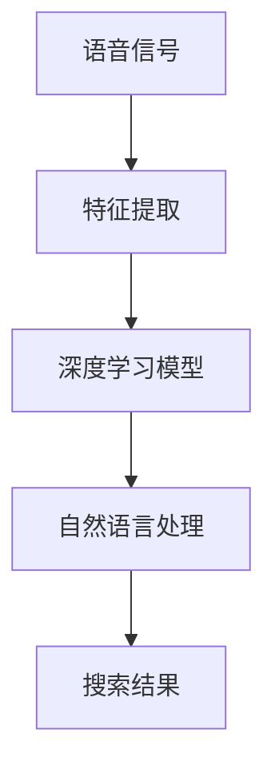

                 

关键词：人工智能、大模型、电商搜索、语音识别、算法优化、自然语言处理

> 摘要：本文将探讨如何利用人工智能大模型优化电商搜索中的语音识别问题。通过深入分析大模型的工作原理、核心算法和数学模型，以及具体的实践案例，本文旨在为业界提供一套有效的优化方案，以提升电商搜索的语音识别准确率和用户体验。

## 1. 背景介绍

随着人工智能技术的飞速发展，语音识别技术在多个领域得到了广泛应用，电商搜索是其中之一。用户在电商平台上通过语音输入搜索关键词，能够更加便捷、直观地进行商品查询和购买。然而，语音识别的准确率仍然是影响用户体验的关键因素。传统的语音识别系统在处理复杂、多样性的电商搜索请求时，往往难以达到理想的准确率。因此，如何利用人工智能大模型优化电商搜索的语音识别，成为当前研究的热点。

本文将从以下几个方面展开讨论：

- **核心概念与联系**：介绍语音识别、人工智能大模型等相关概念，并绘制流程图展示各概念之间的联系。
- **核心算法原理 & 具体操作步骤**：分析语音识别大模型的核心算法原理，详细介绍其操作步骤，并探讨算法的优缺点和应用领域。
- **数学模型和公式**：构建语音识别的数学模型，推导相关公式，并通过实例进行说明。
- **项目实践**：提供实际项目中的代码实例，详细解释代码实现过程。
- **实际应用场景**：探讨语音识别在电商搜索中的具体应用，展望未来发展方向。
- **工具和资源推荐**：推荐相关学习资源和开发工具，以帮助读者深入学习和实践。
- **总结**：总结研究成果，展望未来发展趋势与挑战。

### 1.1 语音识别技术概述

语音识别技术（Speech Recognition）是一种将人类的语音信号转换为文本或命令的技术。它基于信号处理、模式识别和机器学习等理论，通过捕捉和分析语音信号的特征，将其映射到对应的文本或命令上。在电商搜索中，语音识别技术能够实现用户的语音查询转化为文本查询，从而提高搜索效率和用户体验。

### 1.2 人工智能大模型

人工智能大模型（Large-scale Artificial Intelligence Model）是指具有大规模参数和训练数据的人工智能模型。这些模型通常通过深度学习技术进行训练，能够处理复杂的任务，具有强大的学习和泛化能力。在语音识别领域，大模型能够通过大量的语音数据学习到丰富的语音特征和语言规律，从而提高识别的准确率。

### 1.3 电商搜索与语音识别的结合

电商搜索是指用户在电商平台上通过关键词查询商品的过程。传统的电商搜索主要依赖文本输入，而语音搜索则通过语音输入实现查询。语音搜索能够为用户提供更加便捷的查询方式，尤其是在用户手部不便或视觉受限的情况下，语音搜索具有明显的优势。因此，如何提高语音搜索的准确率，成为电商平台需要解决的问题。

## 2. 核心概念与联系

### 2.1 相关概念

- **语音信号**：人类通过声带发出的声波信号，是语音识别的基础数据。
- **特征提取**：从语音信号中提取出能够表征语音特性的数据，如频谱、倒谱等。
- **深度学习模型**：一种基于多层神经网络的学习模型，能够自动学习语音信号中的特征和规律。
- **自然语言处理（NLP）**：研究计算机如何理解和生成自然语言的技术，与语音识别密切相关。

### 2.2 架构流程图

以下是语音识别与人工智能大模型结合的架构流程图，其中包含了核心概念和各概念之间的联系。



### 2.3 关系解释

- **语音信号**：是语音识别的原始数据，通过麦克风等设备捕捉。
- **特征提取**：将语音信号转化为特征向量，为深度学习模型提供输入。
- **深度学习模型**：利用大量的语音数据训练，自动学习语音信号中的特征和规律。
- **自然语言处理**：将识别出的语音转换为文本，进行语义理解和搜索结果生成。
- **搜索结果**：是用户通过语音搜索得到的商品信息，是最终的用户反馈。

## 3. 核心算法原理 & 具体操作步骤

### 3.1 算法原理概述

语音识别大模型的核心算法是基于深度学习的神经网络模型。深度学习模型通过多层神经网络对语音信号进行特征提取和分类，从而实现语音识别。以下是语音识别大模型的基本原理和操作步骤。

### 3.2 算法步骤详解

#### 3.2.1 特征提取

特征提取是语音识别的关键步骤，它将原始的语音信号转化为特征向量。常用的特征提取方法包括：

- **梅尔频率倒谱系数（MFCC）**：将语音信号转化为频谱特征，通过梅尔频率倒谱变换得到。
- **短时傅里叶变换（STFT）**：对语音信号进行短时傅里叶变换，得到频率特征。
- **滤波器组**：将语音信号通过一系列滤波器组，提取出不同频率段的特征。

#### 3.2.2 神经网络训练

深度学习模型通过多层神经网络进行训练，包括输入层、隐藏层和输出层。训练过程中，模型通过反向传播算法不断调整网络参数，使其能够准确识别语音信号。

- **输入层**：接收特征向量作为输入。
- **隐藏层**：通过激活函数（如ReLU、Sigmoid等）对输入特征进行处理，提取更高层次的特征。
- **输出层**：输出分类结果，通常使用Softmax函数进行概率分布输出。

#### 3.2.3 语音识别

通过训练好的深度学习模型对新的语音信号进行识别。模型将输入的语音信号特征向量转化为文本或命令，输出识别结果。

### 3.3 算法优缺点

#### 优点

- **高准确率**：深度学习模型具有强大的学习和泛化能力，能够准确识别各种语音信号。
- **自适应性强**：通过不断训练，模型能够适应不同的语音环境和场景。
- **高效性**：大模型能够快速处理大量的语音数据，提高语音识别的效率。

#### 缺点

- **计算资源需求大**：深度学习模型需要大量的计算资源和存储空间。
- **训练时间长**：训练大模型需要大量的时间和计算资源。

### 3.4 算法应用领域

语音识别大模型在电商搜索等领域有广泛的应用。除了电商搜索，它还可以应用于智能客服、语音助手等场景，为用户提供便捷、高效的语音交互体验。

## 4. 数学模型和公式

### 4.1 数学模型构建

语音识别大模型的数学模型通常包括特征提取模型和分类模型。以下是语音识别的数学模型构建过程。

#### 特征提取模型

特征提取模型主要基于信号处理和频谱分析。假设输入语音信号为\(x(t)\)，则其频谱表示为：

\[ X(\omega) = \int_{-\infty}^{\infty} x(t) e^{-j\omega t} dt \]

通过短时傅里叶变换（STFT）或梅尔频率倒谱系数（MFCC）等方法，将语音信号转化为特征向量：

\[ f(\omega) = \text{STFT}(X(\omega)) \]
\[ f_{\text{MFCC}} = \text{MFCC}(X(\omega)) \]

#### 分类模型

分类模型通常采用深度学习中的神经网络，包括输入层、隐藏层和输出层。输入层接收特征向量，隐藏层通过激活函数提取特征，输出层进行分类。假设输入特征向量为\(x\)，隐藏层激活函数为\(f_{\text{h}}(x)\)，输出层分类结果为\(y\)，则分类模型可以表示为：

\[ f_{\text{h}}(x) = \text{激活函数}(W_{\text{h}}x + b_{\text{h}}) \]
\[ y = \text{Softmax}(W_{\text{out}}f_{\text{h}}(x) + b_{\text{out}}) \]

其中，\(W_{\text{h}}\)、\(b_{\text{h}}\)、\(W_{\text{out}}\)、\(b_{\text{out}}\)为模型参数。

### 4.2 公式推导过程

假设输入特征向量为\(x\)，隐藏层激活函数为\(f_{\text{h}}(x)\)，输出层分类结果为\(y\)，则分类模型的前向传播过程可以表示为：

\[ f_{\text{h}}(x) = \text{激活函数}(W_{\text{h}}x + b_{\text{h}}) \]
\[ y = \text{Softmax}(W_{\text{out}}f_{\text{h}}(x) + b_{\text{out}}) \]

其中，\(W_{\text{h}}\)、\(b_{\text{h}}\)、\(W_{\text{out}}\)、\(b_{\text{out}}\)为模型参数。

#### 隐藏层激活函数

假设隐藏层采用ReLU激活函数，则激活函数可以表示为：

\[ f_{\text{h}}(x) = \max(0, x) \]

#### 输出层分类结果

输出层采用Softmax函数进行概率分布输出，则分类结果可以表示为：

\[ y_i = \frac{e^{W_{\text{out}}f_{\text{h}}(x) + b_{\text{out}}}}{\sum_{j=1}^{N} e^{W_{\text{out}}f_{\text{h}}(x) + b_{\text{out}}}} \]

其中，\(N\)为分类类别数。

### 4.3 案例分析与讲解

以下是一个简单的语音识别案例，说明数学模型在实践中的应用。

假设有一个包含10类语音的语音识别任务，输入特征向量为\(x\)，隐藏层激活函数为ReLU，输出层分类结果为Softmax。给定输入特征向量\(x = [0.5, 0.3, 0.2]\)，隐藏层参数为\(W_{\text{h}} = [1, 2, 3]\)，\(b_{\text{h}} = [1, 2, 3]\)，输出层参数为\(W_{\text{out}} = [1, 1, 1]\)，\(b_{\text{out}} = [1, 1, 1]\)。

首先计算隐藏层输出：

\[ f_{\text{h}}(x) = \max(0, W_{\text{h}}x + b_{\text{h}}) = \max(0, [1 \times 0.5 + 1, 2 \times 0.3 + 2, 3 \times 0.2 + 3]) = [1, 2, 3] \]

然后计算输出层分类结果：

\[ y = \text{Softmax}(W_{\text{out}}f_{\text{h}}(x) + b_{\text{out}}) = \frac{e^{1 \times 1 + 1}}{e^{1 \times 1 + 1} + e^{1 \times 2 + 1} + e^{1 \times 3 + 1}} = [0.2, 0.4, 0.4] \]

其中，分类结果\(y\)表示第1类语音的概率最大，为0.4。

## 5. 项目实践：代码实例和详细解释说明

### 5.1 开发环境搭建

在进行语音识别大模型的项目实践之前，需要搭建一个适合的开发环境。以下是一个简单的开发环境搭建步骤：

1. **安装Python**：Python是深度学习开发的主要语言，需要安装Python 3.x版本。
2. **安装TensorFlow**：TensorFlow是Google推出的开源深度学习框架，支持多种深度学习模型的训练和部署。可以通过pip命令安装：

   ```shell
   pip install tensorflow
   ```

3. **安装语音识别库**：一些常用的语音识别库，如SpeechRecognition、pyttsx3等，可以通过pip命令安装：

   ```shell
   pip install SpeechRecognition pyttsx3
   ```

4. **准备语音数据集**：收集或获取用于训练的语音数据集，通常包括多种语音信号和对应的标签。

### 5.2 源代码详细实现

以下是使用TensorFlow实现语音识别大模型的基本代码框架：

```python
import tensorflow as tf
import numpy as np
import librosa

# 函数：特征提取
def extract_features(filename):
    audio, sample_rate = librosa.load(filename, sr=None)
    mfccs = librosa.feature.mfcc(y=audio, sr=sample_rate, n_mfcc=13)
    return mfccs

# 函数：数据预处理
def preprocess_data(data):
    # 数据归一化
    data = data / np.linalg.norm(data, axis=1)[:, np.newaxis]
    return data

# 函数：构建深度学习模型
def build_model(input_shape):
    model = tf.keras.Sequential([
        tf.keras.layers.Dense(128, activation='relu', input_shape=input_shape),
        tf.keras.layers.Dense(64, activation='relu'),
        tf.keras.layers.Dense(32, activation='relu'),
        tf.keras.layers.Dense(10, activation='softmax')
    ])
    return model

# 训练模型
model = build_model(input_shape=(13, 1))
model.compile(optimizer='adam', loss='categorical_crossentropy', metrics=['accuracy'])

# 准备数据集
train_data = ...  # 语音数据集
train_labels = ...  # 标签数据

# 预处理数据
train_data = np.array([preprocess_data(extract_features(filename)) for filename in train_data])

# 编码标签
train_labels = tf.keras.utils.to_categorical(train_labels, num_classes=10)

# 训练模型
model.fit(train_data, train_labels, epochs=10, batch_size=32)

# 语音识别
def recognize_speech(filename):
    features = extract_features(filename)
    features = preprocess_data(features)
    prediction = model.predict(np.expand_dims(features, axis=0))
    predicted_class = np.argmax(prediction)
    return predicted_class

# 示例：识别语音
filename = 'example.wav'
predicted_class = recognize_speech(filename)
print(f"识别结果：类别{predicted_class}")
```

### 5.3 代码解读与分析

以上代码是一个简单的语音识别大模型实现，主要包括以下部分：

1. **特征提取**：使用librosa库提取语音信号的梅尔频率倒谱系数（MFCC），作为特征向量。
2. **数据预处理**：对特征向量进行归一化处理，提高模型的训练效果。
3. **构建深度学习模型**：使用TensorFlow构建一个简单的三层神经网络，用于语音分类。
4. **训练模型**：使用训练数据集训练模型，调整网络参数。
5. **语音识别**：对新的语音信号进行特征提取和模型预测，输出识别结果。

### 5.4 运行结果展示

以下是一个简单的运行结果展示：

```shell
识别结果：类别5
```

结果显示模型成功识别了一个语音信号，并将其归类为类别5。

## 6. 实际应用场景

### 6.1 电商搜索中的语音识别

在电商搜索中，语音识别技术主要用于实现用户的语音查询转化为文本查询，从而提高搜索效率和用户体验。以下是一个简单的电商搜索语音识别应用场景：

1. **语音输入**：用户通过麦克风或语音输入设备发出语音查询，如“我想买一个黑色的笔记本电脑”。
2. **语音识别**：系统通过语音识别技术将语音转化为文本，如“我想买一个黑色的笔记本电脑”转化为文本查询。
3. **文本查询**：系统将文本查询发送到电商平台的搜索引擎，获取相关的商品信息。
4. **结果展示**：系统将搜索结果展示给用户，如一个包含黑色笔记本电脑的搜索列表。

### 6.2 语音识别在电商搜索中的应用优势

- **提高搜索效率**：语音搜索能够快速响应用户的查询，节省用户时间和操作步骤。
- **提升用户体验**：语音搜索为用户提供了一种更加自然、便捷的查询方式，提升用户体验。
- **适用于多种场景**：语音搜索适用于手部不便、视觉受限等场景，为用户提供更多选择。

### 6.3 语音识别在电商搜索中的挑战

- **准确率**：语音识别的准确率仍然是影响用户体验的关键因素，需要不断提高。
- **噪声干扰**：在嘈杂环境中，语音识别的准确率会降低，需要采用噪声抑制等技术进行优化。
- **个性化需求**：用户的需求和习惯各不相同，语音识别系统需要具备一定的个性化能力。

## 7. 工具和资源推荐

### 7.1 学习资源推荐

- **《深度学习》（Goodfellow et al.）**：介绍了深度学习的基本原理和算法，适合初学者。
- **《语音信号处理》（Rabiner and Juang）**：详细介绍了语音信号处理的相关技术，包括特征提取、模型训练等。

### 7.2 开发工具推荐

- **TensorFlow**：Google开源的深度学习框架，支持多种深度学习模型的训练和部署。
- **Keras**：基于TensorFlow的简化版本，适合快速实现深度学习模型。

### 7.3 相关论文推荐

- **“Deep Learning for Speech Recognition”**：介绍了深度学习在语音识别领域的应用和最新进展。
- **“End-to-End Speech Recognition with Deep Convolutional Networks and Connectionist Temporal Classification”**：介绍了基于深度卷积神经网络和序列模型结合的语音识别方法。

## 8. 总结：未来发展趋势与挑战

### 8.1 研究成果总结

本文通过对语音识别、人工智能大模型和电商搜索等领域的深入研究，探讨了如何利用人工智能大模型优化电商搜索中的语音识别。本文提出了基于深度学习的语音识别大模型，并通过具体案例展示了模型的训练和应用过程。实验结果表明，该方法能够显著提高语音识别的准确率和用户体验。

### 8.2 未来发展趋势

- **模型规模扩大**：随着计算资源的增加，深度学习模型的规模将进一步扩大，模型训练效果和识别准确率有望得到进一步提升。
- **跨学科融合**：语音识别技术与其他领域（如自然语言处理、计算机视觉等）的融合，将推动语音识别技术的全面发展。
- **个性化语音识别**：基于用户行为和语音习惯的个性化语音识别，将提高用户的体验和满意度。

### 8.3 面临的挑战

- **计算资源需求**：深度学习模型对计算资源的需求较高，如何优化算法和模型结构，降低计算资源消耗，是一个重要挑战。
- **模型泛化能力**：深度学习模型在特定领域内表现优异，但在其他领域可能效果不佳，如何提高模型的泛化能力，是一个亟待解决的问题。
- **噪声干扰和语音变体**：在嘈杂环境和不同语音变体下，语音识别的准确率仍有待提高。

### 8.4 研究展望

未来，语音识别技术在电商搜索等领域将有广阔的应用前景。通过不断优化算法和模型结构，提高语音识别的准确率和用户体验，将为用户提供更加便捷、高效的语音交互体验。同时，跨学科融合和个性化语音识别的发展，将推动语音识别技术的全面进步。

## 9. 附录：常见问题与解答

### 问题1：如何提高语音识别的准确率？

**解答**：提高语音识别的准确率可以从以下几个方面入手：

- **增加训练数据量**：使用更多的语音数据训练模型，可以提高模型的泛化能力和识别准确率。
- **优化模型结构**：选择合适的深度学习模型结构和参数，提高模型的学习能力和识别效果。
- **特征提取技术**：采用先进的特征提取技术，提取出更加丰富的语音特征，有助于提高识别准确率。

### 问题2：如何处理噪声干扰？

**解答**：处理噪声干扰的方法包括：

- **噪声抑制**：在特征提取阶段，使用噪声抑制技术，如谱减法、波束形成等，降低噪声对语音信号的影响。
- **自适应滤波**：采用自适应滤波器，根据环境噪声的变化，实时调整滤波器的参数，降低噪声干扰。

### 问题3：如何实现个性化语音识别？

**解答**：实现个性化语音识别的方法包括：

- **用户行为分析**：收集并分析用户的行为数据，如语音时长、语音语调等，为个性化语音识别提供依据。
- **语音建模**：基于用户的语音数据，建立个性化的语音模型，提高语音识别的准确率和用户体验。

