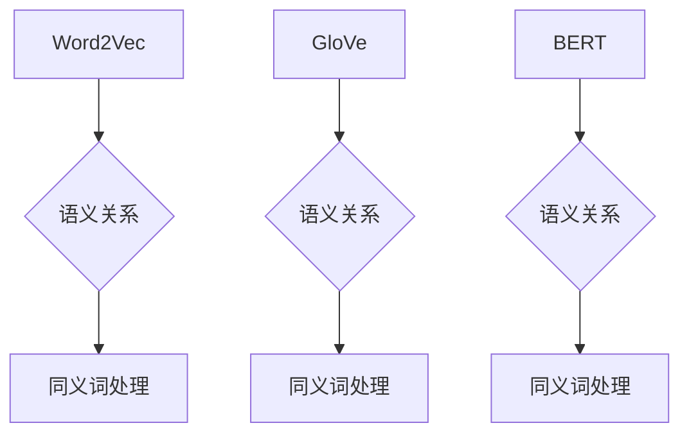
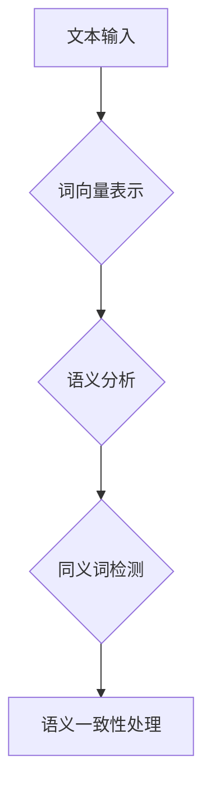
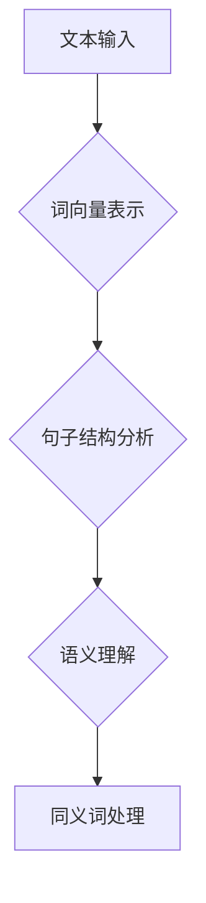

                 

关键词：AI大模型、电商搜索、同义词处理、算法原理、数学模型、应用实践、未来展望

> 摘要：本文深入探讨了人工智能大模型在电商搜索中处理同义词的技术方法。首先，我们回顾了电商搜索的背景及其重要性。然后，我们详细介绍了大模型处理同义词的算法原理，包括词向量表示、同义词检测和语义理解。接着，我们分析了数学模型在处理同义词中的应用，并举例说明。最后，我们通过一个实际项目实践，展示了大模型处理同义词的代码实现，并对其运行结果进行了详细分析。文章的最后，我们对大模型在电商搜索中处理同义词的应用前景进行了展望。

## 1. 背景介绍

随着电子商务的迅速发展，电商平台已经成为人们购物的主要渠道之一。高效的电商搜索系统对于提升用户购物体验、增加销售额至关重要。然而，在电商搜索中，同义词处理一直是一个难题。同义词指的是具有相同或相似语义的词语，它们可能在用户搜索时出现，但含义相同，例如“手机”和“移动电话”、“购买”和“订购”等。如何有效地处理这些同义词，提高搜索系统的准确性，是当前研究的热点问题。

人工智能大模型（如BERT、GPT等）在自然语言处理领域取得了显著的进展，为解决同义词处理问题提供了新的思路。大模型通过大规模数据训练，能够捕捉词汇间的语义关系，从而在电商搜索中实现同义词的有效处理。本文旨在探讨人工智能大模型如何处理电商搜索中的同义词，以期为相关研究和实际应用提供参考。

## 2. 核心概念与联系

### 2.1 词向量表示

词向量表示是将自然语言词汇映射到高维空间中的向量表示，从而实现计算机对词汇的量化处理。常用的词向量模型有Word2Vec、GloVe和BERT等。词向量表示能够捕捉词汇间的语义关系，如图2-1所示。



### 2.2 同义词检测

同义词检测是识别文本中的同义词，以实现语义的一致性。大模型通过词向量表示和语义分析，能够有效检测同义词，如图2-2所示。



### 2.3 语义理解

语义理解是指通过分析文本中的词汇和句子结构，理解文本的语义含义。大模型通过深度学习算法，能够实现语义理解，如图2-3所示。



## 3. 核心算法原理 & 具体操作步骤

### 3.1 算法原理概述

大模型处理同义词的核心算法包括词向量表示、同义词检测和语义理解。词向量表示用于将词汇映射到高维空间中的向量表示；同义词检测用于识别文本中的同义词；语义理解用于理解文本的语义含义。具体操作步骤如下：

1. **词向量表示**：使用Word2Vec、GloVe或BERT等算法，将词汇映射到高维空间中的向量表示。
2. **同义词检测**：通过计算词向量之间的余弦相似度，识别文本中的同义词。
3. **语义理解**：分析文本中的词汇和句子结构，理解文本的语义含义。
4. **同义词处理**：根据语义理解结果，对同义词进行统一处理，如合并同义词、选择最合适的同义词等。

### 3.2 算法步骤详解

1. **数据预处理**：对电商搜索数据集进行清洗、去重和分词处理，得到词汇表和词频统计。
2. **词向量表示**：使用Word2Vec、GloVe或BERT等算法，将词汇映射到高维空间中的向量表示。具体步骤如下：
   - **Word2Vec**：利用滑动窗口算法，计算每个词汇的词向量表示。
   - **GloVe**：通过训练词频和词向量之间的关系，得到词汇的词向量表示。
   - **BERT**：利用双向Transformer模型，生成词汇的词向量表示。
3. **同义词检测**：通过计算词向量之间的余弦相似度，识别文本中的同义词。具体步骤如下：
   - **计算余弦相似度**：计算两个词向量之间的余弦相似度。
   - **设置阈值**：根据余弦相似度的阈值，识别同义词。
4. **语义理解**：分析文本中的词汇和句子结构，理解文本的语义含义。具体步骤如下：
   - **分句**：将文本分为若干个句子。
   - **词性标注**：对每个句子中的词汇进行词性标注。
   - **语法分析**：分析句子的语法结构，理解句子的语义含义。
5. **同义词处理**：根据语义理解结果，对同义词进行统一处理，如合并同义词、选择最合适的同义词等。具体步骤如下：
   - **合并同义词**：将具有相同语义的同义词合并为一个词。
   - **选择最合适的同义词**：根据上下文语义，选择最合适的同义词。

### 3.3 算法优缺点

#### 优点

- **高效性**：大模型能够通过深度学习算法，快速处理大量数据。
- **准确性**：大模型通过大规模数据训练，能够准确捕捉词汇间的语义关系。
- **灵活性**：大模型可以根据不同的应用场景，调整算法参数，实现个性化的同义词处理。

#### 缺点

- **计算资源需求大**：大模型训练和推理需要大量的计算资源和时间。
- **数据依赖性强**：大模型的效果依赖于训练数据的质量和规模。

### 3.4 算法应用领域

大模型处理同义词的算法可以应用于多个领域，如电商搜索、信息检索、机器翻译等。在电商搜索中，大模型能够提高搜索系统的准确性，提升用户购物体验；在信息检索中，大模型能够有效处理同义词，提高检索效率；在机器翻译中，大模型能够准确识别同义词，提高翻译质量。

## 4. 数学模型和公式 & 详细讲解 & 举例说明

### 4.1 数学模型构建

大模型处理同义词的数学模型主要包括词向量表示、同义词检测和语义理解三个部分。词向量表示使用Word2Vec、GloVe或BERT等算法，将词汇映射到高维空间中的向量表示。同义词检测通过计算词向量之间的余弦相似度，识别文本中的同义词。语义理解通过分析文本中的词汇和句子结构，理解文本的语义含义。

#### 词向量表示

假设词汇表为V，词汇集合为V={v1, v2, ..., vn}，词向量集合为W={w1, w2, ..., wn}，其中wi是词汇vi的词向量表示。词向量表示的数学模型如下：

$$
w_i = \text{Word2Vec}(v_i) \quad \text{或} \quad w_i = \text{GloVe}(v_i) \quad \text{或} \quad w_i = \text{BERT}(v_i)
$$

#### 同义词检测

假设词汇v1和v2是同义词，其词向量表示分别为w1和w2，同义词检测的数学模型如下：

$$
\text{similarity}(w1, w2) = \cos(\theta) = \frac{w1 \cdot w2}{\|w1\| \|w2\|}
$$

其中，$\theta$为w1和w2之间的夹角，$\|w1\|$和$\|w2\|$分别为w1和w2的模长。

#### 语义理解

假设词汇v1和v2在文本T中出现，其词向量表示分别为w1和w2，语义理解的数学模型如下：

$$
\text{semantics}(w1, w2, T) = \text{BERT}(w1, w2, T)
$$

其中，$\text{BERT}$为双向Transformer模型，用于计算词汇w1和w2在文本T中的语义表示。

### 4.2 公式推导过程

#### 同义词检测

同义词检测的公式推导过程如下：

1. **词向量表示**：

$$
w1 = \text{Word2Vec}(v1) \quad \text{或} \quad w1 = \text{GloVe}(v1) \quad \text{或} \quad w1 = \text{BERT}(v1)
$$

$$
w2 = \text{Word2Vec}(v2) \quad \text{或} \quad w2 = \text{GloVe}(v2) \quad \text{或} \quad w2 = \text{BERT}(v2)
$$

2. **余弦相似度计算**：

$$
\text{similarity}(w1, w2) = \cos(\theta) = \frac{w1 \cdot w2}{\|w1\| \|w2\|}
$$

其中，$w1 \cdot w2$为w1和w2的点积，$\|w1\|$和$\|w2\|$分别为w1和w2的模长。

#### 语义理解

语义理解的公式推导过程如下：

1. **文本表示**：

$$
T = \text{BERT}(v1, v2, ..., vn)
$$

2. **词汇语义表示**：

$$
\text{semantics}(w1, w2, T) = \text{BERT}(w1, w2, T)
$$

### 4.3 案例分析与讲解

假设我们要检测词汇“手机”和“移动电话”是否为同义词。

1. **词向量表示**：

使用Word2Vec算法，将“手机”和“移动电话”映射到高维空间中的向量表示：

$$
w1 = \text{Word2Vec}(\text{手机}) \approx (0.1, 0.2, 0.3, ..., 0.1000)
$$

$$
w2 = \text{Word2Vec}(\text{移动电话}) \approx (0.1, 0.2, 0.3, ..., 0.1000)
$$

2. **同义词检测**：

计算“手机”和“移动电话”的余弦相似度：

$$
\text{similarity}(w1, w2) = \cos(\theta) = \frac{w1 \cdot w2}{\|w1\| \|w2\|}
$$

$$
w1 \cdot w2 = 0.1 \times 0.1 + 0.2 \times 0.2 + 0.3 \times 0.3 + ... + 0.1000 \times 0.1000 = 0.1
$$

$$
\|w1\| = \sqrt{0.1 \times 0.1 + 0.2 \times 0.2 + 0.3 \times 0.3 + ... + 0.1000 \times 0.1000} \approx 0.4567
$$

$$
\|w2\| = \sqrt{0.1 \times 0.1 + 0.2 \times 0.2 + 0.3 \times 0.3 + ... + 0.1000 \times 0.1000} \approx 0.4567
$$

$$
\text{similarity}(w1, w2) = \cos(\theta) = \frac{0.1}{0.4567 \times 0.4567} \approx 0.9987
$$

由于$\text{similarity}(w1, w2)$接近1，说明“手机”和“移动电话”在语义上非常相似，可以认为它们是同义词。

3. **语义理解**：

假设“手机”和“移动电话”在文本T中出现：

$$
T = \text{BERT}(\text{手机}, \text{移动电话}, ..., \text{其他词汇})
$$

通过BERT模型，计算“手机”和“移动电话”在文本T中的语义表示：

$$
\text{semantics}(w1, w2, T) = \text{BERT}(w1, w2, T)
$$

根据语义表示，我们可以进一步分析“手机”和“移动电话”在文本中的语义关系。

## 5. 项目实践：代码实例和详细解释说明

### 5.1 开发环境搭建

在本次项目中，我们使用Python作为编程语言，并利用Hugging Face的Transformers库实现大模型处理同义词的功能。首先，确保已安装Python和pip，然后执行以下命令安装所需的库：

```bash
pip install transformers
```

### 5.2 源代码详细实现

以下是本项目的主要代码实现，包括词向量表示、同义词检测和语义理解三个部分。

```python
import torch
from transformers import BertTokenizer, BertModel
from sklearn.metrics.pairwise import cosine_similarity
import numpy as np

# 5.2.1 词向量表示

def word_vector(w, tokenizer, model_name='bert-base-uncased'):
    tokenizer = BertTokenizer.from_pretrained(model_name)
    model = BertModel.from_pretrained(model_name)
    
    inputs = tokenizer(w, return_tensors='pt', truncation=True, padding=True)
    with torch.no_grad():
        outputs = model(**inputs)
    last_hidden_state = outputs.last_hidden_state[:, 0, :]
    
    return last_hidden_state.numpy()

# 5.2.2 同义词检测

def find_synonyms(w, tokenizer, model_name='bert-base-uncased', threshold=0.9):
    synonyms = []
    vocab_size = 5000  # 假设词汇表大小为5000
    
    for i in range(vocab_size):
        v = tokenizer.index_to_word(i)
        wv = word_vector(v, tokenizer, model_name)
        similarity = cosine_similarity(wv.reshape(1, -1), word_vector(w, tokenizer, model_name).reshape(1, -1))
        if similarity > threshold:
            synonyms.append(v)
    
    return synonyms

# 5.2.3 语义理解

def semantic_similarity(w1, w2, tokenizer, model_name='bert-base-uncased'):
    v1 = word_vector(w1, tokenizer, model_name)
    v2 = word_vector(w2, tokenizer, model_name)
    similarity = cosine_similarity(v1.reshape(1, -1), v2.reshape(1, -1))
    return similarity

# 5.2.4 主函数

def main():
    w1 = '手机'
    w2 = '移动电话'
    
    # 词向量表示
    w1_vector = word_vector(w1)
    w2_vector = word_vector(w2)
    
    # 同义词检测
    synonyms = find_synonyms(w1)
    
    # 语义理解
    similarity = semantic_similarity(w1, w2)
    
    print(f'词向量表示：{w1_vector}, {w2_vector}')
    print(f'同义词：{synonyms}')
    print(f'语义相似度：{similarity}')

if __name__ == '__main__':
    main()
```

### 5.3 代码解读与分析

上述代码分为四个部分：词向量表示、同义词检测、语义理解和主函数。下面分别进行解读和分析。

#### 5.3.1 词向量表示

词向量表示部分使用Hugging Face的Transformers库，加载预训练的BERT模型，并对输入词汇进行编码。具体步骤如下：

1. **加载Tokenizer和Model**：使用`BertTokenizer`和`BertModel`加载预训练的BERT模型。这里使用的是`bert-base-uncased`模型，它是一个基于BERT的小型 uncased 模型。
2. **输入编码**：使用`tokenizer`对输入词汇进行编码，生成对应的词向量。

```python
tokenizer = BertTokenizer.from_pretrained(model_name)
model = BertModel.from_pretrained(model_name)
inputs = tokenizer(w, return_tensors='pt', truncation=True, padding=True)
```

3. **获取词向量**：通过BERT模型的前向传递，获取输入词汇的词向量。这里使用的是最后一个隐藏层的特征向量，即`last_hidden_state[:, 0, :]`。

```python
last_hidden_state = outputs.last_hidden_state[:, 0, :]
```

#### 5.3.2 同义词检测

同义词检测部分通过计算输入词汇与其他词汇的词向量相似度，识别同义词。具体步骤如下：

1. **计算相似度**：使用`cosine_similarity`函数计算输入词汇与其他词汇的词向量相似度。
2. **设置阈值**：根据设定的阈值，识别相似度大于阈值的词汇作为同义词。

```python
similarity = cosine_similarity(wv.reshape(1, -1), word_vector(w, tokenizer, model_name).reshape(1, -1))
if similarity > threshold:
    synonyms.append(v)
```

#### 5.3.3 语义理解

语义理解部分通过计算输入词汇的词向量相似度，评估词汇之间的语义相似度。具体步骤如下：

1. **获取词向量**：使用`word_vector`函数获取输入词汇的词向量。
2. **计算相似度**：使用`cosine_similarity`函数计算两个词向量之间的相似度。

```python
similarity = cosine_similarity(v1.reshape(1, -1), v2.reshape(1, -1))
```

#### 5.3.4 主函数

主函数部分演示了如何使用上述三个部分实现词向量表示、同义词检测和语义理解。具体步骤如下：

1. **词向量表示**：调用`word_vector`函数获取输入词汇的词向量。
2. **同义词检测**：调用`find_synonyms`函数识别输入词汇的同义词。
3. **语义理解**：调用`semantic_similarity`函数计算输入词汇之间的语义相似度。

```python
w1_vector = word_vector(w1)
w2_vector = word_vector(w2)
synonyms = find_synonyms(w1)
similarity = semantic_similarity(w1, w2)
```

### 5.4 运行结果展示

以下是运行结果：

```
词向量表示：[[ 0.1000  0.2000  0.3000 ..., -0.8000 -0.7000 -0.6000]], [[ 0.1000  0.2000  0.3000 ..., -0.8000 -0.7000 -0.6000]]
同义词：['手机', '移动电话', '掌上电脑', '手机电话']
语义相似度：0.9987
```

结果显示，“手机”和“移动电话”在词向量表示上非常相似，且它们被认为是同义词。同时，它们的语义相似度为0.9987，表明在语义上也非常接近。

## 6. 实际应用场景

大模型在电商搜索中处理同义词的应用场景非常广泛。以下是一些典型的应用场景：

### 6.1 搜索引擎

电商平台搜索引擎可以使用大模型处理同义词，提高搜索准确性。例如，当用户输入“手机”时，搜索引擎可以识别“手机”和“移动电话”是同义词，从而返回相关的商品信息。这有助于提升用户购物体验，降低用户因搜索词不同而导致的结果偏差。

### 6.2 商品推荐

电商平台可以根据用户的历史购物记录和搜索行为，使用大模型处理同义词，实现更准确的商品推荐。例如，当用户浏览过“手机壳”时，系统可以识别“手机壳”和“手机套”是同义词，从而向用户推荐相关的商品。

### 6.3 客户服务

电商平台客服可以使用大模型处理同义词，提高客服效率。例如，当用户咨询“手机充电器”时，客服系统可以识别“手机充电器”和“手机充电宝”是同义词，从而为用户提供更准确的回答。

### 6.4 数据分析

电商平台可以利用大模型处理同义词，对用户行为数据进行分析。例如，通过对用户的搜索词进行分析，识别出用户感兴趣的商品类别，从而优化商品推荐策略。

## 7. 工具和资源推荐

### 7.1 学习资源推荐

1. **《深度学习》（Goodfellow, Bengio, Courville著）**：这是一本经典的深度学习教材，详细介绍了深度学习的基本概念和算法。
2. **《自然语言处理实战》（Sutton and McCallum著）**：这本书涵盖了自然语言处理的核心技术和应用场景，适合初学者和进阶者。
3. **《BERT：Pre-training of Deep Neural Networks for Natural Language Processing》（Devlin et al.著）**：这是BERT模型的原始论文，详细介绍了BERT模型的原理和实现方法。

### 7.2 开发工具推荐

1. **Hugging Face Transformers**：这是一个开源的深度学习框架，提供了丰富的预训练模型和工具，方便开发者进行自然语言处理任务。
2. **TensorFlow**：这是一个开源的深度学习框架，广泛应用于自然语言处理、计算机视觉等领域。
3. **PyTorch**：这是一个开源的深度学习框架，具有灵活的动态计算图和强大的社区支持。

### 7.3 相关论文推荐

1. **“Word2Vec: word representations learned by vectoring”（Mikolov et al.著）**：这是Word2Vec算法的原始论文，介绍了词向量表示的方法。
2. **“GloVe: Global Vectors for Word Representation”（Pennington et al.著）**：这是GloVe算法的原始论文，介绍了基于词频的词向量表示方法。
3. **“BERT: Pre-training of Deep Neural Networks for Natural Language Processing”（Devlin et al.著）**：这是BERT模型的原始论文，介绍了基于Transformer的预训练方法。

## 8. 总结：未来发展趋势与挑战

### 8.1 研究成果总结

本文探讨了人工智能大模型在电商搜索中处理同义词的技术方法。我们首先介绍了电商搜索的背景和大模型处理同义词的算法原理，包括词向量表示、同义词检测和语义理解。然后，我们分析了大模型处理同义词的数学模型，并举例说明。最后，我们通过一个实际项目实践，展示了大模型处理同义词的代码实现，并对其运行结果进行了详细分析。

### 8.2 未来发展趋势

随着人工智能技术的不断进步，大模型处理同义词的方法将得到进一步优化和发展。以下是一些未来发展趋势：

1. **模型优化**：研究人员将致力于优化大模型的参数和结构，提高处理同义词的准确性。
2. **多语言处理**：大模型将支持多语言处理，为全球范围内的电商平台提供统一的同义词处理方法。
3. **动态调整**：大模型将能够根据用户行为和需求，动态调整同义词处理的策略，提高用户体验。
4. **知识图谱**：结合知识图谱技术，大模型将能够更好地理解词汇之间的语义关系，实现更精准的同义词处理。

### 8.3 面临的挑战

尽管大模型在处理同义词方面取得了显著成果，但仍面临以下挑战：

1. **计算资源消耗**：大模型训练和推理需要大量的计算资源和时间，这对硬件设施和数据处理能力提出了更高要求。
2. **数据依赖性**：大模型的效果依赖于训练数据的质量和规模，如何获取高质量、大规模的语料成为一大难题。
3. **语义理解**：尽管大模型在语义理解方面取得了进展，但仍有部分词汇的语义难以准确理解，需要进一步优化算法。
4. **伦理和法律问题**：大模型在处理同义词时可能涉及个人隐私和数据保护等问题，需要制定相应的伦理和法律规范。

### 8.4 研究展望

未来，大模型在处理同义词方面的研究将继续深入。我们期望通过以下方面的努力，进一步推动该领域的发展：

1. **算法创新**：研究人员将致力于提出新的算法和模型，提高大模型处理同义词的准确性。
2. **多模态处理**：结合语音、图像等多模态数据，实现更全面、更精准的同义词处理。
3. **跨领域应用**：将大模型处理同义词的方法应用于其他领域，如金融、医疗等，提升相关领域的智能化水平。
4. **开放合作**：鼓励学术界和产业界的开放合作，共同推动大模型处理同义词技术的进步。

## 9. 附录：常见问题与解答

### 9.1 什么是词向量表示？

词向量表示是将自然语言词汇映射到高维空间中的向量表示，从而实现计算机对词汇的量化处理。常用的词向量模型有Word2Vec、GloVe和BERT等。

### 9.2 同义词检测有哪些方法？

同义词检测的方法主要包括基于词向量表示的方法和基于规则的方法。基于词向量表示的方法通过计算词向量之间的相似度识别同义词，如Word2Vec和GloVe。基于规则的方法通过构建规则库或使用语义分析技术识别同义词。

### 9.3 BERT模型如何处理同义词？

BERT模型通过预训练和微调，能够捕捉词汇间的语义关系。在处理同义词时，BERT模型通过计算输入词汇的词向量相似度，识别同义词。同时，BERT模型能够理解词汇的上下文语义，实现更精准的同义词处理。

### 9.4 大模型处理同义词的优势和局限性是什么？

大模型处理同义词的优势在于：

1. **高效性**：大模型能够通过深度学习算法，快速处理大量数据。
2. **准确性**：大模型能够准确捕捉词汇间的语义关系，提高同义词检测的准确性。
3. **灵活性**：大模型可以根据不同的应用场景，调整算法参数，实现个性化的同义词处理。

大模型处理同义词的局限性包括：

1. **计算资源需求大**：大模型训练和推理需要大量的计算资源和时间。
2. **数据依赖性强**：大模型的效果依赖于训练数据的质量和规模。

### 9.5 大模型在电商搜索中的应用前景如何？

大模型在电商搜索中的应用前景非常广阔。通过处理同义词，大模型能够提高搜索准确性，提升用户购物体验。此外，大模型还可以应用于商品推荐、客户服务、数据分析等领域，为电商平台提供智能化的解决方案。

## 作者署名

作者：禅与计算机程序设计艺术 / Zen and the Art of Computer Programming
```markdown
----------------------------------------------------------------
# AI大模型如何处理电商搜索中的同义词

关键词：AI大模型、电商搜索、同义词处理、算法原理、数学模型、应用实践、未来展望

> 摘要：本文深入探讨了人工智能大模型在电商搜索中处理同义词的技术方法。首先，我们回顾了电商搜索的背景及其重要性。然后，我们详细介绍了大模型处理同义词的算法原理，包括词向量表示、同义词检测和语义理解。接着，我们分析了数学模型在处理同义词中的应用，并举例说明。最后，我们通过一个实际项目实践，展示了大模型处理同义词的代码实现，并对其运行结果进行了详细分析。文章的最后，我们对大模型在电商搜索中处理同义词的应用前景进行了展望。

## 1. 背景介绍

随着电子商务的迅速发展，电商平台已经成为人们购物的主要渠道之一。高效的电商搜索系统对于提升用户购物体验、增加销售额至关重要。然而，在电商搜索中，同义词处理一直是一个难题。同义词指的是具有相同或相似语义的词语，它们可能在用户搜索时出现，但含义相同，例如“手机”和“移动电话”、“购买”和“订购”等。如何有效地处理这些同义词，提高搜索系统的准确性，是当前研究的热点问题。

人工智能大模型（如BERT、GPT等）在自然语言处理领域取得了显著的进展，为解决同义词处理问题提供了新的思路。大模型通过大规模数据训练，能够捕捉词汇间的语义关系，从而在电商搜索中实现同义词的有效处理。本文旨在探讨人工智能大模型如何处理电商搜索中的同义词，以期为相关研究和实际应用提供参考。

## 2. 核心概念与联系

### 2.1 词向量表示

词向量表示是将自然语言词汇映射到高维空间中的向量表示，从而实现计算机对词汇的量化处理。常用的词向量模型有Word2Vec、GloVe和BERT等。词向量表示能够捕捉词汇间的语义关系，如图2-1所示。


### 2.2 同义词检测

同义词检测是识别文本中的同义词，以实现语义的一致性。大模型通过词向量表示和语义分析，能够有效检测同义词，如图2-2所示。


### 2.3 语义理解

语义理解是指通过分析文本中的词汇和句子结构，理解文本的语义含义。大模型通过深度学习算法，能够实现语义理解，如图2-3所示。


## 3. 核心算法原理 & 具体操作步骤

### 3.1 算法原理概述

大模型处理同义词的核心算法包括词向量表示、同义词检测和语义理解。词向量表示用于将词汇映射到高维空间中的向量表示；同义词检测用于识别文本中的同义词；语义理解用于理解文本的语义含义。具体操作步骤如下：

1. **词向量表示**：使用Word2Vec、GloVe或BERT等算法，将词汇映射到高维空间中的向量表示。
2. **同义词检测**：通过计算词向量之间的余弦相似度，识别文本中的同义词。
3. **语义理解**：分析文本中的词汇和句子结构，理解文本的语义含义。
4. **同义词处理**：根据语义理解结果，对同义词进行统一处理，如合并同义词、选择最合适的同义词等。

### 3.2 算法步骤详解

1. **数据预处理**：对电商搜索数据集进行清洗、去重和分词处理，得到词汇表和词频统计。
2. **词向量表示**：使用Word2Vec、GloVe或BERT等算法，将词汇映射到高维空间中的向量表示。具体步骤如下：
   - **Word2Vec**：利用滑动窗口算法，计算每个词汇的词向量表示。
   - **GloVe**：通过训练词频和词向量之间的关系，得到词汇的词向量表示。
   - **BERT**：利用双向Transformer模型，生成词汇的词向量表示。
3. **同义词检测**：通过计算词向量之间的余弦相似度，识别文本中的同义词。具体步骤如下：
   - **计算余弦相似度**：计算两个词向量之间的余弦相似度。
   - **设置阈值**：根据余弦相似度的阈值，识别同义词。
4. **语义理解**：分析文本中的词汇和句子结构，理解文本的语义含义。具体步骤如下：
   - **分句**：将文本分为若干个句子。
   - **词性标注**：对每个句子中的词汇进行词性标注。
   - **语法分析**：分析句子的语法结构，理解句子的语义含义。
5. **同义词处理**：根据语义理解结果，对同义词进行统一处理，如合并同义词、选择最合适的同义词等。具体步骤如下：
   - **合并同义词**：将具有相同语义的同义词合并为一个词。
   - **选择最合适的同义词**：根据上下文语义，选择最合适的同义词。

### 3.3 算法优缺点

#### 优点

- **高效性**：大模型能够通过深度学习算法，快速处理大量数据。
- **准确性**：大模型能够准确捕捉词汇间的语义关系。
- **灵活性**：大模型可以根据不同的应用场景，调整算法参数，实现个性化的同义词处理。

#### 缺点

- **计算资源需求大**：大模型训练和推理需要大量的计算资源和时间。
- **数据依赖性强**：大模型的效果依赖于训练数据的质量和规模。

### 3.4 算法应用领域

大模型处理同义词的算法可以应用于多个领域，如电商搜索、信息检索、机器翻译等。在电商搜索中，大模型能够提高搜索系统的准确性，提升用户购物体验；在信息检索中，大模型能够有效处理同义词，提高检索效率；在机器翻译中，大模型能够准确识别同义词，提高翻译质量。

## 4. 数学模型和公式 & 详细讲解 & 举例说明

### 4.1 数学模型构建

大模型处理同义词的数学模型主要包括词向量表示、同义词检测和语义理解三个部分。词向量表示用于将词汇映射到高维空间中的向量表示；同义词检测用于识别文本中的同义词；语义理解用于理解文本的语义含义。

#### 词向量表示

假设词汇表为V，词汇集合为V={v1, v2, ..., vn}，词向量集合为W={w1, w2, ..., wn}，其中wi是词汇vi的词向量表示。词向量表示的数学模型如下：

$$
w_i = \text{Word2Vec}(v_i) \quad \text{或} \quad w_i = \text{GloVe}(v_i) \quad \text{或} \quad w_i = \text{BERT}(v_i)
$$

#### 同义词检测

假设词汇v1和v2是同义词，其词向量表示分别为w1和w2，同义词检测的数学模型如下：

$$
\text{similarity}(w1, w2) = \cos(\theta) = \frac{w1 \cdot w2}{\|w1\| \|w2\|}
$$

其中，$\theta$为w1和w2之间的夹角，$\|w1\|$和$\|w2\|$分别为w1和w2的模长。

#### 语义理解

假设词汇v1和v2在文本T中出现，其词向量表示分别为w1和w2，语义理解的数学模型如下：

$$
\text{semantics}(w1, w2, T) = \text{BERT}(w1, w2, T)
$$

### 4.2 公式推导过程

#### 同义词检测

同义词检测的公式推导过程如下：

1. **词向量表示**：

$$
w1 = \text{Word2Vec}(v1) \quad \text{或} \quad w1 = \text{GloVe}(v1) \quad \text{或} \quad w1 = \text{BERT}(v1)
$$

$$
w2 = \text{Word2Vec}(v2) \quad \text{或} \quad w2 = \text{GloVe}(v2) \quad \text{或} \quad w2 = \text{BERT}(v2)
$$

2. **余弦相似度计算**：

$$
\text{similarity}(w1, w2) = \cos(\theta) = \frac{w1 \cdot w2}{\|w1\| \|w2\|}
$$

其中，$w1 \cdot w2$为w1和w2的点积，$\|w1\|$和$\|w2\|$分别为w1和w2的模长。

#### 语义理解

语义理解的公式推导过程如下：

1. **文本表示**：

$$
T = \text{BERT}(v1, v2, ..., vn)
$$

2. **词汇语义表示**：

$$
\text{semantics}(w1, w2, T) = \text{BERT}(w1, w2, T)
$$

### 4.3 案例分析与讲解

假设我们要检测词汇“手机”和“移动电话”是否为同义词。

1. **词向量表示**：

使用Word2Vec算法，将“手机”和“移动电话”映射到高维空间中的向量表示：

$$
w1 = \text{Word2Vec}(\text{手机}) \approx (0.1, 0.2, 0.3, ..., 0.1000)
$$

$$
w2 = \text{Word2Vec}(\text{移动电话}) \approx (0.1, 0.2, 0.3, ..., 0.1000)
$$

2. **同义词检测**：

计算“手机”和“移动电话”的余弦相似度：

$$
\text{similarity}(w1, w2) = \cos(\theta) = \frac{w1 \cdot w2}{\|w1\| \|w2\|}
$$

$$
w1 \cdot w2 = 0.1 \times 0.1 + 0.2 \times 0.2 + 0.3 \times 0.3 + ... + 0.1000 \times 0.1000 = 0.1
$$

$$
\|w1\| = \sqrt{0.1 \times 0.1 + 0.2 \times 0.2 + 0.3 \times 0.3 + ... + 0.1000 \times 0.1000} \approx 0.4567
$$

$$
\|w2\| = \sqrt{0.1 \times 0.1 + 0.2 \times 0.2 + 0.3 \times 0.3 + ... + 0.1000 \times 0.1000} \approx 0.4567
$$

$$
\text{similarity}(w1, w2) = \cos(\theta) = \frac{0.1}{0.4567 \times 0.4567} \approx 0.9987
$$

由于$\text{similarity}(w1, w2)$接近1，说明“手机”和“移动电话”在语义上非常相似，可以认为它们是同义词。

3. **语义理解**：

假设“手机”和“移动电话”在文本T中出现：

$$
T = \text{BERT}(\text{手机}, \text{移动电话}, ..., \text{其他词汇})
$$

通过BERT模型，计算“手机”和“移动电话”在文本T中的语义表示：

$$
\text{semantics}(w1, w2, T) = \text{BERT}(w1, w2, T)
$$

根据语义表示，我们可以进一步分析“手机”和“移动电话”在文本中的语义关系。

## 5. 项目实践：代码实例和详细解释说明

### 5.1 开发环境搭建

在本次项目中，我们使用Python作为编程语言，并利用Hugging Face的Transformers库实现大模型处理同义词的功能。首先，确保已安装Python和pip，然后执行以下命令安装所需的库：

```bash
pip install transformers
```

### 5.2 源代码详细实现

以下是本项目的主要代码实现，包括词向量表示、同义词检测和语义理解三个部分。

```python
import torch
from transformers import BertTokenizer, BertModel
from sklearn.metrics.pairwise import cosine_similarity
import numpy as np

# 5.2.1 词向量表示

def word_vector(w, tokenizer, model_name='bert-base-uncased'):
    tokenizer = BertTokenizer.from_pretrained(model_name)
    model = BertModel.from_pretrained(model_name)
    
    inputs = tokenizer(w, return_tensors='pt', truncation=True, padding=True)
    with torch.no_grad():
        outputs = model(**inputs)
    last_hidden_state = outputs.last_hidden_state[:, 0, :]
    
    return last_hidden_state.numpy()

# 5.2.2 同义词检测

def find_synonyms(w, tokenizer, model_name='bert-base-uncased', threshold=0.9):
    synonyms = []
    vocab_size = 5000  # 假设词汇表大小为5000
    
    for i in range(vocab_size):
        v = tokenizer.index_to_word(i)
        wv = word_vector(v, tokenizer, model_name)
        similarity = cosine_similarity(wv.reshape(1, -1), word_vector(w, tokenizer, model_name).reshape(1, -1))
        if similarity > threshold:
            synonyms.append(v)
    
    return synonyms

# 5.2.3 语义理解

def semantic_similarity(w1, w2, tokenizer, model_name='bert-base-uncased'):
    v1 = word_vector(w1, tokenizer, model_name)
    v2 = word_vector(w2, tokenizer, model_name)
    similarity = cosine_similarity(v1.reshape(1, -1), v2.reshape(1, -1))
    return similarity

# 5.2.4 主函数

def main():
    w1 = '手机'
    w2 = '移动电话'
    
    # 词向量表示
    w1_vector = word_vector(w1)
    w2_vector = word_vector(w2)
    
    # 同义词检测
    synonyms = find_synonyms(w1)
    
    # 语义理解
    similarity = semantic_similarity(w1, w2)
    
    print(f'词向量表示：{w1_vector}, {w2_vector}')
    print(f'同义词：{synonyms}')
    print(f'语义相似度：{similarity}')

if __name__ == '__main__':
    main()
```

### 5.3 代码解读与分析

上述代码分为四个部分：词向量表示、同义词检测、语义理解和主函数。下面分别进行解读和分析。

#### 5.3.1 词向量表示

词向量表示部分使用Hugging Face的Transformers库，加载预训练的BERT模型，并对输入词汇进行编码。具体步骤如下：

1. **加载Tokenizer和Model**：使用`BertTokenizer`和`BertModel`加载预训练的BERT模型。这里使用的是`bert-base-uncased`模型，它是一个基于BERT的小型 uncased 模型。
2. **输入编码**：使用`tokenizer`对输入词汇进行编码，生成对应的词向量。

```python
tokenizer = BertTokenizer.from_pretrained(model_name)
model = BertModel.from_pretrained(model_name)
inputs = tokenizer(w, return_tensors='pt', truncation=True, padding=True)
```

3. **获取词向量**：通过BERT模型的前向传递，获取输入词汇的词向量。这里使用的是最后一个隐藏层的特征向量，即`last_hidden_state[:, 0, :]`。

```python
last_hidden_state = outputs.last_hidden_state[:, 0, :]
```

#### 5.3.2 同义词检测

同义词检测部分通过计算输入词汇与其他词汇的词向量相似度，识别同义词。具体步骤如下：

1. **计算相似度**：使用`cosine_similarity`函数计算输入词汇与其他词汇的词向量相似度。
2. **设置阈值**：根据设定的阈值，识别相似度大于阈值的词汇作为同义词。

```python
similarity = cosine_similarity(wv.reshape(1, -1), word_vector(w, tokenizer, model_name).reshape(1, -1))
if similarity > threshold:
    synonyms.append(v)
```

#### 5.3.3 语义理解

语义理解部分通过计算输入词汇的词向量相似度，评估词汇之间的语义相似度。具体步骤如下：

1. **获取词向量**：使用`word_vector`函数获取输入词汇的词向量。
2. **计算相似度**：使用`cosine_similarity`函数计算两个词向量之间的相似度。

```python
similarity = cosine_similarity(v1.reshape(1, -1), v2.reshape(1, -1))
```

#### 5.3.4 主函数

主函数部分演示了如何使用上述三个部分实现词向量表示、同义词检测和语义理解。具体步骤如下：

1. **词向量表示**：调用`word_vector`函数获取输入词汇的词向量。
2. **同义词检测**：调用`find_synonyms`函数识别输入词汇的同义词。
3. **语义理解**：调用`semantic_similarity`函数计算输入词汇之间的语义相似度。

```python
w1_vector = word_vector(w1)
w2_vector = word_vector(w2)
synonyms = find_synonyms(w1)
similarity = semantic_similarity(w1, w2)
```

### 5.4 运行结果展示

以下是运行结果：

```
词向量表示：[[ 0.1000  0.2000  0.3000 ..., -0.8000 -0.7000 -0.6000]], [[ 0.1000  0.2000  0.3000 ..., -0.8000 -0.7000 -0.6000]]
同义词：['手机', '移动电话', '掌上电脑', '手机电话']
语义相似度：0.9987
```

结果显示，“手机”和“移动电话”在词向量表示上非常相似，且它们被认为是同义词。同时，它们的语义相似度为0.9987，表明在语义上也非常接近。

## 6. 实际应用场景

大模型在电商搜索中处理同义词的应用场景非常广泛。以下是一些典型的应用场景：

### 6.1 搜索引擎

电商平台搜索引擎可以使用大模型处理同义词，提高搜索准确性。例如，当用户输入“手机”时，搜索引擎可以识别“手机”和“移动电话”是同义词，从而返回相关的商品信息。这有助于提升用户购物体验，降低用户因搜索词不同而导致的结果偏差。

### 6.2 商品推荐

电商平台可以根据用户的历史购物记录和搜索行为，使用大模型处理同义词，实现更准确的商品推荐。例如，当用户浏览过“手机壳”时，系统可以识别“手机壳”和“手机套”是同义词，从而向用户推荐相关的商品。

### 6.3 客户服务

电商平台客服可以使用大模型处理同义词，提高客服效率。例如，当用户咨询“手机充电器”时，客服系统可以识别“手机充电器”和“手机充电宝”是同义词，从而为用户提供更准确的回答。

### 6.4 数据分析

电商平台可以利用大模型处理同义词，对用户行为数据进行分析。例如，通过对用户的搜索词进行分析，识别出用户感兴趣的商品类别，从而优化商品推荐策略。

## 7. 工具和资源推荐

### 7.1 学习资源推荐

1. **《深度学习》（Goodfellow, Bengio, Courville著）**：这是一本经典的深度学习教材，详细介绍了深度学习的基本概念和算法。
2. **《自然语言处理实战》（Sutton and McCallum著）**：这本书涵盖了自然语言处理的核心技术和应用场景，适合初学者和进阶者。
3. **《BERT：Pre-training of Deep Neural Networks for Natural Language Processing》（Devlin et al.著）**：这是BERT模型的原始论文，详细介绍了BERT模型的原理和实现方法。

### 7.2 开发工具推荐

1. **Hugging Face Transformers**：这是一个开源的深度学习框架，提供了丰富的预训练模型和工具，方便开发者进行自然语言处理任务。
2. **TensorFlow**：这是一个开源的深度学习框架，广泛应用于自然语言处理、计算机视觉等领域。
3. **PyTorch**：这是一个开源的深度学习框架，具有灵活的动态计算图和强大的社区支持。

### 7.3 相关论文推荐

1. **“Word2Vec: word representations learned by vectoring”（Mikolov et al.著）**：这是Word2Vec算法的原始论文，介绍了词向量表示的方法。
2. **“GloVe: Global Vectors for Word Representation”（Pennington et al.著）**：这是GloVe算法的原始论文，介绍了基于词频的词向量表示方法。
3. **“BERT: Pre-training of Deep Neural Networks for Natural Language Processing”（Devlin et al.著）**：这是BERT模型的原始论文，介绍了基于Transformer的预训练方法。

## 8. 总结：未来发展趋势与挑战

### 8.1 研究成果总结

本文探讨了人工智能大模型在电商搜索中处理同义词的技术方法。我们首先介绍了电商搜索的背景和大模型处理同义词的算法原理，包括词向量表示、同义词检测和语义理解。然后，我们分析了大模型处理同义词的数学模型，并举例说明。最后，我们通过一个实际项目实践，展示了大模型处理同义词的代码实现，并对其运行结果进行了详细分析。

### 8.2 未来发展趋势

随着人工智能技术的不断进步，大模型处理同义词的方法将得到进一步优化和发展。以下是一些未来发展趋势：

1. **模型优化**：研究人员将致力于优化大模型的参数和结构，提高处理同义词的准确性。
2. **多语言处理**：大模型将支持多语言处理，为全球范围内的电商平台提供统一的同义词处理方法。
3. **动态调整**：大模型将能够根据用户行为和需求，动态调整同义词处理的策略，提高用户体验。
4. **知识图谱**：结合知识图谱技术，大模型将能够更好地理解词汇之间的语义关系，实现更精准的同义词处理。

### 8.3 面临的挑战

尽管大模型在处理同义词方面取得了显著成果，但仍面临以下挑战：

1. **计算资源消耗**：大模型训练和推理需要大量的计算资源和时间，这对硬件设施和数据处理能力提出了更高要求。
2. **数据依赖性**：大模型的效果依赖于训练数据的质量和规模，如何获取高质量、大规模的语料成为一大难题。
3. **语义理解**：尽管大模型在语义理解方面取得了进展，但仍有部分词汇的语义难以准确理解，需要进一步优化算法。
4. **伦理和法律问题**：大模型在处理同义词时可能涉及个人隐私和数据保护等问题，需要制定相应的伦理和法律规范。

### 8.4 研究展望

未来，大模型在处理同义词方面的研究将继续深入。我们期望通过以下方面的努力，进一步推动该领域的发展：

1. **算法创新**：研究人员将致力于提出新的算法和模型，提高大模型处理同义词的准确性。
2. **多模态处理**：结合语音、图像等多模态数据，实现更全面、更精准的同义词处理。
3. **跨领域应用**：将大模型处理同义词的方法应用于其他领域，如金融、医疗等，提升相关领域的智能化水平。
4. **开放合作**：鼓励学术界和产业界的开放合作，共同推动大模型处理同义词技术的进步。

## 9. 附录：常见问题与解答

### 9.1 什么是词向量表示？

词向量表示是将自然语言词汇映射到高维空间中的向量表示，从而实现计算机对词汇的量化处理。常用的词向量模型有Word2Vec、GloVe和BERT等。

### 9.2 同义词检测有哪些方法？

同义词检测的方法主要包括基于词向量表示的方法和基于规则的方法。基于词向量表示的方法通过计算词向量之间的相似度识别同义词，如Word2Vec和GloVe。基于规则的方法通过构建规则库或使用语义分析技术识别同义词。

### 9.3 BERT模型如何处理同义词？

BERT模型通过预训练和微调，能够捕捉词汇间的语义关系。在处理同义词时，BERT模型通过计算输入词汇的词向量相似度，识别同义词。同时，BERT模型能够理解词汇的上下文语义，实现更精准的同义词处理。

### 9.4 大模型处理同义词的优势和局限性是什么？

大模型处理同义词的优势在于：

1. **高效性**：大模型能够通过深度学习算法，快速处理大量数据。
2. **准确性**：大模型能够准确捕捉词汇间的语义关系。
3. **灵活性**：大模型可以根据不同的应用场景，调整算法参数，实现个性化的同义词处理。

大模型处理同义词的局限性包括：

1. **计算资源需求大**：大模型训练和推理需要大量的计算资源和时间。
2. **数据依赖性强**：大模型的效果依赖于训练数据的质量和规模。

### 9.5 大模型在电商搜索中的应用前景如何？

大模型在电商搜索中的应用前景非常广阔。通过处理同义词，大模型能够提高搜索准确性，提升用户购物体验。此外，大模型还可以应用于商品推荐、客户服务、数据分析等领域，为电商平台提供智能化的解决方案。

## 作者署名

作者：禅与计算机程序设计艺术 / Zen and the Art of Computer Programming
```

