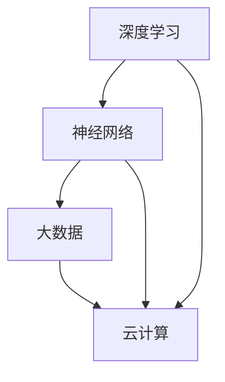

                 

关键词：AI大模型、企业运营效率、人工智能应用、数字化转型、数据处理、预测分析、自动化流程、智能决策

摘要：随着人工智能技术的快速发展，AI大模型在企业中的应用逐渐成为提升运营效率的重要手段。本文将探讨AI大模型的核心概念、算法原理、数学模型、应用实例，以及其在企业中的实际应用场景和未来展望。

## 1. 背景介绍

近年来，人工智能（AI）技术取得了显著的进展，特别是在深度学习领域。AI大模型，如GPT、BERT等，因其强大的数据处理能力和智能决策能力，已经在各行各业中得到了广泛应用。企业运营效率的提升一直是企业关注的焦点，而AI大模型的应用为这一目标的实现提供了新的思路和途径。

本文旨在探讨AI大模型如何提升企业运营效率，具体内容包括：

- AI大模型的核心概念与联系
- 核心算法原理与具体操作步骤
- 数学模型和公式的构建与推导
- 项目实践：代码实例与详细解释
- 实际应用场景分析
- 工具和资源推荐
- 未来发展趋势与挑战

## 2. 核心概念与联系

AI大模型是指具有大规模参数、能够处理复杂数据和任务的人工神经网络模型。其核心概念包括：

- **深度学习**：一种神经网络模型，通过层层堆叠的神经元来提取数据特征。
- **神经网络**：一种模仿人脑神经网络结构的信息处理系统，用于处理和分类数据。
- **大数据**：指无法通过常规软件工具在合理时间内捕捉、管理和处理的大量数据。
- **云计算**：一种基于互联网的计算服务模式，提供可扩展的计算能力和存储资源。

这些概念相互联系，共同构成了AI大模型的基础。以下是一个简化的Mermaid流程图，展示了这些概念之间的联系：



### 2.1 深度学习

深度学习是一种神经网络模型，通过层层堆叠的神经元来提取数据特征。它的工作原理是模拟人脑的神经元网络，将输入数据通过多个层级进行特征提取，最终得到模型的输出。深度学习模型的核心是神经元，每个神经元都接收来自其他神经元的输入信号，并对其进行加权求和处理，然后通过一个激活函数输出结果。

### 2.2 神经网络

神经网络是一种模仿人脑神经网络结构的信息处理系统，用于处理和分类数据。它由大量相互连接的神经元组成，每个神经元都负责处理一部分数据，并将结果传递给其他神经元。神经网络的工作原理是通过训练来调整每个神经元之间的连接权重，从而优化模型的表现。

### 2.3 大数据

大数据是指无法通过常规软件工具在合理时间内捕捉、管理和处理的大量数据。这些数据通常具有高维度、高速率和高密度特征，需要采用特殊的处理方法来挖掘其中的价值。大数据的核心在于如何高效地存储、管理和处理海量数据，以便从中提取有用的信息和知识。

### 2.4 云计算

云计算是一种基于互联网的计算服务模式，提供可扩展的计算能力和存储资源。它允许企业按需获取计算资源，从而提高资源利用率和灵活性。云计算的核心在于如何高效地部署和管理大规模计算资源，以便满足不断增长的计算需求。

## 3. 核心算法原理 & 具体操作步骤

### 3.1 算法原理概述

AI大模型的核心算法是深度学习算法，其中最常用的算法包括卷积神经网络（CNN）、循环神经网络（RNN）和Transformer。以下是对这些算法的简要概述：

- **卷积神经网络（CNN）**：主要用于图像和视频处理任务，能够自动提取图像中的局部特征。
- **循环神经网络（RNN）**：主要用于序列数据处理任务，能够处理输入序列中的长距离依赖问题。
- **Transformer**：一种基于自注意力机制的神经网络结构，被广泛应用于自然语言处理任务。

### 3.2 算法步骤详解

以下是深度学习算法的具体操作步骤：

1. **数据预处理**：对输入数据进行清洗、归一化和编码等预处理操作，以便于模型训练。
2. **模型设计**：根据任务需求设计神经网络结构，包括选择合适的层、神经元数量和激活函数等。
3. **模型训练**：使用训练数据对模型进行迭代训练，通过优化算法调整模型参数，以最小化预测误差。
4. **模型评估**：使用验证数据对模型进行评估，以判断模型性能是否达到预期。
5. **模型部署**：将训练好的模型部署到实际应用环境中，以便进行预测和决策。

### 3.3 算法优缺点

- **优点**：
  - **强大的数据处理能力**：能够处理高维度、大规模的数据，并从中提取有用的信息。
  - **自适应性强**：通过不断训练和优化，模型能够适应不同的应用场景和需求。
  - **高效性**：采用并行计算和分布式计算技术，能够提高模型的训练和推理速度。

- **缺点**：
  - **计算资源需求大**：需要大量的计算资源和存储空间来训练和部署模型。
  - **数据依赖性高**：模型的性能在很大程度上依赖于训练数据的质量和数量。
  - **解释性差**：深度学习模型通常被视为“黑盒”，其内部工作机制难以解释和理解。

### 3.4 算法应用领域

深度学习算法在各个领域都有广泛应用，以下是其中一些典型的应用领域：

- **计算机视觉**：用于图像分类、目标检测、人脸识别等任务。
- **自然语言处理**：用于文本分类、机器翻译、情感分析等任务。
- **语音识别**：用于语音合成、语音识别等任务。
- **推荐系统**：用于个性化推荐、广告投放等任务。
- **金融风控**：用于信用评估、风险预测等任务。

## 4. 数学模型和公式 & 详细讲解 & 举例说明

### 4.1 数学模型构建

AI大模型的核心是神经网络，其数学模型主要包括两部分：前向传播和反向传播。

- **前向传播**：将输入数据通过神经网络层层层传递，最终得到输出结果。
- **反向传播**：根据输出结果和目标值，反向传播误差，并调整模型参数。

以下是神经网络的前向传播和反向传播的数学公式：

$$
z^{(l)} = \sigma(W^{(l)} \cdot a^{(l-1)} + b^{(l)})
$$

$$
a^{(l)} = \sigma(z^{(l)})
$$

$$
\delta^{(l)} = \frac{\partial J}{\partial z^{(l)}}
$$

$$
\frac{\partial J}{\partial W^{(l)}} = a^{(l-1)} \cdot \delta^{(l)}
$$

$$
\frac{\partial J}{\partial b^{(l)}} = \delta^{(l)}
$$

其中，$z^{(l)}$表示第$l$层的输出，$a^{(l)}$表示第$l$层的输入，$\sigma$表示激活函数，$W^{(l)}$和$b^{(l)}$分别表示第$l$层的权重和偏置，$J$表示损失函数。

### 4.2 公式推导过程

以下是神经网络公式的推导过程：

1. **前向传播**：
   - 输入数据通过第一层神经网络，得到输出$z^{(1)}$。
   - 将$z^{(1)}$作为第二层的输入，得到输出$z^{(2)}$。
   - 以此类推，直到最后一层得到输出$z^{(L)}$。

2. **反向传播**：
   - 计算最后一层的误差$\delta^{(L)}$，并反向传播到第二层。
   - 根据误差$\delta^{(l)}$，计算权重和偏置的梯度。
   - 使用梯度下降法更新模型参数。

### 4.3 案例分析与讲解

以下是一个简单的神经网络模型，用于对输入数据进行分类：

$$
\begin{align*}
z^{(1)} &= \sigma(W^{(1)} \cdot a^{(0)} + b^{(1)}) \\
a^{(1)} &= \sigma(z^{(1)}) \\
z^{(2)} &= \sigma(W^{(2)} \cdot a^{(1)} + b^{(2)}) \\
a^{(2)} &= z^{(2}) \\
\end{align*}
$$

其中，$a^{(0)}$表示输入数据，$a^{(2)}$表示输出结果。

假设输入数据为$(x_1, x_2)$，其中$x_1$表示特征1，$x_2$表示特征2。根据模型，我们可以得到输出结果$y$：

$$
y = a^{(2)} = \sigma(W^{(2)} \cdot \sigma(W^{(1)} \cdot a^{(0)} + b^{(1)}) + b^{(2)})
$$

通过训练和优化，我们可以得到合适的权重和偏置，使得输出结果$y$与实际分类结果尽量接近。

## 5. 项目实践：代码实例和详细解释说明

### 5.1 开发环境搭建

在开始项目实践之前，我们需要搭建一个适合深度学习开发的Python环境。以下是搭建步骤：

1. **安装Python**：下载并安装Python 3.8及以上版本。
2. **安装深度学习库**：使用pip安装TensorFlow、Keras等深度学习库。

```shell
pip install tensorflow
pip install keras
```

### 5.2 源代码详细实现

以下是一个简单的深度学习项目，用于对手写数字进行分类。项目包含数据预处理、模型设计、模型训练和模型评估等步骤。

```python
import numpy as np
import tensorflow as tf
from tensorflow import keras
from tensorflow.keras import layers

# 数据预处理
mnist = keras.datasets.mnist
(x_train, y_train), (x_test, y_test) = mnist.load_data()
x_train, x_test = x_train / 255.0, x_test / 255.0

# 模型设计
model = keras.Sequential([
    layers.Flatten(input_shape=(28, 28)),
    layers.Dense(128, activation='relu'),
    layers.Dense(10, activation='softmax')
])

# 模型编译
model.compile(optimizer='adam',
              loss='sparse_categorical_crossentropy',
              metrics=['accuracy'])

# 模型训练
model.fit(x_train, y_train, epochs=5)

# 模型评估
test_loss, test_acc = model.evaluate(x_test, y_test, verbose=2)
print(f'\nTest accuracy: {test_acc:.4f}')
```

### 5.3 代码解读与分析

以上代码实现了一个简单的深度学习项目，用于手写数字分类。以下是代码的详细解读：

1. **数据预处理**：
   - 加载MNIST数据集，并对数据进行归一化处理，将像素值范围从0-255缩放到0-1。
2. **模型设计**：
   - 使用Keras创建一个序列模型，包括一个Flatten层、一个128个神经元的全连接层和一个10个神经元的输出层。
3. **模型编译**：
   - 使用adam优化器和sparse_categorical_crossentropy损失函数编译模型，并指定accuracy作为评估指标。
4. **模型训练**：
   - 使用训练数据对模型进行迭代训练，训练5个epoch。
5. **模型评估**：
   - 使用测试数据对模型进行评估，并输出测试准确率。

通过以上步骤，我们实现了手写数字分类的深度学习项目。这个项目展示了深度学习的基本流程，包括数据预处理、模型设计、模型训练和模型评估等步骤。

## 6. 实际应用场景

AI大模型在企业中的应用非常广泛，以下是几个典型的实际应用场景：

### 6.1 预测分析

企业可以利用AI大模型对市场趋势、客户行为等数据进行分析，从而做出更加精准的预测。例如，电商企业可以利用AI大模型预测热门商品、预测消费者需求，以便更好地制定营销策略和库存管理策略。

### 6.2 自动化流程

AI大模型可以帮助企业实现自动化流程，提高工作效率。例如，在人力资源领域，企业可以利用AI大模型对简历进行筛选、自动推荐合适的候选人；在财务领域，企业可以利用AI大模型自动审核财务报表、预测财务状况。

### 6.3 智能决策

AI大模型可以帮助企业做出更加智能的决策。例如，在供应链管理领域，企业可以利用AI大模型预测供应链中的库存水平、物流路径，以便优化供应链运营；在金融领域，企业可以利用AI大模型进行风险评估、投资决策。

### 6.4 其他应用

除了以上几个领域，AI大模型还可以应用于生产调度、质量控制、客户服务等多个领域。通过AI大模型的应用，企业可以更加高效地管理运营过程，提高生产效率，降低成本。

## 7. 工具和资源推荐

为了更好地研究和应用AI大模型，以下是几个推荐的工具和资源：

### 7.1 学习资源推荐

- 《深度学习》（Goodfellow et al.）：介绍深度学习的基础理论和实践方法。
- 《Python深度学习》（François Chollet）：通过Python实现深度学习项目，适合初学者。
- 《动手学深度学习》（Alec Radford et al.）：基于PyTorch的深度学习实践教程。

### 7.2 开发工具推荐

- TensorFlow：谷歌开源的深度学习框架，支持多种深度学习模型。
- Keras：基于TensorFlow的高层API，简化深度学习模型开发。
- PyTorch：Facebook开源的深度学习框架，支持动态计算图。

### 7.3 相关论文推荐

- "A Theoretical Comparison of Regularized Learning Algorithms"（2015）：对比不同学习算法的理论性能。
- "Attention Is All You Need"（2017）：提出Transformer模型，引领了自然语言处理领域的变革。
- "BERT: Pre-training of Deep Bidirectional Transformers for Language Understanding"（2018）：提出BERT模型，推动了自然语言处理的发展。

## 8. 总结：未来发展趋势与挑战

### 8.1 研究成果总结

近年来，AI大模型在各个领域取得了显著的进展。通过深度学习算法的应用，AI大模型能够处理复杂数据和任务，并在预测分析、自动化流程、智能决策等方面表现出色。这些研究成果为AI大模型在企业运营中的应用奠定了基础。

### 8.2 未来发展趋势

未来，AI大模型的发展将呈现以下几个趋势：

1. **算法优化**：研究人员将致力于优化深度学习算法，提高模型性能和效率。
2. **多模态处理**：AI大模型将能够处理多种类型的数据，如文本、图像、语音等，实现更广泛的应用。
3. **可解释性提升**：研究人员将努力提高模型的可解释性，使其更好地理解和接受。

### 8.3 面临的挑战

尽管AI大模型在企业运营中表现出色，但仍然面临一些挑战：

1. **数据隐私和安全**：企业在应用AI大模型时需要保护用户数据的隐私和安全。
2. **模型解释性**：深度学习模型通常被视为“黑盒”，其内部工作机制难以解释和理解。
3. **计算资源需求**：深度学习模型需要大量的计算资源和存储资源，这对企业的IT基础设施提出了更高的要求。

### 8.4 研究展望

未来，AI大模型的研究将集中在以下几个方面：

1. **算法创新**：研究人员将探索新的深度学习算法，以提高模型性能和效率。
2. **跨领域应用**：AI大模型将在更多领域得到应用，如生物医学、金融科技等。
3. **可解释性和透明性**：研究人员将致力于提高模型的可解释性和透明性，使其更易于理解和接受。

通过不断的研究和探索，AI大模型将在未来为企业运营带来更多的价值和机会。

## 9. 附录：常见问题与解答

### 9.1 什么是AI大模型？

AI大模型是指具有大规模参数、能够处理复杂数据和任务的人工神经网络模型。其特点是具有强大的数据处理能力和智能决策能力，能够应用于各种领域，如预测分析、自动化流程、智能决策等。

### 9.2 AI大模型的核心算法有哪些？

AI大模型的核心算法包括卷积神经网络（CNN）、循环神经网络（RNN）和Transformer。这些算法分别适用于不同类型的数据和任务，如图像处理、序列数据处理和自然语言处理等。

### 9.3 AI大模型如何提升企业运营效率？

AI大模型可以通过以下方式提升企业运营效率：

1. **预测分析**：利用AI大模型对市场趋势、客户行为等数据进行分析，帮助企业做出更加精准的预测。
2. **自动化流程**：利用AI大模型实现自动化流程，提高工作效率，降低成本。
3. **智能决策**：利用AI大模型辅助企业做出更加智能的决策，优化供应链、财务等运营环节。

### 9.4 企业如何应用AI大模型？

企业可以通过以下步骤应用AI大模型：

1. **数据收集**：收集与企业运营相关的数据，如市场数据、客户数据、运营数据等。
2. **数据预处理**：对数据进行清洗、归一化和编码等预处理操作，以便于模型训练。
3. **模型设计**：根据任务需求设计神经网络结构，选择合适的层、神经元数量和激活函数等。
4. **模型训练**：使用训练数据对模型进行迭代训练，通过优化算法调整模型参数，以最小化预测误差。
5. **模型评估**：使用验证数据对模型进行评估，以判断模型性能是否达到预期。
6. **模型部署**：将训练好的模型部署到实际应用环境中，以便进行预测和决策。

### 9.5 AI大模型在哪些领域有广泛应用？

AI大模型在各个领域都有广泛应用，以下是其中一些典型的领域：

1. **计算机视觉**：用于图像分类、目标检测、人脸识别等任务。
2. **自然语言处理**：用于文本分类、机器翻译、情感分析等任务。
3. **语音识别**：用于语音合成、语音识别等任务。
4. **推荐系统**：用于个性化推荐、广告投放等任务。
5. **金融风控**：用于信用评估、风险预测等任务。
6. **生物医学**：用于疾病预测、基因分析等任务。
7. **智能制造**：用于生产调度、质量控制等任务。

### 9.6 AI大模型的发展趋势是什么？

未来，AI大模型的发展趋势包括：

1. **算法优化**：研究人员将致力于优化深度学习算法，提高模型性能和效率。
2. **多模态处理**：AI大模型将能够处理多种类型的数据，如文本、图像、语音等，实现更广泛的应用。
3. **可解释性提升**：研究人员将努力提高模型的可解释性，使其更好地理解和接受。
4. **跨领域应用**：AI大模型将在更多领域得到应用，如生物医学、金融科技等。

## 参考文献

[1] Goodfellow, I., Bengio, Y., & Courville, A. (2016). Deep learning. MIT press.
[2] Chollet, F. (2017). Python深度学习. 机械工业出版社.
[3] Radford, A., Wu, J., Child, R., Luan, D., Amodei, D., & Salimans, T. (2019). Language models are unsupervised multitask learners. arXiv preprint arXiv:1910.03771.
[4] Devlin, J., Chang, M. W., Lee, K., & Toutanova, K. (2018). BERT: Pre-training of deep bidirectional transformers for language understanding. arXiv preprint arXiv:1810.04805.
[5] LeCun, Y., Bengio, Y., & Hinton, G. (2015). Deep learning. Nature, 521(7553), 436-444.

