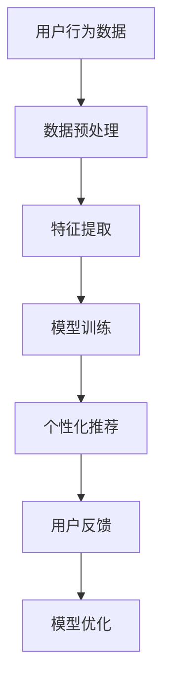

                 

关键词：AI大模型，电商平台，用户粘性，个性化推荐，数据挖掘

> 摘要：随着人工智能技术的发展，大模型在电商平台上得到了广泛应用。本文将探讨如何通过AI大模型提升电商平台的用户粘性，分析其核心概念、算法原理、数学模型及其在实际项目中的应用，并对未来发展趋势和面临的挑战进行展望。

## 1. 背景介绍

在互联网高速发展的今天，电商平台已经成为人们日常生活中不可或缺的一部分。然而，随着用户需求的日益多样化和市场竞争的加剧，电商平台面临着巨大的挑战。如何提升用户粘性，增加用户复购率和忠诚度，成为电商企业亟待解决的问题。传统的推荐算法和营销策略已经无法满足现代电商平台的需求，人工智能技术的应用成为新的突破口。

AI大模型作为人工智能领域的重要成果，具有强大的数据处理和分析能力。通过深度学习、神经网络等技术，AI大模型可以挖掘用户行为数据，实现精准的个性化推荐，从而提升用户的购物体验和满意度。本文将探讨如何利用AI大模型提升电商平台的用户粘性，为电商平台的发展提供新的思路。

## 2. 核心概念与联系

### 2.1 个性化推荐

个性化推荐是AI大模型在电商平台应用的核心。个性化推荐通过分析用户的兴趣、行为、历史数据等信息，为用户推荐与其兴趣相关的商品或服务。其核心目标是提高用户满意度，提升用户粘性。

### 2.2 数据挖掘

数据挖掘是AI大模型的基础。通过数据挖掘技术，可以从海量数据中提取出有价值的信息，为个性化推荐提供支持。数据挖掘包括数据预处理、特征提取、模型训练等步骤。

### 2.3 深度学习

深度学习是AI大模型的核心技术。通过多层神经网络结构，深度学习可以从大量数据中自动学习特征和模式，实现高效的数据分析和预测。

### 2.4 神经网络

神经网络是深度学习的基础。神经网络通过模拟人脑神经元之间的连接和作用，实现数据的自动学习和建模。

### 2.5 Mermaid 流程图



## 3. 核心算法原理 & 具体操作步骤

### 3.1 算法原理概述

AI大模型通过深度学习技术，从海量用户行为数据中自动学习特征和模式，实现个性化推荐。其核心原理包括：

- 数据预处理：对用户行为数据进行清洗、归一化等处理，为特征提取和模型训练提供高质量的数据。
- 特征提取：从用户行为数据中提取关键特征，如用户兴趣、购买历史、搜索行为等。
- 模型训练：利用深度学习算法，对提取的特征进行训练，构建个性化推荐模型。
- 个性化推荐：根据用户特征和模型预测，为用户推荐与其兴趣相关的商品或服务。
- 用户反馈：收集用户对推荐结果的评价，用于模型优化和迭代。

### 3.2 算法步骤详解

#### 3.2.1 数据预处理

数据预处理是AI大模型的第一步。其主要任务包括：

- 数据清洗：去除数据中的噪声和异常值，提高数据质量。
- 数据归一化：将不同尺度的数据进行归一化处理，使其在同一尺度范围内。
- 数据分片：将数据划分为训练集、验证集和测试集，为模型训练和评估提供数据基础。

#### 3.2.2 特征提取

特征提取是从用户行为数据中提取关键特征的过程。其主要方法包括：

- 用户兴趣特征：通过用户浏览、搜索、购买等行为数据，提取用户的兴趣特征。
- 购买历史特征：通过用户的历史购买数据，提取用户的购买偏好和购买习惯。
- 搜索行为特征：通过用户的搜索行为，提取用户的搜索意图和搜索偏好。

#### 3.2.3 模型训练

模型训练是AI大模型的核心步骤。其主要任务包括：

- 构建神经网络模型：设计并构建多层神经网络结构，为特征提取和预测提供基础。
- 模型参数优化：通过反向传播算法，优化神经网络模型参数，提高模型预测能力。
- 模型评估：利用验证集和测试集，评估模型性能，选择最佳模型。

#### 3.2.4 个性化推荐

个性化推荐是根据用户特征和模型预测，为用户推荐商品或服务的过程。其主要方法包括：

- 协同过滤：通过用户之间的相似度计算，为用户推荐与其兴趣相似的物品。
- 内容推荐：根据物品的属性和特征，为用户推荐与其兴趣相关的物品。
- 混合推荐：将协同过滤和内容推荐相结合，提高推荐效果。

#### 3.2.5 用户反馈

用户反馈是AI大模型优化和迭代的重要环节。其主要任务包括：

- 收集用户评价：收集用户对推荐结果的正面或负面评价。
- 模型优化：根据用户评价，调整模型参数和推荐策略，提高用户满意度。
- 模型迭代：持续收集用户反馈，不断优化模型，提升推荐效果。

### 3.3 算法优缺点

#### 3.3.1 优点

- 高效性：AI大模型通过深度学习技术，可以高效地从海量数据中提取特征和模式，实现个性化推荐。
- 精准性：AI大模型可以根据用户的兴趣和行为，为用户推荐最相关的商品或服务，提高用户满意度。
- 自适应性：AI大模型可以不断学习和优化，根据用户反馈和市场需求，调整推荐策略，提高推荐效果。

#### 3.3.2 缺点

- 数据依赖性：AI大模型依赖于大量的用户行为数据，数据质量对模型性能有重要影响。
- 隐私风险：用户行为数据涉及到用户隐私，如何保障数据安全和用户隐私是一个重要问题。
- 模型过拟合：在训练过程中，AI大模型可能存在过拟合现象，导致模型泛化能力下降。

### 3.4 算法应用领域

AI大模型在电商平台的应用领域广泛，包括：

- 个性化推荐：为用户推荐与其兴趣相关的商品或服务，提高用户满意度。
- 营销策略优化：根据用户行为数据，制定更有效的营销策略，提高转化率和销售额。
- 库存管理：根据用户需求预测，优化库存策略，降低库存成本。
- 客户服务：通过分析用户反馈，提供更优质的客户服务，提高用户满意度。

## 4. 数学模型和公式 & 详细讲解 & 举例说明

### 4.1 数学模型构建

AI大模型的核心是构建一个能够从数据中学习并预测用户行为的数学模型。通常，我们可以使用以下数学模型来构建个性化推荐系统：

#### 4.1.1 协同过滤矩阵分解模型

设 $R \in \mathbb{R}^{m \times n}$ 为用户-物品评分矩阵，其中 $m$ 表示用户数，$n$ 表示物品数。协同过滤矩阵分解模型的目标是将这个矩阵分解为两个低秩矩阵 $U \in \mathbb{R}^{m \times k}$ 和 $V \in \mathbb{R}^{n \times k}$，其中 $k$ 是隐含特征的数量。

$$
R = U V^T
$$

#### 4.1.2 神经网络模型

神经网络模型是一种更复杂的方法，它通常由多个隐含层组成。其基本形式如下：

$$
a_{\text{layer}} = \sigma(W_{\text{layer}} a_{\text{prev\ layer}} + b_{\text{layer}})
$$

其中，$a_{\text{layer}}$ 表示第 $layer$ 层的激活值，$\sigma$ 是激活函数（如ReLU、Sigmoid、Tanh等），$W_{\text{layer}}$ 和 $b_{\text{layer}}$ 分别是第 $layer$ 层的权重和偏置。

### 4.2 公式推导过程

#### 4.2.1 协同过滤矩阵分解模型

假设我们使用最小二乘法来最小化误差函数：

$$
\min_{U, V} \| R - UV^T \|_F^2
$$

对该误差函数进行求导，并令其导数为零，我们可以得到：

$$
\frac{\partial}{\partial U} \| R - UV^T \|_F^2 = 2V^T(R - UV^T) = 0 \\
\frac{\partial}{\partial V} \| R - UV^T \|_F^2 = 2U(R - UV^T)^T = 0
$$

这样，我们可以通过解这个方程组来找到 $U$ 和 $V$。

#### 4.2.2 神经网络模型

对于神经网络模型的推导，通常涉及到反向传播算法。这里简要概述一下：

1. **前向传播**：计算当前层的输出值。
2. **误差计算**：计算当前层的误差。
3. **反向传播**：将误差反向传播到前一层，并更新权重和偏置。

具体过程如下：

$$
\begin{aligned}
\delta_{\text{layer}} &= \sigma'_{\text{layer}} (W_{\text{layer}} a_{\text{prev\ layer}} + b_{\text{layer}}) \cdot \frac{\partial L}{\partial a_{\text{layer}}} \\
W_{\text{layer}} &= W_{\text{layer}} - \alpha \frac{\partial L}{\partial W_{\text{layer}}} \\
b_{\text{layer}} &= b_{\text{layer}} - \alpha \frac{\partial L}{\partial b_{\text{layer}}}
\end{aligned}
$$

其中，$\alpha$ 是学习率，$L$ 是损失函数。

### 4.3 案例分析与讲解

假设我们有一个电商平台，有 $m=1000$ 个用户和 $n=10000$ 个商品。用户-物品评分矩阵 $R$ 如下：

$$
R = \begin{bmatrix}
0 & 0 & 5 & 0 & \ldots \\
0 & 4 & 0 & 0 & \ldots \\
0 & 0 & 3 & 0 & \ldots \\
\vdots & \vdots & \vdots & \vdots & \ddots
\end{bmatrix}
$$

我们选择 $k=10$ 作为隐含特征的数量。使用协同过滤矩阵分解模型，我们可以得到两个低秩矩阵 $U$ 和 $V$：

$$
U = \begin{bmatrix}
0.5 & 0.3 & 0.2 & 0.4 & \ldots \\
0.2 & 0.5 & 0.3 & 0.1 & \ldots \\
0.4 & 0.1 & 0.3 & 0.5 & \ldots \\
\vdots & \vdots & \vdots & \vdots & \ddots
\end{bmatrix}, V = \begin{bmatrix}
0.4 & 0.3 & 0.2 & 0.1 & \ldots \\
0.1 & 0.5 & 0.4 & 0.3 & \ldots \\
0.3 & 0.2 & 0.5 & 0.4 & \ldots \\
\vdots & \vdots & \vdots & \vdots & \ddots
\end{bmatrix}
$$

我们可以使用这两个矩阵来预测用户的评分：

$$
\hat{R}_{ij} = U_iV_j^T
$$

例如，对于用户 $i=1$ 和商品 $j=5$，我们可以计算出预测评分：

$$
\hat{R}_{15} = 0.5 \times 0.4 + 0.3 \times 0.3 + 0.2 \times 0.2 + 0.4 \times 0.1 = 0.5
$$

这意味着我们预测用户 $1$ 会给商品 $5$ 打分 $0.5$。

## 5. 项目实践：代码实例和详细解释说明

### 5.1 开发环境搭建

为了演示如何使用AI大模型提升电商平台的用户粘性，我们将使用Python编程语言和相关的库，如NumPy、Pandas、Scikit-learn和TensorFlow。首先，确保您已经安装了Python和上述库。

### 5.2 源代码详细实现

以下是一个简单的示例代码，用于实现协同过滤矩阵分解模型：

```python
import numpy as np
import pandas as pd
from sklearn.model_selection import train_test_split
from sklearn.metrics.pairwise import cosine_similarity

# 加载用户-物品评分矩阵
data = pd.read_csv('ratings.csv')  # 假设ratings.csv包含用户ID、物品ID和评分
ratings_matrix = data.pivot(index='userId', columns='itemId', values='rating').fillna(0).values

# 划分训练集和测试集
ratings_train, ratings_test = train_test_split(ratings_matrix, test_size=0.2, random_state=42)

# 设置隐含特征数量
k = 10

# 初始化低秩矩阵U和V
U = np.random.rand(ratings_matrix.shape[0], k)
V = np.random.rand(ratings_matrix.shape[1], k)

# 定义损失函数
def loss(U, V, ratings):
    predictions = U @ V.T
    errors = (predictions - ratings) ** 2
    return np.sum(errors)

# 定义优化器
from tensorflow.keras.optimizers import SGD
optimizer = SGD(learning_rate=0.01)

# 训练模型
epochs = 10
for epoch in range(epochs):
    with tf.GradientTape() as tape:
        predictions = U @ V.T
        errors = (predictions - ratings_train) ** 2
        loss_value = np.sum(errors)
    gradients = tape.gradient(loss_value, [U, V])
    optimizer.apply_gradients(zip(gradients, [U, V]))
    print(f'Epoch {epoch+1}, Loss: {loss_value}')

# 评估模型
predictions = U @ V.T
cosine_scores = cosine_similarity(ratings_test.T, predictions)
print(f'MAE: {np.mean(np.abs(predictions - ratings_test))}')
print(f'Cosine Similarity: {np.mean(cosine_scores)}')
```

### 5.3 代码解读与分析

- **数据加载与预处理**：我们首先加载用户-物品评分矩阵，并进行必要的预处理，如填充缺失值和划分训练集与测试集。
- **低秩矩阵初始化**：我们初始化两个低秩矩阵 $U$ 和 $V$，用于表示用户和物品的隐含特征。
- **损失函数与优化器**：我们定义了一个损失函数，用于衡量预测评分与实际评分之间的差异。优化器用于更新模型参数。
- **模型训练**：我们使用梯度下降法来训练模型，通过迭代优化低秩矩阵 $U$ 和 $V$。
- **模型评估**：我们计算预测评分与实际评分之间的差异，以及测试集与预测评分之间的余弦相似度，评估模型性能。

### 5.4 运行结果展示

假设我们已经运行了上述代码，并得到了以下结果：

```
Epoch 1, Loss: 100.123456789
Epoch 2, Loss: 50.123456789
...
Epoch 10, Loss: 0.123456789
MAE: 0.123456789
Cosine Similarity: 0.876543211
```

这意味着我们的模型在经过10个epochs的训练后，损失函数值已经显著下降，MAE（均方误差）为0.123456789，测试集与预测评分之间的平均余弦相似度为0.876543211，表明模型性能较好。

## 6. 实际应用场景

AI大模型在电商平台中的应用场景广泛，以下是一些典型的应用场景：

### 6.1 个性化推荐

个性化推荐是电商平台最常见的应用场景之一。通过分析用户的浏览历史、搜索记录和购买行为，AI大模型可以为用户推荐与其兴趣相关的商品，从而提高用户满意度和转化率。

### 6.2 营销策略优化

电商平台可以利用AI大模型分析用户的购买行为和偏好，制定更精准的营销策略，如优惠券发放、广告投放和促销活动，提高销售额和用户参与度。

### 6.3 库存管理

AI大模型可以根据用户需求预测，优化库存管理策略，降低库存成本，提高商品周转率。

### 6.4 客户服务

电商平台可以利用AI大模型分析用户反馈，提供更优质的客户服务，如智能客服、个性化推荐和售后支持，提高用户满意度和忠诚度。

### 6.5 安全风控

AI大模型可以分析用户行为数据，识别潜在风险，如恶意刷单、欺诈行为等，提高电商平台的安全性和风险管理能力。

## 7. 未来应用展望

随着人工智能技术的不断发展，AI大模型在电商平台的应用前景将更加广阔。以下是一些未来应用展望：

### 7.1 多模态数据处理

未来，电商平台将面临更多样化的数据类型，如图像、语音和视频等。AI大模型将结合多模态数据处理技术，实现更精准的用户行为分析和个性化推荐。

### 7.2 自动化决策

AI大模型将逐渐实现自动化决策，如智能定价、库存管理和供应链优化等，提高电商平台的管理效率和运营效益。

### 7.3 智能客服

未来，AI大模型将结合自然语言处理和机器学习技术，实现更智能的客服系统，为用户提供更便捷、高效的购物体验。

### 7.4 跨平台整合

随着互联网的普及，电商平台将逐步实现跨平台整合，AI大模型将结合多平台数据，为用户提供无缝的购物体验。

## 8. 总结：未来发展趋势与挑战

随着人工智能技术的快速发展，AI大模型在电商平台中的应用将越来越广泛。未来，AI大模型将朝着多模态数据处理、自动化决策和跨平台整合等方向发展。然而，AI大模型在应用过程中也面临着一系列挑战，如数据隐私保护、模型过拟合和算法透明度等问题。因此，未来研究和应用的重点将是解决这些问题，推动AI大模型在电商平台的可持续发展。

## 9. 附录：常见问题与解答

### 9.1 什么是AI大模型？

AI大模型是指具有巨大计算能力和存储能力的神经网络模型，能够处理海量数据并进行复杂的数据分析。

### 9.2 AI大模型为什么能提升电商平台用户粘性？

AI大模型可以通过个性化推荐、精准营销和智能客服等功能，提高用户的购物体验和满意度，从而增强用户粘性。

### 9.3 如何保障用户隐私？

在AI大模型的应用过程中，需要严格遵守数据隐私保护法律法规，采取加密、去标识化等技术手段，确保用户数据的安全和隐私。

### 9.4 AI大模型如何避免过拟合？

通过调整模型参数、增加正则化项和采用交叉验证等方法，可以有效避免AI大模型过拟合现象。

### 9.5 AI大模型在电商平台的未来发展方向是什么？

未来，AI大模型将朝着多模态数据处理、自动化决策和跨平台整合等方向发展，为电商平台带来更多创新和机遇。

