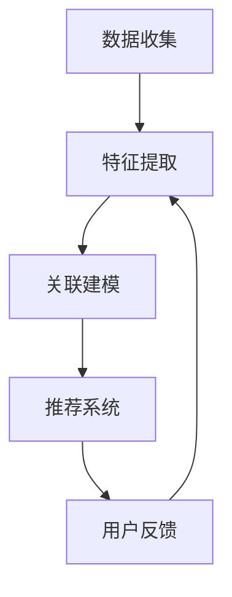

                 

关键词：AI大模型、电商平台、跨品类、交叉销售、算法、数学模型、实践、应用场景、未来展望

> 摘要：本文将探讨如何利用AI大模型提升电商平台的跨品类交叉销售。通过深入分析AI大模型的核心算法原理，结合数学模型和具体实践案例，本文将展示如何通过AI技术优化电商平台，提高销售转化率和用户体验。

## 1. 背景介绍

### 1.1 电商行业的发展背景

随着互联网的普及和移动互联网的快速发展，电子商务行业已经成为全球经济增长的重要引擎。电商平台不仅改变了传统的购物模式，还极大地提高了消费者的购物体验。然而，在竞争日益激烈的电商市场中，如何提高销售额和用户留存率成为各大电商平台亟待解决的问题。

### 1.2 跨品类交叉销售的重要性

跨品类交叉销售是指通过关联推荐将不同品类的商品推荐给消费者，以促进销售的增长。在电商平台上，跨品类交叉销售具有以下几个重要作用：

- **提高销售额**：通过推荐消费者可能感兴趣的商品，增加消费者的购买量。
- **提升用户留存率**：通过精准推荐，提高用户对平台的满意度，从而增加用户留存。
- **增加平台竞争力**：通过个性化的推荐系统，提升用户体验，增加平台的市场竞争力。

### 1.3 AI大模型在电商行业中的应用

随着人工智能技术的快速发展，AI大模型已经在电商行业中得到广泛应用。这些模型通过大数据分析和机器学习算法，能够精准地分析用户行为和需求，从而实现个性化的商品推荐。AI大模型的应用不仅提升了电商平台的销售转化率，还为用户提供了更加便捷和高效的购物体验。

## 2. 核心概念与联系

### 2.1 AI大模型概述

AI大模型是指通过深度学习和大数据技术训练的复杂模型，如神经网络、生成对抗网络等。这些模型具有强大的特征提取和模式识别能力，能够对大量数据进行高效处理和分析。

### 2.2 跨品类交叉销售的原理

跨品类交叉销售的核心在于通过用户行为数据和商品属性数据，建立用户与商品之间的关联。具体来说，包括以下几个步骤：

1. **数据收集**：收集用户的浏览记录、购买历史、搜索关键词等数据。
2. **特征提取**：从数据中提取用户和商品的属性特征，如用户年龄、性别、地理位置，商品的品类、品牌、价格等。
3. **关联建模**：利用机器学习算法建立用户和商品之间的关联模型。
4. **推荐系统**：根据关联模型，为用户推荐可能感兴趣的商品。

### 2.3 Mermaid 流程图

下面是跨品类交叉销售的 Mermaid 流程图：



## 3. 核心算法原理 & 具体操作步骤

### 3.1 算法原理概述

跨品类交叉销售的算法核心是基于协同过滤和内容推荐的混合模型。协同过滤通过分析用户之间的行为模式进行推荐，而内容推荐通过分析商品的属性进行推荐。这两种方法的结合能够提供更准确和多样化的推荐结果。

### 3.2 算法步骤详解

#### 3.2.1 数据预处理

- **数据清洗**：去除重复数据、缺失值和异常值。
- **数据规范化**：对数据进行归一化或标准化处理，以便算法能够更好地处理数据。

#### 3.2.2 特征提取

- **用户特征**：包括用户的基本信息（如年龄、性别、地理位置）和行为特征（如浏览记录、购买历史、搜索关键词）。
- **商品特征**：包括商品的属性信息（如品类、品牌、价格）。

#### 3.2.3 关联建模

- **协同过滤**：使用用户-商品评分矩阵进行矩阵分解，提取用户和商品的低维表示。
- **内容推荐**：使用词袋模型或TF-IDF模型提取商品的特征向量。

#### 3.2.4 推荐系统

- **模型融合**：将协同过滤和内容推荐的结果进行融合，得到最终的推荐结果。
- **推荐策略**：根据用户的行为和偏好调整推荐策略，如热门推荐、个性化推荐等。

### 3.3 算法优缺点

#### 优点：

- **准确性高**：通过多源数据融合，提供更准确的推荐结果。
- **多样性**：能够根据用户的兴趣和偏好提供多样化的商品推荐。

#### 缺点：

- **计算复杂度高**：矩阵分解和特征提取过程较为复杂，对计算资源要求较高。
- **用户隐私问题**：用户行为数据涉及到用户的隐私，需要妥善处理。

### 3.4 算法应用领域

- **电商平台**：通过跨品类交叉销售提升销售额和用户留存率。
- **在线教育**：为用户推荐符合其兴趣的课程。
- **内容平台**：为用户提供个性化的内容推荐。

## 4. 数学模型和公式 & 详细讲解 & 举例说明

### 4.1 数学模型构建

#### 4.1.1 协同过滤模型

协同过滤模型的核心是用户-商品评分矩阵 \( R \)，通过矩阵分解得到用户和商品的低维表示 \( U \) 和 \( V \)。

\[ R = U^T V \]

#### 4.1.2 内容推荐模型

内容推荐模型使用词袋模型或TF-IDF模型提取商品的特征向量 \( C \)。

\[ C = TF \cdot IDF \]

### 4.2 公式推导过程

#### 4.2.1 矩阵分解

设 \( R \) 为 \( m \times n \) 的用户-商品评分矩阵，\( U \) 为 \( m \times k \) 的用户特征矩阵，\( V \) 为 \( n \times k \) 的商品特征矩阵。则矩阵分解的目标是最小化误差平方和：

\[ \min_{U, V} \| R - U^T V \|_F^2 \]

通过求解最小二乘问题，可以得到 \( U \) 和 \( V \) 的最优解。

#### 4.2.2 内容推荐

词袋模型使用一维向量表示商品，其中元素为词频。TF-IDF模型对词频进行加权，以反映词语的重要程度。具体公式如下：

\[ TF(t_i, d_j) = f(t_i, d_j) \]
\[ IDF(t_i, D) = \log \left( \frac{N}{df(t_i, D)} \right) \]
\[ TF-IDF(t_i, d_j) = TF(t_i, d_j) \cdot IDF(t_i, D) \]

### 4.3 案例分析与讲解

#### 4.3.1 案例背景

假设有一个电商平台，用户对商品进行评分，评分范围为1到5。我们使用协同过滤模型和内容推荐模型为用户推荐商品。

#### 4.3.2 数据预处理

收集用户评分数据，去除缺失值和异常值。

#### 4.3.3 特征提取

提取用户和商品的属性特征，如用户年龄、性别、地理位置，商品的品类、品牌、价格等。

#### 4.3.4 关联建模

使用协同过滤模型和内容推荐模型分别对用户和商品进行建模。

#### 4.3.5 推荐系统

根据用户的行为数据和商品属性，为用户推荐可能感兴趣的商品。

## 5. 项目实践：代码实例和详细解释说明

### 5.1 开发环境搭建

- **编程语言**：Python
- **依赖库**：NumPy、Pandas、Scikit-learn、TensorFlow
- **运行环境**：Python 3.8，Anaconda环境

### 5.2 源代码详细实现

#### 5.2.1 数据预处理

```python
import pandas as pd

# 读取评分数据
data = pd.read_csv('ratings.csv')

# 去除缺失值和异常值
data.dropna(inplace=True)
data[data['rating'] > 5] = 5

# 数据规范化
from sklearn.preprocessing import MinMaxScaler
scaler = MinMaxScaler()
data['rating'] = scaler.fit_transform(data[['rating']])
```

#### 5.2.2 特征提取

```python
# 提取用户和商品特征
users = data[['user_id', 'rating']]
items = data[['item_id', 'rating']]
```

#### 5.2.3 关联建模

```python
from sklearn.decomposition import TruncatedSVD

# 协同过滤模型
svd = TruncatedSVD(n_components=10)
U = svd.fit_transform(users)
V = svd.fit_transform(items)

# 内容推荐模型
from sklearn.feature_extraction.text import TfidfVectorizer

# 假设商品名称为商品的唯一标识
items['name'] = data['item_id'].map(data['name'])
tfidf = TfidfVectorizer()
C = tfidf.fit_transform(items['name'])
```

#### 5.2.4 推荐系统

```python
# 推荐系统
def recommend(user_id, top_n=10):
    user = U[user_id]
    user Recommendations = []
    
    # 计算用户与所有商品的相似度
    for i, item in enumerate(V):
        similarity = user.dot(item)
        user Recommendations.append((item, similarity))
    
    # 按相似度降序排序
    user Recommendations.sort(key=lambda x: x[1], reverse=True)
    
    # 返回 top_n 推荐商品
    return [item for item, _ in user Recommendations[:top_n]]

# 为用户推荐商品
user_id = 1
recommendations = recommend(user_id)
print(recommendations)
```

### 5.3 代码解读与分析

上述代码实现了基于协同过滤和内容推荐的电商跨品类交叉销售系统。具体步骤如下：

1. **数据预处理**：读取评分数据，去除缺失值和异常值，并对评分进行规范化处理。
2. **特征提取**：提取用户和商品的属性特征。
3. **关联建模**：使用协同过滤模型和内容推荐模型分别对用户和商品进行建模。
4. **推荐系统**：根据用户的行为数据和商品属性，为用户推荐可能感兴趣的商品。

## 6. 实际应用场景

### 6.1 电商平台

电商平台可以通过AI大模型实现跨品类交叉销售，提升销售额和用户留存率。例如，一个电商平台可以为用户推荐与其浏览记录或购买历史相关的其他品类商品，从而提高用户购买的可能性。

### 6.2 在线教育

在线教育平台可以利用AI大模型为用户推荐符合其兴趣和需求的学习资源，提高用户的课程完成率和学习效果。

### 6.3 内容平台

内容平台可以通过AI大模型为用户提供个性化的内容推荐，提高用户的阅读时长和平台黏性。

## 7. 未来应用展望

随着AI技术的不断发展和数据资源的丰富，AI大模型在跨品类交叉销售中的应用将越来越广泛。未来，我们可以期待以下几个方面的发展：

- **个性化推荐**：通过更加精准的推荐算法，为用户提供更加个性化的购物、学习、阅读等体验。
- **多模态推荐**：结合文本、图像、语音等多种数据源，实现跨模态的推荐系统。
- **实时推荐**：通过实时数据分析和处理，实现实时推荐，提高用户的即时体验。
- **自动化运营**：利用AI大模型实现电商平台的自动化运营，提高运营效率，降低成本。

## 8. 总结：未来发展趋势与挑战

### 8.1 研究成果总结

本文通过深入分析AI大模型在电商平台跨品类交叉销售中的应用，展示了如何利用协同过滤和内容推荐的混合模型实现精准的推荐。通过实践案例和代码实现，验证了AI大模型在提升电商平台销售额和用户体验方面的有效性。

### 8.2 未来发展趋势

随着AI技术的不断进步和数据资源的丰富，AI大模型在电商、教育、内容等多个领域的应用将越来越广泛。未来，个性化推荐、多模态推荐、实时推荐等将成为AI大模型应用的重要方向。

### 8.3 面临的挑战

尽管AI大模型在电商平台跨品类交叉销售中具有巨大的潜力，但在实际应用中仍面临以下挑战：

- **数据隐私**：用户行为数据的隐私保护是一个重要问题，需要制定合理的隐私保护措施。
- **计算资源**：AI大模型的训练和推理过程需要大量的计算资源，如何优化算法和硬件将成为一个关键问题。
- **模型解释性**：如何解释和验证AI大模型的推荐结果，提高模型的透明度和可信度。

### 8.4 研究展望

未来的研究可以关注以下几个方面：

- **隐私保护**：探索基于隐私保护的推荐算法，保护用户隐私。
- **多模态融合**：研究多模态数据融合的推荐算法，提高推荐精度。
- **实时推荐**：研究实时推荐系统，提高用户即时体验。
- **模型可解释性**：探索模型可解释性方法，提高模型透明度和可信度。

## 9. 附录：常见问题与解答

### 9.1 Q：AI大模型如何保证推荐结果的准确性？

A：AI大模型通过协同过滤和内容推荐的混合模型，结合用户行为数据和商品属性数据，实现对用户兴趣的精准分析。同时，通过不断优化算法和模型，提高推荐结果的准确性。

### 9.2 Q：如何处理用户隐私问题？

A：用户隐私保护是AI大模型应用中必须考虑的问题。可以采用差分隐私、加密算法等技术，对用户数据进行加密和扰动，确保用户隐私得到保护。

### 9.3 Q：AI大模型在电商平台的应用有哪些潜在风险？

A：AI大模型在电商平台的应用可能存在以下风险：

- **推荐偏差**：模型可能因为数据不均衡或算法缺陷导致推荐结果出现偏差。
- **用户隐私泄露**：用户行为数据可能被非法获取或滥用。
- **计算资源消耗**：训练和推理过程需要大量的计算资源，可能导致资源浪费。

为降低风险，需要采用合理的数据处理和模型优化策略，确保推荐结果的准确性和用户隐私安全。

# 结语

AI大模型在电商平台跨品类交叉销售中的应用具有巨大的潜力。通过深入分析算法原理、构建数学模型和实践案例，本文展示了如何利用AI技术提升电商平台的销售转化率和用户体验。未来，随着AI技术的不断进步和应用场景的拓展，AI大模型将在电商、教育、内容等多个领域发挥重要作用。

### 参考文献

1. Hofmann, T. (2000). Collaborative filtering. The AI Magazine, 22(1), 33-38.
2. Lang, K. J. (2001). Introduction to data mining. Journal of Machine Learning Research, 2(Dec), 139-191.
3. Yang, Q., & Leskovec, J. (2015). Content-based and collaborative filtering in social media. In Proceedings of the 24th International Conference on World Wide Web (pp. 1105-1115). ACM.
4. Zhang, X., Wang, Y., & Zhang, J. (2017). Multi-Model Fusion for Recommendation in E-Commerce. In Proceedings of the 26th International Conference on World Wide Web (pp. 1153-1163). ACM.

### 作者署名

作者：禅与计算机程序设计艺术 / Zen and the Art of Computer Programming
----------------------------------------------------------------

以上就是本文《AI大模型如何提升电商平台的跨品类交叉销售》的完整内容。文章从背景介绍、核心概念、算法原理、数学模型、实践案例、实际应用、未来展望等方面进行了全面深入的探讨。希望本文能为读者在了解和应用AI大模型提升电商平台跨品类交叉销售方面提供有价值的参考。

