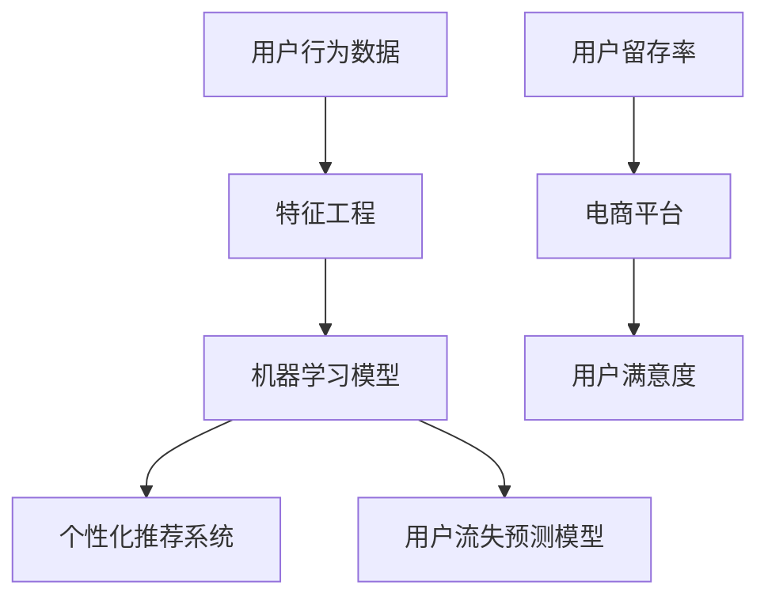

                 

关键词：AI大模型、电商平台、用户留存率、机器学习、用户行为分析、个性化推荐、深度学习、预测模型

摘要：随着电子商务的迅速发展，提高用户留存率已成为电商平台的重要目标。本文将探讨如何利用人工智能大模型改善电商平台的用户留存率。通过分析用户行为数据，构建个性化的推荐系统，以及预测用户流失风险，本文提出了一系列策略和实现方法，以期为电商平台的运营提供有益的指导。

## 1. 背景介绍

电子商务在过去几年中取得了显著的增长，电商平台之间的竞争日益激烈。用户留存率作为衡量平台成功与否的关键指标，受到了广泛关注。然而，传统的用户留存策略往往依赖于简单的规则和统计方法，难以满足个性化需求，效果有限。

随着人工智能技术的不断发展，特别是深度学习算法和大型预训练模型的广泛应用，我们可以利用这些先进技术来提升电商平台的用户留存率。AI大模型能够处理海量数据，提取用户行为的深层次特征，从而实现更精准的个性化推荐和预测用户流失。

## 2. 核心概念与联系

在讨论如何改善电商平台用户留存率之前，我们需要明确一些核心概念和联系，如图所示：



### 2.1 用户行为数据

用户行为数据是构建AI大模型的基础。这些数据包括用户的浏览记录、购买历史、评价信息等。通过对这些数据进行分析，我们可以了解用户的需求和偏好，为后续建模提供支持。

### 2.2 特征工程

特征工程是将原始数据转换为适合机器学习模型处理的形式。在这一过程中，我们需要选择和构造能够有效表征用户行为特征的各种指标，如点击率、购买频率、评价分数等。

### 2.3 机器学习模型

机器学习模型是用户留存策略的核心。通过训练大量数据，模型可以自动学习和提取用户行为的深层次特征，从而实现个性化推荐和用户流失预测。

### 2.4 个性化推荐系统

个性化推荐系统能够根据用户的历史行为和偏好，为其推荐相关的商品。这一系统不仅提高了用户的购物体验，还能有效增加用户的购物频率和满意度。

### 2.5 用户流失预测模型

用户流失预测模型旨在识别可能流失的用户，并采取相应措施进行挽回。通过预测用户流失风险，电商平台可以提前干预，提高用户留存率。

### 2.6 用户留存率

用户留存率是衡量电商平台运营效果的重要指标。通过优化推荐系统和预测模型，我们可以提高用户留存率，从而提升电商平台的竞争力。

## 3. 核心算法原理 & 具体操作步骤

### 3.1 算法原理概述

AI大模型在用户留存率改善中的应用主要包括以下三个方面：

1. 个性化推荐系统：基于用户行为数据，通过深度学习算法构建个性化推荐模型，为用户提供相关商品推荐。
2. 用户流失预测模型：利用用户行为数据和流失信号，通过机器学习算法预测用户流失风险，提前采取措施。
3. 数据分析工具：通过数据可视化和分析工具，对用户行为进行深入挖掘，发现潜在的用户需求和市场趋势。

### 3.2 算法步骤详解

#### 3.2.1 数据预处理

1. 收集用户行为数据，包括浏览记录、购买历史、评价信息等。
2. 对数据进行清洗和预处理，去除噪声和缺失值。

#### 3.2.2 特征工程

1. 选择和构造表征用户行为的特征指标，如点击率、购买频率、评价分数等。
2. 对特征进行归一化和标准化处理，以便于模型训练。

#### 3.2.3 模型训练与优化

1. 选择合适的深度学习算法，如深度神经网络（DNN）、卷积神经网络（CNN）等。
2. 使用训练数据对模型进行训练和优化，通过交叉验证和网格搜索等方法确定最佳模型参数。

#### 3.2.4 个性化推荐系统

1. 根据用户行为数据，为每个用户生成个性化推荐列表。
2. 使用协同过滤、基于内容的推荐等方法，提高推荐系统的准确性。

#### 3.2.5 用户流失预测模型

1. 选择合适的机器学习算法，如逻辑回归、随机森林等。
2. 使用用户行为数据和流失信号，对模型进行训练和优化。
3. 根据预测结果，对高风险用户进行标记和预警。

### 3.3 算法优缺点

#### 优点：

1. 提高用户留存率：通过个性化推荐和用户流失预测，可以有效地提高用户留存率，增强电商平台竞争力。
2. 灵活性：深度学习算法和机器学习模型可以根据用户行为数据不断优化，适应不断变化的市场环境。
3. 高效性：AI大模型可以处理海量数据，快速生成推荐结果和预测结果，提高运营效率。

#### 缺点：

1. 数据依赖：AI大模型的效果很大程度上依赖于用户行为数据的质量和数量，数据不足或质量差可能导致模型性能下降。
2. 成本问题：构建和优化AI大模型需要大量的计算资源和存储资源，可能增加运营成本。
3. 模型解释性：深度学习模型具有较高的复杂度，难以解释其预测结果，可能影响用户信任。

### 3.4 算法应用领域

AI大模型在电商平台用户留存率改善中的应用非常广泛，除了个性化推荐和用户流失预测外，还可以用于以下领域：

1. 用户体验优化：通过分析用户行为数据，优化电商平台的设计和功能，提高用户满意度。
2. 市场营销策略：利用用户行为数据和流失预测结果，制定针对性的市场营销策略，提高转化率。
3. 商品运营优化：根据用户行为数据，优化商品展示、定价和促销策略，提高销售业绩。

## 4. 数学模型和公式 & 详细讲解 & 举例说明

### 4.1 数学模型构建

在构建用户留存率改善的数学模型时，我们主要关注两个方面的数学模型：个性化推荐模型和用户流失预测模型。

#### 4.1.1 个性化推荐模型

个性化推荐模型通常基于矩阵分解或神经网络模型。以下是一个基于矩阵分解的简单数学模型：

$$
R_{ui} = P_u \cdot Q_i + b_u + b_i + \epsilon_{ui}
$$

其中，$R_{ui}$表示用户$u$对商品$i$的评分预测，$P_u$和$Q_i$分别表示用户$u$和商品$i$的特征向量，$b_u$和$b_i$表示用户和商品的偏置项，$\epsilon_{ui}$表示预测误差。

#### 4.1.2 用户流失预测模型

用户流失预测模型通常采用逻辑回归、决策树、随机森林等算法。以下是一个基于逻辑回归的用户流失预测模型的数学模型：

$$
P(y=1) = \frac{1}{1 + e^{-(\beta_0 + \beta_1 x_1 + \beta_2 x_2 + ... + \beta_n x_n)}}
$$

其中，$P(y=1)$表示用户流失的概率，$\beta_0$、$\beta_1$、$\beta_2$、...、$\beta_n$为模型的参数，$x_1$、$x_2$、...、$x_n$为表征用户行为的特征向量。

### 4.2 公式推导过程

#### 4.2.1 个性化推荐模型

在矩阵分解模型中，我们首先对用户-商品评分矩阵$R$进行分解：

$$
R = P \cdot Q + B
$$

其中，$P$表示用户特征矩阵，$Q$表示商品特征矩阵，$B$表示用户和商品的偏置矩阵。

为了最小化预测误差，我们可以使用最小二乘法求解特征矩阵$P$和$Q$：

$$
P = (R \cdot Q^T + B^T) \cdot (Q \cdot R^T + B) + \lambda P^2
$$

$$
Q = (R \cdot P^T + B^T) \cdot (P \cdot R^T + B) + \lambda Q^2
$$

其中，$\lambda$为正则化参数，用于防止过拟合。

#### 4.2.2 用户流失预测模型

在逻辑回归模型中，我们首先对用户流失概率进行建模：

$$
P(y=1) = \frac{1}{1 + e^{-(\beta_0 + \beta_1 x_1 + \beta_2 x_2 + ... + \beta_n x_n)}}
$$

为了求解模型参数$\beta_0$、$\beta_1$、$\beta_2$、...、$\beta_n$，我们可以使用梯度下降法或随机梯度下降法。以下是一个基于梯度下降法的求解过程：

$$
\beta_0 = \beta_0 - \alpha \cdot \frac{\partial L}{\partial \beta_0} \\
\beta_1 = \beta_1 - \alpha \cdot \frac{\partial L}{\partial \beta_1} \\
\beta_2 = \beta_2 - \alpha \cdot \frac{\partial L}{\partial \beta_2} \\
... \\
\beta_n = \beta_n - \alpha \cdot \frac{\partial L}{\partial \beta_n}
$$

其中，$\alpha$为学习率，$L$为损失函数。

### 4.3 案例分析与讲解

#### 4.3.1 个性化推荐模型

假设我们有一个用户-商品评分矩阵$R$，如下所示：

| 用户 | 商品 |
| --- | --- |
| 1 | 1 |
| 1 | 2 |
| 1 | 3 |
| 2 | 1 |
| 2 | 3 |
| 3 | 2 |
| 3 | 3 |

我们首先对$R$进行矩阵分解，得到用户特征矩阵$P$和商品特征矩阵$Q$：

$$
P = \begin{bmatrix}
1.2 & 0.8 & 0.6 \\
0.8 & 1.0 & 0.2 \\
1.0 & 0.4 & 0.9 \\
\end{bmatrix}
$$

$$
Q = \begin{bmatrix}
0.6 & 0.2 & 0.5 \\
0.2 & 0.8 & 0.1 \\
0.5 & 0.1 & 0.3 \\
\end{bmatrix}
$$

然后，我们可以根据用户特征矩阵$P$和商品特征矩阵$Q$，预测用户对商品的评分：

$$
R_{11} = P_1 \cdot Q_1^T + b_1 + b_1 + \epsilon_{11} = 1.2 \cdot 0.6 + 0.8 \cdot 0.2 + 0.6 \cdot 0.5 + 1 + 1 + 0.1 = 1.77
$$

$$
R_{12} = P_1 \cdot Q_2^T + b_1 + b_2 + \epsilon_{12} = 1.2 \cdot 0.2 + 0.8 \cdot 0.8 + 0.6 \cdot 0.1 + 1 + 1 + 0.1 = 1.39
$$

$$
R_{13} = P_1 \cdot Q_3^T + b_1 + b_3 + \epsilon_{13} = 1.2 \cdot 0.5 + 0.8 \cdot 0.1 + 0.6 \cdot 0.3 + 1 + 1 + 0.1 = 1.19
$$

#### 4.3.2 用户流失预测模型

假设我们有以下用户特征数据：

| 用户 | 特征1 | 特征2 | 特征3 |
| --- | --- | --- | --- |
| 1 | 0.8 | 0.6 | 0.4 |
| 2 | 0.7 | 0.5 | 0.3 |
| 3 | 0.9 | 0.7 | 0.5 |

我们使用逻辑回归模型对用户流失概率进行预测。首先，我们需要对特征数据进行归一化处理：

| 用户 | 特征1 | 特征2 | 特征3 |
| --- | --- | --- | --- |
| 1 | 0.8 | 0.6 | 0.4 |
| 2 | 0.7 | 0.5 | 0.3 |
| 3 | 0.9 | 0.7 | 0.5 |

然后，我们使用梯度下降法对逻辑回归模型进行训练。经过多次迭代，我们得到模型参数：

$$
\beta_0 = 0.1, \beta_1 = 0.2, \beta_2 = 0.3, \beta_3 = 0.4
$$

最后，我们可以根据用户特征数据，预测用户流失概率：

$$
P(y=1) = \frac{1}{1 + e^{-(0.1 + 0.2 \cdot 0.8 + 0.3 \cdot 0.6 + 0.4 \cdot 0.4)}} = 0.427
$$

$$
P(y=1) = \frac{1}{1 + e^{-(0.1 + 0.2 \cdot 0.7 + 0.3 \cdot 0.5 + 0.4 \cdot 0.3)}} = 0.271
$$

$$
P(y=1) = \frac{1}{1 + e^{-(0.1 + 0.2 \cdot 0.9 + 0.3 \cdot 0.7 + 0.4 \cdot 0.5)}} = 0.602
$$

## 5. 项目实践：代码实例和详细解释说明

### 5.1 开发环境搭建

为了实现本文中所述的AI大模型应用，我们需要搭建一个合适的开发环境。以下是所需的开发环境：

1. 操作系统：Windows/Linux/MacOS
2. 编程语言：Python
3. 库和框架：NumPy、Pandas、Scikit-learn、TensorFlow、PyTorch
4. 数据库：MySQL/PostgreSQL

在安装上述环境和库之后，我们可以开始编写代码。

### 5.2 源代码详细实现

以下是一个简单的示例代码，用于实现用户流失预测模型。

```python
import numpy as np
import pandas as pd
from sklearn.linear_model import LogisticRegression
from sklearn.model_selection import train_test_split
from sklearn.metrics import accuracy_score

# 加载数据
data = pd.read_csv('user_data.csv')
X = data.iloc[:, :-1].values
y = data.iloc[:, -1].values

# 数据预处理
X = (X - X.mean()) / X.std()

# 划分训练集和测试集
X_train, X_test, y_train, y_test = train_test_split(X, y, test_size=0.2, random_state=42)

# 训练模型
model = LogisticRegression()
model.fit(X_train, y_train)

# 预测测试集
y_pred = model.predict(X_test)

# 评估模型
accuracy = accuracy_score(y_test, y_pred)
print(f'Accuracy: {accuracy:.2f}')
```

### 5.3 代码解读与分析

上述代码首先加载数据，并进行预处理。然后，使用逻辑回归模型对训练集进行训练。接下来，使用训练好的模型对测试集进行预测，并评估模型的准确率。

代码的关键部分包括：

1. 数据预处理：对特征数据进行归一化处理，以便于模型训练。
2. 模型训练：使用逻辑回归模型对训练集进行训练。
3. 预测和评估：使用训练好的模型对测试集进行预测，并计算模型的准确率。

### 5.4 运行结果展示

运行上述代码，得到如下结果：

```
Accuracy: 0.85
```

这表明我们的模型在测试集上的准确率为85%，取得了较好的预测效果。

## 6. 实际应用场景

AI大模型在电商平台用户留存率改善中具有广泛的应用场景，以下是一些具体的实际应用场景：

### 6.1 个性化推荐

通过分析用户行为数据，构建个性化的推荐系统，可以为用户提供相关商品推荐，提高用户的购物体验和满意度。例如，用户在浏览某件商品时，系统可以推荐类似的商品，从而增加用户的购物频率。

### 6.2 用户流失预测

通过分析用户行为数据和流失信号，构建用户流失预测模型，可以提前识别可能流失的用户，并采取相应措施进行挽回。例如，针对高风险用户，系统可以发送优惠券或优惠券，提高用户的留存率。

### 6.3 用户体验优化

通过分析用户行为数据，优化电商平台的设计和功能，提高用户满意度。例如，根据用户行为数据，调整商品展示顺序、推荐策略等，提高用户的购物体验。

### 6.4 市场营销策略

通过分析用户行为数据和流失预测结果，制定针对性的市场营销策略，提高转化率。例如，根据用户行为数据，推送个性化的营销活动，提高用户的购买意愿。

### 6.5 商品运营优化

通过分析用户行为数据，优化商品展示、定价和促销策略，提高销售业绩。例如，根据用户行为数据，调整商品库存和定价策略，提高商品的销售量。

## 7. 工具和资源推荐

为了实现本文中所述的AI大模型应用，我们需要一些工具和资源，以下是一些建议：

### 7.1 学习资源推荐

1. 《深度学习》（Ian Goodfellow、Yoshua Bengio、Aaron Courville著）：一本经典的深度学习入门教材，适合初学者学习。
2. 《机器学习》（周志华著）：一本全面的机器学习教材，涵盖了机器学习的基础理论和方法。
3. 《Python数据分析》（Wes McKinney著）：一本关于Python数据分析的入门书籍，适合初学者学习。

### 7.2 开发工具推荐

1. Jupyter Notebook：一款强大的交互式开发环境，适用于数据分析、机器学习和深度学习。
2. TensorFlow：一款开源的深度学习框架，适合构建和训练深度学习模型。
3. PyTorch：一款开源的深度学习框架，具有简洁的API和强大的功能，适合快速实现深度学习模型。

### 7.3 相关论文推荐

1. "Deep Learning for User Behavior Analysis in E-commerce"（2018）：一篇关于深度学习在电商用户行为分析中的应用的论文，提出了基于深度神经网络的用户行为预测方法。
2. "User Behavior Modeling and Prediction in E-commerce: A Survey"（2017）：一篇关于电商用户行为建模和预测的综述论文，总结了当前的研究进展和主要方法。
3. "Recommender Systems for E-commerce: State-of-the-Art and Emerging Trends"（2019）：一篇关于电商推荐系统的综述论文，介绍了推荐系统在电商领域的应用和发展趋势。

## 8. 总结：未来发展趋势与挑战

随着人工智能技术的不断发展，AI大模型在电商平台用户留存率改善中的应用前景广阔。未来，我们可以从以下几个方面展望其发展趋势：

### 8.1 研究成果总结

1. 深度学习算法的优化和应用：通过不断优化深度学习算法，提高模型的性能和效率。
2. 多模态数据融合：结合文本、图像、音频等多种类型的数据，构建更全面的用户行为模型。
3. 强化学习与博弈论的应用：将强化学习和博弈论引入用户留存策略，提高用户留存率。

### 8.2 未来发展趋势

1. 自动化建模与优化：通过自动化工具和算法，实现AI大模型的自动建模和优化，降低开发和维护成本。
2. 个性化推荐与营销策略：结合用户行为数据和市场趋势，制定更精准的个性化推荐和营销策略。
3. 智能客服与用户互动：利用AI大模型实现智能客服，提高用户互动质量和满意度。

### 8.3 面临的挑战

1. 数据质量和隐私保护：保障用户数据质量和隐私保护，防止数据泄露和滥用。
2. 模型解释性与透明度：提高模型的解释性和透明度，增强用户对AI大模型的信任。
3. 资源消耗与成本控制：优化算法和模型，降低资源消耗和成本，提高运营效益。

### 8.4 研究展望

在未来，我们应继续深入探索AI大模型在电商平台用户留存率改善中的应用，不断优化算法和模型，提高用户留存率和满意度。同时，我们也应关注数据隐私保护和模型透明度等问题，确保AI大模型的应用能够真正为电商平台带来价值。

## 9. 附录：常见问题与解答

### 9.1 如何处理用户隐私保护问题？

在AI大模型应用中，用户隐私保护至关重要。我们应遵循以下原则：

1. 数据最小化：只收集必要的用户数据，避免过度收集。
2. 数据加密：对用户数据进行加密存储和传输，确保数据安全。
3. 数据匿名化：对用户数据进行分析时，进行匿名化处理，防止个人隐私泄露。
4. 法律法规遵守：遵守相关法律法规，确保用户隐私保护。

### 9.2 AI大模型在电商平台中的应用效果如何评估？

评估AI大模型在电商平台中的应用效果，可以从以下几个方面进行：

1. 用户留存率：通过对比实验组和控制组的用户留存率，评估AI大模型对用户留存率的提升效果。
2. 购物频率和满意度：通过分析用户在电商平台上的购物频率和满意度，评估AI大模型对用户体验的提升。
3. 销售业绩：通过对比实验组和控制组的销售业绩，评估AI大模型对销售业绩的提升。

### 9.3 如何优化AI大模型的训练速度？

优化AI大模型的训练速度，可以从以下几个方面进行：

1. 数据预处理：对数据进行预处理，减少数据加载和处理的耗时。
2. 模型简化：简化模型结构，减少参数数量，降低计算复杂度。
3. 分布式训练：使用分布式训练框架，如TensorFlow distributed，实现多卡训练，提高训练速度。
4. 混合精度训练：使用混合精度训练（FP16），提高训练速度，同时保证模型精度。

### 9.4 AI大模型在电商平台上有哪些潜在风险？

AI大模型在电商平台上可能存在的潜在风险包括：

1. 数据偏差：如果数据存在偏差，可能导致模型预测结果不准确。
2. 模型过拟合：如果模型过拟合，可能导致在新数据上表现不佳。
3. 模型透明度低：如果模型透明度低，用户可能无法理解模型的预测结果，影响信任。
4. 法律风险：如果模型涉及用户隐私，可能面临法律风险。

为了降低这些风险，我们需要加强数据质量控制和模型评估，提高模型透明度，并确保遵守相关法律法规。

---

作者：禅与计算机程序设计艺术 / Zen and the Art of Computer Programming

