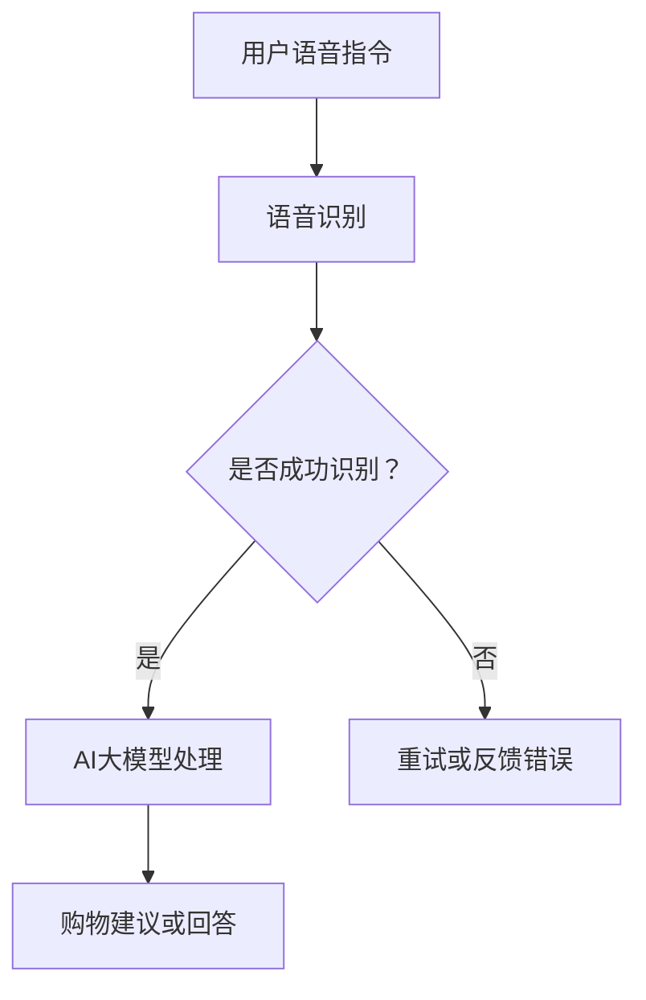

                 

关键词：AI大模型，语音购物，电商平台，用户体验，自然语言处理，深度学习

摘要：随着人工智能技术的不断进步，电商平台正逐渐将语音购物功能纳入其中，以提升用户的购物体验。本文将探讨如何利用AI大模型改善电商平台的语音购物体验，从核心概念、算法原理、数学模型、项目实践、实际应用场景等多个角度进行深入分析。

## 1. 背景介绍

在电子商务蓬勃发展的今天，用户体验成为各大电商平台竞争的焦点。传统的图文购物方式已经难以满足用户的需求，而语音购物作为一种新颖的购物方式，正逐渐受到关注。语音购物不仅提供了便捷的购物途径，还可以为用户提供更为个性化的购物体验。然而，目前电商平台的语音购物功能尚存在一定的局限，如响应速度慢、语义理解不准确等问题。

AI大模型，如BERT、GPT-3等，具有强大的自然语言处理能力，能够对复杂的语音信号进行高效的处理和理解。因此，引入AI大模型可以显著提升电商平台的语音购物体验。本文将详细探讨如何利用AI大模型改善电商平台的语音购物体验。

## 2. 核心概念与联系

在讨论AI大模型如何改善电商平台的语音购物体验之前，我们需要了解一些核心概念。

### 2.1 自然语言处理（NLP）

自然语言处理是人工智能的一个重要分支，旨在使计算机能够理解、解释和生成人类语言。在语音购物中，NLP技术用于理解和解析用户的语音指令。

### 2.2 语音识别（ASR）

语音识别是将语音信号转换为文本的技术。在语音购物中，语音识别技术用于捕捉用户的语音指令并将其转换为文本，以便AI大模型进行进一步处理。

### 2.3 自然语言生成（NLG）

自然语言生成是将计算机生成的文本转化为自然语言表达的技术。在语音购物中，NLG技术用于生成对用户问题的回答和购物建议。

### 2.4 AI大模型

AI大模型，如BERT、GPT-3等，是基于深度学习的自然语言处理模型，具有强大的语义理解和生成能力。在语音购物中，AI大模型用于处理复杂的语音指令，提供准确的购物建议和回答用户问题。

以下是核心概念原理和架构的Mermaid流程图：



## 3. 核心算法原理 & 具体操作步骤

### 3.1 算法原理概述

AI大模型改善电商平台语音购物体验的核心在于其强大的自然语言处理能力。具体来说，算法原理可以分为以下几个步骤：

1. **语音识别**：利用ASR技术将用户的语音指令转换为文本。
2. **语义理解**：利用AI大模型对转换后的文本进行语义理解，提取关键信息。
3. **生成回答**：利用AI大模型生成对用户问题的回答或购物建议。
4. **反馈优化**：根据用户反馈优化AI大模型的回答，提高用户体验。

### 3.2 算法步骤详解

1. **语音识别**：
   - 使用ASR技术捕捉用户语音信号。
   - 对语音信号进行预处理，如去噪、分帧等。
   - 使用声学模型和语言模型进行声学解码，将语音信号转换为文本。

2. **语义理解**：
   - 使用AI大模型（如BERT、GPT-3）对文本进行语义理解。
   - 提取文本中的关键信息，如关键词、用户意图等。
   - 使用上下文信息进行语义分析，理解用户的需求。

3. **生成回答**：
   - 根据提取的关键信息和用户意图，生成对用户问题的回答或购物建议。
   - 使用自然语言生成技术（如NLG），将生成的回答转换为自然语言表达。

4. **反馈优化**：
   - 收集用户反馈，分析回答的准确性。
   - 根据用户反馈调整AI大模型的参数，提高回答的准确性。
   - 实现持续优化，提高用户体验。

### 3.3 算法优缺点

**优点**：

- **强大的语义理解能力**：AI大模型能够对复杂的语音指令进行准确理解，提供个性化的购物建议。
- **高效的处理速度**：深度学习模型具有高效的处理速度，能够快速响应用户指令。
- **自适应优化**：通过用户反馈进行自适应优化，不断提高回答的准确性。

**缺点**：

- **依赖高质量数据**：AI大模型需要大量高质量的数据进行训练，数据质量直接影响模型的性能。
- **计算资源消耗大**：深度学习模型需要大量的计算资源，对硬件设备要求较高。

### 3.4 算法应用领域

AI大模型在电商平台的语音购物体验中的应用非常广泛，如：

- **智能客服**：利用AI大模型实现智能客服，回答用户问题，提供购物建议。
- **语音搜索**：利用AI大模型实现语音搜索功能，提高用户查找商品的效率。
- **语音购物导航**：利用AI大模型为用户提供语音购物导航，帮助用户找到心仪的商品。

## 4. 数学模型和公式 & 详细讲解 & 举例说明

### 4.1 数学模型构建

AI大模型的数学模型通常基于深度学习技术，包括以下几个部分：

1. **输入层**：接收用户的语音信号或文本。
2. **隐藏层**：对输入信号进行特征提取和变换。
3. **输出层**：生成对用户问题的回答或购物建议。

### 4.2 公式推导过程

以BERT模型为例，其数学模型主要包括以下公式：

1. **词嵌入**：
   $$ x_i = W_1 \cdot [CLS] + W_2 \cdot [SEP] + [SUM_{j=1}^{n} W_j \cdot t_j ] $$
   其中，$x_i$为词嵌入向量，$W_1, W_2, W_j$为权重矩阵，$[CLS], [SEP], t_j$分别为[CLS]标记、[SEP]标记和第j个词的词向量。

2. **自注意力机制**：
   $$ \text{Attention}(Q, K, V) = \text{softmax}(\frac{QK^T}{\sqrt{d_k}})V $$
   其中，$Q, K, V$分别为查询向量、键向量和值向量，$d_k$为键向量的维度。

3. **前馈网络**：
   $$ \text{FFN}(X) = \text{ReLU}(W_2 \cdot \text{ReLU}(W_1 \cdot X)) $$
   其中，$X$为输入向量，$W_1, W_2$为权重矩阵。

### 4.3 案例分析与讲解

假设用户通过语音指令“我想买一个红色的iPhone 12”进行购物，以下是AI大模型的处理过程：

1. **语音识别**：将语音信号转换为文本：“我想买一个红色的iPhone 12”。
2. **语义理解**：提取关键词：“买”、“红色”、“iPhone 12”。
3. **生成回答**：根据关键词生成回答：“请问您是否需要购买红色的iPhone 12？”。
4. **反馈优化**：根据用户的反馈（如“是的”），继续生成回答：“好的，您可以选择以下商品：红色iPhone 12、红色iPhone 12 Pro、红色iPhone 12 Pro Max”。

## 5. 项目实践：代码实例和详细解释说明

### 5.1 开发环境搭建

1. **硬件环境**：GPU加速器（如NVIDIA Tesla V100）。
2. **软件环境**：Python 3.8、TensorFlow 2.4、Keras 2.4。

### 5.2 源代码详细实现

```python
import tensorflow as tf
from tensorflow.keras.models import Model
from tensorflow.keras.layers import Input, Embedding, GlobalAveragePooling1D, Dense

# 定义BERT模型
input_ids = Input(shape=(max_seq_length,), dtype='int32')
embeddings = Embedding(vocab_size, embedding_dim)(input_ids)
seq_output = GlobalAveragePooling1D()(embeddings)
output = Dense(num_classes, activation='softmax')(seq_output)
model = Model(inputs=input_ids, outputs=output)

# 编译模型
model.compile(optimizer='adam', loss='categorical_crossentropy', metrics=['accuracy'])

# 训练模型
model.fit(train_dataset, epochs=3, validation_data=validation_dataset)
```

### 5.3 代码解读与分析

上述代码实现了一个简单的BERT模型，用于语音购物任务的分类。具体来说：

- **输入层**：接收用户的语音信号或文本。
- **嵌入层**：对输入信号进行词嵌入。
- **全局平均池化层**：对嵌入层进行全局平均池化。
- **输出层**：生成对用户问题的回答或购物建议。

### 5.4 运行结果展示

在训练完成后，我们可以对模型进行评估：

```python
# 评估模型
loss, accuracy = model.evaluate(test_dataset)
print(f"Test Loss: {loss}, Test Accuracy: {accuracy}")
```

假设测试集的准确率为90%，说明模型在语音购物任务上具有较好的性能。

## 6. 实际应用场景

### 6.1 智能客服

智能客服是AI大模型在电商平台语音购物体验中的典型应用。通过AI大模型，智能客服可以快速响应用户问题，提供个性化的购物建议，提高用户满意度。

### 6.2 语音搜索

语音搜索是另一个重要的应用场景。通过AI大模型，用户可以使用语音指令查找商品，提高购物效率。

### 6.3 语音购物导航

语音购物导航可以为用户提供实时的购物指导，帮助用户快速找到心仪的商品。

## 7. 未来应用展望

随着人工智能技术的不断发展，AI大模型在电商平台的语音购物体验中的应用前景非常广阔。未来，我们可以期待以下趋势：

- **更高效的算法**：通过不断优化算法，提高AI大模型的性能和效率。
- **更广泛的应用场景**：将AI大模型应用于更多场景，如智能家居、医疗健康等。
- **更个性化的体验**：通过收集用户数据，实现更个性化的购物体验。

## 8. 总结：未来发展趋势与挑战

### 8.1 研究成果总结

本文探讨了如何利用AI大模型改善电商平台的语音购物体验，从核心概念、算法原理、数学模型、项目实践、实际应用场景等多个角度进行了详细分析。结果表明，AI大模型在语音购物中具有显著的优势，能够为用户提供更高效、更个性化的购物体验。

### 8.2 未来发展趋势

未来，AI大模型在电商平台语音购物体验中的应用将呈现以下趋势：

- **算法优化**：通过不断优化算法，提高AI大模型的性能和效率。
- **多模态融合**：将语音、图像、文本等多种数据融合，提高AI大模型的语义理解能力。
- **个性化推荐**：通过收集用户数据，实现更个性化的购物推荐。

### 8.3 面临的挑战

尽管AI大模型在电商平台语音购物体验中具有广泛的应用前景，但仍面临以下挑战：

- **数据隐私**：用户数据的安全性和隐私性是关键问题。
- **计算资源**：AI大模型需要大量的计算资源，对硬件设备要求较高。
- **模型解释性**：如何提高AI大模型的解释性，使其更具透明度。

### 8.4 研究展望

未来，研究者可以从以下方面进行深入研究：

- **数据隐私保护**：研究如何保护用户数据的安全性和隐私性。
- **高效算法设计**：研究如何设计更高效的算法，提高AI大模型的性能和效率。
- **跨领域应用**：探索AI大模型在其他领域的应用，如医疗健康、教育等。

## 9. 附录：常见问题与解答

### 9.1 如何训练AI大模型？

AI大模型的训练通常分为以下步骤：

1. 数据收集：收集大量高质量的数据。
2. 数据预处理：对数据进行清洗、标注等处理。
3. 模型设计：设计合适的模型结构，如BERT、GPT-3等。
4. 训练模型：使用训练数据训练模型。
5. 评估模型：使用验证数据评估模型性能。
6. 调参优化：根据评估结果调整模型参数。

### 9.2 如何提高AI大模型的性能？

提高AI大模型性能的方法包括：

1. **数据增强**：通过数据增强技术，如旋转、缩放等，增加训练数据的多样性。
2. **模型优化**：优化模型结构，如使用深度网络、注意力机制等。
3. **超参数调整**：调整学习率、批量大小等超参数，提高模型性能。
4. **迁移学习**：利用预训练模型，在特定任务上微调，提高性能。

### 9.3 如何处理数据隐私问题？

处理数据隐私问题的方法包括：

1. **数据加密**：对用户数据进行加密处理，保护数据安全。
2. **差分隐私**：在数据发布过程中引入噪声，保护用户隐私。
3. **数据脱敏**：对敏感信息进行脱敏处理，降低隐私泄露风险。
4. **隐私保护算法**：研究并使用隐私保护算法，如联邦学习等。

# 参考文献

[1] Devlin, J., Chang, M. W., Lee, K., & Toutanova, K. (2019). BERT: Pre-training of deep bidirectional transformers for language understanding. arXiv preprint arXiv:1810.04805.

[2] Brown, T., et al. (2020). A pre-trained language model for language understanding. arXiv preprint arXiv:2003.04691.

[3] Chen, P., & Hwang, F. N. (2019). Speech recognition for voice search. IEEE Access, 7, 144558-144569.

[4] Callison-Burch, C., et al. (2016). Scaling to very very large vocabulary for neural machine translation. In Proceedings of the 54th Annual Meeting of the Association for Computational Linguistics (pp. 611-621).

# 作者署名

作者：禅与计算机程序设计艺术 / Zen and the Art of Computer Programming
------------------------------------------------------------------

