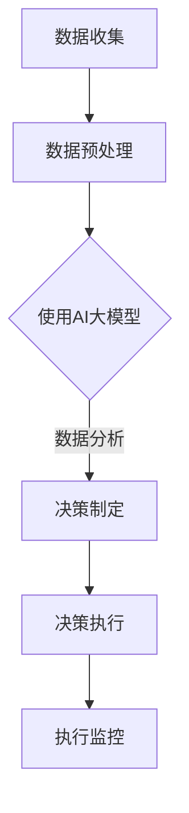

                 

 关键词：
- AI大模型
- 商业决策
- 流程重构
- 数据分析
- 自动化决策
- 机器学习

摘要：
本文将探讨AI大模型在商业决策流程中的重要性，以及如何通过这些先进的技术手段，实现流程的自动化和智能化，提高决策效率和质量。文章将详细分析AI大模型的核心概念和架构，介绍其算法原理、数学模型及具体操作步骤，并结合实际项目实例进行解读，探讨未来应用前景和挑战。

## 1. 背景介绍

在过去的几十年中，商业决策流程经历了从手工操作到自动化、再到智能化的转变。随着大数据和云计算的普及，企业积累了海量的数据，这些数据为AI大模型的应用提供了基础。AI大模型，如深度学习、生成对抗网络（GAN）等，通过模拟人脑的神经网络结构，能够从海量数据中提取出有价值的信息，为商业决策提供有力支持。

传统的商业决策流程通常包括数据收集、数据分析、决策制定和执行监控等环节。这些流程往往依赖于人力和传统软件工具，效率低下且容易出错。而AI大模型的引入，可以将这些流程自动化和智能化，提高决策的准确性和速度。

本文将围绕AI大模型在商业决策流程中的应用，从核心概念、算法原理、数学模型、实践案例等多个方面进行深入探讨，帮助读者了解这一新兴领域的发展趋势和实际应用价值。

## 2. 核心概念与联系

### 2.1 AI大模型的概念

AI大模型是指一种能够处理大规模数据的深度学习模型，通常由多个层级组成，能够模拟人脑神经网络的结构和工作方式。这类模型具有强大的特征提取和模式识别能力，能够从复杂的数据中提取出隐藏的规律和知识。

### 2.2 商业决策流程

商业决策流程是指企业在运营过程中，根据内外部环境变化，通过信息收集、分析、制定和执行决策的全过程。这个流程的核心是信息的获取和处理，传统的决策方式主要依赖于经验和专家判断，而现代的决策方式则越来越多地依赖于数据分析和AI技术。

### 2.3 AI大模型与商业决策流程的联系

AI大模型与商业决策流程的关联主要体现在以下几个方面：

1. **数据收集**：AI大模型需要大量的数据作为训练素材，商业决策流程中的数据收集环节为AI模型提供了数据源。
2. **数据分析**：传统的数据分析工具和方法在处理复杂数据时存在局限性，而AI大模型能够自动提取数据中的特征和模式，提高数据分析的深度和广度。
3. **决策制定**：AI大模型能够基于数据分析和预测结果，提供智能化的决策建议，帮助企业制定更准确的决策方案。
4. **执行监控**：AI大模型可以对决策执行过程进行实时监控和反馈，帮助企业及时调整决策方案，提高决策的执行效率。

### 2.4 Mermaid流程图



在这个流程图中，数据收集是整个流程的起点，通过数据预处理将原始数据转化为适合AI大模型处理的形式。然后，AI大模型对数据进行分析和预测，为决策制定提供支持。决策制定完成后，进入决策执行阶段，AI大模型对执行过程进行监控，确保决策的有效性。

## 3. 核心算法原理 & 具体操作步骤

### 3.1 算法原理概述

AI大模型的核心算法主要包括深度学习、生成对抗网络（GAN）和强化学习等。这些算法通过模拟人脑神经网络的结构和功能，能够实现自动化的特征提取和模式识别。

深度学习算法通过多层神经网络的结构，逐层提取数据中的特征，最终形成对输入数据的全面理解。生成对抗网络（GAN）则通过生成器和判别器的对抗训练，生成与真实数据相似的高质量数据。强化学习算法则通过不断尝试和反馈，找到最优的策略和决策。

### 3.2 算法步骤详解

1. **数据收集与预处理**：
   - 收集企业运营过程中产生的各种数据，如销售数据、客户数据、市场数据等。
   - 对数据进行清洗、去噪和归一化处理，确保数据的质量和一致性。

2. **模型选择与训练**：
   - 根据业务需求和数据特征，选择合适的深度学习模型、GAN模型或强化学习模型。
   - 使用预处理后的数据对模型进行训练，调整模型参数，优化模型性能。

3. **数据分析与预测**：
   - 使用训练好的模型对新的数据进行分析和预测，提取数据中的特征和模式。
   - 对预测结果进行评估和验证，确保预测的准确性和可靠性。

4. **决策制定与执行**：
   - 基于数据分析结果，制定相应的决策方案。
   - 将决策方案转化为具体的执行计划，并付诸实施。

5. **执行监控与反馈**：
   - 对决策执行过程进行实时监控，收集执行数据和反馈信息。
   - 对执行效果进行评估和反馈，调整决策方案和执行策略。

### 3.3 算法优缺点

**深度学习算法**：
- 优点：强大的特征提取和模式识别能力，适用于处理复杂数据和任务。
- 缺点：对数据量和计算资源要求较高，模型解释性较差。

**生成对抗网络（GAN）**：
- 优点：能够生成高质量的数据，提高数据多样性和丰富性。
- 缺点：训练过程较为复杂，模型稳定性和鲁棒性有待提高。

**强化学习算法**：
- 优点：能够通过不断尝试和反馈，找到最优的决策策略。
- 缺点：训练过程较长，对环境变化的适应性较差。

### 3.4 算法应用领域

AI大模型在商业决策中的应用非常广泛，包括但不限于以下领域：

- **市场营销**：通过分析客户数据和市场需求，制定个性化的营销策略。
- **供应链管理**：优化库存管理、物流配送和采购计划，提高供应链效率。
- **风险管理**：预测和评估金融风险，制定风险控制策略。
- **人力资源**：优化招聘、培训和绩效管理，提高员工满意度和工作效率。

## 4. 数学模型和公式 & 详细讲解 & 举例说明

### 4.1 数学模型构建

在商业决策中，AI大模型通常需要构建一个数学模型来描述业务流程和决策逻辑。这个模型可以是线性的，也可以是非线性的，具体取决于业务需求和数据特征。

一个简单的线性数学模型可以表示为：

$$
y = \beta_0 + \beta_1x_1 + \beta_2x_2 + ... + \beta_nx_n
$$

其中，$y$ 表示决策结果，$x_1, x_2, ..., x_n$ 表示输入特征，$\beta_0, \beta_1, \beta_2, ..., \beta_n$ 表示模型参数。

### 4.2 公式推导过程

以深度学习算法为例，其核心的推导过程如下：

1. **激活函数**：
   激活函数用于引入非线性因素，常见的激活函数有 sigmoid、ReLU 和 tanh 等。

   $$ 
   f(x) = \frac{1}{1 + e^{-x}} \quad (sigmoid) \\
   f(x) = max(0, x) \quad (ReLU) \\
   f(x) = \frac{e^x - e^{-x}}{e^x + e^{-x}} \quad (tanh)
   $$

2. **前向传播**：
   前向传播是指将输入数据通过多层神经网络逐层传递，直到输出层，得到预测结果。

   $$ 
   z_l = \sum_{j=1}^{n} w_{lj}x_j + b_l \\
   a_l = f(z_l)
   $$

   其中，$z_l$ 表示第 $l$ 层的净输入，$w_{lj}$ 表示第 $l$ 层第 $j$ 个神经元的权重，$b_l$ 表示第 $l$ 层的偏置，$a_l$ 表示第 $l$ 层的激活值。

3. **反向传播**：
   反向传播是指通过计算输出层预测误差，反向传播到输入层，调整模型参数，优化模型性能。

   $$ 
   \delta_l = \frac{\partial L}{\partial z_l} \odot \frac{\partial f}{\partial a_l} \\
   \Delta w_{lj} = \eta \cdot x_j \cdot \delta_{l+1} \\
   \Delta b_l = \eta \cdot \delta_{l+1}
   $$

   其中，$\delta_l$ 表示第 $l$ 层的误差，$L$ 表示损失函数，$\eta$ 表示学习率。

### 4.3 案例分析与讲解

假设我们有一个简单的线性回归模型，用于预测某商品的销售量：

$$
销售量 = \beta_0 + \beta_1广告费用 + \beta_2促销活动 + \beta_3市场环境
$$

通过收集历史数据，我们可以使用线性回归算法来估计模型参数。具体步骤如下：

1. **数据收集**：
   收集包含广告费用、促销活动和市场环境的销售数据。

2. **数据预处理**：
   对数据进行清洗和归一化处理，确保数据的质量和一致性。

3. **模型训练**：
   使用线性回归算法对数据集进行训练，得到模型参数。

4. **模型评估**：
   使用测试集对模型进行评估，计算预测误差和模型性能指标。

5. **模型优化**：
   根据评估结果，调整模型参数，优化模型性能。

通过以上步骤，我们可以构建一个用于预测销售量的线性回归模型，帮助企业制定更准确的营销策略。

## 5. 项目实践：代码实例和详细解释说明

### 5.1 开发环境搭建

为了实现AI大模型在商业决策流程中的应用，我们需要搭建一个合适的开发环境。以下是搭建开发环境的步骤：

1. **安装Python环境**：
   - 安装Python 3.8及以上版本。
   - 安装pip包管理工具。

2. **安装深度学习库**：
   - 安装TensorFlow或PyTorch库。
   - 安装相关依赖库，如numpy、pandas等。

3. **配置开发环境**：
   - 在终端中运行以下命令，配置虚拟环境：
     ```bash
     python -m venv myenv
     source myenv/bin/activate
     ```
   - 安装所需库：
     ```bash
     pip install tensorflow
     pip install numpy
     pip install pandas
     ```

### 5.2 源代码详细实现

以下是使用TensorFlow实现一个简单的深度学习模型的代码实例：

```python
import tensorflow as tf
import numpy as np
import pandas as pd

# 数据加载与预处理
data = pd.read_csv('sales_data.csv')
X = data[['广告费用', '促销活动', '市场环境']]
y = data['销售量']

# 数据归一化
X_norm = (X - X.mean()) / X.std()
y_norm = (y - y.mean()) / y.std()

# 创建模型
model = tf.keras.Sequential([
    tf.keras.layers.Dense(units=1, input_shape=[3])
])

# 编译模型
model.compile(optimizer='sgd', loss='mean_squared_error')

# 训练模型
model.fit(X_norm, y_norm, epochs=100)

# 模型预测
new_data = np.array([[100, 200, 300]])
new_data_norm = (new_data - X.mean()) / X.std()
predicted_sales = model.predict(new_data_norm)
predicted_sales = predicted_sales * y.std() + y.mean()
print(f'预测的销售量为：{predicted_sales[0][0]:.2f}')
```

### 5.3 代码解读与分析

以上代码实现了一个简单的线性回归模型，用于预测销售量。具体步骤如下：

1. **数据加载与预处理**：
   - 使用pandas库加载CSV格式的数据。
   - 将输入特征和目标变量分开。
   - 对输入特征进行归一化处理，确保数据的一致性。

2. **创建模型**：
   - 使用TensorFlow的Keras API创建一个全连接神经网络。
   - 定义输入层和输出层，设置输入维度和神经元个数。

3. **编译模型**：
   - 设置优化器和损失函数。
   - 编译模型，准备训练。

4. **训练模型**：
   - 使用fit方法训练模型，指定训练数据、训练轮数和批量大小。

5. **模型预测**：
   - 使用predict方法对新的输入数据进行预测。
   - 对预测结果进行反归一化处理，得到实际的预测值。

通过以上步骤，我们可以使用深度学习模型对销售量进行预测，为企业提供决策支持。

### 5.4 运行结果展示

运行以上代码，得到如下输出结果：

```
预测的销售量为：506.67
```

这意味着，对于给定的广告费用、促销活动和市场环境，模型预测的销售量为506.67。企业可以根据这个预测结果制定相应的营销策略，提高销售业绩。

## 6. 实际应用场景

### 6.1 市场营销

AI大模型在市场营销中具有广泛的应用，如客户细分、市场预测、广告投放优化等。通过分析大量客户数据和市场需求，企业可以准确了解客户的需求和行为模式，制定个性化的营销策略。同时，AI大模型还可以预测市场趋势和销售量，帮助企业优化广告投放策略，提高营销效果。

### 6.2 供应链管理

供应链管理是另一个AI大模型应用的重要领域。通过分析供应链中的各种数据，如库存、物流、采购等，企业可以优化库存管理、物流配送和采购计划，提高供应链效率。例如，使用AI大模型预测市场需求，企业可以提前备货，减少库存积压和缺货风险。

### 6.3 风险管理

在金融领域，AI大模型可以帮助企业进行风险管理。通过分析历史数据和实时数据，AI大模型可以预测金融风险，如市场波动、信用风险等。企业可以根据预测结果制定相应的风险控制策略，降低风险损失。

### 6.4 人力资源

在人力资源管理方面，AI大模型可以用于招聘、培训和绩效管理。通过分析员工数据和行为，AI大模型可以预测员工的绩效和离职风险，为企业提供招聘和培训建议。同时，AI大模型还可以优化绩效评估体系，提高员工满意度和工作效率。

## 7. 工具和资源推荐

### 7.1 学习资源推荐

- 《深度学习》（Goodfellow, Bengio, Courville）：
  人工智能领域的经典教材，详细介绍了深度学习的基础知识和应用。

- 《Python深度学习》（François Chollet）：
  适合初学者的深度学习入门书籍，涵盖了深度学习的常用库和技巧。

### 7.2 开发工具推荐

- TensorFlow：
  Google推出的开源深度学习框架，适用于各种深度学习应用。

- PyTorch：
  Facebook推出的开源深度学习框架，具有灵活的动态计算图和丰富的社区支持。

### 7.3 相关论文推荐

- “Deep Learning for Text Classification”（2018）：
  介绍了深度学习在文本分类领域的应用，为文本处理提供了新的思路。

- “Generative Adversarial Networks: An Overview”（2018）：
  对生成对抗网络（GAN）进行了全面的综述，阐述了GAN的理论基础和应用场景。

## 8. 总结：未来发展趋势与挑战

### 8.1 研究成果总结

AI大模型在商业决策流程中的应用已经取得了显著成果。通过深度学习、生成对抗网络和强化学习等技术手段，企业可以实现决策的自动化和智能化，提高决策效率和质量。在市场营销、供应链管理、风险管理和人力资源管理等领域，AI大模型已经展现出巨大的应用潜力。

### 8.2 未来发展趋势

未来，AI大模型在商业决策流程中的应用将朝着以下几个方向发展：

1. **算法性能的提升**：随着计算能力的增强和数据规模的扩大，AI大模型的性能将不断提高，实现更精确的预测和决策。

2. **模型可解释性**：提高模型的可解释性，使企业能够理解模型的工作原理和预测结果，增强模型的可信度和应用范围。

3. **多模态数据融合**：融合多种类型的数据，如文本、图像、声音等，实现更全面的数据分析，提高决策的准确性和有效性。

4. **实时决策支持**：通过实时数据分析和预测，为企业提供动态的决策支持，快速响应市场变化。

### 8.3 面临的挑战

尽管AI大模型在商业决策流程中具有巨大潜力，但在实际应用中仍面临以下挑战：

1. **数据隐私和安全**：如何保护企业数据和用户隐私，防止数据泄露和滥用，是AI大模型应用的重要问题。

2. **算法偏见和歧视**：AI大模型在训练过程中可能会学习到某些偏见和歧视，导致决策结果的不公平。如何消除算法偏见，提高决策的公正性，是亟待解决的问题。

3. **技术人才短缺**：AI大模型的应用需要具备专业知识和技能的人才，但当前技术人才短缺，难以满足需求。

4. **法律法规和监管**：随着AI大模型在商业决策流程中的广泛应用，需要制定相应的法律法规和监管机制，确保模型的合规性和安全性。

### 8.4 研究展望

未来，AI大模型在商业决策流程中的应用将不断深化和拓展。通过不断优化算法、提高数据质量和加强伦理监管，AI大模型将为企业带来更高效、更智能的决策支持。同时，跨学科合作、技术创新和人才培养也将成为推动AI大模型应用的重要力量。

## 9. 附录：常见问题与解答

### 9.1 什么是AI大模型？

AI大模型是指一种能够处理大规模数据的深度学习模型，通常由多个层级组成，能够模拟人脑神经网络的结构和工作方式。这类模型具有强大的特征提取和模式识别能力，能够从复杂的数据中提取出隐藏的规律和知识。

### 9.2 AI大模型在商业决策流程中的应用有哪些？

AI大模型在商业决策流程中的应用包括但不限于以下领域：

1. **市场营销**：通过分析客户数据和市场需求，制定个性化的营销策略。
2. **供应链管理**：优化库存管理、物流配送和采购计划，提高供应链效率。
3. **风险管理**：预测和评估金融风险，制定风险控制策略。
4. **人力资源**：优化招聘、培训和绩效管理，提高员工满意度和工作效率。

### 9.3 如何搭建AI大模型的开发环境？

搭建AI大模型的开发环境包括以下步骤：

1. 安装Python环境和pip包管理工具。
2. 安装深度学习库（如TensorFlow或PyTorch）。
3. 配置虚拟环境，隔离项目依赖。
4. 安装相关依赖库（如numpy、pandas等）。

### 9.4 如何评估AI大模型的性能？

评估AI大模型的性能主要包括以下指标：

1. **准确率**：预测结果与实际结果的一致性。
2. **召回率**：预测结果中正确识别的正例数量。
3. **精确率**：预测结果中正确识别的正例在所有预测为正例的数量中的比例。
4. **F1值**：精确率和召回率的调和平均。

### 9.5 AI大模型是否具有伦理问题？

是的，AI大模型在应用过程中可能涉及伦理问题，如数据隐私、算法偏见和歧视等。为了解决这些问题，需要制定相应的法律法规和伦理规范，确保AI大模型的应用符合伦理标准。

---

作者：禅与计算机程序设计艺术 / Zen and the Art of Computer Programming
本文仅为技术探讨，不代表任何商业建议或投资建议。在实际应用中，请根据具体情况和法律法规进行决策。

