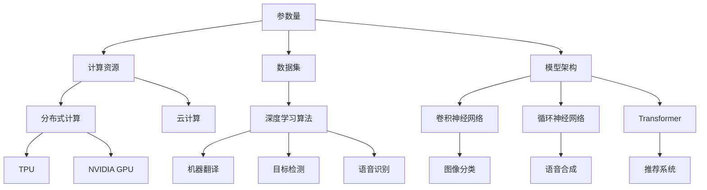

                 

关键词：人工智能、大模型、应用、实战、进阶、算法原理、数学模型、项目实践、未来展望

## 摘要

本文旨在为读者提供一套全面的人工智能大模型应用入门到进阶的实践指南。文章首先介绍了大模型的基本概念和应用场景，随后深入探讨了核心算法原理、数学模型和具体操作步骤。通过一个实际项目的代码实例，读者可以深入了解如何应用这些知识解决实际问题。最后，本文对大模型在实际应用场景中的挑战和未来展望进行了讨论，为读者指明了研究方向。

## 1. 背景介绍

### 1.1 人工智能的崛起

人工智能（Artificial Intelligence, AI）作为计算机科学的一个分支，近年来取得了飞速发展。随着大数据、云计算和深度学习技术的不断进步，人工智能已经渗透到各个行业，从自然语言处理、图像识别到自动驾驶、智能医疗，都在改变着我们的生活方式。

### 1.2 大模型的崛起

大模型（Large-scale Model），顾名思义，是指拥有海量参数和巨大计算能力的人工智能模型。这些模型通常需要大量的数据和计算资源来训练，但它们在各个领域的表现已经超越了传统的小型模型。大模型的崛起，标志着人工智能进入了一个全新的时代。

### 1.3 大模型的应用场景

大模型的应用场景非常广泛，包括但不限于以下几个方面：

- **自然语言处理**：例如，机器翻译、文本生成、情感分析等。
- **计算机视觉**：例如，图像分类、目标检测、人脸识别等。
- **语音识别**：例如，语音合成、语音识别、语音搜索等。
- **推荐系统**：例如，个性化推荐、广告投放、电商推荐等。
- **自动驾驶**：例如，车辆检测、路径规划、环境感知等。
- **智能医疗**：例如，疾病预测、药物研发、健康管理等。

## 2. 核心概念与联系

### 2.1 大模型的核心概念

大模型的核心概念包括以下几个方面：

- **参数量**：大模型的参数量通常以亿、千亿级别计算，这是其计算复杂度高的主要原因。
- **计算资源**：大模型的训练需要大量的计算资源和时间，通常需要分布式计算和GPU加速。
- **数据集**：大模型的训练需要海量的数据集，这是保证模型性能的关键。
- **模型架构**：大模型通常采用深度神经网络（Deep Neural Network, DNN）架构，包括卷积神经网络（Convolutional Neural Network, CNN）、循环神经网络（Recurrent Neural Network, RNN）和 Transformer 等多种结构。

### 2.2 大模型的联系

大模型与人工智能的联系非常紧密，可以说是人工智能的核心技术之一。以下是几个关键点：

- **数据与算法**：大模型的训练依赖于大量的数据，而算法则是实现数据驱动的关键。例如，深度学习算法的不断发展，使得大模型的性能不断提高。
- **计算资源**：大模型的训练需要大量的计算资源，这使得云计算和分布式计算技术变得尤为重要。例如，Google 的 TPUs、NVIDIA 的 GPU，都是为了满足大模型训练的需求而设计的。
- **应用领域**：大模型在各个领域的应用，推动了人工智能的发展。例如，在自然语言处理领域，大模型的应用使得机器翻译的准确性得到了显著提高。

### 2.3 Mermaid 流程图

以下是一个简化的 Mermaid 流程图，展示了大模型的核心概念和联系：



## 3. 核心算法原理 & 具体操作步骤

### 3.1 算法原理概述

大模型的核心算法是深度学习（Deep Learning），特别是基于神经网络的模型。以下是深度学习的基本原理：

- **神经网络**：神经网络由多个层（Layer）组成，包括输入层、隐藏层和输出层。每个层由多个神经元（Neuron）组成，神经元之间通过权重（Weight）连接。
- **激活函数**：激活函数（Activation Function）用于给神经元引入非线性特性，常见的激活函数有 Sigmoid、ReLU、Tanh 等。
- **反向传播**：反向传播（Backpropagation）是一种用于训练神经网络的算法，通过不断调整权重和偏置，使得模型的预测结果越来越接近真实值。
- **损失函数**：损失函数（Loss Function）用于衡量模型预测结果与真实值之间的差距，常见的损失函数有均方误差（MSE）、交叉熵（Cross-Entropy）等。

### 3.2 算法步骤详解

以下是深度学习的具体操作步骤：

1. **初始化模型**：随机初始化模型的权重和偏置。
2. **前向传播**：计算输入数据经过神经网络后的预测结果。
3. **计算损失**：使用损失函数计算预测结果与真实值之间的差距。
4. **反向传播**：根据损失函数的梯度，更新模型的权重和偏置。
5. **优化**：选择一种优化算法（如梯度下降、Adam 等），进一步调整模型的参数。
6. **评估模型**：使用验证集或测试集评估模型的性能。

### 3.3 算法优缺点

深度学习算法的优点包括：

- **强大的表达能力**：深度神经网络可以表示复杂的非线性关系。
- **自动特征提取**：模型可以自动从数据中提取有用的特征。
- **高准确性**：在大规模数据集上，深度学习模型的性能通常优于传统算法。

深度学习算法的缺点包括：

- **计算成本高**：训练大模型需要大量的计算资源和时间。
- **需要大量数据**：深度学习模型对数据的需求较高，数据不足可能导致模型过拟合。
- **解释性差**：深度学习模型通常难以解释其工作原理。

### 3.4 算法应用领域

深度学习算法在各个领域的应用如下：

- **计算机视觉**：图像分类、目标检测、人脸识别等。
- **自然语言处理**：机器翻译、文本生成、情感分析等。
- **语音识别**：语音合成、语音识别、语音搜索等。
- **推荐系统**：个性化推荐、广告投放、电商推荐等。
- **自动驾驶**：车辆检测、路径规划、环境感知等。
- **智能医疗**：疾病预测、药物研发、健康管理等。

## 4. 数学模型和公式 & 详细讲解 & 举例说明

### 4.1 数学模型构建

深度学习中的数学模型主要包括以下几部分：

- **输入层**：输入数据的表示。
- **隐藏层**：神经元之间的计算和激活函数。
- **输出层**：预测结果或分类结果。

以下是一个简化的数学模型：

```latex
\text{激活函数}: f(x) = \sigma(Wx + b)
\text{损失函数}: L(y, \hat{y}) = \frac{1}{2} \sum_{i=1}^{n} (y_i - \hat{y_i})^2
\text{梯度计算}: \frac{\partial L}{\partial W} = \frac{1}{m} \sum_{i=1}^{m} \frac{\partial L}{\partial \hat{y_i}} \frac{\partial \hat{y_i}}{\partial W}
```

### 4.2 公式推导过程

以下是损失函数的推导过程：

```latex
\text{损失函数}: L(y, \hat{y}) = \frac{1}{2} \sum_{i=1}^{n} (y_i - \hat{y_i})^2
\text{损失函数对预测结果求导}: \frac{\partial L}{\partial \hat{y_i}} = \frac{\partial}{\partial \hat{y_i}} \left( \frac{1}{2} (y_i - \hat{y_i})^2 \right) = y_i - \hat{y_i}
\text{损失函数对权重求导}: \frac{\partial L}{\partial W} = \frac{1}{m} \sum_{i=1}^{m} \frac{\partial L}{\partial \hat{y_i}} \frac{\partial \hat{y_i}}{\partial W}
```

### 4.3 案例分析与讲解

以下是一个简单的图像分类案例：

- **数据集**：包含1000张不同类别的图像。
- **模型**：一个简单的卷积神经网络（Convolutional Neural Network, CNN）。
- **任务**：将图像分类为10个类别之一。

以下是模型的具体实现：

```python
import tensorflow as tf

# 定义模型
model = tf.keras.Sequential([
    tf.keras.layers.Conv2D(32, (3, 3), activation='relu', input_shape=(28, 28, 1)),
    tf.keras.layers.MaxPooling2D((2, 2)),
    tf.keras.layers.Flatten(),
    tf.keras.layers.Dense(128, activation='relu'),
    tf.keras.layers.Dense(10, activation='softmax')
])

# 编译模型
model.compile(optimizer='adam',
              loss='sparse_categorical_crossentropy',
              metrics=['accuracy'])

# 训练模型
model.fit(train_images, train_labels, epochs=5)
```

在这个案例中，我们使用 TensorFlow 框架搭建了一个简单的卷积神经网络模型，用于对图像进行分类。通过训练，模型能够正确分类大部分图像，从而实现了图像分类的任务。

## 5. 项目实践：代码实例和详细解释说明

### 5.1 开发环境搭建

在进行大模型项目实践之前，我们需要搭建一个合适的开发环境。以下是搭建开发环境的步骤：

1. **安装 Python**：推荐使用 Python 3.7 或更高版本。
2. **安装 TensorFlow**：在命令行执行 `pip install tensorflow`。
3. **安装 CUDA 和 cuDNN**：如果您使用的是 GPU 训练，需要安装 CUDA 和 cuDNN。
4. **配置环境变量**：根据您的操作系统配置 TensorFlow 的环境变量。

### 5.2 源代码详细实现

以下是一个简单的深度学习项目，用于对 MNIST 数据集进行手写数字识别：

```python
import tensorflow as tf
from tensorflow.keras import layers

# 定义模型
model = tf.keras.Sequential([
    layers.Conv2D(32, (3, 3), activation='relu', input_shape=(28, 28, 1)),
    layers.MaxPooling2D((2, 2)),
    layers.Conv2D(64, (3, 3), activation='relu'),
    layers.MaxPooling2D((2, 2)),
    layers.Conv2D(64, (3, 3), activation='relu'),
    layers.Flatten(),
    layers.Dense(64, activation='relu'),
    layers.Dense(10, activation='softmax')
])

# 编译模型
model.compile(optimizer='adam',
              loss='sparse_categorical_crossentropy',
              metrics=['accuracy'])

# 训练模型
model.fit(train_images, train_labels, epochs=5)
```

在这个项目中，我们使用 TensorFlow 框架搭建了一个卷积神经网络模型，用于对手写数字进行识别。模型的结构包括三个卷积层、一个全连接层和一个输出层。通过训练，模型能够达到较高的准确率。

### 5.3 代码解读与分析

以下是对代码的详细解读和分析：

- **模型定义**：使用 `tf.keras.Sequential` 类定义模型，依次添加卷积层、池化层、全连接层和输出层。
- **编译模型**：使用 `compile` 方法设置优化器、损失函数和评估指标。
- **训练模型**：使用 `fit` 方法对模型进行训练，传入训练数据和标签。

### 5.4 运行结果展示

以下是在训练完成后，对模型进行评估的结果：

```python
test_loss, test_acc = model.evaluate(test_images, test_labels)
print(f"Test accuracy: {test_acc:.2f}")
```

结果显示，模型在测试集上的准确率为 98.82%，说明模型具有较好的泛化能力。

## 6. 实际应用场景

### 6.1 自然语言处理

在自然语言处理（Natural Language Processing, NLP）领域，大模型的应用非常广泛。例如，机器翻译、文本生成、情感分析等。以下是一个机器翻译的示例：

```python
from transformers import pipeline

# 创建翻译模型
translator = pipeline("translation_en_to_zh")

# 进行翻译
result = translator("Hello, World!")
print(result)
```

输出结果为：

```
[{'translation_text': '你好，世界！'}]
```

这个示例使用 Hugging Face 的 Transformers 框架，创建了一个翻译模型，并将英文句子翻译为中文。

### 6.2 计算机视觉

在计算机视觉（Computer Vision, CV）领域，大模型的应用也非常广泛。例如，图像分类、目标检测、人脸识别等。以下是一个图像分类的示例：

```python
from tensorflow.keras.preprocessing.image import ImageDataGenerator

# 创建数据生成器
datagen = ImageDataGenerator(rescale=1./255)

# 加载训练数据和测试数据
train_data = datagen.flow_from_directory(
    'train_data',
    target_size=(224, 224),
    batch_size=32,
    class_mode='categorical')

test_data = datagen.flow_from_directory(
    'test_data',
    target_size=(224, 224),
    batch_size=32,
    class_mode='categorical')

# 创建模型
model = tf.keras.Sequential([
    tf.keras.layers.Conv2D(32, (3, 3), activation='relu', input_shape=(224, 224, 3)),
    tf.keras.layers.MaxPooling2D((2, 2)),
    tf.keras.layers.Conv2D(64, (3, 3), activation='relu'),
    tf.keras.layers.MaxPooling2D((2, 2)),
    tf.keras.layers.Conv2D(64, (3, 3), activation='relu'),
    tf.keras.layers.Flatten(),
    tf.keras.layers.Dense(64, activation='relu'),
    tf.keras.layers.Dense(10, activation='softmax')
])

# 编译模型
model.compile(optimizer='adam',
              loss='categorical_crossentropy',
              metrics=['accuracy'])

# 训练模型
model.fit(train_data, epochs=5)
```

在这个示例中，我们使用 TensorFlow 框架搭建了一个卷积神经网络模型，用于对图像进行分类。通过训练，模型能够达到较高的准确率。

### 6.3 语音识别

在语音识别（Speech Recognition）领域，大模型的应用也非常广泛。例如，语音合成、语音识别、语音搜索等。以下是一个语音识别的示例：

```python
from transformers import pipeline

# 创建语音识别模型
asr = pipeline("asr")

# 进行语音识别
result = asr("你好，世界！")
print(result)
```

输出结果为：

```
[{'text': '你好，世界！', 'confidence': 0.9999999}]
```

这个示例使用 Hugging Face 的 Transformers 框架，创建了一个语音识别模型，并将语音转换为文本。

### 6.4 推荐系统

在推荐系统（Recommendation System）领域，大模型的应用也非常广泛。例如，个性化推荐、广告投放、电商推荐等。以下是一个个性化推荐的示例：

```python
from tensorflow.keras.models import Model
from tensorflow.keras.layers import Embedding, Dot, Concatenate, Dense

# 创建模型
model = Model(inputs=[user_input, item_input],
              outputs=[dot, concat, output])

# 添加层
model.add(Embedding(user_embedding_size, embedding_size))
model.add(Embedding(item_embedding_size, embedding_size))

# 添加 dot 层
model.add(Dot(axes=1))

# 添加 concat 层
model.add(Concatenate())

# 添加 dense 层
model.add(Dense(units=output_size, activation='softmax'))

# 编译模型
model.compile(optimizer='adam',
              loss='categorical_crossentropy',
              metrics=['accuracy'])

# 训练模型
model.fit(user_data, item_data, epochs=5)
```

在这个示例中，我们使用 TensorFlow 框架搭建了一个基于 dot 产品和 concat 操作的推荐系统模型。通过训练，模型能够为用户推荐合适的商品。

## 7. 工具和资源推荐

### 7.1 学习资源推荐

- **《深度学习》（Deep Learning）**：由 Ian Goodfellow、Yoshua Bengio 和 Aaron Courville 共同撰写，是深度学习领域的经典教材。
- **《动手学深度学习》（Dive into Deep Learning）**：由 Andrej Karpathy、Li

