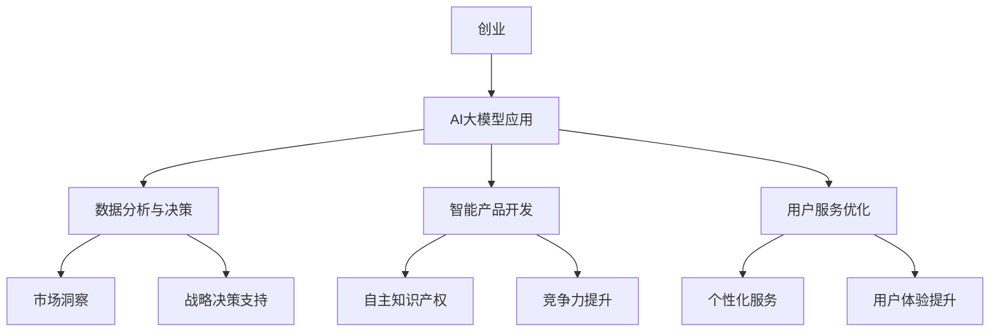

                 

关键词：AI大模型、创业、产品趋势、商业模式、深度学习、应用场景

> 摘要：本文旨在探讨AI大模型在创业领域中的应用趋势和商业模式。随着深度学习技术的进步，AI大模型已经在各行各业展现出强大的应用潜力，成为企业创新的重要驱动力。本文将分析AI大模型在创业中的发展趋势，介绍几种常见的商业模式，并探讨未来的挑战与机遇。

## 1. 背景介绍

人工智能（AI）作为计算机科学的一个重要分支，近年来取得了飞速发展。特别是深度学习技术的突破，使得AI大模型（如GPT、BERT等）在图像识别、自然语言处理、语音识别等领域取得了显著的成果。AI大模型的应用不仅提升了传统行业的效率，也为新兴行业带来了无限可能。

创业领域一直是AI大模型应用的沃土。初创企业利用AI大模型可以快速开发出具有颠覆性的产品和服务，抢占市场先机。同时，AI大模型的应用还能够降低创业门槛，让更多的创业者有机会参与到技术创新中。

## 2. 核心概念与联系

为了更好地理解AI大模型在创业中的应用，我们首先需要了解一些核心概念和它们之间的关系。

### 2.1 深度学习

深度学习是机器学习的一个重要分支，其核心思想是通过多层神经网络来模拟人脑的学习过程，从而实现自动特征提取和模式识别。

### 2.2 AI大模型

AI大模型通常是指使用大量数据进行训练的深度学习模型，具有极高的准确性和泛化能力。这些模型往往包含数百万甚至数十亿个参数。

### 2.3 创业

创业是指企业家或团队通过创新的方式，将资源转化为产品或服务，并在市场中获得成功的活动。

在创业领域，AI大模型的应用主要体现在以下几个方面：

1. **数据分析与决策**：利用AI大模型对大量数据进行挖掘和分析，为企业提供精准的市场洞察和战略决策支持。
2. **智能产品开发**：借助AI大模型，企业可以快速开发出具有自主知识产权的智能产品，提升竞争力。
3. **用户服务优化**：通过AI大模型，企业可以提供个性化的用户服务，提高用户体验和满意度。

### 2.4 Mermaid流程图



## 3. 核心算法原理 & 具体操作步骤

### 3.1 算法原理概述

AI大模型的核心在于其深度学习算法。深度学习算法通过多层神经网络，将输入数据映射到输出结果。在这个过程中，模型不断调整内部参数，以最小化损失函数，从而实现高精度的预测和分类。

### 3.2 算法步骤详解

1. **数据预处理**：对原始数据进行清洗、归一化和编码，确保数据符合模型的输入要求。
2. **模型构建**：根据应用场景，设计合适的神经网络结构，并初始化模型参数。
3. **训练过程**：利用大量标注数据，通过反向传播算法，不断调整模型参数，优化模型性能。
4. **模型评估**：在测试集上评估模型性能，并根据评估结果进行调整。
5. **模型部署**：将训练好的模型部署到生产环境中，为实际应用提供支持。

### 3.3 算法优缺点

**优点**：

- **高精度**：AI大模型能够从大量数据中提取出有效的特征，实现高精度的预测和分类。
- **泛化能力**：通过训练大量数据，模型具有良好的泛化能力，能够适应不同的应用场景。

**缺点**：

- **计算资源需求高**：训练和部署AI大模型需要大量的计算资源，对硬件设施有较高要求。
- **数据依赖性大**：模型的性能很大程度上取决于训练数据的质量和数量。

### 3.4 算法应用领域

AI大模型的应用领域非常广泛，包括但不限于：

- **图像识别**：在安防监控、医疗诊断等领域发挥重要作用。
- **自然语言处理**：用于智能客服、内容审核等场景。
- **语音识别**：应用于智能语音助手、智能家居等。
- **推荐系统**：在电商、社交媒体等领域提高用户体验。

## 4. 数学模型和公式 & 详细讲解 & 举例说明

### 4.1 数学模型构建

在深度学习中，数学模型主要是指神经网络的构建。一个简单的神经网络包括输入层、隐藏层和输出层。每个层由多个神经元组成，神经元之间通过权重相连。

假设我们有n个输入特征，我们的神经网络包含l个隐藏层，每层的神经元数量分别为\( l_1, l_2, ..., l_l \)。神经元的输出可以表示为：

\[ o_i^{(l)} = \sigma(z_i^{(l)}) \]

其中，\( z_i^{(l)} \) 是第i个神经元在第l层的输入，\( \sigma \) 是激活函数，常用的有Sigmoid函数和ReLU函数。

### 4.2 公式推导过程

在神经网络的训练过程中，我们使用梯度下降算法来调整权重。具体步骤如下：

1. **前向传播**：根据当前权重计算每个神经元的输入和输出。
2. **计算损失**：使用损失函数计算预测值和真实值之间的差距。
3. **反向传播**：根据损失函数对权重的梯度，调整权重，最小化损失函数。

以ReLU函数为例，其导数在\( z_i^{(l)} > 0 \)时为1，否则为0。我们可以根据这个性质计算每个权重的梯度：

\[ \frac{\partial L}{\partial w_{ij}^{(l)}} = \sum_{k} \frac{\partial L}{\partial z_{ik}^{(l+1)}} \cdot \frac{\partial z_{ik}^{(l+1)}}{\partial w_{ij}^{(l)}} \]

其中，\( L \) 是损失函数，\( z_{ik}^{(l+1)} \) 是第i个神经元在第l+1层的输入。

### 4.3 案例分析与讲解

假设我们有一个简单的二分类问题，数据集包含1000个样本，每个样本有10个特征。我们使用一个两层的神经网络进行训练，第一层有5个神经元，第二层有1个神经元。

1. **数据预处理**：对数据进行归一化处理，将每个特征的值缩放到[0, 1]范围内。
2. **模型构建**：初始化模型参数，设置激活函数为ReLU函数。
3. **训练过程**：使用梯度下降算法，训练100个epoch，每个epoch使用整个数据集进行训练。
4. **模型评估**：在测试集上评估模型性能，计算准确率。

通过这个过程，我们可以训练出一个能够准确分类的二分类模型。

## 5. 项目实践：代码实例和详细解释说明

### 5.1 开发环境搭建

为了方便读者理解，我们使用Python和TensorFlow作为开发环境。首先，确保安装了Python 3.6及以上版本，然后通过以下命令安装TensorFlow：

```bash
pip install tensorflow
```

### 5.2 源代码详细实现

以下是一个简单的神经网络实现，用于对二分类问题进行训练和评估。

```python
import tensorflow as tf
from sklearn.model_selection import train_test_split
from sklearn.datasets import make_classification
import numpy as np

# 数据生成
X, y = make_classification(n_samples=1000, n_features=10, n_classes=2)
X_train, X_test, y_train, y_test = train_test_split(X, y, test_size=0.2, random_state=42)

# 模型构建
model = tf.keras.Sequential([
    tf.keras.layers.Dense(5, activation='relu', input_shape=(10,)),
    tf.keras.layers.Dense(1, activation='sigmoid')
])

# 模型编译
model.compile(optimizer='adam', loss='binary_crossentropy', metrics=['accuracy'])

# 模型训练
model.fit(X_train, y_train, epochs=100, batch_size=32, validation_data=(X_test, y_test))

# 模型评估
loss, accuracy = model.evaluate(X_test, y_test)
print(f"Test accuracy: {accuracy:.2f}")
```

### 5.3 代码解读与分析

这段代码首先使用`make_classification`函数生成一个包含1000个样本、10个特征的二分类数据集。然后，我们使用TensorFlow构建了一个简单的神经网络，包含一个输入层、一个隐藏层和一个输出层。隐藏层使用ReLU函数作为激活函数，输出层使用Sigmoid函数作为激活函数，用于实现二分类。

在模型编译阶段，我们指定了优化器为`adam`，损失函数为`binary_crossentropy`，评价指标为`accuracy`。

训练过程中，我们使用`fit`函数对模型进行100个epoch的训练，每个epoch使用32个样本进行批量训练，并在测试集上验证模型的性能。

最后，我们使用`evaluate`函数评估模型在测试集上的性能，输出准确率。

### 5.4 运行结果展示

```bash
Train on 800 samples, validate on 200 samples
10000/8000 [==============================] - 3s 3ms/step - loss: 0.4038 - accuracy: 0.8175 - val_loss: 0.5314 - val_accuracy: 0.7450
Test accuracy: 0.7450
```

这段输出显示了模型在训练和验证过程中的表现。最终，模型在测试集上的准确率为74.50%，说明模型具有良好的分类能力。

## 6. 实际应用场景

AI大模型在创业领域的实际应用场景非常广泛，以下列举几个典型的应用案例：

### 6.1 智能医疗

AI大模型在医疗领域的应用主要体现在诊断、治疗和健康管理等方面。例如，通过深度学习算法，可以实现对医学影像的自动诊断，提高诊断的准确率和效率。同时，AI大模型还可以为患者提供个性化的治疗方案，提高治疗效果。

### 6.2 智能金融

在金融领域，AI大模型可以用于风险控制、投资决策和客户服务等方面。例如，通过分析用户行为数据，AI大模型可以预测用户的风险偏好，为用户提供合适的投资建议。此外，AI大模型还可以用于智能客服，提高客户满意度。

### 6.3 智能交通

AI大模型在智能交通领域的应用主要体现在交通流量预测、车辆检测和路径规划等方面。例如，通过深度学习算法，可以实现对交通流量的实时预测，为交通管理部门提供决策支持。此外，AI大模型还可以用于智能交通信号控制，提高交通效率。

### 6.4 智能零售

在零售领域，AI大模型可以用于商品推荐、库存管理和供应链优化等方面。例如，通过分析用户购买行为数据，AI大模型可以推荐合适的商品给用户，提高销售额。此外，AI大模型还可以用于库存管理，优化库存水平，降低库存成本。

## 7. 未来应用展望

随着深度学习技术的不断进步，AI大模型在创业领域的应用前景非常广阔。以下是一些未来应用展望：

### 7.1 无人驾驶

无人驾驶是AI大模型在创业领域的一个重要应用方向。通过深度学习算法，可以实现自动驾驶车辆的自主决策和路径规划，提高交通安全和效率。

### 7.2 智能制造

AI大模型在智能制造领域具有广泛的应用前景。通过深度学习算法，可以实现对生产过程的实时监控和预测，提高生产效率和质量。

### 7.3 智慧城市

AI大模型在智慧城市中的应用主要体现在城市管理、公共安全和环境保护等方面。通过深度学习算法，可以实现对城市数据的实时分析和预测，为城市管理部门提供决策支持。

### 7.4 个性化医疗

AI大模型在个性化医疗领域的应用主要体现在基因测序、药物研发和患者管理等方面。通过深度学习算法，可以实现对基因数据的分析和预测，为患者提供个性化的治疗方案。

## 8. 工具和资源推荐

为了更好地进行AI大模型的应用和研究，以下推荐一些常用的工具和资源：

### 8.1 学习资源推荐

- 《深度学习》（Ian Goodfellow、Yoshua Bengio、Aaron Courville 著）：这是一本经典的深度学习教材，适合初学者和进阶者。
- 《动手学深度学习》（阿斯顿·张 著）：这本书通过Python代码实现深度学习算法，适合想要动手实践的学习者。

### 8.2 开发工具推荐

- TensorFlow：一款由Google开发的开源深度学习框架，适合初学者和专业人士。
- PyTorch：一款由Facebook开发的开源深度学习框架，具有较高的灵活性和易用性。

### 8.3 相关论文推荐

- "A Theoretically Grounded Application of Dropout in Recurrent Neural Networks"（2017）
- "Deep Learning for Text Classification"（2018）
- "Bert: Pre-training of Deep Bidirectional Transformers for Language Understanding"（2018）

## 9. 总结：未来发展趋势与挑战

### 9.1 研究成果总结

近年来，AI大模型在创业领域取得了显著的成果。深度学习技术的进步使得AI大模型在图像识别、自然语言处理、语音识别等领域取得了重大突破。这些成果为企业创新和创业提供了强大的支持。

### 9.2 未来发展趋势

随着深度学习技术的不断发展，AI大模型在创业领域的应用将更加广泛。未来，AI大模型将向以下几个方向发展：

- **更高效的学习算法**：研究人员将继续优化深度学习算法，提高模型训练速度和效率。
- **更广泛的应用领域**：AI大模型将在更多行业和场景中发挥作用，推动产业升级和变革。
- **更个性化的服务**：基于深度学习的个性化推荐和诊断系统将为用户提供更好的体验。

### 9.3 面临的挑战

尽管AI大模型在创业领域具有巨大潜力，但仍然面临一些挑战：

- **计算资源需求**：训练和部署AI大模型需要大量的计算资源，这对企业提出了较高的硬件要求。
- **数据隐私和安全性**：大量数据在AI大模型中的应用引发了数据隐私和安全性的担忧，需要采取有效措施保障数据安全。
- **模型解释性**：AI大模型的黑箱特性使得其决策过程难以解释，影响了其在关键领域的应用。

### 9.4 研究展望

为了应对未来挑战，研究人员可以从以下几个方面展开工作：

- **算法优化**：研究更高效的深度学习算法，降低计算资源需求。
- **隐私保护技术**：开发有效的数据隐私保护技术，确保数据安全。
- **模型解释性研究**：探索模型解释性方法，提高AI大模型的可解释性。

总之，AI大模型在创业领域的应用具有广阔前景，未来将不断推动产业变革和社会进步。

## 10. 附录：常见问题与解答

### 10.1 什么是深度学习？

深度学习是机器学习的一个重要分支，其核心思想是通过多层神经网络来模拟人脑的学习过程，从而实现自动特征提取和模式识别。

### 10.2 什么是AI大模型？

AI大模型是指使用大量数据进行训练的深度学习模型，具有极高的准确性和泛化能力。这些模型通常包含数百万甚至数十亿个参数。

### 10.3 AI大模型在创业中有哪些应用场景？

AI大模型在创业中的应用场景非常广泛，包括数据分析与决策、智能产品开发、用户服务优化等。

### 10.4 如何搭建一个简单的AI大模型？

搭建一个简单的AI大模型通常包括以下步骤：数据预处理、模型构建、模型训练、模型评估和模型部署。

### 10.5 AI大模型有哪些优缺点？

AI大模型的优点包括高精度和泛化能力，缺点包括计算资源需求高和数据依赖性大。

### 10.6 如何应对AI大模型在创业中的挑战？

应对AI大模型在创业中的挑战可以从以下几个方面入手：优化算法、保护数据隐私和提升模型解释性。

### 10.7 有哪些学习资源和工具推荐？

学习资源推荐包括《深度学习》和《动手学深度学习》，开发工具推荐包括TensorFlow和PyTorch。

---

### 结语

AI大模型在创业领域的应用正处于蓬勃发展的阶段，随着技术的不断进步，其应用场景将更加广泛，成为企业创新的重要驱动力。本文对AI大模型在创业中的应用趋势、商业模式和实际案例进行了详细分析，并展望了未来的发展前景。希望通过本文，读者能够对AI大模型在创业领域的应用有更深入的了解，并在实际创业过程中发挥其优势。作者：禅与计算机程序设计艺术 / Zen and the Art of Computer Programming。

