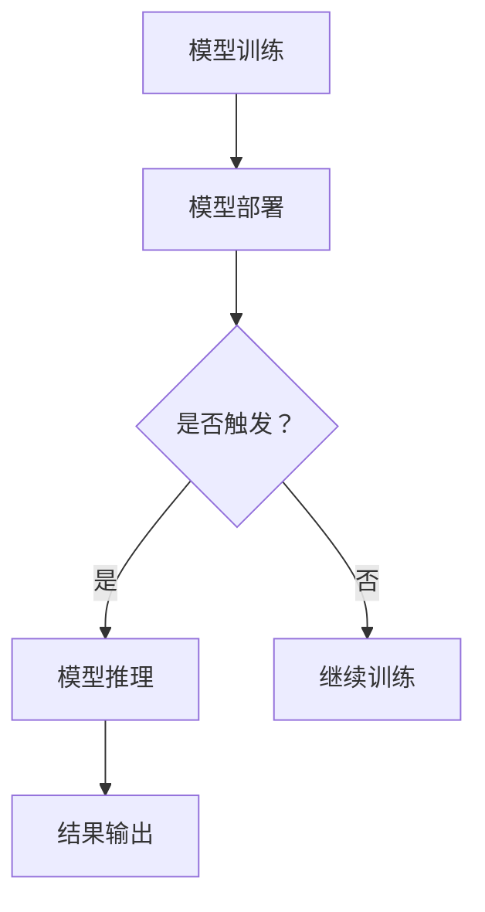

                 

关键词：AI大模型、Serverless架构、云计算、应用开发、性能优化

> 摘要：本文将探讨AI大模型在Serverless架构中的应用，从背景介绍、核心概念、算法原理、数学模型、项目实践、应用场景、工具和资源推荐等方面，详细解析AI大模型在Serverless架构下的高效应用。

## 1. 背景介绍

近年来，人工智能（AI）技术取得了长足的发展，尤其是AI大模型的崛起，如GPT-3、BERT等，极大地推动了自然语言处理、计算机视觉等领域的进步。然而，AI大模型的训练和部署面临计算资源、存储空间、管理复杂度等一系列挑战。Serverless架构作为一种新兴的云计算模式，因其弹性伸缩、低成本、高可靠性的特点，逐渐成为AI大模型应用的重要支撑。

Serverless架构由云计算服务商提供，开发者无需关注底层硬件资源的管理，只需编写代码、上传函数，即可实现应用的快速部署和运行。这种架构模式与AI大模型的需求高度契合，本文将详细探讨AI大模型在Serverless架构中的应用。

## 2. 核心概念与联系

### 2.1. AI大模型

AI大模型是指采用深度学习、神经网络等技术，对海量数据进行训练，从而实现特定任务的复杂模型。这些模型通常具有千亿甚至万亿级别的参数，训练和推理过程对计算资源和存储空间有极高的要求。

### 2.2. Serverless架构

Serverless架构是一种无服务器计算模式，开发者无需关注底层服务器资源的管理，只需编写代码、上传函数，即可实现应用的快速部署和运行。Serverless架构的核心组件包括函数执行环境、事件触发器、自动扩展等。

### 2.3. Mermaid流程图

Mermaid是一种简单的图形描述语言，可以方便地绘制流程图、UML图、甘特图等。以下是AI大模型在Serverless架构下的流程图：



## 3. 核心算法原理 & 具体操作步骤

### 3.1. 算法原理概述

AI大模型在Serverless架构下的应用主要涉及模型训练、模型部署和模型推理三个阶段。模型训练阶段，使用Serverless架构提供的计算资源和存储空间，对海量数据进行训练。模型部署阶段，将训练完成的模型部署到Serverless架构中，实现快速访问和推理。模型推理阶段，根据用户请求，调用部署的模型，进行推理并返回结果。

### 3.2. 算法步骤详解

1. 模型训练：

- 函数1：数据预处理，包括数据清洗、归一化等。
- 函数2：模型训练，使用深度学习框架（如TensorFlow、PyTorch）训练模型。
- 函数3：模型评估，使用验证集评估模型性能。
- 函数4：模型保存，将训练完成的模型保存到文件中。

2. 模型部署：

- 函数1：模型加载，从文件中加载训练完成的模型。
- 函数2：模型部署，将模型部署到Serverless架构中，如AWS Lambda、Azure Functions等。
- 函数3：模型更新，定期对模型进行更新和优化。

3. 模型推理：

- 函数1：请求处理，接收用户请求，提取输入数据。
- 函数2：模型调用，调用部署的模型进行推理。
- 函数3：结果输出，将推理结果返回给用户。

### 3.3. 算法优缺点

- 优点：

  - 弹性伸缩：Serverless架构可以根据请求量自动扩展和缩放，确保模型训练和推理的高性能。
  - 低成本：无需购买和维护服务器，降低成本。
  - 高可靠性：Serverless架构提供可靠的基础设施，确保模型训练和推理的稳定性。

- 缺点：

  - 冷启动：模型部署后，首次调用可能存在一定的延迟。
  - 代码复杂性：函数式编程和事件驱动编程模式可能增加代码复杂性。

### 3.4. 算法应用领域

AI大模型在Serverless架构下的应用领域广泛，如自然语言处理、计算机视觉、推荐系统等。以下是一些具体的应用案例：

- 自然语言处理：使用Serverless架构实现智能问答、智能客服等应用。
- 计算机视觉：使用Serverless架构实现图像识别、目标检测等应用。
- 推荐系统：使用Serverless架构实现个性化推荐、商品推荐等应用。

## 4. 数学模型和公式 & 详细讲解 & 举例说明

### 4.1. 数学模型构建

在AI大模型应用中，常见的数学模型包括神经网络、支持向量机（SVM）、决策树等。以下以神经网络为例，介绍数学模型的构建过程。

1. 前向传播：

$$
z^{[l]} = W^{[l]} \cdot a^{[l-1]} + b^{[l]}
$$

$$
a^{[l]} = \sigma(z^{[l]})
$$

其中，$z^{[l]}$表示第$l$层的中间值，$W^{[l]}$和$b^{[l]}$分别为第$l$层的权重和偏置，$\sigma$为激活函数。

2. 反向传播：

$$
\delta^{[l]} = \frac{\partial J}{\partial z^{[l]}}
$$

$$
\frac{\partial J}{\partial W^{[l]}} = a^{[l-1]T} \cdot \delta^{[l]}
$$

$$
\frac{\partial J}{\partial b^{[l]}} = \delta^{[l]}
$$

其中，$J$为损失函数，$\delta^{[l]}$为梯度。

3. 梯度下降：

$$
W^{[l]} = W^{[l]} - \alpha \cdot \frac{\partial J}{\partial W^{[l]}}
$$

$$
b^{[l]} = b^{[l]} - \alpha \cdot \frac{\partial J}{\partial b^{[l]}}
$$

其中，$\alpha$为学习率。

### 4.2. 公式推导过程

以上数学模型的推导过程涉及微积分、线性代数等数学知识，具体推导过程可参考相关教材和论文。

### 4.3. 案例分析与讲解

以下以自然语言处理中的文本分类任务为例，介绍AI大模型在Serverless架构下的应用。

1. 数据预处理：

- 数据清洗：去除文本中的标点符号、停用词等。
- 数据归一化：将文本转换为数字表示。

2. 模型训练：

- 使用深度学习框架（如TensorFlow）搭建文本分类模型。
- 使用Serverless架构提供的计算资源和存储空间，对模型进行训练。

3. 模型部署：

- 将训练完成的模型部署到Serverless架构中。
- 配置API网关，实现模型的在线访问。

4. 模型推理：

- 接收用户输入的文本，提取特征向量。
- 调用部署的模型进行推理，返回分类结果。

## 5. 项目实践：代码实例和详细解释说明

### 5.1. 开发环境搭建

1. 准备Python开发环境，安装必要的库（如TensorFlow、Flask等）。
2. 注册Serverless架构服务商账号（如AWS、Azure等）。

### 5.2. 源代码详细实现

以下以AWS Lambda为例，介绍AI大模型在Serverless架构下的代码实现。

```python
import json
import boto3
import tensorflow as tf

# 模型加载
model = tf.keras.models.load_model('model.h5')

# API网关触发函数
def lambda_handler(event, context):
    # 获取用户输入的文本
    text = event['body']['text']
    
    # 提取特征向量
    feature = preprocess_text(text)
    
    # 模型推理
    prediction = model.predict(feature)
    
    # 返回结果
    return {
        'statusCode': 200,
        'body': json.dumps({
            'prediction': prediction
        })
    }

# 文本预处理
def preprocess_text(text):
    # 数据清洗和归一化
    # ...
    return feature
```

### 5.3. 代码解读与分析

1. 模型加载：使用TensorFlow的`load_model`函数加载训练完成的模型。
2. API网关触发函数：定义`lambda_handler`函数，实现模型推理的逻辑。
3. 文本预处理：定义`preprocess_text`函数，实现文本的预处理过程。

### 5.4. 运行结果展示

1. 启动API网关，访问模型API。
2. 输入文本，获取分类结果。

## 6. 实际应用场景

AI大模型在Serverless架构下的应用场景广泛，以下是一些具体的应用案例：

- 智能问答系统：使用Serverless架构搭建智能问答系统，实现快速部署和推理。
- 图像识别系统：使用Serverless架构搭建图像识别系统，实现实时图像处理和识别。
- 推荐系统：使用Serverless架构搭建推荐系统，实现个性化推荐和商品推荐。

## 7. 工具和资源推荐

### 7.1. 学习资源推荐

- 《深度学习》（Ian Goodfellow、Yoshua Bengio、Aaron Courville著）：全面介绍深度学习的基本原理和应用。
- 《Serverless架构》（Ben Kehoe著）：详细讲解Serverless架构的原理、设计和应用。

### 7.2. 开发工具推荐

- TensorFlow：开源深度学习框架，支持多种神经网络模型。
- Flask：Python Web框架，用于构建API接口。

### 7.3. 相关论文推荐

- "An Overview of Serverless Architectures"（Serverless架构概述）
- "Large-scale Deep Learning for Text Classification"（大规模深度学习在文本分类中的应用）

## 8. 总结：未来发展趋势与挑战

AI大模型在Serverless架构下的应用具有广阔的前景，但仍面临一些挑战：

- 模型压缩和优化：如何降低模型体积、提高推理速度，是当前研究的重要方向。
- 算法创新：如何设计更加高效的算法，提高AI大模型在Serverless架构下的性能。
- 安全性和隐私保护：如何在确保数据安全和隐私保护的前提下，实现AI大模型的应用。

未来，随着技术的不断进步，AI大模型在Serverless架构下的应用将更加广泛，为各个领域带来更多的创新和变革。

## 9. 附录：常见问题与解答

### 9.1. 如何在Serverless架构下部署AI大模型？

答：在Serverless架构下部署AI大模型，需要以下步骤：

1. 准备训练完成的模型，并将其保存为文件。
2. 创建Serverless架构的函数，并上传模型文件。
3. 配置函数的API网关，实现模型的在线访问。
4. 测试函数，确保模型部署成功。

### 9.2. AI大模型在Serverless架构下的性能如何？

答：AI大模型在Serverless架构下的性能取决于多种因素，如模型大小、请求量、网络延迟等。一般来说，Serverless架构可以提供高效的性能，但存在一定的冷启动延迟。为提高性能，可以采取以下措施：

1. 使用高效的深度学习框架，如TensorFlow、PyTorch等。
2. 对模型进行压缩和优化，降低模型体积。
3. 调整函数的配置，如内存、超时时间等。

## 作者署名

作者：禅与计算机程序设计艺术 / Zen and the Art of Computer Programming

本文介绍了AI大模型在Serverless架构下的应用，从背景介绍、核心概念、算法原理、数学模型、项目实践、应用场景等方面，详细解析了AI大模型在Serverless架构下的高效应用。希望本文能为读者在AI大模型和Serverless架构领域的研究和应用提供一些启示和帮助。

