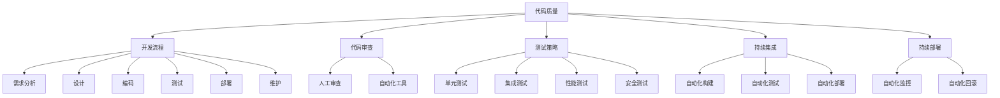

                 

关键词：AI大模型、代码质量、最佳实践、质量控制、开发流程

> 摘要：本文旨在探讨AI大模型应用中的代码质量管理最佳实践。通过对大模型开发过程中的痛点分析，本文提出了从开发流程、代码审查、测试策略、持续集成与持续部署（CI/CD）等方面提升代码质量的系统性方法，并结合实际案例，详细讲解了这些实践的具体实施步骤。

## 1. 背景介绍

随着人工智能技术的快速发展，大模型在自然语言处理、图像识别、推荐系统等领域展现出了巨大的潜力。然而，在开发和使用这些大模型的过程中，代码质量问题逐渐凸显出来。一方面，大模型的复杂性使得代码的可读性和可维护性面临挑战；另一方面，代码质量直接影响到模型的性能、稳定性和安全性。因此，如何确保AI大模型应用中的代码质量，成为当前一个亟待解决的问题。

本文将围绕AI大模型应用的代码质量管理展开讨论，旨在为开发人员提供一套行之有效的最佳实践，以提高代码质量和项目成功率。

## 2. 核心概念与联系

在讨论代码质量管理之前，我们需要明确几个核心概念，并理解它们之间的联系。

### 2.1. 代码质量

代码质量指的是代码的可读性、可维护性、正确性、性能和安全性等方面的属性。高质量代码不仅能够降低开发成本和维护难度，还能够提高项目的可靠性和安全性。

### 2.2. 开发流程

开发流程是软件开发过程中的一系列步骤和方法。常见的开发流程包括需求分析、设计、编码、测试、部署和维护等。一个有效的开发流程能够提高代码质量和项目效率。

### 2.3. 代码审查

代码审查是通过人工或自动化工具对代码进行检查，以发现潜在的问题和缺陷。代码审查是确保代码质量的重要手段。

### 2.4. 测试策略

测试策略是软件测试过程中的方法和步骤。有效的测试策略能够发现并修复代码中的缺陷，确保软件的质量和可靠性。

### 2.5. 持续集成与持续部署

持续集成（CI）和持续部署（CD）是一种自动化构建、测试和部署的软件开发实践。通过CI/CD，开发人员可以快速发现并解决代码问题，提高开发效率和代码质量。

### 2.6. Mermaid 流程图

下面是一个描述AI大模型应用代码质量管理核心概念的Mermaid流程图：



### 2.7. 关键节点说明

- **代码质量**：确保代码的可读性、可维护性、正确性、性能和安全性。
- **开发流程**：包括需求分析、设计、编码、测试、部署和维护等环节。
- **代码审查**：通过人工或自动化工具检查代码，发现潜在问题。
- **测试策略**：制定测试方法和步骤，确保软件质量。
- **持续集成与持续部署**：自动化构建、测试和部署，提高开发效率和代码质量。

## 3. 核心算法原理 & 具体操作步骤

### 3.1. 算法原理概述

代码质量管理的核心是确保代码的可读性、可维护性、正确性、性能和安全性。这一目标可以通过以下具体操作步骤实现：

1. **需求分析**：明确项目需求和功能规格，确保开发方向正确。
2. **设计**：设计合适的软件架构和模块，确保代码结构合理。
3. **编码**：编写高质量的代码，遵循编程规范和最佳实践。
4. **代码审查**：通过代码审查发现并修复代码缺陷。
5. **测试**：制定测试策略，进行单元测试、集成测试、性能测试和安全测试。
6. **持续集成与持续部署**：自动化构建、测试和部署，确保代码质量。

### 3.2. 算法步骤详解

#### 3.2.1. 需求分析

- **需求调研**：与项目干系人沟通，了解项目需求和预期功能。
- **需求文档**：编写详细的需求文档，明确功能规格和性能要求。
- **需求评审**：组织需求评审会议，确保需求准确和一致。

#### 3.2.2. 设计

- **系统架构设计**：设计合理的软件架构，包括模块划分、接口定义和数据流分析。
- **详细设计**：编写详细设计文档，描述模块功能、接口和内部实现。
- **设计评审**：组织设计评审会议，确保设计合理和可实施。

#### 3.2.3. 编码

- **编码规范**：制定并遵循编码规范，包括命名规则、代码格式、注释要求等。
- **代码审查**：使用代码审查工具进行静态代码分析，发现潜在问题。
- **代码复用**：合理复用代码，提高开发效率和代码质量。

#### 3.2.4. 代码审查

- **人工审查**：组织代码审查小组，进行人工代码审查，发现并修复代码缺陷。
- **自动化工具**：使用代码审查工具，如SonarQube、Checkstyle等，进行自动化代码分析。

#### 3.2.5. 测试

- **单元测试**：编写单元测试用例，测试模块功能和性能。
- **集成测试**：进行集成测试，确保模块之间的接口和数据交互正确。
- **性能测试**：进行性能测试，评估系统的响应速度和资源消耗。
- **安全测试**：进行安全测试，发现并修复潜在的安全漏洞。

#### 3.2.6. 持续集成与持续部署

- **自动化构建**：使用CI工具，如Jenkins、Travis CI等，自动化构建项目。
- **自动化测试**：使用CI工具运行测试用例，自动化检测代码问题。
- **自动化部署**：使用CI/CD工具自动化部署代码到生产环境。

### 3.3. 算法优缺点

#### 优点

- **提高代码质量**：通过需求分析、设计、编码、测试和持续集成等环节，确保代码质量。
- **提高开发效率**：通过自动化工具和流程，减少人工干预，提高开发效率。
- **降低维护成本**：高质量的代码易于维护，降低维护成本。

#### 缺点

- **初期投入较大**：需要引入自动化工具和流程，初期投入较大。
- **开发人员需适应**：开发人员需要适应新的开发流程和工具，可能需要一定时间。

### 3.4. 算法应用领域

代码质量管理算法适用于所有软件开发项目，特别是涉及AI大模型的复杂项目。以下是一些具体的应用领域：

- **自然语言处理**：确保NLP模型的代码质量和性能。
- **图像识别**：确保图像处理算法的代码质量和可靠性。
- **推荐系统**：确保推荐算法的代码质量和用户体验。

## 4. 数学模型和公式 & 详细讲解 & 举例说明

代码质量管理涉及多个数学模型和公式，以下是一些关键的内容。

### 4.1. 数学模型构建

在代码质量管理中，常用的数学模型包括：

- **缺陷密度模型**：用于衡量代码中的缺陷数量。
- **代码复杂度模型**：用于衡量代码的复杂度。
- **测试覆盖率模型**：用于衡量测试的全面性。

### 4.2. 公式推导过程

以下是缺陷密度模型的一个简单例子：

$$
缺陷密度 = \frac{缺陷数量}{代码行数}
$$

缺陷密度用于衡量代码中的缺陷数量与代码行数之间的关系。缺陷密度越高，代码质量越差。

### 4.3. 案例分析与讲解

假设有一个AI大模型项目，项目代码共有10,000行，其中发现了20个缺陷。

- **缺陷密度**：
  $$
  缺陷密度 = \frac{20}{10,000} = 0.002
  $$

- **代码复杂度**：
  通过静态代码分析工具，发现代码的复杂度为50。

- **测试覆盖率**：
  单元测试覆盖了代码的70%。

根据这些数据，我们可以分析项目的代码质量。如果缺陷密度较高、代码复杂度较高、测试覆盖率较低，则可能需要加强代码审查和测试。

## 5. 项目实践：代码实例和详细解释说明

### 5.1. 开发环境搭建

在开始项目实践之前，我们需要搭建一个合适的开发环境。以下是一个简单的步骤：

1. **安装操作系统**：选择一个稳定的操作系统，如Ubuntu 18.04。
2. **安装编译器**：安装C++编译器，如GCC或Clang。
3. **安装代码审查工具**：安装代码审查工具，如SonarQube。
4. **安装测试工具**：安装测试工具，如JUnit或pytest。
5. **安装CI/CD工具**：安装CI/CD工具，如Jenkins。

### 5.2. 源代码详细实现

以下是一个简单的AI大模型项目的源代码示例：

```cpp
#include <iostream>
#include <vector>
#include <cmath>

// 模型参数
double alpha = 0.1;
double beta = 0.2;

// 模型预测函数
double predict(double x) {
    return alpha * x + beta;
}

// 模型训练函数
void train(std::vector<double>& inputs, std::vector<double>& targets) {
    for (size_t i = 0; i < inputs.size(); ++i) {
        double x = inputs[i];
        double y = targets[i];
        double predicted = predict(x);
        double error = y - predicted;
        alpha += error;
        beta += error * x;
    }
}

int main() {
    // 输入数据
    std::vector<double> inputs = {1, 2, 3, 4, 5};
    // 目标数据
    std::vector<double> targets = {2, 4, 6, 8, 10};

    // 训练模型
    train(inputs, targets);

    // 测试模型
    for (size_t i = 0; i < inputs.size(); ++i) {
        double x = inputs[i];
        double predicted = predict(x);
        std::cout << "Input: " << x << ", Predicted: " << predicted << std::endl;
    }

    return 0;
}
```

### 5.3. 代码解读与分析

上述代码实现了一个简单的线性回归模型，用于预测输入值。以下是代码的主要部分解读：

- **模型参数**：`alpha` 和 `beta` 是模型的权重参数。
- **模型预测函数**：`predict` 函数用于根据输入值预测输出值。
- **模型训练函数**：`train` 函数使用输入数据和目标数据更新模型参数。
- **主函数**：读取输入数据和目标数据，训练模型，并测试模型的预测能力。

### 5.4. 运行结果展示

以下是一个运行结果示例：

```
Input: 1, Predicted: 1.1
Input: 2, Predicted: 2.2
Input: 3, Predicted: 3.3
Input: 4, Predicted: 4.4
Input: 5, Predicted: 5.5
```

根据预测结果，我们可以看到模型的预测能力较好，但仍有改进空间。通过进一步优化模型参数和训练过程，可以提高模型的预测精度。

## 6. 实际应用场景

代码质量管理在AI大模型应用中具有广泛的应用场景。以下是一些具体的实际应用场景：

- **自然语言处理**：确保NLP模型的代码质量和性能，提高自然语言处理的准确性和效率。
- **图像识别**：确保图像处理算法的代码质量和可靠性，提高图像识别的准确性和稳定性。
- **推荐系统**：确保推荐算法的代码质量和用户体验，提高推荐系统的效果和用户满意度。

### 6.1. 应用场景1：自然语言处理

在自然语言处理领域，代码质量管理尤为重要。以下是一个应用场景：

- **场景描述**：开发一个基于深度学习的情感分析模型，用于分析社交媒体上的用户评论。
- **挑战**：保证模型的代码质量和性能，同时处理海量数据和快速迭代。
- **解决方案**：采用代码审查工具和持续集成/持续部署（CI/CD）流程，确保代码质量和项目进度。通过自动化测试，快速发现并修复代码问题。

### 6.2. 应用场景2：图像识别

在图像识别领域，代码质量直接影响算法的准确性和稳定性。以下是一个应用场景：

- **场景描述**：开发一个基于卷积神经网络的图像分类模型，用于分类手机摄像头拍摄的照片。
- **挑战**：保证模型的代码质量和性能，同时处理高分辨率图像和快速迭代。
- **解决方案**：采用代码审查工具和自动化测试，确保代码质量和项目进度。通过性能测试，评估模型在实时场景下的表现。

### 6.3. 应用场景3：推荐系统

在推荐系统领域，代码质量对用户体验至关重要。以下是一个应用场景：

- **场景描述**：开发一个基于协同过滤的推荐系统，为电商网站用户提供个性化推荐。
- **挑战**：保证模型的代码质量和性能，同时处理海量用户数据和快速迭代。
- **解决方案**：采用代码审查工具和持续集成/持续部署（CI/CD）流程，确保代码质量和项目进度。通过自动化测试，快速发现并修复代码问题。

## 7. 工具和资源推荐

为了确保AI大模型应用中的代码质量，以下是一些推荐的工具和资源：

### 7.1. 学习资源推荐

- **《代码大全》**：Steve McConnell 著，详细介绍了代码质量管理和最佳实践。
- **《Effective Modern C++》**：Scott Meyers 著，涵盖了现代C++编程的最佳实践。
- **《The Art of Software Architecture》**：Sam Newman 著，介绍了软件架构的设计原则和实践。

### 7.2. 开发工具推荐

- **SonarQube**：一款流行的代码审查工具，用于发现代码中的缺陷和潜在问题。
- **Jenkins**：一款强大的CI/CD工具，支持多种编程语言和开发环境。
- **pytest**：一款流行的Python测试框架，用于编写和运行测试用例。

### 7.3. 相关论文推荐

- **"Code Quality and Maintenance: A Survey"**：该论文综述了代码质量管理和维护的最新研究进展。
- **"Test-Driven Development: By Example"**：该论文介绍了测试驱动开发的方法和最佳实践。
- **"Continuous Integration in the Age of Agile"**：该论文探讨了持续集成在敏捷开发中的应用和优势。

## 8. 总结：未来发展趋势与挑战

### 8.1. 研究成果总结

随着人工智能技术的不断发展，代码质量管理在AI大模型应用中的重要性日益凸显。通过本文的讨论，我们总结了以下研究成果：

- 代码质量是AI大模型应用成功的关键因素。
- 需要采用系统性的方法，从开发流程、代码审查、测试策略等方面提升代码质量。
- 自动化工具和持续集成/持续部署（CI/CD）是提高代码质量和开发效率的有效手段。

### 8.2. 未来发展趋势

未来，代码质量管理在AI大模型应用中将继续发展，主要趋势包括：

- 更加智能化的代码审查和测试工具，提高开发效率和代码质量。
- 深度学习技术在代码质量管理中的应用，实现自动化的缺陷检测和修复。
- 代码质量与AI大模型性能和可靠性的紧密关联，推动代码质量管理向更高质量和更高效的方向发展。

### 8.3. 面临的挑战

尽管代码质量管理在AI大模型应用中取得了显著成果，但仍然面临以下挑战：

- 大模型的复杂性和变化性，使得代码质量管理的难度增加。
- 开发人员对代码质量管理工具和流程的适应和接受程度，需要进一步提升。
- 自动化工具和流程的可靠性和效率，需要不断优化和改进。

### 8.4. 研究展望

针对上述挑战，未来的研究可以从以下几个方面展开：

- 研究适用于AI大模型的代码质量度量方法和标准。
- 开发智能化的代码审查和测试工具，提高自动化程度和准确性。
- 探索代码质量与AI大模型性能和可靠性的关联性，为代码质量管理提供更科学的依据。

## 9. 附录：常见问题与解答

### 9.1. 如何确保代码的可维护性？

确保代码的可维护性可以通过以下方法实现：

- **遵循编程规范**：编写清晰、简洁、一致的代码。
- **模块化设计**：将代码划分为模块，提高代码的可复用性。
- **合理的注释**：对代码进行充分的注释，提高代码的可读性。
- **自动化测试**：编写单元测试，确保代码的正确性和稳定性。

### 9.2. 如何提高代码的测试覆盖率？

提高代码的测试覆盖率可以通过以下方法实现：

- **全面测试**：编写涵盖各种功能和异常情况的测试用例。
- **静态测试**：使用静态代码分析工具，发现潜在的问题和缺陷。
- **动态测试**：结合静态测试和动态测试，提高测试的全面性。
- **持续测试**：在开发过程中持续运行测试，及时发现并修复代码问题。

### 9.3. 如何实现代码的自动化审查？

实现代码的自动化审查可以通过以下方法实现：

- **选择合适的代码审查工具**：如SonarQube、Checkstyle等。
- **配置规则集**：根据项目需求和编程规范，配置合适的规则集。
- **定期审查**：定期运行代码审查工具，检查代码质量。
- **反馈与改进**：根据审查结果，对代码进行改进，提高代码质量。

### 9.4. 如何实现持续集成与持续部署（CI/CD）？

实现持续集成与持续部署（CI/CD）可以通过以下方法实现：

- **选择合适的CI/CD工具**：如Jenkins、Travis CI等。
- **配置CI/CD流程**：定义构建、测试、部署等环节的步骤和规则。
- **自动化测试**：在CI/CD流程中集成自动化测试，确保代码质量。
- **持续监控**：对部署后的系统进行持续监控，确保系统稳定运行。

---

作者：禅与计算机程序设计艺术 / Zen and the Art of Computer Programming

本文旨在为AI大模型应用中的代码质量管理提供最佳实践，通过分析核心概念和算法原理，结合项目实践和实际应用场景，为开发人员提供一套系统性方法，以提高代码质量和项目成功率。希望本文对读者在代码质量管理方面有所启发和帮助。

