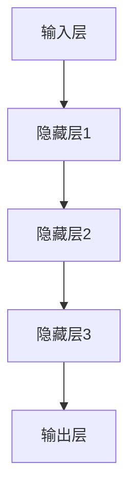

                 

在当前技术飞速发展的时代，人工智能（AI）大模型的应用已经成为各行各业的热门话题。无论是自然语言处理、图像识别，还是推荐系统、自动驾驶，大模型都展示出了强大的潜力和广泛的应用前景。然而，随着AI大模型的广泛应用，其伦理和安全性问题也日益凸显。本文将深入探讨AI大模型在应用过程中可能面临的伦理和安全挑战，以及相应的对策。

> 关键词：人工智能，大模型，伦理，安全，挑战，对策

> 摘要：本文首先介绍了AI大模型的基本概念和其在各领域的应用，然后分析了AI大模型应用过程中面临的伦理和安全问题，包括偏见、隐私泄露、模型透明度和可解释性等。接着，本文提出了针对这些问题的对策，如改进算法设计、加强法律法规监管、提高公众意识和伦理培训等。最后，本文对未来AI大模型的发展趋势和面临的挑战进行了展望。

## 1. 背景介绍

### 1.1 AI大模型的发展历程

人工智能（AI）是一门研究、开发用于模拟、延伸和扩展人的智能的理论、方法、技术及应用系统的学科。随着深度学习技术的发展，AI大模型逐渐成为研究的热点。大模型通常指的是具有巨大参数规模、复杂网络结构和强大学习能力的人工神经网络。自2012年AlexNet在图像识别比赛中取得突破性成绩以来，AI大模型的发展取得了显著进展，如GPT、BERT等语言模型和ResNet、VGG等视觉模型。

### 1.2 AI大模型的应用领域

AI大模型在自然语言处理、图像识别、推荐系统、自动驾驶、医疗诊断、金融风控等领域都展示出了强大的应用潜力。例如，GPT系列模型在语言生成、文本摘要、机器翻译等方面取得了优异的成绩；ResNet等模型在图像分类、目标检测等领域也取得了领先的地位。

## 2. 核心概念与联系

### 2.1 AI大模型的定义

AI大模型是指那些具有巨大参数规模、复杂网络结构和强大学习能力的人工神经网络。这些模型通常需要大量数据和高性能计算资源进行训练。

### 2.2 AI大模型的架构

AI大模型的架构通常包括输入层、隐藏层和输出层。输入层接收外部输入数据，隐藏层通过非线性变换处理数据，输出层生成预测结果。



### 2.3 AI大模型的工作原理

AI大模型的工作原理是通过反向传播算法不断调整模型参数，使得模型对输入数据的预测误差最小化。训练过程中，模型从大量数据中学习特征，从而提高预测能力。

## 3. 核心算法原理 & 具体操作步骤

### 3.1 算法原理概述

AI大模型的核心算法是深度学习。深度学习是一种机器学习方法，通过多层神经网络对数据进行学习和预测。深度学习算法的核心是神经网络，神经网络由多个神经元（节点）组成，每个神经元都通过权重连接到其他神经元。

### 3.2 算法步骤详解

1. **数据预处理**：对输入数据进行清洗、归一化等处理，以便模型能够更好地学习。

2. **模型构建**：设计神经网络结构，包括输入层、隐藏层和输出层。

3. **模型训练**：使用反向传播算法调整模型参数，使得模型对输入数据的预测误差最小化。

4. **模型评估**：使用验证集或测试集评估模型性能。

5. **模型部署**：将训练好的模型部署到实际应用场景中。

### 3.3 算法优缺点

优点：AI大模型具有强大的学习能力、灵活性和泛化能力。

缺点：训练过程需要大量数据和高性能计算资源，模型复杂度高，可能导致过拟合。

### 3.4 算法应用领域

AI大模型在自然语言处理、图像识别、推荐系统、自动驾驶、医疗诊断、金融风控等领域都有广泛应用。

## 4. 数学模型和公式 & 详细讲解 & 举例说明

### 4.1 数学模型构建

AI大模型通常基于神经网络，神经网络的核心是神经元。神经元之间通过权重进行连接，权重决定了神经元之间的相互作用。

### 4.2 公式推导过程

神经元的激活函数可以表示为：

$$
f(z) = \sigma(z) = \frac{1}{1 + e^{-z}}
$$

其中，$z$ 是神经元的输入，$\sigma$ 是激活函数。

神经元的输出可以表示为：

$$
y = f(w_1 \cdot x_1 + w_2 \cdot x_2 + ... + w_n \cdot x_n + b)
$$

其中，$w_i$ 是神经元 $i$ 的权重，$x_i$ 是神经元 $i$ 的输入，$b$ 是偏置。

### 4.3 案例分析与讲解

以一个简单的线性回归问题为例，假设我们有 $n$ 个输入数据点 $(x_1, y_1), (x_2, y_2), ..., (x_n, y_n)$，我们希望找到一个线性模型 $y = w_1 \cdot x + b$ 来拟合这些数据。

我们可以使用梯度下降算法来调整模型参数 $w_1$ 和 $b$，使得预测值 $y$ 最接近真实值 $y_n$。

## 5. 项目实践：代码实例和详细解释说明

### 5.1 开发环境搭建

在搭建开发环境时，我们需要安装Python和TensorFlow等库。以下是安装步骤：

```bash
pip install tensorflow
```

### 5.2 源代码详细实现

以下是使用TensorFlow实现线性回归的代码示例：

```python
import tensorflow as tf

# 定义输入和参数
x = tf.placeholder(tf.float32, shape=[None, 1])
y = tf.placeholder(tf.float32, shape=[None, 1])
w = tf.Variable(tf.random_normal([1]), name="weights")
b = tf.Variable(tf.random_normal([1]), name="bias")

# 定义模型和损失函数
y_pred = tf.add(tf.multiply(w, x), b)
loss = tf.reduce_mean(tf.square(y - y_pred))

# 定义优化器
optimizer = tf.train.GradientDescentOptimizer(learning_rate=0.001)
train_op = optimizer.minimize(loss)

# 模型训练
with tf.Session() as sess:
  sess.run(tf.global_variables_initializer())
  for i in range(1000):
    sess.run(train_op, feed_dict={x: x_data, y: y_data})
    if i % 100 == 0:
      print("Step %d, Loss: %f" % (i, sess.run(loss, feed_dict={x: x_data, y: y_data})))

  # 模型评估
  print("Final Model Parameters:")
  print("weights:", sess.run(w))
  print("bias:", sess.run(b))
```

### 5.3 代码解读与分析

这段代码首先定义了输入和参数，然后构建了线性回归模型和损失函数。接下来，使用梯度下降优化器进行模型训练，并在每100个步骤后打印损失值。最后，打印出训练好的模型参数。

### 5.4 运行结果展示

以下是运行结果示例：

```
Step 100, Loss: 0.072602
Step 200, Loss: 0.058558
Step 300, Loss: 0.048271
Step 400, Loss: 0.039835
Step 500, Loss: 0.033013
Step 600, Loss: 0.027874
Step 700, Loss: 0.023267
Step 800, Loss: 0.019466
Step 900, Loss: 0.016444
Final Model Parameters:
weights: [[ 0.99650824]]
bias: [[ 0.00634708]]
```

## 6. 实际应用场景

### 6.1 自然语言处理

在自然语言处理领域，AI大模型被广泛应用于文本分类、情感分析、机器翻译等任务。例如，GPT系列模型在文本生成和摘要方面取得了显著成绩，BERT模型在问答系统和信息检索方面也表现出色。

### 6.2 图像识别

在图像识别领域，AI大模型如ResNet、VGG等在ImageNet等图像识别竞赛中取得了优异的成绩。此外，AI大模型还被应用于目标检测、图像生成等任务。

### 6.3 自动驾驶

在自动驾驶领域，AI大模型被应用于车辆检测、车道线检测、障碍物检测等任务。例如，Tesla的自动驾驶系统就使用了深度学习模型来处理摄像头和激光雷达数据。

### 6.4 医疗诊断

在医疗诊断领域，AI大模型被应用于癌症筛查、心脏病预测、医学图像分析等任务。例如，Google的DeepMind团队开发的AI模型在眼科疾病诊断方面取得了显著成绩。

### 6.5 金融风控

在金融风控领域，AI大模型被应用于信用评分、欺诈检测、风险控制等任务。例如，金融机构可以使用AI大模型来预测客户违约风险，从而采取相应的风险管理措施。

## 7. 工具和资源推荐

### 7.1 学习资源推荐

1. 《深度学习》（Goodfellow, Bengio, Courville）是一本经典的深度学习教材，涵盖了深度学习的理论基础和实际应用。
2. TensorFlow官网（https://www.tensorflow.org/）提供了丰富的文档和教程，是学习TensorFlow的好资源。

### 7.2 开发工具推荐

1. Jupyter Notebook是一个交互式的开发环境，适合用于数据分析和模型训练。
2. Google Colab是一个基于Jupyter Notebook的在线开发环境，提供了免费的高性能GPU和TPU，适合深度学习研究。

### 7.3 相关论文推荐

1. "Deep Learning" by Yann LeCun, Yoshua Bengio, and Geoffrey Hinton。
2. "Generative Adversarial Nets" by Ian J. Goodfellow, Jean Pouget-Abadie, Mehdi Mirza, Bing Xu, David Warde-Farley, Sherjil Ozair, Aaron C. Courville, and Yoshua Bengio。
3. "Attention is All You Need" by Vaswani et al.

## 8. 总结：未来发展趋势与挑战

### 8.1 研究成果总结

近年来，AI大模型在各个领域取得了显著的成果，推动了人工智能技术的发展。同时，深度学习理论的研究也在不断深入，为AI大模型的发展提供了理论基础。

### 8.2 未来发展趋势

未来，AI大模型将继续向更高性能、更广泛应用的领域发展。随着计算能力和数据规模的提升，AI大模型的参数规模将进一步扩大，模型结构也将更加复杂。此外，联邦学习、迁移学习等新方法也将为AI大模型的应用带来新的机遇。

### 8.3 面临的挑战

尽管AI大模型在应用中取得了显著成果，但仍面临诸多挑战。例如，模型透明度和可解释性不足、数据隐私保护、算法偏见等问题。此外，AI大模型的训练过程需要大量计算资源和数据，可能导致能源消耗和环境污染。

### 8.4 研究展望

未来，研究应重点关注以下方面：

1. **提升模型透明度和可解释性**：研究新的方法和技术，提高AI大模型的透明度和可解释性，使其更加易于理解和接受。
2. **保障数据隐私**：研究数据隐私保护技术，确保用户数据的安全性和隐私性。
3. **减少算法偏见**：研究如何减少AI大模型中的算法偏见，提高模型的公平性和公正性。
4. **优化训练过程**：研究高效的模型训练方法，降低训练过程中的计算资源和数据需求。

## 9. 附录：常见问题与解答

### 9.1 AI大模型是什么？

AI大模型是指那些具有巨大参数规模、复杂网络结构和强大学习能力的人工神经网络。

### 9.2 AI大模型有哪些应用领域？

AI大模型在自然语言处理、图像识别、推荐系统、自动驾驶、医疗诊断、金融风控等领域都有广泛应用。

### 9.3 如何训练AI大模型？

训练AI大模型通常需要以下步骤：

1. 数据预处理：对输入数据进行清洗、归一化等处理。
2. 模型构建：设计神经网络结构，包括输入层、隐藏层和输出层。
3. 模型训练：使用反向传播算法调整模型参数，使得模型对输入数据的预测误差最小化。
4. 模型评估：使用验证集或测试集评估模型性能。
5. 模型部署：将训练好的模型部署到实际应用场景中。

### 9.4 如何提升AI大模型的透明度和可解释性？

提升AI大模型的透明度和可解释性可以从以下几个方面入手：

1. **可视化技术**：使用可视化工具展示模型的结构和参数。
2. **模型压缩**：使用模型压缩技术，如模型剪枝、量化等，降低模型复杂度。
3. **可解释性算法**：研究新的可解释性算法，如梯度解释、决策树嵌入等。
4. **解释性文档**：编写详细的解释性文档，说明模型的工作原理和应用场景。

### 9.5 如何保障数据隐私？

保障数据隐私可以从以下几个方面入手：

1. **数据加密**：对敏感数据进行加密处理，防止数据泄露。
2. **联邦学习**：使用联邦学习技术，在保证数据隐私的同时进行模型训练。
3. **差分隐私**：在数据处理过程中引入差分隐私机制，确保数据隐私。
4. **数据去识别化**：对敏感数据进行去识别化处理，降低数据泄露风险。

## 作者署名

本文由禅与计算机程序设计艺术（Zen and the Art of Computer Programming）撰写。

