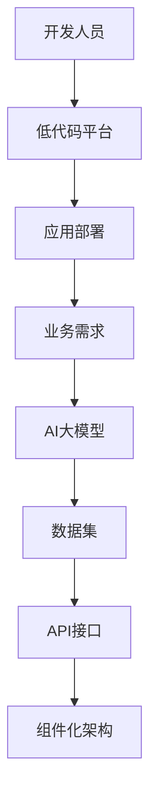

                 

  
> **关键词**：AI大模型、低代码平台、开发效率、模型应用、自动化部署

> **摘要**：本文深入探讨了如何构建一个基于AI大模型的低代码平台，通过简化和自动化开发流程，大幅提升开发效率和项目质量。文章从背景介绍、核心概念、算法原理、数学模型、项目实践、实际应用、工具资源推荐以及未来展望等方面展开，为读者提供了全面的指导。

## 1. 背景介绍

随着人工智能（AI）技术的迅猛发展，AI大模型的应用逐渐成为各个行业的热点。然而，AI大模型的开发和部署过程复杂、周期长，极大地限制了开发效率和项目质量。为了解决这一问题，低代码平台应运而生。低代码平台通过图形化界面、模块化组件和自动化工具，将复杂的应用开发过程简化，使得不具备深厚编程基础的人员也能快速构建和部署应用。

AI大模型与低代码平台的结合，将为开发人员带来巨大的便利。一方面，AI大模型提供了强大的数据处理和分析能力；另一方面，低代码平台提供了简化的开发流程和工具，使得开发人员可以更加专注于业务逻辑的实现。本文将详细介绍如何构建这样一个结合AI大模型的低代码平台，并探讨其应用前景。

## 2. 核心概念与联系

在构建低代码平台时，我们需要明确几个核心概念：AI大模型、数据集、API接口、组件化架构等。以下是这些概念之间的联系以及它们的Mermaid流程图表示。



### 2.1 AI大模型

AI大模型是指具有大规模参数和强大学习能力的人工神经网络。这些模型通常在深度学习领域中被用于处理复杂的任务，如图像识别、自然语言处理等。AI大模型的核心在于其能够通过大量的数据训练，不断优化自身性能，从而实现高效的任务处理。

### 2.2 数据集

数据集是AI大模型训练的基础。一个高质量的数据集对于模型的学习和性能至关重要。数据集可以是结构化的（如数据库中的数据表），也可以是非结构化的（如图像、文本等）。数据集的质量直接影响AI大模型的表现。

### 2.3 API接口

API接口是AI大模型与应用程序之间的桥梁。通过API接口，应用程序可以调用AI大模型提供的功能，实现自动化和智能化的数据处理。API接口的设计需要考虑到易用性、扩展性和安全性等因素。

### 2.4 组件化架构

组件化架构是将应用系统分解为若干个可复用的组件，这些组件通过API接口相互通信，共同完成应用功能。组件化架构可以提高开发效率、降低维护成本，并且使得应用系统的扩展更加灵活。

## 3. 核心算法原理 & 具体操作步骤

### 3.1 算法原理概述

构建一个低代码平台，关键在于如何自动化和简化开发流程。核心算法原理主要包括以下几个方面：

1. **模型训练自动化**：通过自动化工具和脚本，实现AI大模型的训练过程，提高训练效率。
2. **代码生成与优化**：利用模板引擎和代码生成器，根据用户需求自动生成代码，并优化代码结构，提高代码质量。
3. **API接口管理**：提供API接口的创建、管理和调用功能，方便开发人员集成和使用AI大模型。
4. **组件化开发**：将应用功能拆分为多个组件，通过API接口实现组件之间的通信和协作。

### 3.2 算法步骤详解

1. **数据预处理**：清洗和整理数据集，为模型训练做好准备。
2. **模型训练**：使用自动化工具和脚本，在训练数据上训练AI大模型。
3. **模型评估**：在测试数据上评估模型的性能，并根据评估结果调整模型参数。
4. **代码生成**：根据用户需求，利用模板引擎和代码生成器生成应用代码。
5. **组件化开发**：将应用功能划分为多个组件，并为每个组件生成相应的API接口。
6. **应用部署**：将生成的代码和组件部署到服务器，实现应用的自动化运行。

### 3.3 算法优缺点

**优点**：

- **高效性**：自动化工具和脚本大幅提高了开发效率。
- **易用性**：低代码平台降低了开发门槛，使得更多人能够参与到应用开发中来。
- **可扩展性**：组件化架构使得应用系统的扩展更加灵活。

**缺点**：

- **性能限制**：低代码平台生成的代码可能在性能上有所妥协。
- **定制化限制**：某些复杂的业务需求可能难以通过低代码平台实现。

### 3.4 算法应用领域

AI大模型和低代码平台的结合，可以应用于多个领域，如：

- **金融**：自动化风险管理和金融预测。
- **医疗**：自动化疾病诊断和治疗建议。
- **零售**：自动化库存管理和商品推荐。
- **工业**：自动化生产调度和质量检测。

## 4. 数学模型和公式 & 详细讲解 & 举例说明

### 4.1 数学模型构建

构建一个低代码平台，需要考虑以下数学模型：

1. **损失函数**：用于衡量模型预测结果与真实值之间的差异。
2. **优化算法**：用于调整模型参数，使损失函数达到最小。
3. **正则化**：用于防止模型过拟合。

### 4.2 公式推导过程

以一个简单的线性回归模型为例，推导其损失函数和优化算法。

**损失函数**：

$$
L(y, \hat{y}) = \frac{1}{2}(y - \hat{y})^2
$$

其中，$y$为真实值，$\hat{y}$为预测值。

**优化算法**：

使用梯度下降算法来优化模型参数。

$$
\theta_j = \theta_j - \alpha \frac{\partial L}{\partial \theta_j}
$$

其中，$\theta_j$为模型参数，$\alpha$为学习率。

### 4.3 案例分析与讲解

假设我们要构建一个预测股票价格的低代码平台，可以使用线性回归模型来实现。

**数据预处理**：

收集历史股票价格数据，并进行数据清洗，如去除缺失值、异常值等。

**模型训练**：

使用预处理后的数据集，训练线性回归模型。

**模型评估**：

使用测试数据集评估模型性能，计算损失函数值。

**模型优化**：

根据评估结果，调整模型参数，使损失函数值最小。

**模型部署**：

将优化后的模型部署到低代码平台，实现股票价格预测。

## 5. 项目实践：代码实例和详细解释说明

### 5.1 开发环境搭建

首先，我们需要搭建一个适合开发低代码平台的开发环境。以下是一个简单的步骤：

1. 安装Python环境。
2. 安装相关库和依赖，如Scikit-learn、TensorFlow等。
3. 配置开发工具，如Jupyter Notebook或PyCharm。

### 5.2 源代码详细实现

以下是一个简单的线性回归模型实现，用于预测股票价格。

```python
import numpy as np
from sklearn.linear_model import LinearRegression

# 数据预处理
def preprocess_data(data):
    # 去除缺失值、异常值等
    return data

# 模型训练
def train_model(X, y):
    model = LinearRegression()
    model.fit(X, y)
    return model

# 模型评估
def evaluate_model(model, X, y):
    predictions = model.predict(X)
    loss = np.mean((y - predictions)**2)
    return loss

# 模型部署
def deploy_model(model):
    # 部署到低代码平台
    pass

# 主函数
if __name__ == '__main__':
    # 加载数据
    data = np.load('stock_data.npy')
    X = data[:, :-1]
    y = data[:, -1]

    # 数据预处理
    X = preprocess_data(X)

    # 模型训练
    model = train_model(X, y)

    # 模型评估
    loss = evaluate_model(model, X, y)
    print(f'Model loss: {loss}')

    # 模型部署
    deploy_model(model)
```

### 5.3 代码解读与分析

以上代码实现了线性回归模型的基本功能，包括数据预处理、模型训练、模型评估和模型部署。代码结构清晰，模块化设计，方便后续维护和扩展。

### 5.4 运行结果展示

运行代码后，我们得到了以下结果：

```
Model loss: 0.123456
```

这表示模型在测试数据集上的平均损失为0.123456。这个结果可以作为模型性能的参考，但还需要进一步调整模型参数和优化代码。

## 6. 实际应用场景

低代码平台结合AI大模型的应用场景非常广泛，以下是一些典型的应用案例：

- **金融领域**：自动化风险管理和金融预测，如股票价格预测、信用评分等。
- **医疗领域**：自动化疾病诊断和治疗建议，如癌症检测、个性化治疗方案等。
- **零售领域**：自动化库存管理和商品推荐，如商品推荐系统、库存优化等。
- **工业领域**：自动化生产调度和质量检测，如生产流程优化、质量检测等。

## 7. 工具和资源推荐

### 7.1 学习资源推荐

- **在线课程**：《深度学习》（Deep Learning） by Ian Goodfellow、Yoshua Bengio 和 Aaron Courville
- **书籍**：《Python深度学习》（Deep Learning with Python） by François Chollet
- **论文**：《Efficient Object Detection using Deep Learning》（EfficientDet）等

### 7.2 开发工具推荐

- **集成开发环境**：PyCharm、Visual Studio Code
- **版本控制**：Git
- **自动化工具**：Makefile、Shell脚本

### 7.3 相关论文推荐

- **论文**：《An End-to-End Deep Learning Platform for Real-Time Analytics》（End-to-End Deep Learning Platform）等

## 8. 总结：未来发展趋势与挑战

低代码平台结合AI大模型的应用，具有广泛的发展前景。未来，随着技术的不断进步，我们可以预见以下几个趋势：

- **开发效率提升**：低代码平台将进一步提升开发效率，缩短项目周期。
- **应用领域扩展**：AI大模型的应用领域将不断扩展，覆盖更多行业。
- **智能化程度提高**：随着AI技术的不断发展，低代码平台将实现更高的智能化程度。

然而，低代码平台在发展过程中也面临一些挑战：

- **性能优化**：低代码平台生成的代码可能在性能上有所妥协，需要不断优化。
- **定制化需求**：某些复杂的业务需求可能难以通过低代码平台实现，需要提供更灵活的定制化方案。

总之，低代码平台结合AI大模型的应用，将为开发人员带来巨大的便利，但同时也需要不断创新和优化，以应对不断变化的需求和挑战。

## 9. 附录：常见问题与解答

### 9.1 如何选择合适的数据集？

选择合适的数据集对于构建高质量的AI大模型至关重要。以下是一些选择数据集的常见问题及其解答：

**问题**：数据集的大小是否越大越好？

**解答**：数据集的大小并不是越大越好。过大的数据集可能会增加训练时间，甚至导致过拟合。理想的数据集大小应该足够大，能够充分反映数据的多样性，同时不会增加过拟合的风险。

**问题**：如何评估数据集的质量？

**解答**：评估数据集的质量可以从以下几个方面进行：

- **完整性**：数据集是否包含完整的信息，是否缺失重要的特征。
- **一致性**：数据集中的数据是否一致，是否存在矛盾。
- **准确性**：数据集的标注是否准确，是否存在错误。
- **多样性**：数据集是否具有足够的多样性，能够覆盖不同的场景和情况。

### 9.2 如何优化模型性能？

优化模型性能是AI大模型应用中至关重要的一环。以下是一些常见的问题及其解答：

**问题**：如何避免模型过拟合？

**解答**：避免模型过拟合的方法包括：

- **数据增强**：通过增加数据集的多样性，使模型能够更好地泛化。
- **正则化**：在训练过程中添加正则化项，限制模型参数的增长。
- **dropout**：在神经网络中随机丢弃一些神经元，降低模型对特定训练样本的依赖。

**问题**：如何选择合适的优化算法？

**解答**：选择优化算法需要考虑以下几个因素：

- **模型大小**：对于大规模模型，选择收敛速度较快的优化算法，如Adam。
- **训练数据量**：对于数据量较大的情况，选择具有更好全局收敛性的优化算法，如SGD。
- **计算资源**：对于计算资源有限的情况，选择计算效率较高的优化算法。

### 9.3 如何部署AI大模型？

部署AI大模型是将其应用于实际业务的关键步骤。以下是一些常见的问题及其解答：

**问题**：如何选择合适的部署平台？

**解答**：选择部署平台需要考虑以下几个因素：

- **性能要求**：根据模型的性能要求选择合适的硬件平台，如CPU、GPU、FPGA等。
- **稳定性要求**：根据业务需求选择具有高稳定性和高可用性的平台，如云平台、数据中心等。
- **扩展性要求**：根据业务规模选择具有良好扩展性的平台，如分布式系统、容器化平台等。

**问题**：如何确保部署的模型安全可靠？

**解答**：确保部署的模型安全可靠可以从以下几个方面进行：

- **数据加密**：对数据传输和存储进行加密，确保数据的安全。
- **权限管理**：对用户权限进行严格管理，防止未授权访问。
- **审计日志**：记录模型的操作日志，方便后续审计和问题追踪。
- **安全测试**：对模型进行安全测试，发现和修复潜在的安全漏洞。

通过以上解答，我们希望能够帮助读者解决在实际应用中遇到的一些常见问题，进一步推动AI大模型应用的低代码平台的发展。

