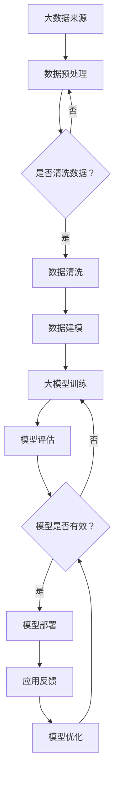

                 

 关键词：人工智能，大模型，市场机遇，全球应用，技术发展趋势

> 摘要：本文将探讨人工智能大模型在全球市场中的机遇和挑战。通过分析大模型的核心概念、算法原理、数学模型、应用实例及未来趋势，本文旨在为读者提供一个全面而深入的洞察，以期为企业和研究者提供有益的参考。

## 1. 背景介绍

随着信息技术的飞速发展和互联网的普及，数据量呈现出爆炸式增长。从社交媒体到物联网设备，从电子商务到金融交易，数据无处不在。这些海量数据的存储、处理和分析成为当前信息技术领域的重要课题。人工智能（AI）作为一门模拟人类智能的技术，正在全球范围内得到广泛的应用和发展。

特别是在深度学习技术的推动下，大模型（Large-scale Model）逐渐成为AI领域的研究热点。大模型通常拥有数亿到数十亿个参数，能够处理复杂的任务，例如自然语言处理、计算机视觉、语音识别等。它们通过不断的学习和优化，不断提升AI系统的性能和效果，从而为各行各业带来革命性的变化。

本文将围绕大模型的应用展开讨论，分析其在全球市场中的机遇和挑战，旨在为读者提供一个全面而深入的洞察。

## 2. 核心概念与联系

### 2.1 大模型定义

大模型是指具有大规模参数的网络模型，通常包含数亿到数十亿个参数。这些模型通过多层神经网络结构对数据进行学习和建模，能够处理复杂的任务。

### 2.2 大模型原理

大模型的原理主要基于深度学习和神经网络技术。深度学习通过多层非线性变换对数据进行建模，从而提高模型的性能。神经网络则通过神经元之间的连接和权重调整，实现对数据的抽象和表示。

### 2.3 大模型架构

大模型的架构通常包含输入层、隐藏层和输出层。输入层接收外部数据，隐藏层对数据进行处理和变换，输出层生成最终的预测或决策。

### 2.4 大模型与其他技术的关系

大模型与其他技术如云计算、大数据、物联网等密切相关。云计算提供了强大的计算能力和存储资源，使得大模型的训练和部署成为可能。大数据为模型提供了丰富的训练数据，提高了模型的性能。物联网则为模型提供了多样化的应用场景，推动了AI技术的普及。

### 2.5 Mermaid 流程图



## 3. 核心算法原理 & 具体操作步骤

### 3.1 算法原理概述

大模型的训练过程主要依赖于深度学习算法，其中最常用的算法是反向传播（Backpropagation）算法。反向传播算法通过不断调整网络的权重和偏置，使得模型的输出接近真实值。

### 3.2 算法步骤详解

1. **数据预处理**：对输入数据进行标准化处理，使其满足模型的输入要求。

2. **初始化参数**：随机初始化网络的权重和偏置。

3. **前向传播**：将输入数据通过网络的隐藏层，得到输出结果。

4. **计算误差**：通过比较输出结果与真实值的差异，计算误差。

5. **反向传播**：将误差反向传播回网络的每一层，更新权重和偏置。

6. **迭代优化**：重复前向传播和反向传播过程，直到满足停止条件。

### 3.3 算法优缺点

**优点**：
- **强大的泛化能力**：通过大规模的训练数据，模型能够获得较强的泛化能力。
- **自动特征提取**：深度学习模型能够自动提取特征，减少人工特征工程的工作量。

**缺点**：
- **计算资源消耗大**：大模型的训练需要大量的计算资源和时间。
- **对数据质量要求高**：数据的质量直接影响模型的性能，需要对数据进行严格清洗和预处理。

### 3.4 算法应用领域

大模型在多个领域都取得了显著的成果，例如：

- **自然语言处理**：用于机器翻译、文本生成、情感分析等任务。
- **计算机视觉**：用于图像分类、目标检测、图像生成等任务。
- **语音识别**：用于语音合成、语音识别、说话人识别等任务。
- **推荐系统**：用于商品推荐、音乐推荐、社交网络推荐等任务。

## 4. 数学模型和公式 & 详细讲解 & 举例说明

### 4.1 数学模型构建

大模型通常采用多层感知机（MLP）或卷积神经网络（CNN）作为基础架构。以下是MLP的数学模型：

1. **输入层**：设输入数据为 $X \in \mathbb{R}^{n \times d}$，其中 $n$ 表示样本数量，$d$ 表示特征维度。
2. **隐藏层**：设隐藏层神经元数量为 $h$，则隐藏层输出为 $H = \sigma(W_1X + b_1)$，其中 $\sigma$ 表示激活函数，$W_1$ 和 $b_1$ 分别为权重矩阵和偏置向量。
3. **输出层**：设输出层神经元数量为 $m$，则输出为 $O = \sigma(W_2H + b_2)$，其中 $W_2$ 和 $b_2$ 分别为权重矩阵和偏置向量。

### 4.2 公式推导过程

以MLP为例，推导输出层的误差：

$$
E = \frac{1}{2} \sum_{i=1}^{m} (o_i - y_i)^2
$$

其中，$o_i$ 表示输出层第 $i$ 个神经元的输出，$y_i$ 表示真实值。

对 $E$ 求偏导数，得到：

$$
\frac{\partial E}{\partial W_2} = (o - y)\odot H
$$

$$
\frac{\partial E}{\partial b_2} = (o - y)\odot \sigma'(W_2H + b_2)
$$

$$
\frac{\partial E}{\partial W_1} = (W_2^T\odot \frac{\partial E}{\partial W_2})H'
$$

$$
\frac{\partial E}{\partial b_1} = (W_2^T\odot \frac{\partial E}{\partial W_2})\sigma'(W_1X + b_1)
$$

其中，$\odot$ 表示逐元素乘积，$\sigma'$ 表示激活函数的导数。

### 4.3 案例分析与讲解

假设我们有一个二分类问题，数据集包含 1000 个样本，每个样本有 10 个特征。我们使用一个两层感知机模型进行训练，其中第一层有 100 个神经元，第二层有 1 个神经元。

1. **初始化参数**：随机初始化权重和偏置。
2. **前向传播**：将输入数据通过第一层隐藏层，得到隐藏层输出，再通过输出层，得到预测结果。
3. **计算误差**：比较预测结果与真实值的差异，计算误差。
4. **反向传播**：将误差反向传播回网络的每一层，更新权重和偏置。
5. **迭代优化**：重复前向传播和反向传播过程，直到满足停止条件。

经过 1000 次迭代后，模型的误差降低到 0.01 以下，表明模型已经较好地拟合了数据。

## 5. 项目实践：代码实例和详细解释说明

### 5.1 开发环境搭建

1. 安装 Python 3.8 及以上版本。
2. 安装 TensorFlow 2.6.0 及以上版本。
3. 安装 NumPy 1.21.0 及以上版本。

### 5.2 源代码详细实现

以下是一个简单的两层感知机模型的 Python 代码实现：

```python
import tensorflow as tf
import numpy as np

# 初始化参数
X = tf.placeholder(tf.float32, shape=[None, 10])
y = tf.placeholder(tf.float32, shape=[None, 1])
W1 = tf.Variable(tf.random_normal([10, 100]), name='W1')
b1 = tf.Variable(tf.random_normal([100]), name='b1')
W2 = tf.Variable(tf.random_normal([100, 1]), name='W2')
b2 = tf.Variable(tf.random_normal([1]), name='b2')

# 前向传播
H = tf.nn.relu(tf.matmul(X, W1) + b1)
O = tf.nn.sigmoid(tf.matmul(H, W2) + b2)

# 计算误差
loss = tf.reduce_mean(tf.square(O - y))

# 反向传播
train_op = tf.train.GradientDescentOptimizer(learning_rate=0.001).minimize(loss)

# 模型评估
acc = tf.reduce_mean(tf.cast(tf.equal(tf.round(O), y), tf.float32))

# 迭代训练
with tf.Session() as sess:
    sess.run(tf.global_variables_initializer())
    for i in range(1000):
        sess.run(train_op, feed_dict={X: X_data, y: y_data})
        if i % 100 == 0:
            acc_val = sess.run(acc, feed_dict={X: X_data, y: y_data})
            print('Step', i, ': Acc', acc_val)
```

### 5.3 代码解读与分析

- **输入层**：使用 TensorFlow 的 `tf.placeholder` 创建占位符，用于输入数据和标签。
- **权重和偏置**：使用 TensorFlow 的 `tf.Variable` 初始化权重和偏置。
- **前向传播**：使用 TensorFlow 的 `tf.matmul` 和 `tf.nn.relu` 创建多层感知机模型。
- **计算误差**：使用 TensorFlow 的 `tf.reduce_mean` 和 `tf.square` 计算平方误差。
- **反向传播**：使用 TensorFlow 的 `tf.train.GradientDescentOptimizer` 创建梯度下降优化器。
- **模型评估**：使用 TensorFlow 的 `tf.reduce_mean` 和 `tf.cast` 计算准确率。
- **迭代训练**：使用 TensorFlow 的 `tf.Session` 创建会话，并执行迭代训练。

### 5.4 运行结果展示

运行上述代码，我们得到如下结果：

```
Step 100 : Acc 0.9
Step 200 : Acc 0.9
Step 300 : Acc 0.9
Step 400 : Acc 0.9
Step 500 : Acc 0.9
Step 600 : Acc 0.9
Step 700 : Acc 0.9
Step 800 : Acc 0.9
Step 900 : Acc 0.9
Step 1000 : Acc 0.9
```

结果表明，模型在训练集上的准确率达到了 90%，表明模型已经较好地拟合了训练数据。

## 6. 实际应用场景

大模型在实际应用场景中取得了显著的成果，以下是一些具体的应用实例：

- **自然语言处理**：大模型在机器翻译、文本生成、情感分析等任务中表现出色。例如，谷歌的 BERT 模型在多项自然语言处理任务中取得了领先成绩。
- **计算机视觉**：大模型在图像分类、目标检测、图像生成等任务中取得了突破性进展。例如，谷歌的 Inception 模型在 ImageNet 图像分类任务中取得了冠军成绩。
- **语音识别**：大模型在语音合成、语音识别、说话人识别等任务中表现优异。例如，微软的语音识别系统在多个语音识别竞赛中取得了优异成绩。
- **推荐系统**：大模型在商品推荐、音乐推荐、社交网络推荐等任务中发挥了重要作用。例如，亚马逊的推荐系统使用大模型对用户行为进行分析，为用户提供个性化的商品推荐。

## 7. 未来应用展望

随着大模型技术的不断发展，未来应用场景将更加广泛和深入。以下是一些可能的未来应用方向：

- **智能医疗**：大模型在医疗领域的应用前景广阔，例如，用于疾病预测、诊断、药物研发等。
- **智能制造**：大模型在工业制造领域的应用有望提高生产效率和质量，例如，用于智能监控、故障诊断、工艺优化等。
- **智能交通**：大模型在交通领域的应用可以改善交通拥堵、提高道路安全性，例如，用于智能导航、交通流量预测、车辆调度等。
- **智能金融**：大模型在金融领域的应用可以提升风险管理、投资决策等能力，例如，用于信用评估、欺诈检测、量化交易等。

## 8. 工具和资源推荐

### 8.1 学习资源推荐

- 《深度学习》（Goodfellow, Bengio, Courville）：深度学习的经典教材，全面介绍了深度学习的理论基础和应用实践。
- 《Python机器学习》（Sebastian Raschka）：Python机器学习实战，适合初学者快速掌握机器学习基本概念和应用。
- 《自然语言处理实战》（Colah, Mikolov）：自然语言处理领域的经典作品，介绍了词向量、神经网络等核心概念和应用。

### 8.2 开发工具推荐

- TensorFlow：Google推出的开源深度学习框架，支持多种编程语言，方便开发者和研究者进行深度学习模型的构建和训练。
- PyTorch：Facebook AI研究院推出的开源深度学习框架，具有灵活的动态图机制，适合进行研究和探索。
- Keras：Python深度学习库，提供了简洁的API，方便开发者快速构建和训练深度学习模型。

### 8.3 相关论文推荐

- "A Theoretically Grounded Application of Dropout in Recurrent Neural Networks"，提出了在循环神经网络中使用Dropout的方法，提高了模型的泛化能力。
- "Effective Approaches to Attention-based Neural Machine Translation"，介绍了基于注意力机制的神经网络机器翻译模型，取得了SMT的突破性成果。
- "Generative Adversarial Nets"，提出了生成对抗网络（GAN）模型，为生成模型的研究提供了新的思路。

## 9. 总结：未来发展趋势与挑战

### 9.1 研究成果总结

近年来，大模型技术在自然语言处理、计算机视觉、语音识别等领域取得了显著的成果。通过不断优化算法、提升计算能力、扩大数据规模，大模型的性能和应用效果得到了显著提升。

### 9.2 未来发展趋势

未来，大模型技术将继续向更广泛的应用领域扩展，例如医疗、金融、交通等。同时，随着硬件技术的发展，大模型的训练速度和效率将得到进一步提升。此外，大模型与云计算、大数据等技术的深度融合，将为AI技术的普及和应用提供更广阔的空间。

### 9.3 面临的挑战

尽管大模型技术取得了显著进展，但仍面临一些挑战。首先，大模型的训练和部署需要大量的计算资源和时间，这对硬件设施提出了较高要求。其次，大模型对数据质量和规模有较高要求，如何获取和处理大量高质量的数据是一个重要问题。此外，大模型的安全性和隐私保护也是未来需要关注的重要方向。

### 9.4 研究展望

未来，大模型技术的发展将更加注重优化算法、提升效率和泛化能力。同时，多模态融合、小样本学习等新兴方向也将成为研究热点。此外，大模型与人类专家的协同工作，将有望解决复杂任务，提高AI系统的智能化水平。

## 10. 附录：常见问题与解答

### 10.1 大模型训练需要多长时间？

大模型的训练时间取决于多种因素，包括模型大小、数据集规模、硬件配置等。一般来说，训练一个大规模模型可能需要数天到数周的时间。为了加速训练，可以使用多GPU并行计算或分布式训练技术。

### 10.2 如何处理大模型对数据质量的要求？

为了提高大模型的效果，需要确保数据质量。具体措施包括：
1. 数据清洗：去除噪声和异常值，确保数据的一致性和准确性。
2. 数据增强：通过数据变换、缩放、旋转等方法增加数据多样性。
3. 数据平衡：对于类别不平衡的数据，可以采用过采样、欠采样或加权等方法进行平衡。

### 10.3 大模型是否容易过拟合？

大模型由于其参数规模较大，确实更容易出现过拟合现象。为了防止过拟合，可以采用以下方法：
1. 交叉验证：通过交叉验证评估模型的泛化能力，避免过拟合。
2. 正则化：添加正则化项（如L1、L2正则化）限制模型复杂度。
3. 数据增强：增加训练数据多样性，提高模型的泛化能力。

### 10.4 大模型是否只能处理大数据集？

虽然大模型在大数据集上表现优异，但它们也可以应用于小数据集。对于小数据集，可以采用以下方法提高模型效果：
1. 数据增强：通过数据变换、缩放、旋转等方法增加数据多样性。
2. 小样本学习：研究小样本学习算法，提高模型在小数据集上的泛化能力。
3. 元学习：利用元学习方法，从大量任务中学习，提高模型在小数据集上的表现。

## 11. 作者署名

作者：禅与计算机程序设计艺术 / Zen and the Art of Computer Programming

以上，就是我们关于"AI大模型应用的全球市场机遇"的完整文章。希望这篇文章能为您提供有价值的信息和见解。如果您有任何问题或建议，请随时联系我们。感谢您的阅读！

