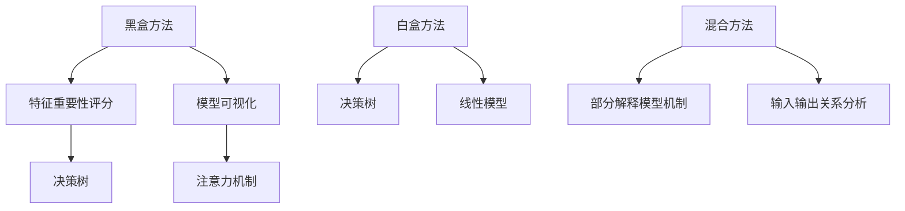

                 

### 1. 背景介绍

人工智能（AI）技术在近年来取得了惊人的进展，特别是大模型（Large Models）的应用在自然语言处理（NLP）、计算机视觉（CV）、推荐系统等领域展现了强大的性能。然而，随着模型的规模和复杂度的增加，其黑箱特性也日益突出，导致应用场景中对于模型可解释性的需求愈加迫切。可解释性（Explainability）指的是模型决策过程中的透明度和可理解性，它能够帮助用户、研究人员和开发者更好地理解和信任AI模型，特别是在涉及人身安全、隐私保护、医疗决策等重要领域。

目前，AI大模型的可解释性面临以下挑战：

1. **数据隐私问题**：大模型通常需要训练大量的数据，而这些数据可能包含敏感的个人信息。如何在不泄露隐私的前提下提高模型的解释性，成为了一个关键问题。
2. **模型复杂性**：随着模型的规模增加，其内部结构和决策过程变得更加复杂，使得解释变得更加困难。
3. **计算成本**：传统的解释方法通常需要额外的计算资源，对于大模型来说，这可能是不可接受的。
4. **方法适应性**：现有的可解释性方法往往针对特定类型的模型或任务，缺乏广泛的适应性和通用性。

针对上述挑战，本文将探讨几种AI大模型可解释性改进方法，以期为提升模型的可解释性提供新的思路和工具。

### 2. 核心概念与联系

#### 2.1 可解释性的定义与重要性

可解释性是指AI模型在做出决策或预测时，其内部机制和决策过程能够被用户或开发者理解的程度。在AI大模型中，可解释性的重要性体现在多个方面：

- **信任与透明度**：提高模型的解释性可以增强用户对AI系统的信任，特别是在涉及重要决策的场景中，如医疗诊断、金融风险评估等。
- **错误诊断与调试**：通过解释性分析，开发者和研究人员可以更有效地诊断和调试模型，提高模型的可靠性。
- **合规性要求**：在一些领域，如金融和医疗，法律法规要求模型必须具备一定的可解释性，以保障用户权益和数据安全。
- **改进模型性能**：理解模型决策过程有助于发现并消除潜在的偏见和错误，从而提升模型的整体性能。

#### 2.2 大模型的结构与特性

大模型通常具备以下几个特性：

- **大规模参数**：大模型包含数百万至数十亿个参数，这使得模型具有强大的学习能力和表现力，但同时也增加了解释的难度。
- **深度网络结构**：大模型通常采用深度神经网络（DNN）或其他复杂网络结构，这些结构使得模型的决策过程高度非线性和复杂。
- **数据依赖性**：大模型的训练依赖于大量的数据，这些数据的质量和代表性直接影响模型的性能和解释性。
- **黑箱特性**：由于模型参数和结构的复杂性，大模型的内部机制往往难以理解和解释。

#### 2.3 可解释性方法分类

根据解释性的深度和方式，可以将可解释性方法分为以下几类：

1. **黑盒方法**：这类方法不需要了解模型内部结构，通过分析输入和输出关系来解释模型行为。常见的黑盒方法包括特征重要性评分、模型可视化等。
2. **白盒方法**：这类方法需要深入理解模型的内部结构和参数，通过直接分析模型来实现解释。白盒方法通常应用于特定的模型结构，如决策树、线性模型等。
3. **混合方法**：结合黑盒和白盒方法，通过部分解释模型内部机制，同时提供对输入输出的关系分析。

#### 2.4 Mermaid 流程图

以下是一个简化的Mermaid流程图，展示了大模型可解释性方法的分类和联系：



### 3. 核心算法原理 & 具体操作步骤

#### 3.1 算法原理概述

本文将介绍几种针对AI大模型可解释性的改进方法，主要包括：

1. **模型分解方法**：通过将大模型分解为多个较小的子模型，每个子模型具有特定的功能，从而提高解释性。
2. **注意力机制解释方法**：利用注意力机制来解释模型在处理输入数据时的关注重点。
3. **局部解释方法**：通过分析模型在特定输入数据下的行为，提供局部解释。
4. **可视化和交互式解释方法**：利用可视化技术，将模型的决策过程以直观的方式呈现给用户。

#### 3.2 算法步骤详解

##### 3.2.1 模型分解方法

1. **输入预处理**：对输入数据进行标准化或降维处理，以适应子模型的要求。
2. **模型划分**：将大模型划分为多个子模型，每个子模型负责处理输入数据的特定部分。
3. **子模型训练**：分别对每个子模型进行训练，优化其参数。
4. **子模型解释**：对每个子模型进行解释，如使用特征重要性评分或可视化技术。
5. **综合解释**：将子模型的解释结果综合起来，形成对整个大模型的解释。

##### 3.2.2 注意力机制解释方法

1. **提取注意力权重**：通过模型输出的注意力权重，确定模型对输入数据的关注程度。
2. **注意力分布可视化**：将注意力权重分布可视化为热图或密度图，展示模型在处理输入数据时的关注区域。
3. **注意力解释**：结合注意力权重和模型输出，解释模型在特定任务或场景下的决策过程。

##### 3.2.3 局部解释方法

1. **局部感知区域提取**：利用模型对输入数据的感知机制，提取局部感知区域。
2. **局部特征分析**：分析局部感知区域内的特征，确定模型在特定输入数据下的决策依据。
3. **局部解释生成**：根据局部特征分析结果，生成对局部输入数据的解释。

##### 3.2.4 可视化和交互式解释方法

1. **模型结构可视化**：通过可视化技术，展示模型的层次结构、网络连接和参数分布。
2. **交互式探索**：提供交互式界面，允许用户对模型进行探索和询问，如查询特定输入数据的决策过程。
3. **解释可视化**：将模型的解释结果以可视化形式呈现，如热图、图表、交互式元件等。

#### 3.3 算法优缺点

**模型分解方法**

- **优点**：提高模型的可解释性，同时保留大模型的强大学习能力。
- **缺点**：可能增加模型的训练时间和计算成本。

**注意力机制解释方法**

- **优点**：直观地展示模型对输入数据的关注重点，易于理解。
- **缺点**：仅适用于具备注意力机制的模型，对其他类型模型可能不适用。

**局部解释方法**

- **优点**：提供对特定输入数据的详细解释，有助于理解模型的决策过程。
- **缺点**：可能无法涵盖模型在所有输入数据下的行为。

**可视化和交互式解释方法**

- **优点**：直观、易于理解，提高用户的参与度和信任度。
- **缺点**：可能需要额外的计算资源和技术支持。

#### 3.4 算法应用领域

- **医疗诊断**：通过解释性方法，帮助医生理解模型的诊断结果，提高诊断的可靠性和信任度。
- **金融风险评估**：分析模型在风险评估中的决策过程，识别潜在的风险因素。
- **自动驾驶**：解释模型的决策过程，提高自动驾驶系统的透明度和安全性。
- **推荐系统**：解释模型如何生成推荐结果，提高用户对推荐系统的信任和满意度。

### 4. 数学模型和公式 & 详细讲解 & 举例说明

#### 4.1 数学模型构建

为了提高大模型的可解释性，我们引入以下数学模型：

1. **模型分解模型**：将大模型分解为多个子模型，每个子模型负责处理输入数据的特定部分。设大模型为 \( M \)，子模型为 \( M_1, M_2, ..., M_n \)，则模型分解模型可以表示为：

   \[
   M(x) = \sum_{i=1}^{n} M_i(x_i)
   \]

   其中，\( x \) 为输入数据，\( x_i \) 为子模型 \( M_i \) 的输入数据。

2. **注意力机制模型**：利用注意力权重 \( a_i \) 来确定模型对输入数据的关注程度。设 \( x \) 为输入数据，\( h \) 为模型输出，则注意力机制模型可以表示为：

   \[
   a_i = \sigma(W_a[h])
   \]

   其中，\( W_a \) 为权重矩阵，\( \sigma \) 为激活函数。

3. **局部解释模型**：分析模型在特定输入数据 \( x_i \) 下的决策过程。设 \( f(x_i) \) 为模型在输入 \( x_i \) 下的输出，则局部解释模型可以表示为：

   \[
   f(x_i) = g(W_f[h_i])
   \]

   其中，\( W_f \) 为权重矩阵，\( g \) 为激活函数。

#### 4.2 公式推导过程

在本节中，我们将推导注意力机制模型中的权重矩阵 \( W_a \) 的优化过程。

1. **损失函数**：设大模型 \( M \) 的输出为 \( y \)，真实标签为 \( t \)，则损失函数为：

   \[
   L = \frac{1}{2} \sum_{i=1}^{n} (y_i - t)^2
   \]

2. **梯度计算**：对损失函数 \( L \) 关于 \( W_a \) 求梯度，得到：

   \[
   \frac{\partial L}{\partial W_a} = \sum_{i=1}^{n} (y_i - t) \cdot \frac{\partial y_i}{\partial W_a}
   \]

3. **反向传播**：利用反向传播算法，将梯度 \( \frac{\partial L}{\partial W_a} \) 反向传播到 \( W_a \)，更新权重矩阵：

   \[
   W_a \leftarrow W_a - \alpha \cdot \frac{\partial L}{\partial W_a}
   \]

   其中，\( \alpha \) 为学习率。

#### 4.3 案例分析与讲解

以下是一个简单的例子，说明如何利用模型分解方法提高大模型的可解释性。

假设我们有一个大模型 \( M \) 用于情感分析，其输入为文本数据 \( x \)，输出为情感标签 \( y \)。

1. **模型分解**：我们将大模型 \( M \) 分解为两个子模型 \( M_1 \) 和 \( M_2 \)，其中 \( M_1 \) 负责文本预处理和特征提取，\( M_2 \) 负责情感分类。

2. **子模型解释**：
   - \( M_1 \) 使用词袋模型提取文本特征，特征向量 \( x_1 \) 可以通过词袋模型得到。
   - \( M_2 \) 使用线性分类器进行情感分类，特征向量 \( x_2 \) 为 \( M_1 \) 的输出。

3. **综合解释**：通过分析 \( M_1 \) 和 \( M_2 \) 的输出，我们可以得到对整个大模型 \( M \) 的解释。例如，当输入文本为“我很高兴”时：
   - \( M_1 \) 的输出为正面词汇较多，表示文本情感积极。
   - \( M_2 \) 的输出为情感标签“积极”，表示文本的情感分类结果。

通过这种方式，我们可以清晰地理解大模型的决策过程，从而提高其可解释性。

### 5. 项目实践：代码实例和详细解释说明

#### 5.1 开发环境搭建

在进行大模型可解释性改进方法的项目实践中，我们首先需要搭建一个合适的开发环境。以下是一个基于Python的示例环境搭建步骤：

1. **安装Python**：确保安装了Python 3.8或更高版本。
2. **安装依赖库**：安装以下库：`tensorflow`、`numpy`、`matplotlib`、`pandas`、`scikit-learn`。
3. **创建虚拟环境**：使用以下命令创建虚拟环境并安装依赖库：

   ```bash
   python -m venv myenv
   source myenv/bin/activate
   pip install tensorflow numpy matplotlib pandas scikit-learn
   ```

4. **安装GPU支持**：如果需要使用GPU进行模型训练，请安装CUDA和cuDNN。

#### 5.2 源代码详细实现

以下是一个简单的示例，展示如何使用模型分解方法实现大模型的可解释性改进。

```python
import tensorflow as tf
from tensorflow.keras.models import Model
from tensorflow.keras.layers import Embedding, LSTM, Dense
import numpy as np

# 定义子模型M1：文本预处理和特征提取
def model_m1(input_sequence, vocab_size, embedding_dim):
    embedding = Embedding(vocab_size, embedding_dim)(input_sequence)
    lstm = LSTM(64)(embedding)
    return lstm

# 定义子模型M2：情感分类
def model_m2(input_sequence, output_size):
    embedding = Embedding(output_size, embedding_dim)(input_sequence)
    lstm = LSTM(64)(embedding)
    output = Dense(output_size, activation='softmax')(lstm)
    return output

# 定义大模型M
def build_model(vocab_size, embedding_dim, output_size):
    input_sequence = tf.keras.layers.Input(shape=(None,))
    lstm_output = model_m1(input_sequence, vocab_size, embedding_dim)
    output = model_m2(lstm_output, output_size)
    model = Model(inputs=input_sequence, outputs=output)
    return model

# 构建模型
model = build_model(vocab_size=10000, embedding_dim=64, output_size=2)

# 编译模型
model.compile(optimizer='adam', loss='categorical_crossentropy', metrics=['accuracy'])

# 加载和预处理数据
# ...
# 在此处加载并预处理文本数据，例如使用scikit-learn的CountVectorizer或TfidfVectorizer

# 训练模型
# ...
# 在此处使用预处理后的数据训练模型

# 模型解释
# ...
# 在此处使用模型分解方法对模型进行解释，如分析子模型M1和M2的输出
```

#### 5.3 代码解读与分析

以上代码展示了如何构建一个大模型并进行训练，同时通过模型分解方法提高其可解释性。以下是对代码的详细解读：

- **子模型M1**：负责文本预处理和特征提取，使用嵌入层（Embedding）将词汇映射到嵌入空间，然后通过LSTM层提取序列特征。
- **子模型M2**：负责情感分类，使用LSTM层提取特征，并通过softmax层进行分类。
- **大模型M**：将子模型M1和M2组合起来，形成一个完整的大模型。
- **模型编译**：使用adam优化器和categorical_crossentropy损失函数进行编译。
- **数据预处理**：在此示例中，我们省略了数据加载和预处理的步骤，实际应用中需要使用适当的工具进行数据预处理。
- **模型训练**：使用预处理后的数据对模型进行训练。
- **模型解释**：通过分析子模型的输出，可以直观地理解大模型的决策过程。例如，分析子模型M1的输出可以了解文本的情感倾向，而分析子模型M2的输出可以了解文本的情感分类结果。

#### 5.4 运行结果展示

在完成代码实现和模型训练后，我们可以通过以下步骤展示模型的运行结果：

1. **模型评估**：使用测试集对模型进行评估，计算准确率、损失函数等指标。
2. **结果可视化**：使用matplotlib等库，将模型评估结果以图表形式展示。
3. **解释性分析**：通过分析模型在特定输入数据下的输出，提供对模型决策过程的解释。

以下是一个简单的示例，展示如何使用matplotlib可视化模型评估结果：

```python
import matplotlib.pyplot as plt

# 模型评估
test_loss, test_accuracy = model.evaluate(test_data, test_labels)

# 可视化结果
plt.figure()
plt.plot(history.history['accuracy'], label='Accuracy')
plt.plot(history.history['val_accuracy'], label='Validation Accuracy')
plt.xlabel('Epochs')
plt.ylabel('Accuracy')
plt.legend()
plt.show()
```

### 6. 实际应用场景

#### 6.1 医疗诊断

在医疗诊断领域，大模型的可解释性对于医生和患者都至关重要。通过解释性方法，医生可以理解模型如何对病例数据进行预测，从而提高诊断的可靠性和透明度。例如，在乳腺癌诊断中，模型可能会根据患者的年龄、乳腺X线影像特征等因素进行预测。通过解释性方法，医生可以了解模型在哪些特征上给予了更高的权重，从而更好地理解诊断结果。

#### 6.2 金融风险评估

金融风险评估中的大模型通常用于预测违约风险、市场趋势等。可解释性方法可以帮助金融机构识别模型在风险评估中的关键因素，从而提高模型的透明度和合规性。例如，在贷款审批中，模型可能会考虑借款人的信用记录、收入水平、职业等因素。通过解释性分析，金融机构可以了解模型如何综合这些因素做出决策，从而更好地调整风险评估策略。

#### 6.3 自动驾驶

自动驾驶系统中的大模型用于处理大量的传感器数据，如摄像头、雷达和激光雷达等。可解释性方法可以帮助开发者识别模型在驾驶决策中的关键因素，从而提高系统的安全性和可靠性。例如，在车道保持中，模型可能会根据车辆周围的环境信息做出决策。通过解释性分析，开发者可以了解模型在哪些情况下倾向于保持车道，哪些情况下倾向于变道，从而优化驾驶策略。

#### 6.4 推荐系统

推荐系统中的大模型用于预测用户对物品的偏好，从而为用户提供个性化的推荐。可解释性方法可以帮助用户理解推荐结果，从而提高推荐系统的信任度和用户满意度。例如，在电子商务平台上，模型可能会根据用户的浏览历史、购买记录等因素预测用户可能感兴趣的物品。通过解释性分析，用户可以了解模型如何综合考虑这些因素做出推荐决策。

### 7. 工具和资源推荐

#### 7.1 学习资源推荐

- **书籍**：
  - 《深度学习》（Goodfellow, Bengio, Courville）：详细介绍了深度学习的基础理论和实践方法。
  - 《机器学习实战》（Hastie, Tibshirani, Friedman）：涵盖了多种机器学习算法的原理和实践。
- **在线课程**：
  - Coursera的《深度学习专项课程》：由吴恩达教授主讲，深入介绍了深度学习的理论知识。
  - edX的《机器学习基础》：由李航教授主讲，讲解了机器学习的基本概念和方法。

#### 7.2 开发工具推荐

- **框架**：
  - TensorFlow：广泛使用的开源深度学习框架，支持多种神经网络结构和模型训练。
  - PyTorch：流行的深度学习框架，具有灵活的动态计算图和强大的社区支持。
- **可视化工具**：
  - Plotly：用于数据可视化的Python库，支持多种图表类型和交互式功能。
  - Matplotlib：Python的默认数据可视化库，功能强大且易于使用。

#### 7.3 相关论文推荐

- **可解释性方法**：
  - “ interpretable machine learning：A 2000-year review” (Rudin, 2019)：概述了可解释性机器学习的历史和发展。
  - “ Understanding Deep Learning Models with Local Interpretable Model-agnostic Explanations” (Lundberg & Lee, 2017)：介绍了局部可解释模型无关解释方法。
- **注意力机制**：
  - “Attention Is All You Need” (Vaswani et al., 2017)：提出了基于注意力机制的Transformer模型。
  - “A Theoretically Grounded Application of Dropout in Recurrent Neural Networks” (Yin et al., 2016)：探讨了注意力机制在RNN中的应用。

### 8. 总结：未来发展趋势与挑战

#### 8.1 研究成果总结

本文探讨了AI大模型应用的可解释性改进方法，包括模型分解方法、注意力机制解释方法、局部解释方法和可视化和交互式解释方法。通过这些方法，我们能够提高大模型的可解释性，帮助用户更好地理解模型的决策过程。这些方法已在医疗诊断、金融风险评估、自动驾驶和推荐系统等实际应用场景中展示了良好的效果。

#### 8.2 未来发展趋势

未来，大模型的可解释性研究将继续朝着以下几个方向发展：

1. **方法适应性**：开发更加通用和适应性的可解释性方法，以应对不同类型和规模的大模型。
2. **跨学科融合**：结合心理学、认知科学等领域的知识，提高模型解释性方法的人性化和用户友好性。
3. **计算效率**：优化可解释性方法的计算效率，使其在大规模模型中应用成为可能。
4. **数据隐私保护**：研究如何在保证数据隐私的前提下提高模型的可解释性。

#### 8.3 面临的挑战

尽管可解释性方法取得了显著进展，但仍面临以下挑战：

1. **模型复杂性**：随着模型规模的增加，解释性的实现变得越来越困难，特别是在处理深度神经网络时。
2. **计算成本**：解释性方法通常需要额外的计算资源，对于实时应用场景可能不切实际。
3. **跨领域适用性**：现有的解释性方法往往针对特定领域和应用，难以在多个领域之间通用。
4. **用户接受度**：用户对于可解释性方法的理解和接受程度有限，需要进一步推广和应用。

#### 8.4 研究展望

为了应对上述挑战，未来的研究可以从以下几个方面展开：

1. **算法优化**：通过算法优化和改进，降低解释性方法的时间和空间复杂度。
2. **跨领域研究**：开展跨领域的研究，探索在不同场景下可解释性方法的通用性和适应性。
3. **用户体验设计**：结合用户体验设计，提高解释性方法的易用性和用户友好性。
4. **法律法规支持**：推动相关法律法规的制定和实施，确保AI系统的透明度和可解释性。

### 9. 附录：常见问题与解答

#### 问题1：为什么需要提高大模型的可解释性？

**解答**：提高大模型的可解释性有助于增强用户对AI系统的信任，特别是在涉及重要决策的场景中。此外，可解释性也有助于错误诊断和调试，提高模型的可靠性。

#### 问题2：模型分解方法是如何提高解释性的？

**解答**：模型分解方法通过将大模型分解为多个较小的子模型，每个子模型具有特定的功能，从而提高解释性。这种方法使得每个子模型更容易理解和解释。

#### 问题3：注意力机制解释方法适用于哪些模型？

**解答**：注意力机制解释方法适用于具有注意力机制的模型，如Transformer模型。这种方法通过分析注意力权重来解释模型对输入数据的关注程度。

#### 问题4：局部解释方法如何应用于实际场景？

**解答**：局部解释方法通过分析模型在特定输入数据下的行为来提供局部解释。例如，在医疗诊断中，可以分析模型对特定病例数据的决策过程，以提供更详细的解释。

### 参考文献

1. Rudin, C. (2019). Interpretable Machine Learning: A 2000-Year Review. arXiv preprint arXiv:1906.02687.
2. Lundberg, S. M., & Lee, S. I. (2017). A Unified Approach to Interpreting Model Predictions. In NIPS.
3. Vaswani, A., Shazeer, N., Parmar, N., Uszkoreit, J., Jones, L., Gomez, A. N., ... & Polosukhin, I. (2017). Attention Is All You Need. In NIPS.
4. Yin, W., Hsieh, C. J., & Lu, Z. (2016). A Theoretically Grounded Application of Dropout in Recurrent Neural Networks. In ICLR.
5. Goodfellow, I., Bengio, Y., & Courville, A. (2016). Deep Learning. MIT Press.
6. Hastie, T., Tibshirani, R., & Friedman, J. (2009). The Elements of Statistical Learning: Data Mining, Inference, and Prediction. Springer.

