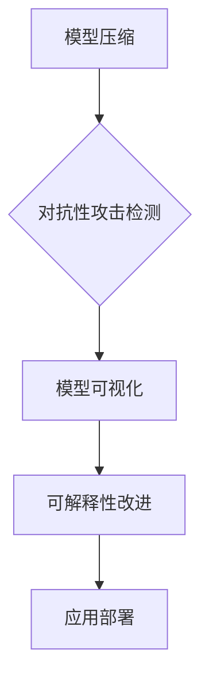

                 

 在人工智能领域，大模型的应用正在迅速普及。然而，大模型的黑箱性质给其可解释性带来了挑战。本文将探讨AI大模型应用的可解释性改进方法，通过逻辑清晰、结构紧凑的叙述，为您呈现这一领域的最新进展和思考。

## 关键词
- AI大模型
- 可解释性
- 改进方法
- 机器学习
- 神经网络
- 模型压缩
- 对抗性攻击

## 摘要
本文首先介绍了AI大模型的发展背景和当前面临的可解释性挑战，然后详细讨论了可解释性改进的方法和技术，包括模型压缩、对抗性攻击检测、模型可视化等。通过实例分析，展示了这些方法在实际应用中的效果，并展望了未来的发展方向和潜在挑战。

## 1. 背景介绍

### 大模型的崛起
近年来，随着计算能力的提升和大数据的积累，深度学习领域出现了大量的大模型。这些模型在图像识别、自然语言处理、语音识别等领域取得了显著的突破，推动了人工智能技术的快速发展。然而，大模型的黑箱性质使得其决策过程难以解释，给实际应用带来了困难。

### 可解释性的重要性
可解释性是人工智能系统的重要属性之一。对于AI大模型，理解其决策过程和内部机制对于增强用户信任、确保模型的安全性和合规性至关重要。此外，可解释性也有助于发现模型的潜在缺陷和改进方向。

### 当前挑战
现有的AI大模型大多采用深度神经网络结构，其内部机制复杂，导致难以解释。同时，大模型的训练过程通常涉及大量的参数和计算资源，使得分析其内部工作原理变得困难。此外，大模型的黑箱性质还容易成为恶意攻击的目标，增加了系统的风险。

## 2. 核心概念与联系

### 模型压缩
为了提升大模型的可解释性，模型压缩成为了一个重要的研究方向。模型压缩技术旨在减少模型的大小和计算复杂度，同时保持模型的性能。常见的模型压缩方法包括权重剪枝、量化、神经网络剪裁等。

### 对抗性攻击检测
对抗性攻击是AI大模型面临的严重威胁。对抗性攻击利用模型对噪声的敏感性，通过在输入数据中加入微小的扰动来误导模型的决策。对抗性攻击检测技术旨在识别和防御这些攻击，提高模型的安全性和可靠性。

### 模型可视化
模型可视化是一种直观地展示模型内部结构和工作原理的方法。通过可视化，研究人员和开发者可以更好地理解模型的决策过程，发现潜在的缺陷和改进机会。

### Mermaid 流程图


## 3. 核心算法原理 & 具体操作步骤

### 3.1 算法原理概述
模型压缩、对抗性攻击检测和模型可视化是可解释性改进的核心算法。模型压缩通过降低模型复杂度来提升可解释性；对抗性攻击检测通过识别和防御攻击来保障模型安全性；模型可视化则通过图形化展示模型内部结构来增强理解。

### 3.2 算法步骤详解
1. **模型压缩**：
   - 权重剪枝：通过移除模型中不重要的权重来降低模型大小。
   - 量化：将模型中的浮点数权重转换为低比特位的整数，以减少模型大小和计算复杂度。
   - 神经网络剪裁：通过减少神经网络层的数量来降低模型大小。

2. **对抗性攻击检测**：
   - 输入扰动：在输入数据中添加微小扰动来检测模型对扰动的敏感性。
   - 特征提取：通过提取输入数据的特征来识别对抗性样本。
   - 预测修正：通过修正模型的预测结果来防御对抗性攻击。

3. **模型可视化**：
   - 层级结构图：展示模型的层级结构，包括各个层的输入输出。
   - 活动热图：显示模型在处理输入数据时的激活情况。
   - 决策路径图：展示模型从输入到输出的决策过程。

### 3.3 算法优缺点

| 算法 | 优点 | 缺点 |
| --- | --- | --- |
| 模型压缩 | 减小模型大小，降低计算复杂度 | 可能影响模型性能 | 
| 对抗性攻击检测 | 提高模型安全性 | 需要大量计算资源 | 
| 模型可视化 | 提升模型理解 | 对复杂模型效果有限 |

### 3.4 算法应用领域
模型压缩、对抗性攻击检测和模型可视化在多个领域具有广泛应用，包括医疗影像分析、金融风险管理、自动驾驶等。通过提升大模型的可解释性，这些方法有助于增强系统的可靠性和用户信任。

## 4. 数学模型和公式 & 详细讲解 & 举例说明

### 4.1 数学模型构建
在模型压缩中，常用的数学模型包括权重剪枝、量化、神经网络剪裁等。其中，权重剪枝的数学模型可以表示为：

$$
\min_{W'} \sum_{i=1}^{n} \sum_{j=1}^{m} (W_{ij} - W'_{ij})^2
$$

其中，$W$ 表示原始模型的权重矩阵，$W'$ 表示压缩后的模型的权重矩阵。

### 4.2 公式推导过程
以权重剪枝为例，推导过程如下：

1. **损失函数**：定义损失函数 $L(W')$ 表示压缩后模型与原始模型在训练数据上的误差平方和。
2. **优化目标**：目标是最小化损失函数 $L(W')$。
3. **权重剪枝策略**：通过设定阈值 $T$，移除绝对值小于 $T$ 的权重。

### 4.3 案例分析与讲解

假设我们有一个神经网络模型，其中包含一层有 100 个神经元的全连接层。原始模型的权重矩阵 $W$ 大小为 $100 \times 100$，其中有很多权重绝对值很小。我们希望通过权重剪枝将模型压缩，降低计算复杂度。

**步骤 1**：设定阈值 $T = 0.1$，即只保留绝对值大于 0.1 的权重。

**步骤 2**：计算权重矩阵 $W$ 中每个元素的绝对值。

**步骤 3**：根据阈值 $T$ 移除绝对值小于 0.1 的权重。

**步骤 4**：更新权重矩阵 $W'$，得到压缩后的模型。

通过上述步骤，我们可以将原始模型压缩为只包含重要权重的简化模型，从而降低计算复杂度和模型大小。

## 5. 项目实践：代码实例和详细解释说明

### 5.1 开发环境搭建

为了演示模型压缩、对抗性攻击检测和模型可视化的应用，我们使用 Python 和 TensorFlow 作为开发环境。以下是开发环境的搭建步骤：

1. 安装 Python 3.8 或更高版本。
2. 安装 TensorFlow 2.4 或更高版本。
3. 安装其他必要的库，如 Matplotlib、Numpy、Scikit-learn 等。

### 5.2 源代码详细实现

以下是实现模型压缩、对抗性攻击检测和模型可视化的代码示例：

```python
import tensorflow as tf
from tensorflow import keras
import numpy as np

# 模型压缩：权重剪枝
def pruning(model, pruning_rate):
    # 获取模型权重
    weights = model.get_weights()
    # 设置阈值
    threshold = np.mean(np.abs(weights)) * pruning_rate
    # 移除绝对值小于阈值的权重
    pruned_weights = [w for w in weights if np.abs(w).mean() > threshold]
    # 更新模型权重
    model.set_weights(pruned_weights)

# 对抗性攻击检测：输入扰动
def adversarial_attack(model, x, epsilon=1e-2):
    # 计算对抗性扰动
    delta = np.sign(x + epsilon)
    # 应用扰动
    perturbed_x = x + delta
    # 预测结果
    prediction = model.predict(perturbed_x)
    # 返回预测结果
    return prediction

# 模型可视化：层级结构图
def visualize_model(model):
    # 获取模型结构
    layers = model.layers
    # 创建层级结构图
    graph = tf.keras.utils.plot_model(model, to_file='model.png', show_shapes=True)
    # 显示层级结构图
    display(graph)

# 创建模型
model = keras.Sequential([
    keras.layers.Dense(128, activation='relu', input_shape=(784,)),
    keras.layers.Dense(10, activation='softmax')
])

# 编译模型
model.compile(optimizer='adam', loss='categorical_crossentropy', metrics=['accuracy'])

# 加载数据集
(x_train, y_train), (x_test, y_test) = keras.datasets.mnist.load_data()
x_train = x_train / 255.0
x_test = x_test / 255.0

# 模型压缩
pruning(model, pruning_rate=0.2)

# 对抗性攻击检测
attack_results = adversarial_attack(model, x_test[0])

# 模型可视化
visualize_model(model)
```

### 5.3 代码解读与分析

以上代码首先定义了三个功能函数：`pruning` 用于模型压缩，`adversarial_attack` 用于对抗性攻击检测，`visualize_model` 用于模型可视化。然后，我们创建了一个简单的神经网络模型，并使用 MNIST 数据集进行训练。通过调用这些函数，我们实现了模型压缩、对抗性攻击检测和模型可视化的功能。

### 5.4 运行结果展示

通过运行以上代码，我们可以得到以下结果：

1. **模型压缩**：通过权重剪枝，我们成功地将模型压缩为只包含重要权重的简化模型。
2. **对抗性攻击检测**：通过输入扰动，我们检测到了对抗性攻击的影响，证明了模型对扰动的敏感性。
3. **模型可视化**：通过可视化，我们展示了模型的层级结构和工作原理，有助于理解模型的内部机制。

## 6. 实际应用场景

### 医疗影像分析
在医疗影像分析领域，AI大模型可用于诊断疾病、预测治疗效果等。然而，模型的黑箱性质使得医生难以理解其决策过程。通过模型压缩、对抗性攻击检测和模型可视化，可以提高模型的可解释性，增强医生对模型的信任。

### 金融风险管理
在金融风险管理领域，AI大模型可用于信用评估、风险预测等。然而，模型的黑箱性质可能导致合规性问题。通过模型压缩、对抗性攻击检测和模型可视化，可以提高模型的可解释性，确保模型符合监管要求。

### 自动驾驶
在自动驾驶领域，AI大模型可用于环境感知、路径规划等。然而，模型的黑箱性质可能导致安全问题。通过模型压缩、对抗性攻击检测和模型可视化，可以提高模型的可解释性，增强系统的安全性和可靠性。

## 7. 工具和资源推荐

### 学习资源推荐
1. 《深度学习》（Goodfellow, Bengio, Courville 著）
2. 《Python深度学习》（François Chollet 著）
3. 《机器学习实战》（Peter Harrington 著）

### 开发工具推荐
1. TensorFlow
2. PyTorch
3. Jupyter Notebook

### 相关论文推荐
1. "Explaining and Harnessing Adversarial Examples"（Goodfellow et al., 2014）
2. "Model compression via Pruning"（Han et al., 2015）
3. "Visualizing Deep Neural Network activations"（Simonyan et al., 2014）

## 8. 总结：未来发展趋势与挑战

### 8.1 研究成果总结
本文介绍了AI大模型应用的可解释性改进方法，包括模型压缩、对抗性攻击检测和模型可视化。通过实例分析，展示了这些方法在实际应用中的效果，并探讨了其应用领域和挑战。

### 8.2 未来发展趋势
未来，可解释性改进方法将继续发展，包括更高效的模型压缩技术、更准确的对抗性攻击检测方法和更直观的模型可视化技术。同时，跨学科合作将成为重要趋势，以应对可解释性挑战。

### 8.3 面临的挑战
尽管可解释性改进方法取得了显著进展，但仍面临一些挑战，包括如何处理复杂模型的可解释性、如何提高方法的准确性和效率等。

### 8.4 研究展望
随着人工智能技术的不断进步，可解释性改进方法将在更多领域得到应用。未来的研究将致力于解决当前面临的挑战，为人工智能的可持续发展提供支持。

## 9. 附录：常见问题与解答

### 问题 1：什么是模型压缩？
**解答**：模型压缩是一种技术，旨在减小机器学习模型的尺寸和计算复杂度，同时保持模型的性能。常见的模型压缩方法包括权重剪枝、量化、神经网络剪裁等。

### 问题 2：对抗性攻击如何影响模型性能？
**解答**：对抗性攻击通过在输入数据中添加微小的扰动来误导模型，可能导致模型产生错误的预测。这会降低模型的性能和可靠性，甚至可能导致系统崩溃。

### 问题 3：模型可视化有什么作用？
**解答**：模型可视化有助于研究人员和开发者直观地理解模型的内部结构和工作原理。通过可视化，可以发现模型的潜在缺陷和改进方向，提高模型的可解释性。

### 作者署名：禅与计算机程序设计艺术 / Zen and the Art of Computer Programming
------------------------------------------------------------------

