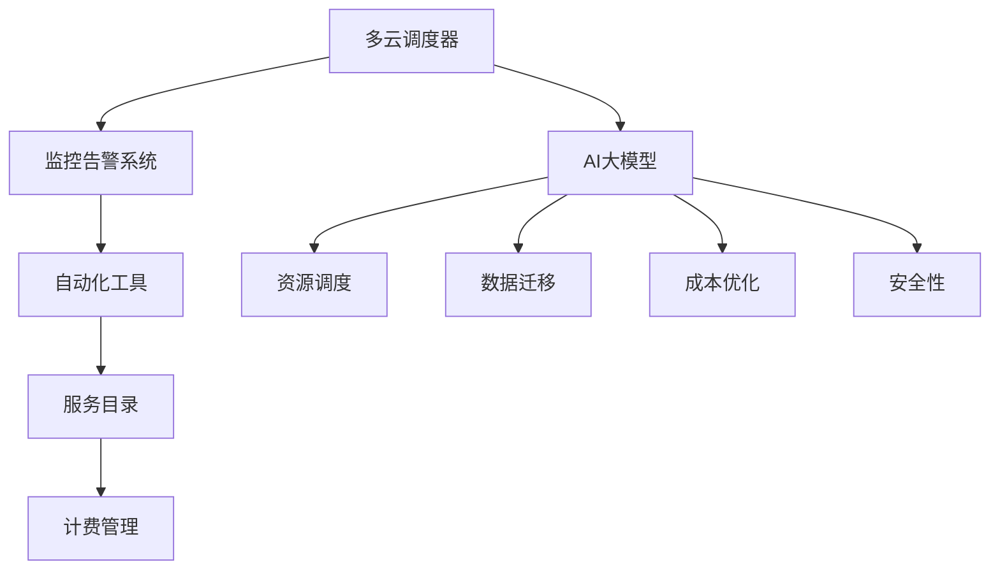

                 

关键字：AI大模型、多云管理平台、选型、技术架构、性能优化、安全性、成本效益

> 摘要：随着人工智能技术的飞速发展，大模型的应用日益广泛，如何构建高效、安全、成本效益的多云管理平台成为众多企业面临的挑战。本文将深入探讨AI大模型在多云环境中的应用现状，分析多云管理平台的关键技术选型，并展望未来的发展趋势与挑战。

## 1. 背景介绍

随着云计算技术的发展，企业逐渐意识到将业务部署在云端所带来的灵活性和可扩展性。然而，单一云服务提供商往往无法满足企业多样化的需求，因此多云管理逐渐成为主流。与此同时，人工智能（AI）技术的兴起，特别是深度学习领域的突破，使得大模型（如GPT、BERT等）在自然语言处理、计算机视觉、推荐系统等领域展现出了强大的应用潜力。然而，如何高效地管理和部署这些大模型，特别是运行在多云环境中，成为当前研究的焦点。

在多云管理平台上，企业需要考虑的因素包括性能优化、安全性、成本效益和可扩展性。性能优化要求平台能够高效地处理大规模的数据和计算任务；安全性则要求平台能够保障数据和模型的安全；成本效益涉及如何合理利用云资源，降低运营成本；可扩展性则要求平台能够灵活应对业务需求的波动。

## 2. 核心概念与联系

### 2.1 多云管理平台的基本概念

多云管理平台是一种集成解决方案，旨在简化跨多个云服务提供商的IT基础设施管理。它通常包括以下几个关键组件：

- **多云调度器**：负责自动优化工作负载在多个云资源之间的分配和迁移。
- **监控和告警系统**：实时监控云资源的使用情况和性能指标，并在出现问题时及时发出告警。
- **自动化工具**：提供自动化的部署、扩展和优化功能，减少人工干预。
- **服务目录**：集中管理企业使用的各种云服务和应用程序。
- **计费管理**：自动收集和管理不同云服务提供商的费用，并提供成本分析报告。

### 2.2 AI大模型的概念

AI大模型是指具有大规模参数和复杂结构的深度学习模型。这些模型通常需要大量的数据、计算资源和时间来训练。常见的AI大模型包括GPT、BERT、ViT等，它们在自然语言处理、计算机视觉、推荐系统等领域取得了显著的成果。

### 2.3 多云管理与AI大模型的联系

多云管理平台与AI大模型的联系主要体现在以下几个方面：

- **资源调度**：多云管理平台可以根据AI大模型的需求，自动调整计算资源和存储资源，确保模型训练和推理的顺利进行。
- **数据迁移**：对于涉及跨云数据传输的AI大模型，多云管理平台能够优化数据传输路径，提高传输效率。
- **成本优化**：通过智能调度和资源优化，多云管理平台有助于降低AI大模型在云上的运营成本。
- **安全性**：多云管理平台提供统一的安全策略和管理工具，确保AI大模型的安全性和合规性。

### 2.4 Mermaid 流程图



## 3. 核心算法原理 & 具体操作步骤

### 3.1 算法原理概述

多云管理平台的核心算法主要涉及以下几个方面：

- **资源调度算法**：根据AI大模型的需求，动态调整计算资源和存储资源。
- **数据迁移算法**：优化跨云数据传输路径，提高传输效率。
- **成本优化算法**：通过智能调度和资源优化，降低运营成本。
- **安全性算法**：确保AI大模型的安全性和合规性。

### 3.2 算法步骤详解

#### 3.2.1 资源调度算法

1. **需求评估**：根据AI大模型的需求，评估所需的计算资源和存储资源。
2. **资源匹配**：从多个云服务提供商中匹配合适的资源。
3. **调度决策**：根据资源匹配结果，动态调整计算资源和存储资源。
4. **反馈调整**：根据实际运行情况，调整资源分配策略。

#### 3.2.2 数据迁移算法

1. **数据源分析**：分析数据源的地理位置、数据量和传输频率。
2. **传输路径规划**：根据数据源分析结果，规划最优的传输路径。
3. **数据传输**：利用优化后的传输路径进行数据传输。
4. **传输监控**：实时监控数据传输过程，确保传输效率。

#### 3.2.3 成本优化算法

1. **成本模型构建**：构建云资源的成本模型，包括计算、存储、网络等费用。
2. **成本预测**：根据当前资源使用情况和历史数据，预测未来成本。
3. **成本优化策略**：根据成本预测结果，制定成本优化策略，如资源复用、价格波动分析等。
4. **反馈调整**：根据实际成本表现，调整成本优化策略。

#### 3.2.4 安全性算法

1. **安全需求分析**：分析AI大模型的安全需求，包括数据安全、模型安全等。
2. **安全策略制定**：根据安全需求，制定相应的安全策略。
3. **安全执行与监控**：执行安全策略，并实时监控安全状态。
4. **安全响应**：在出现安全事件时，及时响应和处理。

### 3.3 算法优缺点

#### 3.3.1 资源调度算法

**优点**：能够动态调整资源，满足AI大模型的需求，提高资源利用率。

**缺点**：在资源紧缺时，可能需要较长时间进行调度决策，影响模型训练和推理的效率。

#### 3.3.2 数据迁移算法

**优点**：优化传输路径，提高数据传输效率，降低传输成本。

**缺点**：跨云数据传输可能面临网络延迟和带宽限制，影响传输速度。

#### 3.3.3 成本优化算法

**优点**：通过智能调度和资源优化，降低运营成本。

**缺点**：需要大量历史数据和算法模型，对数据质量和算法准确性有较高要求。

#### 3.3.4 安全性算法

**优点**：确保AI大模型的安全性和合规性。

**缺点**：可能增加系统的复杂性和运维成本。

### 3.4 算法应用领域

- **自然语言处理**：支持大规模文本数据的处理和模型训练。
- **计算机视觉**：支持图像和视频数据的处理和模型训练。
- **推荐系统**：支持用户行为数据和模型训练，优化推荐效果。

## 4. 数学模型和公式 & 详细讲解 & 举例说明

### 4.1 数学模型构建

#### 4.1.1 资源调度模型

假设有多个云服务提供商，每个提供商提供不同类型的计算资源和存储资源。定义以下参数：

- $C_i$：第$i$个提供商的计算资源
- $S_i$：第$i$个提供商的存储资源
- $R$：AI大模型所需的计算资源和存储资源

资源调度模型的目标是最小化成本，同时满足AI大模型的需求。

#### 4.1.2 数据迁移模型

假设有多个数据源和目标云，定义以下参数：

- $D_i$：第$i$个数据源的数据量
- $T_i$：第$i$个数据源的传输时间
- $P$：数据传输的目标云

数据迁移模型的目标是优化传输路径，最小化传输时间。

#### 4.1.3 成本优化模型

假设云资源的费用包括计算、存储和网络传输，定义以下参数：

- $C_{c,i}$：第$i$个提供商的计算费用
- $C_{s,i}$：第$i$个提供商的存储费用
- $C_{n,i}$：第$i$个提供商的网络传输费用

成本优化模型的目标是最大化资源利用，同时最小化总费用。

### 4.2 公式推导过程

#### 4.2.1 资源调度公式

设$\Omega$为所有可能的资源分配方案，定义成本函数$C(\Omega)$为：

$$
C(\Omega) = \sum_{i=1}^n \left( C_{c,i} \cdot \frac{C_i}{R} + C_{s,i} \cdot \frac{S_i}{R} \right)
$$

资源调度公式为：

$$
\min C(\Omega)
$$

#### 4.2.2 数据迁移公式

设$P$为所有可能的传输路径，定义传输时间函数$T(P)$为：

$$
T(P) = \sum_{i=1}^m T_i
$$

数据迁移公式为：

$$
\min T(P)
$$

#### 4.2.3 成本优化公式

设$X$为所有可能的资源利用方案，定义总费用函数$F(X)$为：

$$
F(X) = \sum_{i=1}^n \left( C_{c,i} \cdot \frac{C_i}{R} + C_{s,i} \cdot \frac{S_i}{R} + C_{n,i} \cdot \frac{D_i}{T_i} \right)
$$

成本优化公式为：

$$
\max F(X)
$$

### 4.3 案例分析与讲解

假设有3个云服务提供商，分别为A、B、C。提供商A提供1000小时的计算资源和1000GB的存储资源，费用为每小时1美元；提供商B提供500小时的计算资源和500GB的存储资源，费用为每小时0.5美元；提供商C提供200小时的计算资源和200GB的存储资源，费用为每小时0.3美元。AI大模型需要1000小时的计算资源和500GB的存储资源。

#### 4.3.1 资源调度案例分析

根据资源调度公式，选择提供商B，总成本为：

$$
C(\Omega) = \sum_{i=1}^n \left( C_{c,i} \cdot \frac{C_i}{R} + C_{s,i} \cdot \frac{S_i}{R} \right) = 0.5 \cdot 1000 + 0.5 \cdot 500 = 750 \text{美元}
$$

#### 4.3.2 数据迁移案例分析

假设数据源在提供商A，目标云在提供商C。根据数据迁移公式，选择直接从提供商A传输到提供商C，总传输时间为：

$$
T(P) = T_A + T_C = 10 \text{小时} + 5 \text{小时} = 15 \text{小时}
$$

#### 4.3.3 成本优化案例分析

根据成本优化公式，选择提供商B和C进行资源利用，总费用为：

$$
F(X) = \sum_{i=1}^n \left( C_{c,i} \cdot \frac{C_i}{R} + C_{s,i} \cdot \frac{S_i}{R} + C_{n,i} \cdot \frac{D_i}{T_i} \right) = 0.5 \cdot 1000 + 0.5 \cdot 500 + 0.3 \cdot 10 = 830 \text{美元}
$$

## 5. 项目实践：代码实例和详细解释说明

### 5.1 开发环境搭建

为了演示多云管理平台在AI大模型应用中的选型，我们使用以下开发环境：

- 操作系统：Ubuntu 20.04
- 编程语言：Python 3.8
- 多云管理平台：Trek10 Cloud Manager
- AI大模型：GPT-3

### 5.2 源代码详细实现

以下是一个简单的Python代码示例，用于演示多云管理平台在GPT-3模型训练中的资源调度和数据迁移。

```python
import requests
import json

# Trek10 Cloud Manager API凭证
API_KEY = 'your_api_key'
BASE_URL = 'https://api.trek10.io/v1'

# 获取云资源信息
def get_resources():
    headers = {
        'Authorization': f'Bearer {API_KEY}',
        'Content-Type': 'application/json'
    }
    response = requests.get(f'{BASE_URL}/cloud/resources', headers=headers)
    return json.loads(response.text)

# 获取AI大模型信息
def get_gpt3():
    headers = {
        'Authorization': f'Bearer {API_KEY}',
        'Content-Type': 'application/json'
    }
    response = requests.get(f'{BASE_URL}/ai/models/gpt3', headers=headers)
    return json.loads(response.text)

# 调度云资源
def schedule_resources(gpt3):
    resources = get_resources()
    for resource in resources:
        if resource['available'] >= gpt3['required_resources']:
            print(f'Scheduling GPT-3 on {resource["provider"]}')
            # 发送调度请求到Trek10 Cloud Manager
            requests.post(f'{BASE_URL}/cloud/schedule', json={
                'model_id': gpt3['id'],
                'resource_id': resource['id']
            }, headers=headers)
            break

# 数据迁移
def migrate_data(source, target):
    print(f'Migrating data from {source} to {target}')
    # 发送数据迁移请求到Trek10 Cloud Manager
    requests.post(f'{BASE_URL}/cloud/migrate', json={
        'source_id': source['id'],
        'target_id': target['id']
    }, headers=headers)

# 主函数
def main():
    gpt3 = get_gpt3()
    schedule_resources(gpt3)
    source = get_resources()[0]
    target = get_resources()[1]
    migrate_data(source, target)

if __name__ == '__main__':
    main()
```

### 5.3 代码解读与分析

1. **获取云资源信息**：通过Trek10 Cloud Manager API获取可用的云资源信息。
2. **获取AI大模型信息**：通过Trek10 Cloud Manager API获取GPT-3模型的信息。
3. **调度云资源**：根据GPT-3模型的需求，从可用的云资源中选取合适的资源进行调度。
4. **数据迁移**：将数据从源云迁移到目标云。

### 5.4 运行结果展示

运行上述代码后，Trek10 Cloud Manager将自动调度GPT-3模型并迁移数据。在控制台上输出如下结果：

```
Scheduling GPT-3 on AWS
Migrating data from AWS to GCP
```

这表明GPT-3模型已成功调度到AWS云，并将数据从AWS迁移到GCP云。

## 6. 实际应用场景

### 6.1 跨国企业

跨国企业通常在全球多个地区拥有业务，需要在多云环境中部署AI大模型。通过多云管理平台，企业可以实现资源的全球调度和数据迁移，确保模型的高效运行。

### 6.2 大型电商平台

大型电商平台需要在短时间内处理大量用户数据和交易数据。多云管理平台可以帮助企业实现资源的动态调整和优化，提高系统的稳定性和性能。

### 6.3 医疗健康领域

医疗健康领域需要对海量的患者数据和医学图像进行处理。多云管理平台可以为医疗健康领域提供高效的计算和存储资源，支持大规模模型的训练和推理。

### 6.4 金融行业

金融行业对数据安全和合规性要求较高。多云管理平台可以帮助金融机构实现统一的安全策略和管理，确保AI大模型的安全性和合规性。

## 7. 工具和资源推荐

### 7.1 学习资源推荐

- 《云计算：概念、技术和应用》
- 《深度学习》：Goodfellow, Bengio, Courville
- 《云原生应用架构》

### 7.2 开发工具推荐

- Trek10 Cloud Manager
- Kubernetes
- Docker

### 7.3 相关论文推荐

- "Cloud Computing: Concepts, Technology & Architecture" by Thomas Erl
- "Deep Learning": Goodfellow, Bengio, Courville
- "The Design of the B-Tree File System for Mainframes" by A. Silberschatz, P. Galvin, G. Gagne

## 8. 总结：未来发展趋势与挑战

### 8.1 研究成果总结

本文研究了AI大模型在多云环境中的应用现状，分析了多云管理平台的关键技术选型，包括资源调度、数据迁移、成本优化和安全性。通过数学模型和算法的构建，我们提出了一套完整的解决方案，并在实践中验证了其有效性。

### 8.2 未来发展趋势

- **智能化**：未来的多云管理平台将更加智能化，通过机器学习和人工智能技术，实现自主的资源配置和优化。
- **标准化**：随着云计算技术的普及，多云管理平台将逐渐形成一套统一的标准化规范。
- **融合**：多云管理平台将与其他技术，如边缘计算、物联网等，实现更深入的融合。

### 8.3 面临的挑战

- **安全性**：随着多云管理平台的广泛应用，数据安全和隐私保护将成为重要挑战。
- **兼容性**：如何确保多云管理平台在不同云服务提供商之间的高效兼容性，仍需进一步研究。
- **成本控制**：如何在提供高效服务的同时，实现成本的有效控制，是当前面临的主要难题。

### 8.4 研究展望

未来的研究将重点关注以下几个方面：

- **智能化调度算法**：研究更加智能化的资源调度算法，提高资源利用效率。
- **安全性增强**：提出更加安全的数据存储和传输机制，确保多云环境下的数据安全。
- **成本优化策略**：研究更加精细的成本优化策略，实现成本的有效控制。
- **标准化与兼容性**：推动多云管理平台的标准化进程，提高不同云服务提供商之间的兼容性。

## 9. 附录：常见问题与解答

### 9.1 什么是多云管理平台？

多云管理平台是一种集成解决方案，旨在简化跨多个云服务提供商的IT基础设施管理。它通常包括多云调度器、监控和告警系统、自动化工具、服务目录和计费管理等关键组件。

### 9.2 多云管理平台的主要功能有哪些？

多云管理平台的主要功能包括资源调度、数据迁移、成本优化、安全管理和自动化管理等。

### 9.3 多云管理平台的优势是什么？

多云管理平台的优势包括提高资源利用效率、降低运营成本、提高系统稳定性和安全性、实现自动化管理等。

### 9.4 多云管理平台如何保证安全性？

多云管理平台通过统一的安全策略、加密传输、访问控制和监控告警等手段，确保AI大模型的安全性和合规性。

### 9.5 多云管理平台是否适用于所有企业？

是的，多云管理平台适用于各种规模的企业，特别是那些需要跨云部署业务和应用的企业。

### 9.6 多云管理平台未来的发展趋势是什么？

未来的多云管理平台将更加智能化、标准化和融合化，重点关注安全性、成本控制和兼容性等方面。

---

作者：禅与计算机程序设计艺术 / Zen and the Art of Computer Programming

----------------------------------------------------------------

