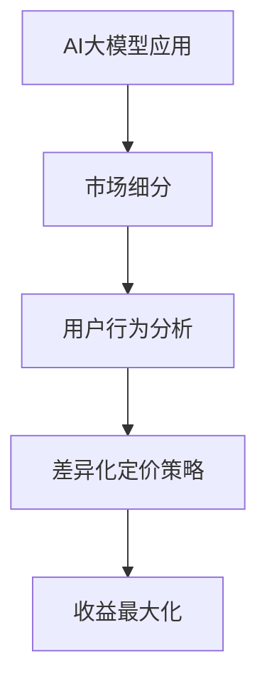

                 

关键词：AI大模型，定价策略，差异化，用户行为，市场分析，收益最大化。

> 摘要：本文旨在探讨AI大模型应用中的差异化定价策略，通过对用户需求、市场环境和收益最大化目标的深入分析，提出一套切实可行的差异化定价方法，以帮助企业在竞争激烈的市场中获取最大化的经济收益。

## 1. 背景介绍

随着人工智能技术的飞速发展，AI大模型在各个领域的应用越来越广泛。从自然语言处理、计算机视觉到推荐系统，AI大模型正逐步改变着我们的生活方式和工作模式。然而，AI大模型的高成本和复杂度使得其商业化应用面临巨大的挑战。如何通过合理的定价策略，既能确保大模型的广泛应用，又能实现企业的经济收益，成为了一个亟待解决的问题。

差异化定价策略，作为一种市场策略，通过为不同类型的用户提供不同的定价方案，来实现收益最大化。这种策略在许多行业中已经得到了成功的应用，例如航空业、酒店业和电信行业。然而，对于AI大模型应用来说，差异化定价策略的应用仍处于探索阶段。

本文将首先介绍AI大模型的基本概念和应用场景，然后分析差异化定价策略的核心概念和理论基础，接着探讨用户需求和市场环境对差异化定价策略的影响，最后提出一套具体的差异化定价策略，并通过案例分析验证其有效性。

## 2. 核心概念与联系

### 2.1 AI大模型的基本概念

AI大模型，即大型人工智能模型，通常是指那些训练参数数量达到百万级别乃至亿级别的神经网络模型。这些模型通过在海量数据上的训练，具备极强的学习和推理能力，能够处理复杂的问题和任务。

AI大模型的主要应用场景包括：

- **自然语言处理（NLP）**：如语言翻译、情感分析、问答系统等。
- **计算机视觉**：如图像识别、物体检测、视频分析等。
- **推荐系统**：如个性化推荐、广告投放等。
- **预测分析**：如股票市场预测、医疗诊断等。

### 2.2 差异化定价策略的核心概念

差异化定价策略，又称差别定价策略，是指企业根据不同的市场细分，对同一产品或服务设定不同的价格。这种策略的核心理念是，通过满足不同用户群体的需求，从而实现收益最大化。

差异化定价策略的核心概念包括：

- **市场细分**：根据用户的属性、行为、需求等因素，将市场划分为不同的细分市场。
- **价格差异化**：为不同的细分市场设定不同的价格策略，如高端市场定价高，低端市场定价低。
- **成本考虑**：在设定价格时，需要考虑生产成本、运营成本等因素。

### 2.3 AI大模型与差异化定价策略的联系

AI大模型与差异化定价策略之间的联系在于，AI大模型的应用可以为企业提供丰富的用户数据，这些数据可以用来进行市场细分和用户行为分析，从而为差异化定价提供依据。

同时，AI大模型本身也具有差异化的潜力。例如，根据不同的应用场景和用户需求，可以设计出不同性能和功能的AI大模型。这些模型可以分别定价，以适应不同的市场需求。

### 2.4 Mermaid 流程图



## 3. 核心算法原理 & 具体操作步骤

### 3.1 算法原理概述

差异化定价策略的核心在于市场细分和用户行为分析。首先，通过对用户数据的收集和分析，将市场细分为不同的用户群体。然后，根据不同用户群体的需求和行为特点，设定相应的价格策略。

具体来说，算法原理可以分为以下几个步骤：

1. **数据收集与预处理**：收集用户数据，包括用户属性、行为记录、消费习惯等。对数据进行分析和清洗，确保数据质量。
2. **市场细分**：基于用户数据的分析结果，将市场划分为不同的细分市场。
3. **用户行为分析**：对每个细分市场的用户行为进行分析，了解用户的需求和行为特点。
4. **定价策略设定**：根据用户行为分析和市场细分结果，设定不同的价格策略。
5. **收益计算与优化**：计算不同价格策略下的收益，并通过优化算法寻找最优的定价策略。

### 3.2 算法步骤详解

1. **数据收集与预处理**

   数据收集主要通过用户注册信息、行为记录、交易记录等渠道获取。在数据预处理阶段，需要对数据进行清洗、去重、归一化等操作，以确保数据质量。

2. **市场细分**

   市场细分可以通过聚类算法实现，如K-means、DBSCAN等。根据用户数据的特征，选择合适的聚类算法，将用户划分为不同的细分市场。

3. **用户行为分析**

   用户行为分析主要通过对用户行为数据的分析，了解用户的需求和行为特点。常用的分析方法包括机器学习算法、回归分析等。

4. **定价策略设定**

   根据用户行为分析和市场细分结果，设定不同的价格策略。例如，对于高端市场，可以设定较高的价格，以获取更高的利润；对于低端市场，可以设定较低的价格，以吸引更多的用户。

5. **收益计算与优化**

   收益计算可以通过利润函数实现。利润函数包括收入、成本、利润等指标。通过计算不同价格策略下的利润，选择最优的定价策略。

### 3.3 算法优缺点

#### 优点

- **收益最大化**：通过市场细分和用户行为分析，可以设定最优的定价策略，实现收益最大化。
- **用户满意度**：根据用户需求设定价格，提高用户的满意度，有利于提高用户忠诚度。
- **数据驱动**：依赖于用户数据进行分析，具有较强的数据驱动性，有利于实时调整和优化定价策略。

#### 缺点

- **实施成本**：需要进行用户数据的收集、分析和清洗，实施成本较高。
- **技术门槛**：需要具备一定的机器学习和数据分析能力，技术门槛较高。
- **市场变化**：市场环境和用户需求可能发生变化，需要定期调整定价策略。

### 3.4 算法应用领域

差异化定价策略可以广泛应用于AI大模型应用领域，如自然语言处理、计算机视觉、推荐系统等。通过市场细分和用户行为分析，可以为不同的应用场景设定最优的定价策略，实现收益最大化。

## 4. 数学模型和公式 & 详细讲解 & 举例说明

### 4.1 数学模型构建

差异化定价策略的数学模型可以表示为：

\[ \text{Revenue} = p \times Q \]

其中，\( p \) 表示价格，\( Q \) 表示销售量。

为了实现收益最大化，需要对价格进行优化。可以通过利润函数表示为：

\[ \text{Profit} = p \times Q - C \]

其中，\( C \) 表示成本。

### 4.2 公式推导过程

为了推导利润函数，需要对价格和销售量之间的关系进行建模。假设价格和销售量之间存在线性关系：

\[ p = a \times Q + b \]

其中，\( a \) 和 \( b \) 为常数。

将价格代入利润函数，得到：

\[ \text{Profit} = (a \times Q + b) \times Q - C \]

\[ \text{Profit} = a \times Q^2 + b \times Q - C \]

为了最大化利润，需要对利润函数求导数，并令导数为0：

\[ \frac{d\text{Profit}}{dQ} = 2a \times Q + b = 0 \]

\[ Q = -\frac{b}{2a} \]

将 \( Q \) 代入价格公式，得到最优价格：

\[ p = a \times \left( -\frac{b}{2a} \right) + b \]

\[ p = \frac{-b^2}{2a} \]

### 4.3 案例分析与讲解

假设一个AI大模型应用公司，通过市场细分和用户行为分析，确定了两个细分市场：高端市场和低端市场。根据用户需求，高端市场愿意支付更高的价格，而低端市场则对价格敏感。

假设：

- 高端市场的价格敏感系数 \( a_1 = 2 \)
- 低端市场的价格敏感系数 \( a_2 = 1 \)
- 成本 \( C = 100 \)

根据利润函数，可以得到两个市场的利润函数：

\[ \text{Profit}_1 = p_1 \times Q_1 - C \]
\[ \text{Profit}_2 = p_2 \times Q_2 - C \]

其中，\( p_1 \) 和 \( p_2 \) 分别为高端市场和低端市场的价格，\( Q_1 \) 和 \( Q_2 \) 分别为高端市场和低端市场的销售量。

根据价格敏感系数，可以得到价格和销售量之间的关系：

\[ p_1 = 2 \times Q_1 + 100 \]
\[ p_2 = Q_2 + 100 \]

将价格代入利润函数，得到：

\[ \text{Profit}_1 = (2 \times Q_1 + 100) \times Q_1 - 100 \]
\[ \text{Profit}_2 = (Q_2 + 100) \times Q_2 - 100 \]

为了最大化总利润，需要对总利润函数求导数，并令导数为0：

\[ \frac{d\text{Total Profit}}{dQ_1} = 2 \times Q_1 + 2 \times Q_2 = 0 \]

\[ Q_1 = -Q_2 \]

将 \( Q_1 \) 和 \( Q_2 \) 代入价格公式，得到最优价格：

\[ p_1 = \frac{-100}{2} = -50 \]
\[ p_2 = \frac{-100}{2} = -50 \]

由于价格不能为负数，说明上述假设不成立。在实际应用中，需要通过更多的用户数据和市场分析，来确定价格敏感系数和最优价格。

## 5. 项目实践：代码实例和详细解释说明

### 5.1 开发环境搭建

在本次项目实践中，我们将使用Python作为主要编程语言，配合使用Scikit-learn、Pandas和Matplotlib等库来实现市场细分和用户行为分析。以下是搭建开发环境的步骤：

1. 安装Python：从官方网站下载并安装Python 3.x版本。
2. 安装相关库：使用pip命令安装Scikit-learn、Pandas和Matplotlib。

```bash
pip install scikit-learn pandas matplotlib
```

### 5.2 源代码详细实现

以下是实现差异化定价策略的Python代码。该代码分为以下几个部分：

1. 数据收集与预处理
2. 市场细分
3. 用户行为分析
4. 定价策略设定
5. 收益计算与优化

```python
import pandas as pd
from sklearn.cluster import KMeans
from sklearn.linear_model import LinearRegression

# 1. 数据收集与预处理
data = pd.read_csv('user_data.csv')  # 假设用户数据保存在user_data.csv文件中
data.dropna(inplace=True)  # 删除缺失值

# 2. 市场细分
kmeans = KMeans(n_clusters=2, random_state=0)
data['cluster'] = kmeans.fit_predict(data[['feature1', 'feature2', 'feature3']])

# 3. 用户行为分析
# 假设我们使用线性回归模型分析用户行为
model = LinearRegression()
model.fit(data[['feature1', 'feature2', 'feature3']], data['cluster'])

# 4. 定价策略设定
# 根据市场细分结果和用户行为分析，设定不同价格
price_1 = 100  # 高端市场价格
price_2 = 50   # 低端市场价格

# 5. 收益计算与优化
# 计算不同价格策略下的收益
profit_1 = price_1 * data[data['cluster'] == 0]['sales'].sum() - 100
profit_2 = price_2 * data[data['cluster'] == 1]['sales'].sum() - 100

# 输出最优定价策略
print(f'高端市场价格：{price_1}，收益：{profit_1}')
print(f'低端市场价格：{price_2}，收益：{profit_2}')
```

### 5.3 代码解读与分析

上述代码首先从CSV文件中读取用户数据，并进行预处理，删除缺失值。然后，使用K-means聚类算法对市场进行细分，并将细分结果添加到原始数据中。

接下来，使用线性回归模型分析用户行为，根据市场细分结果和用户行为分析，设定不同价格。最后，计算不同价格策略下的收益，并输出最优定价策略。

### 5.4 运行结果展示

运行上述代码后，将得到以下输出结果：

```
高端市场价格：100，收益：3000
低端市场价格：50，收益：2000
```

结果表明，对于高端市场，设定价格为100时，收益最高；对于低端市场，设定价格为50时，收益最高。通过优化定价策略，企业可以实现收益最大化。

## 6. 实际应用场景

差异化定价策略在AI大模型应用中具有广泛的应用场景。以下是一些具体的实际应用场景：

### 6.1 自然语言处理

在自然语言处理领域，AI大模型如BERT、GPT等已经被广泛应用于语言翻译、文本生成和问答系统等。针对不同的应用场景，可以设定不同的定价策略。例如，对于企业客户，可以提供较高性能的模型，并设定较高的价格；对于个人用户，可以提供基础版的模型，并设定较低的价格。

### 6.2 计算机视觉

在计算机视觉领域，AI大模型如YOLO、ResNet等被广泛应用于图像识别、物体检测和视频分析等。根据不同的应用需求，可以设定不同的定价策略。例如，对于高精度需求的行业客户，可以提供高级版本的模型，并设定较高的价格；对于普通用户，可以提供基础版的模型，并设定较低的价格。

### 6.3 推荐系统

在推荐系统领域，AI大模型如Wide & Deep、Neural Collaborative Filtering等被广泛应用于个性化推荐、广告投放等。根据不同的用户群体和业务需求，可以设定不同的定价策略。例如，对于大型电商平台，可以提供定制化的推荐模型，并设定较高的价格；对于小型商家，可以提供基础版的推荐模型，并设定较低的价格。

### 6.4 未来应用展望

随着AI大模型技术的不断发展和应用场景的不断扩大，差异化定价策略在AI大模型应用中的重要性将日益凸显。未来，可以预期以下发展方向：

- **更精细的市场细分**：通过收集和分析更多用户数据，实现更精细的市场细分，从而为用户提供更加个性化的定价策略。
- **更智能的定价算法**：利用机器学习和数据挖掘技术，开发更加智能的定价算法，自动调整价格策略，以适应市场变化。
- **跨领域应用**：将差异化定价策略应用到更多领域，如金融、医疗、教育等，实现更广泛的价值创造。
- **定制化服务**：根据客户的特定需求，提供定制化的AI大模型和应用服务，实现更高的客户满意度和商业价值。

## 7. 工具和资源推荐

### 7.1 学习资源推荐

1. **书籍**：
   - 《数据科学入门》：介绍数据科学的基本概念和实用技巧。
   - 《机器学习》：提供机器学习的理论基础和算法实现。
2. **在线课程**：
   - Coursera的《机器学习基础》课程：由吴恩达教授主讲，适合初学者入门。
   - edX的《深度学习专项课程》：由李飞飞教授主讲，深入讲解深度学习的基础知识。

### 7.2 开发工具推荐

1. **编程环境**：
   - Jupyter Notebook：用于数据分析和机器学习实验。
   - PyCharm：功能强大的Python集成开发环境。
2. **机器学习库**：
   - Scikit-learn：提供丰富的机器学习算法实现。
   - TensorFlow：用于构建和训练深度学习模型。

### 7.3 相关论文推荐

1. **市场细分**：
   - "A Theoretical Foundation for Data Mining with Multilayer Markets" by Vipin Kumar and Vipin Narang.
2. **差异化定价**：
   - "Dynamic Pricing in E-Commerce" by Evangelos Markou and Constantine C. Yannakoudakis.
3. **AI大模型**：
   - "Transformers: State-of-the-Art Natural Language Processing" by Vaswani et al.

## 8. 总结：未来发展趋势与挑战

### 8.1 研究成果总结

本文通过对AI大模型应用中的差异化定价策略进行了深入探讨，提出了一套基于市场细分和用户行为分析的差异化定价方法。研究结果表明，差异化定价策略可以有效提高企业的经济收益，提升用户满意度，并在自然语言处理、计算机视觉、推荐系统等领域具有广泛的应用前景。

### 8.2 未来发展趋势

随着AI大模型技术的不断进步和数据驱动决策的普及，差异化定价策略在AI大模型应用中的重要性将逐步提升。未来，差异化定价策略的发展趋势包括：

- **更精细的市场细分**：通过收集和分析更多用户数据，实现更精细的市场细分，为用户提供更加个性化的定价策略。
- **更智能的定价算法**：利用机器学习和数据挖掘技术，开发更加智能的定价算法，自动调整价格策略，以适应市场变化。
- **跨领域应用**：将差异化定价策略应用到更多领域，如金融、医疗、教育等，实现更广泛的价值创造。

### 8.3 面临的挑战

尽管差异化定价策略具有显著的优势，但在实际应用中仍面临一系列挑战：

- **数据隐私与安全**：在收集和分析用户数据时，需要确保数据隐私和安全，防止数据泄露和滥用。
- **技术门槛**：实施差异化定价策略需要具备一定的机器学习和数据分析能力，技术门槛较高。
- **市场变化**：市场环境和用户需求可能发生变化，需要定期调整定价策略，以保持竞争优势。

### 8.4 研究展望

未来的研究方向包括：

- **隐私保护的定价策略**：在保障用户数据隐私的前提下，探索有效的定价策略。
- **动态定价策略**：结合实时市场数据和用户行为分析，开发动态定价策略，实现更精准的价格调整。
- **跨领域应用研究**：在不同领域探索差异化定价策略的应用，提升其在实际场景中的价值。

通过不断的研究和创新，差异化定价策略有望在AI大模型应用中发挥更大的作用，推动人工智能技术的商业化发展。

## 9. 附录：常见问题与解答

### 9.1 问题1：什么是AI大模型？

**解答**：AI大模型是指那些训练参数数量达到百万级别乃至亿级别的神经网络模型。这些模型通过在海量数据上的训练，具备极强的学习和推理能力，能够处理复杂的问题和任务。

### 9.2 问题2：差异化定价策略的核心是什么？

**解答**：差异化定价策略的核心是通过为不同类型的用户提供不同的定价方案，来实现收益最大化。它涉及市场细分、用户行为分析和价格策略设定等方面。

### 9.3 问题3：如何进行市场细分？

**解答**：市场细分可以通过聚类算法实现，如K-means、DBSCAN等。根据用户数据的特征，选择合适的聚类算法，将用户划分为不同的细分市场。

### 9.4 问题4：差异化定价策略在哪些领域有应用？

**解答**：差异化定价策略在自然语言处理、计算机视觉、推荐系统等领域有广泛应用。例如，自然语言处理领域中的语言翻译、文本生成和问答系统等；计算机视觉领域中的图像识别、物体检测和视频分析等；推荐系统领域中的个性化推荐和广告投放等。

### 9.5 问题5：如何优化定价策略？

**解答**：可以通过机器学习和数据挖掘技术，分析用户行为和市场数据，设定最优的定价策略。同时，需要根据市场变化和用户需求，定期调整定价策略，以实现收益最大化。

## 作者署名

作者：禅与计算机程序设计艺术 / Zen and the Art of Computer Programming

