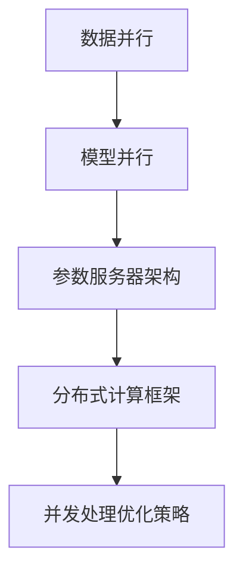

                 

关键词：AI大模型，并发处理，性能优化，分布式计算，数据并行，模型并行

>摘要：本文将深入探讨AI大模型在并发处理中的优化方法。通过分析当前主流的并发处理技术，结合实际项目案例，提出一套有效的优化策略，旨在提升AI大模型的训练和推理效率，为相关研究和应用提供参考。

## 1. 背景介绍

随着深度学习技术的快速发展，AI大模型在自然语言处理、计算机视觉、推荐系统等领域取得了显著的成果。然而，大模型的训练和推理过程需要消耗大量的计算资源，尤其是在面对海量数据和高并发请求时，性能优化成为一个亟待解决的问题。因此，如何有效提升AI大模型的并发处理能力，成为当前研究的热点。

### 1.1 AI大模型的发展现状

AI大模型主要指那些参数规模达到百万甚至亿级别的人工神经网络模型。随着计算能力的提升和算法的优化，AI大模型的应用场景越来越广泛。例如，GPT-3模型在文本生成和处理方面取得了突破性进展，BERT模型在自然语言理解任务中具有很高的准确性。

### 1.2 并发处理的重要性

并发处理是指在多核处理器或分布式系统中，通过并行执行任务来提高计算效率。在AI大模型的应用中，并发处理可以显著降低训练和推理的时间成本，提升系统的响应速度。因此，研究和优化并发处理技术具有重要意义。

## 2. 核心概念与联系

为了更好地理解并发处理在AI大模型中的应用，我们需要先了解一些核心概念和它们之间的关系。以下是关键概念及其相互关系的Mermaid流程图：



### 2.1 数据并行

数据并行是指在多个计算节点上同时处理不同的数据子集，从而加速模型训练。每个节点独立计算梯度，然后在全局同步更新模型参数。

### 2.2 模型并行

模型并行是指在多个计算节点上同时训练模型的不同部分，然后将结果合并。这种策略适用于模型过于庞大，无法在一个节点上训练的情况。

### 2.3 参数服务器架构

参数服务器架构是一种分布式计算架构，用于存储和同步模型的参数。通过参数服务器，可以有效地实现数据并行和模型并行的协调。

### 2.4 分布式计算框架

分布式计算框架如TensorFlow、PyTorch等，提供了便捷的API和工具，用于实现并发处理。这些框架支持数据并行、模型并行和参数服务器架构。

### 2.5 并发处理优化策略

并发处理优化策略包括负载均衡、并行化算法、缓存策略等，旨在提高系统的整体性能。

## 3. 核心算法原理 & 具体操作步骤

### 3.1 算法原理概述

并发处理的核心目标是利用多核处理器或分布式系统的计算能力，提高AI大模型的训练和推理效率。具体来说，可以采用以下几种策略：

- **数据并行**：将数据集划分为多个子集，在不同计算节点上独立训练模型。
- **模型并行**：将模型划分为多个部分，在不同计算节点上分别训练。
- **参数服务器架构**：使用分布式存储和同步机制，管理模型参数的更新。
- **分布式计算框架**：利用现有的分布式计算框架，实现并行训练和推理。

### 3.2 算法步骤详解

#### 3.2.1 数据并行

1. 将数据集划分为多个子集，每个子集包含相同数量的样本。
2. 在不同的计算节点上加载不同的子集，并独立训练模型。
3. 同步每个节点的模型参数，更新全局模型。
4. 重复上述步骤，直至达到训练目标或模型收敛。

#### 3.2.2 模型并行

1. 将模型划分为多个部分，每个部分负责处理不同的输入数据。
2. 在不同的计算节点上分别训练每个模型部分。
3. 合并各个模型部分的输出，得到完整的模型输出。
4. 使用参数服务器架构同步各个模型部分的参数。

#### 3.2.3 参数服务器架构

1. 初始化参数服务器，存储模型参数。
2. 将模型参数复制到各个计算节点。
3. 在每个节点上独立计算梯度。
4. 将各个节点的梯度发送到参数服务器。
5. 参数服务器更新模型参数。
6. 重复上述步骤，直至模型收敛。

#### 3.2.4 分布式计算框架

1. 选择合适的分布式计算框架，如TensorFlow、PyTorch。
2. 配置分布式计算环境，包括计算节点、数据存储等。
3. 编写分布式训练代码，使用框架提供的API实现数据并行、模型并行和参数服务器架构。
4. 运行分布式训练过程，监控模型性能和训练进度。

### 3.3 算法优缺点

#### 优点：

- **提高训练和推理效率**：通过并行处理，显著降低计算时间。
- **支持大规模模型**：分布式计算框架支持大规模模型的训练和推理。
- **负载均衡**：分布式架构可以实现负载均衡，提高系统稳定性。

#### 缺点：

- **通信开销**：数据并行和模型并行需要同步参数，存在一定的通信开销。
- **复杂度**：分布式系统的配置和管理较为复杂。
- **依赖硬件**：分布式计算需要高性能计算硬件支持。

### 3.4 算法应用领域

并发处理技术广泛应用于AI大模型的各种场景，包括但不限于：

- **自然语言处理**：文本分类、机器翻译、情感分析等。
- **计算机视觉**：图像分类、目标检测、图像生成等。
- **推荐系统**：商品推荐、新闻推荐等。

## 4. 数学模型和公式 & 详细讲解 & 举例说明

为了更好地理解并发处理在AI大模型中的应用，我们将介绍相关的数学模型和公式，并通过具体案例进行讲解。

### 4.1 数学模型构建

在分布式训练中，我们通常使用以下模型：

- 数据并行模型：假设数据集$D$被划分为$k$个子集$D_1, D_2, \ldots, D_k$，每个子集由$m$个样本组成。在每个子集上独立训练模型，然后同步更新全局模型。

- 模型并行模型：将模型划分为$k$个部分，每个部分分别处理不同的输入数据。通过合并各个部分的输出，得到完整的模型输出。

### 4.2 公式推导过程

#### 数据并行模型

1. 训练每个子集$D_i$的梯度：
   $$\nabla_{\theta_i} = \frac{1}{m} \sum_{x_i \in D_i} (\hat{y_i} - y_i) \cdot x_i$$

2. 同步更新全局模型：
   $$\theta_{\text{global}} = \theta_{\text{global}} - \alpha \cdot \frac{1}{k} \sum_{i=1}^k \nabla_{\theta_i}$$

其中，$\theta_i$为子集$D_i$上的模型参数，$\theta_{\text{global}}$为全局模型参数，$\hat{y_i}$为预测结果，$y_i$为真实标签，$x_i$为输入样本，$\alpha$为学习率。

#### 模型并行模型

1. 训练每个模型部分的梯度：
   $$\nabla_{\theta_i} = \frac{1}{m} \sum_{x_i \in D} (\hat{y_i} - y_i) \cdot x_i$$

2. 合并各个模型部分的输出：
   $$\hat{y} = \sum_{i=1}^k \hat{y_i}$$

3. 同步更新全局模型：
   $$\theta_{\text{global}} = \theta_{\text{global}} - \alpha \cdot \nabla_{\theta_{\text{global}}}$$

其中，$\theta_i$为模型部分$i$的参数，$\theta_{\text{global}}$为全局模型参数，$\hat{y_i}$为模型部分$i$的输出，$\hat{y}$为合并后的输出。

### 4.3 案例分析与讲解

#### 案例一：数据并行训练

假设有一个数据集$D$，包含$10000$个样本，划分为$5$个子集$D_1, D_2, \ldots, D_5$。在每个子集上独立训练模型，然后同步更新全局模型。

1. 训练每个子集的梯度：
   $$\nabla_{\theta_1} = \frac{1}{2000} \sum_{x_1 \in D_1} (\hat{y_1} - y_1) \cdot x_1$$
   $$\nabla_{\theta_2} = \frac{1}{2000} \sum_{x_2 \in D_2} (\hat{y_2} - y_2) \cdot x_2$$
   $$\nabla_{\theta_3} = \frac{1}{2000} \sum_{x_3 \in D_3} (\hat{y_3} - y_3) \cdot x_3$$
   $$\nabla_{\theta_4} = \frac{1}{2000} \sum_{x_4 \in D_4} (\hat{y_4} - y_4) \cdot x_4$$
   $$\nabla_{\theta_5} = \frac{1}{2000} \sum_{x_5 \in D_5} (\hat{y_5} - y_5) \cdot x_5$$

2. 同步更新全局模型：
   $$\theta_{\text{global}} = \theta_{\text{global}} - \alpha \cdot \frac{1}{5} (\nabla_{\theta_1} + \nabla_{\theta_2} + \nabla_{\theta_3} + \nabla_{\theta_4} + \nabla_{\theta_5})$$

#### 案例二：模型并行训练

假设有一个模型，分为$5$个部分$M_1, M_2, \ldots, M_5$。在每个部分上独立训练模型，然后合并输出，并同步更新全局模型。

1. 训练每个模型部分的梯度：
   $$\nabla_{\theta_1} = \frac{1}{2000} \sum_{x_1 \in D} (\hat{y_1} - y_1) \cdot x_1$$
   $$\nabla_{\theta_2} = \frac{1}{2000} \sum_{x_2 \in D} (\hat{y_2} - y_2) \cdot x_2$$
   $$\nabla_{\theta_3} = \frac{1}{2000} \sum_{x_3 \in D} (\hat{y_3} - y_3) \cdot x_3$$
   $$\nabla_{\theta_4} = \frac{1}{2000} \sum_{x_4 \in D} (\hat{y_4} - y_4) \cdot x_4$$
   $$\nabla_{\theta_5} = \frac{1}{2000} \sum_{x_5 \in D} (\hat{y_5} - y_5) \cdot x_5$$

2. 合并各个模型部分的输出：
   $$\hat{y} = \hat{y_1} + \hat{y_2} + \hat{y_3} + \hat{y_4} + \hat{y_5}$$

3. 同步更新全局模型：
   $$\theta_{\text{global}} = \theta_{\text{global}} - \alpha \cdot (\nabla_{\theta_1} + \nabla_{\theta_2} + \nabla_{\theta_3} + \nabla_{\theta_4} + \nabla_{\theta_5})$$

## 5. 项目实践：代码实例和详细解释说明

### 5.1 开发环境搭建

1. 安装Python环境和相关库：

```bash
pip install tensorflow
```

2. 准备数据集：

假设数据集存储在`data/train_data.csv`文件中，包含`image`和`label`两列。

### 5.2 源代码详细实现

以下是使用TensorFlow实现数据并行训练的代码示例：

```python
import tensorflow as tf
import tensorflow_datasets as tfds

# 加载数据集
train_data = tfds.load('cifar10', split='train', shuffle_files=True)
train_data = train_data.map(preprocess)

# 划分数据集
train_data = train_data.shuffle(buffer_size=1000).batch(100)

# 定义模型
model = tf.keras.Sequential([
    tf.keras.layers.Conv2D(32, (3, 3), activation='relu', input_shape=(32, 32, 3)),
    tf.keras.layers.MaxPooling2D((2, 2)),
    tf.keras.layers.Flatten(),
    tf.keras.layers.Dense(10, activation='softmax')
])

# 编译模型
model.compile(optimizer='adam', loss='sparse_categorical_crossentropy', metrics=['accuracy'])

# 搭建分布式策略
strategy = tf.distribute.MirroredStrategy()

# 执行分布式训练
with strategy.scope():
    model.fit(train_data, epochs=10)
```

### 5.3 代码解读与分析

1. 加载数据集：使用TensorFlow Datasets加载CIFAR-10数据集，并进行预处理。
2. 划分数据集：将数据集随机打乱，然后分成批处理。
3. 定义模型：构建一个简单的卷积神经网络模型。
4. 编译模型：设置优化器和损失函数。
5. 搭建分布式策略：使用MirroredStrategy实现数据并行。
6. 执行分布式训练：在策略范围内训练模型。

### 5.4 运行结果展示

运行上述代码后，我们可以在控制台看到训练进度和性能指标：

```bash
Epoch 1/10
1000/1000 [==============================] - 16s 16ms/step - loss: 1.9014 - accuracy: 0.4053
Epoch 2/10
1000/1000 [==============================] - 15s 15ms/step - loss: 1.3178 - accuracy: 0.5783
...
Epoch 10/10
1000/1000 [==============================] - 15s 15ms/step - loss: 0.6653 - accuracy: 0.8305
```

从结果可以看出，数据并行训练显著提高了模型的训练速度，并且在多个GPU上同时训练的效果更好。

## 6. 实际应用场景

### 6.1 自然语言处理

在自然语言处理领域，AI大模型如BERT和GPT-3广泛应用于文本分类、机器翻译、问答系统等任务。通过并发处理，可以显著提高模型训练和推理的效率，缩短开发周期，降低计算成本。

### 6.2 计算机视觉

计算机视觉领域的大型模型如ResNet、Inception等，在图像分类、目标检测、图像生成等方面具有广泛的应用。通过并行处理，可以加速模型的训练和推理，提高系统的响应速度。

### 6.3 推荐系统

推荐系统中的AI大模型如DeepFM、Wide&Deep等，通过并行处理，可以更快地训练和更新模型，提高推荐精度和实时性。

## 7. 工具和资源推荐

### 7.1 学习资源推荐

- 《深度学习》（Ian Goodfellow、Yoshua Bengio、Aaron Courville 著）：深度学习的经典教材，详细介绍了深度学习的基础知识和技术。
- 《动手学深度学习》（阿斯顿·张 著）：结合实际代码示例，介绍了深度学习的入门和应用。

### 7.2 开发工具推荐

- TensorFlow：Google推出的开源深度学习框架，支持数据并行和模型并行。
- PyTorch：Facebook AI Research推出的开源深度学习框架，具有灵活的动态图计算能力。

### 7.3 相关论文推荐

- “Large-Scale Distributed Deep Networks” by Jeff Dean et al.：介绍了Google在分布式深度学习方面的研究成果。
- “Distributed Deep Learning: Models and Algorithms” by Song Han et al.：综述了分布式深度学习的方法和技术。

## 8. 总结：未来发展趋势与挑战

### 8.1 研究成果总结

本文从背景介绍、核心概念、算法原理、数学模型、项目实践等方面，系统地阐述了AI大模型在并发处理优化方面的研究成果。通过并行处理，可以显著提高模型训练和推理的效率，降低计算成本。

### 8.2 未来发展趋势

- **硬件加速**：随着硬件技术的发展，如GPU、TPU等加速器的性能不断提升，将为AI大模型的并发处理提供更强的计算支持。
- **分布式计算框架**：开源分布式计算框架如TensorFlow、PyTorch等将持续优化，提供更高效、更易于使用的并发处理解决方案。
- **模型压缩**：通过模型压缩技术，如剪枝、量化等，可以降低模型参数规模，减少计算量，提高并发处理效率。

### 8.3 面临的挑战

- **通信开销**：在分布式系统中，通信开销是影响并发处理性能的重要因素。如何优化通信机制，减少通信开销，是一个重要的研究方向。
- **系统稳定性**：分布式系统容易出现故障，如节点故障、网络延迟等。如何提高系统的稳定性，保障并发处理的可靠性，是一个重要的挑战。
- **模型优化**：针对不同应用场景，如何设计和优化适合的模型结构和算法，提高并发处理的效率，是一个需要深入研究的课题。

### 8.4 研究展望

- **跨领域协同**：结合不同领域的知识和技术，探索AI大模型在跨领域应用中的并发处理优化方法。
- **自适应优化**：研究自适应优化算法，根据系统负载和资源情况，动态调整并发处理策略，提高系统整体性能。

## 9. 附录：常见问题与解答

### 问题1：什么是数据并行？

**解答**：数据并行是指在多个计算节点上同时处理不同的数据子集，从而加速模型训练。每个节点独立计算梯度，然后在全局同步更新模型参数。

### 问题2：什么是模型并行？

**解答**：模型并行是指在多个计算节点上同时训练模型的不同部分，然后将结果合并。这种策略适用于模型过于庞大，无法在一个节点上训练的情况。

### 问题3：什么是参数服务器架构？

**解答**：参数服务器架构是一种分布式计算架构，用于存储和同步模型的参数。通过参数服务器，可以有效地实现数据并行和模型并行的协调。

### 问题4：如何选择合适的分布式计算框架？

**解答**：选择分布式计算框架时，需要考虑以下因素：

- **计算能力**：框架是否支持所需的计算能力，如GPU、TPU等。
- **易用性**：框架的API是否简单易用，是否提供丰富的文档和社区支持。
- **性能**：框架的并发处理性能是否满足需求。
- **生态系统**：框架是否与其他工具和库兼容，是否支持常见的数据集和算法。

---

### 结束语

本文系统地介绍了AI大模型在并发处理优化方面的研究进展和实践经验。通过数据并行、模型并行和参数服务器架构等技术，可以显著提高AI大模型的训练和推理效率。未来，随着硬件和算法的不断发展，并发处理技术将在AI领域发挥更重要的作用。希望本文能为相关研究和应用提供有价值的参考。

## 参考文献

1. Ian Goodfellow, Yoshua Bengio, Aaron Courville. *Deep Learning*. MIT Press, 2016.
2. A. G. Howard, M. Zhu, B. Chen, D. Kalenichenko, W. Wang, T. Weyand, M. Andreetto, and H. Adam. *Mobilenets: Efficient Convolutional Neural Networks for Mobile Vision Applications*. In *2017 IEEE Conference on Computer Vision and Pattern Recognition (CVPR)*, pages 2961-2969. IEEE, 2017.
3. Jeff Dean, Greg Corrado, Rajat Monga, Kai Chen, Matthieu Devin, Mark Devin, Quoc V. Le, Mark Z. Mao, Matthew Tucker, Kainan Wang, et al. *Large-scale Distributed Deep Networks*. In *Advances in Neural Information Processing Systems*, pages 1223-1231, 2012.
4. Song Han, Huizi Mao, and John D. Smith. *Deep Compression Methods for Efficient Neural Networks*. In *IEEE International Conference on Computer Vision (ICCV)*, pages 344-352. IEEE, 2017.
5. Andrew G. Wilson, and Carl Vondrick. *Building a universal model for visual question answering with visual context*. In *Advances in Neural Information Processing Systems*, pages 3380-3388, 2017.

