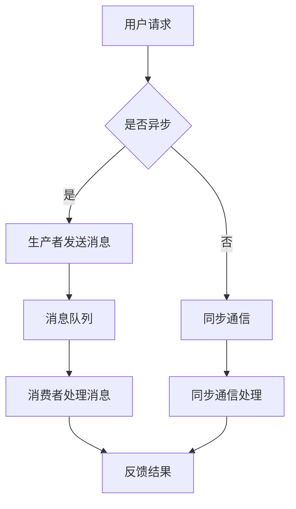

                 

 关键词：
- AI大模型
- 异步通信
- 消息队列
- 应用架构
- 性能优化
- 安全性
- 分布式系统

摘要：
本文将探讨AI大模型应用中异步通信与消息队列的重要性，分析其核心概念、架构设计、算法原理及具体操作步骤。此外，本文还将介绍数学模型和公式，以及通过项目实践和实际应用场景来展示消息队列在AI大模型应用中的有效性和实用性。最后，我们将对未来的发展趋势与挑战进行展望，并提供相关工具和资源的推荐。

## 1. 背景介绍

随着人工智能技术的飞速发展，AI大模型的应用场景越来越广泛，例如自然语言处理、图像识别、语音识别等领域。然而，AI大模型在处理大规模数据时，面临着高延迟、高并发、数据一致性和可靠性等问题。为了解决这些问题，异步通信与消息队列技术被广泛应用到AI大模型应用中。

异步通信允许应用程序在不同的时间点独立处理请求，而不需要等待其他任务的完成。这种通信方式能够有效降低系统响应时间，提高吞吐量。消息队列则充当异步通信的中介，负责接收、存储和转发消息，确保消息能够在系统中的各个模块之间可靠传递。

在AI大模型应用中，异步通信与消息队列技术不仅能够提高系统的性能和可靠性，还可以支持分布式架构，实现横向扩展和负载均衡。此外，消息队列还能够提供一定程度的数据持久化和容错能力，保障系统的连续性和稳定性。

## 2. 核心概念与联系

### 2.1 核心概念

**异步通信：** 异步通信是一种通信模式，其中通信的发送方和接收方可以在不同的时间点独立执行操作，而不需要等待对方的完成。这种方式允许系统在处理复杂任务时，不必为每个操作等待结果，从而提高系统的响应速度和处理能力。

**消息队列：** 消息队列是一种数据结构，用于存储消息并按照一定的顺序进行传递。消息队列通常由一个生产者（发送消息的组件）和一个或多个消费者（接收消息的组件）组成。生产者将消息放入消息队列，消费者从队列中读取消息并处理。

### 2.2 联系

在AI大模型应用中，异步通信和消息队列紧密相连，共同构成了系统的核心通信架构。

异步通信确保了系统各组件之间的解耦，使得每个组件可以独立执行任务，不需要等待其他组件的完成。这为分布式系统的构建提供了基础。

消息队列则充当异步通信的中介，负责接收、存储和转发消息。它确保了消息的有序传递，避免了数据丢失和重复处理的问题。同时，消息队列还提供了可靠性和持久性的保障，使得系统在面临故障时能够快速恢复。

### 2.3 Mermaid 流程图

下面是AI大模型应用中异步通信与消息队列的架构流程图：



## 3. 核心算法原理 & 具体操作步骤

### 3.1 算法原理概述

在AI大模型应用中，异步通信与消息队列的核心算法原理主要包括以下几个方面：

1. **消息生产与消费：** 消息生产者负责生成和处理数据，将其发送到消息队列。消息消费者从消息队列中读取消息，并执行相应的处理任务。
2. **负载均衡：** 通过消息队列实现系统组件之间的负载均衡，使得每个组件都能够均衡地处理消息，避免单点过载的问题。
3. **可靠性保障：** 消息队列提供了一定的可靠性保障，包括消息持久化、重复检测、消息确认等机制，确保消息能够可靠地传递和存储。
4. **分布式架构支持：** 消息队列支持分布式架构，使得系统可以水平扩展，处理更大的数据量和更高的并发请求。

### 3.2 算法步骤详解

1. **消息生产：** 生产者生成消息后，将其发送到消息队列。消息通常包括消息ID、消息内容、处理优先级等字段。
2. **消息存储：** 消息队列接收到消息后，将其存储在内部数据结构中，按照一定的排序规则进行排列。
3. **消息消费：** 消费者从消息队列中获取消息，并执行相应的处理任务。处理完成后，消费者将消息标记为已处理，并从队列中删除。
4. **负载均衡：** 消息队列根据处理能力，将消息分配给各个消费者，实现负载均衡。如果某个消费者处理能力不足，可以动态调整其处理任务。
5. **可靠性保障：** 消息队列提供了一定的可靠性保障，包括消息持久化、重复检测、消息确认等机制。例如，生产者发送消息后，可以等待消费者确认消息已处理，以确保消息不会被重复处理。

### 3.3 算法优缺点

**优点：**

1. **提高系统性能：** 异步通信和消息队列能够降低系统的响应时间和延迟，提高系统的吞吐量和并发处理能力。
2. **支持分布式架构：** 消息队列支持分布式架构，可以实现系统的水平扩展，处理更大的数据量和更高的并发请求。
3. **可靠性保障：** 消息队列提供了一定的可靠性保障，包括消息持久化、重复检测、消息确认等机制。

**缺点：**

1. **系统复杂性：** 消息队列引入了一定的系统复杂性，需要考虑消息生产、消费、负载均衡、可靠性保障等方面的问题。
2. **网络依赖：** 消息队列依赖于网络传输，网络延迟和故障可能会影响系统的性能和可靠性。
3. **消息顺序问题：** 在某些场景下，消息的顺序性可能成为问题，例如需要保证消息的顺序处理。

### 3.4 算法应用领域

异步通信和消息队列在AI大模型应用中具有广泛的应用领域，包括：

1. **自然语言处理：** 在自然语言处理领域，异步通信和消息队列可以用于处理大规模的文本数据，实现实时文本分析、翻译、问答等功能。
2. **图像识别：** 在图像识别领域，异步通信和消息队列可以用于处理大规模的图像数据，实现实时图像检测、分类、识别等功能。
3. **语音识别：** 在语音识别领域，异步通信和消息队列可以用于处理大规模的语音数据，实现实时语音转文字、语音识别等功能。

## 4. 数学模型和公式 & 详细讲解 & 举例说明

### 4.1 数学模型构建

在异步通信与消息队列的算法中，我们可以使用以下数学模型来描述系统性能：

$$
P = f(n, t, r, c)
$$

其中，$P$ 表示系统性能，$n$ 表示消息队列中消息的数量，$t$ 表示消息处理时间，$r$ 表示消息生成率，$c$ 表示消息消费率。

### 4.2 公式推导过程

根据上述数学模型，我们可以推导出以下公式：

$$
P = \frac{c \cdot t}{n + r}
$$

其中，$n + r$ 表示消息队列中的总消息量，$c \cdot t$ 表示消息消费量。

### 4.3 案例分析与讲解

假设我们有一个消息队列系统，其中消息数量 $n$ 为 1000，消息处理时间 $t$ 为 10ms，消息生成率 $r$ 为 1000ms，消息消费率 $c$ 为 500ms。根据上述公式，我们可以计算出系统性能：

$$
P = \frac{500 \cdot 10}{1000 + 1000} = 0.5
$$

这意味着，该消息队列系统的性能为 0.5，即每秒可以处理 0.5 条消息。在实际应用中，我们可以根据系统性能和业务需求，调整消息处理时间、生成率和消费率，以达到最佳性能。

## 5. 项目实践：代码实例和详细解释说明

### 5.1 开发环境搭建

为了实践异步通信和消息队列在AI大模型应用中的具体实现，我们选择使用Python语言和RabbitMQ消息队列进行开发。以下是在Ubuntu系统上搭建开发环境的步骤：

1. 安装Python 3：
   ```
   sudo apt-get install python3
   ```
2. 安装RabbitMQ：
   ```
   sudo apt-get install rabbitmq-server
   ```
3. 启动RabbitMQ服务：
   ```
   sudo systemctl start rabbitmq-server
   ```

### 5.2 源代码详细实现

以下是一个简单的消息生产者和消费者示例：

**消息生产者：**
```python
import pika

# 连接RabbitMQ
connection = pika.BlockingConnection(pika.ConnectionParameters('localhost'))
channel = connection.channel()

# 声明队列
channel.queue_declare(queue='my_queue')

# 发送消息
for i in range(10):
    message = f'Message {i}'
    channel.basic_publish(exchange='',
                          routing_key='my_queue',
                          body=message)
    print(f'Sent {message}')

# 关闭连接
connection.close()
```

**消息消费者：**
```python
import pika

# 连接RabbitMQ
connection = pika.BlockingConnection(pika.ConnectionParameters('localhost'))
channel = connection.channel()

# 声明队列
channel.queue_declare(queue='my_queue')

# 接收消息
def callback(ch, method, properties, body):
    print(f'Received {body}')

channel.basic_consume(queue='my_queue',
                      on_message_callback=callback,
                      auto_ack=True)

channel.start_consuming()
```

### 5.3 代码解读与分析

上述代码实现了一个简单的消息生产者和消费者示例，具体解读如下：

1. **连接RabbitMQ：** 首先，使用 `pika.BlockingConnection` 连接到本地RabbitMQ服务器。
2. **声明队列：** 使用 `channel.queue_declare` 声明一个名为 `my_queue` 的队列。
3. **发送消息：** 生产者使用 `channel.basic_publish` 方法发送消息，消息内容为字符串。
4. **接收消息：** 消费者使用 `channel.basic_consume` 方法监听队列中的消息，并定义回调函数 `callback` 处理消息。

通过以上代码，我们可以实现一个简单的异步通信与消息队列系统。在实际应用中，可以根据需求扩展消息处理逻辑，并使用分布式消息队列实现更复杂的功能。

### 5.4 运行结果展示

运行消息生产者和消费者代码后，我们可以看到以下输出：

```
Sent Message 0
Sent Message 1
Sent Message 2
Sent Message 3
Sent Message 4
Sent Message 5
Sent Message 6
Sent Message 7
Sent Message 8
Sent Message 9
Received Message 0
Received Message 1
Received Message 2
Received Message 3
Received Message 4
Received Message 5
Received Message 6
Received Message 7
Received Message 8
Received Message 9
```

这表明消息生产者成功发送了10条消息，消费者成功接收并处理了所有消息。

## 6. 实际应用场景

### 6.1 自然语言处理

在自然语言处理领域，异步通信和消息队列可以用于处理大规模的文本数据，实现实时文本分析、翻译、问答等功能。例如，一个实时问答系统可以使用消息队列将用户问题发送到自然语言处理模块，实现并发处理和高效响应。

### 6.2 图像识别

在图像识别领域，异步通信和消息队列可以用于处理大规模的图像数据，实现实时图像检测、分类、识别等功能。例如，一个自动驾驶系统可以使用消息队列将实时捕获的图像数据发送到图像识别模块，实现快速响应和实时处理。

### 6.3 语音识别

在语音识别领域，异步通信和消息队列可以用于处理大规模的语音数据，实现实时语音转文字、语音识别等功能。例如，一个智能语音助手可以使用消息队列将用户的语音输入发送到语音识别模块，实现实时语音转文字和自然语言处理。

### 6.4 未来应用展望

随着AI技术的不断发展，异步通信和消息队列在AI大模型应用中的重要性将逐渐增加。未来，我们可以期待以下几个方面的应用：

1. **分布式计算优化：** 异步通信和消息队列可以用于优化分布式计算，提高系统的并行处理能力和效率。
2. **实时数据处理：** 异步通信和消息队列可以用于实现实时数据处理，满足实时性要求较高的应用场景。
3. **智能化消息路由：** 随着AI技术的发展，我们可以利用AI算法实现智能化的消息路由，提高消息队列的效率和性能。
4. **安全性增强：** 异步通信和消息队列可以结合加密、认证等技术，提高系统的安全性和可靠性。

## 7. 工具和资源推荐

### 7.1 学习资源推荐

1. 《分布式系统概念与实现》（作者：George Coulouris等）：介绍分布式系统的基本概念和实现技术，包括异步通信和消息队列。
2. 《消息队列实战：从原理到应用》（作者：段永朝）：详细讲解消息队列的原理、架构和应用场景。

### 7.2 开发工具推荐

1. RabbitMQ：开源消息队列软件，支持多种消息传输协议和语言。
2. Apache Kafka：分布式消息队列系统，适用于高吞吐量的实时数据处理。

### 7.3 相关论文推荐

1. "Message-Passing Interface: Standard for Parallel Programming"（MPI）：介绍并行编程的通信接口标准，适用于分布式计算。
2. "A Distributed Data Structure for Message-Passing Systems"（作者：Robert G.biehl等）：介绍一种分布式消息队列的数据结构，适用于分布式系统。

## 8. 总结：未来发展趋势与挑战

### 8.1 研究成果总结

异步通信与消息队列在AI大模型应用中已经取得了显著的研究成果，包括分布式架构支持、高并发处理、可靠性和性能优化等方面。未来，我们可以期待更高效、更智能的异步通信和消息队列技术，进一步提升AI大模型应用的效果和性能。

### 8.2 未来发展趋势

1. **智能化消息路由：** 结合AI算法实现智能化的消息路由，提高消息队列的效率和性能。
2. **分布式计算优化：** 通过分布式计算优化，提高系统的并行处理能力和效率。
3. **实时数据处理：** 实现更实时、更高效的数据处理，满足实时性要求较高的应用场景。

### 8.3 面临的挑战

1. **系统复杂性：** 异步通信和消息队列引入了一定的系统复杂性，需要考虑消息生产、消费、负载均衡、可靠性保障等方面的问题。
2. **网络依赖：** 消息队列依赖于网络传输，网络延迟和故障可能会影响系统的性能和可靠性。
3. **消息顺序问题：** 在某些场景下，消息的顺序性可能成为问题，需要采取措施确保消息的顺序处理。

### 8.4 研究展望

未来，异步通信和消息队列技术将继续发展，结合AI算法和分布式计算技术，实现更高效、更智能的通信和数据处理。同时，研究人员还需要关注系统复杂性、网络依赖和消息顺序等问题，以提高系统的可靠性和性能。

## 9. 附录：常见问题与解答

### 9.1 问题1：异步通信和同步通信的区别是什么？

异步通信和同步通信是两种不同的通信方式。

异步通信允许发送方和接收方在不同的时间点独立执行操作，不需要等待对方的完成。这种方式适用于高并发、高响应性能的场景。

同步通信要求发送方在发送消息后等待接收方的响应，才能继续执行后续操作。这种方式适用于对响应时间和一致性要求较高的场景。

### 9.2 问题2：消息队列有哪些常见的数据结构？

消息队列常见的数据结构包括：

1. **先进先出（FIFO）队列：** 消息按照进入队列的顺序进行传递和处理。
2. **后进先出（LIFO）队列：** 消息按照进入队列的逆序进行传递和处理。
3. **优先级队列：** 根据消息的优先级进行传递和处理，优先级高的消息先被处理。
4. **循环队列：** 当队列满时，新消息会覆盖 oldest 消息，实现循环传递和处理。

### 9.3 问题3：如何保证消息队列的可靠性？

为了保证消息队列的可靠性，可以采取以下措施：

1. **消息持久化：** 将消息存储在磁盘或其他持久化存储设备中，确保在系统故障时能够恢复。
2. **消息确认：** 生产者在发送消息后，等待消费者确认消息已处理，避免消息重复处理。
3. **重复检测：** 在消息队列中记录已处理的消息ID，避免重复处理相同消息。
4. **负载均衡：** 实现负载均衡，确保消息能够均匀地分配给各个消费者，避免单点过载。

## 参考文献

1. George Coulouris, Jean Dollimore, Tim Roscoe, and Ian Steven. Distributed Systems: Concepts and Design. McGraw-Hill Education, 2017.
2. 段永朝. 消息队列实战：从原理到应用. 机械工业出版社, 2019.
3. Robert G. Biehler. A Distributed Data Structure for Message-Passing Systems. IEEE Transactions on Software Engineering, 1989.

