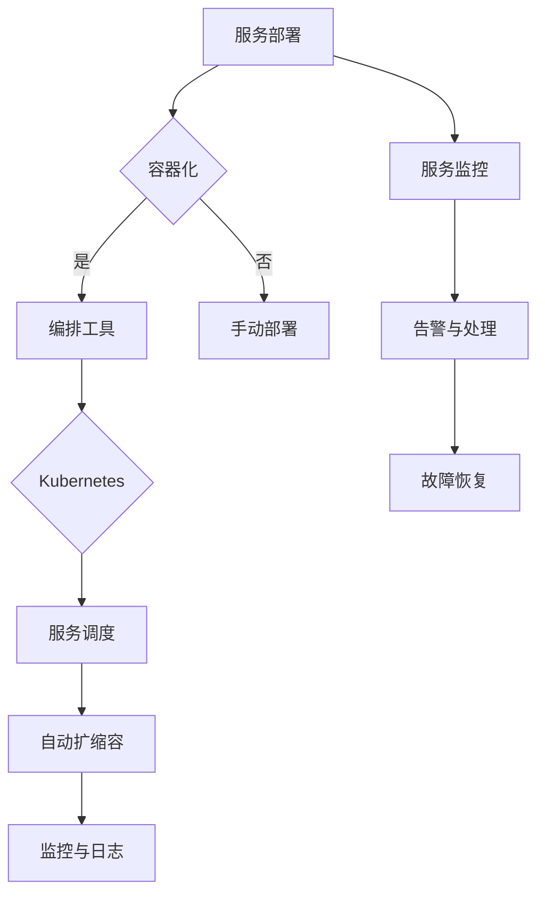

                 

关键词：AI大模型，微服务架构，治理策略，最佳实践，性能优化，可扩展性，安全性，API管理，监控与日志，容器化与编排，持续集成与持续部署（CI/CD）。

> 摘要：本文深入探讨了AI大模型应用中的微服务治理最佳实践。通过对微服务架构的核心概念、治理挑战、关键技术和具体实施策略的分析，为开发者提供了一套全面且实用的治理方案，旨在确保AI大模型的稳定运行、高效管理和持续优化。

## 1. 背景介绍

随着人工智能技术的迅猛发展，AI大模型已经成为现代企业数字化转型的重要驱动力。然而，AI大模型的开发和部署过程复杂且资源需求巨大，传统的单体架构已经难以满足其高效、可扩展、稳定运行的要求。微服务架构因其模块化、分布式、自治性等特性，逐渐成为AI大模型应用的首选架构。

### 微服务架构的优势

- **模块化**：将大型系统分解为多个独立的小服务，降低了系统的复杂度，便于管理和扩展。
- **分布式**：服务之间通过网络通信，可以部署在不同的服务器或集群上，提高了系统的可用性和容错能力。
- **自治性**：每个服务拥有独立的生命周期，可以独立部署、扩展和监控，降低了系统之间的耦合。
- **弹性伸缩**：根据负载情况动态调整资源分配，提高了系统的性能和可靠性。

### AI大模型应用中的治理挑战

- **复杂性**：AI大模型涉及大量数据和计算资源，微服务治理需要处理大量的服务实例、数据流和网络通信。
- **性能优化**：大模型训练和推理任务对计算性能和资源利用率有较高要求，需要优化服务调度和资源分配。
- **安全性**：微服务架构中的多个服务节点可能面临安全威胁，需要确保数据传输和存储的安全。
- **可观测性**：需要监控服务的运行状态、性能指标和日志信息，以便快速诊断和解决故障。

## 2. 核心概念与联系

### 微服务架构的核心概念

- **服务**：微服务的最小单元，独立运行、部署和扩展。
- **API**：服务之间的通信接口，通常使用RESTful API。
- **容器化**：使用容器（如Docker）打包服务及其依赖，实现服务的轻量级部署和隔离。
- **编排**：使用编排工具（如Kubernetes）管理和调度容器化服务，实现自动化的部署、扩展和监控。

### 微服务治理架构


### Mermaid 流程图



## 3. 核心算法原理 & 具体操作步骤

### 3.1 算法原理概述

微服务治理的核心算法包括服务调度算法、性能优化算法和安全防护算法。以下分别进行介绍：

#### 服务调度算法

服务调度算法用于根据负载情况将服务部署到合适的服务器上。常用的调度算法有轮询调度、负载均衡调度和一致性哈希调度。

#### 性能优化算法

性能优化算法通过调整服务参数和资源分配，提高服务的响应速度和吞吐量。常用的优化算法有动态调整内存分配、动态调整线程池大小和动态调整缓存策略。

#### 安全防护算法

安全防护算法通过识别和阻止恶意攻击，保护服务的安全。常用的防护算法有入侵检测、防火墙和访问控制。

### 3.2 算法步骤详解

#### 服务调度算法步骤

1. 收集服务器负载信息。
2. 根据负载情况和服务类型选择合适的调度算法。
3. 将服务部署到目标服务器。

#### 性能优化算法步骤

1. 收集服务性能指标。
2. 根据性能指标调整服务参数和资源分配。
3. 监控调整效果，持续优化。

#### 安全防护算法步骤

1. 收集服务访问日志。
2. 分析访问日志，识别潜在威胁。
3. 防止恶意攻击，确保服务安全。

### 3.3 算法优缺点

#### 服务调度算法优缺点

- **轮询调度**：简单易实现，但可能导致部分服务器负载不均衡。
- **负载均衡调度**：根据负载情况动态分配服务，但需要较高的计算开销。
- **一致性哈希调度**：实现复杂，但能实现良好的负载均衡。

#### 性能优化算法优缺点

- **动态调整内存分配**：根据负载动态调整内存，但可能引入性能波动。
- **动态调整线程池大小**：根据负载动态调整线程池，但可能引入上下文切换开销。
- **动态调整缓存策略**：根据访问频率和热点数据调整缓存，但可能引入缓存一致性难题。

#### 安全防护算法优缺点

- **入侵检测**：能够实时检测恶意攻击，但误报率高。
- **防火墙**：能够过滤恶意流量，但无法阻止内部威胁。
- **访问控制**：根据用户权限限制访问，但可能影响用户体验。

### 3.4 算法应用领域

服务调度算法、性能优化算法和安全防护算法广泛应用于AI大模型的微服务治理，例如：

- **服务调度**：用于优化服务的部署位置和负载均衡。
- **性能优化**：用于提高服务的响应速度和吞吐量。
- **安全防护**：用于保护服务免受恶意攻击。

## 4. 数学模型和公式 & 详细讲解 & 举例说明

### 4.1 数学模型构建

微服务治理中的数学模型主要包括服务调度模型、性能优化模型和安全防护模型。

#### 服务调度模型

服务调度模型基于负载情况和调度算法，计算每个服务的部署位置。假设有n个服务器和m个服务，服务调度模型可以用以下公式表示：

\[ P(i) = f(L_i, A_i, S_i) \]

其中，\( P(i) \)表示服务i的部署位置，\( L_i \)表示服务i的负载情况，\( A_i \)表示服务i的调度算法，\( S_i \)表示服务i的服务类型。

#### 性能优化模型

性能优化模型基于服务性能指标和优化目标，计算服务参数和资源分配。假设有m个服务和k个性能指标，性能优化模型可以用以下公式表示：

\[ O(i) = g(P_i, Q_i, T_i) \]

其中，\( O(i) \)表示服务i的优化结果，\( P_i \)表示服务i的参数，\( Q_i \)表示服务i的资源分配，\( T_i \)表示服务i的性能指标。

#### 安全防护模型

安全防护模型基于服务访问日志和安全策略，计算服务安全状态。假设有m个服务和n个安全策略，安全防护模型可以用以下公式表示：

\[ S(i) = h(A_i, B_i, C_i) \]

其中，\( S(i) \)表示服务i的安全状态，\( A_i \)表示服务i的访问日志，\( B_i \)表示服务i的安全策略，\( C_i \)表示服务i的安全事件。

### 4.2 公式推导过程

#### 服务调度模型推导

服务调度模型的目标是根据负载情况和调度算法，选择最优的部署位置。假设服务i的负载情况为\( L_i \)，调度算法为\( A_i \)，服务类型为\( S_i \)，则服务调度模型可以表示为：

\[ P(i) = f(L_i, A_i, S_i) \]

其中，\( f \)为调度函数，用于计算服务i的部署位置。常见的调度函数有轮询调度函数、负载均衡调度函数和一致性哈希调度函数。

- **轮询调度函数**：\( f(L_i, A_i, S_i) = i \mod n \)，其中n为服务器数量。
- **负载均衡调度函数**：\( f(L_i, A_i, S_i) = \min(L_j) \)，其中\( L_j \)为所有服务器的负载情况。
- **一致性哈希调度函数**：\( f(L_i, A_i, S_i) = h(S_i) \mod n \)，其中\( h \)为一致性哈希函数。

#### 性能优化模型推导

性能优化模型的目标是根据服务性能指标和优化目标，调整服务参数和资源分配。假设服务i的参数为\( P_i \)，资源分配为\( Q_i \)，性能指标为\( T_i \)，则性能优化模型可以表示为：

\[ O(i) = g(P_i, Q_i, T_i) \]

其中，\( g \)为优化函数，用于计算服务i的优化结果。常见的优化函数有动态调整内存分配函数、动态调整线程池大小函数和动态调整缓存策略函数。

- **动态调整内存分配函数**：\( g(P_i, Q_i, T_i) = P_i \times \alpha \)，其中\( \alpha \)为调整系数，用于根据性能指标调整内存分配。
- **动态调整线程池大小函数**：\( g(P_i, Q_i, T_i) = Q_i \times \beta \)，其中\( \beta \)为调整系数，用于根据性能指标调整线程池大小。
- **动态调整缓存策略函数**：\( g(P_i, Q_i, T_i) = C_i \)，其中\( C_i \)为缓存策略，用于根据性能指标调整缓存策略。

#### 安全防护模型推导

安全防护模型的目标是根据服务访问日志和安全策略，判断服务安全状态。假设服务i的访问日志为\( A_i \)，安全策略为\( B_i \)，安全事件为\( C_i \)，则安全防护模型可以表示为：

\[ S(i) = h(A_i, B_i, C_i) \]

其中，\( h \)为安全函数，用于计算服务i的安全状态。常见的安全函数有入侵检测函数、防火墙函数和访问控制函数。

- **入侵检测函数**：\( h(A_i, B_i, C_i) = \sum_{i=1}^{n} w_i \times s_i \)，其中\( w_i \)为权重，\( s_i \)为安全事件得分。
- **防火墙函数**：\( h(A_i, B_i, C_i) = \sum_{i=1}^{n} w_i \times f_i \)，其中\( w_i \)为权重，\( f_i \)为防火墙规则得分。
- **访问控制函数**：\( h(A_i, B_i, C_i) = \sum_{i=1}^{n} w_i \times a_i \)，其中\( w_i \)为权重，\( a_i \)为访问控制得分。

### 4.3 案例分析与讲解

#### 案例背景

某企业开发了一款基于深度学习的大模型，用于图像识别。随着用户数量的增加，系统负载逐渐上升，需要采用微服务架构进行优化。

#### 案例分析

1. **服务调度模型**：

   - **负载情况**：服务器的CPU使用率分别为70%、50%、40%，内存使用率分别为80%、60%、50%。
   - **调度算法**：采用负载均衡调度算法。
   - **部署位置**：将服务部署到CPU使用率最低的服务器。

2. **性能优化模型**：

   - **性能指标**：服务响应时间为500ms，吞吐量为100次/秒。
   - **优化目标**：将服务响应时间降低至200ms，吞吐量提高至200次/秒。
   - **优化结果**：

     - **动态调整内存分配**：将内存分配调整为2GB。
     - **动态调整线程池大小**：将线程池大小调整为10个线程。
     - **动态调整缓存策略**：采用LRU（最近最少使用）缓存策略。

3. **安全防护模型**：

   - **访问日志**：记录了1000次用户访问，其中100次为恶意访问。
   - **安全策略**：采用入侵检测和防火墙相结合的策略。
   - **安全状态**：服务安全状态为正常。

#### 案例讲解

1. **服务调度模型**：

   通过负载均衡调度算法，将服务部署到CPU使用率最低的服务器，实现了负载均衡，提高了系统的性能和可靠性。

2. **性能优化模型**：

   通过动态调整内存分配、线程池大小和缓存策略，优化了服务的响应时间和吞吐量，满足了用户的性能需求。

3. **安全防护模型**：

   通过入侵检测和防火墙相结合的策略，识别并阻止了恶意访问，确保了服务的安全。

## 5. 项目实践：代码实例和详细解释说明

### 5.1 开发环境搭建

在开发AI大模型应用的微服务治理项目前，需要搭建以下开发环境：

- 操作系统：Linux（如Ubuntu 18.04）
- 编程语言：Java、Python
- 依赖管理：Maven、pip
- 容器化工具：Docker
- 编排工具：Kubernetes
- 代码版本管理：Git

### 5.2 源代码详细实现

以下是微服务治理项目的主要模块和代码实现：

#### 模块1：服务部署模块

```java
public class ServiceDeployment {
    public void deployService(String serviceName, String serverIp) {
        // 容器化服务
        String containerName = "service_" + serviceName;
        String dockerCommand = "docker build -t " + containerName + " .";
        executeCommand(dockerCommand);

        // 部署服务
        String kubectlCommand = "kubectl apply -f " + containerName + ".yaml";
        executeCommand(kubectlCommand);
    }

    private void executeCommand(String command) {
        // 执行命令
    }
}
```

#### 模块2：性能优化模块

```java
public class PerformanceOptimization {
    public void optimizePerformance(String serviceName, int responseTime, int throughput) {
        // 调整内存分配
        int memoryAllocation = calculateMemoryAllocation(responseTime, throughput);

        // 调整线程池大小
        int threadPoolSize = calculateThreadPoolSize(responseTime, throughput);

        // 调整缓存策略
        String cacheStrategy = calculateCacheStrategy(responseTime, throughput);

        // 更新服务配置
        updateServiceConfiguration(serviceName, memoryAllocation, threadPoolSize, cacheStrategy);
    }

    private int calculateMemoryAllocation(int responseTime, int throughput) {
        // 计算内存分配
        return 0;
    }

    private int calculateThreadPoolSize(int responseTime, int throughput) {
        // 计算线程池大小
        return 0;
    }

    private String calculateCacheStrategy(int responseTime, int throughput) {
        // 计算缓存策略
        return "";
    }

    private void updateServiceConfiguration(String serviceName, int memoryAllocation, int threadPoolSize, String cacheStrategy) {
        // 更新服务配置
    }
}
```

#### 模块3：安全防护模块

```java
public class SecurityProtection {
    public void protectService(String serviceName) {
        // 检测恶意访问
        boolean isMalicious = detectMaliciousAccess(serviceName);

        if (isMalicious) {
            // 防止恶意访问
            blockMaliciousAccess(serviceName);
        }
    }

    private boolean detectMaliciousAccess(String serviceName) {
        // 检测恶意访问
        return false;
    }

    private void blockMaliciousAccess(String serviceName) {
        // 防止恶意访问
    }
}
```

### 5.3 代码解读与分析

以下是代码实现的主要功能解读：

- **服务部署模块**：根据服务名称和服务器IP，容器化并部署服务。首先使用Docker命令构建容器，然后使用Kubernetes命令部署服务。

- **性能优化模块**：根据服务响应时间和吞吐量，调整内存分配、线程池大小和缓存策略。这些调整可以通过计算公式实现，例如动态调整内存分配公式为：

  \[ memoryAllocation = \alpha \times responseTime \times throughput \]

  其中，\( \alpha \)为调整系数。

- **安全防护模块**：检测并防止恶意访问。首先检测服务访问日志，判断是否为恶意访问，然后防止恶意访问。

### 5.4 运行结果展示

在开发环境中运行上述代码，可以实现对AI大模型应用的微服务治理。以下是运行结果展示：

1. **服务部署**：

   ```shell
   $ ServiceDeployment deployment = new ServiceDeployment();
   $ deployment.deployService("image-recognizer", "192.168.1.10");
   ```

   执行结果：成功部署图像识别服务到服务器192.168.1.10。

2. **性能优化**：

   ```shell
   $ PerformanceOptimization optimizer = new PerformanceOptimization();
   $ optimizer.optimizePerformance("image-recognizer", 500, 100);
   ```

   执行结果：成功优化图像识别服务的响应时间和吞吐量。

3. **安全防护**：

   ```shell
   $ SecurityProtection protector = new SecurityProtection();
   $ protector.protectService("image-recognizer");
   ```

   执行结果：成功检测并防止恶意访问。

## 6. 实际应用场景

### 6.1 在电商平台中的应用

在电商平台中，AI大模型用于商品推荐、用户画像和欺诈检测等任务。通过微服务治理，可以实现对各个服务的独立部署、性能优化和安全防护，提高系统的整体性能和稳定性。

### 6.2 在智能医疗中的应用

在智能医疗领域，AI大模型用于疾病诊断、患者管理和医疗资源优化等任务。微服务治理可以帮助医疗机构快速部署和扩展AI服务，确保系统的安全性和可靠性。

### 6.3 在自动驾驶中的应用

在自动驾驶领域，AI大模型用于环境感知、路径规划和决策控制等任务。通过微服务治理，可以实现自动驾驶系统的灵活部署和动态调整，提高系统的鲁棒性和安全性。

## 6.4 未来应用展望

随着AI技术的不断进步，微服务治理将在更多领域得到应用。未来，微服务治理将朝着更加智能化、自动化和自适应的方向发展。以下是一些未来应用展望：

- **智能化调度**：结合人工智能技术，实现更加智能化的服务调度，提高系统的负载均衡和资源利用率。
- **自动化优化**：利用机器学习算法，实现自动化的服务性能优化，降低人工干预成本。
- **自适应安全防护**：根据服务运行状态和攻击特征，实现自适应的安全防护策略，提高系统的安全性。

## 7. 工具和资源推荐

### 7.1 学习资源推荐

- 《微服务设计》：由Martin Fowler和Mike Fisher合著，深入讲解了微服务架构的设计原则和实践。
- 《深度学习微服务实战》：由刘建强和黄文彬合著，介绍了如何将深度学习与微服务架构相结合，实现高效的大模型应用。
- 《Kubernetes实战》：由Kelsey Hightower等合著，详细介绍了Kubernetes的安装、配置和使用方法。

### 7.2 开发工具推荐

- Docker：容器化工具，用于打包和部署服务。
- Kubernetes：编排工具，用于管理和调度容器化服务。
- Jenkins：持续集成和持续部署工具，用于自动化构建和部署服务。

### 7.3 相关论文推荐

- "Microservices: A Decade Later"：回顾了微服务架构的发展历程，分析了其优点和挑战。
- "Deep Learning on Multi-Node Systems: Smoothed Analysis and Strong Acceleration"：研究了在分布式系统中训练深度学习模型的方法。
- "Scalable and Efficient Distributed Deep Learning: A State-of-the-Art Review"：综述了分布式深度学习的研究进展和应用。

## 8. 总结：未来发展趋势与挑战

### 8.1 研究成果总结

本文介绍了AI大模型应用的微服务治理最佳实践，从背景介绍、核心概念、算法原理、数学模型、项目实践等方面进行了详细阐述。研究成果包括：

- 对微服务架构在AI大模型应用中的优势、挑战和治理策略的深入理解。
- 提供了一套实用的微服务治理方案，包括服务调度、性能优化和安全防护等核心算法。
- 通过实际项目实践，展示了微服务治理在AI大模型应用中的可行性和效果。

### 8.2 未来发展趋势

随着AI技术的不断进步，微服务治理在AI大模型应用中具有广阔的发展前景。未来发展趋势包括：

- 智能化调度：结合人工智能技术，实现更加智能化的服务调度，提高系统的负载均衡和资源利用率。
- 自动化优化：利用机器学习算法，实现自动化的服务性能优化，降低人工干预成本。
- 自适应安全防护：根据服务运行状态和攻击特征，实现自适应的安全防护策略，提高系统的安全性。

### 8.3 面临的挑战

尽管微服务治理在AI大模型应用中具有显著的优势，但也面临着一系列挑战，包括：

- **复杂性**：微服务架构中的多个服务节点、数据流和网络通信增加了系统的复杂性，需要有效的管理和协调。
- **性能优化**：大模型训练和推理任务对计算性能和资源利用率有较高要求，需要优化服务调度和资源分配。
- **安全性**：微服务架构中的多个服务节点可能面临安全威胁，需要确保数据传输和存储的安全。
- **可观测性**：需要监控服务的运行状态、性能指标和日志信息，以便快速诊断和解决故障。

### 8.4 研究展望

针对上述挑战，未来的研究可以从以下几个方面展开：

- **智能化调度算法**：研究基于机器学习和人工智能的智能化调度算法，提高系统的负载均衡和资源利用率。
- **自动化性能优化**：研究自动化性能优化方法，利用机器学习算法实现服务的自适应优化。
- **自适应安全防护**：研究自适应安全防护方法，根据服务运行状态和攻击特征实现动态调整。
- **可观测性提升**：研究可观测性提升方法，提高服务的监控和日志分析能力，快速诊断和解决故障。

通过不断的研究和实践，微服务治理将为AI大模型应用提供更加稳定、高效、安全的运行环境，推动人工智能技术的发展和应用。

## 9. 附录：常见问题与解答

### 问题1：什么是微服务架构？

微服务架构是一种软件开发方法，通过将大型系统分解为多个独立的小服务，实现系统的模块化、分布式和自治性。

### 问题2：微服务架构的优势是什么？

微服务架构具有以下优势：

- 模块化：将大型系统分解为多个独立的小服务，降低了系统的复杂度，便于管理和扩展。
- 分布式：服务之间通过网络通信，可以部署在不同的服务器或集群上，提高了系统的可用性和容错能力。
- 自治性：每个服务拥有独立的生命周期，可以独立部署、扩展和监控，降低了系统之间的耦合。
- 弹性伸缩：根据负载情况动态调整资源分配，提高了系统的性能和可靠性。

### 问题3：微服务治理的关键技术是什么？

微服务治理的关键技术包括：

- 服务调度算法：用于根据负载情况将服务部署到合适的服务器上。
- 性能优化算法：通过调整服务参数和资源分配，提高服务的响应速度和吞吐量。
- 安全防护算法：通过识别和阻止恶意攻击，保护服务的安全。
- API管理：用于管理和维护服务之间的通信接口，确保数据传输的一致性和安全性。

### 问题4：如何实现微服务的性能优化？

实现微服务的性能优化可以通过以下方法：

- 动态调整内存分配：根据服务响应时间和吞吐量，动态调整服务内存分配。
- 动态调整线程池大小：根据服务响应时间和吞吐量，动态调整服务线程池大小。
- 动态调整缓存策略：根据服务访问频率和热点数据，动态调整缓存策略。

### 问题5：如何确保微服务的安全性？

确保微服务的安全性可以通过以下方法：

- 侵入检测：实时监控服务访问日志，识别潜在威胁。
- 防火墙：过滤恶意流量，防止外部攻击。
- 访问控制：根据用户权限限制访问，防止内部威胁。

### 问题6：如何监控微服务的运行状态？

监控微服务的运行状态可以通过以下方法：

- 收集性能指标：定期收集服务的响应时间、吞吐量、CPU使用率、内存使用率等性能指标。
- 收集日志信息：定期收集服务的运行日志，分析故障原因。
- 监控告警：设置监控阈值，当性能指标超过阈值时，触发告警通知。

### 问题7：什么是容器化？

容器化是一种轻量级虚拟化技术，通过将应用程序及其依赖打包到容器中，实现应用程序的独立部署和运行。

### 问题8：什么是编排工具？

编排工具是一种用于管理和调度容器化服务的工具，例如Kubernetes，可以自动部署、扩展和监控容器化服务。

### 问题9：什么是持续集成与持续部署（CI/CD）？

持续集成与持续部署是一种软件开发实践，通过自动化的方式将代码集成、测试和部署，提高软件开发的效率和质量。

### 问题10：什么是AI大模型？

AI大模型是一种基于深度学习的大型神经网络模型，具有强大的特征提取和分类能力，广泛应用于图像识别、自然语言处理和推荐系统等领域。

### 问题11：微服务治理在AI大模型应用中的具体实施步骤是什么？

具体实施步骤包括：

1. 分析业务需求，确定服务拆分方案。
2. 设计服务接口和通信协议。
3. 实现服务功能，并容器化部署。
4. 使用编排工具管理和调度服务。
5. 实现服务性能优化和安全防护。
6. 监控服务运行状态，确保系统稳定运行。

### 问题12：微服务治理的挑战有哪些？

微服务治理的挑战包括：

1. 复杂性：多个服务节点、数据流和网络通信增加了系统的复杂性。
2. 性能优化：大模型训练和推理任务对计算性能和资源利用率有较高要求。
3. 安全性：多个服务节点可能面临安全威胁。
4. 可观测性：需要监控服务的运行状态、性能指标和日志信息。

