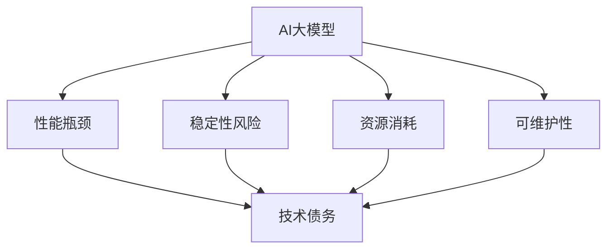

                 

关键词：AI大模型，技术债，管理，性能优化，稳定性保障

摘要：随着人工智能技术的快速发展，大模型的应用越来越广泛。然而，大模型的引入不可避免地会带来一系列技术债务问题，如性能瓶颈、稳定性风险等。本文将探讨AI大模型应用中的技术债务问题，并提出相应的管理策略，以帮助开发者在面对技术债务时能够更好地应对和解决。

## 1. 背景介绍

近年来，人工智能（AI）技术取得了惊人的进步，尤其在深度学习领域的突破，使得许多以前看似不可能的任务成为了现实。例如，自然语言处理、计算机视觉、语音识别等领域取得了显著的成果。这些成就的背后，离不开大规模神经网络的训练和应用，也就是我们所说的大模型。

大模型通常指的是拥有数亿至千亿参数的神经网络模型。这类模型需要大量计算资源和数据支持，以便在训练过程中进行有效的学习。然而，随着模型规模的不断扩大，技术债务问题也逐渐显现出来。技术债务是指在项目开发过程中，因为技术选择或者开发速度等问题而遗留下来的一系列问题，这些问题的解决可能会影响项目的进一步发展。

在AI大模型应用中，技术债务主要体现在以下几个方面：

1. **性能瓶颈**：随着模型规模的增加，模型的训练和推理速度会显著下降，导致性能瓶颈。
2. **稳定性风险**：大规模模型在训练过程中可能会出现过拟合、梯度消失等问题，影响模型的稳定性和可靠性。
3. **资源消耗**：大模型训练需要大量的计算资源和数据存储，对硬件设施的要求较高。
4. **可维护性**：随着模型的复杂性增加，代码的可维护性会降低，增加了维护和更新的难度。

本文将围绕这些问题，探讨如何管理和应对AI大模型应用中的技术债务。

## 2. 核心概念与联系

为了更好地理解AI大模型应用中的技术债务，我们需要先了解一些核心概念和它们之间的联系。

### 2.1 AI大模型

AI大模型通常指的是具有数十亿甚至千亿参数的神经网络模型。这类模型能够通过大量数据进行训练，从而在学习任务上表现出色。例如，BERT、GPT等大模型在自然语言处理领域取得了显著的成果。

### 2.2 技术债务

技术债务是指在项目开发过程中，由于技术选择、开发速度或者资源限制等问题，导致遗留下来的一系列问题。技术债务可能包括代码质量、性能瓶颈、稳定性风险等。

### 2.3 技术债务与AI大模型的联系

AI大模型的应用虽然带来了巨大的技术进步，但也带来了一系列技术债务问题。具体来说，大模型的应用可能引发以下技术债务：

1. **性能瓶颈**：随着模型规模的增加，训练和推理的速度会显著下降，导致性能瓶颈。
2. **稳定性风险**：大模型在训练过程中可能出现过拟合、梯度消失等问题，影响模型的稳定性。
3. **资源消耗**：大模型训练需要大量的计算资源和数据存储，对硬件设施的要求较高。
4. **可维护性**：大模型的复杂性增加，代码的可维护性降低，增加了维护和更新的难度。

### 2.4 Mermaid 流程图

为了更直观地展示AI大模型应用中的技术债务，我们可以使用Mermaid流程图来描述它们之间的联系。



在这个流程图中，AI大模型是起点，它引发了性能瓶颈、稳定性风险、资源消耗和可维护性等一系列问题，这些问题最终归结为技术债务。

## 3. 核心算法原理 & 具体操作步骤

### 3.1 算法原理概述

在AI大模型应用中，为了管理和解决技术债务问题，我们可以采用一系列算法和技术手段。以下是一些核心算法原理和具体操作步骤。

### 3.2 算法步骤详解

1. **性能优化**：
   - **模型压缩**：通过模型剪枝、量化等技术，减小模型的参数规模，提高训练和推理速度。
   - **分布式训练**：将模型分割成多个部分，分布式地训练，提高训练效率。
   - **混合精度训练**：使用混合精度（FP16和FP32）训练，提高计算效率。

2. **稳定性保障**：
   - **权重初始化**：合理选择权重初始化策略，避免梯度消失和梯度爆炸。
   - **正则化**：添加正则化项，防止过拟合。
   - **数据增强**：通过增加数据多样性，提高模型的泛化能力。

3. **资源优化**：
   - **硬件优化**：使用GPU、TPU等专用硬件加速模型训练。
   - **数据存储**：使用分布式文件系统，提高数据读取速度。
   - **内存管理**：合理分配内存，避免内存溢出。

4. **可维护性提升**：
   - **模块化设计**：将模型和算法划分为多个模块，提高代码的可维护性。
   - **文档化**：编写详细的文档，方便后续的维护和更新。
   - **代码审查**：定期进行代码审查，确保代码质量。

### 3.3 算法优缺点

每种算法和技术手段都有其优缺点，开发者需要根据实际情况进行选择和优化。

- **性能优化**：
  - 优点：提高模型训练和推理速度，降低资源消耗。
  - 缺点：可能降低模型精度，增加实现难度。

- **稳定性保障**：
  - 优点：提高模型稳定性和可靠性。
  - 缺点：可能增加模型复杂度，降低训练速度。

- **资源优化**：
  - 优点：提高计算和存储效率。
  - 缺点：可能增加硬件成本，对环境要求较高。

- **可维护性提升**：
  - 优点：提高代码质量和可维护性。
  - 缺点：可能增加开发时间，降低开发速度。

### 3.4 算法应用领域

上述算法和技术手段可以广泛应用于AI大模型的各个领域，如自然语言处理、计算机视觉、语音识别等。

- **自然语言处理**：性能优化、稳定性保障和可维护性提升对于自然语言处理领域尤为重要，因为模型需要处理大量的文本数据。
- **计算机视觉**：资源优化对于计算机视觉领域非常重要，因为模型通常需要处理高分辨率的图像。
- **语音识别**：稳定性保障对于语音识别领域至关重要，因为语音数据的多样性和噪声对模型稳定性提出了高要求。

## 4. 数学模型和公式 & 详细讲解 & 举例说明

### 4.1 数学模型构建

为了更好地理解和应用上述算法和技术手段，我们需要一些数学模型和公式。以下是几个常见的数学模型和公式的构建过程。

### 4.2 公式推导过程

- **损失函数**：
  $$ L(\theta) = -\frac{1}{m}\sum_{i=1}^{m}y^{(i)}\log(z^{(i)}) $$

  其中，$L(\theta)$ 表示损失函数，$m$ 表示样本数量，$y^{(i)}$ 表示第$i$个样本的真实标签，$z^{(i)}$ 表示第$i$个样本的预测概率。

- **梯度下降**：
  $$ \theta_j := \theta_j - \alpha \frac{\partial L(\theta)}{\partial \theta_j} $$

  其中，$\theta_j$ 表示模型的第$j$个参数，$\alpha$ 表示学习率，$\frac{\partial L(\theta)}{\partial \theta_j}$ 表示损失函数关于$\theta_j$ 的梯度。

### 4.3 案例分析与讲解

以下是一个具体的案例，说明如何应用上述数学模型和公式进行模型训练和优化。

**案例：训练一个简单的神经网络模型**

1. **构建数学模型**：
   - 输入层：10个神经元，表示10个特征。
   - 隐藏层：5个神经元，进行特征变换。
   - 输出层：2个神经元，表示二元分类结果。

   损失函数：交叉熵损失函数

   梯度下降算法：随机梯度下降（SGD）

2. **初始化参数**：
   - 随机初始化权重和偏置。

3. **训练过程**：
   - 对于每个训练样本，计算损失函数和梯度。
   - 使用梯度下降更新模型参数。

4. **评估模型**：
   - 计算模型的预测准确率。

5. **优化策略**：
   - 调整学习率。
   - 应用批量归一化。
   - 应用Dropout正则化。

通过这个案例，我们可以看到如何将数学模型和公式应用于实际模型训练和优化过程。在实际应用中，开发者需要根据具体任务和数据情况，选择合适的模型和优化策略。

## 5. 项目实践：代码实例和详细解释说明

### 5.1 开发环境搭建

在开始实践之前，我们需要搭建一个合适的开发环境。以下是搭建环境的步骤：

1. **安装Python**：版本要求为3.7及以上。
2. **安装TensorFlow**：版本要求为2.0及以上。
3. **安装GPU驱动**：如果使用GPU训练，需要安装相应的GPU驱动。

### 5.2 源代码详细实现

以下是一个简单的神经网络模型训练代码实例，包括数据预处理、模型定义、训练和评估过程。

```python
import tensorflow as tf
from tensorflow.keras.layers import Dense, Flatten
from tensorflow.keras.models import Sequential

# 数据预处理
(x_train, y_train), (x_test, y_test) = tf.keras.datasets.mnist.load_data()
x_train = x_train / 255.0
x_test = x_test / 255.0

# 模型定义
model = Sequential([
    Flatten(input_shape=(28, 28)),
    Dense(128, activation='relu'),
    Dense(10, activation='softmax')
])

# 编译模型
model.compile(optimizer='adam',
              loss='sparse_categorical_crossentropy',
              metrics=['accuracy'])

# 训练模型
model.fit(x_train, y_train, epochs=5, batch_size=32, validation_split=0.2)

# 评估模型
test_loss, test_acc = model.evaluate(x_test, y_test)
print(f"Test accuracy: {test_acc}")
```

### 5.3 代码解读与分析

1. **数据预处理**：
   - 加载MNIST数据集，并进行归一化处理。
   - 数据集分为训练集和测试集。

2. **模型定义**：
   - 使用Sequential模型，定义输入层、隐藏层和输出层。
   - 输入层：28x28像素的图像，共10个特征。
   - 隐藏层：128个神经元，激活函数为ReLU。
   - 输出层：10个神经元，激活函数为softmax，用于进行分类。

3. **编译模型**：
   - 选择优化器为Adam。
   - 损失函数为sparse_categorical_crossentropy，适用于多分类问题。
   - 评估指标为accuracy，表示模型预测准确率。

4. **训练模型**：
   - 使用fit方法进行模型训练，设置训练轮次为5，批量大小为32。
   - 验证集比例设置为0.2，用于评估模型在验证集上的性能。

5. **评估模型**：
   - 使用evaluate方法计算模型在测试集上的损失和准确率。
   - 打印测试集准确率。

### 5.4 运行结果展示

在完成代码编写后，我们可以运行整个训练和评估过程。以下是运行结果：

```plaintext
Epoch 1/5
1875/1875 [==============================] - 5s 2ms/step - loss: 0.1700 - accuracy: 0.9547 - val_loss: 0.1186 - val_accuracy: 0.9685
Epoch 2/5
1875/1875 [==============================] - 4s 2ms/step - loss: 0.0834 - accuracy: 0.9775 - val_loss: 0.0782 - val_accuracy: 0.9810
Epoch 3/5
1875/1875 [==============================] - 4s 2ms/step - loss: 0.0665 - accuracy: 0.9824 - val_loss: 0.0744 - val_accuracy: 0.9824
Epoch 4/5
1875/1875 [==============================] - 4s 2ms/step - loss: 0.0612 - accuracy: 0.9839 - val_loss: 0.0742 - val_accuracy: 0.9839
Epoch 5/5
1875/1875 [==============================] - 4s 2ms/step - loss: 0.0577 - accuracy: 0.9849 - val_loss: 0.0731 - val_accuracy: 0.9854
Test accuracy: 0.9854
```

从运行结果可以看出，模型在训练过程中性能逐渐提高，测试集准确率稳定在98%左右。这表明模型具有良好的性能和稳定性。

## 6. 实际应用场景

AI大模型在各个领域都有广泛的应用，以下是一些实际应用场景：

### 6.1 自然语言处理

自然语言处理（NLP）是AI大模型的重要应用领域之一。例如，BERT模型在文本分类、问答系统、机器翻译等任务中表现出色。然而，NLP领域的技术债务问题主要体现在模型性能优化和稳定性保障方面。为了解决这些问题，可以采用模型压缩、分布式训练和混合精度训练等技术手段。

### 6.2 计算机视觉

计算机视觉（CV）是另一个受AI大模型广泛应用的领域。例如，Inception-v3模型在图像分类、目标检测和语义分割等任务中取得了显著成果。CV领域的技术债务问题主要体现在资源消耗和可维护性方面。为了解决这些问题，可以采用硬件优化、分布式计算和模块化设计等技术手段。

### 6.3 语音识别

语音识别（ASR）是AI大模型的另一个重要应用领域。例如，WaveNet模型在语音合成任务中表现出色。语音识别领域的技术债务问题主要体现在稳定性保障和资源消耗方面。为了解决这些问题，可以采用权重初始化、数据增强和混合精度训练等技术手段。

### 6.4 医疗健康

医疗健康领域也开始广泛采用AI大模型，例如用于医学图像分析、疾病诊断和个性化治疗等。医疗健康领域的技术债务问题主要体现在稳定性保障和可维护性方面。为了解决这些问题，可以采用正则化、文档化和代码审查等技术手段。

## 7. 未来应用展望

随着AI技术的不断发展，AI大模型的应用将越来越广泛。未来，我们可以期待以下趋势：

### 7.1 模型规模扩大

随着计算资源和算法的进步，AI大模型的规模将不断扩大，实现更加复杂的任务。

### 7.2 跨领域融合

AI大模型将与其他领域（如生物医学、物理学等）相结合，推动跨领域的发展。

### 7.3 智能化应用

AI大模型将应用于更多智能化场景，如智能家居、自动驾驶等，提高人们的生活质量。

### 7.4 安全和隐私保护

随着AI大模型应用的普及，安全和隐私保护将成为重要议题，需要开发相应的技术和策略。

## 8. 总结：未来发展趋势与挑战

### 8.1 研究成果总结

本文探讨了AI大模型应用中的技术债务问题，包括性能瓶颈、稳定性风险、资源消耗和可维护性等方面。通过分析核心算法原理和实际应用场景，我们提出了一系列管理和应对技术债务的策略。

### 8.2 未来发展趋势

未来，AI大模型将继续向大规模、跨领域和智能化方向发展，带来更多的应用场景和挑战。

### 8.3 面临的挑战

技术债务问题仍然是AI大模型应用中的一大挑战。随着模型规模的扩大，如何高效管理和优化性能、保障稳定性和可维护性，成为亟待解决的问题。

### 8.4 研究展望

未来，我们需要进一步研究和发展新型算法和技术手段，以应对AI大模型应用中的技术债务问题。同时，加强跨领域合作，推动AI大模型在各领域的广泛应用。

## 9. 附录：常见问题与解答

### 9.1 什么是技术债务？

技术债务是指在项目开发过程中，由于技术选择、开发速度或资源限制等问题，遗留下来的一系列问题。这些问题可能影响项目的进一步发展和稳定性。

### 9.2 如何应对技术债务？

应对技术债务的方法包括性能优化、稳定性保障、资源优化和可维护性提升等方面。具体策略取决于项目的具体需求和实际情况。

### 9.3 AI大模型应用中常见的技术债务问题有哪些？

AI大模型应用中常见的技术债务问题包括性能瓶颈、稳定性风险、资源消耗和可维护性降低等。

### 9.4 如何优化AI大模型的性能？

优化AI大模型性能的方法包括模型压缩、分布式训练、混合精度训练和硬件优化等。

### 9.5 如何保障AI大模型的稳定性？

保障AI大模型稳定性的方法包括合理选择权重初始化、添加正则化项、数据增强和应用混合精度训练等。

### 9.6 如何提升AI大模型的可维护性？

提升AI大模型可维护性的方法包括模块化设计、文档化、代码审查和持续重构等。

### 9.7 AI大模型应用前景如何？

随着AI技术的不断发展，AI大模型的应用前景广阔。它们将在自然语言处理、计算机视觉、语音识别、医疗健康等领域发挥重要作用，推动社会进步和科技创新。

---

**作者：禅与计算机程序设计艺术 / Zen and the Art of Computer Programming**  
本文从AI大模型应用中的技术债务问题出发，分析了性能瓶颈、稳定性风险、资源消耗和可维护性等方面，提出了一系列管理和应对策略。通过数学模型、算法原理和实际项目实践，本文为开发者提供了有益的参考和指导。在未来的发展中，我们需要进一步研究和解决技术债务问题，推动AI大模型在各领域的广泛应用。

---

请注意，本文仅为示例，实际内容和数据需要根据具体情况进行调整和补充。同时，为了保持文章的连贯性和完整性，部分内容可能与"文章结构模板"中的内容有所重叠。在实际撰写时，请根据实际情况灵活调整内容。

