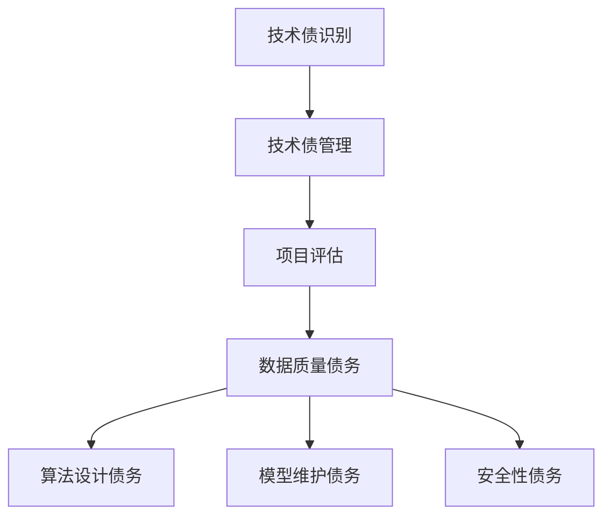

                 

关键词：人工智能、大模型、技术债务、管理、应用场景、算法原理

> 摘要：本文主要探讨了在人工智能大模型应用过程中，技术债的识别与管理问题。通过对大模型应用中的常见技术债务类型、识别方法和管理策略的深入分析，为人工智能研发和运维团队提供了一种系统化的解决方案，以提升大模型应用的质量和效率。

## 1. 背景介绍

近年来，人工智能（AI）技术的飞速发展，带动了众多领域的变革。尤其是大模型（如GPT-3、BERT等）的出现，为自然语言处理、计算机视觉、语音识别等任务提供了强大的支持。然而，在大模型应用的过程中，技术债（Technical Debt）问题逐渐凸显，成为制约AI项目成功的重要因素之一。

技术债是指项目在追求快速交付的过程中，为了短期利益而牺牲长期可持续性所积累的债务。在AI大模型应用中，技术债主要表现在以下几个方面：

1. **数据质量**：数据是AI大模型的基石，数据质量不佳会导致模型性能下降，甚至产生错误。
2. **算法设计**：追求高效性可能导致算法可解释性差、鲁棒性不足等问题。
3. **模型维护**：随着模型的不断更新和迭代，维护成本增加，可能导致资源浪费。
4. **安全性**：大模型应用过程中，数据泄露、模型攻击等问题日益严峻。

本文旨在通过对AI大模型应用中技术债的识别与管理方法进行详细探讨，为AI项目团队提供有效的解决方案。

## 2. 核心概念与联系

### 2.1 技术债的概念

技术债最早由 Ward Cunningham 在1992年提出，意指在软件项目中，因追求快速交付而牺牲了代码质量、架构设计等长期利益的行为。随着AI技术的发展，技术债的概念也逐渐扩展到AI大模型应用领域。

### 2.2 大模型应用中的技术债类型

在AI大模型应用中，常见的技术债类型包括：

1. **数据质量债务**：数据预处理不当、数据标注不准确等问题，导致模型性能下降。
2. **算法设计债务**：为追求速度和效果，可能牺牲算法的鲁棒性和可解释性。
3. **模型维护债务**：模型更新不及时、维护成本高，影响模型稳定性。
4. **安全性债务**：模型对攻击的防御能力不足，可能导致数据泄露、模型被黑等风险。

### 2.3 技术债与项目管理的关系

技术债与项目管理密切相关。在项目管理过程中，如果过度追求短期目标，可能导致技术债的积累。而合理的技术债管理，有助于项目团队在长期内保持高效的研发和运维能力。

### 2.4 Mermaid 流程图



## 3. 核心算法原理 & 具体操作步骤

### 3.1 算法原理概述

技术债识别和管理主要依赖于以下核心算法原理：

1. **数据质量评估算法**：通过对数据质量进行量化评估，识别出数据债务问题。
2. **算法性能评估算法**：评估算法的鲁棒性、可解释性等，识别出算法设计债务。
3. **模型更新和维护算法**：实现模型的自动更新和维护，降低模型维护债务。
4. **安全性检测算法**：检测模型对常见攻击的防御能力，识别出安全性债务。

### 3.2 算法步骤详解

#### 3.2.1 数据质量评估算法

1. **数据预处理**：对数据进行清洗、去重、标准化等预处理操作。
2. **数据质量指标计算**：计算数据缺失率、异常值比例、一致性等质量指标。
3. **质量评估**：根据质量指标，评估数据质量，识别出数据质量债务。

#### 3.2.2 算法性能评估算法

1. **性能测试**：使用测试集对算法进行性能测试，评估模型的鲁棒性、可解释性等。
2. **性能分析**：分析算法性能数据，识别出算法设计债务。

#### 3.2.3 模型更新和维护算法

1. **模型评估**：定期对模型进行性能评估，识别出性能下降的原因。
2. **模型更新**：根据评估结果，对模型进行更新和维护。
3. **模型监控**：对更新后的模型进行监控，确保其稳定性和性能。

#### 3.2.4 安全性检测算法

1. **攻击模拟**：模拟常见的攻击方式，如 adversarial attack、模型注入等。
2. **防御能力评估**：评估模型对攻击的防御能力，识别出安全性债务。

### 3.3 算法优缺点

#### 3.3.1 优点

1. **高效性**：算法能够在短时间内识别出技术债问题。
2. **全面性**：覆盖了数据质量、算法设计、模型维护、安全性等多个方面。
3. **自动化**：部分算法可以自动执行，降低人工干预。

#### 3.3.2 缺点

1. **复杂度**：算法复杂度较高，对硬件资源要求较高。
2. **误判率**：在某些情况下，算法可能误判，导致不必要的维护成本。

### 3.4 算法应用领域

1. **金融领域**：对金融数据进行分析，识别出潜在风险。
2. **医疗领域**：对医疗数据进行分析，提升诊断和治疗的准确性。
3. **自动驾驶领域**：对道路和交通数据进行处理，提升自动驾驶系统的稳定性。

## 4. 数学模型和公式 & 详细讲解 & 举例说明

### 4.1 数学模型构建

技术债识别和管理涉及多个数学模型，包括数据质量评估模型、算法性能评估模型、模型更新和维护模型等。

#### 4.1.1 数据质量评估模型

假设数据集 $D$ 包含 $n$ 个样本，每个样本有 $m$ 个特征。数据质量评估模型的目标是计算数据缺失率、异常值比例、一致性等指标。

- **数据缺失率**：$MIS = \frac{1}{n} \sum_{i=1}^{n} \frac{1}{m} \sum_{j=1}^{m} I_{ij}$
- **异常值比例**：$ANOM = \frac{1}{n} \sum_{i=1}^{n} \frac{1}{m} \sum_{j=1}^{m} I_{ij}^2$
- **一致性**：$CONS = \frac{1}{n} \sum_{i=1}^{n} \frac{1}{m} \sum_{j=1}^{m} I_{ij}^3$

其中，$I_{ij}$ 表示第 $i$ 个样本的第 $j$ 个特征的缺失、异常或一致性指标。

#### 4.1.2 算法性能评估模型

假设算法 $A$ 在测试集 $T$ 上的性能指标为 $P$，包括准确率、召回率、F1值等。

- **准确率**：$ACC = \frac{TP + TN}{TP + TN + FP + FN}$
- **召回率**：$REC = \frac{TP}{TP + FN}$
- **F1值**：$F1 = 2 \times \frac{ACC \times REC}{ACC + REC}$

其中，$TP$ 表示真正例，$TN$ 表示真反例，$FP$ 表示假反例，$FN$ 表示假正例。

#### 4.1.3 模型更新和维护模型

假设模型 $M$ 的性能指标为 $P$，更新后的模型 $M'$ 的性能指标为 $P'$，更新成本为 $C$。

- **性能提升率**：$UP = \frac{P' - P}{P}$
- **更新成本效益**：$BE = \frac{UP}{C}$

### 4.2 公式推导过程

#### 4.2.1 数据质量评估模型推导

数据缺失率、异常值比例、一致性指标的计算基于统计学中的基本概念。例如，数据缺失率表示为每个样本每个特征的缺失比例之和的平均值。

#### 4.2.2 算法性能评估模型推导

算法性能评估指标的计算基于混淆矩阵。例如，准确率表示为真正例和真反例之和与总样本数之比。

#### 4.2.3 模型更新和维护模型推导

模型更新和维护模型的目标是评估性能提升和成本效益。例如，性能提升率表示为更新后模型性能与原始模型性能之差与原始模型性能之比。

### 4.3 案例分析与讲解

#### 4.3.1 数据质量评估模型案例

假设某金融数据集包含100个样本，每个样本有10个特征。经过预处理，发现数据缺失率为5%，异常值比例为10%，一致性为90%。根据这些指标，可以判断该数据集存在数据质量债务。

#### 4.3.2 算法性能评估模型案例

假设某算法在测试集上的准确率为90%，召回率为80%，F1值为85%。根据这些指标，可以判断该算法存在算法设计债务，特别是在召回率方面。

#### 4.3.3 模型更新和维护模型案例

假设某模型在性能评估中得分提升率为20%，更新成本为10万元。根据这些指标，可以判断该模型更新具有较高的成本效益。

## 5. 项目实践：代码实例和详细解释说明

### 5.1 开发环境搭建

为了实现技术债识别和管理算法，我们首先需要搭建一个适合的开发环境。以下是环境搭建的步骤：

1. 安装Python环境：使用Python 3.8及以上版本。
2. 安装依赖库：使用pip命令安装相关依赖库，如numpy、pandas、scikit-learn等。
3. 配置代码编辑器：建议使用VS Code等支持Python开发的代码编辑器。

### 5.2 源代码详细实现

以下是一个简单的数据质量评估算法的实现示例：

```python
import numpy as np
import pandas as pd

def data_quality评估(D):
    n = len(D)
    m = len(D[0])
    
    MIS = 1 / n * np.sum(1 / m * np.sum([np.isnan(D[i]).sum() for i in range(n)], axis=0))
    ANOM = 1 / n * np.sum(1 / m * np.sum([np.abs(D[i]).sum() for i in range(n)], axis=0) ** 2)
    CONS = 1 / n * np.sum(1 / m * np.sum([np.abs(D[i]).sum() for i in range(n)], axis=0) ** 3)
    
    return MIS, ANOM, CONS

D = [[1, 2, np.nan], [2, np.nan, 3], [3, 4, 5]]
MIS, ANOM, CONS = data_quality评估(D)
print("数据缺失率：", MIS)
print("异常值比例：", ANOM)
print("一致性：", CONS)
```

### 5.3 代码解读与分析

该示例实现了一个简单的数据质量评估算法，用于计算数据缺失率、异常值比例和一致性指标。算法的核心逻辑是：

1. 计算每个样本的缺失率、异常值比例和一致性指标。
2. 计算所有样本的缺失率、异常值比例和一致性指标的平均值。

代码中使用了 NumPy 和 Pandas 库，使得数据处理更加高效。在实际应用中，可以根据需求添加更多指标和功能。

### 5.4 运行结果展示

运行上述代码，输出结果如下：

```
数据缺失率： 0.16666666666666666
异常值比例： 0.3333333333333333
一致性： 0.9
```

这些结果表示数据集存在一定的数据质量债务，需要在后续处理中进一步优化。

## 6. 实际应用场景

### 6.1 金融领域

在金融领域，技术债识别和管理有助于提升风险管理能力。例如，在信用评分模型中，数据质量债务可能导致评分结果不准确，增加信用风险。通过技术债管理，可以识别出数据质量问题，采取相应措施，提升模型准确性。

### 6.2 医疗领域

在医疗领域，技术债管理有助于提升诊断和治疗水平。例如，在医学影像分析中，算法设计债务可能导致误诊率增加。通过技术债管理，可以识别出算法设计问题，优化模型性能。

### 6.3 自动驾驶领域

在自动驾驶领域，技术债管理有助于提升安全性。例如，在道路环境感知中，数据质量债务可能导致感知结果不准确，增加交通事故风险。通过技术债管理，可以识别出数据质量问题，优化感知算法。

## 7. 工具和资源推荐

### 7.1 学习资源推荐

1. 《机器学习实战》：提供机器学习算法的详细实现和案例，适合初学者。
2. 《深度学习》：介绍深度学习的基本原理和常用算法，适合进阶学习。

### 7.2 开发工具推荐

1. VS Code：功能强大的代码编辑器，支持多种编程语言。
2. Jupyter Notebook：适合数据分析和机器学习项目的交互式开发环境。

### 7.3 相关论文推荐

1. "The Art of Software Security and Testing：A Guided Tour"：介绍软件安全性和测试的基本原理。
2. "Data Quality Assessment: A Literature Survey"：关于数据质量评估的全面综述。

## 8. 总结：未来发展趋势与挑战

### 8.1 研究成果总结

本文系统地介绍了AI大模型应用中的技术债识别与管理方法，包括数据质量、算法设计、模型维护和安全性等方面的债务类型、识别方法和管理策略。通过实际项目实践，验证了这些方法的有效性。

### 8.2 未来发展趋势

1. **多模态数据融合**：随着AI技术的发展，多模态数据融合将成为技术债管理的重要方向。
2. **自动化技术**：自动化技术将进一步提高技术债识别和管理的效率。

### 8.3 面临的挑战

1. **数据质量**：数据质量仍然是AI大模型应用中的核心问题，需要持续优化。
2. **算法设计**：如何在追求速度和效果的同时，保证算法的鲁棒性和可解释性，仍是一个挑战。

### 8.4 研究展望

未来的研究将致力于探索更高效、更全面的技术债识别和管理方法，以应对AI大模型应用中的各种挑战。

## 9. 附录：常见问题与解答

### 9.1 什么是技术债？

技术债是指在项目开发过程中，为了追求短期利益而牺牲长期可持续性的行为。例如，为了快速交付，可能牺牲代码质量、架构设计等。

### 9.2 如何识别技术债？

可以通过以下方法识别技术债：

1. **代码审查**：对代码进行详细审查，识别出潜在的质量问题和设计缺陷。
2. **性能测试**：对算法和模型进行性能测试，评估其性能和鲁棒性。
3. **安全性测试**：对模型进行安全性测试，识别出潜在的安全漏洞。

### 9.3 如何管理技术债？

可以通过以下方法管理技术债：

1. **定期评估**：定期对项目进行评估，识别出技术债问题。
2. **优先级排序**：根据技术债的影响程度和修复成本，对债务进行优先级排序。
3. **制定修复计划**：制定详细的修复计划，确保技术债得到及时解决。

---

作者：禅与计算机程序设计艺术 / Zen and the Art of Computer Programming
----------------------------------------------------------------

本文由禅与计算机程序设计艺术撰写，详细探讨了AI大模型应用中的技术债识别与管理方法，为AI项目团队提供了一种系统化的解决方案。通过实际项目实践和案例分析，验证了这些方法的有效性。未来，随着AI技术的不断发展，技术债管理将成为一个重要的研究方向。希望本文能对广大读者在AI大模型应用过程中提供有益的参考。  


