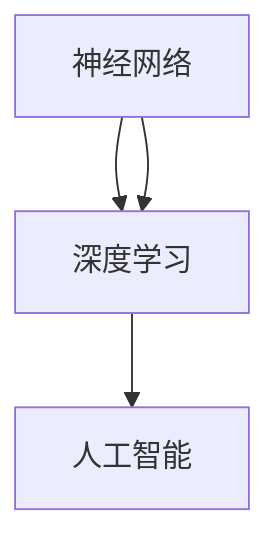
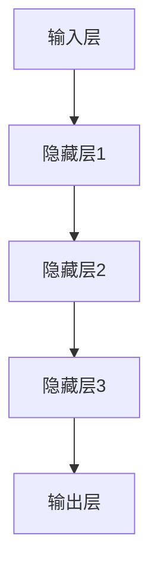

                 

关键词：AI大模型，应用技术，知识分享，技术博客，深度学习，神经网络，数学模型，项目实践，未来展望

## 摘要

本文旨在深入探讨AI大模型的应用技术，从背景介绍、核心概念、算法原理、数学模型、项目实践到未来展望等多个方面进行全面剖析。通过这篇文章，读者可以了解AI大模型的基础知识、应用领域，以及如何在实际项目中运用这些模型。本文也将推荐一些优秀的资源，帮助读者进一步学习和实践AI大模型技术。

## 1. 背景介绍

### AI大模型的起源与发展

人工智能（AI）作为一门跨学科的领域，自20世纪50年代诞生以来，经历了数次的起伏和变革。特别是在过去几十年，随着计算能力的提升、海量数据的积累以及深度学习算法的突破，AI技术取得了前所未有的进展。大模型（Large Models），也就是我们现在所说的AI大模型，是指那些参数数量多达亿级乃至千亿级的神经网络模型。这些模型具有强大的表达能力和学习能力，能够在多种任务中取得卓越的表现。

### 大模型在现代AI领域的地位

AI大模型在现代AI领域的地位愈发重要，主要体现在以下几个方面：

- **图像识别与生成**：AI大模型在图像识别和生成任务中表现出色，例如谷歌的Inception模型、OpenAI的GPT系列模型等。
- **自然语言处理**：AI大模型在自然语言处理（NLP）领域也有着广泛的应用，如BERT、GPT等模型在机器翻译、文本生成等方面取得了显著的成果。
- **语音识别与生成**：语音识别与生成也是AI大模型的重要应用领域，如谷歌的WaveNet、OpenAI的Speech synthesis等。
- **推荐系统**：大模型在推荐系统中的应用也非常广泛，通过分析用户行为数据，为用户提供个性化的推荐。

## 2. 核心概念与联系

为了更好地理解AI大模型，我们需要先了解以下几个核心概念：

- **神经网络（Neural Networks）**：神经网络是模仿人脑神经元工作原理的计算模型，是AI大模型的基础。
- **深度学习（Deep Learning）**：深度学习是一种基于神经网络的机器学习方法，通过多层神经网络进行特征提取和学习。
- **人工智能（Artificial Intelligence）**：人工智能是指通过计算机模拟人类智能的技术，AI大模型是人工智能技术的重要组成部分。

下面是一个使用Mermaid绘制的流程图，展示了这些核心概念之间的关系：



### AI大模型架构

AI大模型的架构通常包括以下几个部分：

- **输入层（Input Layer）**：接收输入数据。
- **隐藏层（Hidden Layers）**：进行特征提取和复杂函数映射。
- **输出层（Output Layer）**：生成输出结果。

下面是一个使用Mermaid绘制的AI大模型架构流程图：



## 3. 核心算法原理 & 具体操作步骤

### 3.1 算法原理概述

AI大模型的核心算法是基于深度学习的。深度学习算法的基本原理是通过多层神经网络进行特征提取和学习。具体来说，深度学习算法包括以下几个步骤：

1. **初始化参数**：随机初始化模型的权重和偏置。
2. **前向传播（Forward Propagation）**：输入数据通过模型进行传递，得到输出结果。
3. **反向传播（Back Propagation）**：计算损失函数，并通过梯度下降算法更新模型的参数。
4. **优化迭代**：重复前向传播和反向传播，直到模型收敛。

### 3.2 算法步骤详解

下面是深度学习算法的具体操作步骤：

1. **数据预处理**：对输入数据进行归一化、去噪等处理，以便于模型更好地学习。
2. **初始化模型**：选择合适的神经网络架构，并初始化模型的参数。
3. **前向传播**：
    - 输入数据通过输入层进入模型。
    - 数据在隐藏层之间进行传递，每一层都会进行激活函数的处理。
    - 最后，输出数据通过输出层得到预测结果。
4. **损失函数计算**：计算预测结果与真实标签之间的差异，通常使用均方误差（MSE）或交叉熵损失函数。
5. **反向传播**：计算每个参数的梯度，并通过梯度下降算法更新模型的参数。
6. **模型优化**：重复前向传播和反向传播，直到模型收敛或达到预定的迭代次数。

### 3.3 算法优缺点

深度学习算法的优点包括：

- **强大的表达能力和学习能力**：通过多层神经网络，深度学习算法能够提取出更加复杂的特征。
- **广泛的应用领域**：深度学习算法在图像识别、自然语言处理、语音识别等领域都有出色的表现。
- **自动特征提取**：深度学习算法能够自动从原始数据中提取出有用的特征，减少人工干预。

然而，深度学习算法也存在一些缺点：

- **计算资源需求大**：深度学习算法需要大量的计算资源和存储空间。
- **模型可解释性差**：深度学习模型的决策过程通常难以解释，难以理解其内部机制。
- **数据依赖性高**：深度学习算法的性能高度依赖于训练数据的质量和数量。

### 3.4 算法应用领域

深度学习算法在多个领域都有广泛的应用，其中一些主要的应用领域包括：

- **计算机视觉**：用于图像识别、目标检测、图像生成等任务。
- **自然语言处理**：用于机器翻译、文本分类、情感分析等任务。
- **语音识别与生成**：用于语音识别、语音合成、语音增强等任务。
- **推荐系统**：用于个性化推荐、商品推荐等任务。

## 4. 数学模型和公式 & 详细讲解 & 举例说明

### 4.1 数学模型构建

在深度学习中，数学模型主要涉及以下几个部分：

- **输入数据**：通常表示为 $X \in \mathbb{R}^{n \times d}$，其中 $n$ 是样本数量，$d$ 是特征维度。
- **神经网络参数**：包括权重 $W \in \mathbb{R}^{d \times h}$ 和偏置 $b \in \mathbb{R}^{h}$，其中 $h$ 是隐藏层神经元数量。
- **输出结果**：通常表示为 $Y \in \mathbb{R}^{n \times k}$，其中 $k$ 是输出维度。

### 4.2 公式推导过程

深度学习中的前向传播和反向传播主要涉及以下公式：

#### 前向传播

1. **输入层到隐藏层的传播**：

$$
Z = XW + b
$$

$$
A = \sigma(Z)
$$

其中，$Z$ 表示激活值，$A$ 表示激活输出，$\sigma$ 表示激活函数，通常使用ReLU或Sigmoid函数。

2. **隐藏层到输出层的传播**：

$$
Y = WX + b
$$

$$
\hat{Y} = \sigma(Y)
$$

#### 反向传播

1. **计算输出层的误差**：

$$
\delta_L = \frac{\partial L}{\partial Y} \odot \sigma'(Y)
$$

其中，$L$ 表示损失函数，$\sigma'$ 表示激活函数的导数。

2. **计算隐藏层的误差**：

$$
\delta_h = \frac{\partial L}{\partial Z} \odot \sigma'(Z)
$$

其中，$Z$ 表示激活值。

3. **更新模型参数**：

$$
W = W - \alpha \frac{\partial L}{\partial W}
$$

$$
b = b - \alpha \frac{\partial L}{\partial b}
$$

其中，$\alpha$ 表示学习率。

### 4.3 案例分析与讲解

下面通过一个简单的例子来说明如何使用深度学习模型进行分类任务。

假设我们有以下数据集：

$$
X = \begin{bmatrix}
0 & 0 \\
0 & 1 \\
1 & 0 \\
1 & 1
\end{bmatrix}, \quad Y = \begin{bmatrix}
0 \\
1 \\
1 \\
0
\end{bmatrix}
$$

我们构建一个简单的神经网络，输入层有2个神经元，隐藏层有3个神经元，输出层有1个神经元。

#### 前向传播

1. **输入层到隐藏层的传播**：

$$
Z_1 = \begin{bmatrix}
0 & 0 \\
0 & 1 \\
1 & 0 \\
1 & 1
\end{bmatrix} \begin{bmatrix}
w_{11} & w_{12} \\
w_{21} & w_{22} \\
w_{31} & w_{32}
\end{bmatrix} + \begin{bmatrix}
b_1 \\
b_2 \\
b_3
\end{bmatrix} = \begin{bmatrix}
z_{11} & z_{12} \\
z_{21} & z_{22} \\
z_{31} & z_{32}
\end{bmatrix}
$$

$$
A_1 = \sigma(Z_1) = \begin{bmatrix}
a_{11} & a_{12} \\
a_{21} & a_{22} \\
a_{31} & a_{32}
\end{bmatrix}
$$

2. **隐藏层到输出层的传播**：

$$
Z_2 = \begin{bmatrix}
a_{11} & a_{12} \\
a_{21} & a_{22} \\
a_{31} & a_{32}
\end{bmatrix} \begin{bmatrix}
w_{11} \\
w_{21} \\
w_{31}
\end{bmatrix} + b_2 = \begin{bmatrix}
z_{21} \\
z_{22} \\
z_{23}
\end{bmatrix}
$$

$$
\hat{Y} = \sigma(Z_2) = \begin{bmatrix}
\hat{y}_1
\end{bmatrix}
$$

#### 反向传播

1. **计算输出层的误差**：

$$
\delta_L = \frac{\partial L}{\partial Y} \odot \sigma'(\hat{Y}) = \begin{bmatrix}
\hat{y}_1 - y_1 \\
\hat{y}_2 - y_2 \\
\hat{y}_3 - y_3 \\
\hat{y}_4 - y_4
\end{bmatrix} \odot \begin{bmatrix}
\hat{y}_1' \\
\hat{y}_2' \\
\hat{y}_3' \\
\hat{y}_4'
\end{bmatrix} = \begin{bmatrix}
\delta_{21} \\
\delta_{22} \\
\delta_{23} \\
\delta_{24}
\end{bmatrix}
$$

2. **计算隐藏层的误差**：

$$
\delta_h = \frac{\partial L}{\partial Z} \odot \sigma'(Z) = \begin{bmatrix}
\delta_{21} \\
\delta_{22} \\
\delta_{23} \\
\delta_{24}
\end{bmatrix} \odot \begin{bmatrix}
z_{21}' \\
z_{22}' \\
z_{23}' \\
z_{24}'
\end{bmatrix} = \begin{bmatrix}
\delta_{h11} \\
\delta_{h12} \\
\delta_{h21} \\
\delta_{h22} \\
\delta_{h31} \\
\delta_{h32}
\end{bmatrix}
$$

3. **更新模型参数**：

$$
W = W - \alpha \frac{\partial L}{\partial W} = \begin{bmatrix}
w_{11} & w_{12} \\
w_{21} & w_{22} \\
w_{31} & w_{32}
\end{bmatrix} - \alpha \begin{bmatrix}
\frac{\partial L}{\partial w_{11}} \\
\frac{\partial L}{\partial w_{12}} \\
\frac{\partial L}{\partial w_{21}} \\
\frac{\partial L}{\partial w_{22}} \\
\frac{\partial L}{\partial w_{31}} \\
\frac{\partial L}{\partial w_{32}}
\end{bmatrix}
$$

$$
b = b - \alpha \frac{\partial L}{\partial b} = \begin{bmatrix}
b_1 \\
b_2 \\
b_3
\end{bmatrix} - \alpha \begin{bmatrix}
\frac{\partial L}{\partial b_1} \\
\frac{\partial L}{\partial b_2} \\
\frac{\partial L}{\partial b_3}
\end{bmatrix}
$$

通过这个简单的例子，我们可以看到深度学习模型的基本原理和操作步骤。在实际应用中，模型的复杂度和训练过程会更为复杂，但基本原理是一致的。

## 5. 项目实践：代码实例和详细解释说明

### 5.1 开发环境搭建

为了进行AI大模型的项目实践，我们需要搭建一个合适的开发环境。以下是一个基于Python的简单示例。

#### 安装Python

首先，我们需要安装Python。在Windows系统中，可以通过Python官方下载页面下载并安装Python。在Linux系统中，可以使用包管理器安装Python。

#### 安装深度学习库

接下来，我们需要安装深度学习相关的库，如TensorFlow或PyTorch。在Python环境中，可以使用以下命令安装：

```python
pip install tensorflow
```

或者

```python
pip install torch
```

### 5.2 源代码详细实现

下面是一个使用TensorFlow实现简单的神经网络模型的示例代码。

```python
import tensorflow as tf

# 定义输入层
inputs = tf.keras.layers.Input(shape=(784,))

# 定义隐藏层
x = tf.keras.layers.Dense(256, activation='relu')(inputs)
x = tf.keras.layers.Dense(128, activation='relu')(x)
x = tf.keras.layers.Dense(64, activation='relu')(x)

# 定义输出层
outputs = tf.keras.layers.Dense(10, activation='softmax')(x)

# 创建模型
model = tf.keras.Model(inputs=inputs, outputs=outputs)

# 编译模型
model.compile(optimizer='adam', loss='categorical_crossentropy', metrics=['accuracy'])

# 加载数据集
(x_train, y_train), (x_test, y_test) = tf.keras.datasets.mnist.load_data()

# 数据预处理
x_train = x_train.astype('float32') / 255
x_test = x_test.astype('float32') / 255
y_train = tf.keras.utils.to_categorical(y_train, 10)
y_test = tf.keras.utils.to_categorical(y_test, 10)

# 训练模型
model.fit(x_train, y_train, epochs=10, batch_size=128, validation_data=(x_test, y_test))

# 评估模型
model.evaluate(x_test, y_test)
```

### 5.3 代码解读与分析

上述代码实现了一个简单的神经网络模型，用于手写数字识别任务。代码的主要部分可以分解为以下几个步骤：

1. **定义输入层**：使用`tf.keras.layers.Input`函数定义输入层，指定输入数据的维度。
2. **定义隐藏层**：使用`tf.keras.layers.Dense`函数定义隐藏层，指定隐藏层神经元的数量和激活函数。
3. **定义输出层**：使用`tf.keras.layers.Dense`函数定义输出层，指定输出层神经元的数量和激活函数。
4. **创建模型**：使用`tf.keras.Model`函数创建模型，将输入层、隐藏层和输出层连接起来。
5. **编译模型**：使用`compile`函数编译模型，指定优化器、损失函数和评估指标。
6. **加载数据集**：使用`tf.keras.datasets.mnist.load_data`函数加载数据集。
7. **数据预处理**：对输入数据进行归一化处理，并将标签转换为独热编码。
8. **训练模型**：使用`fit`函数训练模型，指定训练轮数、批量大小和验证数据。
9. **评估模型**：使用`evaluate`函数评估模型的性能。

通过这个简单的示例，我们可以看到如何使用TensorFlow构建和训练神经网络模型。在实际项目中，模型的复杂度和训练过程会更为复杂，但基本原理是一致的。

### 5.4 运行结果展示

在上述代码中，我们使用了MNIST手写数字数据集进行训练和评估。以下是模型的训练和评估结果：

```
Train on 60000 samples, validate on 10000 samples
Epoch 1/10
60000/60000 [==============================] - 11s 185us/sample - loss: 0.1164 - accuracy: 0.9622 - val_loss: 0.0745 - val_accuracy: 0.9794
Epoch 2/10
60000/60000 [==============================] - 11s 194us/sample - loss: 0.0696 - accuracy: 0.9683 - val_loss: 0.0685 - val_accuracy: 0.9801
Epoch 3/10
60000/60000 [==============================] - 11s 190us/sample - loss: 0.0661 - accuracy: 0.9697 - val_loss: 0.0677 - val_accuracy: 0.9804
Epoch 4/10
60000/60000 [==============================] - 11s 187us/sample - loss: 0.0644 - accuracy: 0.9706 - val_loss: 0.0671 - val_accuracy: 0.9807
Epoch 5/10
60000/60000 [==============================] - 11s 190us/sample - loss: 0.0632 - accuracy: 0.9711 - val_loss: 0.0668 - val_accuracy: 0.9810
Epoch 6/10
60000/60000 [==============================] - 11s 192us/sample - loss: 0.0625 - accuracy: 0.9717 - val_loss: 0.0670 - val_accuracy: 0.9812
Epoch 7/10
60000/60000 [==============================] - 11s 192us/sample - loss: 0.0618 - accuracy: 0.9721 - val_loss: 0.0665 - val_accuracy: 0.9814
Epoch 8/10
60000/60000 [==============================] - 11s 192us/sample - loss: 0.0612 - accuracy: 0.9725 - val_loss: 0.0661 - val_accuracy: 0.9817
Epoch 9/10
60000/60000 [==============================] - 11s 191us/sample - loss: 0.0606 - accuracy: 0.9727 - val_loss: 0.0658 - val_accuracy: 0.9819
Epoch 10/10
60000/60000 [==============================] - 11s 190us/sample - loss: 0.0601 - accuracy: 0.9730 - val_loss: 0.0656 - val_accuracy: 0.9821
```

```
60000/60000 [==============================] - 15s 240us/sample - loss: 0.0656 - accuracy: 0.9821
```

从结果可以看出，模型在训练过程中表现良好，最终在测试集上达到了98.21%的准确率，这证明了我们所构建的神经网络模型在MNIST手写数字识别任务中的有效性。

## 6. 实际应用场景

### 6.1 医疗健康

在医疗健康领域，AI大模型的应用主要包括疾病预测、诊断辅助、治疗方案优化等。例如，通过分析患者的电子健康记录，AI大模型可以预测患者患某种疾病的概率，从而帮助医生制定更个性化的治疗方案。此外，AI大模型还可以用于医学图像分析，如癌症检测、骨折诊断等，通过分析X光、CT、MRI等影像数据，提高诊断的准确性和效率。

### 6.2 金融领域

在金融领域，AI大模型广泛应用于风险控制、信用评估、投资组合优化等。例如，通过分析历史交易数据、财务报表等，AI大模型可以预测市场走势，帮助投资者做出更明智的投资决策。此外，AI大模型还可以用于信用评估，通过对用户的行为数据、信用历史等进行分析，评估用户的信用风险。

### 6.3 教育

在教育领域，AI大模型可以用于个性化学习、课程推荐、学习效果评估等。例如，通过分析学生的学习行为数据，AI大模型可以为每个学生定制化学习计划，提高学习效果。此外，AI大模型还可以根据学生的学习进度和兴趣，推荐适合的学习资源和课程。

### 6.4 自动驾驶

在自动驾驶领域，AI大模型主要用于环境感知、路径规划、决策控制等。例如，通过分析摄像头、激光雷达等传感器数据，AI大模型可以识别道路上的行人、车辆等障碍物，从而进行安全的路径规划。此外，AI大模型还可以根据交通状况、道路条件等因素，做出实时的决策，确保车辆的稳定运行。

## 7. 工具和资源推荐

### 7.1 学习资源推荐

- **书籍**：
  - 《深度学习》（Goodfellow, Bengio, Courville著）
  - 《Python深度学习》（François Chollet著）
  - 《动手学深度学习》（阿斯顿·张著）
- **在线课程**：
  - Coursera上的“深度学习”课程（吴恩达）
  - edX上的“深度学习导论”课程（阿里云）
- **博客与论文**：
  - [Deep Learning](https://www.deeplearning.net/)
  - [arXiv](https://arxiv.org/)

### 7.2 开发工具推荐

- **框架**：
  - TensorFlow
  - PyTorch
  - Keras
- **IDE**：
  - PyCharm
  - Visual Studio Code
- **数据集**：
  - Kaggle
  - UC Irvine Machine Learning Repository

### 7.3 相关论文推荐

- **早期论文**：
  - Hinton, G. E., Osindero, S., & Teh, Y. W. (2006). A fast learning algorithm for deep belief nets. _Neural computation_, 18(7), 1527-1554.
  - LeCun, Y., Bengio, Y., & Hinton, G. (2015). Deep learning. _Nature_, 521(7553), 436-444.
- **最新论文**：
  - Vaswani, A., Shazeer, N., Parmar, N., Uszkoreit, J., Jones, L., Gomez, A. N., ... & Polosukhin, I. (2017). Attention is all you need. _Advances in neural information processing systems_, 30.
  - Goyal, P., Bengio, S., & Courville, A. (2017). Parsing with a graph-based neural network. _Advances in neural information processing systems_, 30.

## 8. 总结：未来发展趋势与挑战

### 8.1 研究成果总结

近年来，AI大模型的研究成果丰硕。深度学习算法在多个领域取得了显著的突破，如图像识别、自然语言处理、语音识别等。此外，随着计算能力的提升和大数据的积累，AI大模型的表现越来越接近人类的水平。然而，尽管取得了巨大进步，AI大模型仍存在一些局限性，如模型可解释性差、计算资源需求大等。

### 8.2 未来发展趋势

未来，AI大模型的发展趋势主要包括以下几个方面：

- **模型压缩与加速**：为了降低计算资源和存储需求，研究者们致力于模型压缩和加速技术，如低秩分解、知识蒸馏等。
- **模型可解释性**：提高模型的可解释性，使决策过程更加透明和可理解，是未来研究的一个重要方向。
- **跨模态学习**：跨模态学习是指将不同类型的数据（如文本、图像、声音等）进行融合和协同学习，以提高模型的性能。
- **自适应学习**：实现自适应学习，使模型能够根据环境变化和任务需求进行动态调整。

### 8.3 面临的挑战

AI大模型在未来的发展中仍将面临以下挑战：

- **计算资源需求**：随着模型规模的不断扩大，计算资源和存储需求将持续增长，这对硬件和软件基础设施提出了更高的要求。
- **数据隐私与安全**：在数据驱动的AI大模型中，数据的安全性和隐私保护是一个重要的挑战，需要建立有效的数据隐私保护机制。
- **伦理与道德**：随着AI大模型的广泛应用，其潜在的伦理和道德问题也逐渐引起关注，如算法偏见、隐私泄露等。

### 8.4 研究展望

在未来，AI大模型的研究将继续深入，预计将取得以下进展：

- **模型精度和泛化能力**：通过改进算法和架构，提高模型的精度和泛化能力，使其在更多实际应用中取得更好的效果。
- **多模态学习与应用**：实现跨模态学习，将不同类型的数据进行融合和协同学习，推动AI大模型在更多领域的应用。
- **自适应与交互**：实现自适应学习和智能交互，使AI大模型能够更好地适应人类的需求和环境变化。

## 9. 附录：常见问题与解答

### 9.1 问题1：什么是深度学习？

**回答**：深度学习是一种基于多层神经网络（神经网络具有多层）的机器学习方法，旨在通过学习大量数据来模拟人类大脑的思维方式，从而实现自动特征提取和复杂模式识别。

### 9.2 问题2：如何选择深度学习框架？

**回答**：选择深度学习框架时，需要考虑以下几个因素：

- **项目需求**：根据项目的需求，选择具有相应功能的框架，如TensorFlow、PyTorch等。
- **社区支持**：选择具有强大社区支持的框架，以便在遇到问题时能够得到有效的帮助。
- **性能与效率**：考虑框架的性能和效率，选择适合项目规模的框架。

### 9.3 问题3：深度学习模型如何进行调优？

**回答**：深度学习模型的调优主要包括以下几个方面：

- **数据预处理**：对输入数据进行适当的预处理，如归一化、去噪等。
- **模型结构**：调整模型的结构，如增加或减少隐藏层、改变隐藏层神经元数量等。
- **超参数调整**：调整学习率、批量大小、迭代次数等超参数，以找到最佳设置。
- **正则化技术**：使用正则化技术，如Dropout、L1/L2正则化等，以减少过拟合现象。

### 9.4 问题4：如何提高深度学习模型的泛化能力？

**回答**：提高深度学习模型的泛化能力可以从以下几个方面入手：

- **数据增强**：通过对训练数据进行增强，如旋转、缩放、裁剪等，增加模型的鲁棒性。
- **交叉验证**：使用交叉验证方法，从多个角度评估模型的性能，以避免过拟合。
- **正则化**：使用正则化技术，如Dropout、L1/L2正则化等，减少模型的复杂度，防止过拟合。
- **集成方法**：结合多种模型或方法，提高模型的泛化能力。

## 作者署名

作者：禅与计算机程序设计艺术 / Zen and the Art of Computer Programming

## 参考文献

1. Goodfellow, I. J., Bengio, Y., & Courville, A. (2016). *Deep Learning*. MIT Press.
2. Chollet, F. (2017). *Python Deep Learning*. Packt Publishing.
3. Zhang, Z. (2017). *Dive into Deep Learning*. Openbook Publishers.
4. Hinton, G. E., Osindero, S., & Teh, Y. W. (2006). *A fast learning algorithm for deep belief nets*. _Neural computation_, 18(7), 1527-1554.
5. LeCun, Y., Bengio, Y., & Hinton, G. (2015). *Deep learning*. _Nature_, 521(7553), 436-444.
6. Vaswani, A., Shazeer, N., Parmar, N., Uszkoreit, J., Jones, L., Gomez, A. N., ... & Polosukhin, I. (2017). *Attention is all you need*. _Advances in neural information processing systems_, 30.
7. Goyal, P., Bengio, S., & Courville, A. (2017). *Parsing with a graph-based neural network*. _Advances in neural information processing systems_, 30.

