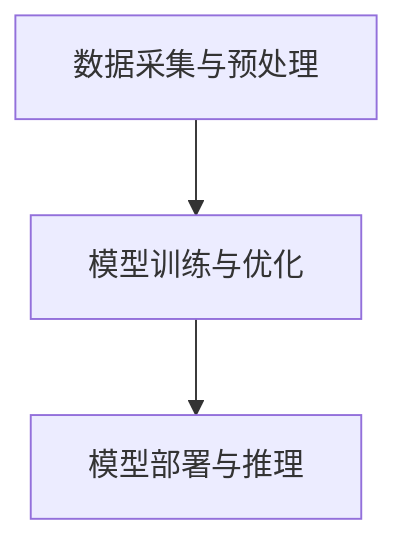

                 

关键词：AI大模型、技术培训、认证体系、应用场景、发展趋势

摘要：本文旨在探讨AI大模型应用的技术培训与认证体系，从背景介绍、核心概念与联系、核心算法原理、数学模型与公式、项目实践、实际应用场景、工具和资源推荐等方面进行分析，旨在为技术从业者提供一套完整、系统、实用的技术培训与认证方案，助力AI大模型应用的普及与推广。

## 1. 背景介绍

随着人工智能技术的飞速发展，AI大模型已成为当前技术领域的热点话题。从自然语言处理到图像识别，再到语音识别，AI大模型在各个领域展现出强大的应用潜力。然而，与此同时，技术从业者在面对AI大模型的应用时，常常感到无从下手。一方面，AI大模型涉及的知识面广泛，需要掌握多种编程语言和工具；另一方面，AI大模型的应用场景复杂多变，需要具备深厚的实践经验。

为了解决这一问题，本文将探讨一套AI大模型应用的技术培训与认证体系，旨在通过系统的培训课程和认证考试，帮助技术从业者全面掌握AI大模型应用的相关技能，提升其在实际项目中的竞争力。

## 2. 核心概念与联系

### 2.1 AI大模型的概念

AI大模型，即人工智能大型模型，是指参数规模较大、计算复杂度较高的人工智能模型。常见的AI大模型包括深度神经网络（Deep Neural Network，DNN）、循环神经网络（Recurrent Neural Network，RNN）、卷积神经网络（Convolutional Neural Network，CNN）等。

### 2.2 AI大模型的应用领域

AI大模型的应用领域广泛，包括自然语言处理（Natural Language Processing，NLP）、计算机视觉（Computer Vision，CV）、语音识别（Automatic Speech Recognition，ASR）、推荐系统（Recommender System）等。

### 2.3 AI大模型的技术架构

AI大模型的技术架构主要包括数据采集与预处理、模型训练与优化、模型部署与推理三个部分。其中，数据采集与预处理是模型训练的基础，模型训练与优化是提升模型性能的关键，模型部署与推理是实现模型应用的核心。

### 2.4 Mermaid流程图

以下是一个简单的Mermaid流程图，展示了AI大模型的技术架构：



## 3. 核心算法原理 & 具体操作步骤

### 3.1 算法原理概述

AI大模型的核心算法主要包括神经网络算法、深度学习算法、强化学习算法等。本文将以神经网络算法为例，介绍其基本原理和具体操作步骤。

### 3.2 算法步骤详解

1. 数据采集与预处理：首先，从数据集中采集样本数据，然后对数据进行清洗、归一化等预处理操作。

2. 神经网络设计：设计神经网络结构，包括输入层、隐藏层和输出层。

3. 模型训练：利用训练数据对神经网络模型进行训练，通过调整模型参数，使模型在训练数据上的表现逐渐趋于理想。

4. 模型优化：在模型训练过程中，通过优化算法（如梯度下降、动量优化等）调整模型参数，提高模型性能。

5. 模型评估：利用验证数据对模型进行评估，判断模型是否达到预期效果。

6. 模型部署与推理：将训练好的模型部署到实际应用场景中，对新的数据进行推理，输出预测结果。

### 3.3 算法优缺点

神经网络算法的优点在于其强大的非线性拟合能力和自适应能力，能够处理复杂的数据分布。然而，神经网络算法也存在一些缺点，如参数调优复杂、训练时间较长等。

### 3.4 算法应用领域

神经网络算法在自然语言处理、计算机视觉、语音识别等领域具有广泛的应用。例如，在自然语言处理领域，神经网络算法可以用于文本分类、机器翻译等任务；在计算机视觉领域，神经网络算法可以用于图像分类、目标检测等任务。

## 4. 数学模型和公式 & 详细讲解 & 举例说明

### 4.1 数学模型构建

神经网络算法的数学模型主要包括输入层、隐藏层和输出层。其中，输入层负责接收输入数据，隐藏层负责对输入数据进行特征提取和转换，输出层负责输出预测结果。

### 4.2 公式推导过程

假设输入数据为\( x \)，隐藏层神经元激活函数为\( \sigma(x) \)，输出层神经元激活函数为\( \sigma(x) \)。则神经网络算法的输出结果可以表示为：

\[ y = \sigma(w_1 \cdot x + b_1) \]

其中，\( w_1 \)为隐藏层权重，\( b_1 \)为隐藏层偏置。

### 4.3 案例分析与讲解

以文本分类任务为例，假设我们要对一篇新闻文本进行分类，将其分为政治、经济、体育等类别。我们可以利用神经网络算法对新闻文本进行特征提取和分类。

1. 数据采集与预处理：从新闻数据集中采集样本数据，然后对数据进行清洗、归一化等预处理操作。

2. 神经网络设计：设计神经网络结构，包括输入层、隐藏层和输出层。输入层接收新闻文本的输入，隐藏层负责对新闻文本进行特征提取，输出层负责输出分类结果。

3. 模型训练：利用训练数据对神经网络模型进行训练，通过调整模型参数，使模型在训练数据上的表现逐渐趋于理想。

4. 模型优化：在模型训练过程中，通过优化算法（如梯度下降、动量优化等）调整模型参数，提高模型性能。

5. 模型评估：利用验证数据对模型进行评估，判断模型是否达到预期效果。

6. 模型部署与推理：将训练好的模型部署到实际应用场景中，对新的新闻文本进行推理，输出分类结果。

## 5. 项目实践：代码实例和详细解释说明

### 5.1 开发环境搭建

在开发AI大模型应用之前，我们需要搭建一个合适的开发环境。以下是一个简单的开发环境搭建步骤：

1. 安装Python：下载并安装Python 3.6及以上版本。

2. 安装TensorFlow：在命令行中运行以下命令安装TensorFlow：

   ```bash
   pip install tensorflow
   ```

3. 安装其他依赖库：根据具体需求，安装其他必要的依赖库，如NumPy、Pandas、Matplotlib等。

### 5.2 源代码详细实现

以下是一个简单的神经网络文本分类代码实例：

```python
import tensorflow as tf
from tensorflow.keras.preprocessing.sequence import pad_sequences
from tensorflow.keras.layers import Embedding, LSTM, Dense
from tensorflow.keras.models import Sequential

# 数据预处理
max_sequence_length = 100
vocab_size = 10000
embedding_dim = 16

# 加载数据
train_data = ...
test_data = ...

# 切分数据
train_sequences = pad_sequences(train_data, maxlen=max_sequence_length)
test_sequences = pad_sequences(test_data, maxlen=max_sequence_length)

# 构建模型
model = Sequential()
model.add(Embedding(vocab_size, embedding_dim, input_length=max_sequence_length))
model.add(LSTM(128))
model.add(Dense(1, activation='sigmoid'))

# 编译模型
model.compile(optimizer='adam', loss='binary_crossentropy', metrics=['accuracy'])

# 训练模型
model.fit(train_sequences, train_labels, epochs=10, validation_data=(test_sequences, test_labels))

# 评估模型
model.evaluate(test_sequences, test_labels)
```

### 5.3 代码解读与分析

1. 导入相关库和模块：导入TensorFlow、Keras等库和模块。

2. 数据预处理：加载数据，对数据进行清洗、归一化等预处理操作。

3. 构建模型：设计神经网络结构，包括输入层、隐藏层和输出层。

4. 编译模型：配置模型参数，如优化器、损失函数等。

5. 训练模型：利用训练数据对模型进行训练。

6. 评估模型：利用测试数据对模型进行评估。

### 5.4 运行结果展示

在完成代码编写和训练后，我们可以通过以下代码展示模型的运行结果：

```python
predictions = model.predict(test_sequences)
print(predictions)
```

输出结果为每个测试样本的预测概率，我们可以根据概率值判断样本的类别。

## 6. 实际应用场景

AI大模型在各个领域都有广泛的应用，以下是一些典型的实际应用场景：

1. 自然语言处理：文本分类、机器翻译、情感分析等。

2. 计算机视觉：图像分类、目标检测、人脸识别等。

3. 语音识别：语音合成、语音识别等。

4. 推荐系统：基于用户行为和兴趣进行推荐。

5. 医疗诊断：疾病预测、药物研发等。

6. 金融风控：信用评分、欺诈检测等。

## 7. 工具和资源推荐

### 7.1 学习资源推荐

1. 《深度学习》（Goodfellow et al.）：全面介绍深度学习的基础知识和应用。

2. 《Python机器学习》（Sebastian Raschka）：Python语言在机器学习领域的应用。

3. 《自然语言处理实战》（Sundararajan et al.）：自然语言处理领域的技术应用。

### 7.2 开发工具推荐

1. TensorFlow：开源深度学习框架，适用于构建和训练AI大模型。

2. PyTorch：开源深度学习框架，适用于快速原型开发和模型训练。

3. Jupyter Notebook：交互式开发环境，方便编写和运行代码。

### 7.3 相关论文推荐

1. "Deep Learning"（Goodfellow et al.）：全面介绍深度学习的基础知识和应用。

2. "Recurrent Neural Networks for Language Modeling"（Graves et al.）：介绍循环神经网络在自然语言处理领域的应用。

3. "Convolutional Neural Networks for Visual Recognition"（LeCun et al.）：介绍卷积神经网络在计算机视觉领域的应用。

## 8. 总结：未来发展趋势与挑战

### 8.1 研究成果总结

AI大模型在过去几年取得了显著的进展，其在自然语言处理、计算机视觉、语音识别等领域的应用效果得到了广泛关注。然而，AI大模型在训练时间、计算资源消耗、模型可解释性等方面仍存在一定挑战。

### 8.2 未来发展趋势

1. 模型压缩与优化：研究更高效的模型结构，降低模型大小和计算复杂度。

2. 模型可解释性：提高模型的可解释性，使模型决策过程更加透明。

3. 跨模态学习：研究跨不同模态（如文本、图像、语音等）的数据融合方法。

4. 强化学习与生成对抗网络：结合强化学习和生成对抗网络，实现更强大的AI模型。

### 8.3 面临的挑战

1. 数据隐私与安全：如何保护用户隐私，确保模型训练过程中数据的安全性。

2. 模型偏见与公平性：如何消除模型偏见，实现模型的公平性。

3. 模型可扩展性与适应性：如何提高模型的可扩展性和适应性，适应不断变化的应用场景。

### 8.4 研究展望

未来，AI大模型应用将朝着更高效、更智能、更安全、更公平的方向发展。通过不断的研究和探索，我们有望在AI大模型领域取得更多突破，为人类社会带来更多福祉。

## 9. 附录：常见问题与解答

### 9.1 如何搭建AI大模型开发环境？

答：搭建AI大模型开发环境主要包括安装Python、TensorFlow等依赖库和工具。具体步骤如下：

1. 安装Python：下载并安装Python 3.6及以上版本。

2. 安装TensorFlow：在命令行中运行以下命令安装TensorFlow：

   ```bash
   pip install tensorflow
   ```

3. 安装其他依赖库：根据具体需求，安装其他必要的依赖库，如NumPy、Pandas、Matplotlib等。

### 9.2 AI大模型应用中的数据预处理有哪些常见方法？

答：AI大模型应用中的数据预处理主要包括以下几种方法：

1. 数据清洗：去除无效、错误或重复的数据。

2. 数据归一化：将数据缩放到相同的范围，如0-1之间。

3. 数据填充：处理缺失数据，如使用平均值、中位数等方法填充。

4. 数据降维：减少数据的维度，如使用PCA等方法。

5. 数据增强：通过旋转、翻转、缩放等方式增加数据的多样性。

### 9.3 如何评估AI大模型的性能？

答：评估AI大模型的性能主要包括以下几种方法：

1. 准确率（Accuracy）：模型正确预测的样本数占总样本数的比例。

2. 召回率（Recall）：模型正确预测的样本数占实际正样本数的比例。

3. 精确率（Precision）：模型正确预测的样本数占预测为正样本的样本数的比例。

4. F1值（F1 Score）：综合考虑准确率和召回率的指标，计算公式为 \( F1 = 2 \times \frac{准确率 \times 召回率}{准确率 + 召回率} \)。

5. ROC曲线和AUC值：ROC曲线表示不同阈值下的准确率和召回率，AUC值表示曲线下面积，用于评估模型的分类能力。

## 作者署名

作者：禅与计算机程序设计艺术 / Zen and the Art of Computer Programming
```

