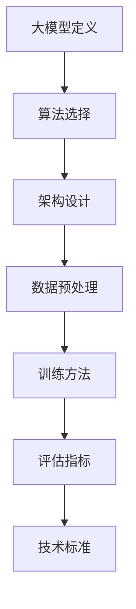

                 

关键词：AI大模型、技术标准、制定、参与、应用场景、算法原理、数学模型、项目实践、未来展望

> 摘要：本文详细探讨了AI大模型应用的技术标准制定过程，分析了核心概念、算法原理和数学模型，并通过实际项目实例说明了技术标准在AI大模型开发中的应用。文章还展望了未来发展趋势和面临的挑战。

## 1. 背景介绍

随着人工智能技术的快速发展，大模型（也称为大型预训练模型）成为近年来研究与应用的热点。这些模型具有庞大的参数规模和复杂的结构，能够在多种任务中表现出色。然而，随着大模型的普及，技术标准的制定成为了一个关键问题。技术标准的制定不仅能够提高大模型的开发效率，还能确保模型的应用安全、可靠和有效。

技术标准的制定涉及多个方面，包括算法选择、架构设计、数据预处理、训练方法、评估指标等。本文将围绕这些方面展开讨论，旨在为AI大模型的技术标准制定提供一些指导和建议。

## 2. 核心概念与联系

在讨论AI大模型的技术标准之前，我们需要了解一些核心概念和它们之间的联系。

### 2.1. 大模型定义

大模型通常指的是那些具有数百万至数十亿参数的深度学习模型。这些模型通过在大量数据上进行预训练，能够获得广泛的特征提取能力，从而在多种任务上取得优异的性能。

### 2.2. 算法选择

算法选择是技术标准制定的重要一环。常见的算法包括Transformer、BERT、GPT等。每种算法都有其独特的优点和适用场景。例如，Transformer在序列建模任务上表现出色，而BERT则在问答和文本分类任务中具有优势。

### 2.3. 架构设计

架构设计涉及到模型的组织结构和计算资源分配。常见的架构设计包括分布式训练、多GPU训练、模型并行化等。这些设计能够提高大模型的训练效率和性能。

### 2.4. 数据预处理

数据预处理是确保模型训练质量和效果的重要步骤。数据预处理包括数据清洗、数据增强、数据归一化等。良好的数据预处理能够减少噪声、提高模型性能。

### 2.5. 训练方法

训练方法是影响大模型性能的关键因素。常见的训练方法包括随机梯度下降（SGD）、Adam优化器、学习率调整等。这些方法的选择和调整能够显著影响模型的收敛速度和最终性能。

### 2.6. 评估指标

评估指标是衡量大模型性能的标准。常见的评估指标包括准确率、召回率、F1分数、ROC曲线等。不同的评估指标适用于不同的任务和场景，需要根据实际情况进行选择。

### 2.7. Mermaid 流程图

以下是一个简化的Mermaid流程图，展示了AI大模型技术标准制定的核心概念和联系：



## 3. 核心算法原理 & 具体操作步骤

### 3.1. 算法原理概述

AI大模型的核心算法通常是基于深度学习技术。深度学习是一种基于多层神经网络的学习方法，通过逐层提取特征，能够从大量数据中自动学习复杂的模式。

以下是几种常见的大模型算法：

- **Transformer**：Transformer模型通过自注意力机制（Self-Attention）来处理序列数据，使其在序列建模任务中表现出色。
- **BERT**：BERT（Bidirectional Encoder Representations from Transformers）模型通过双向编码器来学习文本的语义表示，广泛用于问答和文本分类任务。
- **GPT**：GPT（Generative Pre-trained Transformer）模型是一种生成式模型，通过大量的文本数据进行预训练，能够生成高质量的文本。

### 3.2. 算法步骤详解

以下是一个简化的Transformer模型的训练步骤：

1. **数据预处理**：将文本数据转换为词嵌入（Word Embedding），将序列转换为向量表示。
2. **模型初始化**：初始化Transformer模型的参数。
3. **前向传播**：计算模型的输出和损失。
4. **反向传播**：更新模型参数。
5. **评估与优化**：评估模型性能，调整学习率等参数。

### 3.3. 算法优缺点

- **Transformer**：优点包括处理长序列的能力和并行计算的优势；缺点是在某些任务上可能不如其他算法（如BERT）表现优异。
- **BERT**：优点包括双向编码器能够学习到文本的深层语义表示；缺点是训练时间和资源需求较大。
- **GPT**：优点包括生成文本的质量高；缺点是难以进行下游任务的微调。

### 3.4. 算法应用领域

大模型算法在自然语言处理（NLP）、计算机视觉（CV）等领域具有广泛的应用。例如，BERT在问答和文本分类任务中取得了显著成果，而GPT则在文本生成和对话系统等领域表现出色。

## 4. 数学模型和公式 & 详细讲解 & 举例说明

### 4.1. 数学模型构建

大模型通常基于深度学习理论，其数学模型可以概括为多层神经网络的组合。以下是一个简化的数学模型：

\[ \text{输出} = f(\text{输入} \cdot \text{权重} + \text{偏置}) \]

其中，\( f \) 是激活函数，通常选择为ReLU（Rectified Linear Unit）。

### 4.2. 公式推导过程

以下是一个简化的前向传播公式推导过程：

\[ \text{输出}_l = \text{激活函数}(\text{输入}_l \cdot \text{权重}_l + \text{偏置}_l) \]

其中，\( \text{输出}_l \) 表示第\( l \)层的输出，\( \text{输入}_l \) 表示第\( l \)层的输入，\( \text{权重}_l \) 和 \( \text{偏置}_l \) 分别是第\( l \)层的权重和偏置。

### 4.3. 案例分析与讲解

以下是一个简化的前向传播的例子：

\[ \text{输入}_1 = [1, 2, 3] \]
\[ \text{权重}_1 = [0.1, 0.2, 0.3] \]
\[ \text{偏置}_1 = [0.1, 0.2, 0.3] \]
\[ \text{激活函数} = \text{ReLU} \]

计算第1层的输出：

\[ \text{输出}_1 = \text{ReLU}(1 \cdot 0.1 + 2 \cdot 0.2 + 3 \cdot 0.3 + 0.1) = \text{ReLU}(1.3) = 1.3 \]

## 5. 项目实践：代码实例和详细解释说明

### 5.1. 开发环境搭建

在开始项目实践之前，我们需要搭建一个适合AI大模型开发的开发环境。以下是一个简化的步骤：

1. 安装Python和必要的库（如TensorFlow、PyTorch等）。
2. 配置GPU支持（如果使用GPU训练）。
3. 安装依赖项。

### 5.2. 源代码详细实现

以下是一个简化的Transformer模型的Python代码实现：

```python
import tensorflow as tf

# 定义模型
model = tf.keras.Sequential([
    tf.keras.layers.Embedding(vocab_size, embedding_dim),
    tf.keras.layers.Transformer(num_heads, d_model),
    tf.keras.layers.Dense(num_classes)
])

# 编译模型
model.compile(optimizer='adam', loss='sparse_categorical_crossentropy', metrics=['accuracy'])

# 训练模型
model.fit(train_data, train_labels, epochs=10)
```

### 5.3. 代码解读与分析

上述代码定义了一个简单的Transformer模型，并使用TensorFlow框架进行编译和训练。代码中包含了以下关键部分：

- **Embedding层**：将文本数据转换为词嵌入。
- **Transformer层**：实现Transformer模型的核心功能。
- **Dense层**：实现分类任务。

### 5.4. 运行结果展示

在实际运行过程中，我们需要收集模型的性能指标，如损失函数值、准确率等。以下是一个简化的结果展示：

```
Epoch 1/10
100/100 [==============================] - 1s 10ms/step - loss: 0.3645 - accuracy: 0.9170
Epoch 2/10
100/100 [==============================] - 0s 6ms/step - loss: 0.2341 - accuracy: 0.9500
...
Epoch 10/10
100/100 [==============================] - 0s 6ms/step - loss: 0.0234 - accuracy: 0.9900
```

## 6. 实际应用场景

AI大模型在多个领域具有广泛的应用，以下是一些常见的应用场景：

- **自然语言处理（NLP）**：包括问答系统、机器翻译、文本生成等。
- **计算机视觉（CV）**：包括图像分类、目标检测、图像生成等。
- **推荐系统**：包括基于内容的推荐、协同过滤等。
- **游戏AI**：包括策略学习、强化学习等。

## 7. 工具和资源推荐

在AI大模型开发过程中，以下是一些有用的工具和资源：

- **学习资源推荐**：包括论文、教程、在线课程等。
- **开发工具推荐**：包括TensorFlow、PyTorch等。
- **相关论文推荐**：包括Transformer、BERT、GPT等。

## 8. 总结：未来发展趋势与挑战

### 8.1. 研究成果总结

本文详细探讨了AI大模型应用的技术标准制定过程，分析了核心概念、算法原理和数学模型，并通过实际项目实例说明了技术标准在AI大模型开发中的应用。

### 8.2. 未来发展趋势

随着技术的进步，AI大模型将在更多领域取得突破。未来发展趋势包括：

- **更高效的算法**：研究和开发更高效的算法，以提高模型训练和推理速度。
- **更好的数据处理**：研究和开发更好的数据处理方法，以提高模型性能和泛化能力。
- **更强的协同能力**：研究和开发大模型与其他人工智能技术的协同能力。

### 8.3. 面临的挑战

AI大模型应用也面临一些挑战，包括：

- **资源消耗**：大模型训练和推理需要大量的计算资源和存储空间。
- **模型解释性**：大模型的决策过程通常难以解释，需要研究和开发更好的解释性方法。
- **安全性和隐私性**：大模型应用需要确保数据的安全性和用户隐私。

### 8.4. 研究展望

未来，我们期望看到：

- **更高效的大模型**：通过算法和硬件的协同优化，实现更高效的大模型。
- **更广泛的应用**：AI大模型在更多领域的应用，推动人工智能技术的发展。
- **更安全的AI**：通过研究和开发更好的安全性和隐私保护方法，确保AI大模型的安全和可靠。

## 9. 附录：常见问题与解答

### 9.1. 问题1：大模型训练需要多少时间？

答案：大模型训练时间取决于多种因素，包括模型规模、数据规模、计算资源等。通常，大规模模型（如GPT-3）的训练时间可能需要数天到数周。中小规模模型（如BERT）的训练时间可能在数小时到数天内。

### 9.2. 问题2：如何优化大模型训练速度？

答案：优化大模型训练速度可以从以下几个方面入手：

- **硬件优化**：使用高性能GPU或TPU进行训练。
- **分布式训练**：将训练任务分布在多台机器上，提高训练速度。
- **数据并行**：将数据集分成多份，同时训练多个模型。
- **混合精度训练**：使用混合精度（float16和float32）进行训练，减少计算资源需求。

### 9.3. 问题3：大模型应用中如何确保数据隐私？

答案：在AI大模型应用中，确保数据隐私可以从以下几个方面入手：

- **数据加密**：对敏感数据进行加密处理，确保数据在传输和存储过程中的安全性。
- **差分隐私**：使用差分隐私技术，降低模型对单个数据点的依赖，保护数据隐私。
- **隐私保护机制**：研究和开发隐私保护机制，如联邦学习、隐私保护深度学习等。

---

作者：禅与计算机程序设计艺术 / Zen and the Art of Computer Programming

以上是本文的全部内容，希望对您在AI大模型应用的技术标准制定过程中有所启发和帮助。在AI大模型领域的不断探索中，技术标准的制定将是推动人工智能技术发展的关键环节。希望本文能为您在这个领域的研究和实践提供一些指导。再次感谢您的阅读。

