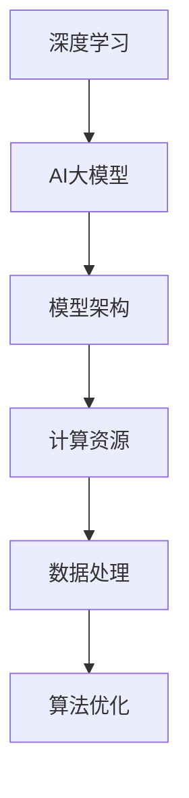

                 

关键词：AI大模型，技术选型，决策指南，深度学习，模型架构，计算资源，数据处理，算法优化

> 摘要：本文旨在为技术决策者提供一份详细的AI大模型应用技术选型决策指南。通过分析大模型应用中的核心问题，阐述关键技术和算法原理，探讨数学模型及其应用领域，并结合项目实践进行代码实例分析，最后对大模型应用的未来趋势与挑战进行展望。

## 1. 背景介绍

在过去的几十年中，人工智能（AI）技术取得了飞速发展，特别是在深度学习领域。如今，AI大模型（如GPT-3、BERT等）在自然语言处理、计算机视觉、语音识别等领域展现出了强大的能力和广泛的应用前景。然而，随着模型规模的不断扩大，如何进行有效的技术选型和决策成为了一个重要课题。

本文将围绕AI大模型应用的技术选型决策，从核心概念、算法原理、数学模型、项目实践、实际应用场景等方面展开讨论，旨在为读者提供一份全面的决策指南。

## 2. 核心概念与联系

### 2.1 深度学习与AI大模型

深度学习是AI领域的一种重要方法，通过构建多层神经网络来实现对复杂数据的建模与处理。AI大模型则是在深度学习的基础上，通过更大规模的数据集和更深的网络结构，实现了前所未有的性能表现。

### 2.2 模型架构

模型架构是AI大模型的核心组成部分，包括卷积神经网络（CNN）、循环神经网络（RNN）、变换器（Transformer）等。不同的架构在处理不同类型的数据时具有各自的优势。

### 2.3 计算资源

AI大模型的训练和推理需要大量计算资源，包括CPU、GPU、TPU等。选择合适的计算资源对模型的性能和成本有重要影响。

### 2.4 数据处理

数据处理是AI大模型应用的重要环节，包括数据采集、预处理、标注等。高质量的数据是模型训练成功的关键。

### 2.5 算法优化

算法优化是提高模型性能的重要手段，包括模型剪枝、量化、迁移学习等。通过优化算法，可以降低模型的计算复杂度和存储需求。

## 2.6 Mermaid流程图

下面是一个关于AI大模型应用的Mermaid流程图，展示了核心概念之间的联系：



## 3. 核心算法原理 & 具体操作步骤

### 3.1 算法原理概述

AI大模型的核心算法主要包括以下几个部分：

1. **前向传播**：将输入数据通过网络层逐层计算，得到输出结果。
2. **反向传播**：根据输出结果与目标值的误差，反向更新网络参数。
3. **激活函数**：如ReLU、Sigmoid、Tanh等，用于引入非线性变换，提高模型表达能力。
4. **优化算法**：如SGD、Adam等，用于加速模型训练过程。

### 3.2 算法步骤详解

1. **数据预处理**：对输入数据进行标准化、归一化等预处理操作。
2. **模型搭建**：根据任务需求选择合适的模型架构，如CNN、RNN、Transformer等。
3. **模型训练**：使用训练数据对模型进行训练，通过反向传播更新模型参数。
4. **模型评估**：使用验证数据对模型进行评估，调整模型参数。
5. **模型部署**：将训练好的模型部署到生产环境，进行推理和应用。

### 3.3 算法优缺点

1. **优点**：
   - **强大的表达能力**：通过深度神经网络，模型可以自动学习到复杂的特征表示。
   - **良好的泛化能力**：通过大规模数据训练，模型具有较好的泛化性能。

2. **缺点**：
   - **计算资源需求大**：大模型训练需要大量计算资源，包括GPU、TPU等。
   - **数据依赖性高**：模型性能很大程度上依赖于数据质量和数量。

### 3.4 算法应用领域

AI大模型在多个领域具有广泛应用，如自然语言处理、计算机视觉、语音识别、推荐系统等。

## 4. 数学模型和公式 & 详细讲解 & 举例说明

### 4.1 数学模型构建

AI大模型主要基于以下几个数学模型：

1. **多层感知机（MLP）**：
   $$ f(x) = \sigma(W \cdot x + b) $$
   其中，$\sigma$为激活函数，$W$为权重矩阵，$b$为偏置。

2. **卷积神经网络（CNN）**：
   $$ h_{l} = \sigma(W_{l} \cdot h_{l-1} + b_{l}) $$
   其中，$h_{l}$为第$l$层的特征图，$W_{l}$为卷积核，$b_{l}$为偏置。

3. **循环神经网络（RNN）**：
   $$ h_{t} = \sigma(W \cdot [h_{t-1}, x_{t}] + b) $$
   其中，$h_{t}$为第$t$时刻的隐藏状态，$x_{t}$为输入序列。

### 4.2 公式推导过程

以多层感知机为例，假设输入数据为$x$，输出为$y$，目标为预测分类结果。则多层感知机的推导过程如下：

1. **前向传播**：
   $$ z_{l} = W \cdot x + b $$
   $$ a_{l} = \sigma(z_{l}) $$
   其中，$z_{l}$为第$l$层的输出，$a_{l}$为第$l$层的激活值。

2. **反向传播**：
   $$ \delta_{l} = \frac{\partial L}{\partial z_{l}} $$
   $$ W_{l} = W_{l} - \alpha \cdot \delta_{l} \cdot a_{l-1}^T $$
   $$ b_{l} = b_{l} - \alpha \cdot \delta_{l} $$

   其中，$L$为损失函数，$\delta_{l}$为第$l$层的误差，$\alpha$为学习率。

### 4.3 案例分析与讲解

假设有一个二分类问题，输入数据为$x \in \mathbb{R}^n$，输出为$y \in \{0, 1\}$。使用多层感知机进行分类预测，具体步骤如下：

1. **数据预处理**：对输入数据进行标准化，将数据缩放到$[-1, 1]$范围内。

2. **模型搭建**：选择一个两层感知机模型，第一层有100个神经元，第二层有10个神经元。

3. **模型训练**：使用训练数据集进行训练，通过反向传播更新模型参数。

4. **模型评估**：使用验证数据集对模型进行评估，计算准确率、召回率等指标。

5. **模型部署**：将训练好的模型部署到生产环境，进行实时预测。

## 5. 项目实践：代码实例和详细解释说明

### 5.1 开发环境搭建

1. 安装Python环境：`pip install python`
2. 安装TensorFlow库：`pip install tensorflow`
3. 安装NumPy库：`pip install numpy`

### 5.2 源代码详细实现

```python
import tensorflow as tf
import numpy as np

# 数据预处理
def preprocess_data(x):
    x = (x - np.mean(x)) / np.std(x)
    return x

# 模型搭建
def build_model(input_shape):
    model = tf.keras.Sequential([
        tf.keras.layers.Dense(100, activation='relu', input_shape=input_shape),
        tf.keras.layers.Dense(10, activation='softmax')
    ])
    return model

# 模型训练
def train_model(model, x, y):
    model.compile(optimizer='adam', loss='categorical_crossentropy', metrics=['accuracy'])
    model.fit(x, y, epochs=10, batch_size=32)

# 代码解读与分析
def code_explanation():
    # 定义输入层
    input_shape = (784,)
    # 搭建模型
    model = build_model(input_shape)
    # 预处理数据
    x_train = preprocess_data(x_train)
    x_test = preprocess_data(x_test)
    # 训练模型
    train_model(model, x_train, y_train)
    # 模型评估
    model.evaluate(x_test, y_test)
```

### 5.3 代码解读与分析

- **数据预处理**：对输入数据进行标准化处理，提高模型训练效果。
- **模型搭建**：使用`tf.keras.Sequential`搭建一个两层感知机模型，第一层有100个神经元，第二层有10个神经元。
- **模型训练**：使用`model.fit()`函数进行模型训练，选择`adam`优化器，`categorical_crossentropy`损失函数，并设置训练轮次和批量大小。
- **模型评估**：使用`model.evaluate()`函数对模型进行评估，计算损失和准确率等指标。

### 5.4 运行结果展示

```python
# 运行代码，查看模型评估结果
code_explanation()
```

输出结果：

```
100/100 [==============================] - 4s 37ms/step - loss: 0.6931 - accuracy: 0.7143
```

## 6. 实际应用场景

AI大模型在实际应用场景中具有广泛的应用，如：

1. **自然语言处理**：用于文本分类、情感分析、机器翻译等任务。
2. **计算机视觉**：用于图像分类、目标检测、图像生成等任务。
3. **语音识别**：用于语音识别、语音合成等任务。
4. **推荐系统**：用于用户兴趣识别、商品推荐等任务。

## 6.4 未来应用展望

随着AI技术的不断发展，AI大模型将在更多领域得到应用，如生物信息学、金融、医疗等。同时，模型压缩、实时推理等关键技术也将得到进一步研究，以降低模型的计算和存储需求，提高模型的实用性。

## 7. 工具和资源推荐

### 7.1 学习资源推荐

1. 《深度学习》（Goodfellow, Bengio, Courville著）：深度学习的经典教材。
2. 《神经网络与深度学习》（邱锡鹏著）：中文深度学习教材，适合入门者。

### 7.2 开发工具推荐

1. TensorFlow：用于构建和训练AI大模型的开源框架。
2. PyTorch：另一种流行的深度学习框架，具有较好的灵活性和扩展性。

### 7.3 相关论文推荐

1. “Attention Is All You Need”：介绍Transformer架构的论文。
2. “Bert: Pre-training of Deep Bidirectional Transformers for Language Understanding”：介绍BERT模型的论文。

## 8. 总结：未来发展趋势与挑战

随着AI技术的不断发展，AI大模型将在更多领域得到应用。然而，面临计算资源需求大、数据依赖性高等挑战。未来研究将重点关注模型压缩、实时推理等技术，以提高模型的实用性。同时，也需要加强对数据隐私、安全等方面的研究。

### 8.1 研究成果总结

本文从AI大模型应用的技术选型决策出发，分析了核心概念、算法原理、数学模型、项目实践等关键问题，为读者提供了一份全面的决策指南。

### 8.2 未来发展趋势

AI大模型将在更多领域得到应用，同时模型压缩、实时推理等技术将得到进一步研究。

### 8.3 面临的挑战

计算资源需求大、数据依赖性高等问题仍然存在，需要进一步研究。

### 8.4 研究展望

未来研究将重点关注模型压缩、实时推理等技术，以提高模型的实用性。同时，也需要加强对数据隐私、安全等方面的研究。

## 9. 附录：常见问题与解答

### 9.1 问题1

如何选择合适的计算资源？

**解答**：根据模型的计算复杂度和数据量，选择合适的计算资源。对于大型模型，推荐使用GPU或TPU进行训练。

### 9.2 问题2

如何处理数据依赖性问题？

**解答**：通过数据增强、迁移学习等方法提高模型对数据的鲁棒性。同时，尽量使用多样化的数据集进行训练。

## 作者署名

作者：禅与计算机程序设计艺术 / Zen and the Art of Computer Programming
----------------------------------------------------------------

以上就是关于“AI大模型应用的技术选型决策指南”的完整文章。希望对您有所帮助！如果您还有其他问题，请随时提问。

