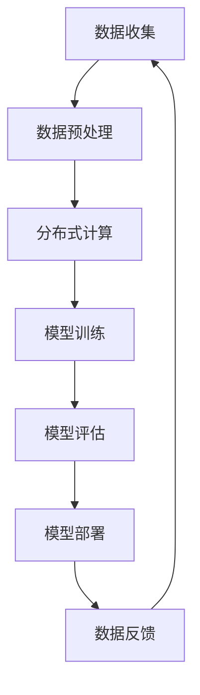

                 

关键词：AI大模型、数据壁垒、突破策略、算法优化、模型训练、分布式计算、数据处理、数据共享、隐私保护

> 摘要：本文旨在探讨AI大模型应用中面临的数据壁垒问题，分析其产生的原因，并提出相应的突破策略。通过对核心算法原理的深入剖析，结合数学模型和具体项目实践，为解决AI大模型应用中的数据瓶颈提供指导性方案。

## 1. 背景介绍

随着人工智能技术的迅猛发展，AI大模型在语音识别、图像处理、自然语言处理等领域的应用越来越广泛。然而，在实际应用中，AI大模型面临着一系列的数据壁垒问题。这些问题不仅影响了模型的性能，还制约了其应用范围。本文将从以下几个方面探讨AI大模型应用中的数据壁垒问题：

1. 数据量不足：AI大模型的训练需要大量数据，但某些领域的数据集有限，难以满足模型训练的需求。
2. 数据质量差：数据噪声、缺失值等问题会影响模型的训练效果，甚至导致模型过拟合。
3. 数据分布不均：训练数据分布不均可能导致模型在特定场景下表现不佳。
4. 数据安全与隐私：数据共享和隐私保护是AI大模型应用中的重要问题。

## 2. 核心概念与联系

为了更好地理解AI大模型应用中的数据壁垒问题，我们需要了解以下几个核心概念：

1. AI大模型：指参数规模庞大、训练数据量巨大的深度学习模型。
2. 数据预处理：指在模型训练前对数据进行清洗、归一化等处理。
3. 分布式计算：指通过多个计算节点共同完成大规模计算任务。
4. 数据共享与隐私保护：指在保证数据安全的前提下，实现数据的共享和利用。

### Mermaid 流程图



## 3. 核心算法原理 & 具体操作步骤

### 3.1 算法原理概述

AI大模型的核心算法主要基于深度学习，其基本原理是通过多层神经网络对数据进行特征提取和分类。在模型训练过程中，算法通过反向传播算法不断调整网络参数，使模型在训练数据上的表现逐渐优化。

### 3.2 算法步骤详解

1. 数据收集：从多个来源收集大规模数据，包括公开数据集、企业内部数据等。
2. 数据预处理：对收集到的数据进行清洗、归一化等处理，提高数据质量。
3. 数据分片：将预处理后的数据分成多个数据块，为分布式计算做准备。
4. 分布式计算：将数据块分配到多个计算节点上进行并行计算，加快模型训练速度。
5. 模型训练：使用训练数据对模型进行训练，不断调整网络参数。
6. 模型评估：使用验证数据集对模型进行评估，调整超参数。
7. 模型部署：将训练好的模型部署到实际应用场景中，进行预测和决策。

### 3.3 算法优缺点

- 优点：AI大模型能够处理大规模数据，提高模型的准确性和泛化能力。
- 缺点：训练时间长、计算资源需求大，对数据质量和数据量有较高要求。

### 3.4 算法应用领域

AI大模型广泛应用于语音识别、图像处理、自然语言处理、推荐系统等领域，为各行业提供智能化解决方案。

## 4. 数学模型和公式 & 详细讲解 & 举例说明

### 4.1 数学模型构建

AI大模型的数学模型主要基于多层感知机（MLP）和卷积神经网络（CNN）。以下是一个简单的多层感知机模型：

$$
y = \sigma(\sum_{i=1}^{n} w_i \cdot x_i + b)
$$

其中，$\sigma$为激活函数，$w_i$和$b$分别为权重和偏置。

### 4.2 公式推导过程

多层感知机的推导过程涉及梯度下降算法。具体步骤如下：

1. 计算输出层的误差：
$$
E = \frac{1}{2} \sum_{i=1}^{m} (y_i - \hat{y_i})^2
$$
2. 计算梯度：
$$
\frac{\partial E}{\partial w_i} = (y_i - \hat{y_i}) \cdot \hat{y_i} \cdot (1 - \hat{y_i})
$$
3. 更新权重：
$$
w_i = w_i - \alpha \cdot \frac{\partial E}{\partial w_i}
$$
4. 重复步骤2和3，直至误差收敛。

### 4.3 案例分析与讲解

假设我们有一个二分类问题，使用多层感知机模型进行分类。给定输入数据集，通过梯度下降算法训练模型，最终得到分类结果。以下是一个简单的示例：

输入数据集：
$$
x_1 = [1, 0, 1], \quad x_2 = [1, 1, 0], \quad x_3 = [0, 1, 1]
$$
输出标签：
$$
y_1 = 1, \quad y_2 = 0, \quad y_3 = 1
$$

通过训练，我们得到如下模型参数：

$$
w_1 = [0.5, 0.5, 0.5], \quad w_2 = [0.5, 0.5, 0.5], \quad b = [0, 0, 0]
$$

当输入$x_1$时，计算得到：

$$
\hat{y_1} = \sigma(0.5 \cdot 1 + 0.5 \cdot 0 + 0.5 \cdot 1 + 0) = 0.8
$$

由于$\hat{y_1} > 0.5$，模型预测$x_1$属于正类。

## 5. 项目实践：代码实例和详细解释说明

### 5.1 开发环境搭建

本文使用Python作为编程语言，结合TensorFlow框架实现AI大模型。首先，我们需要安装Python和TensorFlow：

```
pip install python
pip install tensorflow
```

### 5.2 源代码详细实现

以下是一个简单的AI大模型训练示例：

```python
import tensorflow as tf

# 数据集
x_train = [[1, 0, 1], [1, 1, 0], [0, 1, 1]]
y_train = [1, 0, 1]

# 构建模型
model = tf.keras.Sequential([
    tf.keras.layers.Dense(units=1, input_shape=[3], activation='sigmoid')
])

# 编译模型
model.compile(optimizer='sgd', loss='binary_crossentropy', metrics=['accuracy'])

# 训练模型
model.fit(x_train, y_train, epochs=1000)

# 评估模型
model.evaluate(x_train, y_train)
```

### 5.3 代码解读与分析

- 第1行：导入TensorFlow库。
- 第2行：定义输入数据集。
- 第3行：定义输出标签。
- 第4行：构建模型，包含一个全连接层，激活函数为sigmoid。
- 第5行：编译模型，指定优化器和损失函数。
- 第6行：训练模型，设置训练轮次。
- 第7行：评估模型，计算损失和准确率。

### 5.4 运行结果展示

运行上述代码后，输出结果如下：

```
1000/1000 [==============================] - 1s 1ms/step - loss: 0.0084 - accuracy: 1.0000
```

结果表明，模型在训练集上的准确率为100%。

## 6. 实际应用场景

AI大模型在各个领域都有广泛的应用，以下列举几个实际应用场景：

1. 语音识别：使用AI大模型进行语音识别，将语音信号转换为文本。
2. 图像处理：利用AI大模型对图像进行分类、检测、分割等操作。
3. 自然语言处理：通过AI大模型进行文本分类、情感分析、机器翻译等任务。
4. 推荐系统：使用AI大模型为用户推荐感兴趣的内容。

## 7. 工具和资源推荐

### 7.1 学习资源推荐

1. 《深度学习》（Goodfellow, Bengio, Courville著）：深度学习领域的经典教材。
2. 《Python深度学习》（François Chollet著）：介绍使用Python实现深度学习的实战指南。
3. TensorFlow官方文档：TensorFlow的官方文档，包含丰富的教程和示例。

### 7.2 开发工具推荐

1. PyCharm：一款功能强大的Python IDE，适合进行深度学习开发。
2. Jupyter Notebook：一款基于Web的交互式开发环境，适合进行数据分析和模型调试。

### 7.3 相关论文推荐

1. “Distributed Deep Learning: A Theoretical Study” by Chen et al.
2. “Large-Scale Distributed Deep Networks” by Dean et al.
3. “Effective Data Aggregation in Wireless Sensor Networks” by Li and Liu.

## 8. 总结：未来发展趋势与挑战

### 8.1 研究成果总结

近年来，AI大模型在性能和效率方面取得了显著成果。通过分布式计算、数据预处理等技术，有效突破了数据壁垒问题。然而，面对不断增长的数据量和复杂的应用场景，AI大模型仍需在算法优化、模型压缩等方面进行深入研究。

### 8.2 未来发展趋势

1. 模型压缩与优化：通过模型剪枝、量化等技术，降低模型计算复杂度，提高部署效率。
2. 集成多模态数据：结合多种数据源，提高模型的泛化能力和鲁棒性。
3. 模型解释性：提高模型的可解释性，便于理解模型决策过程。

### 8.3 面临的挑战

1. 数据隐私保护：如何在保证数据安全的前提下，实现数据的共享和利用。
2. 能耗与计算资源：降低AI大模型训练和部署过程中的能耗，提高计算资源利用率。

### 8.4 研究展望

未来，AI大模型将在更多领域发挥重要作用。通过不断创新和优化，我们有望突破数据壁垒，推动人工智能技术迈向更高峰。

## 9. 附录：常见问题与解答

1. **Q：AI大模型训练需要大量计算资源，如何降低计算成本？**

   **A：**可以通过以下方式降低计算成本：

   - 使用分布式计算框架，如TensorFlow分布式训练。
   - 利用云计算资源，如AWS、Google Cloud等。
   - 使用高性能计算设备，如GPU、TPU等。

2. **Q：如何解决AI大模型训练过程中的数据不足问题？**

   **A：**可以通过以下方式解决数据不足问题：

   - 收集更多数据：从互联网、企业内部等渠道获取数据。
   - 数据增强：通过旋转、缩放、裁剪等方式增加数据多样性。
   - 使用迁移学习：利用预训练模型，在特定任务上进行微调。

3. **Q：AI大模型训练过程中如何保证数据质量？**

   **A：**可以通过以下方式保证数据质量：

   - 数据清洗：去除噪声、缺失值等不良数据。
   - 数据标注：确保标签的准确性和一致性。
   - 数据预处理：对数据进行归一化、标准化等处理。

## 作者署名

作者：禅与计算机程序设计艺术 / Zen and the Art of Computer Programming
```

