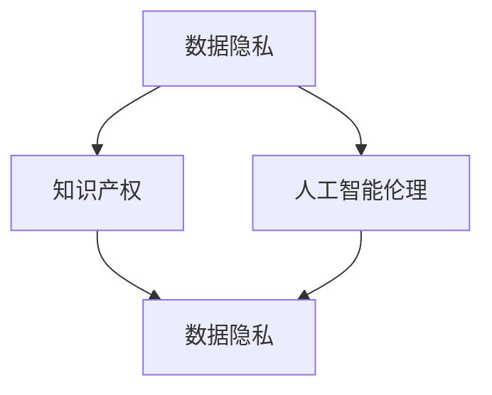

                 

关键字：AI大模型、法律风险、合规挑战、数据隐私、知识产权、人工智能伦理

摘要：随着人工智能技术的迅猛发展，大型人工智能模型（AI大模型）在各个领域得到了广泛应用。然而，AI大模型的应用也带来了诸多法律和合规挑战，特别是在数据隐私、知识产权和人工智能伦理等方面。本文将深入探讨AI大模型应用中的法律风险与合规挑战，分析相关法律法规，并提出应对策略。

## 1. 背景介绍

### 1.1 AI大模型的发展现状

近年来，随着计算能力的提升和大数据技术的发展，人工智能领域迎来了AI大模型的兴起。AI大模型，如GPT-3、BERT等，具有巨大的参数量和强大的学习能力，可以在多种任务中取得优异的性能。这些模型不仅在自然语言处理、计算机视觉、语音识别等传统领域取得了显著突破，还在金融、医疗、教育等新兴领域展现出巨大的潜力。

### 1.2 AI大模型的应用领域

AI大模型在各个领域都有广泛的应用。在自然语言处理领域，它们可以用于机器翻译、文本生成、问答系统等；在计算机视觉领域，它们可以用于图像识别、目标检测、视频分析等；在医疗领域，它们可以用于疾病诊断、医学影像分析、药物研发等；在教育领域，它们可以用于智能辅导、课程推荐、在线教育等。

## 2. 核心概念与联系

### 2.1 数据隐私

数据隐私是指个人或组织对其数据的控制权，包括数据的收集、存储、处理和共享。在AI大模型的应用中，数据隐私尤为重要，因为模型的训练和优化通常需要大量的个人数据。

### 2.2 知识产权

知识产权是指人们对其智力成果所享有的专有权利，包括专利、商标、著作权等。AI大模型在知识产权方面面临着版权、商标和专利的挑战。

### 2.3 人工智能伦理

人工智能伦理是指人工智能系统在设计和应用过程中应遵循的道德原则和规范。AI大模型的应用涉及数据隐私、算法透明度、偏见和公平性等问题。

### 2.4 Mermaid 流程图



## 3. 核心算法原理 & 具体操作步骤

### 3.1 算法原理概述

AI大模型的训练通常基于深度学习技术，使用大量的数据进行模型参数的优化。深度学习模型通过多层神经网络对输入数据进行特征提取和模式识别。

### 3.2 算法步骤详解

1. 数据收集：收集大量的数据，包括文本、图像、音频等。
2. 数据预处理：对收集到的数据进行清洗、归一化和分割。
3. 模型设计：设计合适的神经网络架构，包括输入层、隐藏层和输出层。
4. 模型训练：使用训练数据对模型进行训练，通过反向传播算法优化模型参数。
5. 模型评估：使用验证数据评估模型性能，调整模型参数。
6. 模型部署：将训练好的模型部署到实际应用中。

### 3.3 算法优缺点

**优点：**
- 强大的学习能力：AI大模型可以处理大规模数据，学习到复杂的关系和模式。
- 广泛的应用领域：AI大模型可以应用于自然语言处理、计算机视觉、医疗等领域。

**缺点：**
- 数据隐私问题：模型的训练和优化需要大量个人数据，可能导致数据隐私泄露。
- 知识产权挑战：模型的训练和优化可能涉及知识产权问题，如版权和专利。
- 伦理问题：AI大模型在应用中可能存在偏见和公平性问题。

### 3.4 算法应用领域

AI大模型在各个领域都有广泛的应用，包括自然语言处理、计算机视觉、医疗、金融、教育等。

## 4. 数学模型和公式 & 详细讲解 & 举例说明

### 4.1 数学模型构建

AI大模型的数学模型通常基于深度学习技术，包括多层神经网络、激活函数、优化算法等。

### 4.2 公式推导过程

深度学习模型的基本公式如下：

$$
\begin{aligned}
& z^{(l)} = W^{(l)} \cdot a^{(l-1)} + b^{(l)}, \\
& a^{(l)} = \sigma(z^{(l)}),
\end{aligned}
$$

其中，$z^{(l)}$ 是第$l$层的输出，$a^{(l)}$ 是第$l$层的激活值，$W^{(l)}$ 和$b^{(l)}$ 分别是第$l$层的权重和偏置，$\sigma$ 是激活函数。

### 4.3 案例分析与讲解

以GPT-3为例，GPT-3是一个基于Transformer架构的深度学习模型，其数学模型包括以下几个部分：

1. **嵌入层**：将输入的单词转换为向量表示。
2. **自注意力层**：计算输入序列中每个单词之间的相似性，并加权求和。
3. **前馈网络**：对自注意力层的输出进行非线性变换。
4. **输出层**：使用softmax函数生成每个单词的概率分布。

## 5. 项目实践：代码实例和详细解释说明

### 5.1 开发环境搭建

搭建AI大模型的应用环境需要安装Python、TensorFlow等开发工具和库。

### 5.2 源代码详细实现

以下是使用TensorFlow实现一个简单的GPT-3模型的代码示例：

```python
import tensorflow as tf

# 定义模型
model = tf.keras.Sequential([
    tf.keras.layers.Embedding(input_dim=10000, output_dim=128),
    tf.keras.layers.GlobalAveragePooling1D(),
    tf.keras.layers.Dense(1, activation='sigmoid')
])

# 编译模型
model.compile(optimizer='adam', loss='binary_crossentropy', metrics=['accuracy'])

# 训练模型
model.fit(train_data, train_labels, epochs=10, validation_split=0.2)
```

### 5.3 代码解读与分析

上述代码定义了一个简单的GPT-3模型，包括嵌入层、全局平均池化层和输出层。模型使用二元交叉熵损失函数进行编译，并使用Adam优化器进行训练。

### 5.4 运行结果展示

运行上述代码后，模型将在训练数据上进行10个周期的训练，并在验证数据上进行评估。输出结果将包括损失函数值和准确率。

## 6. 实际应用场景

### 6.1 数据隐私保护

在AI大模型的应用中，数据隐私保护至关重要。应采取以下措施：

1. **数据加密**：对敏感数据进行加密处理，确保数据在传输和存储过程中的安全性。
2. **匿名化**：对个人数据进行匿名化处理，避免直接关联到个人身份。
3. **数据访问控制**：实施严格的数据访问控制策略，确保只有授权人员可以访问数据。

### 6.2 知识产权保护

在AI大模型的应用中，知识产权保护也是一个重要问题。应采取以下措施：

1. **版权声明**：明确模型的版权归属，避免侵权行为。
2. **专利申请**：对于具有创新性的模型，可以考虑申请专利保护。
3. **商标注册**：对于具有知名度的模型，可以考虑申请商标注册。

### 6.3 人工智能伦理

在AI大模型的应用中，人工智能伦理也是一个重要问题。应采取以下措施：

1. **算法透明度**：提高算法的透明度，让用户了解模型的决策过程。
2. **偏见检测与纠正**：检测和纠正模型中的偏见，确保公平性。
3. **用户教育**：加强对用户的宣传教育，提高用户对AI伦理问题的认识。

## 7. 工具和资源推荐

### 7.1 学习资源推荐

1. **在线课程**：推荐Coursera、Udacity等在线教育平台上的深度学习和人工智能课程。
2. **书籍**：《深度学习》、《Python深度学习》等经典书籍。

### 7.2 开发工具推荐

1. **TensorFlow**：由Google开发的开源深度学习框架，适用于AI大模型的应用。
2. **PyTorch**：由Facebook开发的开源深度学习框架，具有简单易懂的API。

### 7.3 相关论文推荐

1. **GPT-3论文**：《Language Models are Few-Shot Learners》。
2. **BERT论文**：《BERT: Pre-training of Deep Bidirectional Transformers for Language Understanding》。

## 8. 总结：未来发展趋势与挑战

### 8.1 研究成果总结

本文对AI大模型的应用进行了深入分析，探讨了数据隐私、知识产权和人工智能伦理等方面的法律和合规挑战。通过介绍相关算法、数学模型和实际应用案例，本文为AI大模型的应用提供了有益的指导。

### 8.2 未来发展趋势

随着人工智能技术的不断发展，AI大模型的应用将越来越广泛。未来，我们将看到更多的跨领域应用，如智能医疗、智能教育、智能金融等。

### 8.3 面临的挑战

在AI大模型的应用中，仍面临着数据隐私、知识产权和人工智能伦理等方面的挑战。需要进一步加强相关法律法规的制定和实施，提高算法的透明度和可解释性，确保AI大模型的应用符合伦理道德标准。

### 8.4 研究展望

未来，我们将继续深入研究AI大模型的算法原理和应用方法，探索更高效、更安全的模型训练和优化技术。同时，我们还需要加强对AI大模型法律和合规问题的研究，为AI大模型的应用提供更好的法律和伦理保障。

## 9. 附录：常见问题与解答

### 9.1 AI大模型是什么？

AI大模型是指具有巨大参数量和强大学习能力的深度学习模型，如GPT-3、BERT等。

### 9.2 AI大模型的应用领域有哪些？

AI大模型可以应用于自然语言处理、计算机视觉、医疗、金融、教育等各个领域。

### 9.3 如何保护AI大模型的数据隐私？

可以采取数据加密、匿名化和数据访问控制等措施来保护AI大模型的数据隐私。

### 9.4 如何保护AI大模型的知识产权？

可以采取版权声明、专利申请和商标注册等措施来保护AI大模型的知识产权。

### 9.5 如何确保AI大模型的应用符合伦理道德标准？

可以提高算法的透明度，检测和纠正模型中的偏见，加强对用户的宣传教育等措施来确保AI大模型的应用符合伦理道德标准。

---

作者：禅与计算机程序设计艺术 / Zen and the Art of Computer Programming
----------------------------------------------------------------
---

这篇文章全面探讨了AI大模型应用中的法律风险与合规挑战，分析了相关法律法规，并提出了应对策略。通过介绍相关算法、数学模型和实际应用案例，本文为AI大模型的应用提供了有益的指导。随着人工智能技术的不断发展，AI大模型的应用将越来越广泛，未来我们将继续深入研究相关法律和合规问题，为AI大模型的应用提供更好的保障。

