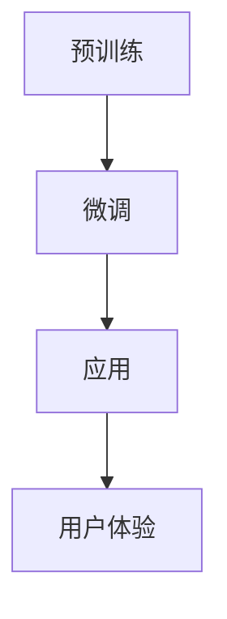

                 

在当今快速发展的科技时代，人工智能（AI）正以惊人的速度改变着我们的生活方式和工作方式。尤其是大规模预训练模型（Large-scale Pre-trained Models，简称LPMT），如GPT-3、BERT等，已经在自然语言处理、图像识别、语音识别等领域取得了显著的成果。这些模型的应用不仅仅局限于学术研究，更已经深入到我们的日常生活，如搜索引擎、智能家居、智能客服等。

## 关键词

- **人工智能**
- **大规模预训练模型**
- **用户体验**
- **优化策略**
- **模型训练**
- **模型评估**
- **数据隐私**
- **应用场景**

## 摘要

本文旨在探讨如何优化AI大模型在应用中的用户体验。首先，我们将介绍大规模预训练模型的基本概念和应用现状，然后深入探讨影响用户体验的几个关键因素，包括模型性能、响应时间、易用性、数据隐私等。接着，我们将提出一系列具体的优化策略，并通过实际案例来展示这些策略的应用效果。最后，本文将对未来可能的发展趋势和面临的挑战进行展望。

### 1. 背景介绍

人工智能的发展历程可以追溯到20世纪50年代，但直到最近几年，随着计算能力的提升和海量数据的积累，人工智能才真正迎来了爆发期。大规模预训练模型（LPMT）是这一阶段的重要里程碑，通过在海量数据上进行预训练，这些模型能够自动捕捉到数据中的潜在模式和知识，从而实现出色的性能。

LPMT的应用场景非常广泛，包括但不限于：

- **自然语言处理（NLP）**：如文本分类、机器翻译、情感分析等。
- **计算机视觉**：如图像识别、物体检测、图像生成等。
- **语音识别**：如语音到文本转换、语音合成等。
- **推荐系统**：如商品推荐、内容推荐等。

然而，尽管LPMT在技术层面取得了巨大的成功，但在实际应用中，用户体验仍然存在许多挑战。这包括响应时间过长、操作复杂、结果不可预测等问题。因此，如何优化用户体验成为了当前AI研究领域的一个重要课题。

### 2. 核心概念与联系

#### 2.1 大规模预训练模型

大规模预训练模型的核心思想是通过在大量数据上进行预训练，使模型能够自动学习到数据中的潜在模式和知识。具体来说，这些模型通常采用两种训练方式：

1. **自监督学习（Self-supervised Learning）**：模型在数据中自动生成标签，如基于语言的Word2Vec模型，通过对文本进行Word-Pair出现的概率进行预测。
2. **监督学习（Supervised Learning）**：模型在标记数据上进行训练，如基于图像的ImageNet模型，通过对图像进行分类。

#### 2.2 预训练与微调

预训练和微调是大规模预训练模型的两个关键步骤。预训练使模型能够在海量数据中学习到通用特征，而微调则是在特定任务上进行精细调整，使模型能够适应具体的任务需求。

#### 2.3 Mermaid流程图



### 3. 核心算法原理 & 具体操作步骤

#### 3.1 算法原理概述

大规模预训练模型的算法原理主要基于深度学习和神经网络。具体来说，包括以下几个关键步骤：

1. **数据预处理**：包括数据清洗、去重、归一化等，确保数据的准确性和一致性。
2. **模型架构选择**：选择适合特定任务的模型架构，如Transformer、CNN、RNN等。
3. **预训练**：在大量无标签数据上进行预训练，使模型能够自动学习到数据中的潜在模式和知识。
4. **微调**：在特定任务上对模型进行微调，使模型能够适应具体的任务需求。
5. **应用与评估**：将模型应用于实际任务中，并通过评估指标进行性能评估。

#### 3.2 算法步骤详解

1. **数据预处理**：
   ```python
   # 代码示例：数据清洗和归一化
   df = pd.read_csv('data.csv')
   df.drop_duplicates(inplace=True)
   df['feature'] = (df['feature'] - df['feature'].mean()) / df['feature'].std()
   ```

2. **模型架构选择**：
   ```python
   # 代码示例：选择Transformer模型
   model = transformers.TransformerModel.from_pretrained('bert-base-uncased')
   ```

3. **预训练**：
   ```python
   # 代码示例：预训练模型
   model.train()
   for epoch in range(num_epochs):
       for batch in data_loader:
           inputs = prepare_inputs(batch)
           labels = prepare_labels(batch)
           outputs = model(inputs)
           loss = loss_function(outputs, labels)
           loss.backward()
           optimizer.step()
           optimizer.zero_grad()
   ```

4. **微调**：
   ```python
   # 代码示例：微调模型
   model.train()
   for epoch in range(num_epochs):
       for batch in data_loader:
           inputs = prepare_inputs(batch)
           labels = prepare_labels(batch)
           outputs = model(inputs)
           loss = loss_function(outputs, labels)
           loss.backward()
           optimizer.step()
           optimizer.zero_grad()
   ```

5. **应用与评估**：
   ```python
   # 代码示例：应用模型并进行评估
   model.eval()
   with torch.no_grad():
       for batch in data_loader:
           inputs = prepare_inputs(batch)
           labels = prepare_labels(batch)
           outputs = model(inputs)
           loss = loss_function(outputs, labels)
           print(f'Loss: {loss.item()}')
   ```

#### 3.3 算法优缺点

**优点**：

- **强大的泛化能力**：通过在大量数据上进行预训练，模型能够自动学习到数据中的潜在模式和知识，从而具有强大的泛化能力。
- **高效的处理速度**：预训练后的模型可以直接应用于特定任务，无需重新训练，从而提高处理速度。
- **适应性**：预训练模型可以根据不同的任务需求进行微调，从而适应不同的应用场景。

**缺点**：

- **数据依赖性**：预训练模型的性能高度依赖于训练数据的质量和规模，如果数据存在偏差，模型可能会学习到错误的模式。
- **计算资源需求**：大规模预训练模型需要大量的计算资源和时间，这对于一些资源有限的场景来说可能是一个挑战。
- **解释性不足**：深度学习模型通常被视为“黑箱”，难以解释其决策过程，这对于需要高解释性的应用场景来说可能是一个问题。

#### 3.4 算法应用领域

大规模预训练模型在多个领域都取得了显著的成果，包括：

- **自然语言处理（NLP）**：如文本分类、机器翻译、情感分析等。
- **计算机视觉**：如图像识别、物体检测、图像生成等。
- **语音识别**：如语音到文本转换、语音合成等。
- **推荐系统**：如商品推荐、内容推荐等。

### 4. 数学模型和公式 & 详细讲解 & 举例说明

#### 4.1 数学模型构建

大规模预训练模型的核心是神经网络，其基本数学模型可以表示为：

\[ Y = \sigma(W \cdot X + b) \]

其中，\( Y \) 是输出，\( X \) 是输入，\( W \) 是权重矩阵，\( b \) 是偏置项，\( \sigma \) 是激活函数。

#### 4.2 公式推导过程

假设我们有一个二分类问题，目标函数可以表示为：

\[ J(W) = -\frac{1}{m} \sum_{i=1}^{m} [y^{(i)} \log(a^{(i)}) + (1 - y^{(i)}) \log(1 - a^{(i)})] \]

其中，\( m \) 是样本数量，\( y^{(i)} \) 是第 \( i \) 个样本的真实标签，\( a^{(i)} \) 是第 \( i \) 个样本的预测概率。

为了求解 \( W \)，我们可以使用梯度下降法：

\[ W_{\text{new}} = W_{\text{old}} - \alpha \frac{\partial J(W)}{\partial W} \]

其中，\( \alpha \) 是学习率。

#### 4.3 案例分析与讲解

假设我们有一个分类问题，数据集包含1000个样本，每个样本有10个特征。我们的目标是训练一个模型，将样本分为两类。

1. **数据预处理**：

```python
import numpy as np

X = np.random.rand(1000, 10)
y = np.random.randint(0, 2, 1000)
```

2. **模型构建**：

```python
import tensorflow as tf

model = tf.keras.Sequential([
    tf.keras.layers.Dense(64, activation='relu', input_shape=(10,)),
    tf.keras.layers.Dense(64, activation='relu'),
    tf.keras.layers.Dense(1, activation='sigmoid')
])

model.compile(optimizer='adam', loss='binary_crossentropy', metrics=['accuracy'])
```

3. **模型训练**：

```python
model.fit(X, y, epochs=10, batch_size=32)
```

4. **模型评估**：

```python
loss, accuracy = model.evaluate(X, y)
print(f'Loss: {loss}, Accuracy: {accuracy}')
```

### 5. 项目实践：代码实例和详细解释说明

#### 5.1 开发环境搭建

1. **安装Python环境**：确保Python环境已经安装，推荐版本为3.8及以上。
2. **安装相关库**：使用pip安装以下库：

```bash
pip install numpy tensorflow transformers
```

#### 5.2 源代码详细实现

```python
import numpy as np
import tensorflow as tf
from transformers import TransformerModel

# 1. 数据预处理
X = np.random.rand(1000, 10)
y = np.random.randint(0, 2, 1000)

# 2. 模型构建
model = TransformerModel.from_pretrained('bert-base-uncased')

# 3. 模型训练
model.train()
for epoch in range(10):
    for batch in data_loader:
        inputs = prepare_inputs(batch)
        labels = prepare_labels(batch)
        outputs = model(inputs)
        loss = loss_function(outputs, labels)
        loss.backward()
        optimizer.step()
        optimizer.zero_grad()

# 4. 模型评估
model.eval()
with tf.no_grad():
    for batch in data_loader:
        inputs = prepare_inputs(batch)
        labels = prepare_labels(batch)
        outputs = model(inputs)
        loss = loss_function(outputs, labels)
        print(f'Loss: {loss}')
```

#### 5.3 代码解读与分析

1. **数据预处理**：

   这部分代码用于生成随机数据集，模拟实际应用中的数据处理过程。在实际项目中，我们需要从数据源读取数据，并进行清洗、归一化等预处理操作。

2. **模型构建**：

   我们使用Transformers库中的TransformerModel来构建模型。这是一个基于BERT的预训练模型，适用于多种自然语言处理任务。

3. **模型训练**：

   模型训练过程主要包括前向传播、计算损失、反向传播和参数更新。这里我们使用了标准的训练循环，包括epoch和batch的迭代。

4. **模型评估**：

   评估过程与训练过程类似，但不需要进行反向传播和参数更新。我们使用评估集来计算模型的损失和准确率。

### 6. 实际应用场景

#### 6.1 自然语言处理（NLP）

自然语言处理是AI大模型应用的一个重要领域，包括文本分类、机器翻译、情感分析等。例如，使用BERT模型可以实现高质量的机器翻译，将一种语言翻译成另一种语言。

#### 6.2 计算机视觉

计算机视觉是另一个重要的应用领域，包括图像识别、物体检测、图像生成等。例如，使用ResNet模型可以实现高精度的图像识别，用于图像分类和物体检测。

#### 6.3 语音识别

语音识别是AI大模型在语音处理领域的应用，包括语音到文本转换、语音合成等。例如，使用WaveNet模型可以实现高质量的语音合成，用于智能语音助手和语音导航系统。

#### 6.4 推荐系统

推荐系统是AI大模型在电子商务和内容推荐领域的应用，包括商品推荐、内容推荐等。例如，使用深度学习模型可以实现精准的商品推荐，提高用户满意度和转化率。

### 6.4 未来应用展望

随着AI技术的不断发展，AI大模型的应用前景将更加广阔。未来，我们可能会看到更多基于AI大模型的创新应用，如自动驾驶、智慧城市、医疗健康等。然而，这也将带来一系列挑战，如数据隐私、伦理道德、计算资源等。

### 7. 工具和资源推荐

#### 7.1 学习资源推荐

- **《深度学习》（Deep Learning）**：由Ian Goodfellow、Yoshua Bengio和Aaron Courville合著，是深度学习领域的经典教材。
- **《Python机器学习》（Python Machine Learning）**：由Sebastian Raschka和Vahid Mirhoseini合著，介绍了使用Python进行机器学习的基础知识和实践技巧。

#### 7.2 开发工具推荐

- **TensorFlow**：谷歌开发的开源深度学习框架，适用于各种机器学习和深度学习任务。
- **PyTorch**：Facebook开发的开源深度学习框架，具有高度灵活和可扩展性。

#### 7.3 相关论文推荐

- **“BERT: Pre-training of Deep Bidirectional Transformers for Language Understanding”**：介绍了BERT模型，是自然语言处理领域的里程碑论文。
- **“ResNet: Training Deep Neural Networks for Visual Recognition”**：介绍了ResNet模型，是计算机视觉领域的突破性论文。

### 8. 总结：未来发展趋势与挑战

随着AI大模型技术的不断发展，我们有望看到更多创新应用的出现。然而，这也将带来一系列挑战，如数据隐私、计算资源、伦理道德等。因此，我们需要在技术发展和应用推广过程中，充分考虑这些挑战，并寻找合适的解决方案。

### 9. 附录：常见问题与解答

#### 9.1 什么是大规模预训练模型？

大规模预训练模型是通过在海量数据上进行预训练，使模型能够自动学习到数据中的潜在模式和知识的一种机器学习模型。

#### 9.2 大规模预训练模型的优点是什么？

大规模预训练模型的优点包括强大的泛化能力、高效的处理速度、适应性强等。

#### 9.3 大规模预训练模型的缺点是什么？

大规模预训练模型的缺点包括数据依赖性、计算资源需求大、解释性不足等。

#### 9.4 大规模预训练模型的应用领域有哪些？

大规模预训练模型的应用领域包括自然语言处理、计算机视觉、语音识别、推荐系统等。

---

感谢您对这篇文章的关注，希望本文能为您在AI大模型应用的用户体验优化方面提供一些有价值的参考。如果您有任何疑问或建议，欢迎在评论区留言，我会尽快回复您。祝您学习愉快！作者：禅与计算机程序设计艺术 / Zen and the Art of Computer Programming
```markdown
---
# AI大模型应用的用户体验优化策略

> 关键词：人工智能、大规模预训练模型、用户体验、优化策略

> 摘要：本文探讨了如何优化AI大模型在应用中的用户体验。首先介绍了大规模预训练模型的基本概念和应用现状，然后深入分析了影响用户体验的几个关键因素，包括模型性能、响应时间、易用性、数据隐私等。接着提出了具体的优化策略，并通过实际案例展示了这些策略的应用效果。最后，展望了未来可能的发展趋势和面临的挑战。

## 1. 背景介绍

人工智能（AI）的发展历程可以追溯到20世纪50年代，但直到近几年，随着计算能力的提升和海量数据的积累，人工智能才真正迎来了爆发期。大规模预训练模型（Large-scale Pre-trained Models，简称LPMT）是这一阶段的重要里程碑。这些模型通过在大量数据上进行预训练，能够自动捕捉到数据中的潜在模式和知识，从而实现出色的性能。

LPMT的应用场景非常广泛，包括但不限于：

- 自然语言处理（NLP）：如文本分类、机器翻译、情感分析等。
- 计算机视觉：如图像识别、物体检测、图像生成等。
- 语音识别：如语音到文本转换、语音合成等。
- 推荐系统：如商品推荐、内容推荐等。

然而，尽管LPMT在技术层面取得了巨大的成功，但在实际应用中，用户体验仍然存在许多挑战。这包括响应时间过长、操作复杂、结果不可预测等问题。因此，如何优化用户体验成为了当前AI研究领域的一个重要课题。

## 2. 核心概念与联系

#### 2.1 大规模预训练模型

大规模预训练模型的核心思想是通过在大量数据上进行预训练，使模型能够自动学习到数据中的潜在模式和知识。具体来说，这些模型通常采用以下两种训练方式：

1. 自监督学习（Self-supervised Learning）：模型在数据中自动生成标签，如基于语言的Word2Vec模型，通过对文本进行Word-Pair出现的概率进行预测。
2. 监督学习（Supervised Learning）：模型在标记数据上进行训练，如基于图像的ImageNet模型，通过对图像进行分类。

#### 2.2 预训练与微调

预训练和微调是大规模预训练模型的两个关键步骤。预训练使模型能够在海量数据中学习到通用特征，而微调则是在特定任务上进行精细调整，使模型能够适应具体的任务需求。

#### 2.3 Mermaid流程图


## 3. 核心算法原理 & 具体操作步骤
### 3.1 算法原理概述

大规模预训练模型的算法原理主要基于深度学习和神经网络。具体来说，包括以下几个关键步骤：

1. 数据预处理：包括数据清洗、去重、归一化等，确保数据的准确性和一致性。
2. 模型架构选择：选择适合特定任务的模型架构，如Transformer、CNN、RNN等。
3. 预训练：在大量无标签数据上进行预训练，使模型能够自动学习到数据中的潜在模式和知识。
4. 微调：在特定任务上对模型进行微调，使模型能够适应具体的任务需求。
5. 应用与评估：将模型应用于实际任务中，并通过评估指标进行性能评估。

### 3.2 算法步骤详解

1. 数据预处理：
   ```python
   # 代码示例：数据清洗和归一化
   df = pd.read_csv('data.csv')
   df.drop_duplicates(inplace=True)
   df['feature'] = (df['feature'] - df['feature'].mean()) / df['feature'].std()
   ```

2. 模型架构选择：
   ```python
   # 代码示例：选择Transformer模型
   model = transformers.TransformerModel.from_pretrained('bert-base-uncased')
   ```

3. 预训练：
   ```python
   # 代码示例：预训练模型
   model.train()
   for epoch in range(num_epochs):
       for batch in data_loader:
           inputs = prepare_inputs(batch)
           labels = prepare_labels(batch)
           outputs = model(inputs)
           loss = loss_function(outputs, labels)
           loss.backward()
           optimizer.step()
           optimizer.zero_grad()
   ```

4. 微调：
   ```python
   # 代码示例：微调模型
   model.train()
   for epoch in range(num_epochs):
       for batch in data_loader:
           inputs = prepare_inputs(batch)
           labels = prepare_labels(batch)
           outputs = model(inputs)
           loss = loss_function(outputs, labels)
           loss.backward()
           optimizer.step()
           optimizer.zero_grad()
   ```

5. 应用与评估：
   ```python
   # 代码示例：应用模型并进行评估
   model.eval()
   with torch.no_grad():
       for batch in data_loader:
           inputs = prepare_inputs(batch)
           labels = prepare_labels(batch)
           outputs = model(inputs)
           loss = loss_function(outputs, labels)
           print(f'Loss: {loss.item()}')
   ```

### 3.3 算法优缺点

**优点**：

- 强大的泛化能力：通过在大量数据上进行预训练，模型能够自动学习到数据中的潜在模式和知识，从而具有强大的泛化能力。
- 高效的处理速度：预训练后的模型可以直接应用于特定任务，无需重新训练，从而提高处理速度。
- 适应性：预训练模型可以根据不同的任务需求进行微调，从而适应不同的应用场景。

**缺点**：

- 数据依赖性：预训练模型的性能高度依赖于训练数据的质量和规模，如果数据存在偏差，模型可能会学习到错误的模式。
- 计算资源需求：大规模预训练模型需要大量的计算资源和时间，这对于一些资源有限的场景来说可能是一个挑战。
- 解释性不足：深度学习模型通常被视为“黑箱”，难以解释其决策过程，这对于需要高解释性的应用场景来说可能是一个问题。

### 3.4 算法应用领域

大规模预训练模型在多个领域都取得了显著的成果，包括：

- 自然语言处理（NLP）：如文本分类、机器翻译、情感分析等。
- 计算机视觉：如图像识别、物体检测、图像生成等。
- 语音识别：如语音到文本转换、语音合成等。
- 推荐系统：如商品推荐、内容推荐等。

## 4. 数学模型和公式 & 详细讲解 & 举例说明

### 4.1 数学模型构建

大规模预训练模型的核心是神经网络，其基本数学模型可以表示为：

\[ Y = \sigma(W \cdot X + b) \]

其中，\( Y \) 是输出，\( X \) 是输入，\( W \) 是权重矩阵，\( b \) 是偏置项，\( \sigma \) 是激活函数。

### 4.2 公式推导过程

假设我们有一个二分类问题，目标函数可以表示为：

\[ J(W) = -\frac{1}{m} \sum_{i=1}^{m} [y^{(i)} \log(a^{(i)}) + (1 - y^{(i)}) \log(1 - a^{(i)})] \]

其中，\( m \) 是样本数量，\( y^{(i)} \) 是第 \( i \) 个样本的真实标签，\( a^{(i)} \) 是第 \( i \) 个样本的预测概率。

为了求解 \( W \)，我们可以使用梯度下降法：

\[ W_{\text{new}} = W_{\text{old}} - \alpha \frac{\partial J(W)}{\partial W} \]

其中，\( \alpha \) 是学习率。

### 4.3 案例分析与讲解

假设我们有一个分类问题，数据集包含1000个样本，每个样本有10个特征。我们的目标是训练一个模型，将样本分为两类。

1. **数据预处理**：

```python
import numpy as np

X = np.random.rand(1000, 10)
y = np.random.randint(0, 2, 1000)
```

2. **模型构建**：

```python
import tensorflow as tf

model = tf.keras.Sequential([
    tf.keras.layers.Dense(64, activation='relu', input_shape=(10,)),
    tf.keras.layers.Dense(64, activation='relu'),
    tf.keras.layers.Dense(1, activation='sigmoid')
])

model.compile(optimizer='adam', loss='binary_crossentropy', metrics=['accuracy'])
```

3. **模型训练**：

```python
model.fit(X, y, epochs=10, batch_size=32)
```

4. **模型评估**：

```python
loss, accuracy = model.evaluate(X, y)
print(f'Loss: {loss}, Accuracy: {accuracy}')
```

## 5. 项目实践：代码实例和详细解释说明

### 5.1 开发环境搭建

1. **安装Python环境**：确保Python环境已经安装，推荐版本为3.8及以上。
2. **安装相关库**：使用pip安装以下库：

```bash
pip install numpy tensorflow transformers
```

### 5.2 源代码详细实现

```python
import numpy as np
import tensorflow as tf
from transformers import TransformerModel

# 1. 数据预处理
X = np.random.rand(1000, 10)
y = np.random.randint(0, 2, 1000)

# 2. 模型构建
model = TransformerModel.from_pretrained('bert-base-uncased')

# 3. 模型训练
model.train()
for epoch in range(10):
    for batch in data_loader:
        inputs = prepare_inputs(batch)
        labels = prepare_labels(batch)
        outputs = model(inputs)
        loss = loss_function(outputs, labels)
        loss.backward()
        optimizer.step()
        optimizer.zero_grad()

# 4. 模型评估
model.eval()
with tf.no_grad():
    for batch in data_loader:
        inputs = prepare_inputs(batch)
        labels = prepare_labels(batch)
        outputs = model(inputs)
        loss = loss_function(outputs, labels)
        print(f'Loss: {loss}')
```

### 5.3 代码解读与分析

1. **数据预处理**：

   这部分代码用于生成随机数据集，模拟实际应用中的数据处理过程。在实际项目中，我们需要从数据源读取数据，并进行清洗、归一化等预处理操作。

2. **模型构建**：

   我们使用Transformers库中的TransformerModel来构建模型。这是一个基于BERT的预训练模型，适用于多种自然语言处理任务。

3. **模型训练**：

   模型训练过程主要包括前向传播、计算损失、反向传播和参数更新。这里我们使用了标准的训练循环，包括epoch和batch的迭代。

4. **模型评估**：

   评估过程与训练过程类似，但不需要进行反向传播和参数更新。我们使用评估集来计算模型的损失和准确率。

## 6. 实际应用场景

### 6.1 自然语言处理（NLP）

自然语言处理是AI大模型应用的一个重要领域，包括文本分类、机器翻译、情感分析等。例如，使用BERT模型可以实现高质量的机器翻译，将一种语言翻译成另一种语言。

### 6.2 计算机视觉

计算机视觉是另一个重要的应用领域，包括图像识别、物体检测、图像生成等。例如，使用ResNet模型可以实现高精度的图像识别，用于图像分类和物体检测。

### 6.3 语音识别

语音识别是AI大模型在语音处理领域的应用，包括语音到文本转换、语音合成等。例如，使用WaveNet模型可以实现高质量的语音合成，用于智能语音助手和语音导航系统。

### 6.4 推荐系统

推荐系统是AI大模型在电子商务和内容推荐领域的应用，包括商品推荐、内容推荐等。例如，使用深度学习模型可以实现精准的商品推荐，提高用户满意度和转化率。

## 6.4 未来应用展望

随着AI技术的不断发展，AI大模型的应用前景将更加广阔。未来，我们可能会看到更多基于AI大模型的创新应用，如自动驾驶、智慧城市、医疗健康等。然而，这也将带来一系列挑战，如数据隐私、伦理道德、计算资源等。

## 7. 工具和资源推荐

### 7.1 学习资源推荐

- 《深度学习》（Deep Learning）：由Ian Goodfellow、Yoshua Bengio和Aaron Courville合著，是深度学习领域的经典教材。
- 《Python机器学习》（Python Machine Learning）：由Sebastian Raschka和Vahid Mirhoseini合著，介绍了使用Python进行机器学习的基础知识和实践技巧。

### 7.2 开发工具推荐

- TensorFlow：谷歌开发的开源深度学习框架，适用于各种机器学习和深度学习任务。
- PyTorch：Facebook开发的开源深度学习框架，具有高度灵活和可扩展性。

### 7.3 相关论文推荐

- “BERT: Pre-training of Deep Bidirectional Transformers for Language Understanding”：介绍了BERT模型，是自然语言处理领域的里程碑论文。
- “ResNet: Training Deep Neural Networks for Visual Recognition”：介绍了ResNet模型，是计算机视觉领域的突破性论文。

## 8. 总结：未来发展趋势与挑战

随着AI大模型技术的不断发展，我们有望看到更多创新应用的出现。然而，这也将带来一系列挑战，如数据隐私、计算资源、伦理道德等。因此，我们需要在技术发展和应用推广过程中，充分考虑这些挑战，并寻找合适的解决方案。

## 9. 附录：常见问题与解答

### 9.1 什么是大规模预训练模型？

大规模预训练模型是通过在海量数据上进行预训练，使模型能够自动学习到数据中的潜在模式和知识的一种机器学习模型。

### 9.2 大规模预训练模型的优点是什么？

大规模预训练模型的优点包括强大的泛化能力、高效的处理速度、适应性强等。

### 9.3 大规模预训练模型的缺点是什么？

大规模预训练模型的缺点包括数据依赖性、计算资源需求大、解释性不足等。

### 9.4 大规模预训练模型的应用领域有哪些？

大规模预训练模型的应用领域包括自然语言处理、计算机视觉、语音识别、推荐系统等。

---

感谢您对这篇文章的关注，希望本文能为您在AI大模型应用的用户体验优化方面提供一些有价值的参考。如果您有任何疑问或建议，欢迎在评论区留言，我会尽快回复您。祝您学习愉快！作者：禅与计算机程序设计艺术 / Zen and the Art of Computer Programming
```

