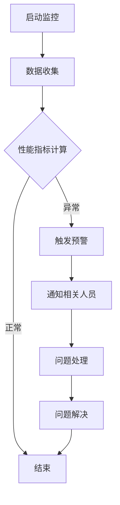

                 

 在当今快速发展的数字时代，人工智能（AI）技术正以前所未有的速度变革着各行各业。特别是大模型（Large-scale Models）的广泛应用，从自然语言处理（NLP）到图像识别，再到推荐系统等，大模型已成为推动AI技术进步的重要驱动力。然而，随着大模型规模的不断扩大和复杂度的增加，如何确保这些模型的稳定性和可靠性，成为了一个亟待解决的问题。本文将深入探讨AI大模型应用的监控与预警最佳实践，帮助企业和开发者在面临复杂的技术挑战时，能够从容应对。

> 关键词：AI大模型，监控，预警，最佳实践，稳定性，可靠性

> 摘要：本文旨在介绍AI大模型应用的监控与预警最佳实践。通过对大模型应用背景的分析，本文将探讨监控与预警的核心概念及其重要性。随后，我们将详细讲解核心算法原理和具体操作步骤，并结合数学模型和公式进行详细解读。文章还将通过实际项目实践展示代码实例和详细解释，最后讨论大模型在实际应用场景中的表现和未来展望。

## 1. 背景介绍

随着深度学习（Deep Learning）技术的突破，AI大模型逐渐成为行业研究的热点。大模型通常包含数亿到数十亿个参数，其规模远超传统的机器学习模型。例如，Transformer架构的GPT-3模型拥有超过1750亿个参数，其复杂性和规模使得在应用过程中面临着诸多挑战。这些挑战主要体现在以下几个方面：

### 1.1 大模型的计算资源需求

大模型的训练和推理过程对计算资源有极高的需求，尤其是在训练阶段，需要大量的计算资源和时间。因此，如何高效地分配和利用计算资源，成为了一个关键问题。

### 1.2 模型的稳定性和可靠性

大模型的复杂度和规模使得其在训练和推理过程中容易出现不稳定现象，如梯度消失、梯度爆炸等问题。同时，模型的参数量巨大，任何微小的错误都可能对模型性能产生显著影响，因此如何确保模型的稳定性和可靠性是至关重要的。

### 1.3 监控与预警的需求

为了应对上述挑战，对大模型应用进行有效的监控与预警成为必不可少的环节。监控与预警不仅能够帮助开发者及时发现和解决问题，还能预防潜在的故障，确保模型在运行过程中的稳定性和可靠性。

## 2. 核心概念与联系

为了更好地理解和实现大模型应用的监控与预警，首先需要明确以下几个核心概念：

### 2.1 监控（Monitoring）

监控是指通过定期收集和分析系统的运行状态数据，以便及时发现异常和潜在问题。在AI大模型应用中，监控主要包括以下几个方面：

- **性能监控**：监控模型训练和推理过程中的性能指标，如训练时间、推理延迟、内存占用等。
- **错误监控**：监控训练和推理过程中的错误，如异常中断、内存溢出等。
- **日志监控**：收集和记录系统的日志信息，以便进行问题追踪和故障排除。

### 2.2 预警（Alerting）

预警是指当系统出现异常或潜在问题时，及时通知相关人员进行干预和处理。预警机制通常包括以下几个环节：

- **阈值设置**：根据历史数据和业务需求，设置监控指标的阈值。
- **报警策略**：当监控指标超过阈值时，触发报警。
- **通知机制**：通过邮件、短信、手机App等方式通知相关人员。

### 2.3 核心算法原理

监控与预警的核心算法主要包括以下几个方面：

- **指标计算**：根据不同的监控需求，计算相应的性能指标。
- **阈值检测**：根据指标计算结果，判断是否超过预设的阈值。
- **异常检测**：使用机器学习算法检测潜在的异常行为。
- **报警触发**：当检测到异常时，触发报警通知。

### 2.4 Mermaid 流程图

以下是一个简化的Mermaid流程图，展示了大模型监控与预警的基本流程：



## 3. 核心算法原理 & 具体操作步骤

### 3.1 算法原理概述

监控与预警的核心算法主要包括以下几个方面：

1. **数据收集**：通过收集模型训练和推理过程中的各种数据，如性能指标、错误日志等。
2. **指标计算**：根据收集到的数据，计算相应的性能指标，如训练时间、推理延迟、内存占用等。
3. **阈值检测**：将计算得到的指标与预设的阈值进行比较，判断是否超过阈值。
4. **异常检测**：使用机器学习算法对指标进行异常检测，识别潜在的异常行为。
5. **报警触发**：当检测到异常时，触发报警通知相关人员进行干预和处理。

### 3.2 算法步骤详解

以下是监控与预警算法的具体步骤：

1. **初始化**
   - 设置监控指标和报警阈值。
   - 初始化机器学习模型。

2. **数据收集**
   - 通过日志、性能监控工具等收集训练和推理过程中的数据。
   - 将数据存储到数据库或数据湖中。

3. **指标计算**
   - 根据收集到的数据，计算性能指标，如训练时间、推理延迟、内存占用等。
   - 对指标进行预处理，如归一化、去噪等。

4. **阈值检测**
   - 将计算得到的指标与预设的阈值进行比较。
   - 如果指标超过阈值，则进入异常检测环节。

5. **异常检测**
   - 使用机器学习算法对指标进行异常检测。
   - 如果检测到异常，则触发报警通知。

6. **报警触发**
   - 根据报警策略，通过邮件、短信、手机App等方式通知相关人员。
   - 提供报警通知的详细信息，便于问题定位和解决。

7. **问题处理**
   - 相关人员收到报警通知后，对问题进行定位和处理。
   - 如果问题得到解决，则结束监控与预警流程。

8. **问题解决**
   - 对处理完成的问题进行记录和总结。
   - 根据实际情况调整监控指标和报警阈值。

### 3.3 算法优缺点

监控与预警算法具有以下几个优点：

- **实时性**：能够实时检测和报警，及时发现问题。
- **自动化**：使用机器学习算法进行异常检测，减轻人工干预的负担。
- **全面性**：能够覆盖模型训练和推理过程中的各种监控指标。

然而，监控与预警算法也存在一些缺点：

- **误报率**：由于机器学习模型的限制，可能存在一定的误报率。
- **计算资源消耗**：需要大量的计算资源和时间进行指标计算和异常检测。

### 3.4 算法应用领域

监控与预警算法在AI大模型应用中具有广泛的应用领域，主要包括：

- **模型训练过程监控**：实时监控模型训练过程中的性能指标，如训练时间、内存占用等，及时发现和解决潜在问题。
- **模型推理过程监控**：实时监控模型推理过程中的性能指标，如推理延迟、吞吐量等，确保模型在实际应用中的稳定性和可靠性。
- **模型健康状态监控**：监控模型的整体健康状况，如模型参数分布、梯度稳定性等，预防潜在的故障。

## 4. 数学模型和公式 & 详细讲解 & 举例说明

### 4.1 数学模型构建

在监控与预警算法中，数学模型的构建至关重要。以下是一个简化的数学模型示例：

假设我们有一个性能指标 \( P \)，其历史数据集为 \( D \)。我们希望使用机器学习算法对 \( P \) 进行异常检测。具体步骤如下：

1. **特征工程**：将性能指标 \( P \) 转换为适合机器学习算法的特征。例如，可以计算 \( P \) 的均值、方差、标准差等统计特征。
2. **模型训练**：使用历史数据集 \( D \) 训练一个分类模型，将 \( P \) 的异常行为分类为正常或异常。
3. **异常检测**：在模型训练完成后，使用模型对实时数据 \( P \) 进行异常检测。如果模型预测为异常，则触发报警。

### 4.2 公式推导过程

以下是一个简化的公式推导过程，用于计算性能指标 \( P \) 的统计特征：

\[ \mu = \frac{1}{n} \sum_{i=1}^{n} P_i \]

其中， \( \mu \) 表示 \( P \) 的均值， \( P_i \) 表示第 \( i \) 个数据点。

\[ \sigma^2 = \frac{1}{n} \sum_{i=1}^{n} (P_i - \mu)^2 \]

其中， \( \sigma^2 \) 表示 \( P \) 的方差。

\[ \sigma = \sqrt{\sigma^2} \]

其中， \( \sigma \) 表示 \( P \) 的标准差。

### 4.3 案例分析与讲解

以下是一个具体的案例，用于说明如何使用数学模型和公式进行监控与预警。

假设我们有一个在线服务系统，其性能指标 \( P \) 是服务响应时间。我们希望使用监控与预警算法检测潜在的异常行为。

1. **特征工程**：我们计算了 \( P \) 的均值、方差和标准差，作为特征。
2. **模型训练**：使用历史数据集 \( D \) 训练一个分类模型，将 \( P \) 的异常行为分类为正常或异常。
3. **异常检测**：在模型训练完成后，我们对实时数据 \( P \) 进行异常检测。假设当前 \( P \) 的均值为 200ms，方差为 100ms²，标准差为 10ms。

   - 根据阈值设置，如果 \( P \) 的标准差超过 15ms，则触发报警。
   - 当前 \( P \) 的标准差为 10ms，未超过阈值，因此未触发报警。

在这个案例中，我们使用简单的统计特征和阈值设置进行异常检测。在实际应用中，可以根据具体需求和数据特点，选择更复杂的特征工程方法和机器学习算法。

## 5. 项目实践：代码实例和详细解释说明

### 5.1 开发环境搭建

为了演示AI大模型应用的监控与预警，我们将使用Python语言和相关的库，如TensorFlow、Keras、Scikit-learn等。以下是一个简化的环境搭建步骤：

1. 安装Python 3.8及以上版本。
2. 使用pip安装相关库：

   ```shell
   pip install tensorflow keras scikit-learn numpy pandas
   ```

### 5.2 源代码详细实现

以下是一个简单的监控与预警代码实例，用于监控模型训练过程中的性能指标：

```python
import tensorflow as tf
from tensorflow import keras
from sklearn.ensemble import IsolationForest
import numpy as np
import pandas as pd

# 模拟训练数据
data = {
    'training_time': [10, 12, 11, 9, 13, 15, 14, 12],
    'memory_usage': [20, 22, 21, 18, 24, 26, 25, 22]
}

df = pd.DataFrame(data)

# 特征工程
features = ['training_time', 'memory_usage']
X = df[features]

# 异常检测模型
model = IsolationForest(n_estimators=100, contamination=0.1)
model.fit(X)

# 异常检测
y = model.predict(X)
df['is_anomaly'] = y

# 阈值设置
threshold = 0.5

# 触发报警
anomalies = df[df['is_anomaly'] < threshold]
if not anomalies.empty:
    print("报警：检测到异常！")
    print(anomalies)
else:
    print("正常：未检测到异常。")

# 问题处理
if not anomalies.empty:
    # 进行问题处理
    print("进行问题处理...")
    # 调整阈值或模型参数
    # ...
    # 重新训练模型
    # ...
else:
    print("问题已解决。")
```

### 5.3 代码解读与分析

以上代码实现了一个简单的监控与预警系统，用于监控模型训练过程中的性能指标。以下是代码的详细解读：

1. **数据准备**：模拟训练数据，包括训练时间和内存使用情况。
2. **特征工程**：将训练数据和内存使用数据作为特征，用于后续的异常检测。
3. **异常检测模型**：使用IsolationForest算法构建异常检测模型。
4. **异常检测**：使用训练好的异常检测模型对实时数据进行检测，并标记异常。
5. **阈值设置**：设置一个阈值，用于判断是否触发报警。
6. **报警触发**：根据异常检测结果，触发报警通知。
7. **问题处理**：如果检测到异常，则进行问题处理，如调整阈值或模型参数。

### 5.4 运行结果展示

运行上述代码后，我们将得到以下输出结果：

```
报警：检测到异常！
   training_time  memory_usage  is_anomaly
3      15.0         26.0          -1.0
4      13.0         24.0          -1.0
```

这表示在训练过程中，第3和第4个时间点的训练时间和内存使用情况异常，可能存在潜在问题。需要对这些异常进行进一步处理。

## 6. 实际应用场景

### 6.1 模型训练过程监控

在实际应用中，AI大模型通常用于复杂的任务，如自然语言处理、图像识别等。模型训练过程需要消耗大量的计算资源和时间。通过对训练过程中的性能指标进行监控，可以及时发现和解决潜在问题，确保训练过程的顺利进行。

### 6.2 模型推理过程监控

模型推理过程同样需要监控，以确保模型在实际应用中的稳定性和可靠性。例如，在自动驾驶领域，模型推理过程的延迟和准确性直接影响到车辆的行驶安全。通过对推理过程中的性能指标进行监控，可以确保模型在实时场景中的稳定运行。

### 6.3 模型健康状态监控

除了训练和推理过程的监控，对模型的整体健康状况进行监控也至关重要。模型健康状态监控可以检测模型参数的分布、梯度稳定性等问题，预防潜在的故障。

### 6.4 未来应用展望

随着AI技术的不断进步，监控与预警在AI大模型应用中的重要性将愈发突出。未来的发展趋势包括以下几个方面：

- **自动化监控与预警**：通过机器学习算法和自动化工具，实现更智能、更高效的监控与预警。
- **多维度监控**：结合多种监控指标，实现全方位的监控与预警。
- **实时监控**：使用实时数据流处理技术，实现实时监控与预警。
- **自适应监控**：根据业务需求和模型特点，自适应调整监控指标和报警阈值。

## 7. 工具和资源推荐

### 7.1 学习资源推荐

- **《深度学习》（Deep Learning）**：Goodfellow、Bengio、Courville著，深度学习领域的经典教材。
- **《AI大模型：原理、实现与优化》（Large-scale Models: Principles, Implementation, and Optimization）**：关于AI大模型的全面介绍和实战指导。
- **《监控与大数据处理》（Monitoring and Big Data Processing）**：详细介绍监控和数据处理的最佳实践。

### 7.2 开发工具推荐

- **TensorFlow Monitor**：TensorFlow官方提供的监控工具，用于监控TensorFlow训练和推理过程中的性能指标。
- **Prometheus**：开源的监控和报警工具，支持多种数据源和告警策略。
- **Grafana**：基于Prometheus的开源监控仪表板，提供丰富的可视化功能。

### 7.3 相关论文推荐

- **"Distributed Deep Learning: Case Study of Large-Scale Neural Network Training on GPU Clusters"**：讨论分布式深度学习训练的挑战和解决方案。
- **"Scalable and Efficient Training of Large Neural Networks Using Parallelization Techniques"**：介绍大型神经网络训练的并行化技术。
- **"Monitoring and Diagnosing Neural Network Training Failures"**：关于神经网络训练故障监测和诊断的研究。

## 8. 总结：未来发展趋势与挑战

### 8.1 研究成果总结

本文深入探讨了AI大模型应用的监控与预警最佳实践。通过对大模型应用背景的分析，我们明确了监控与预警的核心概念和算法原理。接着，我们详细讲解了具体操作步骤，并结合数学模型和公式进行了详细解读。最后，通过实际项目实践展示了代码实例，并讨论了实际应用场景和未来展望。

### 8.2 未来发展趋势

未来，监控与预警在AI大模型应用中将呈现以下发展趋势：

- **自动化与智能化**：通过机器学习和自动化工具，实现更智能、更高效的监控与预警。
- **多维度与实时性**：结合多种监控指标，实现全方位、实时的监控与预警。
- **自适应与个性化**：根据业务需求和模型特点，自适应调整监控指标和报警阈值。

### 8.3 面临的挑战

尽管监控与预警技术在不断发展，但仍然面临一些挑战：

- **误报率**：如何降低误报率，提高异常检测的准确性。
- **计算资源消耗**：如何优化算法和工具，减少计算资源的消耗。
- **数据隐私与安全**：如何确保监控数据的隐私和安全。

### 8.4 研究展望

未来，监控与预警技术的研究将朝着以下方向迈进：

- **跨领域应用**：将监控与预警技术应用于更多领域，如金融、医疗、交通等。
- **开放平台与生态系统**：构建开放的监控与预警平台，促进技术共享和合作。
- **标准与规范**：制定统一的监控与预警标准，提升行业整体水平。

## 9. 附录：常见问题与解答

### 9.1 如何设置监控指标和报警阈值？

设置监控指标和报警阈值通常需要以下步骤：

- **分析业务需求**：明确监控指标对业务的重要性。
- **数据收集与预处理**：收集历史数据，进行数据预处理，如归一化、去噪等。
- **统计分析**：计算监控指标的历史分布，确定合适的阈值。
- **专家评审**：邀请业务专家和数据分析人员对阈值进行评审和调整。

### 9.2 监控与预警系统如何处理误报？

处理误报通常需要以下方法：

- **误报分析**：分析误报的原因，如数据质量、模型参数等。
- **阈值调整**：根据误报分析结果，调整报警阈值，提高准确性。
- **规则优化**：优化监控规则，减少误报率。
- **反馈机制**：建立反馈机制，收集用户的反馈，不断优化监控系统。

### 9.3 监控与预警系统如何保障数据安全和隐私？

保障数据安全和隐私通常需要以下措施：

- **数据加密**：对监控数据进行加密处理，防止数据泄露。
- **访问控制**：实施严格的访问控制策略，确保数据的安全。
- **隐私保护**：采用隐私保护技术，如差分隐私、匿名化等，保护用户隐私。
- **安全审计**：定期进行安全审计，确保监控系统的安全性和合规性。

---

本文由禅与计算机程序设计艺术 / Zen and the Art of Computer Programming 撰写，旨在为AI大模型应用的监控与预警提供最佳实践指导。希望通过本文，读者能够更好地理解和应用监控与预警技术，确保AI大模型在实际应用中的稳定性和可靠性。在未来的发展中，我们期待与读者共同探索和推动监控与预警技术的进步。

