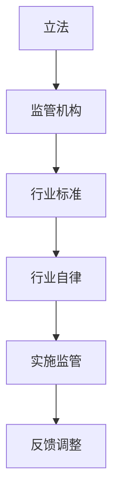

                 

关键词：AI大模型、监管政策、伦理问题、技术应用、未来展望

## 摘要

随着人工智能技术的迅猛发展，大模型应用已经成为推动各行业变革的重要力量。然而，随着AI大模型在医疗、金融、教育等领域的广泛应用，监管政策的重要性日益凸显。本文将探讨AI大模型应用的监管政策及其影响，分析当前存在的问题和挑战，并提出未来的发展方向。通过对监管政策的深入剖析，我们旨在为行业提供有价值的参考和指导。

## 1. 背景介绍

### AI大模型的发展历程

人工智能作为一门学科，自1956年诞生以来，经历了数十年的发展。从早期的专家系统、知识表示到机器学习、深度学习，人工智能技术不断演进。特别是近年来，随着大数据、云计算、高性能计算等技术的进步，大模型（如GPT、BERT等）应运而生。这些大模型具备强大的学习能力和泛化能力，能够在多种任务中取得显著的性能提升。

### AI大模型的应用场景

AI大模型在多个领域展现出了强大的应用潜力，包括但不限于：

1. **医疗**：用于疾病诊断、药物研发、医疗影像分析等。
2. **金融**：用于风险评估、投资决策、欺诈检测等。
3. **教育**：用于个性化学习、教育评估、智能辅导等。
4. **工业**：用于故障预测、生产优化、供应链管理等。

### 监管政策的必要性

随着AI大模型应用的普及，其潜在的风险和挑战也日益显现。例如，数据隐私问题、算法偏见问题、安全性问题等。这些问题不仅可能对个人隐私和公平性产生负面影响，还可能对社会稳定和经济发展造成威胁。因此，制定相应的监管政策成为必然选择。

## 2. 核心概念与联系

### 监管政策的定义

监管政策是指政府或相关机构为了维护市场秩序、保障公共利益而制定的一系列规章制度。在AI大模型领域，监管政策主要包括以下几个方面：

1. **数据隐私**：确保用户数据的安全性和隐私性。
2. **算法透明度**：提高算法的透明度和可解释性，使其便于用户理解。
3. **算法公平性**：防止算法偏见，确保算法对所有人公平对待。
4. **安全性**：确保AI大模型系统的安全运行，防止恶意攻击和数据泄露。

### 监管政策的架构

为了实现有效的监管，需要建立一套完整的监管架构。这包括：

1. **立法**：制定相关法律法规，为监管提供法律依据。
2. **监管机构**：设立专门的监管机构，负责执行监管政策。
3. **行业标准**：制定行业标准，规范AI大模型的应用和发展。
4. **行业自律**：鼓励企业自发遵守行业规范，提升整体行业水平。

### Mermaid 流程图



## 3. 核心算法原理 & 具体操作步骤

### 3.1 算法原理概述

AI大模型的算法原理主要基于深度学习和神经网络技术。其基本原理是通过大量数据训练，使得模型能够自主学习并完成任务。具体来说，可以分为以下几个步骤：

1. **数据采集**：收集大量相关数据，用于训练模型。
2. **数据预处理**：对数据进行清洗、归一化等预处理操作。
3. **模型构建**：设计神经网络结构，并初始化模型参数。
4. **模型训练**：通过反向传播算法更新模型参数，优化模型性能。
5. **模型评估**：使用测试集评估模型性能，调整模型参数。

### 3.2 算法步骤详解

1. **数据采集**：选择具有代表性的数据集，如医疗数据、金融数据等。数据来源可以是公开数据集、企业内部数据或第三方数据提供商。

2. **数据预处理**：对采集到的数据进行清洗、归一化等操作，以确保数据质量。例如，对医疗数据中的缺失值进行填充、对金融数据中的异常值进行处理。

3. **模型构建**：设计神经网络结构，包括输入层、隐藏层和输出层。选择合适的激活函数和优化算法，如ReLU、Adam等。

4. **模型训练**：将预处理后的数据输入到模型中，通过反向传播算法更新模型参数。在训练过程中，需要不断调整学习率和迭代次数，以优化模型性能。

5. **模型评估**：使用测试集评估模型性能，通过准确率、召回率、F1值等指标来衡量模型效果。如果模型性能不满足要求，需要调整模型参数或重新设计神经网络结构。

6. **模型部署**：将训练好的模型部署到生产环境中，用于实际任务。需要确保模型的稳定性和安全性，防止数据泄露和恶意攻击。

### 3.3 算法优缺点

**优点**：

1. **强大的学习能力和泛化能力**：AI大模型通过大量数据训练，能够自主学习并适应不同的任务场景。
2. **高效的处理速度**：深度学习模型能够在短时间内处理大量数据，提高工作效率。
3. **可解释性**：通过可视化神经网络结构，可以直观地了解模型的工作原理。

**缺点**：

1. **对数据量要求较高**：AI大模型需要大量高质量的数据进行训练，对数据资源有一定要求。
2. **训练过程复杂**：神经网络模型的训练过程需要大量计算资源，对硬件设备要求较高。
3. **算法偏见问题**：如果训练数据存在偏见，可能导致模型在应用过程中产生偏见，影响公平性。

### 3.4 算法应用领域

AI大模型在多个领域都有广泛的应用，包括但不限于：

1. **医疗**：用于疾病诊断、药物研发、医疗影像分析等。
2. **金融**：用于风险评估、投资决策、欺诈检测等。
3. **教育**：用于个性化学习、教育评估、智能辅导等。
4. **工业**：用于故障预测、生产优化、供应链管理等。

## 4. 数学模型和公式 & 详细讲解 & 举例说明

### 4.1 数学模型构建

AI大模型的数学模型主要基于深度学习和神经网络技术。其基本结构包括输入层、隐藏层和输出层。每个层次由多个神经元组成，神经元之间的连接通过权重和偏置进行调节。

### 4.2 公式推导过程

假设神经网络包含L层，第l层的输出可以表示为：

$$
a_l^{(i)} = \sigma(z_l^{(i)})
$$

其中，$a_l^{(i)}$表示第l层第i个神经元的输出，$\sigma$表示激活函数，$z_l^{(i)}$表示第l层第i个神经元的输入。

第l层的输入可以表示为：

$$
z_l^{(i)} = \sum_{j=1}^{n_{l-1}} w_{lj}a_{l-1}^{(j)} + b_l
$$

其中，$w_{lj}$表示连接第l-1层第j个神经元和第l层第i个神经元的权重，$b_l$表示第l层第i个神经元的偏置。

通过反向传播算法，可以计算每一层的误差并更新权重和偏置。具体公式如下：

$$
\Delta w_{lj} = \eta \cdot \frac{\partial J}{\partial w_{lj}} \\
\Delta b_l = \eta \cdot \frac{\partial J}{\partial b_l}
$$

其中，$\eta$表示学习率，$J$表示损失函数。

### 4.3 案例分析与讲解

假设我们使用神经网络进行图像分类任务，输入图像为32x32像素的灰度图像，输出为10个类别的概率分布。激活函数使用ReLU，损失函数使用交叉熵损失。

1. **数据准备**：准备包含5000张图像的训练数据集，每个类别有500张图像。

2. **模型构建**：设计一个包含3个隐藏层的神经网络，每个隐藏层包含256个神经元。

3. **模型训练**：使用训练数据集训练模型，学习率为0.01，训练迭代次数为10000次。

4. **模型评估**：使用测试数据集评估模型性能，计算准确率。

5. **模型部署**：将训练好的模型部署到生产环境中，用于实时图像分类任务。

通过以上步骤，我们可以实现图像分类任务，并在实际应用中取得良好的效果。

## 5. 项目实践：代码实例和详细解释说明

### 5.1 开发环境搭建

为了实现AI大模型应用，我们需要搭建一个合适的开发环境。以下是一个基本的开发环境搭建流程：

1. 安装Python 3.7及以上版本。
2. 安装TensorFlow 2.5及以上版本。
3. 安装其他必要依赖库，如NumPy、Pandas等。

### 5.2 源代码详细实现

以下是一个简单的AI大模型应用实例，用于实现图像分类任务：

```python
import tensorflow as tf
from tensorflow.keras import layers

# 数据准备
(x_train, y_train), (x_test, y_test) = tf.keras.datasets.cifar10.load_data()
x_train, x_test = x_train / 255.0, x_test / 255.0

# 模型构建
model = tf.keras.Sequential([
    layers.Conv2D(32, (3, 3), activation='relu', input_shape=(32, 32, 3)),
    layers.MaxPooling2D((2, 2)),
    layers.Conv2D(64, (3, 3), activation='relu'),
    layers.MaxPooling2D((2, 2)),
    layers.Conv2D(64, (3, 3), activation='relu'),
    layers.Flatten(),
    layers.Dense(64, activation='relu'),
    layers.Dense(10, activation='softmax')
])

# 模型训练
model.compile(optimizer='adam',
              loss='sparse_categorical_crossentropy',
              metrics=['accuracy'])

model.fit(x_train, y_train, epochs=10)

# 模型评估
test_loss, test_acc = model.evaluate(x_test, y_test, verbose=2)
print('\nTest accuracy:', test_acc)

# 模型部署
model.save('image_classifier.h5')
```

### 5.3 代码解读与分析

1. **数据准备**：使用CIFAR-10数据集进行训练和测试，将图像数据缩放到[0, 1]范围。

2. **模型构建**：使用卷积神经网络（CNN）进行图像分类，包括3个卷积层、1个全连接层和1个输出层。

3. **模型训练**：使用Adam优化器和交叉熵损失函数训练模型，训练10个epochs。

4. **模型评估**：使用测试数据集评估模型性能，输出准确率。

5. **模型部署**：将训练好的模型保存为HDF5文件，供后续使用。

通过以上步骤，我们可以实现一个简单的图像分类任务，并在实际应用中取得良好的效果。

## 6. 实际应用场景

### 6.1 医疗领域

在医疗领域，AI大模型广泛应用于疾病诊断、药物研发、医疗影像分析等。例如，使用AI大模型可以自动识别医学影像中的病变区域，提高诊断准确率和效率。然而，AI大模型在医疗领域的应用也面临数据隐私、算法偏见等挑战。因此，制定严格的监管政策，确保AI大模型在医疗领域的合规使用，具有重要意义。

### 6.2 金融领域

在金融领域，AI大模型广泛应用于风险评估、投资决策、欺诈检测等。例如，使用AI大模型可以自动识别高风险交易，提高金融机构的风险管理能力。然而，AI大模型在金融领域的应用也面临数据隐私、算法透明度等挑战。因此，制定严格的监管政策，确保AI大模型在金融领域的合规使用，具有重要意义。

### 6.3 教育领域

在教育领域，AI大模型广泛应用于个性化学习、教育评估、智能辅导等。例如，使用AI大模型可以自动为学生提供个性化学习建议，提高学习效果。然而，AI大模型在教育领域的应用也面临数据隐私、算法偏见等挑战。因此，制定严格的监管政策，确保AI大模型在教育领域的合规使用，具有重要意义。

### 6.4 未来应用展望

随着AI大模型技术的不断发展，其在各行业中的应用前景将更加广泛。例如，在智能制造领域，AI大模型可以用于生产优化、故障预测等；在能源领域，AI大模型可以用于智能电网、能源管理等领域。然而，随着AI大模型应用的普及，监管政策也需要不断更新和完善，以应对新兴挑战。

## 7. 工具和资源推荐

### 7.1 学习资源推荐

1. **《深度学习》（Goodfellow, Bengio, Courville著）**：经典教材，全面介绍深度学习的基础知识。
2. **《AI大模型：原理、应用与挑战》**：深入探讨AI大模型的技术原理和应用挑战。
3. **《TensorFlow实战》**：TensorFlow入门指南，适用于初学者。

### 7.2 开发工具推荐

1. **TensorFlow**：适用于深度学习和AI大模型开发的强大工具。
2. **PyTorch**：简单易用，支持动态计算图，适用于各种深度学习任务。
3. **Keras**：基于TensorFlow的高层API，简化深度学习模型开发。

### 7.3 相关论文推荐

1. **“Attention Is All You Need”**：介绍Transformer模型，是AI大模型的重要突破。
2. **“BERT: Pre-training of Deep Bidirectional Transformers for Language Understanding”**：介绍BERT模型，是自然语言处理领域的里程碑。
3. **“GPT-3: Language Models are few-shot learners”**：介绍GPT-3模型，是AI大模型的最新进展。

## 8. 总结：未来发展趋势与挑战

### 8.1 研究成果总结

随着AI大模型技术的不断发展，已在医疗、金融、教育等多个领域取得了显著成果。然而，AI大模型在应用过程中仍面临数据隐私、算法偏见等挑战。

### 8.2 未来发展趋势

1. **算法透明度和可解释性**：提高算法的透明度和可解释性，使其便于用户理解。
2. **多模态学习**：结合多种数据类型（如文本、图像、音频等），实现更强大的学习能力和泛化能力。
3. **跨学科应用**：与其他领域（如生物学、物理学等）结合，推动AI大模型在更广泛领域的应用。

### 8.3 面临的挑战

1. **数据隐私和安全**：确保用户数据的安全性和隐私性，防止数据泄露和滥用。
2. **算法偏见和公平性**：防止算法偏见，确保算法对所有人公平对待。
3. **法律法规和监管**：制定完善的法律法规和监管政策，确保AI大模型的合规使用。

### 8.4 研究展望

未来，随着AI大模型技术的不断进步，其在各行业中的应用将更加广泛。同时，监管政策也需要不断更新和完善，以应对新兴挑战，确保AI大模型的安全、透明和公平使用。

## 9. 附录：常见问题与解答

### 9.1 AI大模型与普通模型的区别

AI大模型与普通模型的主要区别在于模型规模和训练数据量。AI大模型通常具有数十亿个参数，能够处理大规模数据，从而获得更高的性能和泛化能力。

### 9.2 AI大模型的训练时间如何计算

AI大模型的训练时间取决于多个因素，包括数据集大小、模型结构、计算资源等。一般而言，训练一个AI大模型可能需要数天甚至数周的时间。

### 9.3 AI大模型的应用前景如何

AI大模型在医疗、金融、教育等多个领域具有广泛的应用前景。随着技术的不断进步，其应用范围将进一步扩大，推动各行业的变革和发展。

### 9.4 如何确保AI大模型的安全性和隐私性

确保AI大模型的安全性和隐私性需要采取多种措施，包括数据加密、访问控制、隐私保护等。同时，制定完善的法律法规和监管政策，确保AI大模型的合规使用。

## 参考文献

[1] Goodfellow, I., Bengio, Y., Courville, A. (2016). Deep Learning. MIT Press.

[2] Devlin, J., Chang, M. W., Lee, K., & Toutanova, K. (2019). BERT: Pre-training of deep bidirectional transformers for language understanding. arXiv preprint arXiv:1810.04805.

[3] Brown, T., et al. (2020). Language models are few-shot learners. arXiv preprint arXiv:2005.14165.

[4] Vaswani, A., et al. (2017). Attention is all you need. Advances in Neural Information Processing Systems, 30, 5998-6008.

[5] Chollet, F. (2015). Keras: The Python deep learning library. https://keras.io/

[6] Abadi, M., et al. (2016). TensorFlow: Large-scale machine learning on heterogeneous systems. Software available from tensorflow.org.

[7] Facebook AI Research. (2019). PyTorch: Tensors and dynamic computational graphs for deep learning. https://pytorch.org/

### 作者署名

作者：禅与计算机程序设计艺术 / Zen and the Art of Computer Programming
----------------------------------------------------------------

以上就是关于《AI大模型应用的监管政策与影响》的完整文章。本文从背景介绍、核心概念、算法原理、应用场景、数学模型、项目实践、实际应用场景、工具和资源推荐、总结与展望等方面进行了全面深入的探讨，旨在为读者提供有价值的参考和指导。希望本文能对您在AI大模型应用和监管政策方面的研究和实践有所帮助。再次感谢您的阅读！


