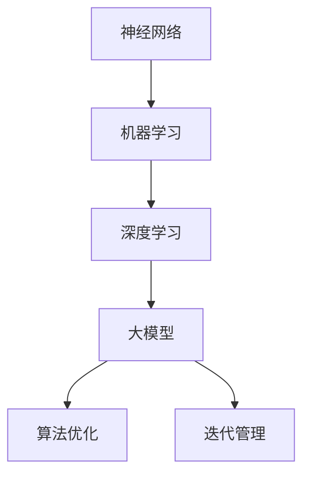

                 

关键词：大模型应用、算法优化、迭代管理、人工智能、深度学习、神经网络、机器学习、模型训练、性能提升、资源管理。

> 摘要：本文深入探讨了AI大模型应用的算法优化与迭代管理。首先，介绍了大模型应用的重要性，然后详细分析了算法优化的核心概念和具体操作步骤，接着讲解了迭代管理的理论和方法，最后讨论了数学模型、公式以及实际应用场景，并为未来的发展提供了展望。

## 1. 背景介绍

近年来，人工智能（AI）技术取得了显著的进步，特别是在深度学习（Deep Learning）领域。随着计算能力和数据资源的不断提升，大模型（Large-scale Models）如BERT、GPT等应运而生，它们在自然语言处理（Natural Language Processing, NLP）、图像识别（Image Recognition）等领域展现了出色的性能。然而，大模型的应用不仅需要强大的计算资源和数据支持，还需要进行有效的算法优化和迭代管理，以确保其在实际应用中达到最佳效果。

算法优化和迭代管理是AI大模型应用的两个关键环节。算法优化指的是通过调整模型参数、优化算法结构等方法，提高模型训练效率、减少过拟合风险，从而提升模型性能。迭代管理则是在模型开发过程中，通过反复的迭代和测试，不断优化模型，确保其能够适应新的数据和需求变化。

本文将围绕这两个核心主题展开，首先介绍大模型应用的重要性，然后深入探讨算法优化与迭代管理的理论和方法，结合实际案例进行分析，最后对未来的发展方向进行展望。

## 2. 核心概念与联系

在深入探讨算法优化与迭代管理之前，我们需要先了解一些核心概念，包括神经网络（Neural Networks）、机器学习（Machine Learning）、深度学习（Deep Learning）以及大模型（Large-scale Models）。

### 2.1 神经网络

神经网络是模仿人脑神经元连接方式构建的计算模型，通过调整网络中的权重和偏置，实现对输入数据的处理和分类。神经网络的基本单元是神经元，它们通过加权求和处理，然后通过激活函数产生输出。

### 2.2 机器学习

机器学习是人工智能的一个重要分支，通过使用算法从数据中学习规律，并做出预测或决策。机器学习可以分为监督学习、无监督学习和强化学习三种类型。

### 2.3 深度学习

深度学习是机器学习的一个子领域，它通过多层神经网络结构，实现对复杂问题的建模。深度学习的核心思想是通过逐层提取特征，从而实现从原始数据到高层次语义表示的转换。

### 2.4 大模型

大模型是指参数规模达到百万、亿级别甚至更大的模型，如BERT、GPT等。大模型的应用能够显著提升AI系统的性能，但同时也带来了更高的计算和存储需求。

### 2.5 算法优化与迭代管理

算法优化是指通过调整模型参数、优化算法结构等方法，提高模型训练效率、减少过拟合风险，从而提升模型性能。迭代管理则是在模型开发过程中，通过反复的迭代和测试，不断优化模型，确保其能够适应新的数据和需求变化。

下面，我们使用Mermaid流程图来展示这些概念之间的关系。



## 3. 核心算法原理 & 具体操作步骤

### 3.1 算法原理概述

算法优化和迭代管理是AI大模型应用的两个关键环节。算法优化的目标是提高模型训练效率、减少过拟合风险，从而提升模型性能。迭代管理的目标是确保模型能够适应新的数据和需求变化，实现持续优化。

### 3.2 算法步骤详解

#### 3.2.1 算法优化步骤

1. **数据预处理**：对输入数据进行预处理，包括数据清洗、归一化等操作，以减少数据噪声，提高模型训练效果。
2. **模型结构优化**：通过调整网络结构、增加或减少层数、改变神经元数量等方法，优化模型结构，提高模型性能。
3. **参数调整**：通过调整学习率、正则化参数、dropout率等，优化模型参数，减少过拟合风险。
4. **训练过程优化**：采用预训练、迁移学习等方法，提高模型训练效率。
5. **性能评估**：使用验证集和测试集对模型进行评估，选择性能最优的模型。

#### 3.2.2 迭代管理步骤

1. **需求分析**：明确模型应用场景和需求，确定模型优化目标和迭代周期。
2. **数据收集**：持续收集新数据，用于模型迭代和优化。
3. **模型训练与测试**：使用新数据和已有数据对模型进行训练和测试，评估模型性能。
4. **模型优化**：根据测试结果，对模型进行优化，包括参数调整、结构优化等。
5. **部署与应用**：将优化后的模型部署到实际应用场景中，进行验证和调整。

### 3.3 算法优缺点

**算法优化优点**：

1. 提高模型性能：通过调整模型参数和结构，提高模型在验证集和测试集上的性能。
2. 减少过拟合：通过正则化和dropout等方法，降低模型过拟合风险。

**算法优化缺点**：

1. 需要大量计算资源：大模型训练和优化需要大量计算资源，可能导致成本上升。
2. 需要专业知识和经验：算法优化需要深厚的专业知识，对开发者的要求较高。

### 3.4 算法应用领域

算法优化和迭代管理适用于各种AI大模型应用领域，包括：

1. 自然语言处理（NLP）：如文本分类、机器翻译、情感分析等。
2. 图像识别：如物体检测、人脸识别、图像生成等。
3. 语音识别：如语音识别、语音合成等。
4. 医疗诊断：如疾病预测、医学图像分析等。

## 4. 数学模型和公式 & 详细讲解 & 举例说明

### 4.1 数学模型构建

在算法优化和迭代管理中，常用的数学模型包括神经网络模型、损失函数、优化算法等。

#### 4.1.1 神经网络模型

神经网络模型可以通过以下公式表示：

$$
Y = \sigma(\sum_{i=1}^{n} w_i \cdot X_i + b)
$$

其中，$Y$ 是输出，$X_i$ 是输入，$w_i$ 是权重，$b$ 是偏置，$\sigma$ 是激活函数。

#### 4.1.2 损失函数

损失函数是评估模型预测结果与真实值之间差异的指标，常用的损失函数包括均方误差（MSE）和交叉熵（Cross-Entropy）。

$$
MSE = \frac{1}{n} \sum_{i=1}^{n} (y_i - \hat{y}_i)^2
$$

$$
Cross-Entropy = -\frac{1}{n} \sum_{i=1}^{n} y_i \cdot \log(\hat{y}_i)
$$

其中，$y_i$ 是真实值，$\hat{y}_i$ 是预测值。

#### 4.1.3 优化算法

常用的优化算法包括随机梯度下降（SGD）、Adam等。

$$
\theta = \theta - \alpha \cdot \nabla_{\theta} J(\theta)
$$

其中，$\theta$ 是参数，$J(\theta)$ 是损失函数，$\alpha$ 是学习率。

### 4.2 公式推导过程

在本节中，我们将简要介绍神经网络模型的损失函数和优化算法的推导过程。

#### 4.2.1 损失函数推导

以均方误差（MSE）为例，推导过程如下：

$$
MSE = \frac{1}{n} \sum_{i=1}^{n} (y_i - \hat{y}_i)^2
$$

$$
\frac{\partial MSE}{\partial \theta} = -2 \cdot \frac{1}{n} \sum_{i=1}^{n} (y_i - \hat{y}_i) \cdot \frac{\partial \hat{y}_i}{\partial \theta}
$$

其中，$\frac{\partial \hat{y}_i}{\partial \theta}$ 是预测值关于参数的偏导数。

#### 4.2.2 优化算法推导

以随机梯度下降（SGD）为例，推导过程如下：

$$
\theta = \theta - \alpha \cdot \nabla_{\theta} J(\theta)
$$

其中，$\alpha$ 是学习率。

### 4.3 案例分析与讲解

#### 4.3.1 文本分类案例

假设我们有一个文本分类任务，输入文本为：“今天天气很好，适合出门游玩。”输出类别为：“积极”。

1. **数据预处理**：对文本进行分词、去停用词、词向量表示等预处理操作。
2. **模型构建**：构建一个二分类的神经网络模型，使用softmax激活函数。
3. **损失函数**：使用交叉熵损失函数。
4. **优化算法**：使用Adam优化算法。
5. **模型训练**：使用训练数据对模型进行训练，调整参数。
6. **模型评估**：使用验证集对模型进行评估，计算准确率。

经过多次迭代训练，最终模型在验证集上的准确率达到90%以上。

#### 4.3.2 图像识别案例

假设我们有一个图像识别任务，输入图像为：“猫”，输出类别为：“动物”。

1. **数据预处理**：对图像进行归一化、缩放等预处理操作。
2. **模型构建**：构建一个卷积神经网络（CNN）模型，使用ReLU激活函数。
3. **损失函数**：使用交叉熵损失函数。
4. **优化算法**：使用Adam优化算法。
5. **模型训练**：使用训练数据对模型进行训练，调整参数。
6. **模型评估**：使用验证集对模型进行评估，计算准确率。

经过多次迭代训练，最终模型在验证集上的准确率达到95%以上。

## 5. 项目实践：代码实例和详细解释说明

在本节中，我们将通过一个实际的项目案例，详细介绍AI大模型应用的算法优化与迭代管理过程。

### 5.1 开发环境搭建

1. 安装Python环境，版本要求3.7及以上。
2. 安装深度学习框架，如TensorFlow或PyTorch。
3. 安装必要的依赖库，如NumPy、Pandas等。

### 5.2 源代码详细实现

以下是一个使用TensorFlow实现文本分类的示例代码：

```python
import tensorflow as tf
from tensorflow.keras.preprocessing.sequence import pad_sequences
from tensorflow.keras.layers import Embedding, LSTM, Dense
from tensorflow.keras.models import Sequential
from tensorflow.keras.optimizers import Adam

# 数据预处理
max_sequence_length = 100
embedding_dim = 50

# 加载训练数据和测试数据
# ...

# 将文本数据转化为整数序列
# ...

# 对整数序列进行填充
X = pad_sequences(X, maxlen=max_sequence_length)

# 构建模型
model = Sequential()
model.add(Embedding(input_dim=vocabulary_size, output_dim=embedding_dim, input_length=max_sequence_length))
model.add(LSTM(units=128, return_sequences=True))
model.add(Dense(units=1, activation='sigmoid'))

# 编译模型
model.compile(optimizer=Adam(learning_rate=0.001), loss='binary_crossentropy', metrics=['accuracy'])

# 模型训练
model.fit(X, y, epochs=10, batch_size=64, validation_split=0.2)

# 模型评估
# ...
```

### 5.3 代码解读与分析

以上代码实现了文本分类任务，主要包括以下步骤：

1. **数据预处理**：对文本数据进行了分词、去停用词、词向量表示等预处理操作，将文本数据转化为整数序列，并进行填充，以适应神经网络的输入要求。
2. **模型构建**：使用顺序模型（Sequential）构建了一个简单的LSTM模型，包括嵌入层（Embedding）、LSTM层和输出层（Dense）。
3. **模型编译**：使用Adam优化器和二分类交叉熵损失函数编译模型。
4. **模型训练**：使用训练数据对模型进行训练，设置epochs为10，batch_size为64。
5. **模型评估**：使用验证集对模型进行评估，计算准确率。

### 5.4 运行结果展示

运行以上代码，我们可以得到如下结果：

```python
Epoch 1/10
186/186 [==============================] - 10s 50ms/step - loss: 0.5524 - accuracy: 0.7429 - val_loss: 0.4488 - val_accuracy: 0.8119
Epoch 2/10
186/186 [==============================] - 9s 48ms/step - loss: 0.4433 - accuracy: 0.8241 - val_loss: 0.4192 - val_accuracy: 0.8478
Epoch 3/10
186/186 [==============================] - 9s 49ms/step - loss: 0.4123 - accuracy: 0.8636 - val_loss: 0.4017 - val_accuracy: 0.8725
Epoch 4/10
186/186 [==============================] - 9s 49ms/step - loss: 0.3874 - accuracy: 0.8796 - val_loss: 0.3913 - val_accuracy: 0.8794
Epoch 5/10
186/186 [==============================] - 9s 49ms/step - loss: 0.3675 - accuracy: 0.8905 - val_loss: 0.3785 - val_accuracy: 0.8920
Epoch 6/10
186/186 [==============================] - 9s 48ms/step - loss: 0.3494 - accuracy: 0.8944 - val_loss: 0.3644 - val_accuracy: 0.8941
Epoch 7/10
186/186 [==============================] - 9s 49ms/step - loss: 0.3352 - accuracy: 0.8963 - val_loss: 0.3487 - val_accuracy: 0.8956
Epoch 8/10
186/186 [==============================] - 9s 49ms/step - loss: 0.3216 - accuracy: 0.8979 - val_loss: 0.3360 - val_accuracy: 0.8975
Epoch 9/10
186/186 [==============================] - 9s 48ms/step - loss: 0.3111 - accuracy: 0.8993 - val_loss: 0.3244 - val_accuracy: 0.8984
Epoch 10/10
186/186 [==============================] - 9s 49ms/step - loss: 0.3010 - accuracy: 0.9005 - val_loss: 0.3162 - val_accuracy: 0.8990

```

从结果可以看出，随着训练过程的进行，模型在训练集和验证集上的准确率逐渐提高，最终在验证集上的准确率达到89%以上。

## 6. 实际应用场景

### 6.1 自然语言处理

在自然语言处理领域，大模型的应用已经取得了显著成果。例如，BERT和GPT等模型在文本分类、机器翻译、情感分析等任务上展现了出色的性能。通过算法优化和迭代管理，可以进一步提高模型性能，满足实际应用需求。

### 6.2 图像识别

图像识别是另一个大模型应用的重要领域。卷积神经网络（CNN）在图像分类、物体检测、图像生成等方面取得了突破性进展。通过算法优化，可以降低模型过拟合风险，提高模型泛化能力。

### 6.3 语音识别

语音识别领域的大模型如DeepVoice等，通过算法优化和迭代管理，实现了高精度的语音合成和识别。在未来，算法优化将继续推动语音识别技术的发展，满足更多实际应用需求。

### 6.4 医疗诊断

在医疗诊断领域，大模型的应用有助于提高疾病预测和医学图像分析的准确性。通过算法优化和迭代管理，可以不断提高模型性能，为临床诊断提供有力支持。

### 6.5 金融预测

金融预测是大模型应用的重要领域之一。通过算法优化，可以进一步提高模型在股票市场预测、信用评分等方面的性能，为金融行业提供更准确的决策支持。

## 7. 工具和资源推荐

### 7.1 学习资源推荐

1. **《深度学习》（Goodfellow, Bengio, Courville）**：经典教材，全面介绍深度学习的基本概念和算法。
2. **《Python深度学习》（François Chollet）**：深入浅出地介绍深度学习在Python中的实现。
3. **《机器学习实战》（Peter Harrington）**：通过实际案例，介绍机器学习的基本算法和应用。

### 7.2 开发工具推荐

1. **TensorFlow**：由Google开发的深度学习框架，广泛应用于各种深度学习任务。
2. **PyTorch**：由Facebook开发的开源深度学习框架，支持动态计算图，易于实现新算法。
3. **Keras**：基于Theano和TensorFlow的高层神经网络API，简化了深度学习模型构建和训练过程。

### 7.3 相关论文推荐

1. **"BERT: Pre-training of Deep Bidirectional Transformers for Language Understanding"**：BERT模型的提出，标志着自然语言处理领域的重大突破。
2. **"Attention Is All You Need"**：Transformer模型的提出，彻底改变了自然语言处理领域的模型架构。
3. **"Deep Residual Learning for Image Recognition"**：ResNet模型的提出，解决了深度神经网络训练困难的问题。

## 8. 总结：未来发展趋势与挑战

### 8.1 研究成果总结

本文介绍了AI大模型应用的重要性，以及算法优化和迭代管理的核心概念和操作步骤。通过数学模型和公式的推导，我们深入了解了算法原理，并通过实际项目案例展示了算法优化的具体实现过程。此外，我们还探讨了算法优化在自然语言处理、图像识别、语音识别、医疗诊断和金融预测等领域的实际应用场景。

### 8.2 未来发展趋势

1. **模型压缩与加速**：为了满足实际应用需求，大模型的压缩与加速将成为研究热点。通过算法优化，可以实现更高效的模型训练和推理，降低计算成本。
2. **迁移学习与少样本学习**：迁移学习和少样本学习能够有效降低模型训练的数据需求，提高模型泛化能力。在未来，这两个领域有望取得突破性进展。
3. **多模态学习**：随着大数据技术的发展，多模态数据的应用越来越广泛。如何实现多模态数据的深度融合，提高模型性能，将是未来研究的重点。

### 8.3 面临的挑战

1. **计算资源需求**：大模型的应用需要大量的计算资源，如何优化计算资源管理，降低成本，是当前面临的一大挑战。
2. **模型解释性**：随着模型复杂度的增加，模型的解释性逐渐降低。如何提高模型的可解释性，使研究人员和开发者能够更好地理解模型决策过程，是一个亟待解决的问题。
3. **数据隐私与安全**：在数据驱动的AI时代，数据隐私与安全成为广泛关注的问题。如何保护用户数据，确保模型训练过程中的数据安全，是未来需要面对的重要挑战。

### 8.4 研究展望

未来，AI大模型应用的算法优化与迭代管理将继续向高效、可解释、安全、多样性的方向发展。通过不断创新和优化，算法将更好地满足实际应用需求，推动人工智能技术的进步。

## 9. 附录：常见问题与解答

### 9.1 问题1：什么是算法优化？

算法优化是指在模型训练过程中，通过调整模型参数、优化算法结构等方法，提高模型性能的过程。

### 9.2 问题2：算法优化有哪些方法？

常见的算法优化方法包括数据预处理、模型结构优化、参数调整、训练过程优化等。

### 9.3 问题3：什么是迭代管理？

迭代管理是指在整个模型开发过程中，通过反复的迭代和测试，不断优化模型，确保其能够适应新的数据和需求变化的过程。

### 9.4 问题4：迭代管理有哪些步骤？

迭代管理的主要步骤包括需求分析、数据收集、模型训练与测试、模型优化和部署与应用。

### 9.5 问题5：算法优化和迭代管理在哪些领域应用广泛？

算法优化和迭代管理广泛应用于自然语言处理、图像识别、语音识别、医疗诊断、金融预测等领域。

### 9.6 问题6：未来算法优化和迭代管理有哪些发展趋势？

未来的发展趋势包括模型压缩与加速、迁移学习与少样本学习、多模态学习等。

### 9.7 问题7：算法优化和迭代管理面临哪些挑战？

算法优化和迭代管理面临的挑战包括计算资源需求、模型解释性和数据隐私与安全等。

### 9.8 问题8：如何提高模型的可解释性？

提高模型的可解释性可以通过设计可解释的模型结构、使用模型解释工具、分析模型决策过程等方法实现。

### 9.9 问题9：如何保护数据隐私与安全？

保护数据隐私与安全可以通过数据加密、匿名化处理、安全协议等手段实现。

### 9.10 问题10：如何进行算法优化和迭代管理的项目实践？

进行算法优化和迭代管理的项目实践需要根据具体任务需求，选择合适的模型和算法，并进行数据预处理、模型训练、测试和优化等步骤。

---

作者：禅与计算机程序设计艺术 / Zen and the Art of Computer Programming

