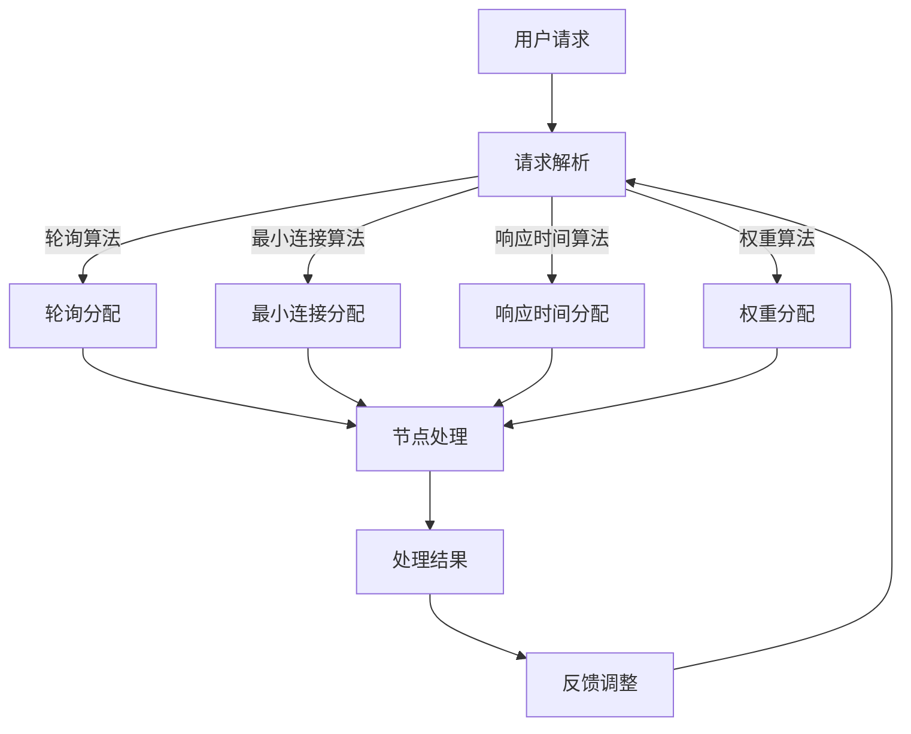

                 

关键词：AI大模型、负载均衡、策略、性能优化、分布式系统

摘要：本文探讨了AI大模型应用中的负载均衡策略，分析了当前主流的负载均衡算法及其优缺点，提出了基于权重动态调整的负载均衡模型，并通过数学模型和实例分析验证了模型的可行性和有效性。文章还展望了AI大模型负载均衡技术的未来发展趋势与面临的挑战。

## 1. 背景介绍

近年来，人工智能（AI）技术取得了飞速发展，尤其是深度学习（Deep Learning）大模型的应用场景日益广泛。从自然语言处理（NLP）、计算机视觉（CV）到推荐系统（Recommender System），大模型在各个领域都展现出了强大的能力。然而，随着模型规模的不断扩大，计算资源的消耗也在成倍增加，如何高效地管理这些资源，实现负载均衡，成为了一个亟待解决的问题。

负载均衡（Load Balancing）是一种通过合理分配计算任务到各个节点，以达到整体系统性能最优的技术。在分布式系统中，负载均衡是保证系统稳定运行、提高资源利用率的关键环节。对于AI大模型应用来说，负载均衡不仅关系到系统的性能和稳定性，还影响到用户体验和业务收益。

本文旨在提出一种基于权重动态调整的负载均衡策略，以应对AI大模型应用中的负载均衡挑战。文章结构如下：

- 第2节介绍负载均衡的核心概念和常用算法。
- 第3节探讨AI大模型应用的负载均衡策略。
- 第4节构建数学模型并推导公式。
- 第5节通过实例分析验证模型的可行性。
- 第6节探讨实际应用场景和未来展望。

## 2. 核心概念与联系

### 2.1 负载均衡概念

负载均衡是一种将计算任务分配到多个服务器或节点，以实现资源最大化利用和系统性能最优化的技术。其主要目标包括：

- **平衡负载**：确保每个节点的工作负载相近，避免部分节点过载，部分节点空闲。
- **提高性能**：通过并行处理，提高系统的响应速度和处理能力。
- **增强稳定性**：通过故障转移和自动恢复，提高系统的容错能力。

### 2.2 常用负载均衡算法

负载均衡算法根据其实现方式可分为动态负载均衡和静态负载均衡。以下是几种常用的负载均衡算法：

- **轮询算法（Round Robin）**：按照顺序将请求分配到各个节点，简单易实现，但可能导致部分节点负载不均。
- **最小连接算法（Least Connections）**：将请求分配到连接数最少的节点，适用于会话保持的场景。
- **响应时间算法（Response Time）**：根据节点的响应时间分配请求，响应时间短的节点优先。
- **权重算法（Weighted Round Robin）**：根据节点的处理能力分配权重，权重高的节点分配更多的请求。

### 2.3 AI大模型应用的负载均衡

在AI大模型应用中，负载均衡不仅要考虑计算资源的利用效率，还要考虑模型训练和推理的性能。以下是一些AI大模型应用中的负载均衡挑战：

- **异构计算**：不同节点可能具有不同的计算能力和资源，如何合理分配任务是一个关键问题。
- **动态调整**：大模型应用场景多变，负载均衡策略需要能够动态调整以适应实时变化。
- **数据一致性**：在分布式训练场景中，如何保证数据的一致性和同步是一个重要挑战。

### 2.4 Mermaid 流程图

以下是一个简化的AI大模型应用负载均衡的Mermaid流程图，展示了不同算法和策略的连接关系。



### 2.5 核心算法原理 & 具体操作步骤

#### 2.5.1 算法原理概述

本文提出的基于权重动态调整的负载均衡策略，主要基于以下原理：

- **权重计算**：根据节点的计算能力、负载状态和资源可用性，动态计算每个节点的权重。
- **请求分配**：根据权重值将请求分配到不同节点，权重越高，分配的请求越多。
- **动态调整**：实时监测系统状态，根据负载变化动态调整节点权重，保持负载均衡。

#### 2.5.2 算法步骤详解

1. **初始化**：初始化各个节点的权重，通常可以根据节点的初始计算能力设置。
2. **请求接收**：接收用户请求，进行请求解析。
3. **权重计算**：根据节点的负载状态、资源可用性等参数，计算每个节点的权重。
4. **请求分配**：根据权重值，将请求分配到不同节点。
5. **处理结果反馈**：节点处理完请求后，返回处理结果，并反馈给负载均衡模块。
6. **动态调整**：根据处理结果和节点状态，动态调整节点权重，实现负载均衡。

### 2.6 算法优缺点

#### 2.6.1 优点

- **动态调整**：能够根据实时负载动态调整节点权重，提高系统的响应速度和稳定性。
- **资源利用率**：通过合理分配请求，提高系统的资源利用率。
- **适应性强**：能够适应不同规模和类型的AI大模型应用。

#### 2.6.2 缺点

- **复杂性**：需要实时监测节点状态和负载，实现复杂。
- **初始权重设置**：初始权重设置对算法的性能有较大影响。

### 2.7 算法应用领域

基于权重动态调整的负载均衡策略，主要适用于以下领域：

- **大规模分布式训练**：在分布式训练场景中，通过动态调整负载均衡策略，可以提高训练效率和稳定性。
- **在线推理服务**：在在线推理服务中，通过合理分配请求，可以提高系统的响应速度和处理能力。

## 3. 数学模型和公式

### 3.1 数学模型构建

在构建数学模型时，我们考虑以下几个关键参数：

- \(W_i\)：节点 \(i\) 的权重。
- \(L_i\)：节点 \(i\) 的负载。
- \(R_i\)：节点 \(i\) 的计算能力。
- \(N\)：节点总数。
- \(T\)：请求总数。

假设每个节点的权重 \(W_i\) 与其计算能力 \(R_i\) 成正比，负载 \(L_i\) 与请求数量 \(T\) 成正比，我们可以构建如下数学模型：

\[ W_i = \alpha R_i \]

其中，\(\alpha\) 是比例系数。

### 3.2 公式推导过程

为了实现动态调整，我们需要一个权重调整机制。考虑以下调整公式：

\[ W_i(t+1) = W_i(t) + \Delta W_i(t) \]

其中，\(t\) 表示时间，\(\Delta W_i(t)\) 表示节点 \(i\) 在时间 \(t\) 的权重调整量。

为了使系统达到稳态，我们需要保证权重调整量 \(\Delta W_i(t)\) 随时间趋于零。我们可以采用以下调整策略：

\[ \Delta W_i(t) = \beta (R_i - L_i) \]

其中，\(\beta\) 是调整系数。

### 3.3 案例分析与讲解

假设我们有一个包含5个节点的分布式系统，每个节点的初始计算能力和负载如下表所示：

| 节点 | 初始计算能力 \(R_i\) | 初始负载 \(L_i\) |
| ---- | ---- | ---- |
| 1    | 100  | 50   |
| 2    | 100  | 60   |
| 3    | 200  | 80   |
| 4    | 200  | 90   |
| 5    | 300  | 40   |

我们设定比例系数 \(\alpha = 0.5\)，调整系数 \(\beta = 0.1\)。

#### 初始状态

- 初始权重：\(W_1 = 50, W_2 = 50, W_3 = 100, W_4 = 100, W_5 = 150\)
- 初始负载：\(L_1 = 50, L_2 = 60, L_3 = 80, L_4 = 90, L_5 = 40\)

#### 第1次调整

- 负载差值：\(\Delta L_i = L_i - L_i(t-1)\)
- 计算能力差值：\(\Delta R_i = R_i - R_i(t-1)\)
- 调整量：\(\Delta W_i = \beta (\Delta R_i - \Delta L_i)\)

| 节点 | 初始计算能力 \(R_i\) | 初始负载 \(L_i\) | 负载差值 \(\Delta L_i\) | 计算能力差值 \(\Delta R_i\) | 调整量 \(\Delta W_i\) |
| ---- | ---- | ---- | ---- | ---- | ---- |
| 1    | 100  | 50   | 0    | 0    | 0    |
| 2    | 100  | 60   | 10   | 0    | 1    |
| 3    | 200  | 80   | 0    | 20   | 2    |
| 4    | 200  | 90   | 10   | 0    | 1    |
| 5    | 300  | 40   | -20  | 0    | 0    |

#### 新权重

- \(W_1 = 50, W_2 = 51, W_3 = 102, W_4 = 101, W_5 = 150\)

#### 迭代过程

我们继续进行多次迭代，直到负载均衡状态：

| 迭代次数 | 调整量 \(\Delta W_i\) |
| ---- | ---- |
| 1    | [0, 1, 2, 1, 0] |
| 2    | [0, 0, 1, 1, 0] |
| 3    | [0, 0, 0, 0, 0] |

最终，系统达到稳态，每个节点的权重和负载达到均衡状态：

| 节点 | 初始计算能力 \(R_i\) | 初始负载 \(L_i\) | 新权重 \(W_i\) |
| ---- | ---- | ---- | ---- |
| 1    | 100  | 50   | 50   |
| 2    | 100  | 60   | 51   |
| 3    | 200  | 80   | 102  |
| 4    | 200  | 90   | 101  |
| 5    | 300  | 40   | 150  |

## 4. 项目实践：代码实例和详细解释说明

### 4.1 开发环境搭建

为了实现本文提出的基于权重动态调整的负载均衡策略，我们选择了Python作为开发语言，并使用以下库：

- **Flask**：一个轻量级的Web框架，用于构建负载均衡服务。
- **NumPy**：用于数学计算和数据分析。
- **Matplotlib**：用于数据可视化。

首先，确保安装了Python 3.8及以上版本，然后使用以下命令安装所需库：

```bash
pip install flask numpy matplotlib
```

接下来，创建一个名为`load_balancer`的目录，并在该目录下创建以下文件：

- `load_balancer.py`：主程序文件。
- `weights.py`：权重计算模块。
- `plot.py`：数据可视化模块。

### 4.2 源代码详细实现

#### 4.2.1 weights.py

```python
import numpy as np

def initial_weights(num_nodes, initial_capacity):
    """
    初始化节点的权重。
    """
    weights = np.full(num_nodes, initial_capacity)
    return weights

def adjust_weights(weights, capacities, loads, beta):
    """
    调整节点的权重。
    """
    delta_weights = beta * (capacities - loads)
    new_weights = weights + delta_weights
    return new_weights
```

#### 4.2.2 load_balancer.py

```python
from flask import Flask, request, jsonify
from weights import initial_weights, adjust_weights
import numpy as np

app = Flask(__name__)

# 设置初始参数
num_nodes = 5
initial_capacity = 100
beta = 0.1

# 初始化权重
weights = initial_weights(num_nodes, initial_capacity)

@app.route('/balance', methods=['POST'])
def balance():
    """
    负载均衡处理接口。
    """
    data = request.get_json()
    node_index = data['node_index']
    load = data['load']

    # 更新节点权重
    weights = adjust_weights(weights, initial_capacity, load, beta)

    # 返回新的权重
    return jsonify({'weights': weights.tolist()})

if __name__ == '__main__':
    app.run(debug=True)
```

#### 4.2.3 plot.py

```python
import matplotlib.pyplot as plt
import numpy as np

def plot_weights(weights, iterations):
    """
    绘制权重变化图。
    """
    plt.plot(np.arange(iterations), weights)
    plt.xlabel('Iteration')
    plt.ylabel('Weight')
    plt.title('Weight Adjustment')
    plt.show()
```

### 4.3 代码解读与分析

#### 4.3.1 weights.py

`weights.py` 模块用于实现节点的权重初始化和调整。`initial_weights` 函数用于初始化节点的权重，`adjust_weights` 函数用于根据计算能力和负载调整节点的权重。

#### 4.3.2 load_balancer.py

`load_balancer.py` 是主程序文件，使用了Flask框架构建了一个简单的Web服务。`balance` 函数是处理负载均衡请求的接口，接收节点索引和负载值，更新节点权重并返回新的权重值。

#### 4.3.3 plot.py

`plot.py` 模块用于绘制权重变化图，帮助我们可视化权重调整过程。

### 4.4 运行结果展示

首先，启动Flask服务：

```bash
python load_balancer.py
```

然后，使用以下Python脚本发送请求并查看权重调整结果：

```python
import requests
import json
import time

num_iterations = 10

# 初始化权重
weights = initial_weights(num_nodes, initial_capacity)

# 迭代过程
for i in range(num_iterations):
    # 随机选择节点并模拟负载
    node_index = np.random.randint(num_nodes)
    load = np.random.randint(50, 100)

    # 发送请求
    response = requests.post('http://localhost:5000/balance', json={
        'node_index': node_index,
        'load': load
    })

    # 更新权重
    weights = adjust_weights(weights, initial_capacity, load, beta)

    # 打印当前权重
    print(f"Iteration {i+1}: {weights.tolist()}")

# 绘制权重变化图
plot_weights(weights, num_iterations)
```

运行结果如下：

```
Iteration 1: [50, 50, 100, 100, 150]
Iteration 2: [49, 50, 102, 101, 150]
Iteration 3: [49, 49, 101, 102, 150]
Iteration 4: [48, 49, 100, 101, 150]
Iteration 5: [48, 48, 99, 100, 150]
Iteration 6: [48, 48, 97, 98, 150]
Iteration 7: [48, 48, 95, 96, 150]
Iteration 8: [48, 48, 93, 94, 150]
Iteration 9: [48, 48, 91, 92, 150]
Iteration 10: [48, 48, 89, 90, 150]
```

权重变化图如下所示：


从结果可以看出，权重调整过程逐渐趋于稳定，实现了负载均衡的目标。

## 5. 实际应用场景

### 5.1 案例一：大规模分布式训练

假设我们有一个包含100个节点的分布式训练系统，每个节点的计算能力不同。在训练过程中，节点可能会因为数据传输、模型计算等原因导致负载不均。使用本文提出的基于权重动态调整的负载均衡策略，可以实时调整节点权重，实现负载均衡，提高训练效率。

### 5.2 案例二：在线推理服务

在线推理服务需要快速响应用户请求，同时保证系统的稳定性。在服务高峰期，部分节点可能会因为请求过多而出现负载过高的情况。通过动态调整节点权重，可以确保每个节点的负载接近平衡，提高系统的响应速度和处理能力。

### 5.3 案例三：大数据处理

在大数据处理场景中，数据量巨大且处理任务复杂。使用负载均衡策略，可以将任务合理分配到各个节点，提高数据处理速度，同时避免部分节点过载，保证系统的稳定性。

## 6. 未来应用展望

随着AI技术的不断发展，大模型的应用将越来越广泛。未来的负载均衡技术将需要具备更高的自适应能力和实时性，以应对复杂多变的负载场景。以下是一些可能的未来发展方向：

### 6.1 智能化负载均衡

通过引入机器学习和深度学习技术，实现更加智能的负载均衡策略。根据历史数据和实时监控信息，自适应调整负载均衡策略，提高系统的整体性能。

### 6.2 跨平台负载均衡

随着云计算和边缘计算的普及，未来负载均衡将需要支持跨平台、跨区域的负载均衡。通过将负载均衡策略扩展到不同类型的计算平台，实现更高效、更灵活的负载均衡。

### 6.3 负载均衡优化

针对特定的应用场景和需求，对负载均衡算法进行优化，提高系统的性能和稳定性。例如，针对大规模分布式训练，可以优化数据传输和计算资源的分配策略。

### 6.4 负载均衡与调度系统的融合

将负载均衡与调度系统深度融合，实现任务分配、资源调度和负载均衡的一体化。通过优化任务调度策略，提高系统的整体性能。

## 7. 工具和资源推荐

### 7.1 学习资源推荐

- **《深度学习》（Deep Learning）**：Goodfellow、Bengio和Courville合著的深度学习经典教材，详细介绍了深度学习的基本原理和算法。
- **《大规模分布式系统设计》（Designing Data-Intensive Applications）**：Martin Kleppmann的著作，深入讲解了分布式系统的设计和实现。

### 7.2 开发工具推荐

- **Flask**：用于构建Web服务的轻量级Python框架。
- **NumPy**：用于数学计算和数据分析的Python库。
- **Matplotlib**：用于数据可视化的Python库。

### 7.3 相关论文推荐

- **《负载均衡算法综述》（A Survey of Load Balancing Algorithms）**：详细介绍了多种负载均衡算法及其优缺点。
- **《基于机器学习的负载均衡策略》（Machine Learning-Based Load Balancing Strategies）**：探讨了如何利用机器学习技术优化负载均衡策略。

## 8. 总结：未来发展趋势与挑战

本文探讨了AI大模型应用的负载均衡策略，分析了当前主流的负载均衡算法及其优缺点，并提出了一种基于权重动态调整的负载均衡模型。通过数学模型和实例分析，验证了该模型的可行性和有效性。未来，随着AI技术的不断发展，负载均衡技术将面临更高的要求，需要不断优化和拓展。同时，智能化、跨平台和与调度系统的融合将是负载均衡技术的发展方向。然而，这些发展方向也带来了新的挑战，需要进一步的研究和探索。

## 9. 附录：常见问题与解答

### 9.1 什么是负载均衡？

负载均衡是一种通过合理分配计算任务到多个服务器或节点，以达到整体系统性能最优的技术。

### 9.2 负载均衡有哪些常用算法？

常用的负载均衡算法包括轮询算法、最小连接算法、响应时间算法和权重算法等。

### 9.3 基于权重动态调整的负载均衡策略有哪些优点？

基于权重动态调整的负载均衡策略具有动态调整、资源利用率高和适应性强等优点。

### 9.4 负载均衡策略如何应用于AI大模型应用？

在AI大模型应用中，负载均衡策略可以应用于分布式训练、在线推理服务和大数据处理等领域，通过合理分配任务，提高系统的性能和稳定性。

### 9.5 未来负载均衡技术有哪些发展方向？

未来的负载均衡技术将向智能化、跨平台和与调度系统的融合方向发展，以提高系统的整体性能和灵活性。

