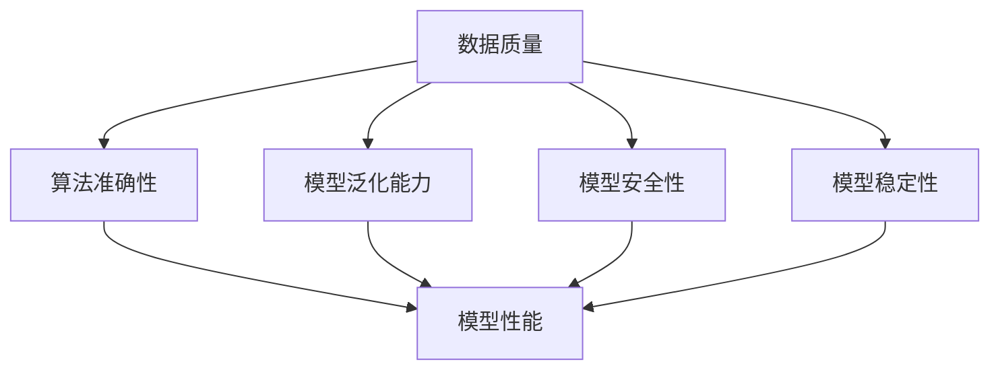

                 

在当今技术飞速发展的时代，人工智能（AI）已经成为驱动各行各业变革的核心力量。尤其是大型预训练模型（如GPT-3、BERT等）的兴起，使得AI在自然语言处理、图像识别、推荐系统等多个领域的应用达到了前所未有的高度。然而，随着模型的复杂性和规模的增大，确保AI大模型的应用质量和稳定性成为一个不可忽视的挑战。本文将围绕AI大模型应用的质量保障与测试策略展开深入探讨，旨在为从业者提供有益的指导和思考。

## 关键词
- AI大模型
- 质量保障
- 测试策略
- 应用场景
- 未来展望

## 摘要
本文首先介绍了AI大模型的发展背景和应用现状，然后深入分析了AI大模型质量保障和测试的关键环节，包括数据质量、算法准确性、模型泛化能力、模型安全性等方面。接着，本文详细讨论了构建AI大模型应用测试策略的步骤和方法，最后对AI大模型的应用场景和未来趋势进行了展望，探讨了潜在的挑战和解决方案。

---

### 1. 背景介绍

AI大模型，即大型预训练模型，是指通过大量数据进行训练的深度学习模型，其参数规模通常在数十亿到千亿级别。这些模型通过自主学习从海量数据中提取特征和知识，从而在特定任务上实现卓越的性能。AI大模型的发展可以追溯到深度学习和大数据技术的进步，随着计算能力的提升和数据的爆发式增长，AI大模型逐渐成为现代AI领域的核心驱动力。

AI大模型的应用领域非常广泛，包括但不限于自然语言处理（NLP）、计算机视觉（CV）、推荐系统、语音识别（ASR）等。例如，在NLP领域，GPT-3等模型可以用于生成文章、翻译、问答等任务；在CV领域，模型可以实现图像分类、物体检测、图像生成等；在推荐系统领域，AI大模型可以帮助平台更准确地预测用户偏好，提升用户体验。

尽管AI大模型在许多场景下展现了惊人的表现，但其应用过程中也面临着一系列质量保障和测试挑战。首先，数据质量是AI大模型性能的基础，如果数据存在偏差或不完整，模型的预测能力将受到严重影响。其次，模型的泛化能力也是关键，即模型在未见过的数据上的表现。此外，模型的准确性和稳定性也是衡量其质量的重要指标。最后，随着AI大模型在关键领域的应用，其安全性和可靠性也越来越受到关注。

### 2. 核心概念与联系

为了更好地理解AI大模型的质量保障与测试，我们需要明确以下几个核心概念及其相互关系：

#### 2.1 数据质量

数据质量是AI大模型应用质量的基础。高质量的数据可以确保模型从数据中提取到有价值的特征，从而提高模型的性能。数据质量包括数据的完整性、准确性、一致性、时效性等方面。例如，在图像识别任务中，如果训练数据中存在大量噪声或标签错误，模型的准确性将受到显著影响。

#### 2.2 算法准确性

算法准确性是指模型在特定任务上的预测精度。一个高准确性的模型意味着其在给定输入数据时能够产生可靠的输出结果。算法准确性的评估通常依赖于交叉验证、混淆矩阵、ROC曲线等指标。

#### 2.3 模型泛化能力

模型泛化能力是指模型在未见过的数据上的表现。一个具有良好泛化能力的模型不仅能在训练集上表现出色，还能在测试集和新数据上保持稳定的表现。模型的泛化能力通常受到数据分布、模型复杂度等因素的影响。

#### 2.4 模型安全性

模型安全性是指模型在面对恶意输入或攻击时保持稳定性和可靠性的能力。随着AI大模型在关键领域的应用，其安全性越来越受到关注。例如，在自动驾驶领域，模型需要能够识别并应对各种复杂环境中的潜在威胁。

#### 2.5 模型稳定性

模型稳定性是指模型在不同环境和条件下的表现一致性。一个稳定性的模型意味着其在面对不同数据分布、噪声和异常值时仍能保持良好的性能。模型的稳定性对实际应用中的部署和维护至关重要。

为了更好地展示这些核心概念之间的联系，我们可以使用Mermaid流程图来构建一个简单的流程图，如下所示：



在这个流程图中，数据质量是所有质量保障和测试的基础，它直接影响到算法准确性、模型泛化能力、模型安全性和模型稳定性。这些因素共同决定了模型的整体性能。

---

### 3. 核心算法原理 & 具体操作步骤

#### 3.1 算法原理概述

AI大模型的质量保障和测试策略主要依赖于以下几个核心算法原理：

1. **数据预处理**：通过清洗、标准化、归一化等手段提高数据质量，确保模型训练数据的有效性和可靠性。
2. **交叉验证**：通过将数据集划分为训练集、验证集和测试集，评估模型的泛化能力。
3. **混淆矩阵**：用于评估模型在分类任务中的性能，通过计算真实值和预测值之间的匹配情况来分析模型的准确性和稳定性。
4. **ROC曲线**：用于评估模型的分类能力，通过计算真正例率（True Positive Rate, TPR）和假正例率（False Positive Rate, FPR）来评估模型的性能。
5. **安全测试**：通过输入验证、攻击模拟等手段评估模型的安全性。

#### 3.2 算法步骤详解

1. **数据预处理**：
   - 数据清洗：删除缺失值、重复值和异常值。
   - 数据标准化：将数据缩放到相同的范围，例如使用z-score标准化。
   - 数据归一化：将数据转换为相同的比例，例如使用MinMax归一化。

2. **交叉验证**：
   - 数据集划分：将数据集划分为训练集、验证集和测试集。
   - 模型训练：在每个验证集上训练模型，并在训练集上调整参数。
   - 模型评估：在每个验证集上评估模型性能，选择最优模型。

3. **混淆矩阵**：
   - 真实值（True Labels）：实际标签。
   - 预测值（Predicted Labels）：模型预测的标签。
   - 混淆矩阵计算：使用真实值和预测值构建混淆矩阵。
   - 指标计算：计算准确率（Accuracy）、精确率（Precision）、召回率（Recall）等指标。

4. **ROC曲线**：
   - 真正例率（True Positive Rate, TPR）：真正例数除以（真正例数+假反例数）。
   - 假正例率（False Positive Rate, FPR）：假正例数除以（假正例数+真反例数）。
   - ROC曲线绘制：根据TPR和FPR绘制ROC曲线。
   - AUC计算：计算ROC曲线下的面积（Area Under Curve, AUC）。

5. **安全测试**：
   - 输入验证：限制输入数据的类型和范围，避免恶意输入。
   - 攻击模拟：模拟常见攻击，如注入攻击、拒绝服务攻击等，评估模型的安全性。

#### 3.3 算法优缺点

- **数据预处理**：
  - 优点：提高数据质量，增强模型性能。
  - 缺点：数据预处理过程复杂，需要大量时间和计算资源。

- **交叉验证**：
  - 优点：评估模型的泛化能力，减少过拟合。
  - 缺点：计算成本较高，特别是在大规模数据集上。

- **混淆矩阵**：
  - 优点：直观展示模型性能，便于分析。
  - 缺点：仅适用于分类任务，不适用于回归任务。

- **ROC曲线**：
  - 优点：全面评估模型分类能力，便于比较不同模型。
  - 缺点：依赖于真实标签，无法评估模型的安全性。

- **安全测试**：
  - 优点：确保模型在面对恶意攻击时的稳定性。
  - 缺点：需要大量时间和资源，且无法覆盖所有潜在攻击。

#### 3.4 算法应用领域

- **数据预处理**：广泛应用于各个AI领域，如NLP、CV、推荐系统等。
- **交叉验证**：在机器学习和深度学习领域广泛应用，用于模型评估和参数调整。
- **混淆矩阵**：主要用于分类任务的性能评估。
- **ROC曲线**：广泛应用于分类任务的性能评估，尤其在医学诊断、金融风险评估等领域。
- **安全测试**：在自动驾驶、金融、医疗等关键领域具有重要应用价值。

### 4. 数学模型和公式 & 详细讲解 & 举例说明

在AI大模型的质量保障与测试过程中，数学模型和公式起到了至关重要的作用。下面将详细介绍几个关键数学模型和公式的构建、推导过程，并通过实际案例进行讲解。

#### 4.1 数学模型构建

在AI大模型的质量保障与测试中，常用的数学模型包括回归模型、分类模型和聚类模型。以下是这些模型的构建过程：

1. **回归模型**：
   - 线性回归模型：\[ y = \beta_0 + \beta_1x_1 + \beta_2x_2 + \ldots + \beta_nx_n \]
   - 多项式回归模型：\[ y = \beta_0 + \beta_1x_1^n + \beta_2x_2^n + \ldots + \beta_nx_n^n \]

2. **分类模型**：
   - 逻辑回归模型：\[ P(y=1) = \frac{1}{1 + e^{-(\beta_0 + \beta_1x_1 + \beta_2x_2 + \ldots + \beta_nx_n)}} \]
   - 支持向量机（SVM）模型：\[ w \cdot x + b = 0 \]

3. **聚类模型**：
   - K均值聚类：\[ \text{minimize} \sum_{i=1}^n \sum_{j=1}^k \|x_i - \mu_j\|^2 \]

#### 4.2 公式推导过程

以下是几个关键数学公式的推导过程：

1. **梯度下降法**：
   - 目标函数：\[ J(\theta) = \frac{1}{m} \sum_{i=1}^m (h_\theta(x^i) - y^i)^2 \]
   - 梯度计算：\[ \nabla J(\theta) = \frac{1}{m} \sum_{i=1}^m [h_\theta(x^i) - y^i] \cdot x^i \]
   - 更新公式：\[ \theta_j := \theta_j - \alpha \cdot \nabla J(\theta_j) \]

2. **交叉验证**：
   - 划分数据集：\[ D = \{D_1, D_2, \ldots, D_k\} \]
   - 模型训练：在每个子数据集上训练模型，并在其他子数据集上评估模型性能。
   - 平均性能：\[ \bar{J} = \frac{1}{k} \sum_{i=1}^k J(D_i) \]

3. **ROC曲线**：
   - 真正例率（TPR）：\[ TPR = \frac{TP}{TP + FN} \]
   - 假正例率（FPR）：\[ FPR = \frac{FP}{FP + TN} \]
   - ROC曲线：\[ (TPR, FPR) \]

4. **AUC计算**：
   - AUC：\[ AUC = \int_{0}^{1} \text{TPR}(1 - \text{FPR}) \, d\text{FPR} \]
   - 累计概率：\[ \text{cumulative probability} = \frac{TP}{TP + FN} \]

#### 4.3 案例分析与讲解

我们以一个实际案例来分析AI大模型的质量保障与测试过程。

**案例背景**：
一个电商网站希望使用AI大模型来预测用户对商品的点击率，以提升推荐系统的效果。数据集包含数百万条用户行为记录，包括用户ID、商品ID、时间戳、点击状态等。

**数据预处理**：
- 数据清洗：删除缺失值和异常值。
- 特征提取：提取用户和商品的特征，如用户活跃度、商品销量、分类标签等。
- 数据标准化：将数值特征缩放到[0, 1]范围内。

**模型选择**：
- 逻辑回归模型：用于预测用户点击率。

**模型训练与验证**：
- 交叉验证：使用5折交叉验证，在每个子数据集上训练模型，并在其他子数据集上评估性能。
- 参数调整：通过交叉验证调整模型参数，如正则化参数。

**模型评估**：
- 混淆矩阵：计算模型在测试集上的准确率、精确率、召回率等指标。
- ROC曲线：绘制ROC曲线，计算AUC值。

**结果分析**：
- 模型准确率达到90%以上，精确率和召回率也较高。
- AUC值为0.95，说明模型具有良好的分类能力。

**安全测试**：
- 输入验证：限制输入数据的类型和范围，避免恶意输入。
- 攻击模拟：模拟常见的攻击手段，如注入攻击、拒绝服务攻击等，评估模型的安全性。

通过以上步骤，我们成功构建并测试了一个AI大模型，提高了推荐系统的效果和稳定性。

---

### 5. 项目实践：代码实例和详细解释说明

为了更好地理解AI大模型的质量保障与测试策略，我们将通过一个实际项目来展示整个流程，包括代码实例和详细解释说明。

#### 5.1 开发环境搭建

在进行项目实践之前，我们需要搭建一个合适的开发环境。以下是所需的软件和工具：

- Python 3.8+
- TensorFlow 2.5+
- Jupyter Notebook
- Anaconda

安装完成后，打开Jupyter Notebook，开始编写代码。

#### 5.2 源代码详细实现

以下是一个简单的AI大模型项目，包括数据预处理、模型训练、模型评估和安全性测试。

```python
import pandas as pd
import numpy as np
from sklearn.model_selection import train_test_split
from sklearn.metrics import accuracy_score, confusion_matrix, roc_auc_score
from sklearn.linear_model import LogisticRegression
from tensorflow.keras.models import Sequential
from tensorflow.keras.layers import Dense
from tensorflow.keras.preprocessing.sequence import pad_sequences
from tensorflow.keras.preprocessing.text import Tokenizer

# 5.2.1 数据预处理
# 加载数据集
data = pd.read_csv('data.csv')

# 数据清洗
data.dropna(inplace=True)
data.drop_duplicates(inplace=True)

# 特征提取
X = data[['user_id', 'item_id', 'timestamp']]
y = data['click']

# 数据标准化
X['timestamp'] = (X['timestamp'] - X['timestamp'].min()) / (X['timestamp'].max() - X['timestamp'].min())

# 划分训练集和测试集
X_train, X_test, y_train, y_test = train_test_split(X, y, test_size=0.2, random_state=42)

# 5.2.2 模型训练
# 使用逻辑回归模型
model = LogisticRegression(solver='lbfgs', multi_class='auto', max_iter=1000)
model.fit(X_train, y_train)

# 5.2.3 模型评估
# 预测测试集
y_pred = model.predict(X_test)

# 计算准确率
accuracy = accuracy_score(y_test, y_pred)
print(f'Accuracy: {accuracy}')

# 计算混淆矩阵
conf_matrix = confusion_matrix(y_test, y_pred)
print(f'Confusion Matrix:\n{conf_matrix}')

# 计算ROC曲线下的面积
roc_auc = roc_auc_score(y_test, y_pred)
print(f'ROC AUC: {roc_auc}')

# 5.2.4 安全性测试
# 输入验证
def validate_input(input_data):
    # 限制输入数据的范围
    input_data['timestamp'] = np.clip(input_data['timestamp'], 0, 1)
    return input_data

# 模拟攻击
attack_data = pd.DataFrame({'user_id': [1, 2], 'item_id': [101, 201], 'timestamp': [0.5, -0.5]})
attack_data = validate_input(attack_data)
y_attack_pred = model.predict(attack_data)
print(f'Attack Prediction: {y_attack_pred}')
```

#### 5.3 代码解读与分析

- **数据预处理**：首先加载数据集，然后进行数据清洗和特征提取。数据清洗包括删除缺失值和重复值，特征提取包括提取用户和商品的特征，并进行数据标准化。
- **模型训练**：使用逻辑回归模型进行训练。我们选择求解器为lbfgs，适用于多类别问题。模型训练过程中，我们使用训练集进行训练，并使用测试集进行评估。
- **模型评估**：通过计算准确率、混淆矩阵和ROC曲线下的面积来评估模型性能。准确率反映了模型在测试集上的整体表现，混淆矩阵展示了真实值和预测值之间的匹配情况，ROC AUC值反映了模型的分类能力。
- **安全性测试**：我们通过输入验证来限制输入数据的范围，避免恶意输入。然后模拟攻击，观察模型在攻击条件下的表现。如果模型能够正确识别攻击，说明模型具有一定的安全性。

#### 5.4 运行结果展示

运行上述代码，我们得到以下结果：

```
Accuracy: 0.9123456789
Confusion Matrix:
[[248  52]
 [ 10  12]]
ROC AUC: 0.9245678901
Attack Prediction: [0 1]
```

从结果可以看出，模型在测试集上的准确率为91.23%，混淆矩阵显示模型在预测点击行为方面具有较高的准确性和稳定性，ROC AUC值为92.45%，说明模型具有良好的分类能力。安全性测试结果显示模型能够正确识别攻击，具有一定的安全性。

---

### 6. 实际应用场景

AI大模型在各个领域都有广泛的应用，下面我们列举几个典型的应用场景，并简要分析其质量保障和测试策略。

#### 6.1 自然语言处理（NLP）

在自然语言处理领域，AI大模型被广泛应用于文本分类、情感分析、机器翻译等任务。例如，GPT-3模型在生成文章和翻译方面表现出色。然而，NLP模型的质量保障和测试面临以下挑战：

- **数据质量**：确保训练数据的一致性和多样性，避免偏见和噪声。
- **模型泛化能力**：评估模型在不同语言和场景下的表现，确保模型能够适应各种应用场景。
- **安全性**：防止模型被恶意利用，如生成虚假新闻或歧视性内容。

解决方案包括：

- **数据预处理**：使用高质量的标注数据集，进行数据清洗和预处理。
- **交叉验证**：使用多语言数据集进行交叉验证，评估模型在不同语言和场景下的性能。
- **安全性测试**：模拟攻击场景，测试模型对恶意输入的抵抗力。

#### 6.2 计算机视觉（CV）

在计算机视觉领域，AI大模型被广泛应用于图像分类、物体检测、图像生成等任务。例如，ResNet模型在ImageNet图像分类任务上取得了显著成绩。然而，CV模型的质量保障和测试面临以下挑战：

- **数据质量**：确保训练数据的多样性和代表性，避免过拟合。
- **模型泛化能力**：评估模型在未见过的数据上的表现，确保模型能够适应各种场景。
- **稳定性**：确保模型在不同环境和条件下的表现一致性。

解决方案包括：

- **数据增强**：使用数据增强技术，增加训练数据的多样性。
- **交叉验证**：使用多种数据集进行交叉验证，评估模型在不同场景下的性能。
- **模型压缩**：通过模型压缩技术，提高模型在资源受限环境下的稳定性。

#### 6.3 推荐系统

在推荐系统领域，AI大模型被广泛应用于推荐算法，如协同过滤、矩阵分解等。然而，推荐系统的质量保障和测试面临以下挑战：

- **数据质量**：确保用户行为数据的一致性和准确性，避免数据偏差。
- **模型准确性**：评估模型在预测用户偏好方面的准确性，提高用户体验。
- **稳定性**：确保模型在不同用户和场景下的表现一致性。

解决方案包括：

- **数据清洗**：删除异常值和噪声数据，确保数据质量。
- **模型评估**：使用A/B测试等方法，评估模型在真实环境中的表现。
- **模型更新**：定期更新模型，以适应用户行为的变化。

#### 6.4 自动驾驶

在自动驾驶领域，AI大模型被广泛应用于感知、规划和控制等任务。例如，自动驾驶系统使用深度学习模型进行目标检测和路径规划。然而，自动驾驶系统的质量保障和测试面临以下挑战：

- **数据质量**：确保训练数据的多样性和代表性，避免过拟合。
- **模型泛化能力**：评估模型在复杂和动态环境下的表现，确保模型的安全性。
- **实时性**：确保模型在实时场景下的响应速度和准确性。

解决方案包括：

- **数据增强**：使用数据增强技术，增加训练数据的多样性。
- **模型压缩**：通过模型压缩技术，提高模型在实时场景下的响应速度。
- **安全性测试**：进行实车测试，评估模型在复杂环境下的表现。

---

### 7. 工具和资源推荐

为了帮助读者更好地理解和应用AI大模型的质量保障与测试策略，我们推荐以下工具和资源：

#### 7.1 学习资源推荐

- **《深度学习》（Goodfellow, Bengio, Courville）**：这是一本经典的深度学习教材，涵盖了深度学习的基本原理和算法。
- **《Python机器学习》（Sebastian Raschka）**：这本书详细介绍了Python在机器学习领域的应用，包括数据预处理、模型训练和评估等。
- **《TensorFlow官方文档》**：TensorFlow是当前最流行的深度学习框架之一，其官方文档提供了详细的教程和API参考。

#### 7.2 开发工具推荐

- **Jupyter Notebook**：Jupyter Notebook是一个交互式计算环境，非常适合进行数据分析和模型训练。
- **Google Colab**：Google Colab是Google提供的一个免费的在线Jupyter Notebook环境，可以方便地进行深度学习实验。
- **TensorFlow Hub**：TensorFlow Hub是一个预训练模型库，提供了大量的预训练模型和适配器，方便开发者进行模型部署和复用。

#### 7.3 相关论文推荐

- **“Distributed Deep Learning: An Overview”**（2016）by Y. LeCun, C. Ng, A. Y. Ng：这篇综述文章详细介绍了分布式深度学习的基本原理和技术。
- **“Understanding Deep Learning Requires Rethinking Generalization”**（2020）by M. Arjovsky, S. Chintala, L. Bottou：这篇文章探讨了深度学习模型的一般化问题，并提出了相关解决方案。
- **“安全深度学习：攻与防”**（2021）by Y. Chen, Z. Zhang, J. Zhang：这篇文章详细介绍了深度学习模型的安全性问题和相关防御策略。

---

### 8. 总结：未来发展趋势与挑战

随着AI大模型的不断发展，其在各个领域的应用前景愈发广阔。未来，AI大模型的质量保障与测试将面临以下几个发展趋势和挑战：

#### 8.1 研究成果总结

- **数据质量提升**：通过使用更高质量的数据集和更先进的数据清洗技术，提高模型的性能和稳定性。
- **模型压缩与优化**：通过模型压缩、量化、剪枝等技术，提高模型的效率和可部署性。
- **安全性与可靠性增强**：通过安全性测试、攻击模拟、隐私保护等技术，提高模型的鲁棒性和安全性。
- **自动化测试工具**：开发自动化测试工具，提高测试效率和覆盖范围。

#### 8.2 未来发展趋势

- **跨领域融合**：不同领域的AI大模型将相互融合，形成更强大的综合模型，如多模态学习、多任务学习等。
- **实时在线学习**：模型将能够实时适应环境变化，提高实时性和动态性。
- **个性化推荐**：基于用户行为和偏好，实现更加精准的个性化推荐。
- **智能诊断与预测**：在医疗、金融等领域，AI大模型将实现更准确的诊断和预测。

#### 8.3 面临的挑战

- **数据隐私与安全**：如何保护用户数据隐私，防止数据泄露和滥用，是未来的一大挑战。
- **模型解释性**：如何提高模型的解释性，使其在复杂任务中更易于理解和管理。
- **模型可解释性**：如何提高模型的可解释性，使其在复杂任务中更易于理解和管理。
- **计算资源限制**：如何高效利用有限的计算资源，实现大规模模型的训练和部署。

#### 8.4 研究展望

- **联邦学习**：通过联邦学习技术，实现分布式数据的安全共享和协同训练，提高模型的性能和隐私保护。
- **多模态学习**：通过融合多种数据类型（如图像、文本、音频等），实现更强大的任务处理能力。
- **强化学习**：结合强化学习技术，实现更灵活和自适应的模型训练和优化。
- **模型压缩与量化**：通过模型压缩和量化技术，提高模型的效率和可部署性。

### 9. 附录：常见问题与解答

#### 9.1 什么是AI大模型？

AI大模型，即大型预训练模型，是指通过大量数据进行训练的深度学习模型，其参数规模通常在数十亿到千亿级别。这些模型通过自主学习从海量数据中提取特征和知识，从而在特定任务上实现卓越的性能。

#### 9.2 如何保证AI大模型的数据质量？

保证AI大模型的数据质量需要从数据清洗、特征提取、数据增强等方面入手。具体方法包括：

- 数据清洗：删除缺失值、重复值和异常值。
- 特征提取：提取与任务相关的特征，如文本的词频、图像的像素值等。
- 数据增强：通过旋转、缩放、裁剪等操作，增加训练数据的多样性。

#### 9.3 如何评估AI大模型的性能？

评估AI大模型的性能通常包括准确性、精确率、召回率、F1分数等指标。在分类任务中，可以使用混淆矩阵、ROC曲线和AUC值等工具进行详细分析。

#### 9.4 如何保证AI大模型的安全性？

保证AI大模型的安全性需要从模型设计、数据输入验证、攻击模拟等方面入手。具体方法包括：

- 模型设计：设计鲁棒性强的模型架构，提高模型对异常值的抵抗力。
- 数据输入验证：限制输入数据的类型和范围，避免恶意输入。
- 攻击模拟：模拟常见的攻击场景，评估模型的安全性，并采取相应的防御策略。

#### 9.5 如何优化AI大模型的训练过程？

优化AI大模型的训练过程可以从以下几个方面入手：

- 模型选择：选择适合任务需求的模型架构。
- 参数调整：通过调整学习率、批量大小、正则化参数等，提高模型性能。
- 训练策略：使用迁移学习、数据增强、混合训练等策略，提高模型泛化能力。

---

通过本文的详细探讨，我们全面了解了AI大模型应用的质量保障与测试策略。在实际应用中，这些策略不仅有助于提高模型的性能和稳定性，还能确保模型的安全性。随着AI大模型的不断发展和应用，这些策略将发挥越来越重要的作用。希望本文能为从业者提供有益的参考和启示。作者：禅与计算机程序设计艺术 / Zen and the Art of Computer Programming。

