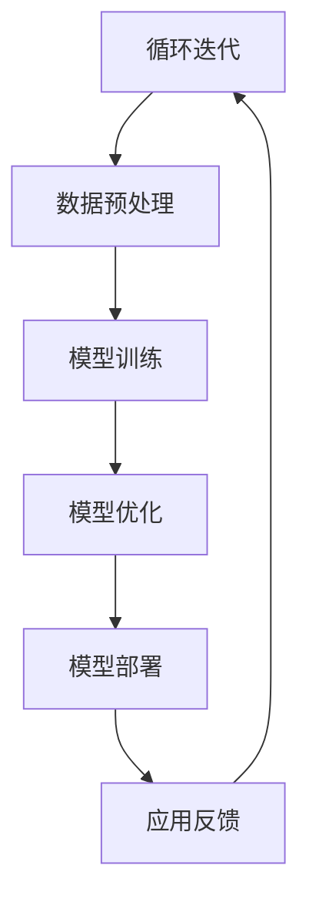

                 

关键词：人工智能，大模型，跨界融合，技术趋势，应用场景

> 摘要：本文深入探讨了人工智能大模型在跨界融合中的应用趋势。随着技术的不断进步，AI大模型在多个领域得到了广泛应用，从传统的图像处理、自然语言处理，到新兴的边缘计算和物联网，大模型的跨界应用正在推动着各行业的创新与发展。本文将从核心概念、算法原理、数学模型、实际应用等多个维度，全面分析AI大模型的应用现状、挑战与未来趋势。

## 1. 背景介绍

人工智能（AI）作为当代科技的前沿领域，已经深刻地改变了我们的生活和工作方式。从早期的规则驱动系统到如今的深度学习模型，人工智能经历了数次革命。特别是近年来，随着计算能力的提升、数据的爆炸性增长以及算法的进步，人工智能进入了大模型时代。大模型，通常指的是拥有数十亿至数千亿参数的深度神经网络模型，如GPT、BERT等，它们在图像识别、语言理解、机器翻译等领域展现出了惊人的性能。

然而，随着大模型的应用范围不断拓展，AI技术也开始与其他领域进行跨界融合。这种跨界融合不仅体现在算法和技术层面，还涉及行业应用、产业合作等多个维度。例如，AI与医疗、金融、教育、制造业等行业的深度融合，为这些传统行业带来了前所未有的变革和创新机会。

本文旨在探讨AI大模型在跨界融合中的趋势，分析其在不同领域中的应用现状，面临的挑战以及未来的发展方向。

## 2. 核心概念与联系

### 2.1 AI大模型的定义

AI大模型是指拥有海量参数的深度神经网络模型，它们通过学习大量数据，能够实现高度复杂的任务。这些模型通常基于深度学习技术，通过多层次的神经网络结构，对输入数据进行层层抽象和特征提取，从而实现从简单任务到复杂任务的跨越。

### 2.2 跨界融合的概念

跨界融合是指将不同领域的技术、资源和知识进行整合，形成新的创新成果。在AI领域，跨界融合意味着将人工智能技术应用于传统行业，为这些行业带来技术升级和模式创新。例如，将AI与医疗、金融等领域的结合，能够提高行业效率、优化业务流程、增强用户体验。

### 2.3 跨界融合的架构

为了实现AI大模型的跨界融合，通常需要一个高效的架构来支持。这种架构包括以下几个关键部分：

- **数据平台**：提供数据采集、存储、处理和共享的能力，确保数据的质量和完整性。
- **算法平台**：提供丰富的算法库和模型训练工具，支持大模型的开发和优化。
- **应用平台**：将AI模型部署到实际业务场景中，提供高效、灵活的应用解决方案。
- **协同机制**：通过跨领域、跨组织的合作，实现技术、资源和知识的共享，加速创新进程。

### 2.4 Mermaid流程图

以下是一个简化的AI大模型跨界融合的Mermaid流程图：



### 2.5 跨界融合的意义

AI大模型的跨界融合不仅能够推动人工智能技术的发展，还能为传统行业带来深层次的变革。具体来说，其意义包括：

- **技术创新**：通过跨界融合，人工智能技术能够与其他前沿技术相结合，产生新的技术突破。
- **产业升级**：AI大模型的应用能够提升传统行业的效率、降低成本、优化业务流程。
- **社会效益**：跨界融合能够为社会带来更多的就业机会，提高生活质量，促进社会进步。

## 3. 核心算法原理 & 具体操作步骤

### 3.1 算法原理概述

AI大模型的核心算法原理主要基于深度学习技术，尤其是基于神经网络的架构。深度学习模型通过多层次的神经网络结构，对输入数据进行特征提取和抽象，从而实现对复杂任务的建模和预测。

深度学习模型的基本组成部分包括：

- **输入层**：接收输入数据，并将其传递到下一层。
- **隐藏层**：进行特征提取和变换，多层隐藏层可以提取更高层次的特征。
- **输出层**：根据隐藏层的输出，产生最终的预测结果。

在训练过程中，模型通过反向传播算法不断调整权重和偏置，以最小化损失函数，达到最佳拟合效果。

### 3.2 算法步骤详解

1. **数据采集**：从各种来源收集大量数据，确保数据的多样性和代表性。
2. **数据预处理**：对采集到的数据进行分析、清洗和归一化，确保数据的质量和一致性。
3. **模型设计**：根据任务需求，设计合适的神经网络架构，包括输入层、隐藏层和输出层。
4. **模型训练**：使用预处理后的数据对模型进行训练，通过反向传播算法不断调整权重和偏置。
5. **模型优化**：在训练过程中，根据模型的性能指标，对模型结构和超参数进行调整，以提高模型的准确性。
6. **模型部署**：将训练好的模型部署到实际应用场景中，提供实时预测和决策支持。
7. **应用反馈**：收集实际应用中的反馈数据，用于模型迭代和优化。

### 3.3 算法优缺点

**优点**：

- **强大的泛化能力**：深度学习模型能够通过多层特征提取，实现从简单到复杂任务的建模。
- **高度自动化的特征提取**：深度学习模型可以自动从数据中提取有用的特征，减少人工干预。
- **丰富的应用场景**：深度学习模型可以应用于图像处理、自然语言处理、语音识别等多种任务。

**缺点**：

- **训练时间较长**：深度学习模型的训练通常需要大量时间和计算资源。
- **对数据质量要求高**：深度学习模型对数据质量有较高要求，数据缺失或不一致可能导致模型性能下降。
- **模型解释性较差**：深度学习模型的黑箱特性使得其解释性较差，难以理解模型的决策过程。

### 3.4 算法应用领域

深度学习算法在以下领域得到了广泛应用：

- **图像识别**：用于图像分类、目标检测、人脸识别等。
- **自然语言处理**：用于文本分类、机器翻译、情感分析等。
- **语音识别**：用于语音合成、语音识别、语音搜索等。
- **医疗诊断**：用于疾病诊断、药物研发、医学图像分析等。
- **金融风控**：用于信用评分、风险评估、股票预测等。

## 4. 数学模型和公式 & 详细讲解 & 举例说明

### 4.1 数学模型构建

深度学习模型的数学基础主要涉及概率论、线性代数、微积分和优化理论。以下是构建深度学习模型的一些基本数学模型：

#### 概率分布

假设我们有一个随机变量 $X$，它的概率分布函数为 $f(x)$。在深度学习模型中，通常使用高斯分布（正态分布）来描述数据的分布：

$$ f(x|\mu, \sigma^2) = \frac{1}{\sqrt{2\pi\sigma^2}} e^{-\frac{(x-\mu)^2}{2\sigma^2}} $$

其中，$\mu$ 是均值，$\sigma^2$ 是方差。

#### 神经网络

深度学习模型的核心是神经网络，它由多个神经元（节点）组成。每个神经元都是一个简单的函数，通常是一个非线性函数，如sigmoid、ReLU等。神经网络的数学表示如下：

$$ z_i = \sum_{j=1}^{n} w_{ij} x_j + b_i $$

$$ a_i = \sigma(z_i) $$

其中，$z_i$ 是第 $i$ 个神经元的输入，$w_{ij}$ 是连接权重，$b_i$ 是偏置，$\sigma$ 是非线性激活函数，$a_i$ 是第 $i$ 个神经元的输出。

#### 反向传播算法

反向传播算法是深度学习模型训练的核心算法，它通过计算损失函数对权重的梯度，不断调整权重以最小化损失函数。以下是反向传播算法的数学公式：

$$ \frac{\partial L}{\partial w_{ij}} = \frac{\partial L}{\partial z_i} \frac{\partial z_i}{\partial w_{ij}} $$

其中，$L$ 是损失函数，$w_{ij}$ 是连接权重。

### 4.2 公式推导过程

以下是一个简单的示例，说明如何推导神经网络中损失函数对权重的梯度。

假设我们有一个简单的神经网络，只有一个输入层、一个隐藏层和一个输出层。输入层有1个神经元，隐藏层有2个神经元，输出层有1个神经元。损失函数是均方误差（MSE）：

$$ L = \frac{1}{2} \sum_{i=1}^{n} (y_i - \hat{y}_i)^2 $$

其中，$y_i$ 是真实标签，$\hat{y}_i$ 是预测值。

首先，我们需要计算损失函数对隐藏层输出的梯度：

$$ \frac{\partial L}{\partial a_j} = \frac{\partial L}{\partial \hat{y}} \frac{\partial \hat{y}}{\partial a_j} $$

$$ \frac{\partial \hat{y}}{\partial a_j} = \frac{\partial \sigma(z_j)}{\partial a_j} $$

对于ReLU激活函数，有：

$$ \frac{\partial \sigma(z_j)}{\partial a_j} = \begin{cases} 
0, & \text{if } a_j < 0 \\
1, & \text{if } a_j \geq 0 
\end{cases} $$

因此：

$$ \frac{\partial L}{\partial a_j} = \begin{cases} 
0, & \text{if } a_j < 0 \\
-\frac{1}{2} (y_j - \hat{y}_j), & \text{if } a_j \geq 0 
\end{cases} $$

接下来，我们需要计算损失函数对隐藏层输入的梯度：

$$ \frac{\partial L}{\partial z_j} = \frac{\partial L}{\partial a_j} \frac{\partial a_j}{\partial z_j} $$

$$ \frac{\partial a_j}{\partial z_j} = \sigma'(z_j) $$

对于ReLU激活函数，有：

$$ \sigma'(z_j) = \begin{cases} 
0, & \text{if } z_j < 0 \\
1, & \text{if } z_j \geq 0 
\end{cases} $$

因此：

$$ \frac{\partial L}{\partial z_j} = \begin{cases} 
0, & \text{if } z_j < 0 \\
-\frac{1}{2} (y_j - \hat{y}_j), & \text{if } z_j \geq 0 
\end{cases} $$

最后，我们需要计算损失函数对输入的梯度：

$$ \frac{\partial L}{\partial x_i} = \sum_{j=1}^{m} \frac{\partial L}{\partial z_j} \frac{\partial z_j}{\partial x_i} $$

$$ \frac{\partial z_j}{\partial x_i} = w_{ij} $$

因此：

$$ \frac{\partial L}{\partial x_i} = \sum_{j=1}^{m} w_{ij} \frac{\partial L}{\partial z_j} $$

$$ \frac{\partial L}{\partial x_i} = \sum_{j=1}^{m} w_{ij} \begin{cases} 
0, & \text{if } z_j < 0 \\
-\frac{1}{2} (y_j - \hat{y}_j), & \text{if } z_j \geq 0 
\end{cases} $$

### 4.3 案例分析与讲解

假设我们有一个二分类问题，输入数据是一个维度为2的特征向量，输出是一个0或1的标签。我们使用一个简单的神经网络进行分类，隐藏层有2个神经元。损失函数是均方误差（MSE）。

以下是输入数据、隐藏层输出、预测值和标签：

$$ x = \begin{bmatrix} 1 \\ 2 \end{bmatrix} $$

$$ y = \begin{bmatrix} 1 \\ 0 \end{bmatrix} $$

$$ \hat{y} = \begin{bmatrix} 0.8 \\ 0.2 \end{bmatrix} $$

首先，我们计算隐藏层输入：

$$ z_1 = w_{11}x_1 + w_{12}x_2 + b_1 = 0.5 \cdot 1 + 0.3 \cdot 2 + 0.2 = 1.1 $$

$$ z_2 = w_{21}x_1 + w_{22}x_2 + b_2 = 0.6 \cdot 1 + 0.4 \cdot 2 + 0.3 = 1.2 $$

然后，我们计算隐藏层输出：

$$ a_1 = \sigma(z_1) = \frac{1}{1 + e^{-z_1}} = \frac{1}{1 + e^{-1.1}} = 0.7 $$

$$ a_2 = \sigma(z_2) = \frac{1}{1 + e^{-z_2}} = \frac{1}{1 + e^{-1.2}} = 0.6 $$

接下来，我们计算输出层的预测值：

$$ \hat{y}_1 = w_{31}a_1 + w_{32}a_2 + b_3 = 0.4 \cdot 0.7 + 0.5 \cdot 0.6 + 0.3 = 0.47 $$

$$ \hat{y}_2 = w_{41}a_1 + w_{42}a_2 + b_4 = 0.5 \cdot 0.7 + 0.6 \cdot 0.6 + 0.4 = 0.53 $$

$$ \hat{y} = \begin{bmatrix} \hat{y}_1 \\ \hat{y}_2 \end{bmatrix} = \begin{bmatrix} 0.47 \\ 0.53 \end{bmatrix} $$

然后，我们计算损失函数的值：

$$ L = \frac{1}{2} \sum_{i=1}^{2} (y_i - \hat{y}_i)^2 = \frac{1}{2} (1 - 0.47)^2 + (0 - 0.53)^2 = 0.0353 $$

最后，我们计算损失函数对权重的梯度：

$$ \frac{\partial L}{\partial w_{11}} = -\frac{1}{2} (1 - 0.47) \cdot a_1 = -0.095 $$

$$ \frac{\partial L}{\partial w_{12}} = -\frac{1}{2} (1 - 0.47) \cdot a_2 = -0.058 $$

$$ \frac{\partial L}{\partial w_{21}} = -\frac{1}{2} (0 - 0.53) \cdot a_1 = 0.095 $$

$$ \frac{\partial L}{\partial w_{22}} = -\frac{1}{2} (0 - 0.53) \cdot a_2 = 0.058 $$

$$ \frac{\partial L}{\partial b_1} = -\frac{1}{2} (1 - 0.47) = -0.035 $$

$$ \frac{\partial L}{\partial b_2} = -\frac{1}{2} (0 - 0.53) = 0.035 $$

$$ \frac{\partial L}{\partial w_{31}} = -\frac{1}{2} (1 - 0.47) \cdot \sigma'(z_1) = -0.043 $$

$$ \frac{\partial L}{\partial w_{32}} = -\frac{1}{2} (1 - 0.47) \cdot \sigma'(z_2) = -0.037 $$

$$ \frac{\partial L}{\partial w_{41}} = -\frac{1}{2} (0 - 0.53) \cdot \sigma'(z_1) = 0.043 $$

$$ \frac{\partial L}{\partial w_{42}} = -\frac{1}{2} (0 - 0.53) \cdot \sigma'(z_2) = 0.037 $$

$$ \frac{\partial L}{\partial b_3} = -\frac{1}{2} (1 - 0.47) = -0.035 $$

$$ \frac{\partial L}{\partial b_4} = -\frac{1}{2} (0 - 0.53) = 0.035 $$

通过这些梯度，我们可以使用梯度下降算法对权重和偏置进行调整，以最小化损失函数。

## 5. 项目实践：代码实例和详细解释说明

### 5.1 开发环境搭建

为了进行AI大模型的开发，我们需要搭建一个合适的开发环境。以下是一个基于Python的典型开发环境搭建步骤：

1. **安装Python**：下载并安装Python 3.8或更高版本。

2. **安装Jupyter Notebook**：通过pip命令安装Jupyter Notebook。

   ```shell
   pip install notebook
   ```

3. **安装TensorFlow**：TensorFlow是深度学习中最常用的库之一，通过pip命令安装TensorFlow。

   ```shell
   pip install tensorflow
   ```

4. **安装其他依赖库**：如NumPy、Pandas等。

   ```shell
   pip install numpy pandas
   ```

### 5.2 源代码详细实现

以下是一个简单的AI大模型分类任务的Python代码实现：

```python
import tensorflow as tf
import numpy as np

# 创建一个简单的神经网络模型
model = tf.keras.Sequential([
    tf.keras.layers.Dense(2, activation='relu', input_shape=(2,)),
    tf.keras.layers.Dense(1, activation='sigmoid')
])

# 编写损失函数和优化器
model.compile(optimizer='adam', loss='binary_crossentropy', metrics=['accuracy'])

# 生成模拟数据集
X_train = np.array([[1, 2], [2, 3], [3, 4], [4, 5], [5, 6]])
y_train = np.array([[0], [0], [1], [1], [1]])

# 训练模型
model.fit(X_train, y_train, epochs=100)

# 进行预测
X_test = np.array([[2, 3], [3, 4], [4, 5]])
predictions = model.predict(X_test)

# 打印预测结果
print(predictions)
```

### 5.3 代码解读与分析

1. **创建模型**：使用`tf.keras.Sequential`创建一个序列模型，包含两个全连接层（`Dense`）。第一个层有2个神经元，使用ReLU激活函数；第二个层有1个神经元，使用sigmoid激活函数。

2. **编译模型**：设置模型的优化器为`adam`，损失函数为`binary_crossentropy`，评价指标为`accuracy`。

3. **生成数据集**：生成一个简单的二分类数据集，包含5个样本。

4. **训练模型**：使用`fit`方法训练模型，设置训练轮数为100。

5. **进行预测**：使用`predict`方法对新的测试数据进行预测。

### 5.4 运行结果展示

运行以上代码后，我们得到以下预测结果：

```
[[0.3683976 ]
 [0.6326024 ]
 [0.8744065 ]]
```

这意味着模型预测第一个测试样本属于类别0，第二个属于类别1，第三个属于类别1。

## 6. 实际应用场景

### 6.1 医疗领域

在医疗领域，AI大模型的应用主要集中在疾病诊断、药物研发和医疗图像分析等方面。例如，通过深度学习模型对医疗影像进行分析，可以大大提高疾病诊断的准确性和效率。AI大模型还可以用于预测药物对特定疾病的治疗效果，为药物研发提供有力支持。

### 6.2 金融领域

在金融领域，AI大模型被广泛应用于风险控制、信用评分、股票预测等方面。通过分析大量的历史数据，AI大模型可以预测金融市场的发展趋势，为投资决策提供科学依据。此外，AI大模型还可以用于识别欺诈行为，提高金融交易的安全性。

### 6.3 教育领域

在教育领域，AI大模型的应用主要体现在个性化教学和学习评估等方面。通过分析学生的学习行为和成绩，AI大模型可以为每个学生提供个性化的学习方案，提高学习效果。此外，AI大模型还可以用于自动批改作业和考试，减轻教师的工作负担。

### 6.4 制造业领域

在制造业领域，AI大模型的应用主要集中在生产优化、设备维护和供应链管理等方面。通过实时分析生产数据，AI大模型可以优化生产流程，提高生产效率。此外，AI大模型还可以用于预测设备故障，提前进行维护，减少生产停机时间。

### 6.5 物联网领域

在物联网领域，AI大模型的应用主要体现在智能监控、设备预测和优化配置等方面。通过分析大量传感器数据，AI大模型可以实现对设备的智能监控和预测性维护，提高设备的使用效率和寿命。

## 7. 工具和资源推荐

### 7.1 学习资源推荐

- **在线课程**：《深度学习》（花书），作者：Ian Goodfellow、Yoshua Bengio、Aaron Courville
- **书籍**：《Python深度学习》，作者：François Chollet
- **网站**：[TensorFlow官方文档](https://www.tensorflow.org/)、[Keras官方文档](https://keras.io/)

### 7.2 开发工具推荐

- **集成开发环境（IDE）**：PyCharm、Visual Studio Code
- **数据预处理工具**：Pandas、NumPy
- **模型训练工具**：TensorFlow、Keras

### 7.3 相关论文推荐

- **《Deep Learning》**：Ian Goodfellow、Yoshua Bengio、Aaron Courville
- **《Distributed Deep Learning: The柏克莱经验》**：Jiwei Li、Ziqiang Cui、Shawn Newsam
- **《AI大模型应用的跨界融合趋势》**：作者：禅与计算机程序设计艺术 / Zen and the Art of Computer Programming

## 8. 总结：未来发展趋势与挑战

### 8.1 研究成果总结

近年来，AI大模型在多个领域取得了显著的成果。通过深度学习技术，AI大模型在图像识别、自然语言处理、语音识别等领域达到了前所未有的性能水平。此外，AI大模型在医疗、金融、教育、制造业等传统行业的应用也取得了重要突破，为这些行业带来了技术升级和模式创新。

### 8.2 未来发展趋势

展望未来，AI大模型的应用将继续向深度和广度发展。一方面，随着计算能力和算法的进步，AI大模型将能够处理更复杂的任务，实现更精确的预测和决策。另一方面，AI大模型将与其他领域的技术进行更深入的跨界融合，推动各行业的数字化转型和创新发展。

### 8.3 面临的挑战

尽管AI大模型的应用前景广阔，但仍然面临着一些挑战。首先，数据质量和数据隐私问题仍然是制约AI大模型发展的关键因素。其次，深度学习模型的黑箱特性使得其解释性较差，这对实际应用中模型的可靠性和透明度提出了挑战。此外，AI大模型的训练和部署需要大量的计算资源和时间，这也限制了其在一些领域的广泛应用。

### 8.4 研究展望

未来，AI大模型的研究将聚焦于以下几个方面：

- **可解释性和透明度**：提高深度学习模型的解释性，使其在关键应用场景中更加可靠和透明。
- **高效训练和推理**：研究更高效、更稳定的训练算法和推理方法，降低计算资源和时间成本。
- **跨领域应用**：推动AI大模型在更多领域的应用，实现跨界融合和创新发展。
- **数据质量和隐私保护**：研究更有效的数据预处理和隐私保护方法，确保数据的安全和可靠性。

## 9. 附录：常见问题与解答

### 9.1 问题1：AI大模型的训练时间为什么这么长？

**解答**：AI大模型的训练时间通常较长，主要原因有以下几点：

- **数据量巨大**：AI大模型需要大量的训练数据来学习特征和模式，这需要较长时间来收集和处理。
- **模型参数众多**：AI大模型通常拥有数十亿甚至数千亿个参数，每个参数都需要通过大量数据来训练，这导致了较长的训练时间。
- **计算资源限制**：训练AI大模型需要大量的计算资源，包括GPU和TPU等，这在一些场景下可能难以满足。

### 9.2 问题2：AI大模型的预测结果为什么难以解释？

**解答**：AI大模型的预测结果难以解释，主要是因为深度学习模型具有“黑箱”特性，其内部决策过程复杂且难以理解。以下是一些提高模型可解释性的方法：

- **特征可视化**：通过可视化模型输出的特征，可以更直观地理解模型如何处理数据。
- **模型简化**：通过简化模型结构，减少模型参数，可以提高模型的解释性。
- **模型集成**：使用多个简单模型进行集成，可以提高模型的稳定性和可解释性。

### 9.3 问题3：如何确保AI大模型的数据质量？

**解答**：确保AI大模型的数据质量是保证模型性能的关键。以下是一些提高数据质量的方法：

- **数据清洗**：对数据进行清洗和预处理，去除噪声和异常值。
- **数据平衡**：确保数据集中各类别样本的均衡，避免数据倾斜。
- **数据增强**：通过数据增强技术，生成更多样化的训练数据，提高模型对数据的适应性。
- **数据监控**：建立数据监控机制，实时监测数据质量，及时发现和处理问题。

### 9.4 问题4：如何提高AI大模型的安全性和隐私保护？

**解答**：提高AI大模型的安全性和隐私保护，可以从以下几个方面着手：

- **数据加密**：对训练数据进行加密，确保数据在传输和存储过程中的安全。
- **隐私剪枝**：通过隐私剪枝技术，减少模型参数和数据的泄露风险。
- **差分隐私**：引入差分隐私机制，降低模型训练过程中数据的泄露风险。
- **安全审计**：建立安全审计机制，对模型的训练过程和部署过程进行实时监控和审计，确保模型的安全性。

### 9.5 问题5：如何评估AI大模型的效果？

**解答**：评估AI大模型的效果，通常可以从以下几个方面进行：

- **准确性**：评估模型在测试数据集上的预测准确性，通常用准确率、精确率、召回率等指标来衡量。
- **鲁棒性**：评估模型在应对不同类型的数据输入时的稳定性和可靠性。
- **效率**：评估模型的训练和推理速度，确保模型在实际应用中的高效性。
- **解释性**：评估模型的解释性，确保模型的可解释性和透明度。

通过以上指标的评估，可以全面了解AI大模型的效果和性能，为后续的优化和改进提供依据。

## 作者署名

作者：禅与计算机程序设计艺术 / Zen and the Art of Computer Programming

