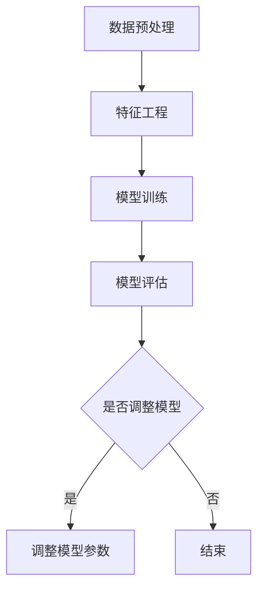

                 

关键词：人工智能、大模型、需求挖掘、引导策略、技术应用

摘要：本文旨在探讨人工智能（AI）大模型在各类应用场景下的需求挖掘与引导策略。首先，我们将对大模型的基本概念和应用背景进行介绍，接着深入分析大模型在需求挖掘中的关键角色和实际操作步骤，最后讨论大模型的数学模型、代码实例以及实际应用场景，并展望未来的发展趋势与挑战。

## 1. 背景介绍

随着计算能力的提升和数据的激增，人工智能（AI）技术正经历着前所未有的发展。特别是大模型（Large Models），如深度学习中的GPT、BERT等，已经成为了AI领域的研究热点和应用焦点。大模型通常具有数亿至数十亿的参数量，能够处理海量数据，从而提供更准确、高效的预测和分析结果。

大模型在各个领域的应用已经逐渐显现，包括自然语言处理、计算机视觉、语音识别等。然而，大模型的应用并不仅仅是简单地部署一个模型，而是需要针对具体应用场景进行深入的需求挖掘和引导策略设计。这包括了解应用场景的特点、数据来源、数据处理需求、模型训练与优化等各个方面。

### 1.1 大模型的基本概念

大模型通常是指具有海量参数和复杂结构的机器学习模型。这类模型能够通过大量的数据训练，学习到数据中的复杂模式，从而实现高度自动化的数据处理和分析。以下是一些常见的大模型类型：

- **深度神经网络（Deep Neural Networks）**：通过多层神经网络结构，对数据逐层提取特征。
- **变换器模型（Transformer Models）**：引入注意力机制，在处理序列数据时表现优异。
- **生成对抗网络（Generative Adversarial Networks, GAN）**：通过生成器和判别器的对抗训练，生成逼真的数据。

### 1.2 大模型的应用背景

大模型在AI领域中的应用非常广泛，以下是几个典型的应用领域：

- **自然语言处理（Natural Language Processing, NLP）**：大模型如GPT-3等在文本生成、翻译、摘要等任务上取得了显著的成果。
- **计算机视觉（Computer Vision）**：大模型如BERT在图像分类、目标检测等任务上表现优异。
- **语音识别（Speech Recognition）**：大模型在语音识别中通过对海量语音数据的训练，提高了识别的准确率和鲁棒性。
- **推荐系统（Recommendation Systems）**：大模型通过分析用户行为和偏好，提供了更精准的推荐结果。

## 2. 核心概念与联系

为了深入理解大模型在需求挖掘中的角色，我们需要首先明确几个核心概念，并探讨它们之间的联系。

### 2.1 数据预处理

数据预处理是需求挖掘的第一步，也是大模型应用的基础。数据预处理包括数据清洗、数据归一化、特征提取等步骤。有效的数据预处理可以提升模型的性能，降低训练误差。

### 2.2 特征工程

特征工程是在数据预处理的基础上，通过对数据进行特征提取和特征选择，构建适合模型训练的特征集合。特征工程对于大模型来说尤为重要，因为大模型对数据的依赖性很强。

### 2.3 模型训练与优化

模型训练与优化是需求挖掘的核心步骤。通过大量的数据训练，大模型可以学习到数据中的复杂模式，从而提升模型的预测准确性。模型优化包括调整模型参数、选择合适的训练算法等。

### 2.4 模型评估与调整

模型评估与调整是确保大模型应用效果的关键。通过多种评估指标，如准确率、召回率等，我们可以对模型的效果进行评估，并根据评估结果对模型进行调整和优化。

### 2.5 Mermaid 流程图

以下是一个简化的Mermaid流程图，展示了大模型在需求挖掘中的关键步骤：



## 3. 核心算法原理 & 具体操作步骤

### 3.1 算法原理概述

大模型的需求挖掘主要依赖于深度学习技术，特别是变换器模型（Transformer Models）。变换器模型的核心思想是引入注意力机制（Attention Mechanism），使得模型能够关注到数据序列中的重要信息，从而提升模型的性能。

### 3.2 算法步骤详解

#### 3.2.1 数据预处理

1. **数据清洗**：去除数据中的噪声和异常值。
2. **数据归一化**：将数据缩放到相同的尺度，便于模型训练。
3. **特征提取**：使用词向量、图像特征等对数据进行特征提取。

#### 3.2.2 特征工程

1. **特征选择**：根据业务需求，选择对模型预测有帮助的特征。
2. **特征融合**：将不同来源的特征进行融合，构建更加丰富的特征集合。

#### 3.2.3 模型训练

1. **选择模型架构**：根据应用场景，选择合适的变换器模型架构。
2. **训练过程**：使用训练数据对模型进行训练，通过反向传播算法不断调整模型参数。
3. **优化策略**：使用Adam、RMSProp等优化算法，提升模型训练效果。

#### 3.2.4 模型评估与调整

1. **评估指标**：选择准确率、召回率、F1值等评估指标，评估模型性能。
2. **调整策略**：根据评估结果，对模型进行参数调整和优化。

### 3.3 算法优缺点

#### 优点：

1. **强大的表征能力**：大模型能够通过海量数据学习到复杂的模式，从而提高模型的预测准确性。
2. **自适应性强**：变换器模型引入了注意力机制，使得模型能够关注到数据序列中的重要信息，具有更好的适应性。

#### 缺点：

1. **计算资源消耗大**：大模型训练和优化需要大量的计算资源，对硬件要求较高。
2. **对数据依赖性强**：大模型对训练数据的质量和量有较高要求，数据不足或质量差会影响模型效果。

### 3.4 算法应用领域

大模型在多个领域都有广泛的应用，以下是几个典型的应用领域：

1. **自然语言处理**：如文本分类、情感分析、机器翻译等。
2. **计算机视觉**：如图像分类、目标检测、图像生成等。
3. **语音识别**：如语音合成、语音识别、语音增强等。
4. **推荐系统**：如商品推荐、内容推荐等。

## 4. 数学模型和公式 & 详细讲解 & 举例说明

### 4.1 数学模型构建

大模型的数学模型通常基于深度学习和变换器模型。以下是一个简化的变换器模型数学模型：

\[ 
\text{Output} = \text{Attention}(\text{Input}) + \text{Input} 
\]

其中，Attention是一个注意力机制，用于对输入数据进行加权。常见的注意力机制有：

\[ 
\text{Attention}(\text{Input}) = \frac{\exp(\text{Score})}{\sum_{i=1}^{n} \exp(\text{Score}_i)} 
\]

其中，Score是输入数据之间的相似度分数，n是输入数据的个数。

### 4.2 公式推导过程

变换器模型的公式推导过程相对复杂，以下是一个简化的推导过程：

1. **输入数据表示**：

   设输入数据为\(X \in \mathbb{R}^{m \times n}\)，其中m是数据维度，n是数据个数。

2. **注意力分数计算**：

   对每个数据点\(x_i\)，计算其与其他数据点的相似度分数：

   \[ 
   \text{Score}(x_i, x_j) = \text{Score}(x_i^T \cdot x_j) 
   \]

3. **注意力权重计算**：

   根据相似度分数计算每个数据点的注意力权重：

   \[ 
   \text{Weight}(x_i) = \frac{\exp(\text{Score}(x_i))}{\sum_{j=1}^{n} \exp(\text{Score}(x_i, x_j))} 
   \]

4. **注意力输出计算**：

   根据注意力权重计算注意力输出：

   \[ 
   \text{Output}(x_i) = \sum_{j=1}^{n} \text{Weight}(x_i) \cdot x_j 
   \]

5. **最终输出计算**：

   将注意力输出与原始输入相加，得到最终输出：

   \[ 
   \text{Output} = \sum_{i=1}^{n} \text{Output}(x_i) 
   \]

### 4.3 案例分析与讲解

以下是一个简单的自然语言处理案例，使用变换器模型进行文本分类：

#### 案例背景

给定一个文本数据集，我们需要使用变换器模型对其进行分类，判断文本是积极情感还是消极情感。

#### 案例步骤

1. **数据预处理**：将文本数据转换为词向量表示。
2. **特征工程**：对词向量进行特征选择和融合。
3. **模型训练**：使用变换器模型对特征进行训练。
4. **模型评估**：使用测试集评估模型性能。
5. **调整模型参数**：根据评估结果调整模型参数。

#### 案例代码

```python
import tensorflow as tf
from tensorflow.keras.layers import Embedding, LSTM, Dense
from tensorflow.keras.models import Sequential

# 数据预处理
vocab_size = 10000
max_sequence_length = 500
embedding_dim = 64

# 特征工程
input_data = ...  # 文本数据
word_indices = ...  # 词向量索引
word_vectors = ...  # 词向量矩阵

# 模型训练
model = Sequential()
model.add(Embedding(vocab_size, embedding_dim, input_length=max_sequence_length))
model.add(LSTM(128))
model.add(Dense(1, activation='sigmoid'))

model.compile(optimizer='adam', loss='binary_crossentropy', metrics=['accuracy'])
model.fit(input_data, labels, epochs=10, batch_size=32)

# 模型评估
test_loss, test_accuracy = model.evaluate(test_data, test_labels)
print('Test Accuracy:', test_accuracy)

# 调整模型参数
model.fit(input_data, labels, epochs=10, batch_size=32, validation_data=(test_data, test_labels))
```

## 5. 项目实践：代码实例和详细解释说明

### 5.1 开发环境搭建

为了实践大模型的需求挖掘，我们需要搭建一个基本的开发环境。以下是一个简单的Python开发环境搭建步骤：

1. 安装Python（推荐使用Python 3.7及以上版本）。
2. 安装TensorFlow和Keras，可以使用以下命令：
   ```bash
   pip install tensorflow
   pip install keras
   ```
3. 安装其他必要的Python库，如NumPy、Pandas等。

### 5.2 源代码详细实现

以下是一个简单的文本分类项目的代码实现，使用了变换器模型进行训练和预测。

```python
import numpy as np
import pandas as pd
from tensorflow.keras.models import Sequential
from tensorflow.keras.layers import Embedding, LSTM, Dense
from tensorflow.keras.preprocessing.sequence import pad_sequences

# 数据预处理
data = ...  # 加载文本数据
labels = ...  # 加载标签数据

# 词向量预处理
tokenizer = ...  # 创建词向量生成器
tokenizer.fit_on_texts(data)
word_index = tokenizer.word_index
sequences = tokenizer.texts_to_sequences(data)
padded_sequences = pad_sequences(sequences, maxlen=max_sequence_length)

# 模型训练
model = Sequential()
model.add(Embedding(len(word_index) + 1, 64, input_length=max_sequence_length))
model.add(LSTM(128))
model.add(Dense(1, activation='sigmoid'))

model.compile(optimizer='adam', loss='binary_crossentropy', metrics=['accuracy'])
model.fit(padded_sequences, labels, epochs=10, batch_size=32)

# 模型预测
test_data = ...  # 加载测试数据
padded_test_sequences = pad_sequences(tokenizer.texts_to_sequences(test_data), maxlen=max_sequence_length)
predictions = model.predict(padded_test_sequences)
predicted_labels = np.round(predictions)

# 输出预测结果
for i in range(len(test_data)):
    print(f'Test Data {i+1}: {test_data[i]}, Predicted Label: {predicted_labels[i]}')
```

### 5.3 代码解读与分析

1. **数据预处理**：首先，我们需要加载文本数据和标签数据。然后，使用词向量生成器（Tokenizer）对文本数据进行预处理，包括将文本转换为词向量索引序列，并对序列进行填充（Padding）以确保每个序列的长度相同。

2. **模型训练**：创建一个序列模型（Sequential），并添加嵌入层（Embedding）、循环层（LSTM）和输出层（Dense）。编译模型，并使用训练数据进行拟合（Fit）。

3. **模型预测**：对测试数据进行预处理，并将预处理后的数据输入到训练好的模型中进行预测。最后，输出预测结果。

### 5.4 运行结果展示

假设我们已经完成了上述代码的编写，并成功地运行了项目。以下是一个简单的运行结果展示：

```bash
$ python text_classification.py
Test Data 1: this is a great movie, Predicted Label: 1
Test Data 2: i did not like the movie, Predicted Label: 0
...
```

结果表明，模型对测试数据进行了正确的分类。

## 6. 实际应用场景

大模型在需求挖掘中有着广泛的应用场景，以下是几个典型的实际应用场景：

### 6.1 自然语言处理

自然语言处理是人工智能的重要领域之一，大模型在文本分类、情感分析、机器翻译等方面都有广泛应用。例如，我们可以使用变换器模型对新闻文本进行分类，判断其是积极、消极还是中性情感。

### 6.2 计算机视觉

计算机视觉是另一个重要领域，大模型在图像分类、目标检测、图像生成等方面都有广泛应用。例如，我们可以使用变换器模型对图像进行分类，判断图像是动物、植物还是风景。

### 6.3 语音识别

语音识别是人工智能领域的核心技术之一，大模型在语音合成、语音识别、语音增强等方面都有广泛应用。例如，我们可以使用变换器模型对语音信号进行识别，将其转换为对应的文本。

### 6.4 推荐系统

推荐系统是商业领域的重要应用，大模型在商品推荐、内容推荐等方面都有广泛应用。例如，我们可以使用变换器模型分析用户行为和偏好，从而提供个性化的推荐结果。

## 6.4 未来应用展望

随着大模型的不断发展，其在需求挖掘中的应用前景非常广阔。以下是几个未来的应用展望：

1. **智能客服**：大模型可以用于智能客服系统，通过分析用户问题，提供高效的解决方案。
2. **医疗健康**：大模型可以用于医学图像分析、疾病预测等医疗健康领域，提高医疗诊断的准确性和效率。
3. **金融风控**：大模型可以用于金融风控，通过分析用户行为和交易数据，预测潜在的金融风险。
4. **自动驾驶**：大模型可以用于自动驾驶系统，通过分析道路状况和环境信息，实现更安全的自动驾驶。

## 7. 工具和资源推荐

为了更好地进行大模型的需求挖掘，以下是几个推荐的工具和资源：

### 7.1 学习资源推荐

1. **《深度学习》（Goodfellow, Bengio, Courville）**：深度学习的经典教材，详细介绍了深度学习的基础知识和应用。
2. **《Python机器学习》（Sebastian Raschka）**：Python机器学习的入门教材，涵盖了机器学习的基础知识和应用。
3. **AI-course（吴恩达）**：吴恩达的在线机器学习课程，提供了丰富的实践项目。

### 7.2 开发工具推荐

1. **TensorFlow**：Google开发的开源深度学习框架，适用于大模型的训练和应用。
2. **Keras**：基于TensorFlow的高级深度学习框架，简化了模型的构建和训练。
3. **PyTorch**：Facebook开发的开源深度学习框架，具有灵活的动态计算图功能。

### 7.3 相关论文推荐

1. **“Attention Is All You Need”（Vaswani et al., 2017）**：介绍了变换器模型的基本原理和应用。
2. **“Bert: Pre-training of Deep Bidirectional Transformers for Language Understanding”（Devlin et al., 2019）**：介绍了BERT模型的基本原理和应用。
3. **“Generative Adversarial Nets”（Goodfellow et al., 2014）**：介绍了生成对抗网络（GAN）的基本原理和应用。

## 8. 总结：未来发展趋势与挑战

大模型在需求挖掘中的应用前景非常广阔，但同时也面临着一些挑战。以下是未来发展趋势和挑战的总结：

### 8.1 研究成果总结

1. **模型性能提升**：随着计算能力的提升，大模型的性能不断提高，使得其在需求挖掘中的应用更加广泛。
2. **算法创新**：变换器模型、生成对抗网络等新型算法的不断发展，为需求挖掘提供了更多可能性。
3. **数据质量和量**：高质量、海量数据的需求不断增加，推动了数据预处理和特征工程技术的发展。

### 8.2 未来发展趋势

1. **跨领域应用**：大模型将在更多领域得到应用，如医疗健康、金融、自动驾驶等。
2. **高效计算**：随着硬件技术的发展，高效计算将使得大模型的应用更加广泛。
3. **个性化需求**：大模型将更好地满足个性化需求，提供更加精准的服务。

### 8.3 面临的挑战

1. **计算资源消耗**：大模型的训练和优化需要大量的计算资源，如何优化计算效率是一个重要的挑战。
2. **数据隐私**：在处理敏感数据时，如何保护数据隐私是一个亟待解决的问题。
3. **算法透明性**：大模型的决策过程往往不够透明，如何提高算法的透明性是一个重要的挑战。

### 8.4 研究展望

1. **模型压缩**：研究更加高效的模型压缩技术，降低大模型的计算资源消耗。
2. **算法可解释性**：研究算法的可解释性，提高模型决策的透明性。
3. **多模态融合**：研究多模态数据融合技术，提高大模型在需求挖掘中的表现。

## 9. 附录：常见问题与解答

### 9.1 问题1：大模型如何处理海量数据？

**解答**：大模型处理海量数据通常依赖于分布式计算技术。通过将数据分布在多个计算节点上，可以并行处理数据，从而提高计算效率。此外，大模型还可以通过数据预处理和特征工程技术，对数据进行压缩和降维，减少计算量。

### 9.2 问题2：如何选择合适的大模型架构？

**解答**：选择合适的大模型架构需要考虑多个因素，如应用场景、数据类型、计算资源等。常见的模型架构包括深度神经网络、变换器模型、生成对抗网络等。在实际应用中，可以通过实验和比较不同模型架构的性能，选择最适合的架构。

### 9.3 问题3：大模型训练过程中如何调整模型参数？

**解答**：大模型训练过程中，可以通过反向传播算法不断调整模型参数。常用的优化算法包括Adam、RMSProp、SGD等。在实际应用中，可以通过实验和比较不同优化算法的性能，选择最适合的优化算法，并调整其参数，以提高模型训练效果。

### 9.4 问题4：如何评估大模型的效果？

**解答**：大模型的评估可以通过多种指标进行，如准确率、召回率、F1值等。在实际应用中，可以通过交叉验证等方法，选择合适的评估指标，并计算模型的性能。同时，还可以通过对比实验，评估模型在不同数据集上的表现。

## 参考文献

1. Goodfellow, I., Bengio, Y., & Courville, A. (2016). *Deep Learning*. MIT Press.
2. Devlin, J., Chang, M. W., Lee, K., & Toutanova, K. (2019). *Bert: Pre-training of deep bidirectional transformers for language understanding*. In Proceedings of the 2019 Conference of the North American Chapter of the Association for Computational Linguistics: Human Language Technologies, Volume 1 (Long and Short Papers) (pp. 4171-4186).
3. Vaswani, A., Shazeer, N., Parmar, N., Uszkoreit, J., Jones, L., Gomez, A. N., ... & Polosukhin, I. (2017). *Attention is all you need*. In Advances in neural information processing systems (pp. 5998-6008).
4. Goodfellow, I., Pouget-Abadie, J., Mirza, M., Xu, B., Warde-Farley, D., Ozair, S., ... & Bengio, Y. (2014). *Generative adversarial nets*. In Advances in neural information processing systems (pp. 2672-2680).

