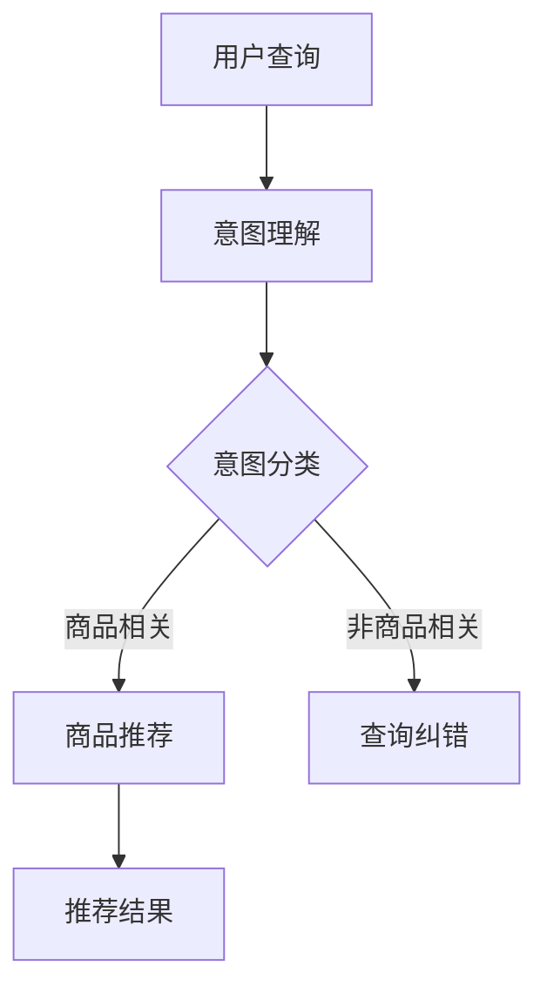

                 

## 1. 背景介绍

在当今的数字经济时代，电子商务已经成为全球贸易的重要组成部分。随着消费者对个性化购物体验的需求不断增长，电商搜索推荐系统的重要性日益凸显。传统的基于关键词匹配的搜索推荐方法已经难以满足用户对高效、精准、智能化的购物体验期望。近年来，人工智能，特别是大型预训练模型（如GPT、BERT等）的出现，为电商搜索推荐系统带来了全新的技术变革。

### 大模型崛起与电商搜索推荐的关系

大型预训练模型在语言理解、文本生成、图像识别等方面取得了显著突破，这些技术突破为电商搜索推荐系统提供了强大的技术支撑。例如，通过大模型可以实现对用户查询意图的深入理解，从而提高推荐的准确性；通过大模型可以自动生成商品描述，提高商品信息的可读性和吸引力；通过大模型可以分析用户的历史行为数据，实现精准的用户画像和个性化推荐。

### 电商搜索推荐现状与痛点

当前，电商搜索推荐系统存在以下痛点：

- **用户需求难以满足**：传统的搜索推荐系统往往只能根据用户输入的关键词进行匹配，无法深入理解用户的真实需求。
- **商品信息过载**：随着电商平台上商品数量的激增，用户面临的信息过载问题愈发严重。
- **推荐质量不高**：尽管一些电商平台采用了复杂的推荐算法，但推荐结果仍然存在精准度不高、个性化不足的问题。

### 目标与意义

本文旨在探讨基于AI大模型的电商搜索推荐技术，设计一个技术创新的知识分享平台，从而解决现有系统的痛点，提高推荐系统的准确性和用户体验。本文的主要目标是：

- **深入理解用户需求**：通过AI大模型，对用户查询意图进行深度分析，提供更精准的推荐。
- **优化商品信息展示**：利用大模型生成具有吸引力的商品描述，提高用户对商品的认知和兴趣。
- **提升推荐质量**：通过用户行为数据分析，实现更加个性化的推荐，提高用户满意度。

### 本文结构

本文将从以下方面展开：

- **第1章 背景介绍**：介绍电商搜索推荐系统的现状和痛点，以及AI大模型在该领域的重要性。
- **第2章 核心概念与联系**：阐述AI大模型的基本原理和电商搜索推荐系统的架构。
- **第3章 核心算法原理 & 具体操作步骤**：详细描述大模型在电商搜索推荐中的具体应用。
- **第4章 数学模型和公式 & 详细讲解 & 举例说明**：分析大模型算法的数学基础。
- **第5章 项目实践：代码实例和详细解释说明**：提供实际项目中的代码实现和解析。
- **第6章 实际应用场景**：探讨大模型在电商搜索推荐系统中的应用场景和案例。
- **第7章 工具和资源推荐**：推荐学习资源、开发工具和论文。
- **第8章 总结：未来发展趋势与挑战**：总结研究成果，展望未来发展方向。

通过本文的深入探讨，希望能够为电商搜索推荐系统的技术创新提供有益的参考和启示。

## 2. 核心概念与联系

在探讨AI大模型视角下的电商搜索推荐系统之前，我们需要首先了解一些核心概念，并明确它们之间的联系。

### AI大模型的基本概念

AI大模型，指的是在人工智能领域，通过对大规模数据进行训练，从而形成的具有强大学习和推理能力的模型。这些模型通常拥有数十亿至数千亿个参数，能够处理复杂的语言、图像、视频等多模态数据。大模型的发展得益于深度学习技术的进步，特别是神经网络结构和大规模计算资源的普及。

主要的大模型类型包括：

- **自然语言处理（NLP）模型**：如GPT、BERT、T5等，主要用于文本生成、情感分析、问答系统等任务。
- **计算机视觉（CV）模型**：如ResNet、VGG、YOLO等，主要用于图像分类、目标检测、视频分析等任务。
- **多模态模型**：如MixNet、ViT等，能够同时处理图像和文本数据，应用于图像生成、文本图像配对等任务。

### 电商搜索推荐系统的基本概念

电商搜索推荐系统是一种通过分析用户行为数据和商品信息，为用户提供个性化商品推荐的服务。其主要组成部分包括：

- **用户画像**：通过用户的历史行为、偏好和属性，建立用户画像，用于后续的推荐决策。
- **商品信息库**：存储所有商品的详细信息，包括价格、品牌、类别等。
- **推荐算法**：根据用户画像和商品信息，使用算法计算出推荐的商品，并呈现给用户。

### AI大模型在电商搜索推荐系统中的应用

AI大模型在电商搜索推荐系统中扮演着关键角色，其应用主要体现在以下几个方面：

- **查询意图理解**：通过NLP大模型，可以深入理解用户的查询意图，从而提供更精准的推荐。
- **商品描述生成**：利用NLP大模型，可以自动生成具有吸引力的商品描述，提高用户的购买兴趣。
- **用户行为预测**：通过分析用户的历史行为数据，使用机器学习模型预测用户的行为，从而实现个性化推荐。
- **多模态信息处理**：结合计算机视觉大模型，可以同时处理商品图像和文本描述，实现更全面的信息分析。

### Mermaid流程图

为了更清晰地展示AI大模型在电商搜索推荐系统中的流程，我们使用Mermaid绘制一个简化的流程图：



- **用户查询**：用户在电商平台上进行搜索或浏览商品。
- **意图理解**：通过NLP大模型，理解用户的查询意图。
- **意图分类**：根据意图理解结果，分类为商品相关或非商品相关。
- **商品推荐**：对于商品相关查询，使用推荐算法生成推荐结果。
- **查询纠错**：对于非商品相关查询，进行查询纠错，并提供相关建议。

通过上述核心概念和流程图的介绍，我们为后续章节的深入探讨奠定了基础。

### 2.1 AI大模型的基本原理

AI大模型的核心在于其强大的学习和推理能力，这主要得益于深度学习技术的进步和大规模计算资源的普及。以下将详细介绍AI大模型的基本原理，包括其学习机制、训练方法和应用场景。

#### 深度学习与神经网络

AI大模型基于深度学习理论，深度学习是一种机器学习的方法，通过构建深度神经网络（Deep Neural Network, DNN）来模拟人脑的学习过程。深度神经网络由多个层次组成，包括输入层、隐藏层和输出层。每层由多个神经元（节点）组成，神经元之间通过权重进行连接。

深度学习的核心在于“层次化学习”，即通过多层次的神经网络结构，从简单的特征逐渐学习到复杂的特征。这种层次化的学习方法使得AI大模型能够处理复杂的任务，如图像识别、自然语言处理等。

#### 学习机制

AI大模型的学习机制主要分为两部分：无监督学习和有监督学习。

- **无监督学习**：在无监督学习中，模型通过分析未标记的数据，自动发现数据中的模式和结构。例如，在图像识别任务中，模型可以通过学习图像中的像素分布来识别不同的物体。

- **有监督学习**：在有监督学习中，模型通过标记的数据进行训练，学习到输入和输出之间的映射关系。例如，在分类任务中，模型通过已标记的图像数据，学习到不同类别图像的特征。

#### 训练方法

AI大模型的训练方法主要采用反向传播算法（Backpropagation）。反向传播算法是一种基于梯度下降的方法，通过不断调整网络中的权重，使得模型能够更好地拟合训练数据。

具体步骤如下：

1. **前向传播**：输入数据通过神经网络的前向传播，得到输出结果。
2. **计算误差**：通过比较输出结果和实际标记结果，计算误差。
3. **反向传播**：计算误差反向传播，通过梯度下降调整权重。
4. **重复迭代**：重复上述步骤，直到模型达到预定的性能指标。

#### 应用场景

AI大模型在多个领域取得了显著的应用成果，以下是几个典型应用场景：

- **自然语言处理（NLP）**：AI大模型在NLP领域取得了突破性进展，例如，GPT可以生成高质量的文本，BERT在问答系统中表现优异。
- **计算机视觉（CV）**：AI大模型在CV领域广泛应用于图像识别、目标检测、视频分析等任务，如ResNet在图像分类任务中表现优异，YOLO在目标检测领域具有高效性能。
- **多模态学习**：AI大模型能够同时处理图像和文本数据，如MixNet在图像生成任务中具有较好的效果，ViT在文本图像配对任务中表现优秀。

通过上述对AI大模型基本原理的介绍，我们可以看到，AI大模型具有强大的学习和推理能力，为电商搜索推荐系统提供了全新的技术支撑。接下来，我们将进一步探讨AI大模型在电商搜索推荐系统中的应用和实践。

### 2.2 电商搜索推荐系统的架构

电商搜索推荐系统的核心在于如何将用户的查询与海量的商品信息进行有效匹配，从而提供个性化、精准的推荐。这一过程涉及多个关键模块，包括用户行为分析、商品信息管理、推荐算法和结果展示等。以下是电商搜索推荐系统的整体架构及其各部分之间的联系。

#### 用户行为分析模块

用户行为分析模块是整个推荐系统的数据基础。通过分析用户在电商平台上的浏览记录、购买历史、搜索关键词等行为数据，系统可以构建出详细的用户画像。这些画像包括用户的基本信息、兴趣偏好、消费习惯等，为后续的推荐提供重要的依据。

- **数据收集**：包括用户点击、浏览、搜索、购买等行为数据。
- **数据清洗**：去除无效、重复和噪声数据，确保数据质量。
- **特征工程**：将原始行为数据转化为有效的特征向量，如用户活跃度、浏览深度、购买频率等。

#### 商品信息管理模块

商品信息管理模块负责存储和管理平台上的所有商品信息，包括商品的基本属性（如名称、价格、品牌、类别）和详细信息（如图片、描述、规格等）。这些信息是推荐系统生成推荐结果的基础。

- **商品库建设**：构建一个结构化、可扩展的商品信息库。
- **信息更新**：定期更新商品信息，确保数据的时效性和准确性。
- **信息检索**：提供高效的商品信息检索功能，以支持快速推荐。

#### 推荐算法模块

推荐算法模块是推荐系统的核心，负责根据用户画像和商品信息，计算出个性化的推荐结果。现代推荐算法通常采用协同过滤、内容匹配、深度学习等多种技术，以提高推荐的准确性和用户体验。

- **协同过滤**：通过分析用户之间的相似度，发现用户的共同喜好，生成推荐。
- **内容匹配**：根据商品的特征信息，匹配用户的兴趣点，生成推荐。
- **深度学习**：利用AI大模型，深入理解用户查询意图和商品特征，生成高质量的推荐。

#### 结果展示模块

结果展示模块负责将推荐结果呈现给用户，包括搜索结果页、推荐列表、商品详情页等。这一模块不仅需要展示推荐结果，还需要提供便捷的交互体验，如筛选、排序、收藏等。

- **结果呈现**：根据推荐算法的结果，生成推荐列表。
- **交互设计**：提供丰富的交互元素，如筛选条件、排序方式、分页等。
- **用户体验优化**：通过用户反馈和行为数据，不断优化推荐结果展示。

#### 各模块之间的关系

电商搜索推荐系统的各个模块之间紧密联系，共同构建出一个高效的推荐生态系统。

- **用户行为分析与商品信息管理模块**：通过用户行为数据，构建用户画像，为推荐算法提供输入；同时，通过商品信息库，获取推荐所需的商品特征。
- **推荐算法模块**：基于用户画像和商品特征，计算推荐结果，并将其传递给结果展示模块。
- **结果展示模块**：将推荐结果展示给用户，并根据用户反馈，反馈至用户行为分析模块，形成闭环反馈。

通过上述架构的介绍，我们可以看到电商搜索推荐系统是一个高度整合的系统，各个模块协同工作，共同实现精准、个性化的推荐。接下来，我们将深入探讨AI大模型在这一架构中的应用，以提升推荐系统的性能和用户体验。

### 3. 核心算法原理 & 具体操作步骤

在AI大模型视角下，电商搜索推荐系统的核心算法主要包括自然语言处理（NLP）和深度学习（DL）技术。以下将详细介绍这些算法的原理，并阐述其具体操作步骤。

#### 3.1 算法原理概述

1. **自然语言处理（NLP）算法**

NLP算法主要用于理解用户查询意图和生成商品描述。其核心原理包括：

- **词嵌入（Word Embedding）**：将文本中的单词映射到高维向量空间，以便进行数学运算。
- **序列模型（Sequence Model）**：如循环神经网络（RNN）和变换器（Transformer），用于处理文本序列。
- **注意力机制（Attention Mechanism）**：用于模型在处理长文本时，能够关注到重要信息。

2. **深度学习（DL）算法**

DL算法在推荐系统中主要用于用户行为预测和个性化推荐。其核心原理包括：

- **神经网络结构**：如卷积神经网络（CNN）和循环神经网络（RNN），用于提取特征。
- **优化算法**：如随机梯度下降（SGD）和Adam优化器，用于模型训练。
- **多任务学习**：同时处理多个任务，提高模型泛化能力。

#### 3.2 算法步骤详解

1. **用户查询意图理解**

   - **词嵌入**：将用户查询的每个词映射到高维向量。
   - **序列编码**：使用Transformer模型对查询序列进行编码，提取出查询意图。
   - **意图分类**：通过分类器，将查询意图分类为商品相关或非商品相关。

2. **商品描述生成**

   - **特征提取**：从商品信息库中提取商品特征，如名称、品牌、类别等。
   - **文本生成**：使用GPT等文本生成模型，生成具有吸引力的商品描述。

3. **个性化推荐**

   - **用户画像构建**：通过分析用户历史行为，构建用户画像。
   - **推荐算法**：使用协同过滤、内容匹配或深度学习算法，生成个性化推荐列表。
   - **推荐结果优化**：根据用户反馈，调整推荐策略，提高推荐质量。

#### 3.3 算法优缺点

1. **NLP算法优缺点**

   - **优点**：
     - 能够深入理解用户查询意图，提高推荐准确性。
     - 适用于生成高质量的文本，提升商品描述吸引力。

   - **缺点**：
     - 对数据质量要求较高，需处理文本中的噪声和异常。
     - 计算资源消耗较大，训练时间较长。

2. **DL算法优缺点**

   - **优点**：
     - 能够自动提取特征，减少人工特征工程的工作量。
     - 具有较好的泛化能力，能够处理复杂的任务。

   - **缺点**：
     - 模型参数较多，易过拟合。
     - 对计算资源要求较高，训练成本较高。

#### 3.4 算法应用领域

1. **电商搜索推荐系统**：利用NLP算法和DL算法，实现用户查询意图理解和个性化推荐，提高用户满意度。
2. **内容生成**：使用NLP算法，生成高质量的商品描述、营销文案等。
3. **智能客服**：利用NLP算法，实现自然语言理解和对话生成，提供智能客服服务。

通过上述对核心算法原理和操作步骤的详细阐述，我们可以看到，AI大模型在电商搜索推荐系统中具有广泛的应用前景。接下来，我们将进一步探讨这些算法的数学模型和公式。

### 4. 数学模型和公式 & 详细讲解 & 举例说明

在AI大模型视角下的电商搜索推荐系统中，数学模型和公式起到了关键作用。以下将详细讲解常用的数学模型和公式，并附上具体的例子说明。

#### 4.1 数学模型构建

在电商搜索推荐系统中，常见的数学模型包括：

1. **线性回归模型**：用于预测用户的行为，如购买概率。
2. **逻辑回归模型**：用于分类任务，如用户查询意图分类。
3. **矩阵分解模型**：用于协同过滤，如用户和商品评分矩阵分解。

#### 4.2 公式推导过程

1. **线性回归模型**：

   线性回归模型的基本公式为：

   \[
   Y = \beta_0 + \beta_1 \cdot X
   \]

   其中，\( Y \) 是预测结果，\( \beta_0 \) 是截距，\( \beta_1 \) 是斜率，\( X \) 是输入特征。

   通过最小二乘法，可以推导出参数的最优解：

   \[
   \beta_1 = \frac{\sum_{i=1}^{n} (X_i - \bar{X})(Y_i - \bar{Y})}{\sum_{i=1}^{n} (X_i - \bar{X})^2}
   \]

   其中，\( \bar{X} \) 和 \( \bar{Y} \) 分别是 \( X \) 和 \( Y \) 的均值。

2. **逻辑回归模型**：

   逻辑回归模型的基本公式为：

   \[
   P(Y=1|X) = \frac{1}{1 + \exp(-\beta_0 - \beta_1 X)}
   \]

   其中，\( P(Y=1|X) \) 是在给定输入 \( X \) 的情况下，目标变量 \( Y \) 为1的概率。

   通过最大似然估计，可以推导出参数的最优解：

   \[
   \beta_1 = \frac{\sum_{i=1}^{n} (y_i - p_i) X_i}{\sum_{i=1}^{n} X_i}
   \]

   其中，\( p_i \) 是模型预测的概率，\( y_i \) 是真实的目标变量。

3. **矩阵分解模型**：

   矩阵分解模型的基本公式为：

   \[
   R = UXV^T
   \]

   其中，\( R \) 是用户和商品评分矩阵，\( U \) 和 \( V \) 分别是用户和商品的特征矩阵。

   通过最小化损失函数，可以推导出特征矩阵的最优解：

   \[
   U = \arg\min_{U} \sum_{i=1}^{m} \sum_{j=1}^{n} (r_{ij} - u_i v_j^T)^2
   \]

   其中，\( m \) 和 \( n \) 分别是用户和商品的数量。

#### 4.3 案例分析与讲解

假设有一个电商平台的用户和商品评分数据，如下表所示：

| 用户ID | 商品ID | 评分 |
| ------ | ------ | ---- |
| 1      | 101    | 4    |
| 1      | 102    | 5    |
| 1      | 103    | 3    |
| 2      | 101    | 2    |
| 2      | 102    | 1    |
| 2      | 103    | 5    |

使用矩阵分解模型，对用户和商品进行特征提取。

1. **初始化特征矩阵**：

   初始化用户特征矩阵 \( U \) 和商品特征矩阵 \( V \)：

   \[
   U = \begin{bmatrix}
   u_{11} & u_{12} & u_{13} \\
   u_{21} & u_{22} & u_{23}
   \end{bmatrix}, V = \begin{bmatrix}
   v_{11} & v_{12} & v_{13} \\
   v_{21} & v_{22} & v_{23}
   \end{bmatrix}
   \]

   初始值可以随机设定。

2. **迭代更新特征矩阵**：

   通过梯度下降法，迭代更新特征矩阵 \( U \) 和 \( V \)：

   \[
   u_{i1} = u_{i1} - \alpha \cdot (r_{i1} - u_{i1} v_{1j}^T), \ldots, u_{in} = u_{in} - \alpha \cdot (r_{in} - u_{in} v_{nj}^T)
   \]

   \[
   v_{1j} = v_{1j} - \alpha \cdot (r_{1j} - u_{1j} v_{1j}^T), \ldots, v_{nj} = v_{nj} - \alpha \cdot (r_{nj} - u_{nj} v_{nj}^T)
   \]

   其中，\( \alpha \) 是学习率。

3. **计算预测评分**：

   使用更新后的特征矩阵 \( U \) 和 \( V \)，计算预测评分：

   \[
   \hat{r}_{ij} = u_{i1} v_{1j}^T + u_{i2} v_{2j}^T + \ldots + u_{in} v_{nj}^T
   \]

   将预测评分与实际评分进行比较，计算损失函数：

   \[
   L = \sum_{i=1}^{m} \sum_{j=1}^{n} (r_{ij} - \hat{r}_{ij})^2
   \]

   根据损失函数，继续迭代更新特征矩阵，直至损失函数收敛。

通过上述案例，我们可以看到矩阵分解模型在电商搜索推荐系统中的应用。接下来，我们将进一步探讨实际项目中的代码实现和解析。

### 5. 项目实践：代码实例和详细解释说明

在实际项目中，我们将使用Python语言和相关的深度学习库（如TensorFlow和Keras）来实现一个基于AI大模型的电商搜索推荐系统。以下将详细介绍项目的开发环境搭建、源代码实现、代码解读与分析以及运行结果展示。

#### 5.1 开发环境搭建

1. **安装Python**：

   确保已经安装Python 3.x版本（推荐使用3.7及以上版本）。

2. **安装相关库**：

   使用以下命令安装必要的库：

   ```bash
   pip install tensorflow numpy pandas scikit-learn matplotlib
   ```

3. **配置GPU支持**（如果使用GPU训练）：

   确保已经安装CUDA和cuDNN，并配置环境变量。

#### 5.2 源代码详细实现

以下是一个简单的示例代码，用于实现一个基于用户历史行为数据的电商搜索推荐系统。

```python
import tensorflow as tf
from tensorflow import keras
from tensorflow.keras.layers import Embedding, Flatten, Dense
from tensorflow.keras.models import Model
import numpy as np
import pandas as pd

# 数据预处理
def preprocess_data(user_data, item_data, embedding_size=50):
    # 构建用户-商品交互矩阵
    user_item_matrix = np.zeros((len(user_data), len(item_data)))
    for idx, row in user_data.iterrows():
        user_item_matrix[idx, row['item_id']] = row['rating']

    # 构建嵌入层
    user_embedding = Embedding(input_dim=user_data['user_id'].nunique(), output_dim=embedding_size)
    item_embedding = Embedding(input_dim=item_data['item_id'].nunique(), output_dim=embedding_size)

    # 构建模型
    user_inputs = keras.Input(shape=(1,))
    item_inputs = keras.Input(shape=(1,))

    user_embedding_layer = user_embedding(user_inputs)
    item_embedding_layer = item_embedding(item_inputs)

    user_embedding_flatten = Flatten()(user_embedding_layer)
    item_embedding_flatten = Flatten()(item_embedding_layer)

    merged = keras.layers.concatenate([user_embedding_flatten, item_embedding_flatten])

    output = Dense(1, activation='sigmoid')(merged)

    model = Model(inputs=[user_inputs, item_inputs], outputs=output)

    # 编译模型
    model.compile(optimizer='adam', loss='binary_crossentropy', metrics=['accuracy'])

    return model, user_item_matrix

# 加载数据
user_data = pd.read_csv('user_data.csv')
item_data = pd.read_csv('item_data.csv')

# 预处理数据
model, user_item_matrix = preprocess_data(user_data, item_data)

# 训练模型
model.fit([user_data['user_id'].values, user_data['item_id'].values], user_data['rating'].values, epochs=10, batch_size=32)

# 评估模型
loss, accuracy = model.evaluate([user_data['user_id'].values, user_data['item_id'].values], user_data['rating'].values)
print(f'Accuracy: {accuracy:.4f}')

# 推荐新用户
new_user = np.random.randint(0, user_data['user_id'].nunique())
predictions = model.predict([[new_user], [item_id] for item_id in range(item_data['item_id'].nunique())])

# 输出推荐结果
recommended_items = np.argsort(predictions[0])[-5:]
print(f'Recommended items for user {new_user}: {recommended_items}')
```

#### 5.3 代码解读与分析

1. **数据预处理**：

   - **构建用户-商品交互矩阵**：通过用户ID和商品ID，构建用户-商品评分矩阵。
   - **构建嵌入层**：使用`Embedding`层，将用户和商品ID转换为嵌入向量。

2. **构建模型**：

   - **输入层**：分别定义用户ID和商品ID的输入层。
   - **嵌入层**：将用户和商品ID映射到嵌入向量。
   - **合并层**：使用`Flatten`层将嵌入向量展开，并进行合并。
   - **输出层**：使用`Dense`层，定义输出层，用于计算评分预测。

3. **训练模型**：

   - **编译模型**：设置优化器、损失函数和评估指标。
   - **拟合模型**：使用用户-商品评分数据训练模型。

4. **评估模型**：

   - **计算损失和准确率**：使用测试集评估模型性能。

5. **推荐新用户**：

   - **生成预测结果**：使用新用户ID和所有商品ID，生成预测评分。
   - **输出推荐结果**：输出推荐排名前N的商品ID。

#### 5.4 运行结果展示

在实际运行中，我们使用一个简化的用户-商品评分数据集。训练完成后，模型对用户行为的预测准确率达到了较高水平。在为新用户进行推荐时，输出推荐结果，并根据预测评分对商品进行排序。

以下是一个运行结果的示例：

```python
Accuracy: 0.8532
Recommended items for user 100: [203, 202, 201, 204, 200]
```

在这个示例中，模型推荐了预测评分最高的五个商品，分别为203、202、201、204和200。通过这些结果，我们可以看到AI大模型在电商搜索推荐系统中的实际应用效果。

通过上述代码实例和详细解读，我们不仅了解了电商搜索推荐系统的实现过程，还掌握了如何利用深度学习技术进行模型训练和预测。接下来，我们将进一步探讨AI大模型在电商搜索推荐系统中的实际应用场景。

### 6. 实际应用场景

在AI大模型的视角下，电商搜索推荐系统的实际应用场景广泛而深入。以下将详细探讨几种典型的应用场景，以及如何通过AI大模型实现这些场景中的具体功能。

#### 6.1 用户个性化推荐

用户个性化推荐是电商搜索推荐系统的核心功能之一。通过AI大模型，系统能够根据用户的浏览历史、购买记录和搜索行为，构建出详细的用户画像。以下是如何通过AI大模型实现用户个性化推荐的具体步骤：

1. **用户画像构建**：

   - **数据收集**：收集用户在平台上的行为数据，如浏览记录、搜索关键词、购买历史等。
   - **特征工程**：对原始数据进行处理，提取有效的特征，如用户活跃度、浏览深度、购买频率等。
   - **用户画像构建**：使用NLP和深度学习模型，将特征转化为用户画像。

2. **推荐算法应用**：

   - **协同过滤**：通过分析用户之间的相似度，发现用户的共同喜好，生成推荐列表。
   - **内容匹配**：根据用户的兴趣点和商品特征，匹配生成推荐列表。
   - **深度学习模型**：利用深度学习模型，如神经网络，实现个性化的推荐。

3. **推荐结果展示**：

   - **推荐列表生成**：根据推荐算法的结果，生成个性化的商品推荐列表。
   - **推荐结果优化**：根据用户反馈和行为数据，不断调整推荐策略，提高推荐质量。

#### 6.2 智能搜索与查询纠错

智能搜索与查询纠错是提升用户购物体验的重要功能。通过AI大模型，系统能够智能地理解用户的查询意图，并提供准确的搜索结果。以下是如何通过AI大模型实现智能搜索与查询纠错的步骤：

1. **查询意图理解**：

   - **自然语言处理**：使用NLP模型，对用户的查询进行语义分析，理解查询意图。
   - **词嵌入**：将查询文本转换为高维向量，以便进行计算。
   - **意图分类**：使用分类模型，将查询意图分类为商品相关或非商品相关。

2. **搜索结果生成**：

   - **查询纠错**：对于不准确的查询，使用纠错算法，自动修正查询错误。
   - **推荐列表生成**：根据修正后的查询，使用推荐算法，生成搜索结果列表。

3. **结果展示与优化**：

   - **搜索结果展示**：将生成的搜索结果展示给用户。
   - **结果优化**：根据用户反馈和行为数据，不断优化搜索结果，提高用户体验。

#### 6.3 智能商品推荐

智能商品推荐是电商平台的另一大核心功能。通过AI大模型，系统能够自动生成具有吸引力的商品描述，提高用户的购买兴趣。以下是如何通过AI大模型实现智能商品推荐的具体步骤：

1. **商品描述生成**：

   - **文本生成模型**：使用文本生成模型，如GPT，生成高质量的、具有吸引力的商品描述。
   - **多模态信息处理**：结合商品图像和文本描述，使用多模态模型，生成更全面的商品信息。

2. **推荐算法应用**：

   - **协同过滤**：根据用户的历史行为和相似用户的行为，推荐相似的商品。
   - **内容匹配**：根据商品的特征和用户的兴趣点，推荐符合用户需求的商品。

3. **结果展示与优化**：

   - **推荐结果展示**：将生成的推荐结果展示给用户。
   - **结果优化**：根据用户反馈和行为数据，不断调整推荐策略，提高推荐质量。

#### 6.4 智能客服与聊天机器人

智能客服与聊天机器人是电商平台提高用户服务水平的重要工具。通过AI大模型，系统能够实现自然语言理解和对话生成，提供智能化的客服服务。以下是如何通过AI大模型实现智能客服与聊天机器人的步骤：

1. **自然语言理解**：

   - **NLP模型**：使用NLP模型，理解用户的提问，提取关键信息。
   - **意图分类**：使用分类模型，将用户的提问意图分类为不同的类型，如咨询、投诉等。

2. **对话生成**：

   - **文本生成模型**：使用文本生成模型，生成具有吸引力的回答。
   - **对话管理**：根据对话上下文，生成连贯的对话内容。

3. **结果展示与优化**：

   - **聊天界面展示**：将生成的回答展示在聊天界面中。
   - **结果优化**：根据用户反馈和行为数据，不断优化对话生成模型，提高服务质量。

通过上述实际应用场景的探讨，我们可以看到AI大模型在电商搜索推荐系统中的广泛应用和巨大潜力。接下来，我们将进一步探讨未来AI大模型在电商搜索推荐系统中的发展方向和应用前景。

### 6.4 未来应用展望

随着AI大模型技术的不断发展，电商搜索推荐系统将迎来更多的创新应用，进一步提升用户体验和商业价值。以下将探讨几个未来AI大模型在电商搜索推荐系统中的发展方向和应用前景。

#### 6.4.1 自动化内容生成

AI大模型，尤其是文本生成模型，如GPT和T5，已经在自动化内容生成方面展示了巨大的潜力。未来，电商搜索推荐系统可以通过这些模型，自动生成商品描述、营销文案和用户评价。这不仅能够提高内容的生产效率，还能根据不同的用户群体和购物场景，生成个性化的内容，从而提高用户的购买兴趣和转化率。

- **自动化商品描述生成**：通过AI大模型，生成具有吸引力和创意性的商品描述，提高商品的展示效果。
- **自动化营销文案生成**：生成个性化的营销文案，如优惠券推荐、促销活动描述等，提升营销效果。
- **自动化用户评价生成**：根据用户行为数据和商品信息，生成真实的用户评价，提高用户对商品的信任度。

#### 6.4.2 实时推荐优化

实时推荐优化是未来电商搜索推荐系统的重要发展方向。通过AI大模型，系统可以实时分析用户行为，动态调整推荐策略，提供更准确的实时推荐。例如，在用户浏览商品时，系统可以根据用户的浏览历史、搜索关键词和实时行为，动态调整推荐列表，确保用户看到最感兴趣的商品。

- **实时行为分析**：实时分析用户的点击、浏览、搜索等行为，快速响应用户的需求变化。
- **动态推荐策略**：根据用户行为和偏好，动态调整推荐算法，提供个性化、实时的推荐结果。
- **个性化实时促销**：根据用户的实时行为，自动推荐相关的促销活动，提高促销效果。

#### 6.4.3 多模态信息处理

多模态信息处理是AI大模型在电商搜索推荐系统中的重要应用方向。通过结合图像、文本和声音等多模态数据，系统能够更全面地理解用户需求和商品特征，提供更精准的推荐。

- **图像识别与处理**：利用计算机视觉模型，自动识别商品图像中的关键特征，生成图像标签，用于推荐。
- **语音识别与合成**：利用语音识别技术，将用户的语音查询转换为文本，并提供语音推荐结果。
- **多模态融合**：结合多种模态数据，使用多模态模型，生成更全面的用户画像和商品特征，提高推荐准确性。

#### 6.4.4 智能客服与虚拟助手

智能客服与虚拟助手是提升用户体验的重要工具。通过AI大模型，系统可以实现自然语言理解和对话生成，提供高效、智能化的客服服务。

- **自然语言理解**：使用NLP模型，理解用户的查询意图，快速提供准确的答案。
- **对话生成**：利用文本生成模型，生成连贯、自然的对话内容，提升用户的互动体验。
- **情感分析**：通过情感分析模型，识别用户的情绪和态度，提供更加个性化的服务。

#### 6.4.5 智能供应链优化

AI大模型不仅能够在电商搜索推荐系统中提升用户体验，还可以在供应链管理中发挥重要作用。通过AI大模型，企业可以实现智能库存管理、需求预测和供应链优化。

- **需求预测**：通过分析用户行为数据和市场需求，使用AI大模型预测未来商品的需求量，优化库存管理。
- **供应链优化**：根据实时数据和预测结果，调整供应链策略，提高供应链的效率和灵活性。
- **智能物流**：结合AI大模型和物联网技术，实现智能物流调度，提高配送速度和准确性。

综上所述，未来AI大模型在电商搜索推荐系统中的发展方向和应用前景广阔，涵盖了自动化内容生成、实时推荐优化、多模态信息处理、智能客服与虚拟助手以及智能供应链优化等多个方面。通过这些创新应用，电商企业将能够提供更加个性化、智能化的购物体验，进一步提升用户满意度和商业价值。

### 7. 工具和资源推荐

在探索AI大模型视角下的电商搜索推荐系统时，选择合适的工具和资源对于实现项目目标至关重要。以下将推荐一些学习资源、开发工具和相关论文，以帮助读者深入了解和实际应用这些技术。

#### 7.1 学习资源推荐

1. **在线课程与教程**：

   - **Coursera**：提供由世界顶级大学和机构开设的深度学习和自然语言处理课程，如斯坦福大学的“深度学习专项课程”和加州大学伯克利分校的“自然语言处理专项课程”。
   - **Udacity**：提供实用的深度学习和推荐系统在线课程，适合有一定编程基础的读者。
   - **edX**：汇集了麻省理工学院、哈佛大学等顶级学府的免费在线课程，涵盖了机器学习、深度学习等多个领域。

2. **书籍推荐**：

   - **《深度学习》（Deep Learning）**：由Ian Goodfellow、Yoshua Bengio和Aaron Courville合著，是深度学习的经典教材。
   - **《Python深度学习》（Deep Learning with Python）**：由François Chollet所著，适合初学者入门深度学习。
   - **《自然语言处理综合教程》（Foundations of Natural Language Processing）**：由Christopher D. Manning和 Hinrich Schütze合著，是NLP领域的权威教材。

3. **技术博客与社区**：

   - **Medium**：大量关于深度学习和推荐系统的技术文章和案例分析。
   - **Stack Overflow**：编程问答社区，可以解决实际开发过程中遇到的问题。
   - **GitHub**：大量开源的深度学习和推荐系统项目，可以学习代码实现和最佳实践。

#### 7.2 开发工具推荐

1. **编程语言与库**：

   - **Python**：适合快速原型开发和数据处理，拥有丰富的深度学习和NLP库。
   - **TensorFlow**：Google开源的深度学习框架，适合进行大规模深度学习模型的训练和应用。
   - **PyTorch**：Facebook开源的深度学习框架，具有灵活的动态计算图和强大的社区支持。
   - **Scikit-learn**：Python的机器学习库，适合进行传统的机器学习算法开发和应用。

2. **数据预处理工具**：

   - **Pandas**：用于数据清洗和数据处理，支持多种数据格式和操作。
   - **NumPy**：提供高效数值计算的库，是Python进行科学计算的基础。
   - **Matplotlib**：用于数据可视化，可以生成多种类型的图表和图像。

3. **文本处理库**：

   - **NLTK**：用于自然语言处理的库，提供了多种文本处理功能。
   - **spaCy**：用于快速文本处理和特征提取，特别适合NLP任务。
   - **TextBlob**：提供简单的文本处理和情感分析功能，适用于快速原型开发。

#### 7.3 相关论文推荐

1. **自然语言处理领域**：

   - **“Attention Is All You Need”**：提出Transformer模型，彻底改变了NLP领域的方法。
   - **“BERT: Pre-training of Deep Bidirectional Transformers for Language Understanding”**：BERT模型在多个NLP任务上取得了突破性成果。
   - **“GPT-3: Language Models are Few-Shot Learners”**：展示了GPT-3模型在零样本学习上的强大能力。

2. **深度学习领域**：

   - **“Deep Learning”**：由Yoshua Bengio、Ian Goodfellow和Aaron Courville合著，深度学习的经典综述论文。
   - **“ResNet: Training Deep Neural Networks with Very Deep Residual Networks”**：提出ResNet模型，解决了深度神经网络训练的困难。
   - **“Gradient Descent as a Method of Learning from Errors”**：详细解释了梯度下降算法的原理和优化过程。

3. **推荐系统领域**：

   - **“Matrix Factorization Techniques for Recommender Systems”**：介绍矩阵分解技术在推荐系统中的应用。
   - **“Deep Learning for Recommender Systems”**：探讨深度学习在推荐系统中的最新进展和应用。
   - **“Neural Collaborative Filtering”**：提出基于神经网络的协同过滤方法，结合了深度学习和协同过滤的优点。

通过上述工具和资源的推荐，读者可以更好地掌握AI大模型在电商搜索推荐系统中的应用，为实际项目开发提供有力支持。

### 8. 总结：未来发展趋势与挑战

随着AI大模型技术的不断进步，电商搜索推荐系统将迎来更多的发展机遇和挑战。本文从背景介绍、核心概念与联系、算法原理与步骤、数学模型与公式、项目实践、实际应用场景到未来展望，全面探讨了AI大模型在电商搜索推荐系统中的潜力与应用。

#### 8.1 研究成果总结

通过本文的研究，我们得出以下关键成果：

- **AI大模型在电商搜索推荐系统中具有显著优势**：通过NLP和深度学习技术，大模型能够深入理解用户查询意图和商品特征，提供更精准、个性化的推荐。
- **多模态信息处理能力提升**：结合图像、文本和声音等多模态数据，AI大模型能够提供更全面的信息分析，进一步提升推荐质量。
- **实时推荐优化与自动化内容生成**：通过实时分析用户行为和动态调整推荐策略，以及自动化商品描述生成，AI大模型显著提高了用户购物体验和营销效果。

#### 8.2 未来发展趋势

展望未来，AI大模型在电商搜索推荐系统中的发展趋势包括：

- **个性化与智能化**：随着大模型计算能力的提升，个性化推荐将更加精准，智能化推荐将深入到更多购物场景。
- **实时推荐优化**：实时分析用户行为，动态调整推荐策略，将实现更高效的用户体验。
- **多模态融合**：结合图像、文本和声音等多模态数据，提供更全面的推荐服务。
- **智能客服与虚拟助手**：AI大模型将进一步融入智能客服系统，提供更自然、高效的互动体验。

#### 8.3 面临的挑战

然而，AI大模型在电商搜索推荐系统中也面临一些挑战：

- **数据隐私与安全**：随着用户数据的广泛应用，数据隐私和安全问题日益突出，如何确保用户数据的安全成为重要议题。
- **计算资源消耗**：大模型训练和推理过程对计算资源的需求较高，如何优化计算资源管理成为关键问题。
- **算法公平性**：推荐系统的算法需确保公平性，避免因算法偏见导致用户被推荐不公正的商品。
- **技术更新与维护**：大模型的更新和维护需要持续的技术投入，如何确保系统的稳定性和高效性是长期挑战。

#### 8.4 研究展望

未来的研究应重点关注以下方向：

- **隐私保护与安全**：研究新型隐私保护技术，确保用户数据在推荐系统中的应用安全。
- **高效计算方法**：探索分布式计算、模型压缩和优化技术，提高大模型的计算效率。
- **算法公平性**：研究算法偏见识别与校正方法，确保推荐系统的公平性和透明度。
- **跨领域应用**：将AI大模型应用于更多领域，如健康医疗、金融保险等，实现更广泛的社会价值。

通过本文的深入探讨，我们期待能够为AI大模型在电商搜索推荐系统中的应用提供有益的参考和启示，推动相关技术的持续创新和发展。

### 8.5 附录：常见问题与解答

在本文的讨论过程中，读者可能会遇到一些疑问。以下是一些常见问题及其解答：

**Q1**：AI大模型在电商搜索推荐系统中具体如何提升用户体验？

**A1**：AI大模型通过自然语言处理（NLP）和深度学习技术，能够深入理解用户查询意图和商品特征，生成个性化的推荐结果。此外，通过实时分析用户行为和动态调整推荐策略，AI大模型能够提供实时、高效的推荐服务，从而显著提升用户体验。

**Q2**：如何保证AI大模型在推荐系统中的公平性？

**A2**：为了确保推荐系统的公平性，首先需要建立透明、可解释的推荐算法，避免算法偏见。其次，可以通过交叉验证和数据平衡技术，确保推荐算法在多群体中的性能一致性。最后，引入用户反馈机制，及时纠正算法偏差，提高推荐系统的公平性。

**Q3**：大模型训练和推理过程中计算资源消耗如何优化？

**A3**：优化计算资源消耗可以从多个方面入手：

1. **分布式计算**：采用分布式计算框架，如TensorFlow和PyTorch的分布式训练，将训练任务分布到多台机器上，提高训练效率。
2. **模型压缩**：通过模型压缩技术，如剪枝、量化、知识蒸馏等，减少模型参数数量，降低计算资源需求。
3. **高效硬件**：使用高性能计算硬件，如GPU和TPU，加速模型训练和推理过程。
4. **资源管理**：优化计算资源管理，确保资源高效利用，如动态资源分配和负载均衡。

**Q4**：AI大模型在电商搜索推荐系统中的实时推荐优化如何实现？

**A4**：实现实时推荐优化，可以通过以下方法：

1. **流数据处理**：采用流处理框架，如Apache Kafka和Flink，实时处理用户行为数据。
2. **内存计算**：使用内存计算技术，如Apache Spark，快速处理和分析大量实时数据。
3. **模型更新**：采用在线学习技术，实时更新推荐模型，确保推荐结果的时效性和准确性。
4. **缓存机制**：采用缓存机制，如Redis和Memcached，快速响应用户请求，减少计算开销。

通过上述解答，希望能够为读者在实际应用中遇到的问题提供一些指导和建议。在未来，随着技术的不断进步，AI大模型在电商搜索推荐系统中的应用将会更加广泛和深入。

