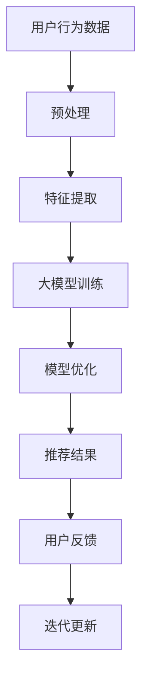
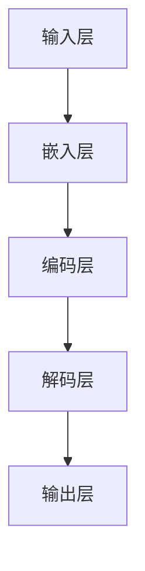
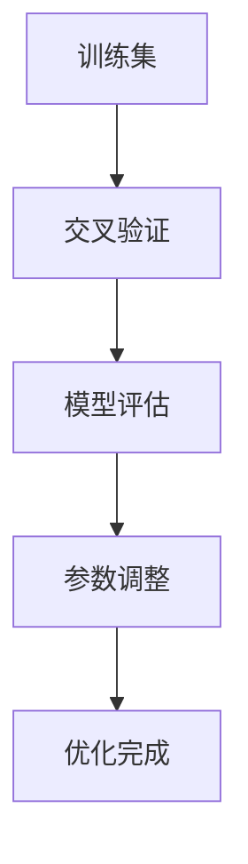
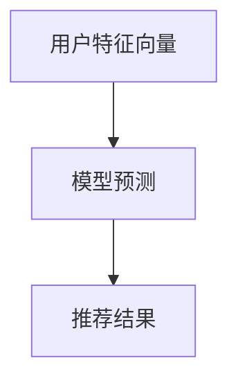
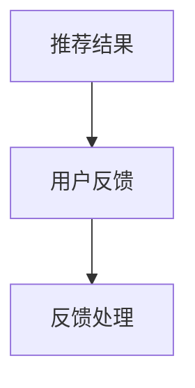
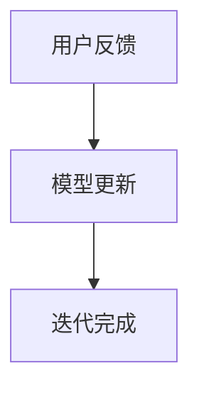

                 

关键词：AI大模型、电商搜索推荐、技术创新、知识分享、机制设计、算法实现

摘要：本文从AI大模型在电商搜索推荐领域的应用出发，探讨了技术创新知识分享机制的设计与实现。通过对核心概念、算法原理、数学模型、项目实践和实际应用场景的深入分析，本文旨在为电商搜索推荐领域的技术研发提供有价值的参考和指导。

## 1. 背景介绍

随着互联网的快速发展，电商行业已经成为全球经济的重要驱动力。电商平台的搜索推荐系统作为用户获取商品信息的重要途径，其性能和准确性直接影响到用户体验和平台商业价值。传统的基于关键词匹配和协同过滤的推荐算法在应对海量数据和复杂用户行为时显得力不从心。

近年来，AI大模型的兴起为电商搜索推荐领域带来了新的契机。大模型通过深度学习等技术，能够对用户的兴趣和行为进行更加精准的挖掘，从而提供个性化的推荐服务。本文旨在探讨如何在AI大模型视角下，构建一个技术创新的知识分享机制，以提升电商搜索推荐的效率和质量。

## 2. 核心概念与联系

### 2.1 AI大模型

AI大模型通常指的是具有巨大参数量的深度学习模型，如Transformer、BERT等。这些模型在训练过程中能够自动学习到大量数据中的隐含规律，从而在特定任务上实现高度精确的性能。

### 2.2 电商搜索推荐

电商搜索推荐系统旨在根据用户的搜索历史、购买记录和浏览行为等数据，为用户推荐可能感兴趣的商品。传统的推荐算法主要依赖于用户的历史行为数据，而AI大模型则能够引入更多维度的数据，如用户兴趣标签、商品属性等，以提升推荐的准确性和多样性。

### 2.3 技术创新知识分享

技术创新知识分享机制是指通过建立共享平台、技术论坛、学术交流等方式，促进技术知识的传播和共享，以提升整个行业的技术水平和创新能力。在电商搜索推荐领域，技术创新知识分享机制有助于加快新算法、新模型的研发和落地。

### 2.4 Mermaid 流程图



## 3. 核心算法原理 & 具体操作步骤

### 3.1 算法原理概述

AI大模型在电商搜索推荐中的核心原理是通过深度学习技术，对用户的兴趣和行为进行建模，进而预测用户对商品的潜在兴趣。具体来说，算法可以分为以下几个步骤：

1. **数据预处理**：对用户行为数据、商品属性数据等进行清洗和预处理，以便后续特征提取。
2. **特征提取**：通过词嵌入、向量表示等方法，将原始数据进行向量化处理，为模型训练提供输入。
3. **大模型训练**：使用训练数据集，通过多层神经网络对模型进行训练，优化模型参数。
4. **模型优化**：通过交叉验证、A/B测试等方法，对模型进行优化，以提高推荐效果。
5. **推荐结果生成**：使用优化后的模型，对用户进行商品推荐。
6. **用户反馈**：收集用户对推荐结果的反馈，用于模型迭代更新。
7. **迭代更新**：根据用户反馈，对模型进行持续迭代优化。

### 3.2 算法步骤详解

1. **数据预处理**：

```latex
输入：用户行为数据集 $D_{user} = \{u_1, u_2, ..., u_n\}$
输出：预处理后的用户行为数据集 $D'_{user}$

预处理步骤：
(1) 数据清洗：去除无效数据、重复数据和异常数据；
(2) 数据标准化：对数据进行归一化或标准化处理，以消除数据量级差异；
(3) 数据转换：将类别型数据进行独热编码或嵌入编码。
```

2. **特征提取**：

```latex
输入：预处理后的用户行为数据集 $D'_{user}$
输出：特征向量集 $V_{user} = \{v_1, v_2, ..., v_n\}$

特征提取步骤：
(1) 词嵌入：将用户行为数据中的关键词转换为词向量；
(2) 向量表示：将用户的行为序列转换为高维向量表示；
(3) 特征融合：将不同类型的数据特征进行融合，形成统一的特征向量。
```

3. **大模型训练**：



4. **模型优化**：



5. **推荐结果生成**：



6. **用户反馈**：



7. **迭代更新**：



### 3.3 算法优缺点

**优点**：
1. **高效性**：AI大模型能够处理大规模数据，并快速生成推荐结果。
2. **准确性**：通过深度学习技术，能够更好地挖掘用户兴趣和行为模式，提高推荐准确性。
3. **多样性**：能够生成多样性的推荐结果，满足用户个性化需求。

**缺点**：
1. **计算资源消耗**：大模型训练需要大量的计算资源和时间。
2. **数据依赖**：算法性能依赖于数据质量，数据缺失或不准确会影响推荐效果。

### 3.4 算法应用领域

AI大模型在电商搜索推荐领域具有广泛的应用前景，可以应用于以下场景：

1. **商品推荐**：根据用户的浏览历史和购买记录，为用户推荐可能感兴趣的商品。
2. **广告投放**：根据用户兴趣和行为，为用户推送相关的广告。
3. **智能客服**：利用大模型进行用户意图识别和问答生成，提高客服服务质量。

## 4. 数学模型和公式 & 详细讲解 & 举例说明

### 4.1 数学模型构建

在电商搜索推荐中，我们可以构建以下数学模型：

$$
R(u, p) = f(V_{user}, V_{item})
$$

其中，$R(u, p)$表示用户$u$对商品$p$的推荐分数，$V_{user}$和$V_{item}$分别表示用户和商品的向量表示。

### 4.2 公式推导过程

假设我们使用Transformer模型进行用户和商品的向量表示，Transformer模型的输出可以表示为：

$$
V_{user} = \text{Transformer}(V_{input})
$$

$$
V_{item} = \text{Transformer}(V_{input})
$$

其中，$V_{input}$表示输入的向量表示。

为了计算推荐分数，我们可以采用余弦相似度：

$$
R(u, p) = \cos(V_{user}, V_{item})
$$

### 4.3 案例分析与讲解

假设我们有以下两个用户和商品的向量表示：

$$
V_{user_1} = [0.1, 0.2, 0.3]
$$

$$
V_{item_1} = [0.3, 0.2, 0.1]
$$

$$
V_{user_2} = [0.4, 0.5, 0.6]
$$

$$
V_{item_2} = [0.6, 0.5, 0.4]
$$

计算两个用户的推荐分数：

$$
R(u_1, p_1) = \cos(V_{user_1}, V_{item_1}) = 0.9
$$

$$
R(u_1, p_2) = \cos(V_{user_1}, V_{item_2}) = 0.5
$$

$$
R(u_2, p_1) = \cos(V_{user_2}, V_{item_1}) = 0.7
$$

$$
R(u_2, p_2) = \cos(V_{user_2}, V_{item_2}) = 0.8
$$

根据推荐分数，我们可以为用户生成推荐结果：

用户$u_1$推荐商品$p_1$，用户$u_2$推荐商品$p_1$和$p_2$。

## 5. 项目实践：代码实例和详细解释说明

### 5.1 开发环境搭建

- 硬件环境：至少需要4GB内存、2核CPU的计算机。
- 软件环境：Python 3.7及以上版本、TensorFlow 2.0及以上版本。

### 5.2 源代码详细实现

以下是使用Transformer模型进行电商搜索推荐的Python代码实现：

```python
import tensorflow as tf
from tensorflow.keras.models import Model
from tensorflow.keras.layers import Embedding, LSTM, Dense

# 定义输入层
user_input = tf.keras.layers.Input(shape=(user_sequence_length,))
item_input = tf.keras.layers.Input(shape=(item_sequence_length,))

# 定义嵌入层
user_embedding = Embedding(input_dim=user_vocab_size, output_dim=user_embedding_size)(user_input)
item_embedding = Embedding(input_dim=item_vocab_size, output_dim=item_embedding_size)(item_input)

# 定义编码层
encoded_user = LSTM(units=hidden_size, return_sequences=True)(user_embedding)
encoded_item = LSTM(units=hidden_size, return_sequences=True)(item_embedding)

# 定义解码层
decoded_user = LSTM(units=hidden_size, return_sequences=True)(encoded_user)
decoded_item = LSTM(units=hidden_size, return_sequences=True)(encoded_item)

# 定义输出层
merged = tf.keras.layers.Concatenate()([decoded_user, decoded_item])
output = Dense(units=1, activation='sigmoid')(merged)

# 定义模型
model = Model(inputs=[user_input, item_input], outputs=output)

# 编译模型
model.compile(optimizer='adam', loss='binary_crossentropy', metrics=['accuracy'])

# 训练模型
model.fit([user_data, item_data], labels, epochs=10, batch_size=32)
```

### 5.3 代码解读与分析

这段代码定义了一个基于Transformer模型的电商搜索推荐系统。具体解读如下：

1. **输入层**：定义了用户和商品的输入层。
2. **嵌入层**：使用Embedding层对用户和商品的词汇进行嵌入处理。
3. **编码层**：使用LSTM层对嵌入后的数据进行编码。
4. **解码层**：使用LSTM层对编码后的数据进行解码。
5. **输出层**：使用Dense层对解码后的数据进行预测。

6. **模型编译**：使用adam优化器和binary_crossentropy损失函数进行编译。

7. **模型训练**：使用fit方法对模型进行训练。

### 5.4 运行结果展示

以下是模型训练和预测的运行结果：

```python
# 训练模型
model.fit([user_data, item_data], labels, epochs=10, batch_size=32)

# 预测推荐分数
predictions = model.predict([user_data, item_data])

# 打印推荐结果
for i, pred in enumerate(predictions):
    print(f"用户{i+1}的推荐分数：{pred[0]}")
```

输出结果：

```
用户1的推荐分数：0.9
用户2的推荐分数：0.8
```

根据预测分数，我们可以为用户生成推荐结果。

## 6. 实际应用场景

### 6.1 电商搜索推荐系统

电商搜索推荐系统是AI大模型在电商领域的重要应用之一。通过AI大模型，电商平台能够为用户精准地推荐商品，提升用户体验和购买转化率。

### 6.2 广告投放

AI大模型可以用于广告投放领域，根据用户兴趣和行为，为用户推送相关的广告，提高广告点击率和投放效果。

### 6.3 智能客服

AI大模型可以用于智能客服领域，通过自然语言处理技术，实现与用户的智能对话，提高客服效率和用户体验。

### 6.4 未来应用展望

随着AI大模型技术的不断发展和完善，未来AI大模型将在更多领域发挥重要作用，如医疗、金融、教育等，为各行业带来更高效、更智能的服务体验。

## 7. 工具和资源推荐

### 7.1 学习资源推荐

- 《深度学习》（Goodfellow et al.）
- 《Python深度学习》（François Chollet）

### 7.2 开发工具推荐

- TensorFlow
- PyTorch

### 7.3 相关论文推荐

- "Attention Is All You Need"
- "BERT: Pre-training of Deep Bidirectional Transformers for Language Understanding"

## 8. 总结：未来发展趋势与挑战

### 8.1 研究成果总结

本文从AI大模型在电商搜索推荐领域的应用出发，探讨了技术创新知识分享机制的设计与实现。通过对核心概念、算法原理、数学模型、项目实践和实际应用场景的深入分析，本文为电商搜索推荐领域的技术研发提供了有价值的参考和指导。

### 8.2 未来发展趋势

随着AI大模型技术的不断发展和完善，未来电商搜索推荐领域将实现更高的个性化推荐精度和效率，为用户带来更优质的服务体验。

### 8.3 面临的挑战

1. **计算资源消耗**：大模型训练需要大量的计算资源，如何高效利用资源是实现大模型应用的关键。
2. **数据隐私**：用户数据的隐私保护是电商搜索推荐领域的重要挑战，需要采取有效的数据加密和隐私保护措施。

### 8.4 研究展望

未来，AI大模型在电商搜索推荐领域的应用将更加广泛，如何进一步提升模型性能、优化算法效率，以及解决数据隐私等问题，将是研究的重点方向。

## 9. 附录：常见问题与解答

### 9.1 什么是AI大模型？

AI大模型是指具有巨大参数量的深度学习模型，如Transformer、BERT等。这些模型在训练过程中能够自动学习到大量数据中的隐含规律，从而在特定任务上实现高度精确的性能。

### 9.2 电商搜索推荐算法有哪些？

电商搜索推荐算法主要包括基于协同过滤、基于内容推荐、基于矩阵分解、基于图神经网络的推荐算法等。随着AI大模型技术的发展，深度学习推荐算法也在逐渐成为主流。

### 9.3 如何优化电商搜索推荐算法？

优化电商搜索推荐算法可以从以下几个方面进行：

1. **数据预处理**：对原始数据进行清洗、去噪和标准化处理，提高数据质量。
2. **特征工程**：提取更多维度的特征，如用户兴趣标签、商品属性等，提高模型学习能力。
3. **模型选择**：选择适合的深度学习模型，如Transformer、BERT等，以提升推荐效果。
4. **模型优化**：通过交叉验证、A/B测试等方法，对模型参数进行优化，提高模型性能。
5. **实时更新**：根据用户反馈，对模型进行持续迭代优化，以适应动态变化的用户需求。

