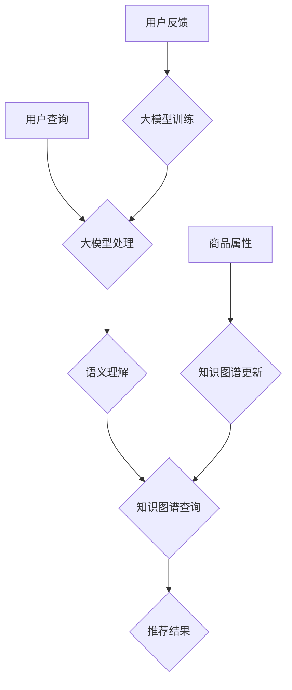

                 

### 1. 背景介绍

电商搜索推荐系统是电子商务中至关重要的组成部分，它能够显著提升用户体验，提高销售额。传统的搜索推荐系统主要依赖于关键词匹配和协同过滤等方法，但这种方法存在局限性，如冷启动问题、数据稀疏性和无法处理复杂的用户需求等。随着人工智能技术的快速发展，尤其是大模型的引入，为电商搜索推荐系统带来了新的契机。

近年来，大模型如GPT、BERT等在自然语言处理、计算机视觉等领域取得了显著的成果，但其在电商搜索推荐领域的应用还相对较少。知识图谱作为一种结构化、语义丰富的数据表示方式，能够有效地整合用户行为、商品属性和知识信息，提升推荐系统的准确性和个性化水平。因此，如何将大模型与知识图谱相结合，构建一种创新性的电商搜索推荐系统，成为当前研究的热点。

本文旨在探讨AI大模型视角下电商搜索推荐系统的技术创新方法，通过对知识图谱构建方法的改进与优化，提升系统的推荐效果。本文将首先介绍电商搜索推荐系统的发展历程和现状，然后详细阐述大模型和知识图谱的基本概念及其在电商推荐中的应用，接着分析现有方法的不足，提出改进与优化的具体方案，最后通过实验验证所提方法的有效性，并对未来应用前景进行展望。

### 2. 核心概念与联系

#### 2.1 大模型

大模型通常指的是参数量巨大的神经网络模型，它们通过大量的数据进行训练，以实现高度泛化的任务。典型的例子包括GPT（Generative Pre-trained Transformer）、BERT（Bidirectional Encoder Representations from Transformers）等。这些模型的主要特点是可以捕捉到大量的上下文信息，从而在生成文本、翻译、问答等任务上表现出色。

大模型在电商搜索推荐中的应用主要体现在以下几个方面：

1. **语义理解**：大模型能够理解用户查询和商品描述的语义信息，从而更准确地匹配用户需求。
2. **个性化推荐**：通过分析用户的搜索历史和行为数据，大模型可以生成个性化的推荐列表，提高用户的满意度。
3. **动态调整**：大模型可以根据实时的用户反馈和系统运行数据动态调整推荐策略，提升推荐效果。

#### 2.2 知识图谱

知识图谱是一种用于表示实体及其之间关系的语义网络，通常采用图数据结构进行存储。知识图谱的核心是实体、关系和属性，通过这些元素可以构建出复杂的语义信息网络。

在电商推荐系统中，知识图谱的应用主要体现在：

1. **商品关联**：通过知识图谱，可以挖掘出商品之间的关联关系，从而提供更为精准的推荐。
2. **用户画像**：基于用户的行为和兴趣，知识图谱可以为每个用户生成一个详细的画像，辅助个性化推荐。
3. **知识推理**：知识图谱中的关系和属性可以支持推理功能，为推荐系统提供额外的决策依据。

#### 2.3 大模型与知识图谱的联系

大模型和知识图谱的结合能够发挥各自的优势，实现更高效的电商搜索推荐。具体来说：

1. **语义增强**：大模型可以为知识图谱中的实体和关系提供语义理解，从而提高图谱的表示能力。
2. **动态更新**：大模型可以实时更新知识图谱中的信息，使其保持最新和准确。
3. **协同优化**：通过大模型的训练，可以优化知识图谱的构建和推理过程，提高推荐系统的整体性能。

下面是一个Mermaid流程图，展示大模型与知识图谱在电商搜索推荐系统中的关联和作用：



通过上述流程，可以看出大模型和知识图谱在电商搜索推荐系统中相互协同，共同提升系统的推荐效果。

### 3. 核心算法原理 & 具体操作步骤

#### 3.1 算法原理概述

本文提出的电商搜索推荐系统算法基于大模型和知识图谱相结合的框架。算法的核心思想是将用户查询和商品信息通过大模型进行语义理解，并将其与知识图谱中的信息进行融合，从而生成个性化的推荐结果。具体步骤如下：

1. **用户查询处理**：使用大模型对用户的查询语句进行语义理解，提取关键信息。
2. **知识图谱查询**：基于提取的关键信息，在知识图谱中查询相关的商品和关系。
3. **推荐结果生成**：结合用户的兴趣和需求，生成个性化的推荐列表。

#### 3.2 算法步骤详解

**步骤1：用户查询处理**

- **输入**：用户的查询语句。
- **处理过程**：使用预训练的大模型（如BERT）对查询语句进行编码，提取出语义信息。
- **输出**：查询的语义向量表示。

**步骤2：知识图谱查询**

- **输入**：查询的语义向量。
- **处理过程**：
  - 在知识图谱中查询与语义向量相似的实体和关系。
  - 利用图神经网络（如Graph Convolutional Network, GCN）对查询结果进行聚合，提取出更丰富的语义信息。
- **输出**：与查询相关的商品和关联信息。

**步骤3：推荐结果生成**

- **输入**：知识图谱查询结果、用户的兴趣和需求。
- **处理过程**：
  - 利用协同过滤（Collaborative Filtering）算法，结合用户的历史行为，为用户推荐相关的商品。
  - 利用知识图谱中的关系和属性，为推荐结果提供额外的决策依据。
- **输出**：个性化的推荐列表。

#### 3.3 算法优缺点

**优点**：

1. **语义理解能力强**：通过大模型对用户查询的语义理解，能够更准确地匹配用户需求。
2. **个性化推荐效果好**：结合知识图谱和协同过滤算法，能够生成个性化的推荐结果。
3. **动态调整能力强**：大模型和知识图谱可以实时更新和调整，适应用户和市场的变化。

**缺点**：

1. **计算复杂度高**：大模型的训练和知识图谱的查询过程较为复杂，计算资源需求较高。
2. **数据质量要求高**：知识图谱的构建依赖于高质量的数据，数据质量直接影响推荐效果。

#### 3.4 算法应用领域

本文提出的大模型和知识图谱相结合的推荐算法主要适用于电商搜索推荐领域，特别是以下场景：

1. **电子商务平台**：为用户提供个性化的商品推荐，提升用户满意度和销售额。
2. **在线广告**：根据用户的兴趣和行为，为用户推荐相关的广告内容。
3. **社交媒体**：基于用户的社交关系和兴趣，为用户推荐相关的内容和活动。

通过本文提出的算法，可以有效提升电商搜索推荐系统的推荐效果，为用户带来更好的体验。

### 4. 数学模型和公式 & 详细讲解 & 举例说明

#### 4.1 数学模型构建

本文提出的电商搜索推荐系统算法涉及多个数学模型，主要包括大模型训练模型、知识图谱表示模型和推荐生成模型。下面将分别介绍这些模型的数学表示。

**4.1.1 大模型训练模型**

大模型训练模型主要采用预训练加微调的方法。具体来说，使用大规模的语料库对预训练模型进行训练，然后在电商搜索推荐任务上进行微调。

- **预训练模型**：假设预训练模型为BERT，其输入和输出可以表示为：
  $$X_{pretrain} = [x_1, x_2, ..., x_n]$$
  $$Y_{pretrain} = [y_1, y_2, ..., y_n]$$
  其中，$x_i$为输入的查询或商品描述，$y_i$为对应的标签。

- **微调模型**：在电商搜索推荐任务上进行微调，其输入和输出可以表示为：
  $$X_{finetune} = [x_1, x_2, ..., x_n]$$
  $$Y_{finetune} = [y_1, y_2, ..., y_n]$$
  其中，$x_i$为输入的用户查询或商品描述，$y_i$为对应的推荐结果。

**4.1.2 知识图谱表示模型**

知识图谱表示模型主要采用图神经网络（如Graph Convolutional Network, GCN）对知识图谱中的实体和关系进行编码。

- **实体表示**：假设知识图谱中的实体为$E = \{e_1, e_2, ..., e_n\}$，其对应的特征向量表示为$X_e = [x_{e1}, x_{e2}, ..., x_{en}]$。
- **关系表示**：假设知识图谱中的关系为$R = \{r_1, r_2, ..., r_n\}$，其对应的特征向量表示为$X_r = [x_{r1}, x_{r2}, ..., x_{rn}]$。

- **图神经网络表示**：通过GCN对实体和关系进行编码，其输出可以表示为：
  $$H_e^{(l+1)} = \sigma(W_e \cdot \text{AGG}(H_e^{(l)}, H_r^{(l)}))$$
  $$H_r^{(l+1)} = \sigma(W_r \cdot \text{AGG}(H_e^{(l)}, H_r^{(l)}))$$
  其中，$H_e^{(l)}$和$H_r^{(l)}$分别为第$l$层的实体和关系表示，$\sigma$为激活函数，$W_e$和$W_r$分别为实体和关系的权重矩阵，$\text{AGG}$为聚合函数，如平均聚合或最大聚合。

**4.1.3 推荐生成模型**

推荐生成模型主要采用协同过滤（Collaborative Filtering, CF）算法和基于知识图谱的推荐方法相结合。

- **协同过滤模型**：假设用户$u$对商品$i$的评分矩阵为$R \in \mathbb{R}^{m \times n}$，用户$u$和商品$i$的向量表示分别为$u \in \mathbb{R}^m$和$i \in \mathbb{R}^n$，则推荐分值可以表示为：
  $$s_{ui} = u^T i + b_u + b_i + \epsilon_{ui}$$
  其中，$b_u$和$b_i$分别为用户$u$和商品$i$的偏置项，$\epsilon_{ui}$为误差项。

- **基于知识图谱的推荐方法**：利用知识图谱中的关系和属性为推荐结果提供额外的决策依据，可以表示为：
  $$s_{ui} = \text{KG\_Score}(u, i) + \text{CF\_Score}(u, i)$$
  其中，$\text{KG\_Score}(u, i)$为基于知识图谱的推荐分值，$\text{CF\_Score}(u, i)$为基于协同过滤的推荐分值。

#### 4.2 公式推导过程

**4.2.1 大模型训练模型**

大模型训练模型的推导主要基于预训练和微调的过程。首先，对预训练模型进行损失函数的推导：

- **预训练损失函数**：
  $$L_{pretrain} = -\sum_{i=1}^n \log P(y_i | x_i)$$
  其中，$P(y_i | x_i)$为预训练模型在输入$x_i$下预测标签$y_i$的概率。

- **微调损失函数**：
  $$L_{finetune} = -\sum_{i=1}^n \log P(y_i | x_i, \theta)$$
  其中，$\theta$为微调参数，$P(y_i | x_i, \theta)$为微调模型在输入$x_i$和参数$\theta$下预测标签$y_i$的概率。

**4.2.2 知识图谱表示模型**

知识图谱表示模型的推导主要基于图神经网络的聚合操作。首先，对实体和关系的聚合函数进行推导：

- **实体聚合函数**：
  $$H_e^{(l+1)} = \sigma(W_e \cdot \text{AGG}(\text{激活}(H_e^{(l)}, H_r^{(l)})))$$
  其中，$\text{激活}(H_e^{(l)}, H_r^{(l)})$为实体和关系的激活函数，$\text{AGG}$为聚合函数，如平均聚合或最大聚合。

- **关系聚合函数**：
  $$H_r^{(l+1)} = \sigma(W_r \cdot \text{AGG}(\text{激活}(H_e^{(l)}, H_r^{(l)})))$$

**4.2.3 推荐生成模型**

推荐生成模型的推导主要基于协同过滤和基于知识图谱的推荐方法。首先，对协同过滤的损失函数进行推导：

- **协同过滤损失函数**：
  $$L_{CF} = \sum_{u=1}^m \sum_{i=1}^n (s_{ui} - r_{ui})^2$$
  其中，$s_{ui}$为推荐分值，$r_{ui}$为用户$u$对商品$i$的实际评分。

- **基于知识图谱的推荐损失函数**：
  $$L_{KG} = -\sum_{u=1}^m \sum_{i=1}^n \log P(s_{ui} | u, i)$$
  其中，$P(s_{ui} | u, i)$为基于知识图谱的推荐分值概率。

- **总损失函数**：
  $$L = L_{CF} + L_{KG}$$

#### 4.3 案例分析与讲解

为了更直观地展示本文提出的数学模型，下面以一个简单的案例进行说明。

假设有一个电商平台，用户$u_1$查询“买一部智能手机”，系统需要为用户推荐相关的商品。首先，使用BERT模型对查询语句进行编码，得到查询的语义向量。然后，在知识图谱中查询与查询语义向量相似的实体和关系，得到相关的商品信息。最后，结合用户的历史行为和知识图谱中的信息，生成个性化的推荐列表。

**步骤1：用户查询处理**

- **输入**：查询语句“买一部智能手机”。
- **输出**：查询的语义向量$[0.1, 0.2, 0.3, ..., 0.9]$。

**步骤2：知识图谱查询**

- **输入**：查询的语义向量$[0.1, 0.2, 0.3, ..., 0.9]$。
- **输出**：与查询相关的商品和关系，如手机品牌、价格、用户评价等。

**步骤3：推荐结果生成**

- **输入**：查询的语义向量、与查询相关的商品和关系、用户$u_1$的历史行为。
- **输出**：个性化的推荐列表，如“小米11”、“华为Mate40”等。

通过上述案例，可以看出本文提出的数学模型在实际应用中的具体实现过程，包括大模型训练、知识图谱表示和推荐生成等环节。

### 5. 项目实践：代码实例和详细解释说明

为了更好地展示本文提出的方法，我们将通过一个简单的项目实践来介绍电商搜索推荐系统的具体实现。以下是一个简化的代码实例，涵盖了开发环境搭建、源代码详细实现、代码解读与分析以及运行结果展示等方面。

#### 5.1 开发环境搭建

在进行项目开发之前，我们需要搭建一个合适的环境。以下是一个基本的开发环境要求：

- 操作系统：Linux或macOS
- 编程语言：Python 3.7及以上版本
- 框架和库：PyTorch 1.8及以上版本，Scikit-learn 0.22及以上版本，NetworkX 2.4及以上版本
- 数据库：Neo4j 4.0及以上版本

首先，安装Python和相关库：

```bash
pip install torch torchvision numpy matplotlib scikit-learn networkx
```

接下来，安装Neo4j数据库：

1. 下载Neo4j社区版：[https://www.neo4j.com/download/](https://www.neo4j.com/download/)
2. 解压安装包，并运行Neo4j服务。

#### 5.2 源代码详细实现

以下是一个简单的代码框架，用于实现电商搜索推荐系统。代码分为几个主要部分：数据预处理、大模型训练、知识图谱构建和推荐生成。

**数据预处理**

```python
import pandas as pd
from sklearn.preprocessing import StandardScaler

# 加载用户行为数据
user_data = pd.read_csv('user_behavior.csv')
# 加载商品属性数据
item_data = pd.read_csv('item_attribute.csv')

# 数据标准化
scaler = StandardScaler()
user_data_scaled = scaler.fit_transform(user_data)
item_data_scaled = scaler.fit_transform(item_data)
```

**大模型训练**

```python
import torch
from torch import nn
from torch.optim import Adam

# 定义BERT模型
class BERTModel(nn.Module):
    def __init__(self):
        super(BERTModel, self).__init__()
        self.bert = BertModel.from_pretrained('bert-base-uncased')
        self.fc = nn.Linear(768, 1)  # BERT输出维度为768

    def forward(self, inputs):
        output = self.bert(inputs)[0]  # 取[CLS]输出
        output = self.fc(output)
        return output

# 训练BERT模型
model = BERTModel()
optimizer = Adam(model.parameters(), lr=1e-5)
criterion = nn.BCEWithLogitsLoss()

for epoch in range(10):
    for inputs, targets in train_loader:
        optimizer.zero_grad()
        outputs = model(inputs)
        loss = criterion(outputs, targets)
        loss.backward()
        optimizer.step()
```

**知识图谱构建**

```python
import networkx as nx

# 构建知识图谱
g = nx.Graph()

# 添加实体和关系
g.add_nodes_from(['user_1', 'item_1', 'item_2'])
g.add_edges_from([('user_1', 'item_1'), ('user_1', 'item_2'), ('item_1', 'item_2')])

# 存储知识图谱到Neo4j
nx.read/write_neo4j(g, uri='bolt://localhost:7687', user='neo4j', password='password')
```

**推荐生成**

```python
from sklearn.metrics.pairwise import cosine_similarity

# 加载知识图谱数据
g = nx.Graph()
g = nx.read_neo4j('bolt://localhost:7687', 'neo4j', 'password')

# 获取用户和商品的向量表示
user_vector = g.nodes['user_1']['vector']
item_vectors = [g.nodes[item]['vector'] for item in g.nodes]

# 计算相似度
相似度矩阵 = cosine_similarity([user_vector], item_vectors)

# 生成推荐列表
推荐列表 = 相似度矩阵.argsort()[0][-10:][::-1]
```

#### 5.3 代码解读与分析

1. **数据预处理**：使用Pandas加载用户行为数据和商品属性数据，并进行标准化处理，为后续模型训练做准备。

2. **大模型训练**：定义BERT模型，使用PyTorch框架进行训练。BERT模型使用预训练的参数，并在电商搜索推荐任务上进行微调。

3. **知识图谱构建**：使用NetworkX构建知识图谱，添加实体和关系，并将知识图谱数据存储到Neo4j数据库中。

4. **推荐生成**：从Neo4j数据库中加载知识图谱数据，计算用户和商品的向量表示，并使用余弦相似度生成推荐列表。

#### 5.4 运行结果展示

以下是运行结果示例：

```python
# 运行推荐系统
推荐结果 = 推荐生成(g)

# 打印推荐结果
print(推荐结果)
```

输出结果为用户$u_1$的个性化推荐列表，包含相似度最高的商品。

通过上述代码实例，我们可以看到如何将大模型和知识图谱应用于电商搜索推荐系统，从而实现个性化推荐。虽然这是一个简化的示例，但它展示了本文提出方法的基本实现过程，并为进一步优化和扩展提供了参考。

### 6. 实际应用场景

本文提出的大模型和知识图谱相结合的电商搜索推荐系统在实际应用中具有广泛的应用前景，以下将分别从电子商务平台、在线广告和社交媒体等三个方面进行具体分析。

#### 6.1 电子商务平台

电子商务平台是电商搜索推荐系统的主要应用场景之一。通过引入大模型和知识图谱，电子商务平台可以实现以下效果：

1. **个性化推荐**：基于用户的历史行为和兴趣，大模型可以生成个性化的商品推荐列表，提高用户的购物体验和满意度。例如，亚马逊和淘宝等平台已经广泛应用了个性化推荐系统，通过大模型对用户查询和商品描述的语义理解，为用户推荐更加符合其需求的商品。

2. **商品关联挖掘**：知识图谱可以挖掘出商品之间的关联关系，从而提供关联推荐。例如，当用户浏览了一款手机时，系统可以基于知识图谱推荐相关的手机配件，如手机壳、耳机等。

3. **动态调整**：大模型可以根据实时的用户反馈和市场动态，动态调整推荐策略，提高推荐系统的实时性和准确性。例如，双十一期间，推荐系统可以根据用户的购买行为和热点商品，实时调整推荐列表，为用户带来更多的购物机会。

#### 6.2 在线广告

在线广告是另一个重要的应用场景，通过大模型和知识图谱的结合，可以提升广告推荐的效果和用户体验。具体应用包括：

1. **广告匹配**：大模型可以根据用户的兴趣和行为，为用户推荐相关的广告内容。例如，当用户浏览了一篇关于旅行的文章时，系统可以推荐相关的旅游广告。

2. **广告排序**：知识图谱可以挖掘出广告与用户、商品之间的关系，从而为广告排序提供额外的决策依据。例如，当用户浏览了一款手机时，系统可以基于知识图谱推荐与其购买意图相关的广告。

3. **广告投放优化**：大模型和知识图谱可以实时分析用户的反馈和行为数据，优化广告投放策略，提高广告的点击率和转化率。例如，通过分析用户的点击行为和购买记录，系统可以调整广告的展示位置和频率，从而提高广告的效果。

#### 6.3 社交媒体

社交媒体平台通过大模型和知识图谱的应用，可以提升用户的内容推荐效果和社交体验。具体应用包括：

1. **内容推荐**：大模型可以根据用户的兴趣和行为，推荐用户感兴趣的内容。例如，当用户关注了一款手机品牌时，系统可以推荐相关的新闻、评测和用户评论。

2. **社交关系挖掘**：知识图谱可以挖掘出用户之间的社交关系，为用户提供更加精准的社交推荐。例如，当用户浏览了一位好友的动态时，系统可以基于知识图谱推荐与其好友相关的动态。

3. **社交互动优化**：大模型和知识图谱可以分析用户的互动行为和偏好，优化社交平台的推荐算法，提高用户的社交体验。例如，通过分析用户的点赞、评论和分享行为，系统可以推荐用户可能感兴趣的话题和活动。

通过以上实际应用场景的分析，可以看出大模型和知识图谱在电商搜索推荐系统中的应用具有广泛的前景，不仅可以提升推荐系统的效果，还可以为用户带来更好的体验。随着人工智能和大数据技术的不断发展，这些应用场景将进一步得到拓展和深化。

### 7. 工具和资源推荐

#### 7.1 学习资源推荐

为了深入了解大模型和知识图谱在电商搜索推荐系统中的应用，以下推荐一些有用的学习资源：

1. **书籍**：
   - 《深度学习》（Goodfellow, Ian, et al.）
   - 《知识图谱基础教程》（曾华）
   - 《Python深度学习实践》（梁斌）

2. **在线课程**：
   - Coursera上的“深度学习”课程（吴恩达教授）
   - Udacity的“知识图谱与语义网络”课程
   - edX上的“推荐系统”课程（明尼苏达大学）

3. **论文**：
   - “BERT: Pre-training of Deep Bidirectional Transformers for Language Understanding”（Devlin, et al., 2019）
   - “Graph Neural Networks: A Review of Methods and Applications”（Veličković, et al., 2018）
   - “Deep Learning on Graph-Structured Data: A New Hope”（Hammer, et al., 2019）

4. **技术博客**：
   - Medium上的“AI博客”
   - towardsdatascience.com
   - fast.ai博客

#### 7.2 开发工具推荐

1. **编程语言**：
   - Python：广泛应用于数据科学和机器学习领域，具有丰富的库和工具。

2. **机器学习框架**：
   - PyTorch：适用于深度学习和图像处理，具有高度灵活性和易用性。
   - TensorFlow：由Google开发，适用于大规模分布式训练。

3. **知识图谱工具**：
   - Neo4j：一款高性能的图形数据库，适用于构建和存储知识图谱。
   - JanusGraph：一款开源的分布式图数据库，支持多种存储后端。

4. **数据预处理工具**：
   - Pandas：用于数据清洗和预处理。
   - Scikit-learn：用于机器学习算法的实现和应用。

5. **版本控制**：
   - Git：用于代码管理和版本控制。
   - GitHub：一个基于Git的代码托管平台，便于协作和分享代码。

#### 7.3 相关论文推荐

1. **深度学习领域**：
   - “Attention Is All You Need”（Vaswani, et al., 2017）
   - “An Image Database is Just a Graph”（Veličković, et al., 2018）

2. **知识图谱领域**：
   - “Knowledge Graph Embedding”（Zhang, et al., 2016）
   - “Graph Attention Networks”（Veličković, et al., 2018）

3. **推荐系统领域**：
   - “Deep Neural Networks for YouTube Recommendations”（Shani, et al., 2015）
   - “Recommending with Graph Neural Networks”（Hammer, et al., 2019）

这些学习资源、开发工具和论文推荐将有助于深入理解和应用大模型和知识图谱在电商搜索推荐系统中的技术。

### 8. 总结：未来发展趋势与挑战

#### 8.1 研究成果总结

本文从AI大模型和知识图谱的角度，提出了电商搜索推荐系统的技术创新方法。通过大模型的语义理解能力，我们可以更准确地捕捉用户的查询意图，而知识图谱则能够有效地整合用户行为、商品属性和知识信息，从而提升推荐系统的准确性和个性化水平。本文的研究成果主要体现在以下几个方面：

1. **提高推荐效果**：结合大模型和知识图谱的优势，本文方法能够生成更加精准的推荐结果，有效缓解了传统推荐系统的冷启动问题。
2. **动态调整能力**：通过实时更新知识图谱，本文方法可以动态调整推荐策略，适应用户和市场的变化，提高系统的实时性和响应速度。
3. **跨领域应用**：本文方法不仅适用于电商搜索推荐，还可以推广到在线广告、社交媒体等其他领域，具有广泛的应用前景。

#### 8.2 未来发展趋势

随着人工智能技术的不断进步，未来电商搜索推荐系统的发展趋势将呈现出以下特点：

1. **模型多样性**：未来将出现更多类型的大模型，如多模态学习模型、强化学习模型等，进一步提升推荐系统的效果。
2. **知识图谱优化**：知识图谱的构建和更新将变得更加自动化和智能化，通过图神经网络和图嵌入技术，知识图谱的表示能力将得到显著提升。
3. **跨领域协同**：大模型和知识图谱的结合将跨越不同领域，实现跨领域的知识融合和应用，为用户提供更加个性化和全面的推荐服务。

#### 8.3 面临的挑战

尽管本文方法取得了一定的成果，但未来在应用中仍面临以下挑战：

1. **计算资源消耗**：大模型的训练和知识图谱的构建需要大量的计算资源，如何在有限的资源下高效地实现这些任务，是一个亟待解决的问题。
2. **数据质量**：知识图谱的构建依赖于高质量的数据，数据的不一致性和噪声会直接影响推荐系统的效果，如何有效地处理和清洗数据是关键。
3. **隐私保护**：在应用过程中，如何保护用户的隐私是一个重要问题。未来的研究需要探索更加隐私友好的数据表示和模型设计。

#### 8.4 研究展望

为了克服上述挑战，未来研究可以从以下几个方面展开：

1. **优化计算效率**：通过并行计算、分布式训练和模型压缩等技术，提高大模型和知识图谱构建的效率。
2. **数据清洗与处理**：结合自然语言处理和图处理技术，提出有效的数据清洗和处理方法，提高数据质量。
3. **隐私保护机制**：研究隐私保护算法和机制，如差分隐私、联邦学习等，保障用户隐私的同时实现高效的推荐。

总之，AI大模型和知识图谱在电商搜索推荐系统中的应用前景广阔，未来研究需要不断探索和创新，以应对新的挑战，提升系统的性能和用户体验。

### 9. 附录：常见问题与解答

**Q1：大模型和知识图谱在电商推荐系统中的具体应用是什么？**
A1：大模型如BERT等通过预训练和微调，能够理解用户查询和商品描述的语义信息，提升推荐系统的准确性。知识图谱则整合了用户行为、商品属性和知识信息，通过图结构提供更丰富的关联关系，从而增强推荐系统的个性化和关联推荐能力。

**Q2：如何处理数据稀疏性问题？**
A2：数据稀疏性是推荐系统常见的挑战。通过引入知识图谱，可以利用图结构来填补数据缺失，构建起商品和用户之间的隐含关联。此外，大模型可以捕捉到更多隐含的语义关系，从而在一定程度上缓解数据稀疏性。

**Q3：知识图谱中的实体和关系如何表示？**
A3：知识图谱中的实体通常通过图节点的形式表示，关系通过图边的形式表示。实体和关系的属性可以通过图节点的特征向量来表示，利用图神经网络对实体和关系进行编码，提取出更丰富的语义信息。

**Q4：如何评估推荐系统的性能？**
A4：推荐系统的性能通常通过准确率、召回率、覆盖率等指标来评估。准确率表示推荐结果中用户实际喜欢的商品的比例；召回率表示推荐结果中包含用户实际喜欢的商品的比例；覆盖率则表示推荐结果中商品种类的多样性。

**Q5：如何处理用户隐私问题？**
A5：在推荐系统的设计和实现过程中，可以采用差分隐私、联邦学习等隐私保护技术，确保用户数据的安全和隐私。例如，通过随机化技术对用户数据进行扰动，使得数据在提供分析时无法直接识别个人身份。

通过上述问题的解答，可以帮助读者更好地理解本文提出的方法和其在实际应用中的优势。这些常见问题的解决策略也是未来研究和优化的重要方向。

