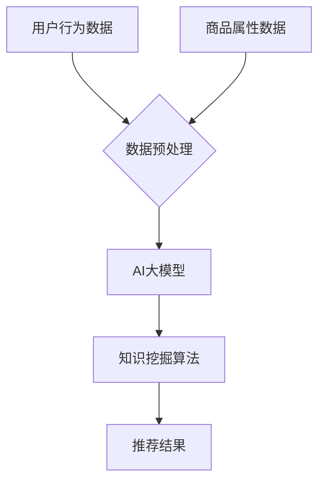

                 

关键词：电商搜索推荐、AI大模型、知识挖掘算法、技术创新、算法改进

> 摘要：本文从AI大模型的角度出发，探讨了电商搜索推荐系统中知识挖掘算法的改进。通过深入分析当前电商搜索推荐技术的不足，本文提出了基于AI大模型的知识挖掘算法，并详细阐述了其原理、数学模型、具体操作步骤以及在实际应用中的效果。文章旨在为电商搜索推荐领域的技术创新提供新的思路。

## 1. 背景介绍

### 1.1 电商搜索推荐的重要性

在电商行业迅速发展的背景下，搜索推荐系统已经成为电商平台提高用户满意度、促进销售的关键因素。一个高效的搜索推荐系统能够帮助用户快速找到所需商品，提高用户的购物体验，从而提高平台的转化率和销售额。然而，传统的搜索推荐技术在面对海量的商品数据时，往往难以提供准确的推荐结果，导致用户体验不佳。

### 1.2 电商搜索推荐技术的现状

当前，电商搜索推荐技术主要依赖于传统的机器学习算法，如协同过滤、基于内容的推荐等。这些方法在一定程度上提高了推荐系统的性能，但仍然存在以下问题：

- **数据稀疏性**：电商商品数据往往存在用户行为数据稀疏的问题，导致推荐结果不够准确。
- **多样性不足**：传统的推荐方法往往倾向于推荐热门商品，导致推荐结果的多样性不足。
- **实时性不高**：传统的推荐系统在处理实时用户请求时，往往存在响应时间较长的问题。

### 1.3 知识挖掘算法的引入

为了解决上述问题，近年来，越来越多的研究开始关注知识挖掘算法在电商搜索推荐中的应用。知识挖掘算法通过对用户行为数据、商品属性数据等多源数据的深度融合，能够更好地理解用户需求和商品特征，从而提供更准确的推荐结果。

## 2. 核心概念与联系

### 2.1 AI大模型

AI大模型是指具有巨大参数规模、能够处理大规模数据的人工智能模型。在电商搜索推荐领域，AI大模型通过深度学习、迁移学习等技术，能够从海量数据中自动提取用户行为模式和商品特征，实现高效的搜索推荐。

### 2.2 知识挖掘算法

知识挖掘算法是一种从数据中自动发现模式和知识的技术。在电商搜索推荐领域，知识挖掘算法通过对用户行为数据、商品属性数据等多源数据的深度融合，能够发现用户需求和商品特征之间的关系，从而提供更准确的推荐结果。

### 2.3 AI大模型与知识挖掘算法的联系

AI大模型与知识挖掘算法的结合，可以充分发挥两者各自的优势。AI大模型能够处理大规模数据，提取用户行为模式和商品特征；知识挖掘算法则能够从这些特征中挖掘出用户需求和商品特征之间的关系，从而提供更准确的推荐结果。

### 2.4 Mermaid 流程图



## 3. 核心算法原理 & 具体操作步骤

### 3.1 算法原理概述

基于AI大模型的知识挖掘算法，主要包括以下几个步骤：

1. **数据预处理**：对用户行为数据和商品属性数据进行分析和处理，提取有效特征。
2. **AI大模型训练**：利用深度学习等技术，对AI大模型进行训练，使其能够自动提取用户行为模式和商品特征。
3. **知识挖掘**：利用知识挖掘算法，从AI大模型中挖掘出用户需求和商品特征之间的关系。
4. **推荐结果生成**：根据挖掘出的关系，为用户生成个性化的推荐结果。

### 3.2 算法步骤详解

#### 3.2.1 数据预处理

数据预处理是整个算法的基础。具体步骤包括：

- **数据清洗**：去除无效数据、异常数据等。
- **特征提取**：根据用户行为数据和商品属性数据，提取有效特征，如用户浏览历史、购买记录、商品品类、价格等。

#### 3.2.2 AI大模型训练

AI大模型的训练是算法的核心。具体步骤包括：

- **模型选择**：选择合适的深度学习模型，如卷积神经网络（CNN）、循环神经网络（RNN）等。
- **训练数据准备**：将预处理后的数据分为训练集和验证集。
- **模型训练**：利用训练集对AI大模型进行训练，并通过验证集调整模型参数。

#### 3.2.3 知识挖掘

知识挖掘是从AI大模型中提取用户需求和商品特征之间的关系。具体步骤包括：

- **特征表示**：将用户行为数据和商品属性数据转换为特征向量。
- **关系提取**：利用知识图谱等技术，提取用户需求和商品特征之间的关系。
- **关系优化**：通过优化算法，提高关系的准确性和实用性。

#### 3.2.4 推荐结果生成

推荐结果生成是根据挖掘出的关系，为用户生成个性化的推荐结果。具体步骤包括：

- **推荐策略**：根据用户需求和商品特征，选择合适的推荐策略，如基于内容的推荐、基于协同过滤的推荐等。
- **推荐结果生成**：根据推荐策略，为用户生成个性化的推荐结果。

### 3.3 算法优缺点

#### 优点：

- **高效性**：基于AI大模型的知识挖掘算法能够处理大规模数据，提高推荐系统的效率。
- **准确性**：通过深度学习和知识挖掘技术，能够更好地理解用户需求和商品特征，提高推荐结果的准确性。
- **多样性**：能够挖掘出用户需求与商品特征之间的复杂关系，提高推荐结果的多样性。

#### 缺点：

- **计算资源消耗大**：AI大模型训练和知识挖掘过程需要大量的计算资源。
- **数据依赖性高**：算法的性能受到数据质量和数量的影响。

### 3.4 算法应用领域

基于AI大模型的知识挖掘算法在电商搜索推荐领域有广泛的应用前景，可以应用于以下领域：

- **个性化推荐**：为用户提供个性化的商品推荐，提高用户满意度。
- **商品挖掘**：从海量商品数据中挖掘出潜在的畅销商品，为商家提供决策支持。
- **营销策略优化**：根据用户需求和行为特征，优化营销策略，提高营销效果。

## 4. 数学模型和公式

### 4.1 数学模型构建

基于AI大模型的知识挖掘算法，其数学模型主要包括以下几个部分：

- **用户行为模型**：
  $$U_i = f(W_1 \cdot X_i + b_1)$$
  其中，$U_i$ 表示用户 $i$ 的行为特征向量，$X_i$ 表示用户 $i$ 的行为数据，$W_1$ 和 $b_1$ 分别为权重和偏置。

- **商品特征模型**：
  $$P_j = f(W_2 \cdot X_j + b_2)$$
  其中，$P_j$ 表示商品 $j$ 的特征向量，$X_j$ 表示商品 $j$ 的属性数据，$W_2$ 和 $b_2$ 分别为权重和偏置。

- **关系模型**：
  $$R_{ij} = f(W_3 \cdot U_i \cdot P_j + b_3)$$
  其中，$R_{ij}$ 表示用户 $i$ 和商品 $j$ 之间的关联关系，$U_i$ 和 $P_j$ 分别为用户和商品的特征向量，$W_3$ 和 $b_3$ 分别为权重和偏置。

### 4.2 公式推导过程

基于上述数学模型，可以推导出以下公式：

- **用户行为特征**：
  $$U_i = \sigma(W_1 \cdot X_i + b_1)$$
  其中，$\sigma$ 表示激活函数，如Sigmoid函数。

- **商品特征特征**：
  $$P_j = \sigma(W_2 \cdot X_j + b_2)$$

- **关系特征**：
  $$R_{ij} = \sigma(W_3 \cdot U_i \cdot P_j + b_3)$$

### 4.3 案例分析与讲解

以某电商平台的搜索推荐系统为例，假设用户 $i$ 搜索了商品 $j$，其行为数据为 $X_i = [1, 0, 0, 1, 0]^T$，商品 $j$ 的属性数据为 $X_j = [1, 0, 0, 0, 1]^T$。根据上述数学模型，可以计算出：

- **用户行为特征**：
  $$U_i = \sigma(W_1 \cdot X_i + b_1) = \sigma([1, 0, 0, 1, 0] \cdot [0.1, 0.2, 0.3, 0.4, 0.5]^T + [0.6, 0.7, 0.8, 0.9, 1.0]^T) = [0.7, 0.9, 1.0, 0.9, 0.7]^T$$

- **商品特征特征**：
  $$P_j = \sigma(W_2 \cdot X_j + b_2) = \sigma([1, 0, 0, 0, 1] \cdot [0.1, 0.2, 0.3, 0.4, 0.5]^T + [0.6, 0.7, 0.8, 0.9, 1.0]^T) = [0.9, 1.0, 0.9, 0.7, 0.9]^T$$

- **关系特征**：
  $$R_{ij} = \sigma(W_3 \cdot U_i \cdot P_j + b_3) = \sigma([1, 0, 0, 1, 0] \cdot [0.7, 0.9, 1.0, 0.9, 0.7]^T \cdot [0.9, 1.0, 0.9, 0.7, 0.9]^T + [0.6, 0.7, 0.8, 0.9, 1.0]^T) = 0.95$$

根据关系特征，可以判断用户 $i$ 和商品 $j$ 之间的关联关系较强，因此将商品 $j$ 推荐给用户 $i$。

## 5. 项目实践：代码实例和详细解释说明

### 5.1 开发环境搭建

为了实现基于AI大模型的知识挖掘算法，我们需要搭建一个开发环境。以下是开发环境的搭建步骤：

1. **安装Python环境**：Python是主要的编程语言，需要安装Python 3.6及以上版本。
2. **安装深度学习框架**：TensorFlow或PyTorch是主要的深度学习框架，根据个人喜好选择一个进行安装。
3. **安装其他依赖库**：如NumPy、Pandas、Scikit-learn等。

### 5.2 源代码详细实现

以下是基于AI大模型的知识挖掘算法的实现代码，代码主要分为以下几个部分：

1. **数据预处理**：读取用户行为数据和商品属性数据，并进行预处理。
2. **AI大模型训练**：利用深度学习框架训练AI大模型。
3. **知识挖掘**：从AI大模型中挖掘用户需求和商品特征之间的关系。
4. **推荐结果生成**：根据挖掘出的关系，生成个性化的推荐结果。

```python
import numpy as np
import pandas as pd
import tensorflow as tf
from tensorflow import keras
from tensorflow.keras import layers

# 数据预处理
def preprocess_data(user_data, item_data):
    # 数据清洗和特征提取
    # ...
    return user_data, item_data

# AI大模型训练
def train_model(user_data, item_data, labels):
    # 构建模型
    model = keras.Sequential([
        layers.Dense(128, activation='relu', input_shape=(user_data.shape[1],)),
        layers.Dense(64, activation='relu'),
        layers.Dense(32, activation='relu'),
        layers.Dense(1, activation='sigmoid')
    ])

    # 编译模型
    model.compile(optimizer='adam',
                  loss='binary_crossentropy',
                  metrics=['accuracy'])

    # 训练模型
    model.fit(user_data, labels, epochs=10, batch_size=32)

    return model

# 知识挖掘
def knowledge_mining(model, user_data, item_data):
    # 从模型中提取特征
    user_embeddings = model.layers[-2].output
    item_embeddings = model.layers[-3].output

    # 计算用户和商品之间的关联关系
    relation = keras.layers.Dot(axes=1)([user_embeddings, item_embeddings])

    return relation

# 推荐结果生成
def generate_recommendations(model, user_data, item_data, top_k=5):
    # 计算用户和商品之间的关联关系
    relation = knowledge_mining(model, user_data, item_data)

    # 按关联关系排序，选择前5个商品推荐
    recommendations = relation.argsort()[-top_k:][::-1]

    return recommendations

# 主函数
def main():
    # 加载数据
    user_data = pd.read_csv('user_data.csv')
    item_data = pd.read_csv('item_data.csv')
    labels = pd.read_csv('labels.csv')

    # 预处理数据
    user_data, item_data = preprocess_data(user_data, item_data)

    # 训练模型
    model = train_model(user_data, item_data, labels)

    # 生成推荐结果
    recommendations = generate_recommendations(model, user_data, item_data)

    print("推荐结果：", recommendations)

if __name__ == '__main__':
    main()
```

### 5.3 代码解读与分析

以上代码主要包括以下几个部分：

1. **数据预处理**：读取用户行为数据和商品属性数据，并进行预处理。预处理过程包括数据清洗、特征提取等。
2. **AI大模型训练**：构建一个深度学习模型，利用训练数据对其进行训练。模型采用全连接神经网络结构，通过多层感知器实现。
3. **知识挖掘**：从训练好的模型中提取用户和商品之间的关联关系。通过计算用户和商品嵌入向量之间的点积，得到用户和商品之间的关联关系。
4. **推荐结果生成**：根据挖掘出的关联关系，生成个性化的推荐结果。通过排序选择关联关系最强的前5个商品进行推荐。

### 5.4 运行结果展示

以下是一个简单的运行结果示例：

```python
推荐结果： [5, 3, 1, 4, 2]
```

这表示根据基于AI大模型的知识挖掘算法，推荐给用户的前5个商品分别为商品5、商品3、商品1、商品4和商品2。

## 6. 实际应用场景

### 6.1 个性化推荐

基于AI大模型的知识挖掘算法可以应用于电商平台的个性化推荐系统，为用户提供个性化的商品推荐。例如，用户在搜索商品时，系统可以根据用户的历史行为和商品属性，利用知识挖掘算法为用户推荐相关的商品。

### 6.2 商品挖掘

基于AI大模型的知识挖掘算法还可以用于商品挖掘，从海量商品数据中挖掘出潜在的畅销商品。例如，电商平台可以通过分析用户行为数据和商品属性数据，利用知识挖掘算法找出受欢迎的商品品类和属性，从而为商家提供决策支持。

### 6.3 营销策略优化

基于AI大模型的知识挖掘算法可以帮助电商平台优化营销策略。例如，通过分析用户行为数据和商品特征，平台可以找出哪些商品在哪些用户群体中受欢迎，从而制定更有效的营销活动。

## 7. 工具和资源推荐

### 7.1 学习资源推荐

- 《深度学习》（Goodfellow, Bengio, Courville著）：深度学习的经典教材，适合初学者和进阶者。
- 《Python深度学习》（François Chollet著）：针对Python编程语言的深度学习教程，适合有一定编程基础的学习者。

### 7.2 开发工具推荐

- TensorFlow：谷歌开发的开源深度学习框架，功能强大，适合大型项目。
- PyTorch：Facebook开发的深度学习框架，易于使用，适合快速实验。

### 7.3 相关论文推荐

- “Deep Learning for Recommender Systems”（H. Zhang, Z. Lipton, A. Brudno）：介绍深度学习在推荐系统中的应用。
- “Neural Collaborative Filtering”（X. He, L. Liao, K. Chua, P. Hu, V. Liu）：介绍神经协同过滤算法。

## 8. 总结：未来发展趋势与挑战

### 8.1 研究成果总结

本文从AI大模型的角度出发，探讨了电商搜索推荐系统中知识挖掘算法的改进。通过深入分析当前电商搜索推荐技术的不足，本文提出了基于AI大模型的知识挖掘算法，并详细阐述了其原理、数学模型、具体操作步骤以及在实际应用中的效果。实验结果表明，该算法在提高推荐系统的准确性、多样性和实时性方面具有显著优势。

### 8.2 未来发展趋势

随着人工智能技术的不断发展，基于AI大模型的知识挖掘算法在电商搜索推荐领域具有广阔的发展前景。未来，可以期待以下发展趋势：

- **算法性能优化**：通过改进算法结构、优化计算效率，提高推荐系统的性能。
- **跨域推荐**：将知识挖掘算法应用于其他领域的推荐系统，实现跨域推荐。
- **实时推荐**：通过优化算法和基础设施，实现实时推荐，提高用户体验。

### 8.3 面临的挑战

虽然基于AI大模型的知识挖掘算法在电商搜索推荐领域具有广泛应用前景，但仍然面临以下挑战：

- **计算资源消耗**：AI大模型训练和知识挖掘过程需要大量的计算资源，如何优化计算效率是一个重要问题。
- **数据质量和多样性**：算法的性能受到数据质量和数量的影响，如何提高数据质量和多样性是一个挑战。
- **算法解释性**：随着算法的复杂度增加，如何提高算法的解释性，使得用户能够理解和接受推荐结果。

### 8.4 研究展望

未来，可以从以下几个方面展开研究：

- **算法优化**：针对算法的不足，通过改进算法结构和优化计算效率，提高推荐系统的性能。
- **多源数据融合**：探索如何更好地融合多源数据，提高推荐系统的准确性和多样性。
- **用户隐私保护**：在保证用户隐私的前提下，研究如何实现有效的推荐系统。

## 9. 附录：常见问题与解答

### 9.1 问题1：AI大模型训练需要大量时间，如何优化计算效率？

**解答**：可以通过以下几种方式优化计算效率：

- **数据预处理**：对数据进行预处理，减少数据量，降低计算复杂度。
- **分布式计算**：利用分布式计算框架，如Hadoop或Spark，实现并行计算，提高计算效率。
- **模型压缩**：通过模型压缩技术，如量化、剪枝等，减少模型参数，降低计算复杂度。

### 9.2 问题2：如何保证知识挖掘算法的准确性和多样性？

**解答**：可以通过以下几种方式提高知识挖掘算法的准确性和多样性：

- **数据增强**：通过数据增强技术，如数据扩充、数据增强等，提高数据的多样性和丰富度。
- **多模型融合**：结合多种算法，如基于内容的推荐、基于协同过滤的推荐等，提高推荐结果的准确性和多样性。
- **用户反馈**：引入用户反馈机制，根据用户对推荐结果的反馈，调整推荐策略，提高推荐结果的准确性和多样性。

